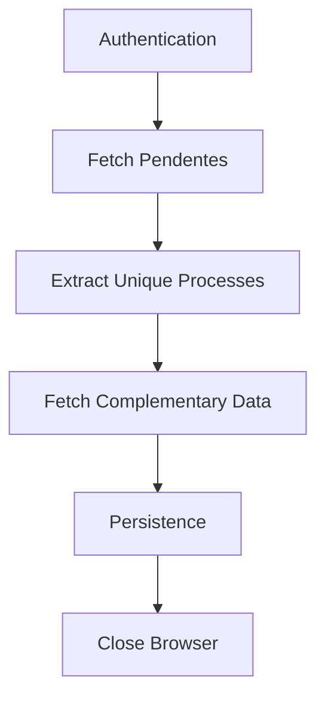
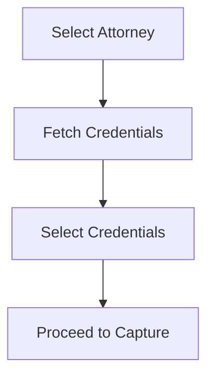

# Pendentes de Manifestação Capture

<cite>
**Referenced Files in This Document**   
- [pendentes-manifestacao.service.ts](file://backend/captura/services/trt/pendentes-manifestacao.service.ts)
- [captura-form-base.tsx](file://app/(dashboard)/captura/components/captura-form-base.tsx)
- [21_capturas.sql](file://supabase/schemas/21_capturas.sql)
- [test-api-pendentes-manifestacao.ts](file://scripts/api-pendentes-manifestacao/test-api-pendentes-manifestacao.ts)
- [route.ts](file://app/api/captura/trt/pendentes-manifestacao/route.ts)
- [listar-pendentes.service.ts](file://backend/expedientes/services/listar-pendentes.service.ts)
- [pendentes-persistence.service.ts](file://backend/captura/services/persistence/pendentes-persistence.service.ts)
- [types.ts](file://backend/types/expedientes/types.ts)
</cite>

## Table of Contents
1. [Introduction](#introduction)
2. [Pendentes de Manifestação Capture Service](#pendentes-de-manifestação-capture-service)
3. [Capture Form Base Component](#capture-form-base-component)
4. [Data Processing and Extraction](#data-processing-and-extraction)
5. [Database Persistence Strategy](#database-persistence-strategy)
6. [Testing and Validation](#testing-and-validation)
7. [Conclusion](#conclusion)

## Introduction

The Pendentes de Manifestação Capture feature enables the system to retrieve pending manifestation items from the PJE-TRT API. This documentation details the implementation of the capture process, including the service that interfaces with the PJE-TRT API, the adaptation of the capture form component, data processing, database persistence, and testing procedures.

**Section sources**
- [pendentes-manifestacao.service.ts](file://backend/captura/services/trt/pendentes-manifestacao.service.ts#L1-L456)

## Pendentes de Manifestação Capture Service

The `pendentesManifestacaoCapture` service in `pendentes-manifestacao.service.ts` orchestrates the capture of pending manifestation items from the PJE-TRT system. The service follows a six-phase optimized flow:

1. **Authentication**: Authenticates with the PJE system using the provided credentials.
2. **Fetch Pendentes**: Retrieves pending items via the PJE API.
3. **Extract Unique Processes**: Identifies unique process IDs from the pendentes.
4. **Fetch Complementary Data**: Retrieves additional data such as timelines and parties for each process.
5. **Persistence**: Saves data to the database in a specific order to maintain referential integrity.
6. **Close Browser**: Cleans up resources by closing the browser instance.

The service uses the `autenticarPJE` function to authenticate with the PJE system and then calls `obterTodosProcessosPendentesManifestacao` to fetch the pending items. It validates the results against totalizers to ensure data integrity.



**Diagram sources**
- [pendentes-manifestacao.service.ts](file://backend/captura/services/trt/pendentes-manifestacao.service.ts#L48-L456)

**Section sources**
- [pendentes-manifestacao.service.ts](file://backend/captura/services/trt/pendentes-manifestacao.service.ts#L48-L456)

## Capture Form Base Component

The `captura-form-base.tsx` component provides a base form structure for the capture process. It implements a two-step selection flow:

1. Select an attorney
2. Select credentials for the selected attorney

The component uses hooks to fetch attorneys with active credentials and credentials for the selected attorney. When the attorney selection changes, it clears the selected credentials to ensure data consistency.



**Diagram sources**
- [captura-form-base.tsx](file://app/(dashboard)/captura/components/captura-form-base.tsx#L1-L145)

**Section sources**
- [captura-form-base.tsx](file://app/(dashboard)/captura/components/captura-form-base.tsx#L1-L145)

## Data Processing and Extraction

The system processes pending items data by extracting key information such as legal deadline (prazo legal), responsible party information, and document metadata. The `ProcessoPendente` interface extends the base `Processo` type with additional fields specific to pending items:

- `idDocumento`: Document ID
- `dataCienciaParte`: Party awareness date
- `dataPrazoLegalParte`: Legal deadline date
- `dataCriacaoExpediente`: Expedient creation date
- `prazoVencido`: Boolean indicating if the deadline has expired
- `siglaOrgaoJulgador`: Judge body acronym

The service handles different manifestation types by using the `FILTRO_PRAZO_MAP` constant to map filter types to API parameters:
- `sem_prazo`: Expedients without a deadline (value 'I')
- `no_prazo`: Expedients within deadline (value 'N')

Deadline compliance is calculated by comparing the current date with the `dataPrazoLegalParte` field. The system also integrates with the notification system through the capture logging mechanism.

**Section sources**
- [pendentes-manifestacao.service.ts](file://backend/captura/services/trt/pendentes-manifestacao.service.ts#L97-L112)
- [types.ts](file://backend/types/expedientes/types.ts#L19-L25)

## Database Persistence Strategy

The persistence strategy for captured pendentes is defined in the `21_capturas.sql` schema file. The system uses two main tables:

1. **capturas_log**: Tracks capture history with fields for:
   - `tipo_captura`: Type of capture (e.g., 'pendentes')
   - `advogado_id`: Attorney ID
   - `credencial_ids`: Array of credential IDs used
   - `status`: Capture status (pending, in_progress, completed, failed)
   - `resultado`: JSONB field storing the capture result
   - `erro`: Error message if capture failed
   - `mongodb_id`: Reference to raw JSON in MongoDB
   - `iniciado_em` and `concluido_em`: Start and completion timestamps

2. **agendamentos**: Manages scheduled captures with fields for:
   - `tipo_captura`: Type of capture
   - `advogado_id`: Attorney ID
   - `credencial_ids`: Array of credential IDs
   - `periodicidade`: Frequency (daily or every N days)
   - `horario`: Execution time
   - `ativo`: Whether the schedule is active
   - `parametros_extras`: Additional parameters like date ranges and filterPrazo
   - `ultima_execucao` and `proxima_execucao`: Last and next execution timestamps

The system implements Row Level Security (RLS) policies to control access to these tables, allowing service roles full access and authenticated users read access.

```mermaid
erDiagram
capturas_log {
bigint id PK
tipo_captura tipo_captura
bigint advogado_id FK
bigint[] credencial_ids
status_captura status
jsonb resultado
text erro
text mongodb_id
timestamp with time zone iniciado_em
timestamp with time zone concluido_em
timestamp with time zone created_at
}
agendamentos {
bigint id PK
tipo_captura tipo_captura
bigint advogado_id FK
bigint[] credencial_ids
text periodicidade
integer dias_intervalo
time horario
boolean ativo
jsonb parametros_extras
timestamp with time zone ultima_execucao
timestamp with time zone proxima_execucao
timestamp with time zone created_at
timestamp with time zone updated_at
}
advogados ||--o{ capturas_log : "references"
advogados ||--o{ agendamentos : "references"
```

**Diagram sources**
- [21_capturas.sql](file://supabase/schemas/21_capturas.sql#L1-L104)

**Section sources**
- [21_capturas.sql](file://supabase/schemas/21_capturas.sql#L1-L104)

## Testing and Validation

The system includes a comprehensive test script in `test-api-pendentes-manifestacao.ts` that validates the capture functionality. The test script:

1. Loads environment variables from `.env.local`
2. Defines test parameters including attorney ID, degree, and API base URL
3. Contains a list of specific TRT and filter combinations that previously had errors
4. Tests each combination by making HTTP POST requests to the capture API
5. Records results and generates a summary report

The test script uses the `SERVICE_API_KEY` for authentication and simulates frontend requests by posting to the capture endpoint with specific parameters. It handles errors gracefully and provides detailed error messages for troubleshooting.

The test results are saved in a structured directory with timestamps, allowing for historical comparison and regression testing. The script also implements delays between tests to prevent overloading the system.

**Section sources**
- [test-api-pendentes-manifestacao.ts](file://scripts/api-pendentes-manifestacao/test-api-pendentes-manifestacao.ts#L1-L262)

## Conclusion

The Pendentes de Manifestação Capture feature provides a robust solution for retrieving and processing pending manifestation items from the PJE-TRT system. The implementation follows a well-structured approach with clear separation of concerns between authentication, data retrieval, processing, and persistence. The system includes comprehensive testing and logging capabilities to ensure reliability and facilitate troubleshooting.