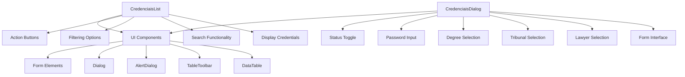
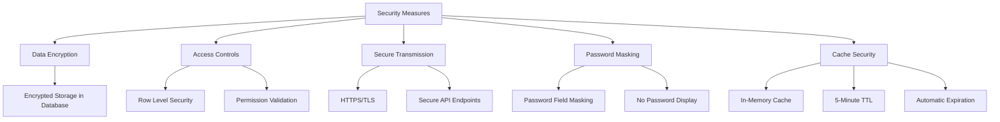
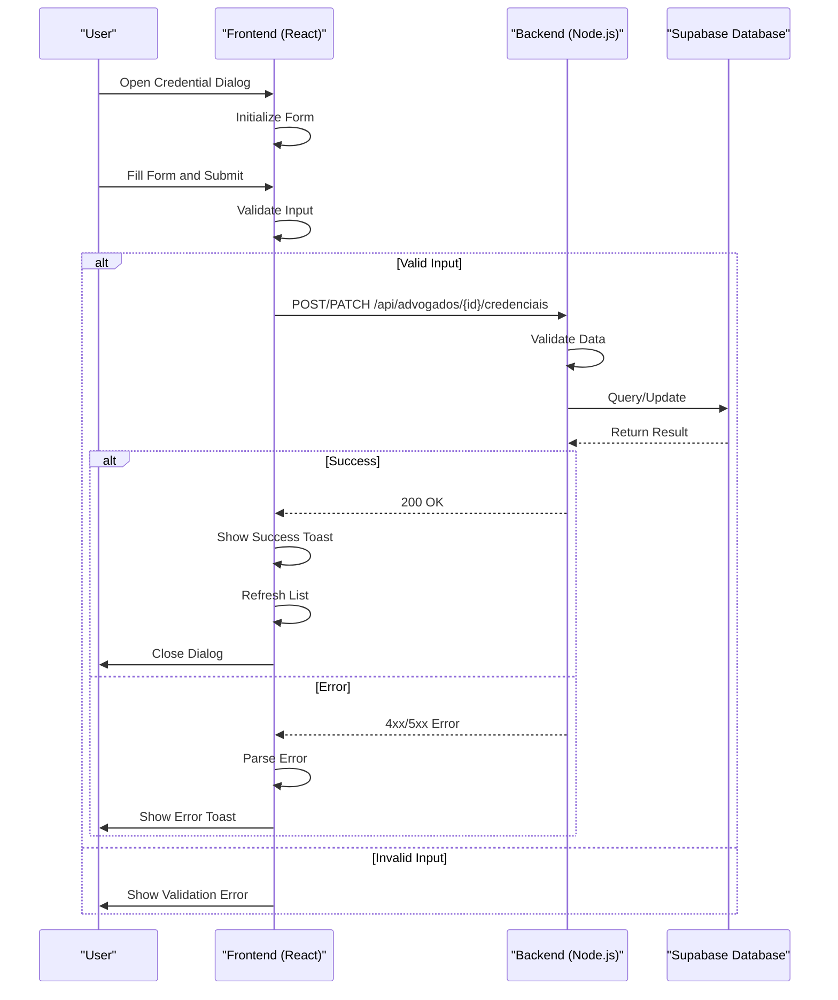
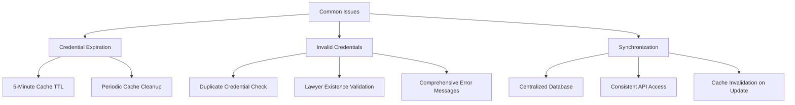

# Credential Management

<cite>
**Referenced Files in This Document**   
- [credenciais-list.tsx](file://app/(dashboard)/captura/components/credenciais/credenciais-list.tsx)
- [credenciais-dialog.tsx](file://app/(dashboard)/captura/components/credenciais/credenciais-dialog.tsx)
- [credential.service.ts](file://backend/captura/credentials/credential.service.ts)
- [credencial-persistence.service.ts](file://backend/advogados/services/persistence/credencial-persistence.service.ts)
- [credential-cache.service.ts](file://backend/captura/credentials/credential-cache.service.ts)
- [credenciais-columns.tsx](file://app/(dashboard)/captura/components/credenciais/credenciais-columns.tsx)
- [credenciais-toolbar-filters.tsx](file://app/(dashboard)/captura/components/credenciais/credenciais-toolbar-filters.tsx)
- [types.ts](file://backend/types/credenciais/types.ts)
</cite>

## Table of Contents
1. [Introduction](#introduction)
2. [Frontend Components](#frontend-components)
3. [Backend Services](#backend-services)
4. [Security Measures](#security-measures)
5. [Integration Between Frontend and Backend](#integration-between-frontend-and-backend)
6. [Common Issues and Solutions](#common-issues-and-solutions)
7. [Conclusion](#conclusion)

## Introduction
The Credential Management system in the Sinesys application enables users to securely manage credentials for accessing various tribunals (TRTs and TST). This system supports the creation, editing, and activation/deactivation of credentials associated with lawyers, ensuring secure access to tribunal systems for automated capture processes. The implementation includes both frontend UI components and backend services that handle credential operations, database interactions, caching, and security.

The system is designed to support multiple tribunals (TRT1 through TRT24 and TST) across different judicial degrees (first degree, second degree, and superior court), with proper validation, error handling, and user feedback mechanisms. Credentials are stored securely in the database with encryption, and access controls ensure that only authorized users can manage these sensitive data.

This document provides a comprehensive overview of the credential management system, covering the UI components, backend implementation, security measures, integration between frontend and backend, and solutions to common issues such as credential expiration and synchronization.

## Frontend Components

The frontend of the Credential Management system consists of two main components: `credenciais-list.tsx` for displaying credentials in a table format, and `credenciais-dialog.tsx` for creating and editing credentials. These components are built using React with TypeScript and leverage several UI components from the application's design system.

The `credenciais-list.tsx` component renders a data table that displays all credentials with columns for lawyer information, tribunal, degree, status, and creation date. It includes search functionality, filtering options, and action buttons for viewing lawyer details, editing credentials, and toggling credential status (active/inactive). The component uses React hooks for state management and data fetching, with debounced search to improve performance.

The `credenciais-dialog.tsx` component provides a form interface for creating new credentials or editing existing ones. It includes fields for selecting a lawyer, choosing a tribunal and degree, entering a password, and setting the credential status. The form includes validation to ensure all required fields are filled before submission, with appropriate error messages displayed using toast notifications.



**Diagram sources**
- [credenciais-list.tsx](file://app/(dashboard)/captura/components/credenciais/credenciais-list.tsx)
- [credenciais-dialog.tsx](file://app/(dashboard)/captura/components/credenciais/credenciais-dialog.tsx)

**Section sources**
- [credenciais-list.tsx](file://app/(dashboard)/captura/components/credenciais/credenciais-list.tsx)
- [credenciais-dialog.tsx](file://app/(dashboard)/captura/components/credenciais/credenciais-dialog.tsx)

## Backend Services

The backend implementation of the Credential Management system consists of several services that handle credential operations and database interactions. The primary services are `credential.service.ts` for business logic and `credencial-persistence.service.ts` for database operations.

The `credential.service.ts` file contains functions for retrieving credentials from the database, with support for various query patterns. It includes methods for getting a credential by ID, by tribunal and degree combination, and for retrieving all active credentials for a specific tribunal and degree. These functions use Supabase as the database client and include proper error handling and logging.

A key feature of the credential service is its integration with a caching system implemented in `credential-cache.service.ts`. This cache stores credentials in memory to reduce database queries, especially when processing multiple tribunal captures. The cache has a TTL (Time To Live) of 5 minutes, after which entries expire and are automatically removed. The service first checks the cache before querying the database, significantly improving performance for frequently accessed credentials.

The `credencial-persistence.service.ts` file handles all database operations for credentials, including creation, reading, updating, and deletion (CRUD operations). When creating a new credential, it validates that the associated lawyer exists and checks for duplicate active credentials with the same tribunal and degree combination. For updates, it performs similar validation to prevent conflicts. The service returns credentials without passwords for security reasons, ensuring that sensitive data is not exposed in API responses.

```mermaid
classDiagram
class CredentialService {
+getCredential(params)
+getCredentialByTribunalAndGrau(params)
+getActiveCredentialsByTribunalAndGrau(tribunal, grau)
+getCredentialComplete(credentialId)
+validateCredential(credentialId)
+getAdvogadoByCredentialId(credentialId)
}
class CredentialPersistenceService {
+criarCredencial(params)
+buscarCredencial(id)
+atualizarCredencial(id, params)
+listarCredenciais(params)
}
class CredentialCacheService {
+getFromCache(advogadoId, tribunal, grau)
+setCache(advogadoId, tribunal, grau, credential)
+getCredentialsBatch(advogadoId, combinations)
+clearCredentialCache()
+cleanExpiredCache()
+getCacheStats()
}
CredentialService --> CredentialCacheService : "uses"
CredentialService --> CredentialPersistenceService : "delegates to"
CredentialPersistenceService --> "Supabase Database" : "queries"
```

**Diagram sources**
- [credential.service.ts](file://backend/captura/credentials/credential.service.ts)
- [credencial-persistence.service.ts](file://backend/advogados/services/persistence/credencial-persistence.service.ts)
- [credential-cache.service.ts](file://backend/captura/credentials/credential-cache.service.ts)

**Section sources**
- [credential.service.ts](file://backend/captura/credentials/credential.service.ts)
- [credencial-persistence.service.ts](file://backend/advogados/services/persistence/credencial-persistence.service.ts)

## Security Measures

The Credential Management system implements several security measures to protect sensitive credential information. These measures include data encryption, access controls, secure transmission, and proper handling of sensitive data in both frontend and backend components.

Credentials are stored in the database with encryption, ensuring that even if the database is compromised, the actual passwords cannot be easily retrieved. The system uses Supabase's built-in security features, including Row Level Security (RLS) policies that restrict access to credential data based on user roles and permissions. Only authorized users with appropriate permissions can access or modify credential information.

In the backend, the `credential.service.ts` file implements additional security checks when retrieving credentials. When a user ID is provided (for frontend requests), the service can validate permissions to ensure the user has access to the requested credential. For system jobs, a special 'system' user ID bypasses certain validation checks while still maintaining security through service role access.

The frontend components follow security best practices by never displaying passwords in plain text. In the `credenciais-dialog.tsx` component, password fields are masked using the HTML `type="password"` attribute. When editing existing credentials, the password field is left empty by default, and users must explicitly enter a new password if they want to change it. This prevents accidental exposure of existing passwords.

The caching system in `credential-cache.service.ts` also considers security by storing credentials in memory rather than in persistent storage. The cache has a limited TTL of 5 minutes, after which entries expire and are removed. This reduces the window of opportunity for potential attacks that might try to access credentials from memory.



**Diagram sources**
- [credential.service.ts](file://backend/captura/credentials/credential.service.ts)
- [credencial-persistence.service.ts](file://backend/advogados/services/persistence/credencial-persistence.service.ts)
- [credential-cache.service.ts](file://backend/captura/credentials/credential-cache.service.ts)

**Section sources**
- [credential.service.ts](file://backend/captura/credentials/credential.service.ts)
- [credencial-persistence.service.ts](file://backend/advogados/services/persistence/credencial-persistence.service.ts)

## Integration Between Frontend and Backend

The integration between the frontend and backend components of the Credential Management system is achieved through a well-defined API contract and consistent data flow patterns. The frontend components communicate with backend services through API endpoints that follow REST principles, using HTTP methods to perform CRUD operations on credentials.

When a user creates or edits a credential through the `credenciais-dialog.tsx` component, the frontend sends a POST or PATCH request to the appropriate API endpoint with the credential data in JSON format. The request includes headers specifying the content type and authentication tokens. The backend processes the request, validates the data, and returns a response indicating success or failure.

Form validation is implemented on both the frontend and backend to ensure data integrity. The frontend performs basic validation to provide immediate feedback to users, such as requiring all fields to be filled before submission. The backend performs more comprehensive validation, including checking for duplicate credentials and ensuring the associated lawyer exists in the database. Error messages from the backend are propagated to the frontend and displayed using toast notifications.

Success states are handled through callback functions passed from parent components to the dialog. When a credential operation succeeds, the backend returns a success response, which triggers the onSuccess callback in the dialog component. This callback typically refreshes the credential list and closes the dialog, providing a seamless user experience.

The system also handles loading states and error conditions gracefully. During credential operations, the dialog displays a spinner to indicate that the request is being processed, preventing multiple submissions. If an error occurs, detailed error messages are displayed to help users understand what went wrong and how to resolve it.



**Diagram sources**
- [credenciais-dialog.tsx](file://app/(dashboard)/captura/components/credenciais/credenciais-dialog.tsx)
- [credential.service.ts](file://backend/captura/credentials/credential.service.ts)
- [credencial-persistence.service.ts](file://backend/advogados/services/persistence/credencial-persistence.service.ts)

**Section sources**
- [credenciais-dialog.tsx](file://app/(dashboard)/captura/components/credenciais/credenciais-dialog.tsx)
- [credential.service.ts](file://backend/captura/credentials/credential.service.ts)

## Common Issues and Solutions

The Credential Management system addresses several common issues related to credential management, including credential expiration, invalid credentials, and synchronization between multiple systems. These issues are handled through a combination of technical solutions and user interface features.

Credential expiration is managed through the caching system's TTL mechanism. By setting a 5-minute TTL on cached credentials, the system ensures that updated credentials are reflected within a reasonable timeframe. The `cleanExpiredCache()` function periodically removes expired entries, freeing up memory and ensuring that stale credentials are not used in capture processes.

Invalid credentials are handled through comprehensive validation at multiple levels. When creating or updating a credential, the system checks that the associated lawyer exists and that there are no duplicate active credentials for the same tribunal and degree combination. This prevents configuration errors that could lead to failed capture attempts. The frontend provides immediate feedback through validation messages, while the backend returns detailed error information for debugging.

Synchronization between multiple systems is achieved through the use of a centralized credential store in the Supabase database. All components of the system, including frontend interfaces and backend jobs, access credentials through the same API, ensuring consistency across the application. The caching layer further enhances synchronization by providing a consistent view of credentials across multiple requests within the TTL period.

The system also includes solutions for handling credential status changes. Users can activate or deactivate credentials through the UI, which immediately updates the database and invalidates the cache entry. This ensures that deactivated credentials are not used in automated capture processes, while allowing users to quickly reactivate them when needed.



**Diagram sources**
- [credential-cache.service.ts](file://backend/captura/credentials/credential-cache.service.ts)
- [credencial-persistence.service.ts](file://backend/advogados/services/persistence/credencial-persistence.service.ts)
- [credential.service.ts](file://backend/captura/credentials/credential.service.ts)

**Section sources**
- [credential-cache.service.ts](file://backend/captura/credentials/credential-cache.service.ts)
- [credencial-persistence.service.ts](file://backend/advogados/services/persistence/credencial-persistence.service.ts)

## Conclusion
The Credential Management system in the Sinesys application provides a comprehensive solution for managing tribunal access credentials with a strong focus on security, usability, and reliability. The system's architecture separates concerns between frontend UI components and backend services, enabling maintainable and scalable code.

Key strengths of the implementation include the use of caching to improve performance, comprehensive validation to prevent errors, and robust security measures to protect sensitive credential information. The integration between frontend and backend is well-designed, with clear API contracts and consistent error handling.

The system effectively addresses common issues such as credential expiration and synchronization through technical solutions like TTL-based caching and centralized data storage. Future enhancements could include additional security features such as multi-factor authentication for credential access, more granular permission controls, and enhanced monitoring and alerting for credential usage.

Overall, the Credential Management system demonstrates a mature approach to handling sensitive data in a web application, balancing security requirements with user experience considerations. The codebase shows attention to detail in both implementation and documentation, making it easier for developers to understand and maintain the system over time.