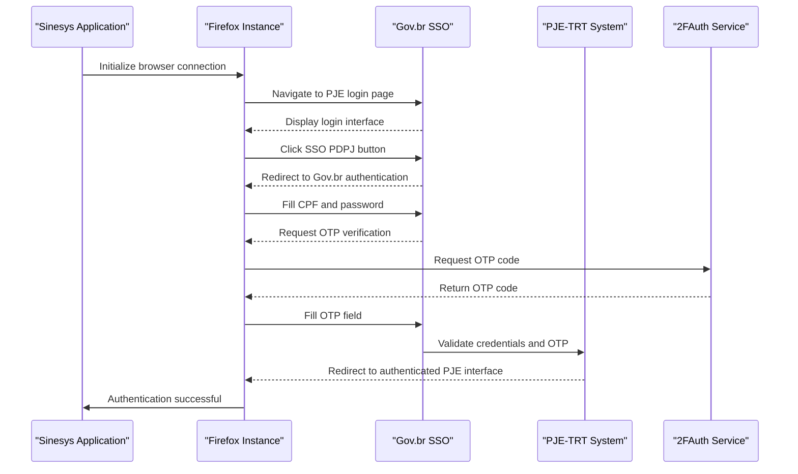
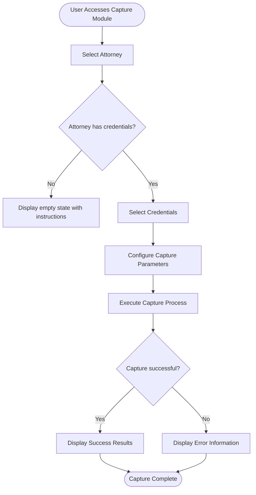
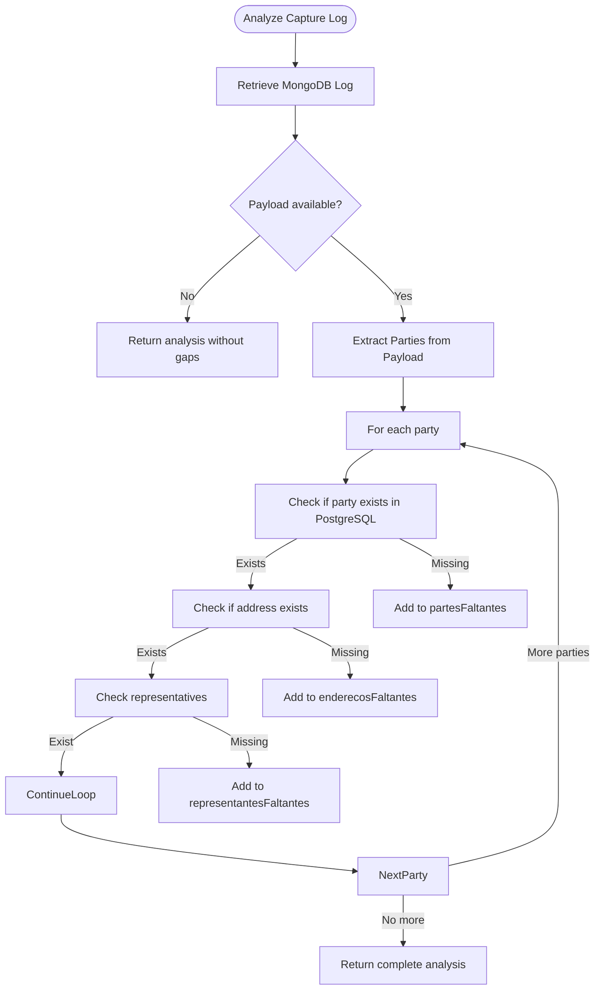
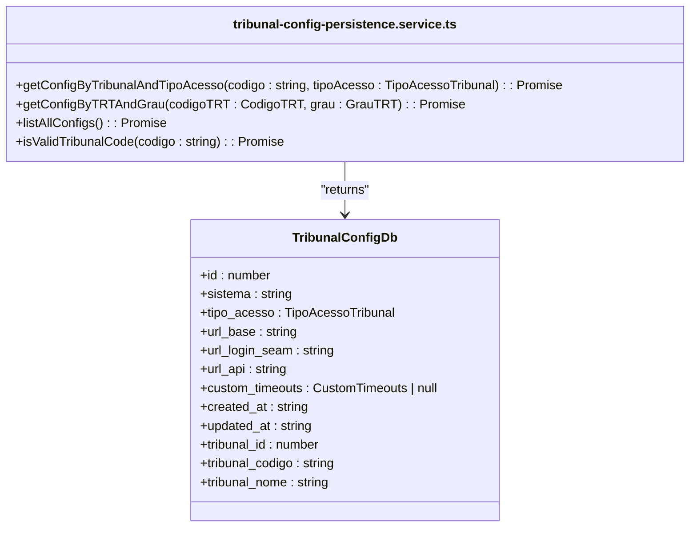
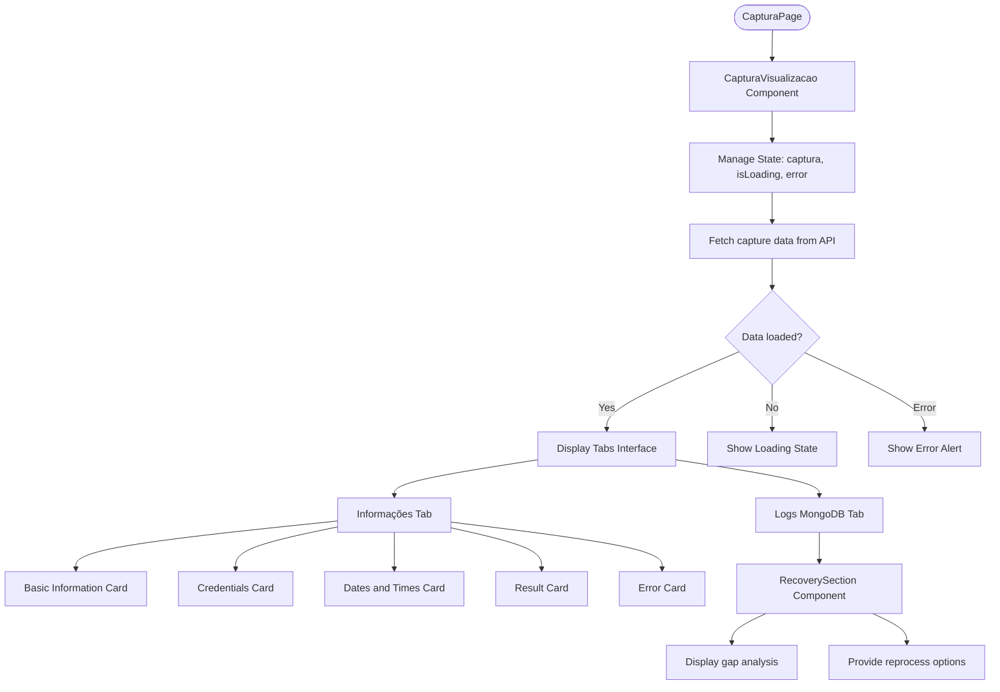

# Data Capture Module

<cite>
**Referenced Files in This Document**   
- [captura-form-base.tsx](file://app/(dashboard)/captura/components/captura-form-base.tsx)
- [agendamento-scheduler.service.ts](file://backend/captura/services/scheduler/agendamento-scheduler.service.ts)
- [recovery-analysis.service.ts](file://backend/captura/services/recovery/recovery-analysis.service.ts)
- [tribunal-config-persistence.service.ts](file://backend/captura/services/persistence/tribunal-config-persistence.service.ts)
- [trt-auth.service.ts](file://backend/captura/services/trt/trt-auth.service.ts)
- [browser-connection.service.ts](file://backend/captura/services/browser/browser-connection.service.ts)
- [acervo-geral-form.tsx](file://app/(dashboard)/captura/components/acervo-geral-form.tsx)
- [audiencias-form.tsx](file://app/(dashboard)/captura/components/audiencias-form.tsx)
- [pendentes-form.tsx](file://app/(dashboard)/captura/components/pendentes-form.tsx)
- [historico/[id]/page.tsx](file://app/(dashboard)/captura/historico/[id]/page.tsx)
- [captura-visualizacao.tsx](file://app/(dashboard)/captura/historico/[id]/captura-visualizacao.tsx)
</cite>

## Table of Contents
1. [Introduction](#introduction)
2. [PJE-TRT Integration Architecture](#pje-trt-integration-architecture)
3. [Capture Workflow and Types](#capture-workflow-and-types)
4. [Credential Management](#credential-management)
5. [Scheduled Captures with agendamento-scheduler.service.ts](#scheduled-captures-with-agendamento-schedulerservicets)
6. [Error Handling and Reprocessing with recovery-analysis.service.ts](#error-handling-and-reprocessing-with-recovery-analysisservicets)
7. [Tribunal Configuration Management](#tribunal-configuration-management)
8. [Capture History Interface](#capture-history-interface)
9. [Common Issues and Solutions](#common-issues-and-solutions)

## Introduction

The Data Capture Module in the Sinesys application is responsible for extracting data from the PJE-TRT (Processo Judicial Eletrônico - Tribunal Regional do Trabalho) system through browser automation. This module enables legal professionals to automatically capture case data, hearings, pending matters, and general inventory information from the PJE platform. The system integrates advanced browser automation using Puppeteer/Playwright, secure credential management, scheduled execution capabilities, and robust error recovery mechanisms to ensure reliable data extraction.

The module supports multiple capture types including acervo-geral (general inventory), audiencias (hearings), and pendentes-manifestacao (pending matters requiring manifestation). It features a comprehensive history interface that allows users to review past captures, analyze results, and reprocess failed attempts. The architecture is designed to handle the complexities of PJE authentication, including two-factor authentication via OTP, while maintaining compliance with security best practices.

This documentation provides a detailed explanation of the module's architecture, implementation, and operational characteristics, focusing on the integration with PJE-TRT, the capture workflow, and the various services that support reliable data extraction.

**Section sources**
- [captura-form-base.tsx](file://app/(dashboard)/captura/components/captura-form-base.tsx)
- [historico/[id]/page.tsx](file://app/(dashboard)/captura/historico/[id]/page.tsx)

## PJE-TRT Integration Architecture

The PJE-TRT integration architecture in the Sinesys application employs browser automation to interact with the PJE-TRT web interface, overcoming the lack of a public API for data access. The system uses Playwright for browser automation, enabling programmatic control of Firefox instances to navigate the PJE-TRT platform, authenticate users, and extract data.

The integration follows a layered architecture with distinct components for browser management, authentication, and data capture. At the core is the browser automation layer, which manages connections to Firefox instances either locally or through a remote browser server. This layer abstracts the complexity of browser management, providing a consistent interface for the authentication and capture services.

The authentication process is implemented in the `trt-auth.service.ts` file and follows a multi-step workflow to authenticate with the PJE-TRT system. The process begins with navigating to the login page and clicking the SSO PDPJ button to initiate the government authentication flow. The system then fills in the user's CPF and password credentials before submitting the login form.

A critical aspect of the authentication process is handling two-factor authentication (2FA). The system integrates with a 2FAuth service to obtain time-based one-time passwords (TOTP) required for PJE-TRT authentication. When the OTP field appears, the system retrieves the current OTP code from the 2FAuth service and fills it into the appropriate field. The implementation includes retry logic to handle cases where the initial OTP code expires during submission, automatically attempting with the next valid code if available.



**Diagram sources**
- [trt-auth.service.ts](file://backend/captura/services/trt/trt-auth.service.ts)
- [browser-connection.service.ts](file://backend/captura/services/browser/browser-connection.service.ts)

**Section sources**
- [trt-auth.service.ts](file://backend/captura/services/trt/trt-auth.service.ts)
- [browser-connection.service.ts](file://backend/captura/services/browser/browser-connection.service.ts)

## Capture Workflow and Types

The capture workflow in the Sinesys application follows a standardized process across different capture types, with variations in the specific data extracted and parameters used. The workflow begins with user selection of an attorney and credentials, followed by configuration of capture parameters, execution of the capture process, and display of results.

The `captura-form-base.tsx` component implements the foundational structure for all capture forms, establishing a two-step selection process. Users first select an attorney from a combobox populated with attorneys who have active credentials. Once an attorney is selected, the form dynamically loads the available credentials for that attorney, allowing the user to select one or more credentials for the capture process.



**Diagram sources**
- [captura-form-base.tsx](file://app/(dashboard)/captura/components/captura-form-base.tsx)

The module supports several specialized capture types, each implemented as a separate form component that extends the base capture form:

**Acervo Geral Capture**
The acervo-geral (general inventory) capture type extracts comprehensive case information from the PJE-TRT system. Implemented in `acervo-geral-form.tsx`, this capture type focuses on retrieving all cases associated with the selected credentials. The form provides a simple interface with the base attorney and credential selection, without additional parameters, as the capture process is designed to retrieve all available inventory data.

**Audiencias Capture**
The audiencias (hearings) capture type, implemented in `audiencias-form.tsx`, retrieves information about scheduled hearings. This form extends the base capture form with additional parameters including hearing status (scheduled, canceled, or completed), start date, and end date. Users can specify a date range for hearing retrieval, with defaults set to the current date for the start and one year in the future for the end date.

**Pendentes de Manifestação Capture**
The pendentes-manifestacao (pending matters requiring manifestation) capture type, implemented in `pendentes-form.tsx`, focuses on retrieving cases that require action from the represented party. This form includes a filter selection for pending matters, allowing users to choose between "sem_prazo" (without deadline) and "no_prazo" (with deadline) categories. The filters are processed sequentially, first retrieving matters without deadlines and then those with deadlines.

Each capture type follows the same execution pattern: validating user selections, calling the appropriate API endpoint with the selected parameters, handling the asynchronous response, and displaying the results to the user. The forms include loading states during capture execution and provide clear success or error feedback upon completion.

**Section sources**
- [captura-form-base.tsx](file://app/(dashboard)/captura/components/captura-form-base.tsx)
- [acervo-geral-form.tsx](file://app/(dashboard)/captura/components/acervo-geral-form.tsx)
- [audiencias-form.tsx](file://app/(dashboard)/captura/components/audiencias-form.tsx)
- [pendentes-form.tsx](file://app/(dashboard)/captura/components/pendentes-form.tsx)

## Credential Management

Credential management in the Sinesys application is implemented through a structured system that securely stores and manages attorney credentials for PJE-TRT access. The system follows a hierarchical approach where attorneys can have multiple credentials, each representing different login information for various TRT jurisdictions.

The frontend interface for credential management is accessible through the `/captura/credenciais` route and provides a comprehensive interface for viewing, creating, and managing credentials. The `credenciais-list.tsx` component displays a table of all credentials with filtering capabilities by attorney and status. Each credential entry shows the attorney name, TRT code, credential status, and last usage information.

The credential selection process is tightly integrated with the capture workflow through the `CapturaFormBase` component. When a user begins a capture process, they first select an attorney from the `AdvogadoCombobox`, which only displays attorneys who have at least one active credential. This ensures that users cannot initiate a capture process without available credentials.

Once an attorney is selected, the form automatically loads the available credentials for that attorney through the `useCredenciais` hook. The credentials are displayed in a `CredenciaisCombobox` that allows multi-selection, enabling users to perform captures across multiple TRT jurisdictions simultaneously. The component includes validation to ensure that only credentials belonging to the selected attorney remain selected when switching attorneys.

The backend stores credential information in the `credenciais` table with fields for CPF, password, TRT code, and status. The system implements credential status tracking to identify active, inactive, or suspended credentials based on recent usage and authentication success rates. This allows the system to warn users about potentially invalid credentials before initiating a capture process.

The credential management system also handles the relationship between credentials and attorneys through foreign key constraints in the database schema. This ensures data integrity and enables efficient querying of credentials by attorney, which is essential for the credential selection interface in the capture forms.

**Section sources**
- [captura-form-base.tsx](file://app/(dashboard)/captura/components/captura-form-base.tsx)
- [credenciais-list.tsx](file://app/(dashboard)/captura/components/credenciais/credenciais-list.tsx)
- [credenciais-combobox.tsx](file://app/(dashboard)/captura/components/credenciais-combobox.tsx)

## Scheduled Captures with agendamento-scheduler.service.ts

The scheduled capture functionality in the Sinesys application is managed by the `agendamento-scheduler.service.ts` file, which implements a periodic scheduler for automated capture execution. This service enables users to set up recurring captures that run automatically at specified intervals, reducing the need for manual intervention.

The scheduler operates as a background service that should be called periodically (e.g., every minute) to check for captures that are ready to execute. The `executarScheduler` function is the main entry point for the scheduler and follows a sequential processing approach to handle multiple scheduled captures.

The scheduling workflow begins with querying the database for all scheduled captures that are due for execution. The `buscarAgendamentosParaExecutar` function retrieves these records, which contain information about the capture type, parameters, schedule configuration, and next execution time. If no scheduled captures are found, the scheduler logs this information and terminates gracefully.

When scheduled captures are identified, the system processes each one sequentially to avoid overwhelming system resources or triggering rate limiting on the PJE-TRT system. For each scheduled capture, the system calls the `executarAgendamento` function, which handles the actual capture process using the stored parameters. The scheduler includes error handling that allows it to continue processing subsequent scheduled captures even if one fails, ensuring that a single failure does not prevent other captures from executing.

```mermaid
sequenceDiagram
participant Scheduler as "agendamento-scheduler.service.ts"
participant DB as "Database"
participant Executor as "executar-agendamento.service.ts"
Scheduler->>DB : buscarAgendamentosParaExecutar()
DB-->>Scheduler : Return scheduled captures
Scheduler->>Scheduler : Check if captures exist
alt No captures scheduled
Scheduler->>Scheduler : Log "No captures ready"
Scheduler-->>End : Exit
else Captures ready
loop For each scheduled capture
Scheduler->>Executor : executarAgendamento(agendamento)
Executor-->>Scheduler : Return execution result
Scheduler->>Scheduler : Log execution status
alt Execution failed
Scheduler->>Scheduler : Log error, continue to next
end
end
Scheduler->>Scheduler : Log processing complete
end
```

**Diagram sources**
- [agendamento-scheduler.service.ts](file://backend/captura/services/scheduler/agendamento-scheduler.service.ts)

The scheduler updates the next execution time for each capture after successful completion, based on the configured recurrence pattern (daily, weekly, monthly, etc.). This ensures that captures continue to run at the specified intervals. The service includes comprehensive logging at each step, providing visibility into the scheduler's operation and facilitating troubleshooting of any issues.

The scheduling system is designed to be resilient to failures, with error boundaries that prevent a single problematic scheduled capture from disrupting the entire scheduling process. Each capture execution is wrapped in a try-catch block, allowing the scheduler to log errors and continue processing subsequent captures. This fault tolerance is essential for maintaining reliable automated data extraction over extended periods.

**Section sources**
- [agendamento-scheduler.service.ts](file://backend/captura/services/scheduler/agendamento-scheduler.service.ts)

## Error Handling and Reprocessing with recovery-analysis.service.ts

The error handling and reprocessing system in the Sinesys application is implemented through the `recovery-analysis.service.ts` file, which provides comprehensive analysis and recovery capabilities for failed or incomplete captures. This service addresses the challenge of ensuring data integrity when captures fail due to authentication issues, network problems, or other transient errors.

The recovery analysis service performs gap detection by comparing raw capture logs stored in MongoDB with the data that has been successfully persisted in the PostgreSQL database. The `analisarCaptura` function is the primary entry point for analysis, taking a MongoDB document ID and returning a detailed analysis of any missing data elements. The service first retrieves the raw capture log, which contains the complete payload from the PJE-TRT system, including all case data, parties, addresses, and representatives.

The analysis process identifies three types of gaps: missing parties, missing addresses, and missing representatives. For each party in the raw payload, the service checks whether the corresponding record exists in the PostgreSQL database. If a party is missing, it is flagged as a gap. Similarly, the service verifies that addresses and representatives associated with parties have been properly persisted. The analysis accounts for different data structures in the PJE-TRT response, handling both array-based and object-based payload formats.



**Diagram sources**
- [recovery-analysis.service.ts](file://backend/captura/services/recovery/recovery-analysis.service.ts)

The service includes specialized functions for identifying the entity type (client, opposing party, or third party) based on the party's role in the case (active or passive pole) and type designation. This classification is essential for determining the correct database table for persistence and ensuring that parties are categorized appropriately in the application.

For recovery operations, the service provides the `extrairTodosElementos` function, which extracts all elements from a capture log and verifies their persistence status. This comprehensive extraction enables targeted reprocessing of specific data elements rather than re-running an entire capture process. The function returns detailed information about each element, including its raw data, persistence status, and any associated errors, providing a complete picture of the recovery requirements.

The recovery system also includes aggregated analysis capabilities through the `analisarGapsAgregado` function, which can analyze multiple capture logs to identify patterns in data persistence failures. This aggregate analysis helps identify systemic issues that may affect multiple captures, such as problems with specific TRT configurations or credential sets.

**Section sources**
- [recovery-analysis.service.ts](file://backend/captura/services/recovery/recovery-analysis.service.ts)

## Tribunal Configuration Management

Tribunal configuration management in the Sinesys application is handled by the `tribunal-config-persistence.service.ts` file, which provides a centralized system for managing configuration data for different TRT jurisdictions. This service enables the application to support multiple TRT systems with varying URLs, authentication methods, and technical requirements.

The configuration system is implemented as a persistence service that interacts with the `tribunais_config` table in the PostgreSQL database. This table contains configuration parameters for each tribunal, including the base URL, login URL, API endpoint, system identifier, and custom timeouts. The service uses a service-level Supabase client to bypass Row Level Security (RLS) policies, ensuring that configuration data can be accessed by backend services without permission constraints.

The primary function `getConfigByTribunalAndTipoAcesso` retrieves configuration data for a specific tribunal and access type. The function performs a database query with a JOIN operation between the `tribunais_config` and `tribunais` tables, allowing it to return both configuration parameters and tribunal metadata (code and name) in a single response. The service includes defensive programming practices, such as handling cases where the tribunal data is incomplete or malformed, to ensure robust operation even with inconsistent data.



**Diagram sources**
- [tribunal-config-persistence.service.ts](file://backend/captura/services/persistence/tribunal-config-persistence.service.ts)

The service provides several utility functions to support different use cases. The `getConfigByTRTAndGrau` function maps tribunal degree (first degree, second degree, superior tribunal) to access type, simplifying configuration retrieval for TRT-specific captures. The `listAllConfigs` function returns all available tribunal configurations, which is useful for administrative interfaces and system diagnostics. The `isValidTribunalCode` function provides a quick validation mechanism to check if a tribunal code has an active configuration, enabling efficient filtering of available options in user interfaces.

The configuration system supports custom timeouts through the `custom_timeouts` field, allowing different TRT systems to have tailored timeout settings based on their performance characteristics. This flexibility is essential for accommodating the varying response times of different tribunal systems, preventing premature timeouts during data extraction.

The service's error handling is designed to be resilient, with specific handling for the "PGRST116" error code which indicates a record not found condition. Instead of throwing an error, the service returns null in this case, allowing calling code to handle the absence of configuration gracefully. For other database errors, the service throws descriptive error messages that include the tribunal code and access type, facilitating troubleshooting of configuration issues.

**Section sources**
- [tribunal-config-persistence.service.ts](file://backend/captura/services/persistence/tribunal-config-persistence.service.ts)

## Capture History Interface

The capture history interface in the Sinesys application provides a comprehensive view of past capture operations, allowing users to review results, analyze performance, and manage capture records. The interface is accessible through the `/captura/historico` route and features a detailed view for individual captures at the `/captura/historico/[id]` route.

The history list interface displays a table of all previous captures with filtering and sorting capabilities. Each capture record shows essential information including the capture ID, type, status, attorney, credentials used, and timestamps for initiation and completion. Users can filter captures by status (pending, in progress, completed, failed), capture type, attorney, and date range, enabling efficient navigation of historical data.

The detailed capture view, implemented in `captura-visualizacao.tsx`, provides an in-depth analysis of a specific capture operation. The interface is organized into tabs that separate different types of information. The "Informações" (Information) tab displays metadata from the PostgreSQL database, including basic capture details, credentials used, timestamps, and the structured result or error message.



**Diagram sources**
- [captura-visualizacao.tsx](file://app/(dashboard)/captura/historico/[id]/captura-visualizacao.tsx)
- [page.tsx](file://app/(dashboard)/captura/historico/[id]/page.tsx)

The "Logs MongoDB" tab, implemented by the `RecoverySection` component, provides access to the raw capture logs stored in MongoDB. This tab integrates with the recovery analysis service to display gap analysis results, showing missing parties, addresses, and representatives. The interface includes a reprocessing dialog that allows users to initiate recovery operations for identified gaps, enabling targeted data retrieval without re-running the entire capture process.

The detailed view includes a header with breadcrumb navigation and a delete button that allows users to remove capture records they no longer need. The delete operation is protected by a confirmation dialog to prevent accidental data loss. The interface also includes a back button that returns users to the capture history list.

The page component `page.tsx` implements server-side rendering for the metadata, generating appropriate page titles and descriptions based on the capture ID. This improves SEO and user experience by providing meaningful information in browser tabs and search results. The component includes input validation to ensure that the capture ID is a valid number, returning a 404 error for invalid IDs.

The capture visualization component uses React hooks to manage state and side effects, including fetching data from the API, handling loading and error states, and managing tab selection. The component implements cleanup logic to abort pending requests when the component unmounts or the capture ID changes, preventing memory leaks and ensuring that state updates are applied to the correct component instance.

**Section sources**
- [captura-visualizacao.tsx](file://app/(dashboard)/captura/historico/[id]/captura-visualizacao.tsx)
- [page.tsx](file://app/(dashboard)/captura/historico/[id]/page.tsx)

## Common Issues and Solutions

The Data Capture Module in the Sinesys application addresses several common issues encountered when integrating with the PJE-TRT system. These issues range from authentication failures to rate limiting and inconsistent response formats, with solutions implemented throughout the codebase to ensure reliable operation.

**Authentication Failures with PJE**
Authentication failures are one of the most common issues in PJE-TRT integration. The system implements multiple strategies to handle these failures. The authentication service includes retry logic for network errors that may occur when clicking the SSO PDPJ button, with up to three attempts and exponential backoff. For OTP (one-time password) validation, the system implements a dual-code strategy, obtaining both the current and next OTP codes from the 2FAuth service. If the current code fails validation, the system automatically attempts with the next code, accounting for potential timing issues between code generation and submission.

The system also handles cookie-related authentication issues by implementing a robust cookie detection mechanism. The `obterIdAdvogado` function includes a 20-second polling loop to detect the `access_token` cookie, with additional retry logic if the cookie is not immediately available. The function checks cookies across different domains (including base hostname and current hostname) to accommodate variations in PJE-TRT's cookie setting behavior.

**Rate Limiting**
To address rate limiting concerns with the PJE-TRT system, the capture module implements several mitigation strategies. The scheduled capture system processes captures sequentially rather than in parallel, preventing the system from making multiple simultaneous requests to PJE-TRT. The browser automation layer includes configurable timeouts and delays between actions, allowing the system to operate at a pace that minimizes the risk of triggering rate limiting mechanisms.

The tribunal configuration system supports custom timeouts for different TRT jurisdictions, enabling the system to adapt to the performance characteristics of each tribunal. This prevents premature timeouts during data retrieval, which could otherwise lead to repeated failed attempts that might trigger rate limiting.

**Handling Different Tribunal Response Formats**
The PJE-TRT system exhibits variations in response formats across different TRT jurisdictions and over time. The data processing system implements flexible payload extraction to handle these variations. The `extrairPartesDoPayload` function in the recovery analysis service supports multiple payload structures, including array-based formats, object-based formats with ATIVO/PASSIVO properties, and nested structures with partes, data, or content fields.

The system also handles variations in field naming conventions, checking multiple possible field names for critical data elements like CPF/CNPJ, party names, and contact information. This defensive programming approach ensures that the system can process data even when field names change between PJE-TRT updates or differ between TRT jurisdictions.

**Browser Automation Reliability**
The browser automation layer includes several features to improve reliability. The system implements anti-detection measures to prevent the PJE-TRT system from identifying automated access. These measures include modifying navigator properties to remove webdriver flags, setting realistic plugins arrays, and configuring Portuguese Brazilian as the primary language.

The browser connection service supports both remote and local browser instances, with automatic fallback to local Firefox if the remote browser server is unavailable. This ensures that capture operations can continue even if the primary browser automation infrastructure experiences issues.

**Data Persistence and Recovery**
To address data persistence issues, the system implements a dual-storage approach with raw logs in MongoDB and processed data in PostgreSQL. This separation allows for comprehensive recovery operations when data fails to persist correctly. The recovery analysis service can compare the raw capture data with the persisted data to identify exactly which elements failed to save, enabling targeted reprocessing rather than complete capture re-execution.

The system also implements transactional integrity for critical operations, ensuring that related data elements are persisted together or not at all. This prevents partial data persistence that could lead to inconsistent application state.

**Section sources**
- [trt-auth.service.ts](file://backend/captura/services/trt/trt-auth.service.ts)
- [recovery-analysis.service.ts](file://backend/captura/services/recovery/recovery-analysis.service.ts)
- [browser-connection.service.ts](file://backend/captura/services/browser/browser-connection.service.ts)