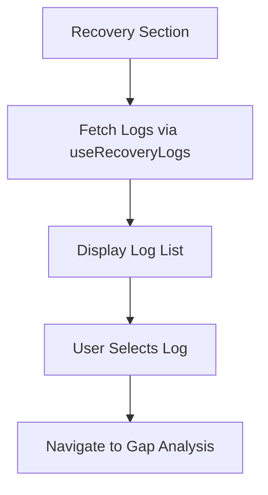
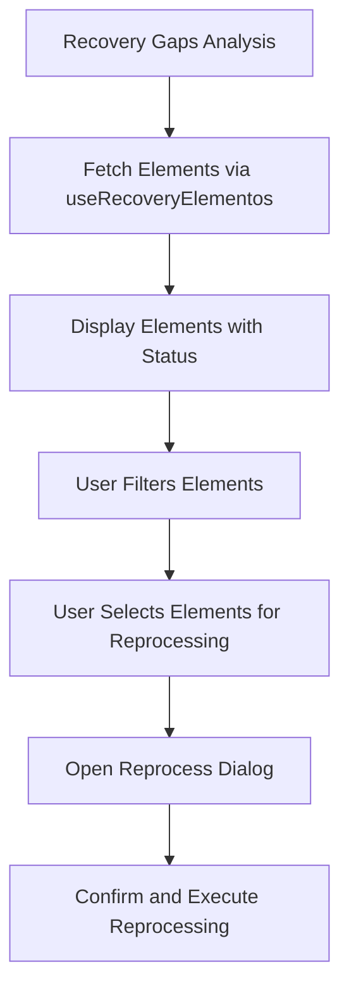
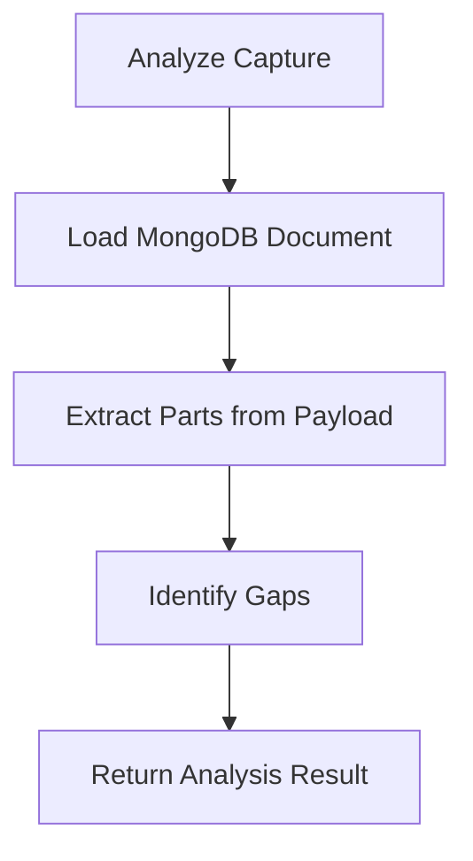
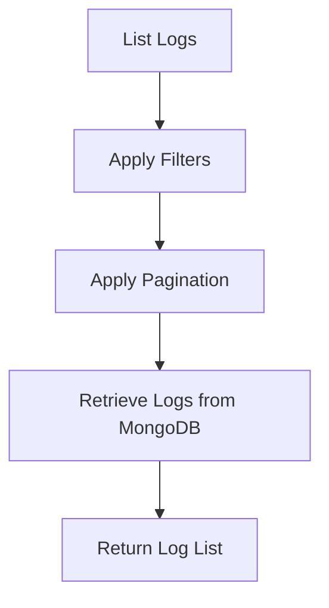
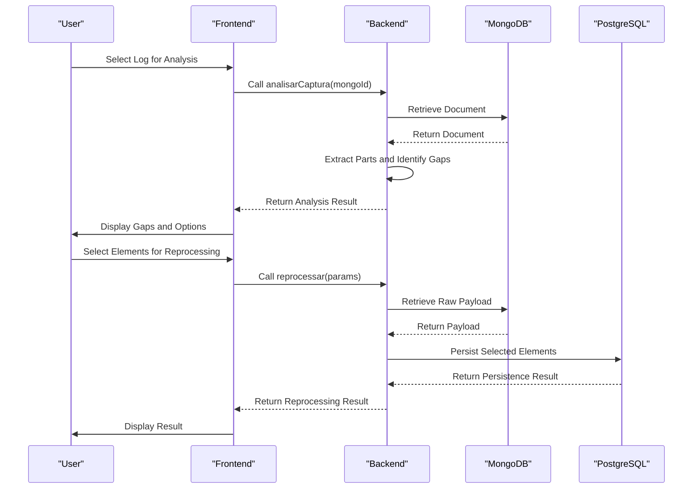
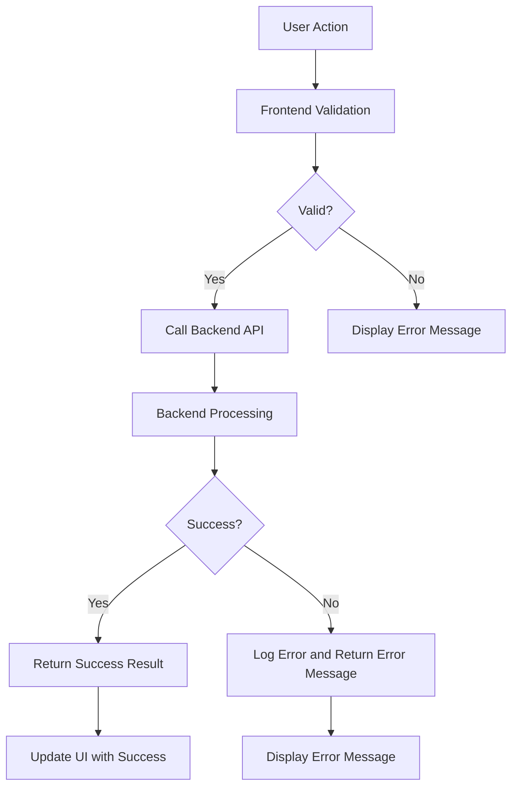
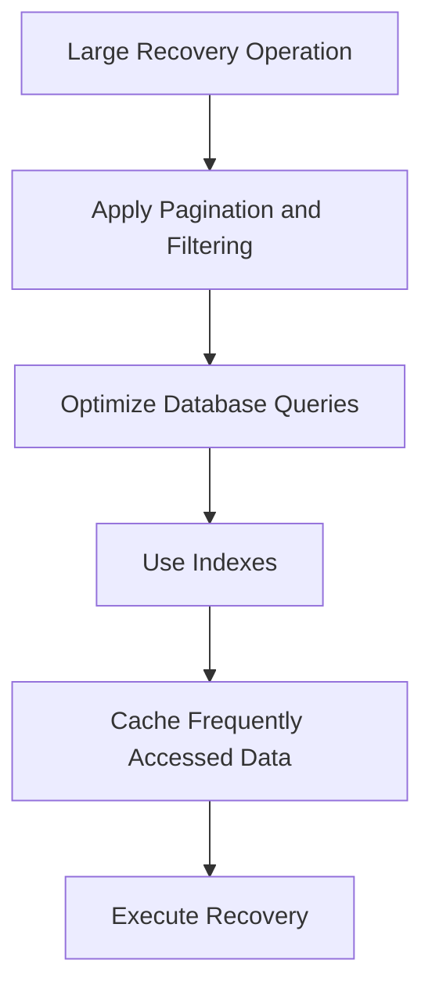

# Recovery System

<cite>
**Referenced Files in This Document**   
- [recovery-section.tsx](file://app/(dashboard)/captura/historico/[id]/components/recovery-section.tsx)
- [recovery-gaps-analysis.tsx](file://app/(dashboard)/captura/historico/[id]/components/recovery-gaps-analysis.tsx)
- [use-recovery-analysis.ts](file://app/_lib/hooks/use-recovery-analysis.ts)
- [use-recovery-logs.ts](file://app/_lib/hooks/use-recovery-logs.ts)
- [recovery-analysis.service.ts](file://backend/captura/services/recovery/recovery-analysis.service.ts)
- [captura-recovery.service.ts](file://backend/captura/services/recovery/captura-recovery.service.ts)
- [types.ts](file://backend/captura/services/recovery/types.ts)
</cite>

## Table of Contents
1. [Introduction](#introduction)
2. [Core Components](#core-components)
3. [Recovery Workflow](#recovery-workflow)
4. [Integration Between Frontend and Backend](#integration-between-frontend-and-backend)
5. [Common Issues and Solutions](#common-issues-and-solutions)
6. [Conclusion](#conclusion)

## Introduction
The Recovery System in the Sinesys application is designed to address data inconsistencies that may occur during the capture process from external sources such as PJE (Processo Judicial Eletrônico). The system enables users to view capture history, analyze gaps in captured data, and reprocess failed or incomplete captures. This document provides a comprehensive overview of the recovery system, focusing on both frontend and backend implementations, the recovery workflow, integration between components, and solutions to common issues.

**Section sources**
- [recovery-section.tsx](file://app/(dashboard)/captura/historico/[id]/components/recovery-section.tsx#L1-L234)
- [recovery-analysis.service.ts](file://backend/captura/services/recovery/recovery-analysis.service.ts#L1-L1163)

## Core Components

### Frontend Components
The frontend of the recovery system consists of two primary components: `recovery-section.tsx` and `recovery-gaps-analysis.tsx`. These components are responsible for displaying recovery information and analyzing missing data, respectively.

#### Recovery Section
The `recovery-section.tsx` component serves as the entry point for the recovery system. It displays a list of MongoDB logs associated with a PostgreSQL capture log, allowing users to analyze gaps and reprocess elements. The component uses the `useRecoveryLogs` hook to fetch logs and provides a user interface for selecting a specific log for detailed analysis.

Key features of the `recovery-section.tsx` component include:
- Displaying a list of MongoDB logs with status indicators (success or error)
- Providing summary statistics such as total logs, successes, errors, and unique TRTs
- Allowing users to select a log for detailed gap analysis

**Diagram sources**
- [recovery-section.tsx](file://app/(dashboard)/captura/historico/[id]/components/recovery-section.tsx#L1-L234)

#### Recovery Gaps Analysis
The `recovery-gaps-analysis.tsx` component provides a detailed view of captured elements, showing their persistence status and offering options to reprocess them. It uses the `useRecoveryElementos` hook to fetch element data and the `useReprocess` hook to handle reprocessing actions.

Key features of the `recovery-gaps-analysis.tsx` component include:
- Displaying all captured elements with their status (existing, missing, pending, or error)
- Allowing users to filter elements by status (e.g., show only missing elements)
- Providing a reprocessing dialog for selected elements
- Showing summary statistics for different types of elements (parts, addresses, representatives)

**Diagram sources**
- [recovery-gaps-analysis.tsx](file://app/(dashboard)/captura/historico/[id]/components/recovery-gaps-analysis.tsx#L1-L776)

### Backend Services
The backend of the recovery system includes two main services: `recovery-analysis.service.ts` and `captura-recovery.service.ts`. These services handle gap detection, reprocessing logic, and conflict resolution.

#### Recovery Analysis Service
The `recovery-analysis.service.ts` file contains functions for analyzing capture logs and identifying gaps in persisted data. The primary function, `analisarCaptura`, takes a MongoDB document ID and returns a complete analysis of the capture, including identified gaps.

Key functions in the `recovery-analysis.service.ts` file include:
- `analisarCaptura`: Analyzes a MongoDB document and identifies gaps in persistence
- `analisarDocumento`: Analyzes a loaded MongoDB document
- `extrairPartesDoPayload`: Extracts parts from the raw payload
- `identificarGaps`: Identifies gaps between the payload and the PostgreSQL database
- `extrairTodosElementos`: Extracts all elements from the payload with their persistence status

**Diagram sources**
- [recovery-analysis.service.ts](file://backend/captura/services/recovery/recovery-analysis.service.ts#L1-L1163)

#### Capture Recovery Service
The `captura-recovery.service.ts` file provides functions for listing, searching, and retrieving capture logs from MongoDB. It supports pagination, filtering, and sorting of logs.

Key functions in the `captura-recovery.service.ts` file include:
- `listarLogsRecovery`: Lists capture logs with filters and pagination
- `buscarLogPorMongoId`: Retrieves a specific log by its MongoDB ID
- `buscarLogsPorCapturaLogId`: Retrieves logs by their PostgreSQL capture log ID
- `contarLogsPorStatus`: Counts logs by status for a specific period

**Diagram sources**
- [captura-recovery.service.ts](file://backend/captura/services/recovery/captura-recovery.service.ts#L1-L395)

**Section sources**
- [recovery-analysis.service.ts](file://backend/captura/services/recovery/recovery-analysis.service.ts#L1-L1163)
- [captura-recovery.service.ts](file://backend/captura/services/recovery/captura-recovery.service.ts#L1-L395)

## Recovery Workflow

### Gap Detection
The gap detection process begins when a user selects a capture log in the `recovery-section.tsx` component. The frontend calls the `useRecoveryAnalysis` hook, which in turn invokes the `analisarCaptura` function in the `recovery-analysis.service.ts` file. This function analyzes the MongoDB document and identifies any gaps in the persisted data.

The gap detection process involves the following steps:
1. Load the MongoDB document using the `buscarLogPorMongoId` function
2. Extract parts from the raw payload using the `extrairPartesDoPayload` function
3. Identify gaps by comparing the extracted parts with the data in the PostgreSQL database
4. Return the analysis result, including identified gaps and summary statistics

### Reprocessing Logic
Once gaps are identified, users can select elements for reprocessing. The reprocessing logic is handled by the `useReprocess` hook in the frontend and the `reprocessar` function in the backend.

The reprocessing process involves the following steps:
1. User selects elements for reprocessing in the `recovery-gaps-analysis.tsx` component
2. The frontend calls the `reprocessar` function with the selected elements and reprocessing parameters
3. The backend retrieves the raw payload from MongoDB and attempts to persist the selected elements in the PostgreSQL database
4. The backend returns a result indicating the success or failure of each reprocessing action

### Conflict Resolution
When merging recovered data with existing data, the system handles conflicts by checking the persistence status of each element. If an element already exists in the database, it is not reprocessed unless the user explicitly chooses to force an update. This prevents overwriting existing data with potentially outdated information from the MongoDB payload.

**Diagram sources**
- [recovery-analysis.service.ts](file://backend/captura/services/recovery/recovery-analysis.service.ts#L1-L1163)
- [captura-recovery.service.ts](file://backend/captura/services/recovery/captura-recovery.service.ts#L1-L395)

**Section sources**
- [recovery-analysis.service.ts](file://backend/captura/services/recovery/recovery-analysis.service.ts#L1-L1163)
- [captura-recovery.service.ts](file://backend/captura/services/recovery/captura-recovery.service.ts#L1-L395)

## Integration Between Frontend and Backend

### Status Updates and Progress Tracking
The integration between the frontend and backend includes mechanisms for status updates and progress tracking. When a user initiates a reprocessing action, the frontend displays a loading indicator and updates the UI with the result once the process is complete. The backend returns detailed information about the reprocessing result, including the number of successful and failed actions, which is displayed to the user.

### Error Handling
Error handling is implemented at both the frontend and backend levels. The frontend uses error boundaries and error messages to inform users of any issues, while the backend logs errors and returns appropriate error messages to the frontend. Common error scenarios include:
- Invalid MongoDB document IDs
- Missing or corrupted payload data
- Database connection issues
- Validation errors during reprocessing

**Diagram sources**
- [use-recovery-analysis.ts](file://app/_lib/hooks/use-recovery-analysis.ts#L1-L442)
- [recovery-analysis.service.ts](file://backend/captura/services/recovery/recovery-analysis.service.ts#L1-L1163)

**Section sources**
- [use-recovery-analysis.ts](file://app/_lib/hooks/use-recovery-analysis.ts#L1-L442)
- [recovery-analysis.service.ts](file://backend/captura/services/recovery/recovery-analysis.service.ts#L1-L1163)

## Common Issues and Solutions

### Data Consistency After Recovery
One common issue is ensuring data consistency after recovery. The system addresses this by:
- Checking the persistence status of each element before reprocessing
- Allowing users to force updates if necessary
- Logging all reprocessing actions for audit purposes

### Handling Duplicate Data
Duplicate data can occur if the same element is reprocessed multiple times. The system prevents duplicates by:
- Checking if an element already exists in the database before creating a new record
- Using unique constraints in the database schema
- Providing users with clear feedback on the status of each reprocessing action

### Performance Optimization for Large Recovery Operations
Large recovery operations can be resource-intensive. The system optimizes performance by:
- Using pagination and filtering to limit the number of logs and elements processed
- Implementing efficient database queries and indexes
- Caching frequently accessed data

**Diagram sources**
- [captura-recovery.service.ts](file://backend/captura/services/recovery/captura-recovery.service.ts#L1-L395)
- [recovery-analysis.service.ts](file://backend/captura/services/recovery/recovery-analysis.service.ts#L1-L1163)

**Section sources**
- [captura-recovery.service.ts](file://backend/captura/services/recovery/captura-recovery.service.ts#L1-L395)
- [recovery-analysis.service.ts](file://backend/captura/services/recovery/recovery-analysis.service.ts#L1-L1163)

## Conclusion
The Recovery System in the Sinesys application provides a robust solution for addressing data inconsistencies in captured data. By combining a user-friendly frontend with a powerful backend, the system enables users to view capture history, analyze gaps, and reprocess failed or incomplete captures. The integration between frontend and backend ensures smooth status updates, progress tracking, and error handling. Common issues such as data consistency, duplicate data, and performance optimization are addressed through careful design and implementation. This comprehensive approach ensures that the recovery system is both effective and efficient, providing users with the tools they need to maintain data integrity.