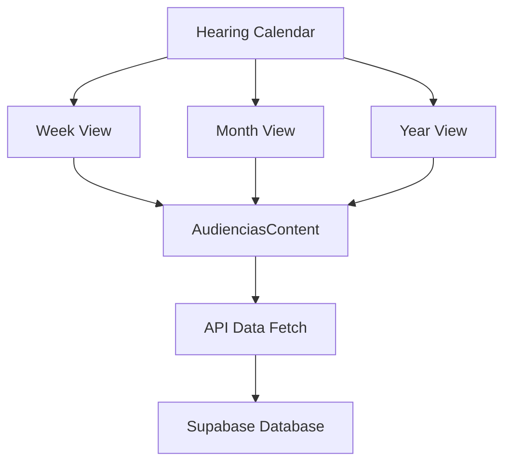
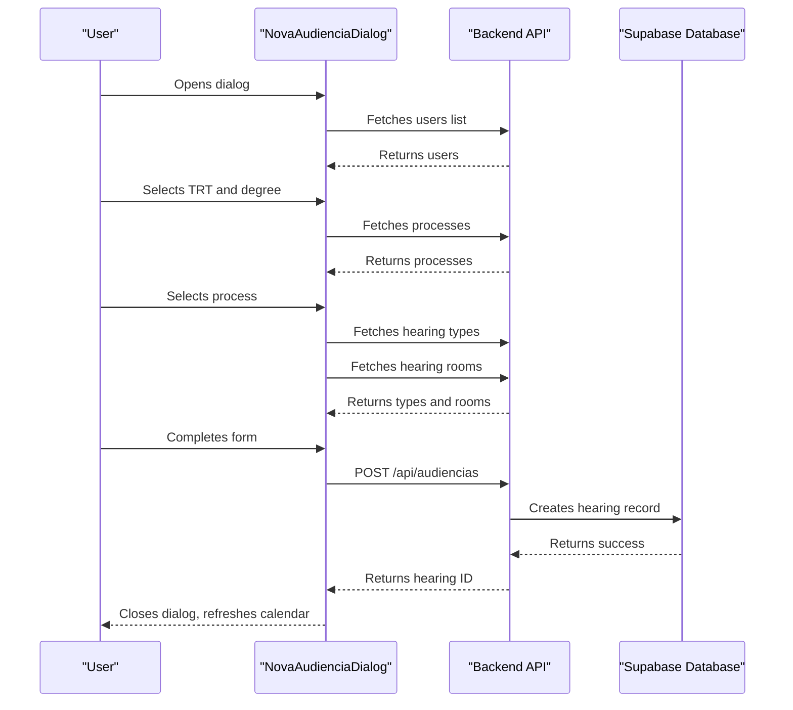
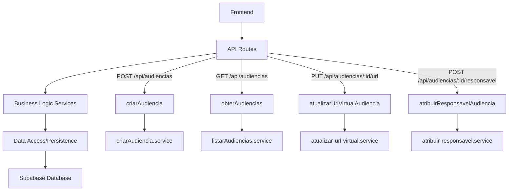
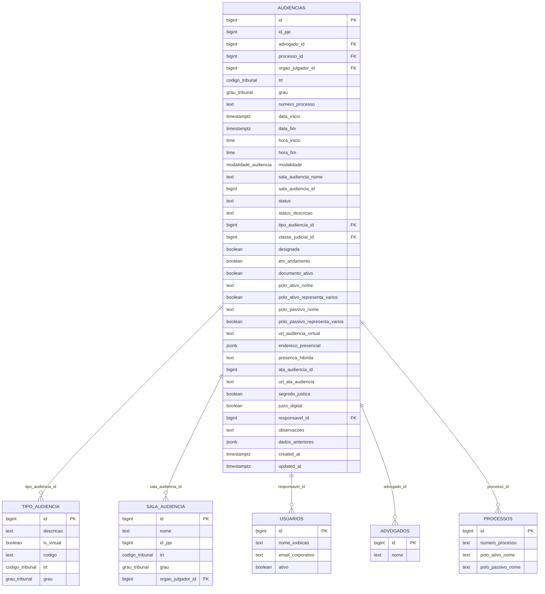

# Hearing Management Module

<cite>
**Referenced Files in This Document**   
- [page.tsx](file://app/(dashboard)/audiencias/page.tsx)
- [audiencias-content.tsx](file://app/(dashboard)/audiencias/components/audiencias-content.tsx)
- [semana/page.tsx](file://app/(dashboard)/audiencias/semana/page.tsx)
- [mes/page.tsx](file://app/(dashboard)/audiencias/mes/page.tsx)
- [ano/page.tsx](file://app/(dashboard)/audiencias/ano/page.tsx)
- [nova-audiencia-dialog.tsx](file://app/(dashboard)/audiencias/components/nova-audiencia-dialog.tsx)
- [route.ts](file://app/api/audiencias/route.ts)
- [tipos/route.ts](file://app/api/audiencias/tipos/route.ts)
- [salas/route.ts](file://app/api/audiencias/salas/route.ts)
- [criar-audiencia.service.ts](file://backend/audiencias/services/criar-audiencia.service.ts)
- [listar-audiencias.service.ts](file://backend/audiencias/services/listar-audiencias.service.ts)
- [atualizar-url-virtual.service.ts](file://backend/audiencias/services/atualizar-url-virtual.service.ts)
- [atribuir-responsavel.service.ts](file://backend/audiencias/services/atribuir-responsavel.service.ts)
- [07_audiencias.sql](file://supabase/schemas/07_audiencias.sql)
</cite>

## Table of Contents
1. [Introduction](#introduction)
2. [Hearing Calendar Implementation](#hearing-calendar-implementation)
3. [Creating and Editing Hearings](#creating-and-editing-hearings)
4. [Backend Services](#backend-services)
5. [Supabase Schema](#supabase-schema)
6. [Dashboard Integration](#dashboard-integration)
7. [Common Issues and Solutions](#common-issues-and-solutions)

## Introduction
The Hearing Management Module in the Sinesys application provides a comprehensive system for managing court hearings with multiple visualization modes and robust backend services. This document details the implementation of the hearing calendar, creation and editing processes, backend services, database schema, and integration with the dashboard for pending items.

**Section sources**
- [page.tsx](file://app/(dashboard)/audiencias/page.tsx)

## Hearing Calendar Implementation
The hearing calendar in Sinesys offers three distinct visualization modes: week, month, and year. Each view is implemented as a separate page component that renders the same core `AudienciasContent` component with different visualization parameters.

The calendar system is built using a client-side React component that fetches hearing data from the backend API. The main entry point for the hearing module automatically redirects to the weekly view, providing users with an immediate overview of their upcoming hearings.

Each visualization mode (week, month, year) is implemented as a separate page component that imports and renders the shared `AudienciasContent` component. This component receives the visualization mode as a parameter and adjusts its display accordingly. The content is wrapped in a Suspense boundary with a loading skeleton to provide a smooth user experience during data fetching.

**Diagram sources **
- [semana/page.tsx](file://app/(dashboard)/audiencias/semana/page.tsx)
- [mes/page.tsx](file://app/(dashboard)/audiencias/mes/page.tsx)
- [ano/page.tsx](file://app/(dashboard)/audiencias/ano/page.tsx)
- [audiencias-content.tsx](file://app/(dashboard)/audiencias/components/audiencias-content.tsx)

**Section sources**
- [semana/page.tsx](file://app/(dashboard)/audiencias/semana/page.tsx)
- [mes/page.tsx](file://app/(dashboard)/audiencias/mes/page.tsx)
- [ano/page.tsx](file://app/(dashboard)/audiencias/ano/page.tsx)

## Creating and Editing Hearings
The process of creating new hearings is facilitated through the `NovaAudienciaDialog` component, a comprehensive form that guides users through all necessary information for scheduling a hearing. The dialog includes fields for tribunal selection (TRT), process degree, process selection, date and time ranges, hearing type, location details, responsible personnel, and additional observations.

When creating a new hearing, users must first select the TRT and degree, which triggers API calls to populate the available processes. Once a process is selected, the system fetches relevant details including the presiding body, which is then used to retrieve available hearing rooms. The form dynamically adjusts based on the hearing type - virtual hearings require a URL, while in-person hearings require a complete address.

The hearing creation process includes comprehensive validation to prevent scheduling conflicts and ensure data integrity. Required fields are clearly marked, and the form provides real-time feedback on validation status. Users can also assign a responsible team member to the hearing, facilitating accountability and task management.

**Diagram sources **
- [nova-audiencia-dialog.tsx](file://app/(dashboard)/audiencias/components/nova-audiencia-dialog.tsx)
- [route.ts](file://app/api/audiencias/route.ts)
- [criar-audiencia.service.ts](file://backend/audiencias/services/criar-audiencia.service.ts)

**Section sources**
- [nova-audiencia-dialog.tsx](file://app/(dashboard)/audiencias/components/nova-audiencia-dialog.tsx)

## Backend Services
The hearing management system is supported by a robust backend architecture with specialized services for different operations. The primary services include hearing creation, listing, URL updating, and responsibility assignment.

The `criarAudiencia` service handles the creation of new hearings, performing validation on process existence, hearing type, and room availability before inserting the record into the database. The service automatically sets the hearing status to "scheduled" (M) and populates normalized data from related tables to ensure consistency.

The `obterAudiencias` service manages the retrieval of hearing data with support for filtering, pagination, and sorting. It accepts various parameters including TRT, degree, responsible user, date ranges, and search terms to provide flexible data retrieval options. The service implements caching to improve performance for frequently accessed data.

Specialized services handle specific operations:
- `atualizarUrlVirtualAudiencia`: Updates the virtual hearing URL with validation to ensure proper URL format
- `atribuirResponsavelAudiencia`: Assigns or changes the responsible user for a hearing, with validation of user existence and permissions

All backend services include comprehensive error handling and logging to ensure system reliability and facilitate troubleshooting.

**Diagram sources **
- [route.ts](file://app/api/audiencias/route.ts)
- [criar-audiencia.service.ts](file://backend/audiencias/services/criar-audiencia.service.ts)
- [listar-audiencias.service.ts](file://backend/audiencias/services/listar-audiencias.service.ts)
- [atualizar-url-virtual.service.ts](file://backend/audiencias/services/atualizar-url-virtual.service.ts)
- [atribuir-responsavel.service.ts](file://backend/audiencias/services/atribuir-responsavel.service.ts)

**Section sources**
- [route.ts](file://app/api/audiencias/route.ts)
- [criar-audiencia.service.ts](file://backend/audiencias/services/criar-audiencia.service.ts)
- [listar-audiencias.service.ts](file://backend/audiencias/services/listar-audiencias.service.ts)
- [atualizar-url-virtual.service.ts](file://backend/audiencias/services/atualizar-url-virtual.service.ts)
- [atribuir-responsavel.service.ts](file://backend/audiencias/services/atribuir-responsavel.service.ts)

## Supabase Schema
The hearing data is stored in the Supabase database using a well-structured schema designed for efficiency and data integrity. The primary table `audiencias` contains comprehensive information about each hearing with appropriate relationships to related entities.

Key aspects of the schema include:
- **Primary fields**: ID, PJE ID, attorney ID, process ID, and tribunal information
- **Temporal data**: Start and end timestamps, with separate time fields for display purposes
- **Location information**: Support for both virtual (URL) and physical (address in JSON format) locations
- **Status tracking**: Status codes (M=Scheduled, R=Completed, C=Cancelled) with descriptive text
- **Responsibility assignment**: Foreign key to users table for tracking responsible personnel
- **Audit trail**: Created and updated timestamps, with previous data stored for change tracking

The schema includes a sophisticated trigger system that automatically determines the hearing modality (virtual, in-person, or hybrid) based on the presence of a virtual URL, physical address, or explicit hybrid designation. This ensures consistent data interpretation across the application.

Indexes are strategically placed on frequently queried fields including attorney ID, process ID, tribunal, degree, status, and date ranges to optimize query performance. Row-level security is enabled to ensure data privacy and access control.

**Diagram sources **
- [07_audiencias.sql](file://supabase/schemas/07_audiencias.sql)

**Section sources**
- [07_audiencias.sql](file://supabase/schemas/07_audiencias.sql)

## Dashboard Integration
The hearing management system is integrated with the main dashboard to provide visibility into pending items and upcoming hearings. The integration is achieved through API endpoints that supply filtered hearing data to dashboard components.

The system supports various filtering options that are leveraged by the dashboard, including:
- Hearings without assigned responsibility
- Upcoming hearings within specific time frames
- Hearings by tribunal and degree
- Hearings by status (scheduled, completed, cancelled)

The API provides pagination and sorting capabilities to handle large datasets efficiently, with a maximum limit of 1000 records per request to support calendar views that require extensive data loading. The response includes both the hearing data and pagination metadata to enable proper navigation controls.

Caching is implemented at the service layer to improve performance for frequently accessed dashboard views. The cache is invalidated when hearings are created, updated, or when responsibility assignments change, ensuring that the dashboard always displays current information.

**Section sources**
- [route.ts](file://app/api/audiencias/route.ts)
- [listar-audiencias.service.ts](file://backend/audiencias/services/listar-audiencias.service.ts)

## Common Issues and Solutions
The hearing management system addresses several common issues through its validation and business logic:

**Scheduling Conflicts**: The system prevents obvious scheduling conflicts through client-side validation that ensures end time is after start time. While the current implementation doesn't check for overlapping hearings for the same attorney or process, this could be enhanced with additional validation queries.

**Data Consistency**: The schema and triggers ensure data consistency by automatically determining the hearing modality based on location information. The system prevents invalid combinations, such as having both a virtual URL and a physical address without explicitly setting hybrid status.

**Validation Logic**: The creation form includes comprehensive validation:
- Required fields are enforced (TRT, degree, process, dates)
- Date and time formats are validated
- URL format is validated for virtual hearings
- Process and hearing type existence is verified server-side

**Error Handling**: The system provides clear error messages for common issues:
- "Process not found" when the selected process doesn't exist
- "Invalid URL" for malformed virtual hearing URLs
- "Hearing not found" when attempting to update a non-existent record
- "User not found or inactive" when assigning responsibility to an invalid user

The backend services include detailed logging to help diagnose issues, and the API returns structured error responses with codes and messages to facilitate troubleshooting.

**Section sources**
- [nova-audiencia-dialog.tsx](file://app/(dashboard)/audiencias/components/nova-audiencia-dialog.tsx)
- [criar-audiencia.service.ts](file://backend/audiencias/services/criar-audiencia.service.ts)
- [atualizar-url-virtual.service.ts](file://backend/audiencias/services/atualizar-url-virtual.service.ts)
- [atribuir-responsavel.service.ts](file://backend/audiencias/services/atribuir-responsavel.service.ts)