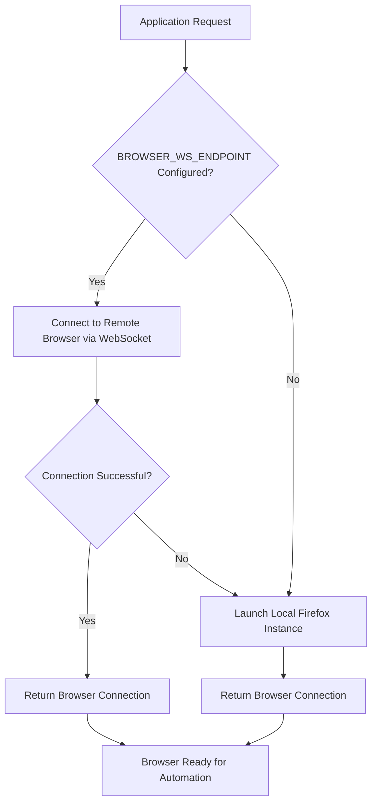
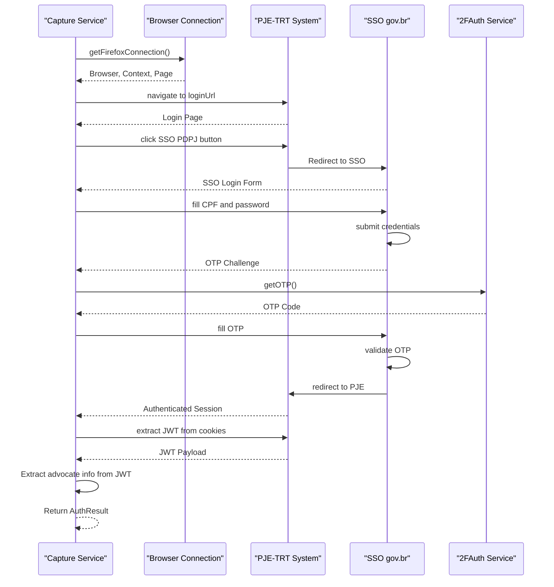

# Browser Automation

<cite>
**Referenced Files in This Document**   
- [browser-connection.service.ts](file://backend/captura/services/browser/browser-connection.service.ts)
- [trt-auth.service.ts](file://backend/captura/services/trt/trt-auth.service.ts)
- [timeline-capture.service.ts](file://backend/captura/services/timeline/timeline-capture.service.ts)
- [partes-capture.service.ts](file://backend/captura/services/partes/partes-capture.service.ts)
- [trt-capture.service.ts](file://backend/captura/services/trt/trt-capture.service.ts)
- [config.ts](file://backend/captura/services/trt/config.ts)
- [route.ts](file://app/api/captura/trt/timeline/route.ts)
</cite>

## Table of Contents
1. [Introduction](#introduction)
2. [Browser Connection Management](#browser-connection-management)
3. [Authentication Workflow](#authentication-workflow)
4. [Timeline Data Capture](#timeline-data-capture)
5. [Document Download and Storage](#document-download-and-storage)
6. [Hearing Information Capture](#hearing-information-capture)
7. [Parties and Representation Capture](#parties-and-representation-capture)
8. [Configuration and Parameters](#configuration-and-parameters)
9. [Error Handling and Resilience](#error-handling-and-resilience)
10. [Integration with Other Components](#integration-with-other-components)

## Introduction
The Sinesys data capture system implements browser automation to extract information from the PJE-TRT (Processo Judicial Eletrônico - Tribunal Regional do Trabalho) platform. This documentation details the implementation using Playwright for browser automation, focusing on the interaction between the browser-connection.service and various capture services. The system enables programmatic navigation of the PJE-TRT interface to extract timeline data, download documents, and capture hearing information. The architecture supports both remote and local browser connections, with comprehensive error handling and retry mechanisms to address common issues like browser crashes and navigation timeouts.

## Browser Connection Management

The browser connection management system is implemented in the `browser-connection.service.ts` file and provides a robust interface for managing browser instances. The service supports two connection modes: remote Firefox via WebSocket and local Firefox launched through Playwright. The connection strategy prioritizes the remote browser server when the `BROWSER_WS_ENDPOINT` environment variable is configured, falling back to a local browser instance if the remote connection fails.

The service exports several key functions:
- `getBrowserConnection()`: Main entry point that returns a browser, context, and page ready for use
- `getFirefoxConnection()`: Convenience function that ensures Firefox is used
- `closeBrowser()`: Safely closes the browser instance
- `checkBrowserServiceHealth()`: Verifies the availability of the browser service

The implementation includes configuration options for headless mode, viewport size, user agent, and connection timeout. When connecting to a remote browser, the service can include an authentication token in the WebSocket URL if `BROWSER_SERVICE_TOKEN` is provided. The default user agent is set to mimic a standard Firefox browser on Windows to avoid detection by the target system.

**Diagram sources**
- [browser-connection.service.ts](file://backend/captura/services/browser/browser-connection.service.ts#L1-L274)

**Section sources**
- [browser-connection.service.ts](file://backend/captura/services/browser/browser-connection.service.ts#L1-L274)

## Authentication Workflow

The authentication workflow for the PJE-TRT system is implemented in the `trt-auth.service.ts` file and follows a multi-step process to authenticate users via the SSO gov.br system. The workflow begins with obtaining a browser connection through the browser-connection.service, followed by navigation to the login page and interaction with the SSO PDPJ button.

The authentication process includes several critical components:
- SSO login with CPF and password
- Two-factor authentication (2FA) handling using OTP codes
- Anti-detection measures to prevent bot detection
- JWT token extraction from cookies
- Advocate information extraction from the JWT payload

The service implements anti-detection measures by modifying browser properties such as `navigator.webdriver`, `navigator.plugins`, and `navigator.languages` to prevent the target system from identifying the automation. For 2FA, the system integrates with a 2FAuth service to obtain OTP codes, with logic to handle both current and next OTP codes in case of timing issues.

The authentication result includes the Playwright Page object, Browser and BrowserContext instances, advocate information (ID, CPF, name), and authentication tokens (access token and XSRF token). This comprehensive result enables subsequent services to make authenticated requests to the PJE-TRT system.

**Diagram sources**
- [trt-auth.service.ts](file://backend/captura/services/trt/trt-auth.service.ts#L1-L603)

**Section sources**
- [trt-auth.service.ts](file://backend/captura/services/trt/trt-auth.service.ts#L1-L603)

## Timeline Data Capture

The timeline data capture functionality is implemented in the `timeline-capture.service.ts` file and provides a comprehensive solution for extracting timeline information from PJE-TRT processes. The service orchestrates the entire capture process, from authentication to data persistence, with configurable options for filtering and downloading documents.

The capture process follows these steps:
1. Obtain tribunal configuration from the database
2. Authenticate with the PJE-TRT system
3. Retrieve the complete timeline for the specified process
4. Filter documents based on configurable criteria
5. Download PDFs of filtered documents
6. Upload documents to Backblaze B2 storage
7. Save enriched timeline data to MongoDB
8. Update the PostgreSQL database with the MongoDB document ID

The service accepts several parameters to control the capture process:
- `trtCodigo`: TRT code (e.g., 'TRT3')
- `grau`: Instance level (primeiro_grau or segundo_grau)
- `processoId`: Process ID in PJE
- `numeroProcesso`: CNJ process number
- `advogadoId`: Advocate ID for credential retrieval
- `baixarDocumentos`: Whether to download PDFs
- `filtroDocumentos`: Document filtering criteria

The filtering criteria include options to include only signed documents, non-confidential documents, specific document types, and date ranges. The service returns a detailed result object containing the timeline, document download statistics, and the MongoDB document ID.

**Section sources**
- [timeline-capture.service.ts](file://backend/captura/services/timeline/timeline-capture.service.ts#L1-L352)

## Document Download and Storage

The document download and storage system is integrated within the timeline capture service and implements a robust pipeline for retrieving and persisting documents from the PJE-TRT system. When document download is enabled, the service iterates through the filtered timeline items and downloads each document's PDF.

The download process includes several key features:
- Sequential processing with a 500ms delay between downloads to prevent rate limiting
- Error handling for individual document downloads
- Upload to Backblaze B2 cloud storage
- Enrichment of timeline data with storage information
- Persistence of the complete timeline in MongoDB

For each document, the service first retrieves the document details using the `obterDocumento` function, then downloads the PDF using the `baixarDocumento` function. The PDF buffer is then uploaded to Backblaze B2 storage using the `uploadDocumentoTimeline` service, which returns storage metadata including the URL, key, bucket, and filename.

The timeline data is enriched with Backblaze B2 information before being saved to MongoDB, creating a complete record that links the document metadata with its storage location. This approach enables efficient retrieval of documents without storing large binary data in the primary database.

The API endpoint at `/api/captura/trt/timeline` exposes this functionality to the frontend, with the response excluding the actual PDF buffers to reduce payload size. Instead, the response includes document metadata and the size of the PDF buffer, allowing clients to determine whether to request the actual document from storage.

**Section sources**
- [timeline-capture.service.ts](file://backend/captura/services/timeline/timeline-capture.service.ts#L1-L352)
- [route.ts](file://app/api/captura/trt/timeline/route.ts#L1-L212)

## Hearing Information Capture

The hearing information capture functionality is implemented as part of the broader TRT capture services, with specific parameters for controlling the capture of hearing data. The `CapturaAudienciasParams` interface in `trt-capture.service.ts` defines the parameters for capturing hearing information:

- `dataInicio`: Start date for the hearing search period (defaults to today)
- `dataFim`: End date for the hearing search period (defaults to today + 365 days)
- `codigoSituacao`: Hearing status code ('M' for scheduled, 'C' for canceled, 'F' for completed)

The hearing capture process follows a similar pattern to other capture services, using the authenticated browser session to navigate to the hearing section of the PJE-TRT system and extract relevant information. The service retrieves hearing details including date, time, courtroom, participants, and status, which are then persisted in the system's database.

The implementation includes error handling for common issues such as navigation timeouts and CAPTCHA challenges, with retry mechanisms to ensure reliable data capture. The hearing data is integrated with the overall case information, allowing users to view hearing schedules alongside other case events in the timeline.

**Section sources**
- [trt-capture.service.ts](file://backend/captura/services/trt/trt-capture.service.ts#L1-L36)

## Parties and Representation Capture

The parties and representation capture system is implemented in the `partes-capture.service.ts` file and provides comprehensive functionality for extracting party information from PJE-TRT processes. The service identifies parties as clients, opposing parties, or third parties based on advocate information and persists them in the appropriate database tables.

The capture process includes several key components:
- Identification of party type (client, opposing party, third party)
- Upsert operations for party entities (clients, opposing parties, third parties)
- Processing and saving of party addresses
- Creation of process-party relationships
- Handling of representatives (advocates) for each party

The service processes parties in batches with configurable concurrency limits to optimize performance while avoiding system overload. It includes retry mechanisms for database operations and comprehensive error handling to ensure data integrity. The service also validates party data against predefined schemas before persistence.

For each party, the service extracts detailed information from the PJE system, including contact details, document numbers, and additional metadata specific to the party type. This information is then normalized and stored in the system's database, creating a comprehensive record of all parties involved in a case.

**Section sources**
- [partes-capture.service.ts](file://backend/captura/services/partes/partes-capture.service.ts#L1-L800)

## Configuration and Parameters

The browser automation system is highly configurable through environment variables and database-stored settings. The configuration system supports both static environment variables and dynamic database configurations, allowing for flexible deployment across different environments.

Key configuration options include:

**Browser Connection Configuration:**
- `BROWSER_WS_ENDPOINT`: WebSocket endpoint for remote browser server
- `BROWSER_SERVICE_TOKEN`: Authentication token for browser service
- `BROWSER_SERVICE_URL`: HTTP URL for browser service health checks

**Capture Service Configuration:**
- `CAPTURA_MAX_CONCURRENT_PARTES`: Maximum number of concurrent party processing operations
- `CAPTURA_MAX_CONCURRENT_REPS`: Maximum number of concurrent representative processing operations
- `CAPTURA_PERF_THRESHOLD_MS`: Performance threshold for logging warnings
- `CAPTURA_RETRY_MAX_ATTEMPTS`: Maximum retry attempts for operations
- `CAPTURA_RETRY_BASE_DELAY_MS`: Base delay between retries
- `CAPTURA_RETRY_MAX_DELAY_MS`: Maximum delay between retries

**Tribunal Configuration:**
Tribunal-specific settings are stored in the database and cached in memory for 5 minutes to improve performance. The configuration includes:
- Tribunal code and name
- Access type (primeiro_grau, segundo_grau, unificado, unico)
- Login URL
- Base URL
- API URL
- Custom timeouts

The system validates configurations at startup and provides clear error messages for invalid settings. The configuration system is designed to be extensible, allowing new settings to be added as needed without requiring code changes.

**Section sources**
- [browser-connection.service.ts](file://backend/captura/services/browser/browser-connection.service.ts#L1-L274)
- [partes-capture.service.ts](file://backend/captura/services/partes/partes-capture.service.ts#L1-L800)
- [config.ts](file://backend/captura/services/trt/config.ts#L1-L203)

## Error Handling and Resilience

The browser automation system implements comprehensive error handling and resilience mechanisms to ensure reliable operation in production environments. The system addresses common issues such as browser crashes, navigation timeouts, and CAPTCHA challenges through a combination of retry mechanisms, fallback strategies, and graceful degradation.

Key error handling features include:

**Retry Mechanisms:**
The system uses a configurable retry mechanism for operations that may fail due to transient issues. The retry configuration includes:
- Maximum number of retry attempts
- Base delay between retries
- Maximum delay between retries
- Exponential backoff strategy

Retry is implemented at multiple levels, including database operations, API requests, and individual party processing. This ensures that temporary network issues or system load spikes do not cause complete capture failures.

**Fallback Strategies:**
The browser connection service implements a fallback strategy, attempting to connect to a remote browser server and falling back to a local browser instance if the remote connection fails. This ensures that capture operations can continue even if the dedicated browser server is unavailable.

**Graceful Degradation:**
When processing multiple parties or documents, the system continues processing even if individual items fail. Errors are logged and included in the final result, but do not prevent the processing of other items. This approach ensures that partial data capture is still valuable rather than resulting in complete failure.

**Resource Cleanup:**
The system implements proper resource cleanup through try-catch-finally blocks and async/await patterns. Browser instances are always closed, even if an error occurs during processing, preventing resource leaks.

**Monitoring and Logging:**
Comprehensive logging is implemented throughout the system, with different log levels for information, success, warning, and error messages. Performance metrics are collected and logged, with warnings generated if operations exceed configured thresholds.

**Section sources**
- [browser-connection.service.ts](file://backend/captura/services/browser/browser-connection.service.ts#L1-L274)
- [trt-auth.service.ts](file://backend/captura/services/trt/trt-auth.service.ts#L1-L603)
- [timeline-capture.service.ts](file://backend/captura/services/timeline/timeline-capture.service.ts#L1-L352)
- [partes-capture.service.ts](file://backend/captura/services/partes/partes-capture.service.ts#L1-L800)

## Integration with Other Components

The browser automation system integrates with several other components in the Sinesys architecture, creating a cohesive data capture and management solution. These integrations enable the system to securely store credentials, persist captured data, and provide access to the captured information through APIs.

**Credential Management Integration:**
The system integrates with the credential management system to securely store and retrieve advocate credentials for PJE-TRT authentication. Credentials are retrieved based on the advocate ID provided in the capture parameters, ensuring that each capture operation uses the appropriate credentials.

**Data Persistence Integration:**
Captured data is persisted in multiple storage systems:
- PostgreSQL: Primary relational database for structured data
- MongoDB: Document database for timeline data with flexible schema
- Backblaze B2: Cloud storage for document PDFs

The system uses dedicated persistence services for each storage system, ensuring proper separation of concerns and maintainability.

**API Integration:**
The browser automation functionality is exposed through REST APIs in the `app/api/captura` directory. These APIs provide a secure interface for frontend applications to initiate capture operations. The APIs include authentication and authorization checks to ensure that only authorized users can initiate data capture.

**Monitoring and Logging Integration:**
The system integrates with logging and monitoring services to provide visibility into capture operations. Logs include detailed information about each step of the capture process, enabling troubleshooting and performance analysis.

**Distributed Locking:**
To prevent concurrent capture operations on the same process, the system implements distributed locking using Redis. This ensures data consistency when multiple users or processes attempt to capture the same information simultaneously.

**Section sources**
- [trt-auth.service.ts](file://backend/captura/services/trt/trt-auth.service.ts#L1-L603)
- [timeline-capture.service.ts](file://backend/captura/services/timeline/timeline-capture.service.ts#L1-L352)
- [partes-capture.service.ts](file://backend/captura/services/partes/partes-capture.service.ts#L1-L800)
- [route.ts](file://app/api/captura/trt/timeline/route.ts#L1-L212)