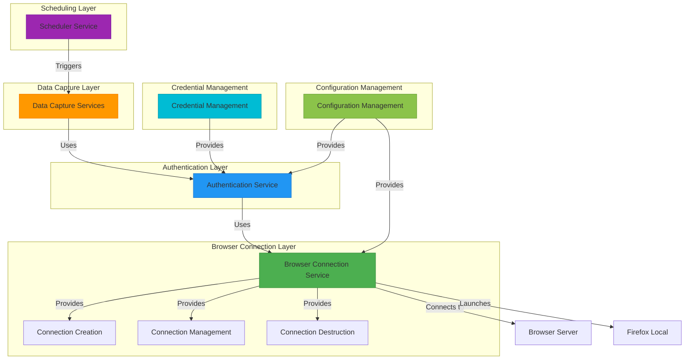
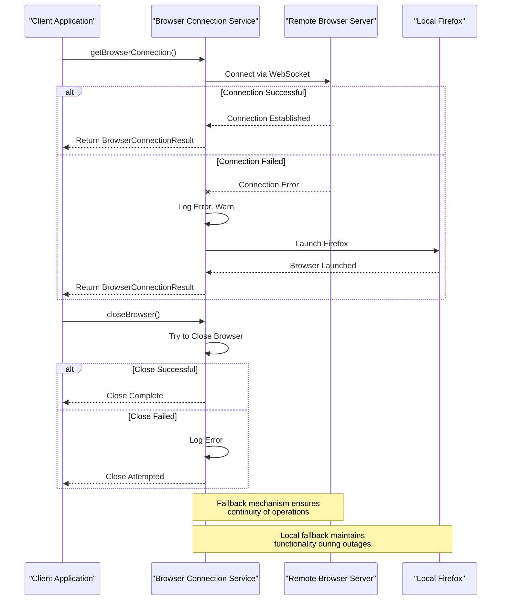

# Browser Connection Management

<cite>
**Referenced Files in This Document**   
- [browser-connection.service.ts](file://backend/captura/services/browser/browser-connection.service.ts)
- [trt-auth.service.ts](file://backend/captura/services/trt/trt-auth.service.ts)
- [executar-agendamento.service.ts](file://backend/captura/services/scheduler/executar-agendamento.service.ts)
- [credential.service.ts](file://backend/captura/credentials/credential.service.ts)
- [config.ts](file://backend/captura/services/trt/config.ts)
</cite>

## Table of Contents
1. [Introduction](#introduction)
2. [Architecture Overview](#architecture-overview)
3. [Core Components](#core-components)
4. [Connection Lifecycle Management](#connection-lifecycle-management)
5. [Connection Pooling and Reuse](#connection-pooling-and-reuse)
6. [Error Handling and Recovery](#error-handling-and-recovery)
7. [Integration with Other Components](#integration-with-other-components)
8. [Performance and Resource Management](#performance-and-resource-management)
9. [Troubleshooting Guide](#troubleshooting-guide)
10. [Conclusion](#conclusion)

## Introduction

The browser connection management component in the Sinesys data capture system is responsible for establishing and maintaining browser instances for web scraping operations, specifically for integration with the PJE-TRT (Processo Judicial Eletrônico do Tribunal Regional do Trabalho) system. This component uses Playwright to manage Firefox browser instances, providing a robust foundation for automated data capture from the PJE-TRT platform.

The system is designed with a dual-mode approach, supporting both remote and local browser connections. In production environments, it connects to a remote Firefox Browser Server via WebSocket, while falling back to launching a local browser instance when the remote service is unavailable. This architecture ensures reliability and flexibility across different deployment scenarios.

The browser connection service is a critical component in the data capture pipeline, enabling the system to authenticate with the PJE-TRT platform, navigate through its interface, and extract relevant legal data. It handles the complexities of browser automation, including session management, anti-detection measures, and resource cleanup, allowing higher-level services to focus on data processing and business logic.

This documentation provides a comprehensive overview of the browser connection management implementation, detailing the interfaces for creating, reusing, and closing browser contexts, the domain model for representing browser sessions and their lifecycle, and usage patterns for managing multiple concurrent connections.

**Section sources**
- [browser-connection.service.ts](file://backend/captura/services/browser/browser-connection.service.ts#L1-L274)

## Architecture Overview

The browser connection management system follows a layered architecture that separates concerns between connection establishment, authentication, and data capture operations. At its core, the system uses Playwright to control Firefox instances, providing a high-level API for browser automation.



**Diagram sources **
- [browser-connection.service.ts](file://backend/captura/services/browser/browser-connection.service.ts#L1-L274)
- [trt-auth.service.ts](file://backend/captura/services/trt/trt-auth.service.ts#L1-L603)

## Core Components

The browser connection management system consists of several key components that work together to establish and maintain browser connections for data capture operations. The primary component is the `browser-connection.service.ts` file, which provides the core functionality for managing browser instances.

The service exposes three main functions for connection management: `getBrowserConnection`, `getFirefoxConnection`, and `closeBrowser`. The `getBrowserConnection` function is the primary entry point, which attempts to connect to a remote browser server when the `BROWSER_WS_ENDPOINT` environment variable is configured. If this connection fails or the endpoint is not configured, it falls back to launching a local Firefox instance using Playwright.

The connection process supports various configuration options through the `BrowserConnectionOptions` interface, including headless mode, custom viewport dimensions, user agent strings, and connection timeouts. By default, the service runs in headless mode with a viewport of 1920x1080 pixels and a standard Firefox user agent.

When connecting to a remote browser server, the service can include an authentication token from the `BROWSER_SERVICE_TOKEN` environment variable, providing an additional layer of security for the WebSocket connection. This token is appended to the WebSocket endpoint URL if it's not already present.

The service returns a `BrowserConnectionResult` object containing the browser instance, browser context, page object, and a boolean flag indicating whether the connection is remote. This comprehensive return value provides all the necessary components for subsequent web scraping operations.

**Section sources**
- [browser-connection.service.ts](file://backend/captura/services/browser/browser-connection.service.ts#L1-L274)

## Connection Lifecycle Management

The browser connection lifecycle in the Sinesys system follows a well-defined pattern from creation to destruction, ensuring proper resource management and preventing memory leaks. The lifecycle begins with the creation of a browser connection through the `getBrowserConnection` function, which orchestrates the connection process based on the available configuration.

When a connection is requested, the system first checks for the presence of the `BROWSER_WS_ENDPOINT` environment variable. If this variable is set, the system attempts to connect to the remote browser server using the `connectToRemoteBrowser` function. This function establishes a WebSocket connection to the Firefox Browser Server, creating a new browser context with the specified viewport and user agent settings. The connection includes error handling with a fallback mechanism that automatically switches to launching a local browser if the remote connection fails.

If no remote endpoint is configured, or if the connection to the remote server fails, the system uses the `launchLocalBrowser` function to start a local Firefox instance. This function launches Firefox with the specified headless mode setting and creates a new browser context with the appropriate configuration.

Once a connection is established, the system returns a `BrowserConnectionResult` object containing the browser instance, browser context, and a new page object. This page is ready for navigation and interaction with the target website. The caller is responsible for using this connection to perform the necessary web scraping operations.

The lifecycle concludes with the `closeBrowser` function, which safely closes the browser instance and releases associated resources. This function includes error handling to ensure that the browser is closed even if an error occurs during the closing process. Proper connection closure is critical for preventing browser process leaks and conserving system resources, especially in environments with high connection turnover.

```mermaid
stateDiagram-v2
[*] --> Idle
Idle --> Connecting : getBrowserConnection()
Connecting --> Connected : Success
Connecting --> LaunchingLocal : Remote failed
LaunchingLocal --> Connected : Local success
Connected --> Active : Return BrowserConnectionResult
Active --> Closing : closeBrowser()
Closing --> Idle : Complete
note right of Connecting
Attempts remote connection
via WebSocket endpoint
end
note right of LaunchingLocal
Falls back to local Firefox
instance via Playwright
end
note left of Closing
Ensures proper resource
cleanup and release
end
```

**Diagram sources **
- [browser-connection.service.ts](file://backend/captura/services/browser/browser-connection.service.ts#L75-L143)
- [browser-connection.service.ts](file://backend/captura/services/browser/browser-connection.service.ts#L170-L189)

## Connection Pooling and Reuse

The Sinesys browser connection management system implements a connection pooling strategy through its dual-mode architecture, which prioritizes remote browser connections over local instances. While the current implementation doesn't maintain a traditional connection pool with multiple pre-created browser instances, it effectively achieves connection reuse through the remote browser server model.

When the `BROWSER_WS_ENDPOINT` is configured, the system connects to a centralized Firefox Browser Server, which can manage multiple browser contexts and allow for more efficient resource utilization. This remote server acts as a connection pool, where multiple clients (in this case, different instances of the Sinesys application) can share browser resources without each needing to launch their own browser process.

The connection reuse pattern is evident in the authentication workflow, where browser connections are established for specific tasks such as PJE-TRT authentication and data capture. The `trt-auth.service.ts` file demonstrates this pattern by obtaining a browser connection through the `getFirefoxConnection` function, using it for the authentication process, and then closing it when complete.

For scenarios requiring multiple concurrent connections, such as processing multiple credentials or tribunals simultaneously, the system can leverage the remote browser server's ability to handle multiple connections. Each connection request from the Sinesys application would be served by the browser server, which can efficiently manage the underlying browser instances.

The system also includes a health check mechanism through the `checkBrowserServiceHealth` function, which verifies the availability of the remote browser service. This function can be used to implement more sophisticated connection pooling strategies, such as maintaining a minimum number of active connections or proactively reconnecting when the service becomes available after an outage.

While the current implementation focuses on on-demand connection creation rather than maintaining a persistent pool, the architecture is well-suited for future enhancements that could introduce more advanced pooling mechanisms, such as connection queuing, connection lifetime management, and automatic scaling based on demand.

```mermaid
flowchart TD
A[Connection Request] --> B{BROWSER_WS_ENDPOINT Set?}
B --> |Yes| C[Connect to Remote Browser Server]
B --> |No| D[Launch Local Firefox Instance]
C --> E[Reuse Existing Browser Context]
D --> F[Create New Browser Instance]
E --> G[Return Connection]
F --> G
G --> H[Use for Data Capture]
H --> I[closeBrowser()]
I --> J[Release Resources]
style C fill:#4CAF50,stroke:#388E3C
style D fill:#FF9800,stroke:#F57C00
style E fill:#2196F3,stroke:#1976D2
style F fill:#2196F3,stroke:#1976D2
```

**Diagram sources **
- [browser-connection.service.ts](file://backend/captura/services/browser/browser-connection.service.ts#L170-L189)
- [browser-connection.service.ts](file://backend/captura/services/browser/browser-connection.service.ts#L221-L261)

## Error Handling and Recovery

The browser connection management system implements comprehensive error handling and recovery mechanisms to ensure reliability and resilience in the face of various failure scenarios. The primary error handling occurs in the `getBrowserConnection` function, which features a fallback mechanism that automatically switches from remote to local browser connections when the remote service is unavailable.

When attempting to connect to the remote browser server, the system wraps the connection attempt in a try-catch block. If the connection fails, it logs the error and issues a warning before falling back to launching a local Firefox instance. This graceful degradation ensures that data capture operations can continue even when the preferred remote service is down, albeit with potentially higher resource consumption on the local machine.

The `closeBrowser` function also includes error handling to prevent issues during connection cleanup. It wraps the browser closing operation in a try-catch block, ensuring that any errors during the closing process are logged but do not prevent the function from completing. This is particularly important for preventing resource leaks when exceptions occur during the cleanup phase.

For remote service availability monitoring, the system provides the `checkBrowserServiceHealth` function, which performs an HTTP health check on the browser service. This function uses the `BROWSER_SERVICE_URL` environment variable or derives a health check URL from the WebSocket endpoint. It implements a timeout of 5 seconds using `AbortSignal.timeout` to prevent hanging requests, and returns detailed information about the service status, including any error messages.

The authentication service (`trt-auth.service.ts`) further extends these error handling capabilities with retry mechanisms for network-related issues. For example, when clicking the SSO button, the system implements a retry loop with up to three attempts, specifically handling network errors such as "NS_ERROR_NET_EMPTY_RESPONSE" or "Navigation failed" by reloading the page and trying again.

These layered error handling strategies create a robust system that can recover from transient network issues, service outages, and other common problems encountered in browser automation. The combination of fallback mechanisms, retry logic, and comprehensive logging ensures that the system can maintain operation under adverse conditions while providing clear diagnostics for troubleshooting.



**Diagram sources **
- [browser-connection.service.ts](file://backend/captura/services/browser/browser-connection.service.ts#L176-L184)
- [browser-connection.service.ts](file://backend/captura/services/browser/browser-connection.service.ts#L209-L216)

## Integration with Other Components

The browser connection management system integrates closely with several other components in the Sinesys architecture, forming a cohesive data capture pipeline. The most significant integration is with the TRT authentication service, which relies on browser connections to perform the authentication process with the PJE-TRT platform.

The authentication service (`trt-auth.service.ts`) uses the `getFirefoxConnection` function to obtain a browser instance, which it then uses to navigate to the login page, fill in credentials, and handle the two-factor authentication process. This integration demonstrates the service-oriented architecture of the system, where the browser connection management provides a foundational capability that higher-level services build upon.

Another key integration is with the credential management system, which provides the login credentials used in the authentication process. The `credential.service.ts` file handles the retrieval of credentials from the database, including CPF and password information for PJE-TRT access. The authentication service combines these credentials with the browser connection to complete the login process.

The scheduler service (`executar-agendamento.service.ts`) orchestrates the overall data capture process, triggering authentication and data extraction operations at scheduled intervals. When an agendamento (scheduled task) is executed, the scheduler service coordinates between the credential management, browser connection, and authentication components to perform the complete data capture workflow.

The configuration management system (`config.ts`) provides tribunal-specific configuration data, including login URLs and base URLs, which are used by both the browser connection and authentication services. This configuration is cached in memory with a 5-minute TTL to reduce database queries while ensuring that configuration changes are propagated in a timely manner.

These integrations create a modular architecture where each component has a well-defined responsibility, and the browser connection management service acts as a critical enabler for web-based data capture operations. The loose coupling between components allows for independent development and testing, while the clear interfaces ensure reliable integration.

```mermaid
classDiagram
class BrowserConnectionService {
+getBrowserConnection(options)
+getFirefoxConnection(options)
+closeBrowser(browser)
+checkBrowserServiceHealth()
}
class TRTAuthService {
+autenticarPJE(options)
+realizarLogin(page, loginUrl, cpf, senha)
+processOTP(page, twofauthConfig)
}
class CredentialService {
+getCredential(params)
+getCredentialByTribunalAndGrau(params)
+getActiveCredentialsByTribunalAndGrau(tribunal, grau)
}
class SchedulerService {
+executarAgendamento(agendamento, atualizarProximaExecucao)
+executarScheduler()
}
class ConfigService {
+getTribunalConfig(trtCodigo, grau)
+isValidTribunalCode(codigo)
+listTribunalCodes()
}
BrowserConnectionService <.. TRTAuthService : "uses"
CredentialService <.. TRTAuthService : "uses"
ConfigService <.. TRTAuthService : "uses"
CredentialService <.. SchedulerService : "uses"
ConfigService <.. SchedulerService : "uses"
TRTAuthService <.. SchedulerService : "uses"
BrowserConnectionService <.. SchedulerService : "uses"
note right of BrowserConnectionService
Provides browser instances
for web automation
end
note right of TRTAuthService
Orchestrates authentication
with PJE-TRT using browser
end
note left of CredentialService
Manages credentials for
tribunal access
end
note left of SchedulerService
Coordinates data capture
workflows
end
note right of ConfigService
Provides tribunal-specific
configuration
end
```

**Diagram sources **
- [browser-connection.service.ts](file://backend/captura/services/browser/browser-connection.service.ts#L1-L274)
- [trt-auth.service.ts](file://backend/captura/services/trt/trt-auth.service.ts#L1-L603)
- [credential.service.ts](file://backend/captura/credentials/credential.service.ts#L1-L401)
- [executar-agendamento.service.ts](file://backend/captura/services/scheduler/executar-agendamento.service.ts#L1-L485)
- [config.ts](file://backend/captura/services/trt/config.ts#L1-L203)

## Performance and Resource Management

The browser connection management system incorporates several performance and resource management strategies to optimize the efficiency of browser automation operations. The dual-mode architecture itself is a key performance feature, as it allows the system to leverage a remote browser server in production environments, reducing the resource burden on the application server.

When using the remote browser server, multiple application instances can share browser resources, leading to more efficient memory utilization and reduced CPU overhead compared to each instance launching its own browser. This centralized approach also simplifies resource monitoring and management, as browser processes are consolidated on a dedicated server.

For local browser instances, the system implements configurable options to optimize resource usage. The headless mode setting, enabled by default, significantly reduces memory consumption and improves performance by eliminating the need to render the browser UI. The viewport size is also configurable, allowing for optimization based on the specific requirements of the target website.

The system includes timeout mechanisms at multiple levels to prevent operations from hanging indefinitely. The `getBrowserConnection` function uses a default timeout of 60 seconds for establishing connections, while the health check function implements a 5-second timeout for HTTP requests. These timeouts ensure that the system can recover from network issues or unresponsive services in a timely manner.

Resource cleanup is handled systematically through the `closeBrowser` function, which ensures that browser instances are properly closed and system resources are released. This is particularly important in high-volume scenarios where numerous connections are created and destroyed, as failure to properly clean up resources could lead to memory leaks and system instability.

The caching mechanism in the configuration service, with its 5-minute TTL, also contributes to performance optimization by reducing database queries for frequently accessed tribunal configuration data. This reduces both database load and network latency, improving the overall responsiveness of the system.

## Troubleshooting Guide

When troubleshooting issues with the browser connection management system, several common problems and their solutions should be considered. One frequent issue is the failure to connect to the remote browser server, which can occur due to network connectivity problems, incorrect WebSocket endpoint configuration, or authentication token issues.

To diagnose remote connection failures, first verify that the `BROWSER_WS_ENDPOINT` environment variable is correctly set and accessible. Check the service logs for error messages indicating connection timeouts or authentication failures. If the endpoint requires a token, ensure that the `BROWSER_SERVICE_TOKEN` environment variable is properly configured and that the token is being correctly appended to the WebSocket URL.

Another common issue is browser process leaks, which can occur if the `closeBrowser` function is not called or fails to complete successfully. Monitor system resource usage to detect abnormal memory consumption, and ensure that all code paths that create browser connections include proper cleanup logic, preferably using try-finally blocks or similar constructs to guarantee cleanup execution.

Connection timeouts can occur due to network latency, overloaded browser servers, or complex page loading requirements. The system's default 60-second timeout for browser connections can be adjusted through the `timeout` option in `BrowserConnectionOptions` if longer operations are expected. For the health check endpoint, the 5-second timeout is hardcoded but can be modified in the source code if needed.

When encountering issues with the authentication flow, particularly with OTP (One-Time Password) processing, verify that the 2FAuth service is properly configured with valid API credentials. The system expects both the current and next OTP codes to handle cases where the current code has expired during the authentication process.

For development and testing, consider using the local browser fallback by omitting the `BROWSER_WS_ENDPOINT` environment variable. This allows for easier debugging and inspection of browser behavior, as local instances can be run in non-headless mode for visual verification of the automation process.

Performance issues may arise from excessive connection creation and destruction. Consider implementing connection reuse patterns where appropriate, or scaling the remote browser server to handle higher connection volumes. Monitoring the health of the browser service through the `checkBrowserServiceHealth` function can help identify performance bottlenecks before they impact data capture operations.

## Conclusion

The browser connection management component in the Sinesys data capture system provides a robust and flexible foundation for web scraping operations, particularly for integration with the PJE-TRT platform. Its dual-mode architecture, supporting both remote and local browser connections, ensures reliability across different deployment scenarios while optimizing resource utilization.

The system's design emphasizes resilience through comprehensive error handling, fallback mechanisms, and systematic resource cleanup. The clear separation of concerns between connection management, authentication, and data capture operations enables modular development and maintenance. The integration with credential management, configuration services, and the scheduling system creates a cohesive data capture pipeline that can handle complex workflows efficiently.

Key strengths of the implementation include the graceful degradation from remote to local browser connections, the comprehensive logging and error reporting, and the attention to anti-detection measures in the authentication process. The system's use of Playwright provides a modern, reliable foundation for browser automation, with good support for Firefox and the PJE-TRT platform.

For future improvements, consider implementing more sophisticated connection pooling strategies, enhancing the health monitoring capabilities, and adding more granular configuration options for performance tuning. The current architecture provides a solid foundation that can accommodate these enhancements while maintaining the system's reliability and ease of use.