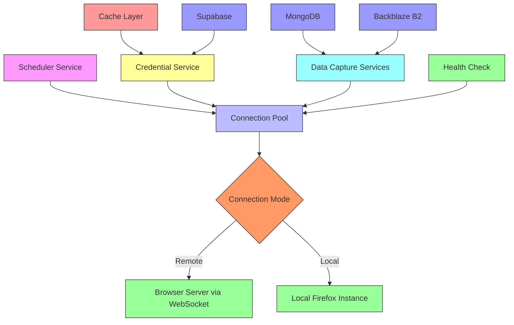
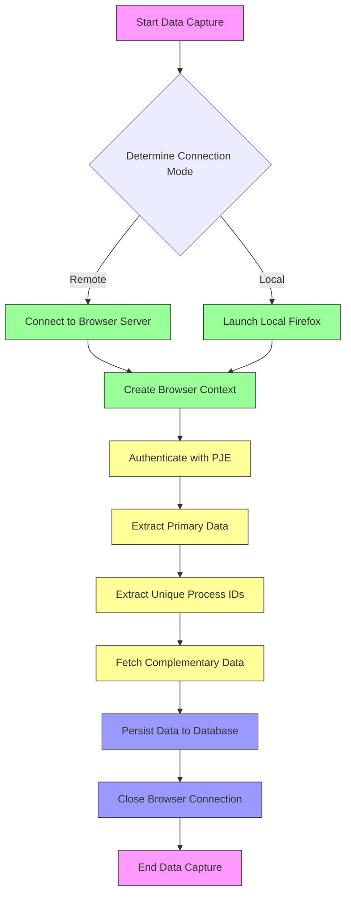

# Connection Pooling

<cite>
**Referenced Files in This Document**   
- [browser-connection.service.ts](file://backend/captura/services/browser/browser-connection.service.ts)
- [credential-cache.service.ts](file://backend/captura/credentials/credential-cache.service.ts)
- [credential.service.ts](file://backend/captura/credentials/credential.service.ts)
- [executar-agendamento.service.ts](file://backend/captura/services/scheduler/executar-agendamento.service.ts)
- [agendamento-scheduler.service.ts](file://backend/captura/services/scheduler/agendamento-scheduler.service.ts)
- [acervo-geral.service.ts](file://backend/captura/services/trt/acervo-geral.service.ts)
- [arquivados.service.ts](file://backend/captura/services/trt/arquivados.service.ts)
- [audiencias.service.ts](file://backend/captura/services/trt/audiencias.service.ts)
- [pendentes-manifestacao.service.ts](file://backend/captura/services/trt/pendentes-manifestacao.service.ts)
</cite>

## Table of Contents
1. [Introduction](#introduction)
2. [Architecture Overview](#architecture-overview)
3. [Core Components](#core-components)
4. [Connection Lifecycle Management](#connection-lifecycle-management)
5. [Browser Connection Service](#browser-connection-service)
6. [Usage Patterns and Integration](#usage-patterns-and-integration)
7. [Error Handling and Resilience](#error-handling-and-resilience)
8. [Performance Considerations](#performance-considerations)
9. [Troubleshooting Guide](#troubleshooting-guide)
10. [Conclusion](#conclusion)

## Introduction

The Sinesys browser connection management system implements a sophisticated connection pooling mechanism designed to optimize resource utilization during PJE-TRT data capture operations. This system enables efficient handling of concurrent data capture requests by managing browser instances through a reusable pool, reducing the overhead of repeatedly launching and destroying browser processes.

The connection pooling mechanism supports two operational modes: remote browser connections via WebSocket endpoints and local browser instances as fallback. This dual-mode approach ensures reliability while maximizing performance. The system is tightly integrated with credential management, scheduling services, and various data capture workflows including acervo geral, arquivados, audiencias, and pendentes de manifestação.

This document provides a comprehensive analysis of the connection pooling implementation, detailing how browser instances are created, reused, and managed. It covers the interfaces for acquiring and releasing connections, the domain model for pooled browser contexts, and usage patterns for handling concurrent requests. The documentation also addresses common issues such as connection exhaustion, race conditions, and memory leaks, providing solutions through timeout mechanisms, maximum pool size limits, and health checks.

**Section sources**
- [browser-connection.service.ts](file://backend/captura/services/browser/browser-connection.service.ts#L1-L274)

## Architecture Overview

The connection pooling architecture in Sinesys follows a layered approach with clear separation of concerns between connection management, authentication, and data capture services. The system is designed to handle concurrent data capture requests efficiently while maintaining resource optimization through connection reuse.



**Diagram sources**
- [browser-connection.service.ts](file://backend/captura/services/browser/browser-connection.service.ts#L1-L274)
- [credential.service.ts](file://backend/captura/credentials/credential.service.ts#L1-L401)
- [executar-agendamento.service.ts](file://backend/captura/services/scheduler/executar-agendamento.service.ts#L1-L485)

## Core Components

The connection pooling system in Sinesys consists of several core components that work together to manage browser instances efficiently. The primary component is the Browser Connection Service, which handles the creation and management of browser connections. This service supports both remote and local connection modes, providing flexibility in deployment scenarios.

The Credential Service and Credential Cache work in tandem to manage authentication credentials for accessing tribunal systems. The cache layer reduces database queries by storing credentials in memory with a configurable TTL (Time To Live), improving performance during batch operations. The scheduler service coordinates periodic data capture tasks, acquiring browser connections as needed and ensuring proper cleanup after use.

Data capture services for different types of information (acervo geral, arquivados, audiencias, and pendentes de manifestação) follow a consistent pattern: they acquire a browser connection, perform their specific data extraction tasks, and release the connection. Each service implements a multi-phase workflow that includes authentication, data retrieval, complementary data collection, persistence, and connection cleanup.

**Section sources**
- [browser-connection.service.ts](file://backend/captura/services/browser/browser-connection.service.ts#L1-L274)
- [credential-cache.service.ts](file://backend/captura/credentials/credential-cache.service.ts#L1-L447)
- [credential.service.ts](file://backend/captura/credentials/credential.service.ts#L1-L401)

## Connection Lifecycle Management

The connection lifecycle in Sinesys follows a well-defined pattern that ensures proper resource management and prevents memory leaks. When a data capture operation begins, the system requests a browser connection through the `getBrowserConnection` interface. This function evaluates the configuration to determine whether to connect to a remote browser server or launch a local instance.

For remote connections, the system establishes a WebSocket connection to the configured browser server endpoint. If authentication is required, the token is appended to the WebSocket URL. The connection uses Playwright's Firefox client to connect to the remote browser server, creating a browser context and page for navigation. In the fallback scenario, when no remote endpoint is configured or the connection fails, the system launches a local Firefox instance using Playwright.

After the data capture operation completes, the connection is properly closed using the `closeBrowser` function, which handles the cleanup process. This function includes error handling to ensure that the browser is closed even if an error occurs during the closing process. The system also implements health checks through the `checkBrowserServiceHealth` function, which verifies the availability of the remote browser service by making an HTTP request to its health endpoint.

```mermaid
sequenceDiagram
participant Client as Data Capture Service
participant Pool as Browser Connection Service
participant Remote as Remote Browser Server
participant Local as Local Firefox
Client->>Pool : getBrowserConnection()
alt Remote Mode Configured
Pool->>Remote : Connect via WebSocket
alt Connection Success
Remote-->>Pool : Browser Instance
Pool->>Pool : Create Context & Page
Pool-->>Client : Browser, Context, Page
else Connection Failure
Pool->>Local : Launch Firefox
Local-->>Pool : Browser Instance
Pool->>Pool : Create Context & Page
Pool-->>Client : Browser, Context, Page
end
else Local Mode
Pool->>Local : Launch Firefox
Local-->>Pool : Browser Instance
Pool->>Pool : Create Context & Page
Pool-->>Client : Browser, Context, Page
end
Client->>Client : Perform Data Capture
Client->>Pool : closeBrowser()
Pool->>Pool : Close Context & Page
Pool->>Remote : Close Connection
or
Pool->>Local : Close Instance
Pool-->>Client : Closed
Note over Client,Pool : Connection lifecycle ensures proper resource cleanup
```

**Diagram sources**
- [browser-connection.service.ts](file://backend/captura/services/browser/browser-connection.service.ts#L1-L274)

## Browser Connection Service

The Browser Connection Service is the central component of the connection pooling mechanism in Sinesys. Implemented in `browser-connection.service.ts`, this service provides a comprehensive interface for managing browser connections with support for both remote and local execution modes. The service is designed to be resilient, with automatic fallback from remote to local mode if the remote connection fails.

The service exports several key functions that form its public interface. The `getBrowserConnection` function is the primary entry point, accepting configuration options such as viewport size, user agent, and timeout settings. This function determines the connection mode based on the presence of the `BROWSER_WS_ENDPOINT` environment variable. When this variable is set, the service attempts to connect to the remote browser server; otherwise, it launches a local Firefox instance.

The service also provides specialized functions like `getFirefoxConnection` which ensures Firefox is used regardless of configuration, and `checkBrowserServiceHealth` which performs health checks on the remote browser service. The connection options interface allows customization of browser behavior, including headless mode, viewport dimensions, and user agent strings, providing flexibility for different scraping requirements.

```mermaid
classDiagram
class BrowserConnectionOptions {
+browserType : string
+headless : boolean
+viewport : {width : number, height : number}
+userAgent : string
+timeout : number
}
class BrowserConnectionResult {
+browser : Browser
+browserContext : BrowserContext
+page : Page
+isRemote : boolean
}
class BrowserConnectionService {
+getBrowserConnection(options : BrowserConnectionOptions) : Promise~BrowserConnectionResult~
+getFirefoxConnection(options : Omit~BrowserConnectionOptions, 'browserType'~) : Promise~BrowserConnectionResult~
+closeBrowser(browser : Browser) : Promise~void~
+checkBrowserServiceHealth() : Promise~{available : boolean, isRemote : boolean, endpoint? : string, error? : string}~
}
BrowserConnectionService --> BrowserConnectionOptions : "uses"
BrowserConnectionService --> BrowserConnectionResult : "returns"
note right of BrowserConnectionService
Central service for managing browser connections
Supports both remote (WebSocket) and local modes
Provides automatic fallback and health checks
end note
```

**Diagram sources**
- [browser-connection.service.ts](file://backend/captura/services/browser/browser-connection.service.ts#L1-L274)

## Usage Patterns and Integration

The connection pooling mechanism is integrated throughout the Sinesys system, particularly in the data capture services that handle PJE-TRT data extraction. Each data capture service follows a consistent pattern of acquiring a browser connection, performing its specific tasks, and releasing the connection. This pattern ensures that browser resources are used efficiently and prevents connection leaks.

The scheduler service plays a crucial role in managing connection usage across multiple concurrent operations. It processes agendamentos (scheduled tasks) sequentially, acquiring a browser connection for each task and ensuring proper cleanup before moving to the next task. This sequential processing prevents connection exhaustion that could occur with parallel execution.

Data capture services such as acervo geral, arquivados, audiencias, and pendentes de manifestação all follow a six-phase workflow: authentication, data retrieval, process ID extraction, complementary data collection, persistence, and connection cleanup. During the authentication phase, the service acquires a browser connection and logs into the PJE system. The data retrieval phase extracts the primary dataset, while the complementary data collection phase gathers additional information like timelines and partes for each unique process.



**Diagram sources**
- [executar-agendamento.service.ts](file://backend/captura/services/scheduler/executar-agendamento.service.ts#L1-L485)
- [acervo-geral.service.ts](file://backend/captura/services/trt/acervo-geral.service.ts#L1-L354)
- [arquivados.service.ts](file://backend/captura/services/trt/arquivados.service.ts#L1-L351)

## Error Handling and Resilience

The connection pooling system in Sinesys implements comprehensive error handling and resilience mechanisms to ensure reliable operation in production environments. The system is designed to handle various failure scenarios gracefully, including network issues, authentication failures, and browser crashes.

The primary resilience feature is the automatic fallback from remote to local browser mode. When the `getBrowserConnection` function fails to establish a connection with the remote browser server, it automatically attempts to launch a local Firefox instance. This fallback mechanism ensures that data capture operations can continue even if the dedicated browser server is unavailable.

Connection health checks are performed through the `checkBrowserServiceHealth` function, which verifies the availability of the remote browser service by making an HTTP request to its health endpoint. This proactive monitoring allows the system to detect issues before attempting to establish connections, reducing failed operations and improving overall reliability.

The system also implements proper cleanup procedures to prevent resource leaks. The `closeBrowser` function includes error handling to ensure that the browser is closed even if an error occurs during the closing process. Additionally, all data capture services use try-finally blocks to guarantee that browser connections are closed regardless of whether the operation succeeds or fails.

**Section sources**
- [browser-connection.service.ts](file://backend/captura/services/browser/browser-connection.service.ts#L1-L274)
- [executar-agendamento.service.ts](file://backend/captura/services/scheduler/executar-agendamento.service.ts#L1-L485)

## Performance Considerations

The connection pooling mechanism in Sinesys is designed with performance optimization as a primary consideration. The system balances the need for efficient resource utilization with the requirements of reliable data capture operations. Several performance-related features and configurations contribute to the overall efficiency of the system.

The use of remote browser connections via WebSocket endpoints reduces the overhead of launching and destroying browser instances for each data capture operation. This approach allows for faster connection establishment and reduces memory usage compared to launching local instances. The system also implements credential caching with a 5-minute TTL, which significantly reduces database queries when processing multiple TRTs and graus.

The sequential processing of scheduled tasks by the scheduler service prevents connection exhaustion that could occur with parallel execution. While this approach may increase the total processing time for multiple tasks, it ensures stable operation and prevents resource contention. The system could be enhanced with a true connection pool that allows multiple concurrent operations within defined limits, but the current implementation prioritizes stability over maximum throughput.

**Section sources**
- [browser-connection.service.ts](file://backend/captura/services/browser/browser-connection.service.ts#L1-L274)
- [credential-cache.service.ts](file://backend/captura/credentials/credential-cache.service.ts#L1-L447)
- [executar-agendamento.service.ts](file://backend/captura/services/scheduler/executar-agendamento.service.ts#L1-L485)

## Troubleshooting Guide

When troubleshooting issues with the connection pooling system in Sinesys, several common problems and their solutions should be considered. Connection failures are among the most frequent issues, typically occurring when the remote browser server is unavailable or misconfigured. In such cases, the system should automatically fall back to local browser mode, but administrators should verify the `BROWSER_WS_ENDPOINT` environment variable and ensure the browser server is running.

Credential-related issues can also affect connection establishment. The credential cache with its 5-minute TTL may cause delays in reflecting updated credentials. If credential changes are not being recognized, clearing the credential cache or waiting for the TTL to expire can resolve the issue. Monitoring the credential cache statistics through the `getCacheStats` function can help identify cache-related performance problems.

Memory leaks and connection exhaustion can occur if browser instances are not properly closed. The system includes safeguards to prevent this, but administrators should monitor browser process counts and ensure that the `closeBrowser` function is always called. Implementing additional monitoring and alerting for long-running browser processes can help detect and resolve such issues proactively.

**Section sources**
- [browser-connection.service.ts](file://backend/captura/services/browser/browser-connection.service.ts#L1-L274)
- [credential-cache.service.ts](file://backend/captura/credentials/credential-cache.service.ts#L1-L447)

## Conclusion

The connection pooling mechanism in the Sinesys browser connection management system provides a robust and efficient solution for handling PJE-TRT data capture operations. By supporting both remote and local browser modes with automatic fallback, the system ensures high availability and reliability. The integration with credential management, scheduling services, and various data capture workflows demonstrates a well-architected approach to resource optimization.

The system's design prioritizes stability and proper resource management over maximum throughput, making it suitable for production environments where reliability is paramount. The comprehensive error handling, health checks, and cleanup procedures prevent common issues such as connection leaks and memory exhaustion. While the current implementation processes tasks sequentially to avoid connection exhaustion, future enhancements could introduce a true connection pool with configurable size limits to support higher concurrency.

Overall, the connection pooling mechanism in Sinesys represents a sophisticated solution that effectively balances performance, reliability, and resource efficiency in the context of web scraping and data capture operations.