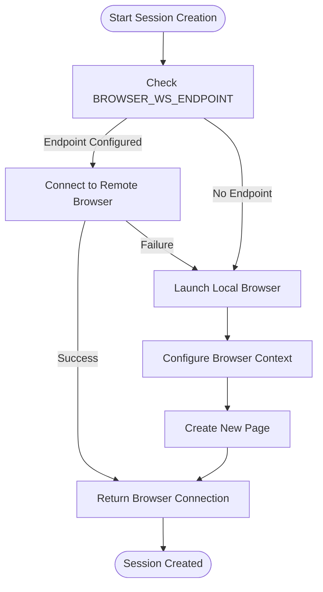
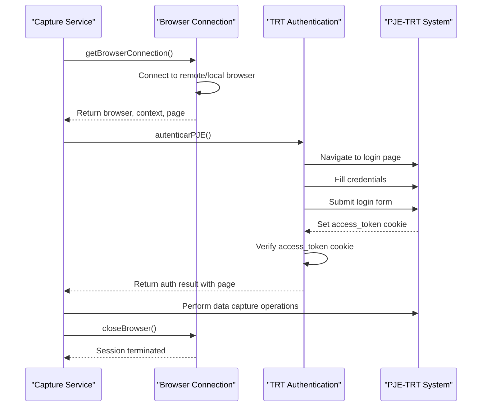
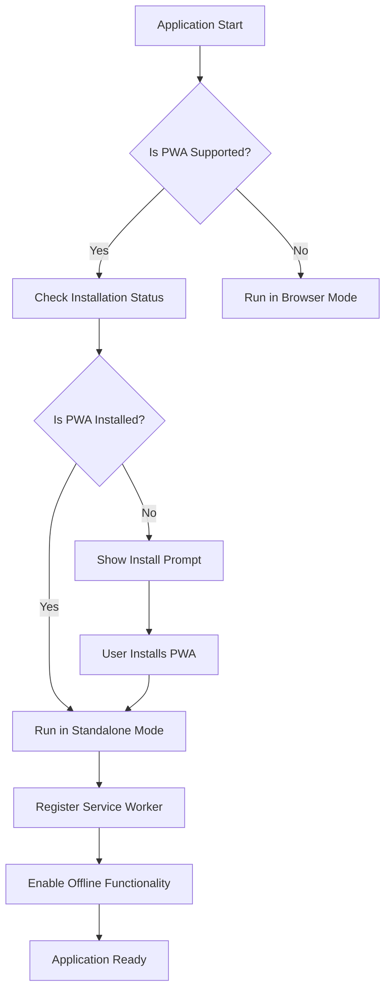
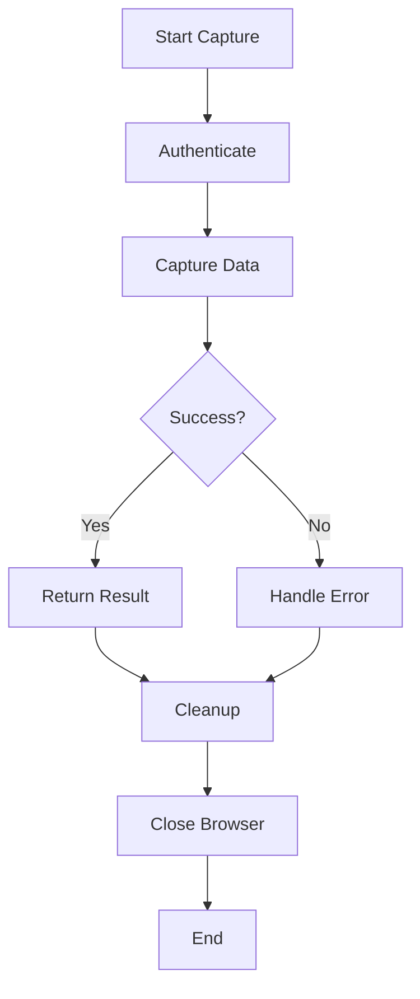
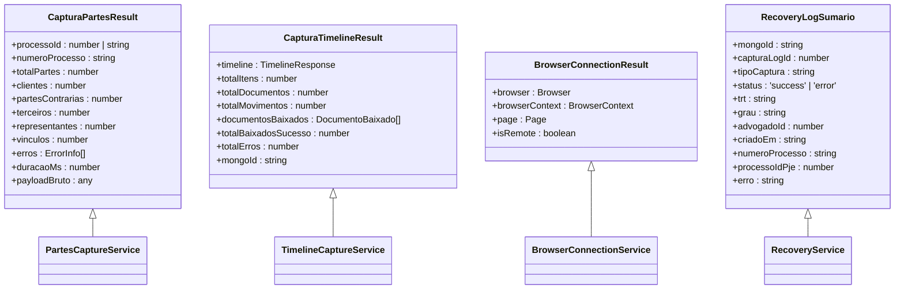
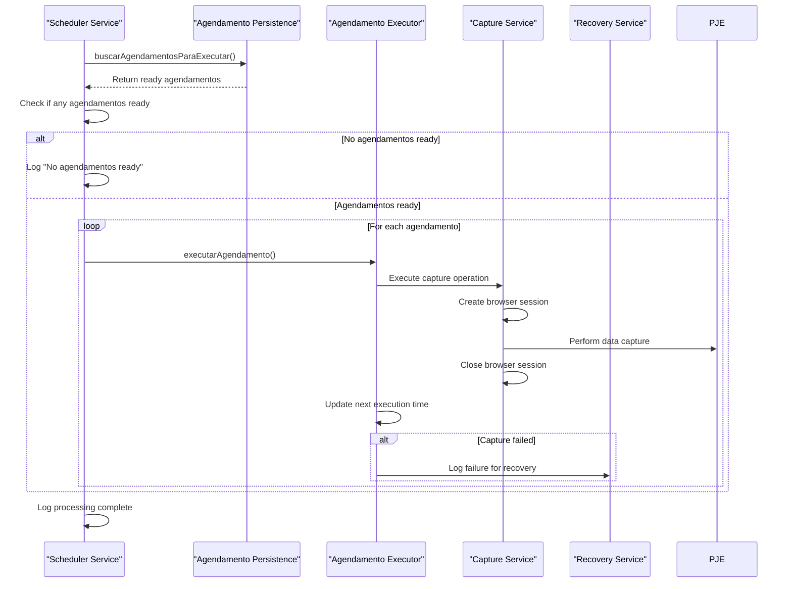
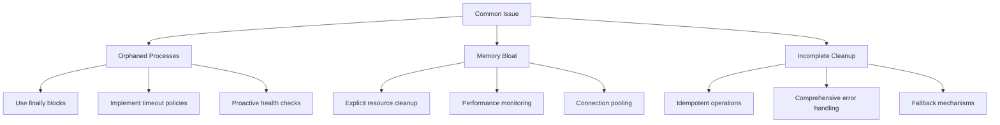

# Session Lifecycle Management

<cite>
**Referenced Files in This Document**   
- [browser-connection.service.ts](file://backend/captura/services/browser/browser-connection.service.ts)
- [pwa-utils.ts](file://app/_lib/pwa-utils.ts)
- [pwa-utils.ts](file://lib/pwa-utils.ts)
- [pwa.d.ts](file://types/pwa.d.ts)
- [timeline-capture.service.ts](file://backend/captura/services/timeline/timeline-capture.service.ts)
- [trt-auth.service.ts](file://backend/captura/services/trt/trt-auth.service.ts)
- [partes-capture.service.ts](file://backend/captura/services/partes/partes-capture.service.ts)
- [agendamento-scheduler.service.ts](file://backend/captura/services/scheduler/agendamento-scheduler.service.ts)
</cite>

## Table of Contents
1. [Introduction](#introduction)
2. [Browser Session Creation](#browser-session-creation)
3. [Session State Management](#session-state-management)
4. [PWA Integration and Lifecycle](#pwa-integration-and-lifecycle)
5. [Session Termination and Cleanup](#session-termination-and-cleanup)
6. [Domain Model for Session Tracking](#domain-model-for-session-tracking)
7. [Integration with Recovery Service and Scheduler](#integration-with-recovery-service-and-scheduler)
8. [Common Issues and Solutions](#common-issues-and-solutions)
9. [Conclusion](#conclusion)

## Introduction

The Sinesys data capture system implements a robust browser session lifecycle management system for interacting with the PJE-TRT (Processo Judicial Eletrônico - Tribunal Regional do Trabalho) platform. This documentation details the implementation of browser session creation, maintenance, and termination throughout their lifecycle. The system uses Playwright for browser automation, supporting both remote and local Firefox instances, with comprehensive error handling and resource management.

The session lifecycle is tightly integrated with the Progressive Web App (PWA) infrastructure, allowing for reliable data capture from the PJE-TRT system while ensuring proper resource cleanup and preventing memory leaks. This document covers the interfaces for initializing browser contexts, managing session state, and properly closing connections, along with the domain model for tracking session status, duration, and resource usage.

**Section sources**
- [browser-connection.service.ts](file://backend/captura/services/browser/browser-connection.service.ts#L1-L274)
- [pwa-utils.ts](file://app/_lib/pwa-utils.ts#L1-L129)

## Browser Session Creation

The browser session creation process in Sinesys is implemented in the `browser-connection.service.ts` file, which provides a robust mechanism for establishing connections to Firefox browsers for scraping the PJE-TRT system. The service supports two distinct modes of operation:

1. **Remote Firefox Connection**: When the `BROWSER_WS_ENDPOINT` environment variable is configured, the system connects via WebSocket to a remote Firefox Browser Server (Playwright). This is the recommended configuration for production environments.

2. **Local Firefox Instance**: When no remote endpoint is configured, the system launches a local Firefox instance via Playwright, which is useful for development and testing.

The session creation process begins with the `getBrowserConnection` function, which serves as the primary entry point for establishing browser connections. This function first checks for the presence of a remote WebSocket endpoint. If available, it attempts to connect to the remote browser server. If the remote connection fails or no endpoint is configured, it falls back to launching a local browser instance.



**Diagram sources**
- [browser-connection.service.ts](file://backend/captura/services/browser/browser-connection.service.ts#L170-L189)

The browser connection options are defined by the `BrowserConnectionOptions` interface, which includes configurable parameters such as:
- `headless`: Whether to run in headless mode (default: true)
- `viewport`: Custom viewport dimensions
- `userAgent`: Custom user agent string
- `timeout`: Connection timeout in milliseconds (default: 60000)

When connecting to a remote browser, the service automatically appends an authentication token from the `BROWSER_SERVICE_TOKEN` environment variable to the WebSocket URL if present. The connection process includes comprehensive error handling, with fallback mechanisms to ensure session creation even if the primary method fails.

For PJE-TRT specific operations, the system provides the `getFirefoxConnection` function, which is a convenience wrapper around `getBrowserConnection` that ensures Firefox is used regardless of configuration.

**Section sources**
- [browser-connection.service.ts](file://backend/captura/services/browser/browser-connection.service.ts#L75-L143)

## Session State Management

Session state management in the Sinesys system is implemented through a combination of browser context management, authentication state tracking, and service coordination. The system maintains session state across various components, ensuring consistent behavior throughout the data capture process.

The core session state is managed by the browser connection service, which tracks whether a session is connected to a remote or local browser instance through the `isRemote` flag in the `BrowserConnectionResult` interface. This flag is used by higher-level services to adapt their behavior based on the connection type.

Authentication state is a critical aspect of session management, particularly for PJE-TRT interactions. The system implements authentication through the `autenticarPJE` function in the `trt-auth.service.ts` file, which handles the login process and maintains authentication cookies. After successful authentication, the system verifies the presence of the `access_token` cookie, with retry logic in place to handle cases where the cookie is not immediately available.



**Diagram sources**
- [browser-connection.service.ts](file://backend/captura/services/browser/browser-connection.service.ts#L170-L189)
- [trt-auth.service.ts](file://backend/captura/services/trt/trt-auth.service.ts#L464-L481)

The system also implements health checking functionality through the `checkBrowserServiceHealth` function, which verifies the availability of the remote browser service by making an HTTP request to the `/health` endpoint. This allows the system to proactively detect service availability and make informed decisions about connection strategies.

For data capture operations, session state is maintained through the coordination of multiple services. For example, when capturing process timelines, the `capturarTimeline` function in `timeline-capture.service.ts` maintains state throughout the process, including:
- Authentication result
- Timeline data
- Document download status
- MongoDB persistence status

The system uses structured result objects to track the state of operations, such as the `CapturaTimelineResult` interface which includes fields for tracking the number of items processed, documents downloaded, and errors encountered.

**Section sources**
- [browser-connection.service.ts](file://backend/captura/services/browser/browser-connection.service.ts#L221-L261)
- [timeline-capture.service.ts](file://backend/captura/services/timeline/timeline-capture.service.ts#L123-L352)

## PWA Integration and Lifecycle

The Sinesys system integrates with Progressive Web App (PWA) functionality through utility functions in the `pwa-utils.ts` files, which provide a consistent interface for detecting and managing PWA installation state. This integration is crucial for the overall application lifecycle, particularly for offline capabilities and installation management.

The PWA utilities are implemented in two locations: `app/_lib/pwa-utils.ts` and `lib/pwa-utils.ts`, providing both client-side and server-side accessible functions. The key functions include:

- `isPWAInstalled()`: Checks if the app is running as an installed PWA by detecting standalone display mode or iOS standalone mode
- `isPWASupported()`: Verifies browser support for PWA features including service workers and installation prompts
- `registerServiceWorker()`: Manually registers the service worker for caching and offline functionality
- `unregisterServiceWorker()`: Removes all service worker registrations, useful for debugging
- `checkForUpdates()`: Forces a check for service worker updates to ensure the latest application version is available
- `getInstallationSource()`: Detects whether the app is running in browser, on homescreen, or in standalone mode



**Diagram sources**
- [pwa-utils.ts](file://app/_lib/pwa-utils.ts#L12-L25)
- [pwa-utils.ts](file://lib/pwa-utils.ts#L20-L32)

The system also includes type definitions in `types/pwa.d.ts` that extend the global window interface to include PWA-specific events such as `beforeinstallprompt` and `appinstalled`, enabling proper TypeScript support for PWA functionality.

The PWA integration is designed to be resilient, with comprehensive error handling in all functions. For example, the `isPWAInstalled` function includes try-catch blocks to handle cases where the `window` object is not available (during server-side rendering) or when browser APIs throw errors.

This PWA integration complements the browser session management by providing a consistent user experience across different installation states while ensuring that the data capture functionality remains available regardless of the PWA installation status.

**Section sources**
- [pwa-utils.ts](file://app/_lib/pwa-utils.ts#L1-L129)
- [pwa-utils.ts](file://lib/pwa-utils.ts#L1-L143)
- [pwa.d.ts](file://types/pwa.d.ts#L1-L51)

## Session Termination and Cleanup

Proper session termination and cleanup is critical in the Sinesys data capture system to prevent resource leaks and ensure system stability. The session cleanup process is implemented through a combination of explicit cleanup functions and automatic cleanup in finally blocks.

The primary mechanism for session termination is the `closeBrowser` function in `browser-connection.service.ts`, which safely closes the browser instance and releases associated resources. This function includes error handling to ensure that cleanup proceeds even if the close operation encounters issues:

```typescript
export async function closeBrowser(browser: Browser): Promise<void> {
  try {
    await browser.close();
    console.log('✅ [Browser] Browser fechado');
  } catch (error) {
    console.error('⚠️ [Browser] Erro ao fechar browser:', error);
  }
}
```

For operations that involve multiple resources, the system implements comprehensive cleanup in finally blocks to ensure that resources are released even if an error occurs. For example, in the `capturarTimeline` function, the browser is closed in a finally block:



**Diagram sources**
- [timeline-capture.service.ts](file://backend/captura/services/timeline/timeline-capture.service.ts#L344-L349)

The system also implements cleanup at the service level. For example, when capturing process parts, the `capturarPartesProcessoInternal` function ensures that browser resources are properly managed throughout the operation. The use of try-catch-finally blocks ensures that cleanup operations are performed regardless of the outcome.

For PWA-related resources, the system provides explicit cleanup functions:
- `unregisterServiceWorker()`: Removes all service worker registrations
- `checkForUpdates()`: Can be used to force update checks and clear stale caches

The cleanup process is designed to be idempotent, meaning that calling cleanup functions multiple times will not cause errors. This is particularly important in error recovery scenarios where cleanup might be attempted multiple times.

Additionally, the system implements timeout policies for operations to prevent sessions from hanging indefinitely. The default timeout for browser connections is 60,000 milliseconds, which can be overridden through the `timeout` parameter in `BrowserConnectionOptions`.

**Section sources**
- [browser-connection.service.ts](file://backend/captura/services/browser/browser-connection.service.ts#L209-L216)
- [timeline-capture.service.ts](file://backend/captura/services/timeline/timeline-capture.service.ts#L344-L349)

## Domain Model for Session Tracking

The Sinesys system implements a comprehensive domain model for tracking session status, duration, and resource usage across various components. This model is distributed across multiple services and interfaces, providing detailed insights into the lifecycle of data capture operations.

The core session tracking model is implemented through structured result objects that capture key metrics about each operation. For example, the `CapturaPartesResult` interface in `partes-capture.service.ts` includes fields for tracking:

- `processoId`: The process ID being captured
- `numeroProcesso`: The CNJ process number
- `totalPartes`: Total number of parties captured
- `clientes`, `partesContrarias`, `terceiros`: Count of each party type
- `representantes`: Number of representatives captured
- `vinculos`: Number of process-party links created
- `erros`: Array of errors encountered
- `duracaoMs`: Duration of the operation in milliseconds
- `payloadBruto`: Raw payload data for debugging



**Diagram sources**
- [partes-capture.service.ts](file://backend/captura/services/partes/partes-capture.service.ts#L395-L407)
- [timeline-capture.service.ts](file://backend/captura/services/timeline/timeline-capture.service.ts#L63-L80)
- [browser-connection.service.ts](file://backend/captura/services/browser/browser-connection.service.ts#L42-L48)
- [api/captura/captura.ts](file://app/api/captura/captura.ts#L546-L558)

The system also implements performance monitoring through the `CAPTURA_CONFIG` object, which includes thresholds for performance alerts. When an operation exceeds the `PERFORMANCE_THRESHOLD_MS`, a warning is logged with detailed metrics.

For recovery and analysis purposes, the system stores detailed logs in MongoDB, with references maintained in the PostgreSQL database. The `RecoveryLogSumario` interface provides a summary view of capture operations, including status, timing, and error information.

The domain model supports both real-time monitoring and historical analysis, enabling the system to identify performance bottlenecks, track success rates, and analyze error patterns across different capture types and tribunals.

**Section sources**
- [partes-capture.service.ts](file://backend/captura/services/partes/partes-capture.service.ts#L395-L407)
- [timeline-capture.service.ts](file://backend/captura/services/timeline/timeline-capture.service.ts#L63-L80)
- [api/captura/captura.ts](file://app/api/captura/captura.ts#L546-L558)

## Integration with Recovery Service and Scheduler

The browser session lifecycle in Sinesys is tightly integrated with the recovery service and scheduler components, creating a cohesive system for automated data capture and error recovery. This integration ensures that sessions are properly managed across scheduled operations and that failed sessions can be recovered and retried.

The scheduler service, implemented in `agendamento-scheduler.service.ts`, is responsible for executing scheduled capture operations. The `executarScheduler` function runs periodically (typically every minute) and processes ready agendamentos:



**Diagram sources**
- [agendamento-scheduler.service.ts](file://backend/captura/services/scheduler/agendamento-scheduler.service.ts#L10-L41)

The recovery service, implemented across multiple files in the `recovery` directory, provides mechanisms for analyzing and recovering from failed capture operations. When a capture operation fails, detailed information is stored in MongoDB, including the raw payload and error details. This allows for post-mortem analysis and targeted recovery.

The integration between the scheduler and recovery service creates a robust error handling system:
1. The scheduler executes capture operations
2. If an operation fails, it's logged in the recovery system
3. The recovery service can analyze the failure and suggest corrective actions
4. The scheduler can then retry the operation with adjusted parameters

This integration ensures that transient failures (such as network issues or temporary PJE-TRT unavailability) are automatically handled, while persistent issues are flagged for manual intervention. The system maintains detailed logs of all operations, enabling comprehensive analysis of session lifecycle patterns and failure modes.

The recovery service also provides APIs for manual intervention, allowing administrators to trigger recovery operations for specific failed sessions. This hybrid approach of automated retry and manual recovery provides both reliability and control.

**Section sources**
- [agendamento-scheduler.service.ts](file://backend/captura/services/scheduler/agendamento-scheduler.service.ts#L1-L41)
- [recovery-analysis.service.ts](file://backend/captura/services/recovery/recovery-analysis.service.ts#L1-L100)

## Common Issues and Solutions

The Sinesys data capture system addresses several common issues related to browser session management through proactive design and robust error handling mechanisms. These solutions ensure system reliability and prevent resource leaks.

### Orphaned Processes
Orphaned browser processes can occur when a session is not properly terminated due to unhandled exceptions. The system mitigates this through:
- **Finally blocks**: Critical cleanup operations are placed in finally blocks to ensure execution regardless of success or failure
- **Timeout policies**: Operations have default timeouts (60,000ms) to prevent indefinite hanging
- **Health checks**: The `checkBrowserServiceHealth` function proactively verifies service availability

### Memory Bloat
Memory bloat can occur when browser contexts are not properly cleaned up. The system prevents this through:
- **Explicit cleanup**: The `closeBrowser` function ensures browser instances are properly closed
- **Resource monitoring**: Performance metrics are tracked and logged for analysis
- **Connection limits**: The system uses connection pooling and limits concurrent operations

### Incomplete Cleanup
Incomplete cleanup can leave system resources in an inconsistent state. The system addresses this through:
- **Idempotent cleanup**: Cleanup functions can be safely called multiple times
- **Comprehensive error handling**: Try-catch blocks surround all cleanup operations
- **Fallback mechanisms**: When remote connections fail, the system falls back to local instances



**Diagram sources**
- [browser-connection.service.ts](file://backend/captura/services/browser/browser-connection.service.ts#L209-L216)
- [timeline-capture.service.ts](file://backend/captura/services/timeline/timeline-capture.service.ts#L344-L349)

The system also implements forced termination mechanisms for unresponsive sessions. When a browser operation exceeds the configured timeout, the connection is terminated, and the system falls back to alternative methods or logs the failure for recovery.

Resource monitoring is implemented through detailed logging and performance metrics. The system logs key events throughout the session lifecycle, including connection establishment, authentication, data capture, and cleanup. These logs enable proactive identification of resource usage patterns and potential issues.

For PWA-specific issues, the system provides utilities to unregister service workers and force update checks, allowing for recovery from corrupted cache states.

These solutions work together to create a resilient system that can handle the challenges of automated browser interaction while maintaining system stability and resource efficiency.

**Section sources**
- [browser-connection.service.ts](file://backend/captura/services/browser/browser-connection.service.ts#L209-L216)
- [timeline-capture.service.ts](file://backend/captura/services/timeline/timeline-capture.service.ts#L344-L349)

## Conclusion

The Sinesys data capture system implements a comprehensive browser session lifecycle management system that effectively handles the creation, maintenance, and termination of browser sessions for interacting with the PJE-TRT platform. The system's architecture combines robust session management with PWA integration, recovery services, and scheduling to create a reliable and efficient data capture solution.

Key strengths of the implementation include:
- **Flexible connection strategies**: Support for both remote and local browser instances with automatic fallback
- **Comprehensive error handling**: Extensive try-catch blocks and fallback mechanisms to ensure reliability
- **Proper resource management**: Explicit cleanup functions and finally blocks to prevent resource leaks
- **Detailed monitoring**: Comprehensive logging and performance metrics for session tracking
- **Resilient design**: Timeout policies, health checks, and recovery mechanisms to handle transient failures

The integration with PWA functionality enhances the user experience by providing offline capabilities and installation management, while the recovery service and scheduler ensure that data capture operations are reliable and can be automatically retried when necessary.

For developers, the system provides clear interfaces and well-documented patterns for managing browser sessions. The use of TypeScript interfaces and structured result objects makes the codebase accessible and maintainable. The separation of concerns between connection management, authentication, data capture, and cleanup promotes code reuse and testability.

Future improvements could include more sophisticated connection pooling, enhanced resource monitoring with alerts, and more granular control over session lifetimes based on usage patterns. However, the current implementation provides a solid foundation for reliable browser automation in the Sinesys ecosystem.