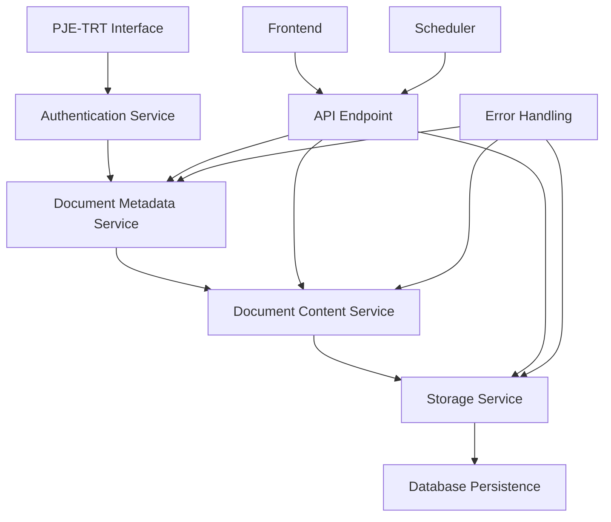
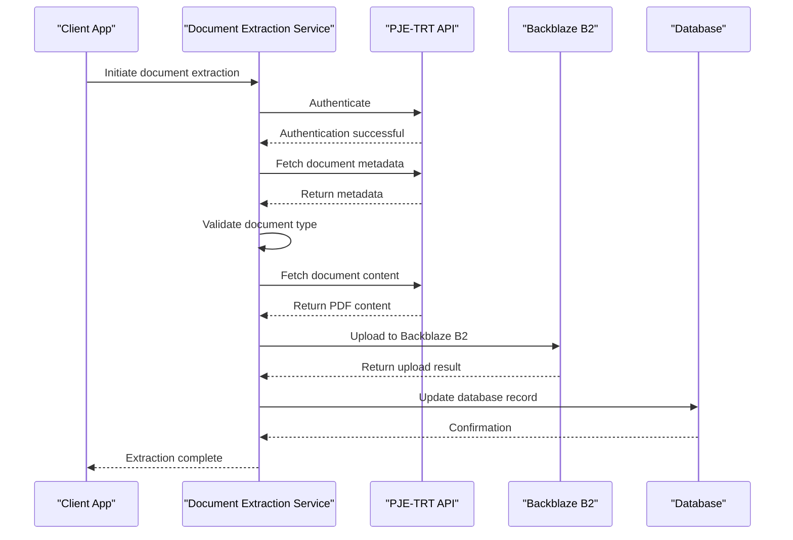
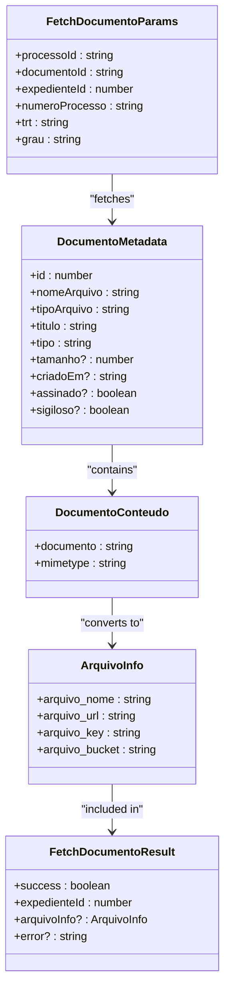
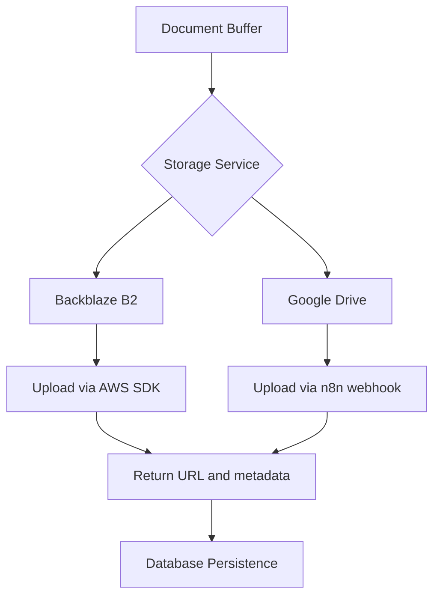
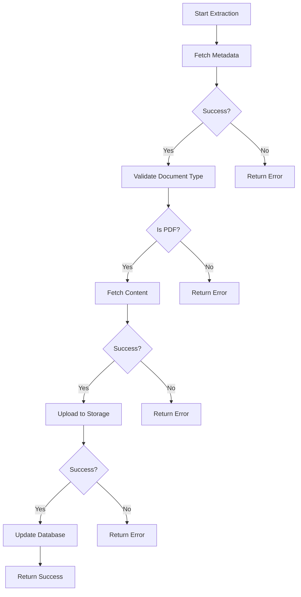

# Document Extraction

<cite>
**Referenced Files in This Document**   
- [pje-expediente-documento.service.ts](file://backend/captura/services/pje/pje-expediente-documento.service.ts)
- [documento-types.ts](file://backend/types/pje-trt/documento-types.ts)
- [backblaze-b2.service.ts](file://backend/storage/backblaze-b2.service.ts)
- [pendentes-manifestacao.service.ts](file://backend/captura/services/trt/pendentes-manifestacao.service.ts)
- [pendentes-persistence.service.ts](file://backend/captura/services/persistence/pendentes-persistence.service.ts)
- [upload-documento.service.ts](file://backend/captura/services/google-drive/upload-documento.service.ts)
- [test-download-documento.ts](file://scripts/api-timeline/test-download-documento.ts)
- [test-documento-detalhes.ts](file://scripts/api-timeline/test-documento-detalhes.ts)
</cite>

## Table of Contents
1. [Introduction](#introduction)
2. [Document Extraction Architecture](#document-extraction-architecture)
3. [Core Components](#core-components)
4. [Document Extraction Workflow](#document-extraction-workflow)
5. [Domain Model](#domain-model)
6. [Storage Integration](#storage-integration)
7. [Error Handling and Resilience](#error-handling-and-resilience)
8. [Usage Patterns](#usage-patterns)
9. [Conclusion](#conclusion)

## Introduction

The document extraction component of the Sinesys data capture system is responsible for retrieving documents from the PJE-TRT (Processo Judicial Eletrônico - Tribunal Regional do Trabalho) interface. This system enables automated capture of legal documents, including metadata parsing, file downloading, and storage in cloud services. The component is specifically designed to handle pendentes de manifestação (pending manifestations), which are critical legal notifications that require timely response.

The extraction process involves several key steps: authentication with the PJE-TRT system, fetching document metadata, downloading the actual document content, uploading to cloud storage (Backblaze B2 or Google Drive), and persisting the results in the database. The system is built to handle various document types, with a primary focus on PDF files, and includes robust error handling for common issues like incomplete downloads and rate limiting.

This documentation provides a comprehensive overview of the implementation details, domain model, and integration points of the document extraction component, making it accessible to both beginners and experienced developers.

**Section sources**
- [pje-expediente-documento.service.ts](file://backend/captura/services/pje/pje-expediente-documento.service.ts)
- [pendentes-manifestacao.service.ts](file://backend/captura/services/trt/pendentes-manifestacao.service.ts)

## Document Extraction Architecture

The document extraction system follows a modular architecture with clear separation of concerns. The core components are organized into services that handle specific aspects of the extraction process, from authentication to storage. The architecture is designed to be extensible, allowing for future integration with other PJE interfaces beyond the current TRT focus.

The system leverages Playwright for browser automation, enabling interaction with the PJE-TRT web interface. This approach allows the system to handle complex authentication flows, including SSO and OTP, while maintaining session state across multiple requests. The extracted documents are stored in cloud storage services, with Backblaze B2 as the primary storage and Google Drive as an alternative option.

**Diagram sources **
- [pje-expediente-documento.service.ts](file://backend/captura/services/pje/pje-expediente-documento.service.ts)
- [pendentes-manifestacao.service.ts](file://backend/captura/services/trt/pendentes-manifestacao.service.ts)
- [backblaze-b2.service.ts](file://backend/storage/backblaze-b2.service.ts)

**Section sources**
- [pje-expediente-documento.service.ts](file://backend/captura/services/pje/pje-expediente-documento.service.ts)
- [pendentes-manifestacao.service.ts](file://backend/captura/services/trt/pendentes-manifestacao.service.ts)
- [backblaze-b2.service.ts](file://backend/storage/backblaze-b2.service.ts)

## Core Components

The document extraction system consists of several core components that work together to retrieve and store documents from the PJE-TRT interface. These components are implemented as services in the backend, each with a specific responsibility.

The `pje-expediente-documento.service.ts` file contains the primary service for document extraction, which orchestrates the entire process from metadata fetching to storage. This service uses Playwright to interact with the PJE-TRT interface, ensuring that the authentication session is maintained throughout the extraction process.

The `documento-types.ts` file defines the domain model for documents, including interfaces for metadata, content, and storage information. These types are used throughout the system to ensure type safety and consistency.

The `backblaze-b2.service.ts` file implements the storage service, which handles uploading documents to Backblaze B2 using the AWS SDK. This service provides a simple interface for uploading files and generating presigned URLs for secure access.

**Section sources**
- [pje-expediente-documento.service.ts](file://backend/captura/services/pje/pje-expediente-documento.service.ts)
- [documento-types.ts](file://backend/types/pje-trt/documento-types.ts)
- [backblaze-b2.service.ts](file://backend/storage/backblaze-b2.service.ts)

## Document Extraction Workflow

The document extraction workflow consists of several sequential steps that ensure reliable and efficient retrieval of documents from the PJE-TRT interface. The process begins with authentication, followed by metadata fetching, content retrieval, storage, and finally database persistence.

The workflow is initiated by calling the `downloadAndUploadDocumento` function, which orchestrates the entire process. This function first fetches the document metadata using the `fetchDocumentoMetadata` function, which makes a GET request to the PJE-TRT API to retrieve information about the document, such as its name, type, and size.

Once the metadata is retrieved, the system validates that the document is a PDF before proceeding with the download. This validation step prevents unnecessary downloads of unsupported file types. The document content is then retrieved using the `fetchDocumentoConteudo` function, which makes another GET request to the PJE-TRT API to download the actual PDF content.

After the content is downloaded, it is converted to a Buffer and uploaded to Backblaze B2 using the `uploadToBackblaze` function. The upload result, including the file URL and key, is then used to update the database record for the document.

**Diagram sources **
- [pje-expediente-documento.service.ts](file://backend/captura/services/pje/pje-expediente-documento.service.ts)
- [backblaze-b2.service.ts](file://backend/storage/backblaze-b2.service.ts)
- [pendentes-persistence.service.ts](file://backend/captura/services/persistence/pendentes-persistence.service.ts)

**Section sources**
- [pje-expediente-documento.service.ts](file://backend/captura/services/pje/pje-expediente-documento.service.ts)
- [backblaze-b2.service.ts](file://backend/storage/backblaze-b2.service.ts)
- [pendentes-persistence.service.ts](file://backend/captura/services/persistence/pendentes-persistence.service.ts)

## Domain Model

The domain model for document extraction is defined in the `documento-types.ts` file and consists of several interfaces that represent the different aspects of a document. These interfaces provide type safety and ensure consistency across the system.

The `DocumentoMetadata` interface represents the metadata of a document, including its ID, name, type, title, size, creation date, and whether it is signed or confidential. This interface is used when fetching document metadata from the PJE-TRT API.

The `DocumentoConteudo` interface represents the content of a document, which is returned as a base64-encoded string. This interface is used when downloading the actual PDF content from the PJE-TRT API.

The `FetchDocumentoParams` interface defines the parameters required to fetch a document, including the process ID, document ID, expedient ID, process number, TRT code, and degree. These parameters are used to construct the API requests and generate the file path in storage.

The `ArquivoInfo` interface represents the information about a file after it has been uploaded to storage. This includes the file name, URL, key, and bucket name. This information is stored in the database to enable access to the document.

The `FetchDocumentoResult` interface represents the result of a document fetch operation, indicating whether it was successful and including either the file information or an error message.

**Diagram sources **
- [documento-types.ts](file://backend/types/pje-trt/documento-types.ts)

**Section sources**
- [documento-types.ts](file://backend/types/pje-trt/documento-types.ts)

## Storage Integration

The document extraction system integrates with cloud storage services to store the downloaded documents. The primary storage service is Backblaze B2, which is accessed using the AWS SDK. The system also supports Google Drive as an alternative storage option.

The `backblaze-b2.service.ts` file implements the storage service, which provides functions for uploading files, deleting files, and generating presigned URLs. The `uploadToBackblaze` function takes a buffer containing the file content, a key (path) for the file in the bucket, and a content type, and returns a result containing the file URL, key, bucket name, and upload timestamp.

The storage service uses environment variables to configure the Backblaze B2 connection, including the endpoint, region, key ID, application key, and bucket name. These variables are validated at runtime to ensure that the service is properly configured.

The system also includes a Google Drive integration, implemented in the `upload-documento.service.ts` file. This service uses a webhook to n8n to upload files to Google Drive. The webhook approach allows the system to leverage existing n8n workflows for Google Drive integration.

**Diagram sources **
- [backblaze-b2.service.ts](file://backend/storage/backblaze-b2.service.ts)
- [upload-documento.service.ts](file://backend/captura/services/google-drive/upload-documento.service.ts)

**Section sources**
- [backblaze-b2.service.ts](file://backend/storage/backblaze-b2.service.ts)
- [upload-documento.service.ts](file://backend/captura/services/google-drive/upload-documento.service.ts)

## Error Handling and Resilience

The document extraction system includes comprehensive error handling to ensure reliability and resilience in the face of common issues. The system handles errors at multiple levels, from API request failures to storage upload issues.

The `downloadAndUploadDocumento` function includes a try-catch block that catches any errors that occur during the extraction process. If an error occurs, the function returns a result with the `success` field set to `false` and an error message describing the issue.

The system validates the document type before downloading the content, preventing unnecessary downloads of unsupported file types. This validation step helps to avoid errors that could occur when attempting to process non-PDF files.

The storage service includes error handling for upload failures, with detailed error messages that can be used for debugging. The `uploadToBackblaze` function throws an error if the upload fails, which is then caught and handled by the document extraction service.

The system also includes rate limiting considerations, with delays between requests to avoid overwhelming the PJE-TRT API. The `pendentes-manifestacao.service.ts` file includes a 300ms delay between requests for parts data, which helps to prevent rate limiting issues.

**Diagram sources **
- [pje-expediente-documento.service.ts](file://backend/captura/services/pje/pje-expediente-documento.service.ts)
- [backblaze-b2.service.ts](file://backend/storage/backblaze-b2.service.ts)

**Section sources**
- [pje-expediente-documento.service.ts](file://backend/captura/services/pje/pje-expediente-documento.service.ts)
- [backblaze-b2.service.ts](file://backend/storage/backblaze-b2.service.ts)

## Usage Patterns

The document extraction system can be used in several different patterns, depending on the specific requirements of the application. The most common usage pattern is through the API endpoint, which allows external applications to initiate document extraction.

The system can also be used as part of a scheduled job, where documents are extracted at regular intervals. This pattern is useful for keeping the local database in sync with the PJE-TRT interface.

Another usage pattern is batch processing, where multiple documents are extracted in a single operation. This pattern is implemented in the `pendentes-manifestacao.service.ts` file, which extracts documents for all pending manifestations in a single run.

The system also supports manual extraction, where a user can initiate the extraction of a specific document through the frontend interface. This pattern is useful for on-demand access to documents.

The API endpoint for document extraction is defined in the `app/api/pje/pendente-manifestacao/documento/route.ts` file, which handles POST requests to initiate document extraction. The endpoint validates the request parameters, calls the `downloadAndUploadDocumento` function, and returns the result to the client.

**Section sources**
- [pje-expediente-documento.service.ts](file://backend/captura/services/pje/pje-expediente-documento.service.ts)
- [pendentes-manifestacao.service.ts](file://backend/captura/services/trt/pendentes-manifestacao.service.ts)
- [app/api/pje/pendente-manifestacao/documento/route.ts](file://app/api/pje/pendente-manifestacao/documento/route.ts)

## Conclusion

The document extraction component of the Sinesys data capture system provides a robust and reliable solution for retrieving documents from the PJE-TRT interface. The system is designed with a modular architecture that separates concerns and enables extensibility. The core components handle authentication, metadata fetching, content retrieval, storage, and database persistence, ensuring that documents are reliably captured and stored.

The domain model is well-defined, with interfaces that provide type safety and consistency across the system. The integration with cloud storage services, including Backblaze B2 and Google Drive, ensures that documents are securely stored and easily accessible.

The system includes comprehensive error handling and resilience features, such as document type validation, rate limiting considerations, and detailed error reporting. These features help to ensure that the system can handle common issues and provide reliable service.

The usage patterns supported by the system, including API access, scheduled jobs, batch processing, and manual extraction, make it flexible and adaptable to a wide range of use cases. The system is well-documented and accessible to both beginners and experienced developers, making it easy to understand and extend.

Overall, the document extraction component is a critical part of the Sinesys data capture system, enabling automated access to legal documents and improving the efficiency of legal workflows.