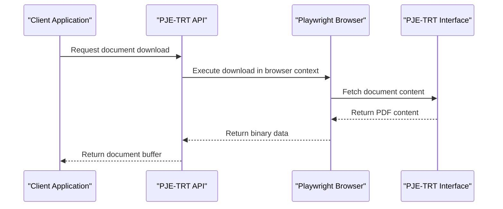
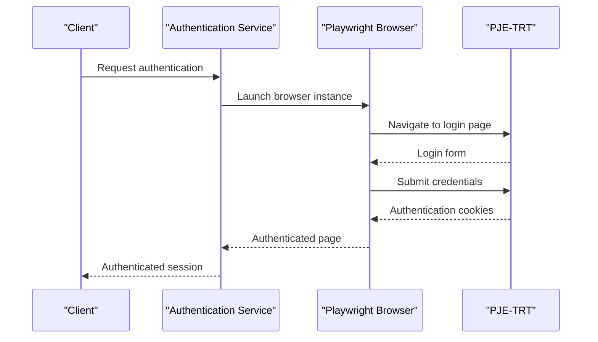
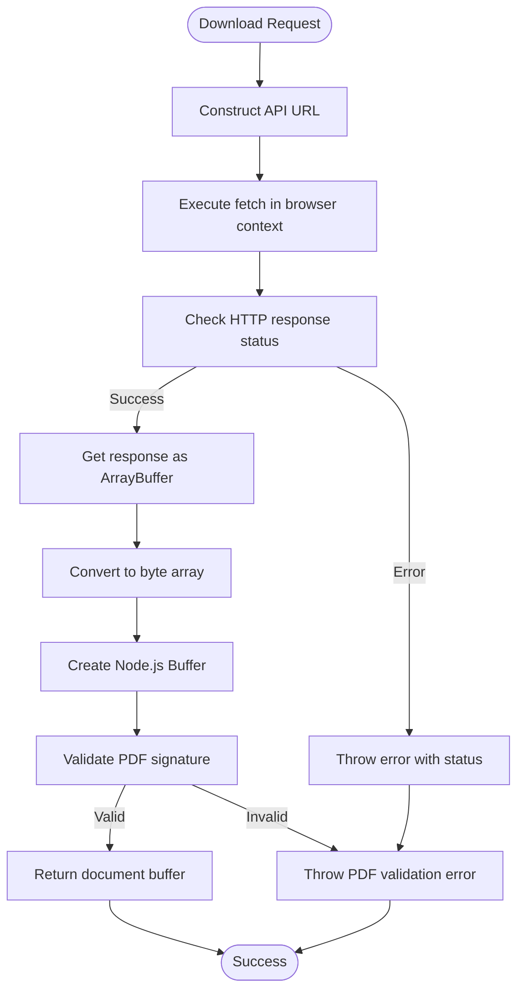
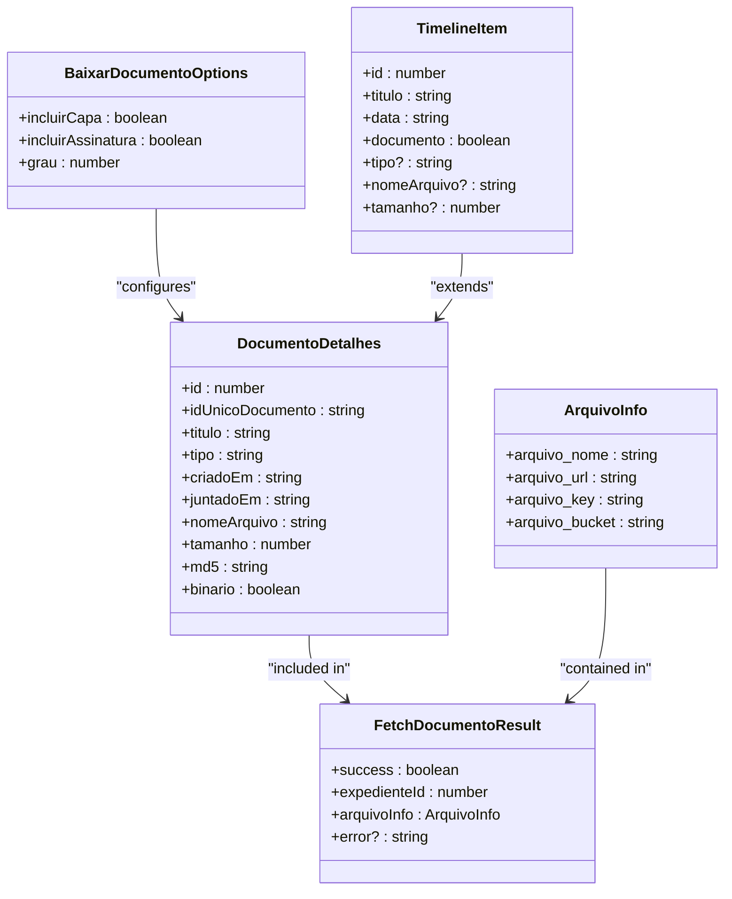
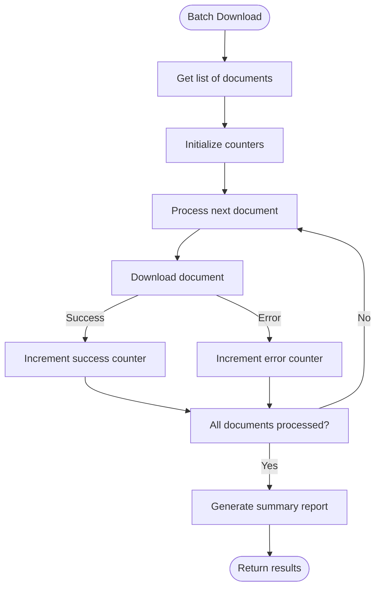
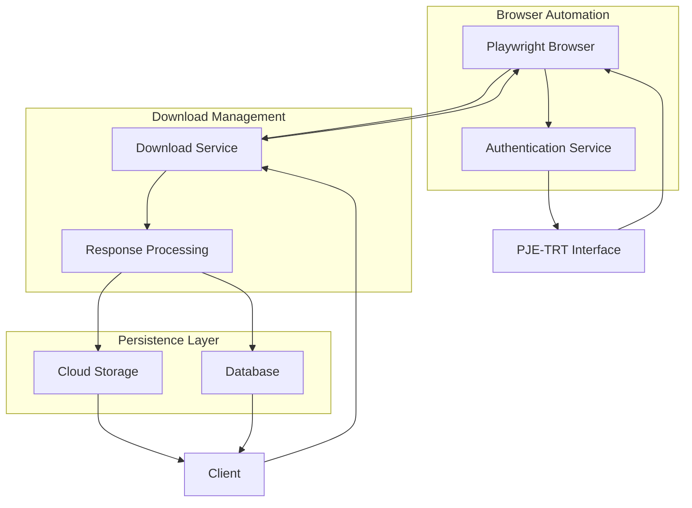
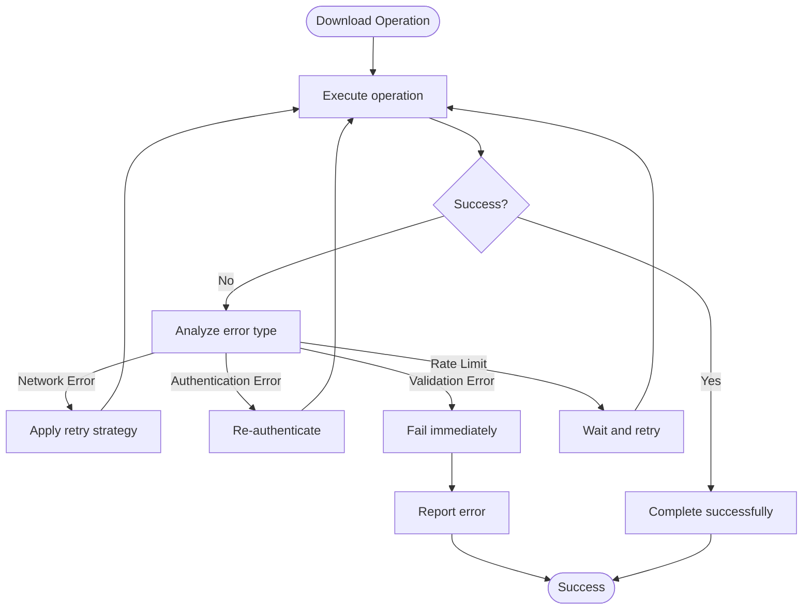

# Download Management

<cite>
**Referenced Files in This Document**   
- [baixar-documento.ts](file://backend/api/pje-trt/timeline/baixar-documento.ts)
- [fetch.ts](file://backend/api/pje-trt/shared/fetch.ts)
- [timeline.ts](file://backend/types/pje-trt/timeline.ts)
- [pje-expediente-documento.service.ts](file://backend/captura/services/pje/pje-expediente-documento.service.ts)
- [test-download-documento.ts](file://scripts/api-timeline/test-download-documento.ts)
- [documento-types.ts](file://backend/types/pje-trt/documento-types.ts)
</cite>

## Table of Contents
1. [Introduction](#introduction)
2. [Download Request Initiation](#download-request-initiation)
3. [Authentication and Session Management](#authentication-and-session-management)
4. [Download Processing and Response Handling](#download-processing-and-response-handling)
5. [Domain Model for Download Status and Progress](#domain-model-for-download-status-and-progress)
6. [Large Files and Batch Operations](#large-files-and-batch-operations)
7. [Integration with Browser Automation and Persistence Layer](#integration-with-browser-automation-and-persistence-layer)
8. [Error Handling and Resilience](#error-handling-and-resilience)
9. [Conclusion](#conclusion)

## Introduction

The download management component of the Sinesys document extraction system handles the retrieval of documents from the PJE-TRT (Processo Judicial Eletrônico - Tribunal Regional do Trabalho) interface. This system enables users to download legal documents such as court decisions, petitions, and certificates from the PJE platform, which is used by Brazilian labor courts. The component orchestrates authentication, download requests, response processing, and storage of retrieved documents.

The system uses browser automation via Playwright to interact with the PJE-TRT web interface, ensuring compatibility with the platform's JavaScript-heavy frontend and authentication mechanisms. Downloads are initiated through API endpoints that coordinate with the browser automation service to fetch document content and metadata. The component handles both individual document downloads and batch operations for multiple documents.

This documentation provides a comprehensive overview of the download management implementation, including the technical architecture, domain models, and integration points with other system components.

**Section sources**
- [baixar-documento.ts](file://backend/api/pje-trt/timeline/baixar-documento.ts)
- [pje-expediente-documento.service.ts](file://backend/captura/services/pje/pje-expediente-documento.service.ts)

## Download Request Initiation

The download management system provides multiple interfaces for initiating document downloads from the PJE-TRT platform. The primary entry point is through the `baixarDocumento` function, which serves as the core interface for downloading document content.



**Diagram sources**
- [baixar-documento.ts](file://backend/api/pje-trt/timeline/baixar-documento.ts)

The `baixarDocumento` function accepts the following parameters:
- `page`: Playwright Page instance with active PJE-TRT session
- `processoId`: Process identifier in the PJE system
- `documentoId`: Document identifier within the process
- `options`: Configuration options for the download

The function constructs a URL to the PJE-TRT API endpoint that serves document content:
```
/pje-comum-api/api/processos/id/{processoId}/documentos/id/{documentoId}/conteudo
```

Download options include:
- `incluirCapa`: Whether to include a cover page in the PDF
- `incluirAssinatura`: Whether to include digital signature information
- `grau`: The court instance (1 for first instance, 2 for second instance)

The system supports both direct downloads through the API and batch operations initiated through administrative interfaces. For batch operations, the system iterates through a list of document identifiers and processes each download request sequentially, with appropriate error handling and retry mechanisms.

**Section sources**
- [baixar-documento.ts](file://backend/api/pje-trt/timeline/baixar-documento.ts)
- [test-download-documento.ts](file://scripts/api-timeline/test-download-documento.ts)

## Authentication and Session Management

Authentication with the PJE-TRT interface is managed through browser automation, leveraging Playwright to maintain authenticated sessions. The system uses cookie-based authentication, where the browser session contains the necessary authentication tokens.



**Diagram sources**
- [fetch.ts](file://backend/api/pje-trt/shared/fetch.ts)

The authentication process follows these steps:
1. Launch a Playwright browser instance
2. Navigate to the PJE-TRT login URL
3. Submit user credentials (CPF and password)
4. Validate successful authentication
5. Return the authenticated browser page for subsequent operations

The `fetchPJEAPI` function in the shared utilities handles API requests by executing them within the browser context, ensuring that authentication cookies are automatically included in requests:

```typescript
const response = await page.evaluate(async ({ url }) => {
  const response = await fetch(url, {
    method: 'GET',
    credentials: 'include', // Include authentication cookies
  });
  // ...
}, { url });
```

This approach eliminates the need to manually extract and manage authentication tokens, as the browser automatically handles cookie management. The system maintains separate browser instances for different users or concurrent operations, ensuring isolation between sessions.

For long-running operations, the system implements session refresh mechanisms to handle authentication timeouts. When a request returns a 401 Unauthorized response, the system can re-authenticate and retry the operation.

**Section sources**
- [fetch.ts](file://backend/api/pje-trt/shared/fetch.ts)
- [test-download-documento.ts](file://scripts/api-timeline/test-download-documento.ts)

## Download Processing and Response Handling

The download processing pipeline handles the retrieval and validation of document content from the PJE-TRT interface. The system uses a multi-step process to ensure reliable download operations and proper response handling.



**Diagram sources**
- [baixar-documento.ts](file://backend/api/pje-trt/timeline/baixar-documento.ts)

The response handling process follows these steps:

1. **Request Execution**: The download request is executed within the browser context using `page.evaluate()`, which allows access to authentication cookies.

2. **Response Validation**: The HTTP response status is checked, and an error is thrown if the status indicates failure (400 or higher).

3. **Binary Data Extraction**: The response body is obtained as an ArrayBuffer and converted to a byte array for processing.

4. **Buffer Creation**: The byte array is converted to a Node.js Buffer, which is the standard format for binary data in the system.

5. **PDF Validation**: The system validates that the downloaded content is a valid PDF by checking for the '%PDF' signature in the first four bytes of the file.

6. **Return Result**: The validated PDF buffer is returned to the caller for further processing or storage.

The system logs detailed information about each download operation, including the request parameters, response size, and completion status. This logging facilitates debugging and monitoring of download operations.

**Section sources**
- [baixar-documento.ts](file://backend/api/pje-trt/timeline/baixar-documento.ts)
- [test-download-documento.ts](file://scripts/api-timeline/test-download-documento.ts)

## Domain Model for Download Status and Progress

The download management system uses a comprehensive domain model to track the status and progress of document downloads. This model includes interfaces for download options, document metadata, and result tracking.



**Diagram sources**
- [timeline.ts](file://backend/types/pje-trt/timeline.ts)
- [documento-types.ts](file://backend/types/pje-trt/documento-types.ts)

The key interfaces in the domain model are:

**BaixarDocumentoOptions**: Configures download parameters
- `incluirCapa`: Controls whether a cover page is included
- `incluirAssinatura`: Determines if digital signature information is included
- `grau`: Specifies the court instance (1 or 2)

**DocumentoDetalhes**: Contains comprehensive metadata about a document
- Basic information (ID, title, type, creation date)
- File properties (name, size, MD5 hash)
- Status indicators (signed, confidential, active)
- Binary information (availability, size)

**FetchDocumentoResult**: Represents the outcome of a download operation
- `success`: Boolean indicating operation success
- `expedienteId`: Identifier of the case or proceeding
- `arquivoInfo`: Storage information for the downloaded file
- `error`: Error message if the operation failed

**ArquivoInfo**: Contains storage metadata for persisted documents
- File name and path
- Public URL for access
- Storage bucket and key

**TimelineItem**: Represents an item in the document timeline
- Can be either a document or a procedural movement
- Includes basic metadata and type indicators

This domain model enables the system to track download operations from initiation through completion, providing detailed status information and facilitating error recovery.

**Section sources**
- [timeline.ts](file://backend/types/pje-trt/timeline.ts)
- [documento-types.ts](file://backend/types/pje-trt/documento-types.ts)

## Large Files and Batch Operations

The download management system implements specialized handling for large files and batch operations to ensure reliable processing and optimal resource utilization.

For large files, the system uses streaming and chunked processing to minimize memory usage. The browser automation approach inherently supports large file downloads, as the content is streamed directly from the PJE-TRT server through the browser to the application.



**Diagram sources**
- [pje-expediente-documento.service.ts](file://backend/captura/services/pje/pje-expediente-documento.service.ts)

The batch processing workflow follows these steps:

1. **Document Enumeration**: Retrieve a list of documents to download, typically from a database query or API response.

2. **Sequential Processing**: Process each document in sequence to avoid overwhelming system resources.

3. **Error Isolation**: Handle errors for individual documents without stopping the entire batch operation.

4. **Progress Tracking**: Maintain counters for successful downloads and errors.

5. **Summary Reporting**: Generate a comprehensive report of the batch operation results.

The `downloadAndUploadDocumento` function in the PJE expediente document service orchestrates the complete process for a single document:

1. Fetch document metadata to validate it's a PDF
2. Download the document content
3. Convert the content to a Buffer
4. Upload to cloud storage (Backblaze B2)
5. Update the database with storage information

For batch operations, this function is called iteratively for each document, with appropriate error handling and logging. The system includes rate limiting to prevent overwhelming the PJE-TRT servers, with configurable delays between requests.

The system also supports resumable batch operations, where the progress is persisted to the database, allowing operations to continue from the point of interruption in case of failures.

**Section sources**
- [pje-expediente-documento.service.ts](file://backend/captura/services/pje/pje-expediente-documento.service.ts)
- [test-download-documento.ts](file://scripts/api-timeline/test-download-documento.ts)

## Integration with Browser Automation and Persistence Layer

The download management component integrates closely with the browser automation service and document persistence layer to provide a complete document extraction solution.



**Diagram sources**
- [pje-expediente-documento.service.ts](file://backend/captura/services/pje/pje-expediente-documento.service.ts)

The integration workflow follows these steps:

1. **Request Initiation**: The client application requests a document download through the API.

2. **Browser Automation**: The download service uses an authenticated Playwright browser instance to access the PJE-TRT interface.

3. **Content Retrieval**: The browser executes JavaScript to fetch the document content via the PJE-TRT API.

4. **Response Processing**: The binary content is processed and validated as a PDF.

5. **Storage Upload**: The document is uploaded to cloud storage (Backblaze B2).

6. **Database Update**: The document metadata and storage information are saved to the database.

The `downloadAndUploadDocumento` function exemplifies this integration, orchestrating the complete workflow:

```typescript
export async function downloadAndUploadDocumento(
  page: Page,
  params: FetchDocumentoParams
): Promise<FetchDocumentoResult> {
  // 1. Fetch metadata
  const metadata = await fetchDocumentoMetadata(page, processoId, documentoId);
  
  // 2. Validate PDF
  if (metadata.tipoArquivo !== 'PDF') {
    throw new Error('Documento não é um PDF válido');
  }
  
  // 3. Fetch content
  const conteudo = await fetchDocumentoConteudo(page, processoId, documentoId);
  
  // 4. Convert to Buffer
  const buffer = Buffer.from(conteudo.documento, 'base64');
  
  // 5. Generate storage path
  const key = gerarCaminhoCompletoPendente(numeroProcesso, expedienteId, documentoId);
  
  // 6. Upload to Backblaze
  const uploadResult = await uploadToBackblaze({
    buffer,
    key,
    contentType: 'application/pdf',
  });
  
  // 7. Update database
  await atualizarDocumentoPendente(expedienteId, arquivoInfo);
  
  return { success: true, expedienteId, arquivoInfo };
}
```

This integration ensures that documents are securely retrieved, validated, stored, and tracked in the system. The separation of concerns between the browser automation, download processing, and persistence layers enables maintainable and extensible code.

**Section sources**
- [pje-expediente-documento.service.ts](file://backend/captura/services/pje/pje-expediente-documento.service.ts)
- [backblaze-b2.service.ts](file://backend/storage/backblaze-b2.service)
- [pendentes-persistence.service.ts](file://backend/captura/services/persistence/pendentes-persistence.service)

## Error Handling and Resilience

The download management system implements comprehensive error handling and resilience mechanisms to address common issues such as network timeouts, incomplete downloads, and rate limiting.



**Diagram sources**
- [baixar-documento.ts](file://backend/api/pje-trt/timeline/baixar-documento.ts)

The system handles several types of errors:

**Network Errors**: Transient network issues are handled with retry mechanisms. The system implements exponential backoff to avoid overwhelming the server during periods of high load or network instability.

**Authentication Errors**: When a 401 Unauthorized response is received, the system can re-authenticate and retry the operation. This handles session expiration and token invalidation.

**Validation Errors**: If the downloaded content is not a valid PDF (missing '%PDF' signature), the operation fails immediately to prevent processing corrupted files.

**Rate Limiting**: The system monitors response headers and adjusts request frequency to comply with server rate limits. When rate limits are detected, the system implements appropriate delays before retrying.

The error handling is implemented at multiple levels:

1. **HTTP Level**: The `fetchPJEAPI` function checks response status and throws errors for non-200 responses.

2. **Content Level**: The `baixarDocumento` function validates that the downloaded content is a valid PDF.

3. **Operation Level**: The `downloadAndUploadDocumento` function catches errors and returns structured error information.

The system also implements circuit breaker patterns to prevent cascading failures. If a certain threshold of failures is reached, the system temporarily stops making requests to allow recovery.

For debugging purposes, the system logs detailed error information, including:
- Error type and message
- Request parameters
- Response status and headers
- Stack trace (when available)

This comprehensive error handling ensures that the system can recover from transient issues while providing clear diagnostics for persistent problems.

**Section sources**
- [baixar-documento.ts](file://backend/api/pje-trt/timeline/baixar-documento.ts)
- [pje-expediente-documento.service.ts](file://backend/captura/services/pje/pje-expediente-documento.service.ts)
- [fetch.ts](file://backend/api/pje-trt/shared/fetch.ts)

## Conclusion

The download management component of the Sinesys document extraction system provides a robust solution for retrieving documents from the PJE-TRT interface. By leveraging browser automation with Playwright, the system can reliably authenticate and download documents while handling the complexities of the PJE-TRT platform.

Key features of the implementation include:
- Secure authentication through browser automation
- Comprehensive error handling and resilience mechanisms
- Efficient processing of large files and batch operations
- Integration with cloud storage and database persistence
- Detailed logging and monitoring capabilities

The system's modular architecture separates concerns between authentication, download processing, and persistence, enabling maintainable and extensible code. The domain model provides a clear representation of document metadata and download status, facilitating tracking and reporting.

For future improvements, the system could implement additional features such as:
- Parallel download processing with configurable concurrency limits
- Advanced retry strategies with jitter
- Download resumption for interrupted large file transfers
- Enhanced progress tracking with real-time updates
- Integration with document processing pipelines for automatic analysis

The current implementation provides a solid foundation for document extraction from the PJE-TRT platform, with proven reliability and comprehensive error handling.