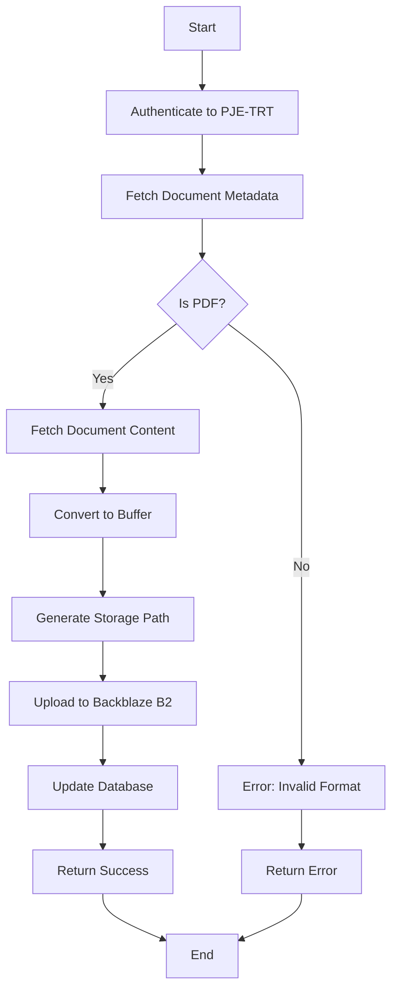
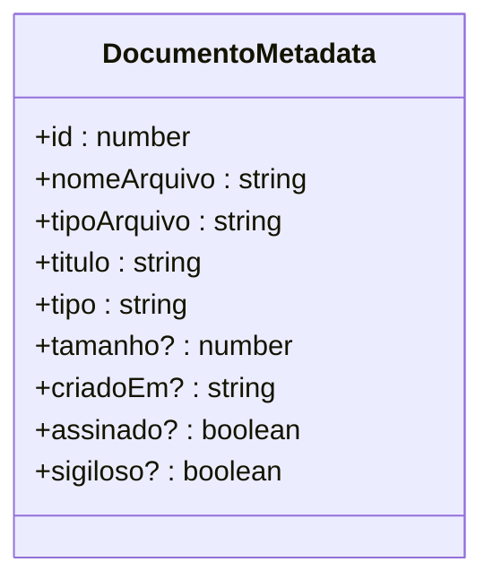
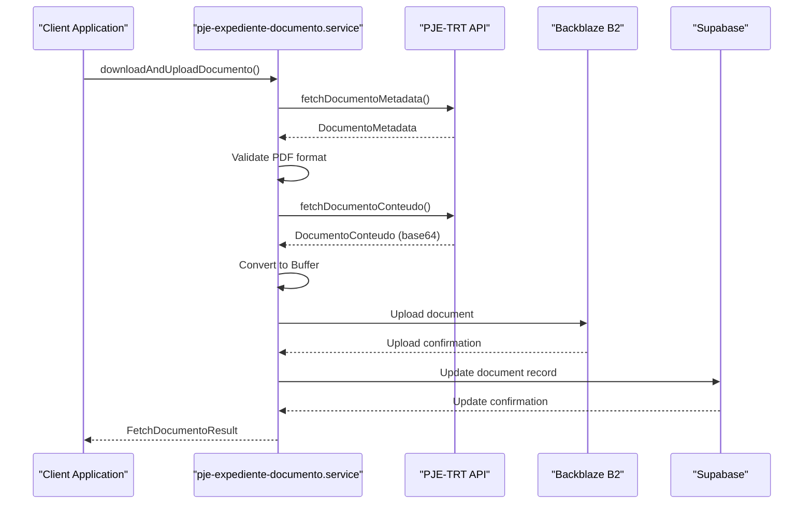
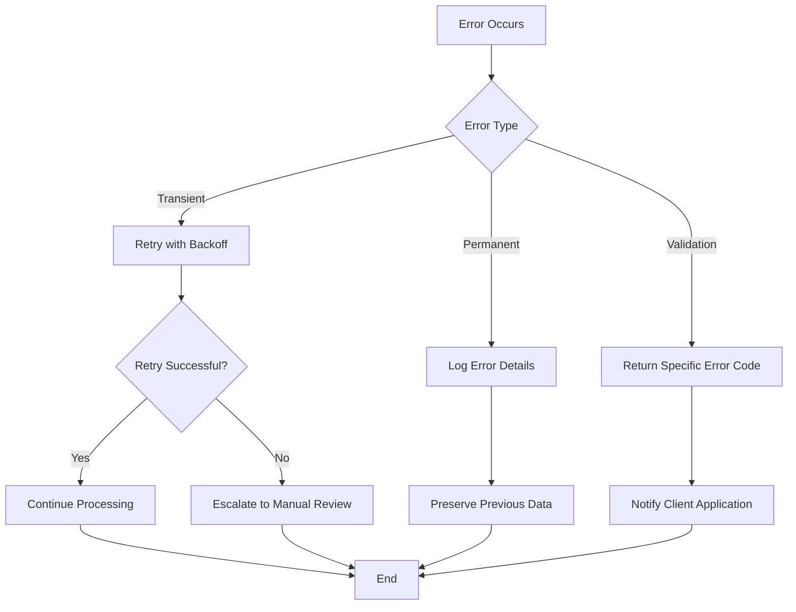
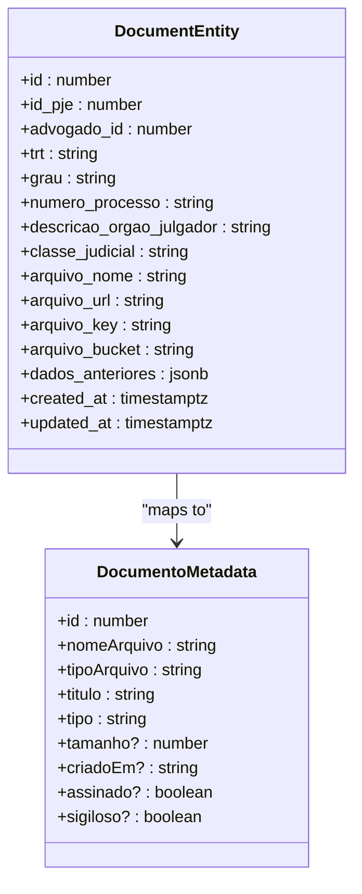
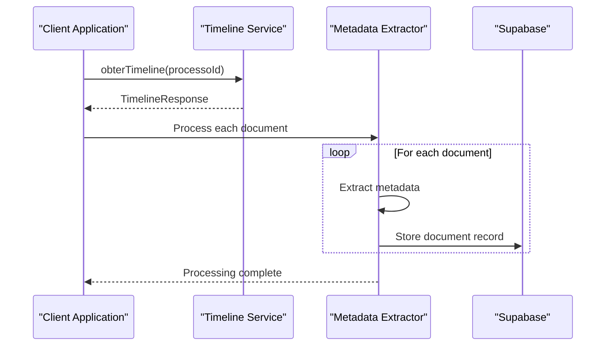

# Metadata Extraction

<cite>
**Referenced Files in This Document**   
- [documento-types.ts](file://backend/types/pje-trt/documento-types.ts#L25-L70)
- [pje-expediente-documento.service.ts](file://backend/captura/services/pje/pje-expediente-documento.service.ts#L68-L299)
- [timeline.ts](file://backend/types/pje-trt/timeline.ts#L65-L116)
- [obter-documento.ts](file://backend/api/pje-trt/timeline/obter-documento.ts#L40-L82)
- [pendentes-persistence.service.ts](file://backend/captura/services/persistence/pendentes-persistence.service.ts#L258-L287)
- [file-naming.utils.ts](file://backend/storage/file-naming.utils.ts)
- [backblaze-b2.service.ts](file://backend/storage/backblaze-b2.service.ts)
</cite>

## Table of Contents
1. [Introduction](#introduction)
2. [Metadata Extraction Overview](#metadata-extraction-overview)
3. [Document Metadata Interface](#document-metadata-interface)
4. [Metadata Extraction Process](#metadata-extraction-process)
5. [Data Normalization and Validation](#data-normalization-and-validation)
6. [Error Handling and Fallback Strategies](#error-handling-and-fallback-strategies)
7. [Integration with Document Entity Model](#integration-with-document-entity-model)
8. [Timeline Service Integration](#timeline-service-integration)
9. [Common Issues and Solutions](#common-issues-and-solutions)
10. [Best Practices](#best-practices)

## Introduction

The metadata extraction component of the Sinesys document extraction system is responsible for parsing document metadata from the PJE-TRT (Processo Judicial Eletrônico - Tribunal Regional do Trabalho) interface. This component extracts critical document properties such as titles, dates, types, and other relevant metadata from HTML responses and transforms them into structured data for storage and processing. The system handles various document types including petitions, certificates, notifications, and court orders, ensuring consistent data representation across the platform.

**Section sources**
- [documento-types.ts](file://backend/types/pje-trt/documento-types.ts#L25-L70)
- [pje-expediente-documento.service.ts](file://backend/captura/services/pje/pje-expediente-documento.service.ts#L68-L299)

## Metadata Extraction Overview

The metadata extraction system follows a multi-step process to capture and process document metadata from the PJE-TRT interface. The workflow begins with authentication to the PJE system using Playwright to maintain browser session context, followed by API calls to retrieve document metadata. The extracted metadata is then validated, normalized, and stored in the system's database with references to the actual document content stored in cloud storage.

The system is designed to handle both individual document extraction and batch processing of multiple documents from process timelines. It integrates with the timeline service to extract metadata from all documents associated with a specific legal process, providing a comprehensive view of the document history.

**Diagram sources**
- [pje-expediente-documento.service.ts](file://backend/captura/services/pje/pje-expediente-documento.service.ts#L219-L299)
- [documento-types.ts](file://backend/types/pje-trt/documento-types.ts#L25-L70)

**Section sources**
- [pje-expediente-documento.service.ts](file://backend/captura/services/pje/pje-expediente-documento.service.ts#L1-L299)
- [obter-timeline.ts](file://backend/api/pje-trt/timeline/obter-timeline.ts#L36-L72)

## Document Metadata Interface

The document metadata interface defines the structure for representing document properties extracted from the PJE-TRT system. The `DocumentoMetadata` interface captures essential document attributes including identification, type, creation date, and security status. This standardized interface ensures consistent data representation across different components of the system.

The metadata includes both technical properties (such as file size and format) and business-relevant information (such as document title and type). The interface is designed to accommodate optional fields that may not be present in all document responses, allowing for flexibility in handling variations across different tribunal systems.

**Diagram sources**
- [documento-types.ts](file://backend/types/pje-trt/documento-types.ts#L60-L70)

**Section sources**
- [documento-types.ts](file://backend/types/pje-trt/documento-types.ts#L25-L70)

## Metadata Extraction Process

The metadata extraction process involves several key steps that transform raw HTML responses from the PJE-TRT interface into structured data. The process begins with the `fetchDocumentoMetadata` function, which makes an authenticated API call to retrieve document metadata. This function uses Playwright's browser context to maintain session cookies and authentication state, ensuring access to protected resources.

After retrieving the metadata, the system validates that the document is in the expected format (PDF) before proceeding with content extraction. The validation step prevents processing of unsupported file types and ensures data quality. Once validated, the system fetches the document content through a separate API endpoint, converting the base64-encoded response into a binary buffer for storage.

The complete extraction workflow is orchestrated by the `downloadAndUploadDocumento` function, which coordinates metadata retrieval, content fetching, storage upload, and database updates. This function implements comprehensive error handling to manage network issues, authentication failures, and data validation errors.

**Diagram sources**
- [pje-expediente-documento.service.ts](file://backend/captura/services/pje/pje-expediente-documento.service.ts#L68-L299)
- [documento-types.ts](file://backend/types/pje-trt/documento-types.ts#L125-L164)

**Section sources**
- [pje-expediente-documento.service.ts](file://backend/captura/services/pje/pje-expediente-documento.service.ts#L68-L299)

## Data Normalization and Validation

Data normalization and validation are critical components of the metadata extraction process, ensuring consistency and reliability of the extracted information. The system implements several validation rules to verify document integrity and format compliance. The primary validation checks include verifying that the document is in PDF format, confirming the presence of required metadata fields, and validating date formats.

The normalization process standardizes data representation across different sources and formats. For example, date strings are converted to ISO 8601 format, file names are sanitized to remove special characters, and document types are mapped to a standardized taxonomy. This normalization ensures that downstream components can process the data consistently regardless of variations in the source format.

The system also implements data enrichment by adding contextual information such as storage paths, URLs, and bucket identifiers. These additional fields facilitate document retrieval and management within the application.

**Section sources**
- [pje-expediente-documento.service.ts](file://backend/captura/services/pje/pje-expediente-documento.service.ts#L231-L236)
- [file-naming.utils.ts](file://backend/storage/file-naming.utils.ts)

## Error Handling and Fallback Strategies

The metadata extraction system implements comprehensive error handling to manage various failure scenarios that may occur during the extraction process. Common issues include network connectivity problems, authentication timeouts, invalid document formats, and storage service failures. The system uses try-catch blocks to capture exceptions and provide meaningful error messages for debugging and user feedback.

For transient errors such as network timeouts, the system could implement retry mechanisms with exponential backoff. For permanent errors like invalid document formats, the system returns specific error codes that can be used to trigger alternative processing workflows or manual review processes.

Fallback strategies include maintaining the previous version of document metadata when updates fail, logging error details for diagnostic purposes, and providing partial results when complete extraction is not possible. These strategies ensure system resilience and data integrity even in adverse conditions.

**Diagram sources**
- [pje-expediente-documento.service.ts](file://backend/captura/services/pje/pje-expediente-documento.service.ts#L283-L297)

**Section sources**
- [pje-expediente-documento.service.ts](file://backend/captura/services/pje/pje-expediente-documento.service.ts#L283-L297)

## Integration with Document Entity Model

The metadata extraction component integrates closely with the document entity model, which represents documents in the system's database. The `expedientes` table stores document metadata along with references to the actual document content in cloud storage. When a document is processed, the system updates the corresponding record in the `expedientes` table with the latest metadata and storage information.

The integration uses the `atualizarDocumentoPendente` function to update document records in the database. This function takes the extracted metadata and storage information as input and performs the necessary database operations to keep the document entity synchronized with the source system. The update process includes comparison logic to detect changes and avoid unnecessary database writes.

The document entity model also supports versioning by storing previous versions of document metadata in the `dados_anteriores` field. This feature enables audit trails and change tracking, allowing users to see how document information has evolved over time.

**Diagram sources**
- [pendentes-persistence.service.ts](file://backend/captura/services/persistence/pendentes-persistence.service.ts#L258-L287)
- [documento-types.ts](file://backend/types/pje-trt/documento-types.ts#L60-L70)

**Section sources**
- [pendentes-persistence.service.ts](file://backend/captura/services/persistence/pendentes-persistence.service.ts#L258-L287)

## Timeline Service Integration

The metadata extraction system integrates with the timeline service to extract metadata from all documents associated with a legal process. The timeline service provides a chronological view of all events and documents in a process, enabling comprehensive document capture. The integration uses the `obterTimeline` and `obterDocumento` functions to retrieve document metadata from the process timeline.

When processing a timeline, the system iterates through each document entry, extracting metadata and initiating the document capture process. This integration enables batch processing of multiple documents, improving efficiency and ensuring complete document coverage for each legal process.

The timeline service also provides filtering capabilities to focus on specific document types or date ranges, allowing for targeted metadata extraction based on business requirements. This flexibility supports various use cases, from complete process archiving to selective document capture for specific proceedings.

**Diagram sources**
- [obter-timeline.ts](file://backend/api/pje-trt/timeline/obter-timeline.ts#L36-L72)
- [obter-documento.ts](file://backend/api/pje-trt/timeline/obter-documento.ts#L40-L82)

**Section sources**
- [obter-timeline.ts](file://backend/api/pje-trt/timeline/obter-timeline.ts#L36-L72)
- [obter-documento.ts](file://backend/api/pje-trt/timeline/obter-documento.ts#L40-L82)

## Common Issues and Solutions

The metadata extraction system addresses several common challenges encountered when working with the PJE-TRT interface. These include inconsistent metadata formats, missing fields, encoding problems, and authentication issues. The system implements various solutions to handle these challenges and ensure reliable data extraction.

For inconsistent metadata formats, the system uses flexible parsing logic that can accommodate variations in field names and data types. Missing fields are handled through default values and optional typing in the data model. Encoding problems are addressed by standardizing text encoding to UTF-8 and implementing proper character normalization.

Authentication issues are mitigated through session management and retry mechanisms. The system maintains authenticated browser sessions using Playwright, reducing the need for frequent re-authentication. When authentication fails, the system can re-authenticate and retry the operation.

Storage-related issues are handled through the use of reliable cloud storage services and comprehensive error handling. The system verifies upload success before updating database records, ensuring data consistency between metadata and content storage.

**Section sources**
- [pje-expediente-documento.service.ts](file://backend/captura/services/pje/pje-expediente-documento.service.ts#L283-L297)
- [documento-types.ts](file://backend/types/pje-trt/documento-types.ts#L25-L70)

## Best Practices

Implementing the metadata extraction component effectively requires adherence to several best practices. These include proper error handling, efficient resource management, data validation, and performance optimization.

Error handling should be comprehensive, capturing both expected and unexpected errors with meaningful messages for debugging and user feedback. Resource management involves proper cleanup of temporary files, connection pooling, and memory management to prevent resource leaks.

Data validation should occur at multiple levels, including input validation, format validation, and business rule validation. This multi-layered approach ensures data quality and prevents invalid data from entering the system.

Performance optimization techniques include batching operations, caching frequently accessed data, and parallel processing of independent tasks. These optimizations improve system responsiveness and reduce processing time for large volumes of documents.

Security best practices include proper authentication and authorization, data encryption in transit and at rest, and secure handling of sensitive information. The system should also implement logging and monitoring to detect and respond to security incidents.

**Section sources**
- [pje-expediente-documento.service.ts](file://backend/captura/services/pje/pje-expediente-documento.service.ts#L1-L299)
- [documento-types.ts](file://backend/types/pje-trt/documento-types.ts#L1-L209)