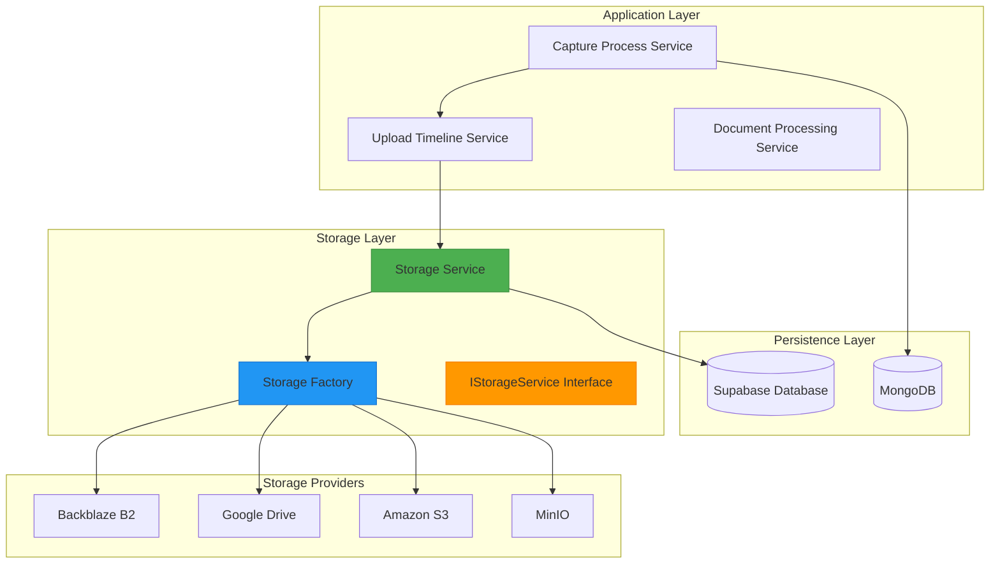
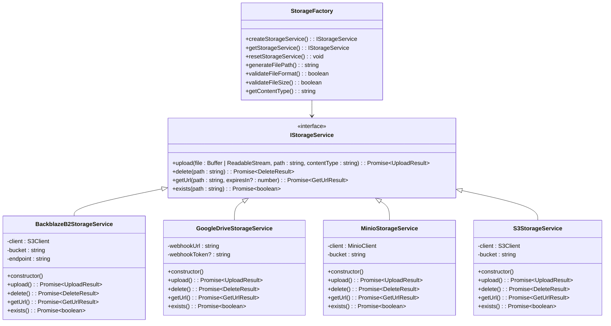
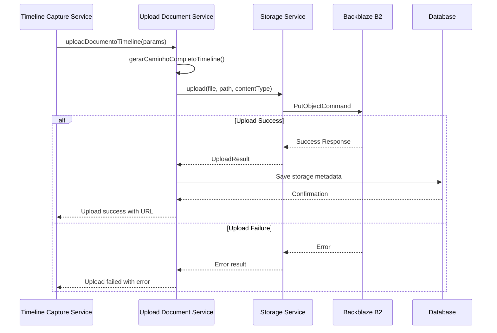
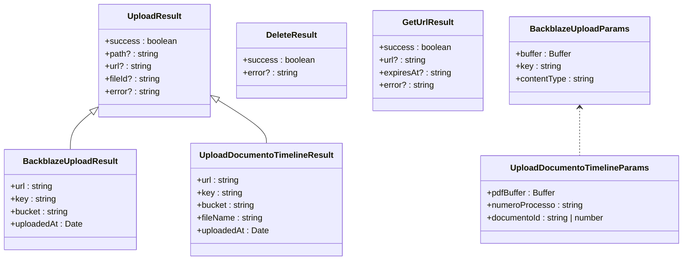
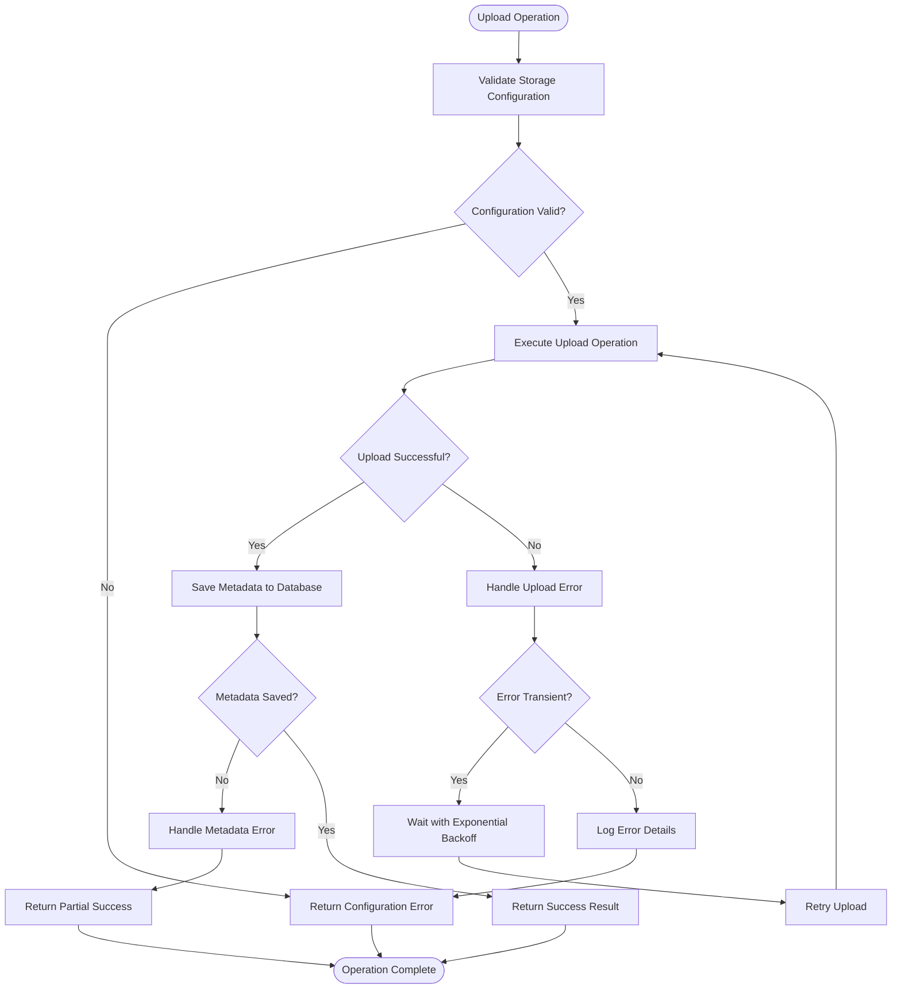
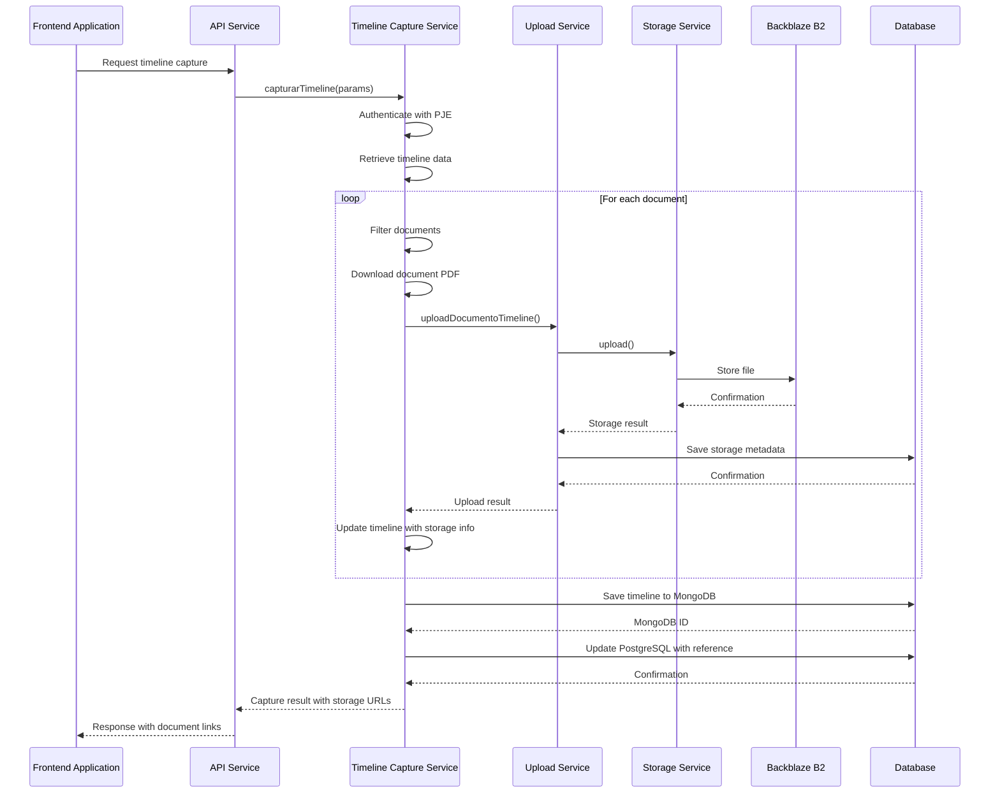

# Storage Integration

<cite>
**Referenced Files in This Document**   
- [backblaze-b2.service.ts](file://backend/storage/backblaze-b2.service.ts)
- [file-naming.utils.ts](file://backend/storage/file-naming.utils.ts)
- [MIGRACAO_BACKBLAZE_B2.md](file://backend/storage/MIGRACAO_BACKBLAZE_B2.md)
- [backblaze-b2-storage.service.ts](file://backend/acordos-condenacoes/services/storage/backblaze-b2-storage.service.ts)
- [storage.interface.ts](file://backend/acordos-condenacoes/services/storage/storage.interface.ts)
- [storage-factory.ts](file://backend/acordos-condenacoes/services/storage/storage-factory.ts)
- [upload-documento-timeline.service.ts](file://backend/captura/services/backblaze/upload-documento-timeline.service.ts)
- [timeline-capture.service.ts](file://backend/captura/services/timeline/timeline-capture.service.ts)
- [timeline.ts](file://backend/types/pje-trt/timeline.ts)
- [types.ts](file://backend/types/documentos/types.ts)
- [uploads-persistence.service.ts](file://backend/documentos/services/persistence/uploads-persistence.service.ts)
- [index.ts](file://backend/utils/retry/index.ts)
</cite>

## Table of Contents
1. [Introduction](#introduction)
2. [Storage Architecture](#storage-architecture)
3. [Core Components](#core-components)
4. [Implementation Details](#implementation-details)
5. [Domain Model](#domain-model)
6. [Configuration and Credentials](#configuration-and-credentials)
7. [Error Handling and Resilience](#error-handling-and-resilience)
8. [Integration with Document Extraction](#integration-with-document-extraction)
9. [Best Practices](#best-practices)
10. [Troubleshooting](#troubleshooting)

## Introduction

The Sinesys document extraction system implements a robust storage integration layer for managing extracted documents in cloud storage services. This documentation provides comprehensive details about the storage architecture, focusing primarily on Backblaze B2 as the primary storage provider, with legacy support for Google Drive. The system enables secure, scalable storage of legal documents extracted from judicial systems, with proper organization, metadata attachment, and access management.

The storage integration component handles the complete lifecycle of document storage, from upload and organization to retrieval and deletion. It supports multiple cloud storage providers through a unified interface, allowing for flexibility and future expansion. The implementation emphasizes reliability, performance, and security, ensuring that sensitive legal documents are stored and accessed appropriately.

This documentation covers the technical implementation details, domain models, configuration requirements, and operational patterns for the storage system. It is designed to be accessible to developers of all experience levels while providing sufficient depth for advanced users to understand and extend the system.

## Storage Architecture

The storage architecture in Sinesys follows a modular, provider-agnostic design pattern that enables seamless integration with multiple cloud storage services. The architecture is built around a service-oriented approach with clear separation of concerns between storage operations, file organization, and persistence layers.

**Diagram sources**
- [storage-factory.ts](file://backend/acordos-condenacoes/services/storage/storage-factory.ts)
- [storage.interface.ts](file://backend/acordos-condenacoes/services/storage/storage.interface.ts)
- [backblaze-b2-storage.service.ts](file://backend/acordos-condenacoes/services/storage/backblaze-b2-storage.service.ts)

**Section sources**
- [storage-factory.ts](file://backend/acordos-condenacoes/services/storage/storage-factory.ts)
- [storage.interface.ts](file://backend/acordos-condenacoes/services/storage/storage.interface.ts)

## Core Components

The storage integration system comprises several core components that work together to provide a comprehensive document storage solution. These components include the storage interface, provider implementations, file naming utilities, and specialized upload services.

The foundation of the storage system is the `IStorageService` interface, which defines a contract for all storage operations regardless of the underlying provider. This interface ensures consistency across different storage backends and enables easy switching between providers. The interface includes methods for uploading, deleting, retrieving URLs, and checking file existence.

Provider-specific implementations such as `BackblazeB2StorageService` and `GoogleDriveStorageService` implement this interface, adapting to the specific requirements and APIs of each storage provider. The Backblaze B2 implementation uses AWS SDK v3 for S3-compatible API access, while the Google Drive implementation routes through an n8n webhook intermediary.

The storage factory pattern is used to instantiate the appropriate storage service based on configuration, with a singleton pattern ensuring efficient resource usage. This factory determines which provider to use based on environment variables and returns a configured instance of the corresponding storage service.

**Diagram sources**
- [storage.interface.ts](file://backend/acordos-condenacoes/services/storage/storage.interface.ts)
- [backblaze-b2-storage.service.ts](file://backend/acordos-condenacoes/services/storage/backblaze-b2-storage.service.ts)
- [google-drive-storage.service.ts](file://backend/acordos-condenacoes/services/storage/google-drive-storage.service.ts)
- [minio-storage.service.ts](file://backend/acordos-condenacoes/services/storage/minio-storage.service.ts)
- [s3-storage.service.ts](file://backend/acordos-condenacoes/services/storage/s3-storage.service.ts)
- [storage-factory.ts](file://backend/acordos-condenacoes/services/storage/storage-factory.ts)

**Section sources**
- [storage.interface.ts](file://backend/acordos-condenacoes/services/storage/storage.interface.ts)
- [backblaze-b2-storage.service.ts](file://backend/acordos-condenacoes/services/storage/backblaze-b2-storage.service.ts)
- [storage-factory.ts](file://backend/acordos-condenacoes/services/storage/storage-factory.ts)

## Implementation Details

### File Upload Process

The document upload process in Sinesys follows a structured workflow that ensures proper organization, metadata attachment, and error handling. When a document is extracted from a judicial system, it is processed through a series of steps before being stored in the cloud storage service.

The upload process begins with the generation of a standardized file path using the file naming utilities. These utilities create a hierarchical structure based on the document type and process number, ensuring consistent organization across all stored documents. For example, timeline documents are stored in paths following the pattern `processos/{numeroProcesso}/timeline/doc_{id}_{YYYYMMDD}.pdf`.

The actual upload is performed by the storage service implementation, which handles the communication with the cloud storage provider. For Backblaze B2, this involves using the AWS SDK v3 to make S3-compatible API calls. The upload process includes proper error handling, logging, and metadata attachment, with the resulting storage information returned to the calling service.

**Diagram sources**
- [upload-documento-timeline.service.ts](file://backend/captura/services/backblaze/upload-documento-timeline.service.ts)
- [backblaze-b2.service.ts](file://backend/storage/backblaze-b2.service.ts)
- [timeline-capture.service.ts](file://backend/captura/services/timeline/timeline-capture.service.ts)

### Metadata Attachment

Metadata is attached to stored documents through a combination of file naming conventions and database persistence. The system stores essential metadata both in the file path structure and in the Supabase database, providing multiple access points for document retrieval and management.

The file naming utilities generate descriptive file names that include document identifiers and timestamps, making it easy to identify documents from their names alone. Additionally, the system stores comprehensive metadata in the database, including the storage provider, bucket name, file key, public URL, and upload timestamp.

For timeline documents, the system enriches the timeline data with Backblaze B2 information, adding a `backblaze` property to each document item that contains the storage details. This allows the frontend to display direct links to the stored documents without requiring additional database queries.

### Storage Configuration

Storage configuration is managed through environment variables, allowing for flexible deployment across different environments. The system supports multiple storage providers, with the active provider determined by the `STORAGE_PROVIDER` environment variable.

For Backblaze B2, the following environment variables are required:
- `B2_ENDPOINT`: The Backblaze B2 API endpoint
- `B2_REGION`: The region where the bucket is located
- `B2_BUCKET`: The name of the bucket for storing documents
- `B2_KEY_ID`: The account key ID for authentication
- `B2_APPLICATION_KEY`: The application key for authentication

The storage factory reads these environment variables and configures the appropriate storage service instance. If required configuration is missing, the system throws descriptive errors to help with troubleshooting.

## Domain Model

The domain model for storage integration includes several key interfaces and types that define the structure of storage operations and metadata. These types provide type safety and clear documentation of the data structures used throughout the system.

The `IStorageService` interface defines the contract for all storage operations, with methods for upload, deletion, URL retrieval, and existence checking. Each method returns a result object that includes success status and relevant data or error information.

**Diagram sources**
- [storage.interface.ts](file://backend/acordos-condenacoes/services/storage/storage.interface.ts)
- [backblaze-b2.service.ts](file://backend/storage/backblaze-b2.service.ts)
- [upload-documento-timeline.service.ts](file://backend/captura/services/backblaze/upload-documento-timeline.service.ts)

The `BackblazeB2Info` interface defines the structure of storage metadata attached to documents, including the public URL, file key, bucket name, file name, and upload timestamp. This interface is used to enrich timeline items with storage information, enabling direct access to stored documents.

The system also defines utility functions for file naming and path generation, which are critical for maintaining a consistent and organized storage structure. These functions generate standardized paths based on document type, process number, and document identifier, ensuring that files are stored in a logical hierarchy.

**Section sources**
- [timeline.ts](file://backend/types/pje-trt/timeline.ts)
- [types.ts](file://backend/types/documentos/types.ts)
- [file-naming.utils.ts](file://backend/storage/file-naming.utils.ts)

## Configuration and Credentials

Storage configuration and credentials are managed through environment variables, following security best practices for sensitive information. The system uses a provider-based configuration model that allows for easy switching between different storage backends without code changes.

The primary configuration variable is `STORAGE_PROVIDER`, which determines which storage provider to use. Supported values include 'backblaze', 'google-drive', 's3', 'aws', 'minio', and 'local'. The default provider is 'minio' if no provider is specified.

For Backblaze B2, the following environment variables must be configured:

| Variable | Description | Required |
|---------|-------------|---------|
| `B2_ENDPOINT` | Backblaze B2 API endpoint URL | Yes |
| `B2_REGION` | Region where the bucket is located | Yes |
| `B2_BUCKET` | Name of the bucket for storing documents | Yes |
| `B2_KEY_ID` | Account key ID for authentication | Yes |
| `B2_APPLICATION_KEY` | Application key for authentication | Yes |

The system validates these environment variables at service initialization and throws descriptive errors if any required configuration is missing. This early validation helps prevent runtime errors and makes troubleshooting easier.

Credential management follows the principle of least privilege, with dedicated application keys that have only the necessary permissions for the required operations. For Backblaze B2, the application key should have read and write permissions to the designated bucket, but not administrative privileges to the entire account.

The storage factory implementation includes fallback mechanisms for unknown or misconfigured providers, defaulting to MinIO storage to ensure system availability even when configuration is incomplete. This graceful degradation helps maintain system functionality during deployment or configuration changes.

**Section sources**
- [storage-factory.ts](file://backend/acordos-condenacoes/services/storage/storage-factory.ts)
- [backblaze-b2-storage.service.ts](file://backend/acordos-condenacoes/services/storage/backblaze-b2-storage.service.ts)
- [MIGRACAO_BACKBLAZE_B2.md](file://backend/storage/MIGRACAO_BACKBLAZE_B2.md)

## Error Handling and Resilience

The storage integration system implements comprehensive error handling and resilience patterns to ensure reliable operation even in the face of network issues, provider outages, or other failures. The system follows a defensive programming approach, with extensive logging, error recovery mechanisms, and user-friendly error messages.

Each storage operation includes try-catch blocks that capture and handle errors appropriately. Errors are logged with contextual information, including the operation type, file path, and any relevant metadata. This detailed logging facilitates troubleshooting and monitoring of storage operations.

For transient errors such as network timeouts or temporary provider outages, the system could benefit from implementing retry mechanisms with exponential backoff. While not explicitly shown in the current code, the presence of a retry utility in the codebase suggests that this pattern could be applied to storage operations to improve resilience.

**Diagram sources**
- [backblaze-b2.service.ts](file://backend/storage/backblaze-b2.service.ts)
- [backblaze-b2-storage.service.ts](file://backend/acordos-condenacoes/services/storage/backblaze-b2-storage.service.ts)
- [index.ts](file://backend/utils/retry/index.ts)

The system distinguishes between different types of errors, providing appropriate responses for each. Configuration errors result in descriptive messages that help administrators correct the issue. Provider authentication errors indicate problems with credentials or permissions. Network errors suggest connectivity issues that may resolve themselves over time.

Error messages are designed to be informative without exposing sensitive information. For example, authentication errors do not reveal whether the issue is with the key ID or application key, preventing potential security information disclosure.

The system also includes fallback mechanisms, such as the default to MinIO storage when an unknown provider is specified. This graceful degradation ensures that the system remains functional even when configuration is incomplete or incorrect.

**Section sources**
- [backblaze-b2.service.ts](file://backend/storage/backblaze-b2.service.ts)
- [backblaze-b2-storage.service.ts](file://backend/acordos-condenacoes/services/storage/backblaze-b2-storage.service.ts)

## Integration with Document Extraction

The storage integration component is tightly coupled with the document extraction system, particularly the timeline capture service. When documents are extracted from judicial systems, they are immediately processed and stored in the configured cloud storage service.

The integration follows a pipeline pattern, where extracted documents flow from the capture service through the upload service to the storage provider. The timeline capture service orchestrates this process, handling authentication, document retrieval, and storage operations in a coordinated workflow.

**Diagram sources**
- [timeline-capture.service.ts](file://backend/captura/services/timeline/timeline-capture.service.ts)
- [upload-documento-timeline.service.ts](file://backend/captura/services/backblaze/upload-documento-timeline.service.ts)
- [backblaze-b2.service.ts](file://backend/storage/backblaze-b2.service.ts)

The integration includes several key features:
- Automatic organization of documents based on process number and document type
- Enrichment of timeline data with storage metadata for direct access
- Transactional consistency between document storage and database persistence
- Error handling that allows partial success (some documents stored successfully)
- Performance optimizations like throttling between document downloads

The system also integrates with the persistence layer, storing references to stored documents in both PostgreSQL and MongoDB. This dual persistence ensures data availability and supports different access patterns for various application features.

**Section sources**
- [timeline-capture.service.ts](file://backend/captura/services/timeline/timeline-capture.service.ts)
- [uploads-persistence.service.ts](file://backend/documentos/services/persistence/uploads-persistence.service.ts)

## Best Practices

When working with the storage integration component, several best practices should be followed to ensure optimal performance, security, and maintainability.

### Security Practices
- Never hardcode storage credentials in source code
- Use environment variables for all sensitive configuration
- Implement least privilege access for storage accounts
- Regularly rotate storage credentials
- Monitor storage access logs for suspicious activity
- Use signed URLs for temporary access to private documents

### Performance Optimization
- Implement client-side caching of frequently accessed documents
- Use appropriate file compression to reduce storage costs
- Batch operations when possible to reduce API calls
- Implement proper error handling to avoid repeated failed operations
- Monitor storage usage and set appropriate quotas

### Reliability and Resilience
- Implement retry mechanisms with exponential backoff for transient errors
- Use health checks to monitor storage provider connectivity
- Implement fallback mechanisms for critical operations
- Regularly test backup and recovery procedures
- Monitor storage provider status and plan for outages

### Maintenance and Monitoring
- Implement comprehensive logging for all storage operations
- Set up alerts for storage quota limits and unusual activity
- Regularly review and clean up unused documents
- Document storage architecture and configuration
- Keep storage SDKs and dependencies up to date

These best practices help ensure that the storage integration remains robust, secure, and maintainable as the system evolves and scales.

## Troubleshooting

This section addresses common issues that may occur with the storage integration component and provides solutions for resolving them.

### Configuration Issues
**Problem**: "Configuração do Backblaze B2 incompleta" error
**Solution**: Verify that all required environment variables are set:
- `B2_ENDPOINT`
- `B2_REGION` 
- `B2_BUCKET`
- `B2_KEY_ID`
- `B2_APPLICATION_KEY`

Ensure there are no extra spaces in the values and that the variables are properly loaded in the environment.

### Authentication Errors
**Problem**: "Access Denied" when uploading files
**Solution**: Verify that the application key has write permissions to the bucket. Check the Backblaze B2 console to confirm the key's permissions and ensure the bucket exists and is accessible.

### Connectivity Issues
**Problem**: Network timeout errors
**Solution**: Check network connectivity between the application server and the storage provider. Verify that any firewalls or security groups allow outbound connections to the storage endpoint.

### Missing Files
**Problem**: Uploaded files not appearing in the storage provider
**Solution**: Check the application logs for upload errors. Verify the file key/path is correctly formatted and that the bucket configuration allows public access if required.

### Performance Issues
**Problem**: Slow upload/download speeds
**Solution**: Check network bandwidth and consider implementing compression for large files. Verify that the storage provider's region is geographically close to the application server.

### Migration Issues
When migrating from Google Drive to Backblaze B2, ensure that:
1. The database migration has been applied
2. The `STORAGE_PROVIDER` environment variable is set to 'backblaze'
3. Frontend components are updated to use the `backblaze` field instead of `googleDrive`
4. Legacy Google Drive services are properly deprecated

The MIGRACAO_BACKBLAZE_B2.md document provides a comprehensive checklist for completing the migration successfully.

**Section sources**
- [MIGRACAO_BACKBLAZE_B2.md](file://backend/storage/MIGRACAO_BACKBLAZE_B2.md)
- [backblaze-b2.service.ts](file://backend/storage/backblaze-b2.service.ts)
- [timeline-capture.service.ts](file://backend/captura/services/timeline/timeline-capture.service.ts)