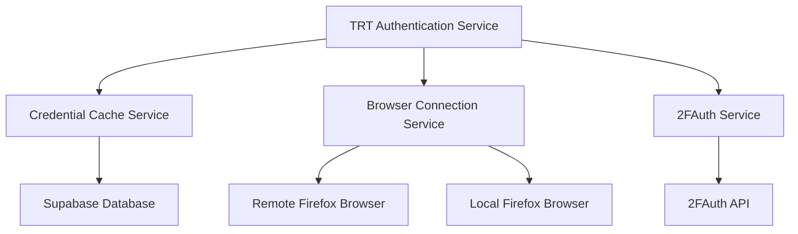
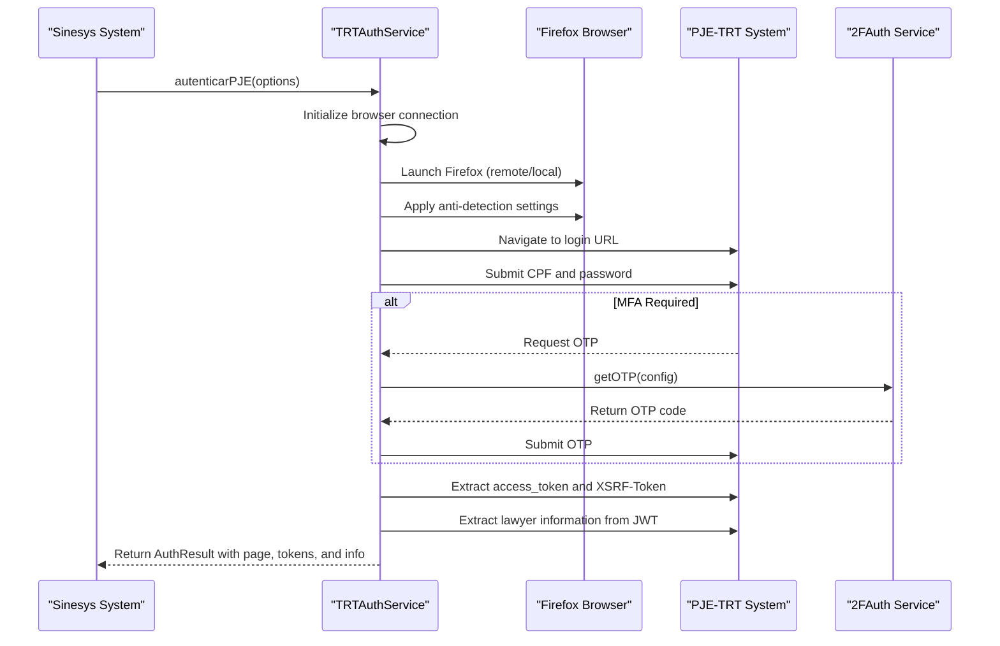
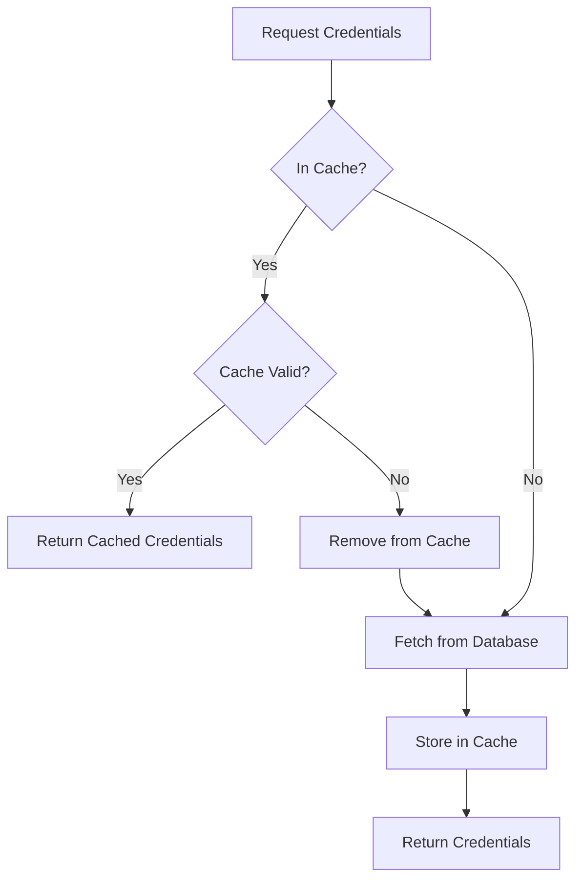
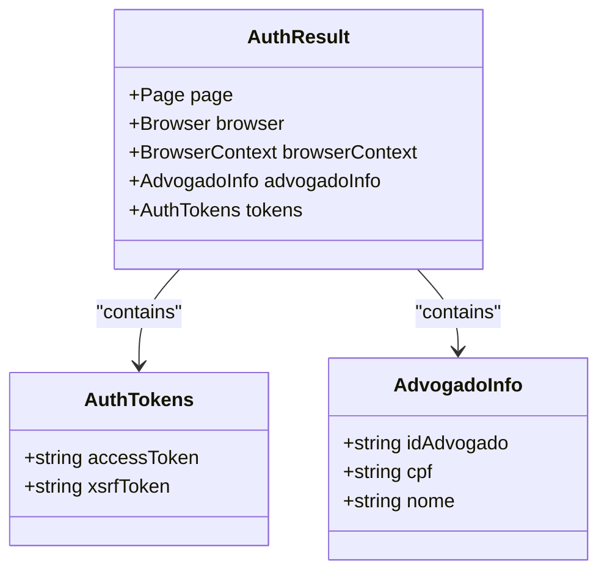
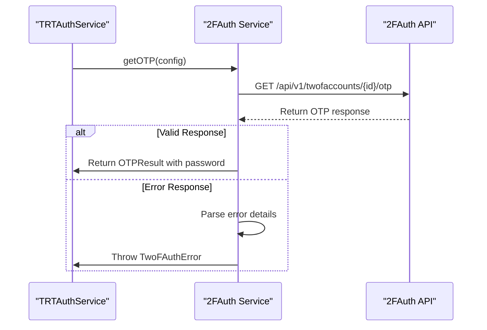
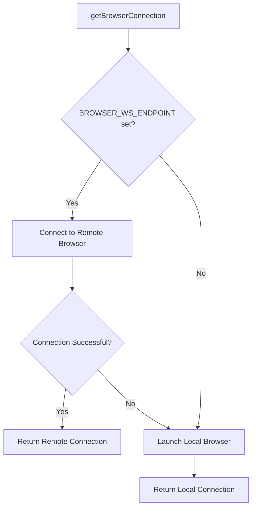
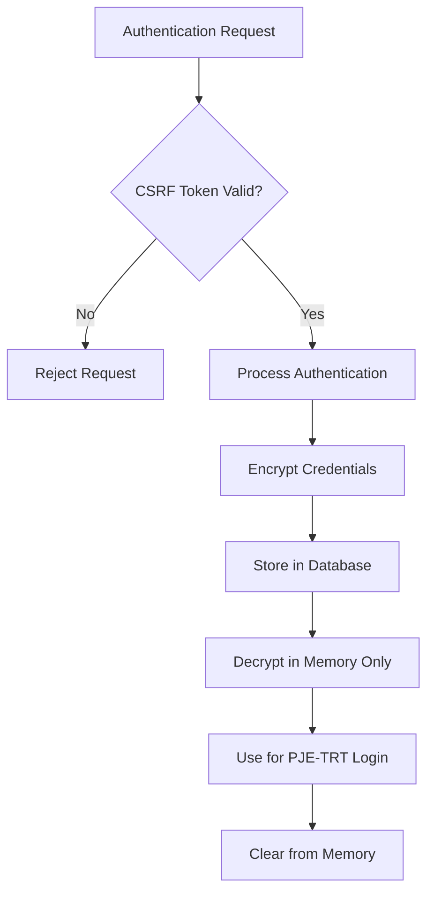
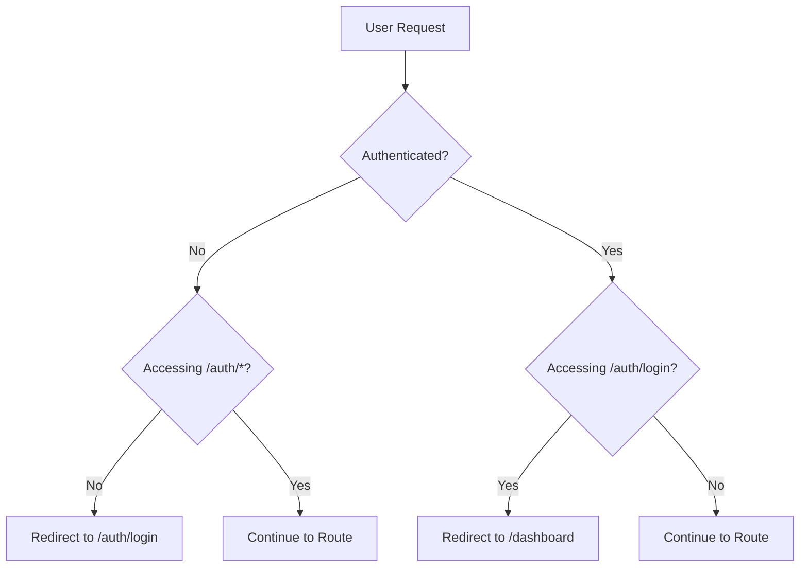

# Authentication Flows

<cite>
**Referenced Files in This Document**   
- [trt-auth.service.ts](file://backend/captura/services/trt/trt-auth.service.ts)
- [credential-cache.service.ts](file://backend/captura/credentials/credential-cache.service.ts)
- [browser-connection.service.ts](file://backend/captura/services/browser/browser-connection.service.ts)
- [twofauth.service.ts](file://backend/api/twofauth.service.ts)
- [login-form.tsx](file://app/auth/components/login-form.tsx)
- [middleware.ts](file://lib/middleware.ts)
- [require-permission.ts](file://backend/auth/require-permission.ts)
- [trt-types.ts](file://backend/types/captura/trt-types.ts)
</cite>

## Table of Contents
1. [Introduction](#introduction)
2. [Core Authentication Components](#core-authentication-components)
3. [PJE-TRT Authentication Flow](#pje-trt-authentication-flow)
4. [Credential Management](#credential-management)
5. [Session Handling and Token Management](#session-handling-and-token-management)
6. [Multi-Factor Authentication Integration](#multi-factor-authentication-integration)
7. [Browser Connection Service](#browser-connection-service)
8. [Error Handling and Common Issues](#error-handling-and-common-issues)
9. [Security Considerations](#security-considerations)
10. [Integration with Navigation Workflows](#integration-with-navigation-workflows)

## Introduction

The Sinesys data capture system implements a comprehensive authentication framework for accessing the PJE-TRT (Processo Judicial Eletrônico - Tribunal Regional do Trabalho) system. This documentation details the implementation of authentication flows, focusing on credential management, session handling, token refresh mechanisms, and integration with external services. The system is designed to securely authenticate legal professionals to access court data while maintaining robust security practices and handling various edge cases such as session expiration and rate limiting.

The authentication architecture combines frontend user authentication with backend browser automation to access the PJE-TRT system on behalf of users. This dual-layer approach ensures that user credentials are protected while enabling automated data capture from the judicial system.

**Section sources**
- [trt-auth.service.ts](file://backend/captura/services/trt/trt-auth.service.ts#L1-L603)
- [middleware.ts](file://lib/middleware.ts#L1-L67)

## Core Authentication Components

The authentication system in Sinesys consists of several key components that work together to provide secure access to the PJE-TRT system. These components include the TRT authentication service, credential cache service, browser connection service, and multi-factor authentication integration.

The TRT authentication service orchestrates the entire authentication process, coordinating between the credential management system, browser automation, and multi-factor authentication services. It handles the complete flow from credential retrieval to successful authentication and token extraction.

**Diagram sources **
- [trt-auth.service.ts](file://backend/captura/services/trt/trt-auth.service.ts#L5-L9)
- [credential-cache.service.ts](file://backend/captura/credentials/credential-cache.service.ts#L20-L22)
- [browser-connection.service.ts](file://backend/captura/services/browser/browser-connection.service.ts#L23-L24)
- [twofauth.service.ts](file://backend/api/twofauth.service.ts#L6-L7)

**Section sources**
- [trt-auth.service.ts](file://backend/captura/services/trt/trt-auth.service.ts#L1-L603)
- [credential-cache.service.ts](file://backend/captura/credentials/credential-cache.service.ts#L1-L447)
- [browser-connection.service.ts](file://backend/captura/services/browser/browser-connection.service.ts#L1-L274)

## PJE-TRT Authentication Flow

The authentication flow for the PJE-TRT system follows a structured sequence of steps to ensure secure and reliable access. The process begins with the initialization of a browser instance and proceeds through several stages of authentication.

The primary function `autenticarPJE` in the TRT authentication service orchestrates the entire flow. It accepts authentication options including credentials, configuration, and optional two-factor authentication settings. The function returns an `AuthResult` object containing the authenticated page, browser instance, and extracted tokens and user information.

**Diagram sources **
- [trt-auth.service.ts](file://backend/captura/services/trt/trt-auth.service.ts#L552-L603)
- [trt-auth.service.ts](file://backend/captura/services/trt/trt-auth.service.ts#L565-L587)

**Section sources**
- [trt-auth.service.ts](file://backend/captura/services/trt/trt-auth.service.ts#L539-L603)
- [trt-types.ts](file://backend/types/captura/trt-types.ts#L78-L81)

## Credential Management

The credential management system in Sinesys implements a sophisticated caching mechanism to optimize performance and reduce database load when accessing multiple TRT systems. The credential cache service stores credentials in memory with a time-to-live (TTL) of 5 minutes, after which they are automatically invalidated.

Credentials are stored using a composite key format `${advogadoId}:${tribunal}:${grau}` that uniquely identifies each combination of lawyer, court, and process level. This allows the system to efficiently retrieve credentials for specific court access scenarios.

The cache service provides several key functions:
- `getFromCache`: Retrieves credentials from the cache if they exist and are still valid
- `setCache`: Stores credentials in the cache with a timestamp
- `getCredentialsBatch`: Fetches multiple credentials in a single database query and populates the cache
- `cleanExpiredCache`: Removes expired credentials from the cache
- `getCacheStats`: Returns statistics about the cache state

**Diagram sources **
- [credential-cache.service.ts](file://backend/captura/credentials/credential-cache.service.ts#L44-L45)
- [credential-cache.service.ts](file://backend/captura/credentials/credential-cache.service.ts#L124-L143)

**Section sources**
- [credential-cache.service.ts](file://backend/captura/credentials/credential-cache.service.ts#L1-L447)
- [trt-types.ts](file://backend/types/captura/trt-types.ts#L78-L81)

## Session Handling and Token Management

The session handling system in Sinesys captures and manages authentication tokens from the PJE-TRT system to maintain authenticated sessions. When a successful login occurs, the system extracts two key tokens from the browser session: the `access_token` and the `XSRF-Token`.

The `access_token` is a JWT (JSON Web Token) stored as an HttpOnly cookie with the domain `.pje.trt3.jus.br`. This token contains the lawyer's identification information and is used to maintain the authenticated session with the PJE-TRT system. The `XSRF-Token` is used for cross-site request forgery protection in subsequent API calls.

The authentication service extracts these tokens after successful login and returns them as part of the `AuthTokens` interface. These tokens can then be used for subsequent API requests to the PJE-TRT system without requiring re-authentication.

**Diagram sources **
- [trt-auth.service.ts](file://backend/captura/services/trt/trt-auth.service.ts#L20-L23)
- [trt-auth.service.ts](file://backend/captura/services/trt/trt-auth.service.ts#L25-L31)
- [trt-auth.service.ts](file://backend/captura/services/trt/trt-auth.service.ts#L14-L18)

**Section sources**
- [trt-auth.service.ts](file://backend/captura/services/trt/trt-auth.service.ts#L20-L31)
- [ajuda/desenvolvimento/integracao-pje/page.tsx](file://app/ajuda/desenvolvimento/integracao-pje/page.tsx#L92-L109)

## Multi-Factor Authentication Integration

The system integrates with the 2FAuth service to handle multi-factor authentication requirements when accessing the PJE-TRT system. The integration is designed to be flexible, allowing configuration through environment variables or explicit parameters.

The `getOTP` function in the 2FAuth service retrieves one-time passwords from the 2FAuth API. It supports both TOTP (Time-based One-Time Password) and HOTP (HMAC-based One-Time Password) algorithms. The function validates the response to ensure the password is present and of the correct length (6-10 characters).

When MFA is required during the authentication flow, the system automatically detects the need for an OTP code and retrieves it from the 2FAuth service. The implementation includes retry logic with a maximum of 3 attempts and handles various error scenarios such as network issues or invalid credentials.

**Diagram sources **
- [twofauth.service.ts](file://backend/api/twofauth.service.ts#L77-L196)
- [trt-auth.service.ts](file://backend/captura/services/trt/trt-auth.service.ts#L6-L7)

**Section sources**
- [twofauth.service.ts](file://backend/api/twofauth.service.ts#L1-L196)
- [ajuda/desenvolvimento/integracao-pje/page.tsx](file://app/ajuda/desenvolvimento/integracao-pje/page.tsx#L114-L119)

## Browser Connection Service

The browser connection service manages the connection to Firefox instances for scraping the PJE-TRT system. It supports two modes of operation: remote connection to a Firefox browser server or local launching of a Firefox instance.

The service prioritizes remote connections when the `BROWSER_WS_ENDPOINT` environment variable is configured. If a remote connection fails, it automatically falls back to launching a local Firefox instance. This dual approach ensures reliability in different deployment environments.

The service applies anti-detection settings to the browser to prevent the PJE-TRT system from identifying automated access. These settings include custom user agents and viewport configurations that mimic typical user behavior.

**Diagram sources **
- [browser-connection.service.ts](file://backend/captura/services/browser/browser-connection.service.ts#L170-L189)
- [browser-connection.service.ts](file://backend/captura/services/browser/browser-connection.service.ts#L75-L114)

**Section sources**
- [browser-connection.service.ts](file://backend/captura/services/browser/browser-connection.service.ts#L1-L274)
- [trt-auth.service.ts](file://backend/captura/services/trt/trt-auth.service.ts#L568-L573)

## Error Handling and Common Issues

The authentication system implements comprehensive error handling to address common issues that may occur during the authentication process. These include credential rejection, session timeouts, and rate limiting by the PJE-TRT system.

For credential rejection, the system provides specific error messages based on the type of failure. Invalid login credentials result in a user-friendly message, while database errors related to authentication are handled with appropriate guidance for users.

Session timeouts are managed through the credential cache TTL mechanism. By default, credentials are cached for 5 minutes before being refreshed from the database. This ensures that updated credentials are used after a reasonable period while maintaining performance.

Rate limiting is addressed through exponential backoff strategies in the retry logic. When authentication attempts fail, the system waits progressively longer before retrying, reducing the load on the PJE-TRT system and improving success rates.

The system also handles OTP retry logic with a maximum of 3 attempts and a 30-second validity period for tokens. It detects error messages related to invalid codes through keyword matching on the page content.

**Section sources**
- [login-form.tsx](file://app/auth/components/login-form.tsx#L59-L80)
- [ajuda/desenvolvimento/integracao-pje/page.tsx](file://app/ajuda/desenvolvimento/integracao-pje/page.tsx#L116-L119)
- [credential-cache.service.ts](file://backend/captura/credentials/credential-cache.service.ts#L54-L55)

## Security Considerations

The authentication system implements several security measures to protect user credentials and maintain the integrity of the authentication process. These include CSRF protection, secure credential storage, and anti-detection measures for browser automation.

The system uses Supabase's built-in CSRF protection for frontend authentication. The middleware validates CSRF tokens on authentication requests to prevent cross-site request forgery attacks.

Credentials are stored in the database with encryption and are only decrypted in memory during the authentication process. They are never logged or exposed in error messages to prevent credential leakage.

The browser automation includes anti-detection settings to prevent the PJE-TRT system from identifying automated access. These settings include realistic user agent strings, viewport sizes, and interaction patterns that mimic human behavior.

**Diagram sources **
- [middleware.ts](file://lib/middleware.ts#L44-L50)
- [openspec/specs/auth/spec.md](file://openspec/specs/auth/spec.md#L243-L246)

**Section sources**
- [middleware.ts](file://lib/middleware.ts#L1-L67)
- [openspec/specs/auth/spec.md](file://openspec/specs/auth/spec.md#L240-L246)

## Integration with Navigation Workflows

The authentication system is integrated with the application's navigation workflows to ensure users are properly authenticated before accessing protected routes. The middleware intercepts requests to protected routes and redirects unauthenticated users to the login page.

When a user attempts to access a protected route without authentication, the system preserves the intended destination URL and redirects to the login page. After successful authentication, the user is redirected back to the original destination.

For authenticated users attempting to access the login page, the system redirects them to the dashboard to prevent unnecessary login attempts.

**Diagram sources **
- [middleware.ts](file://lib/middleware.ts#L41-L50)
- [openspec/specs/auth/spec.md](file://openspec/specs/auth/spec.md#L226-L233)

**Section sources**
- [middleware.ts](file://lib/middleware.ts#L1-L67)
- [protected/page.tsx](file://app/protected/page.tsx#L6-L12)
- [openspec/specs/auth/spec.md](file://openspec/specs/auth/spec.md#L223-L239)