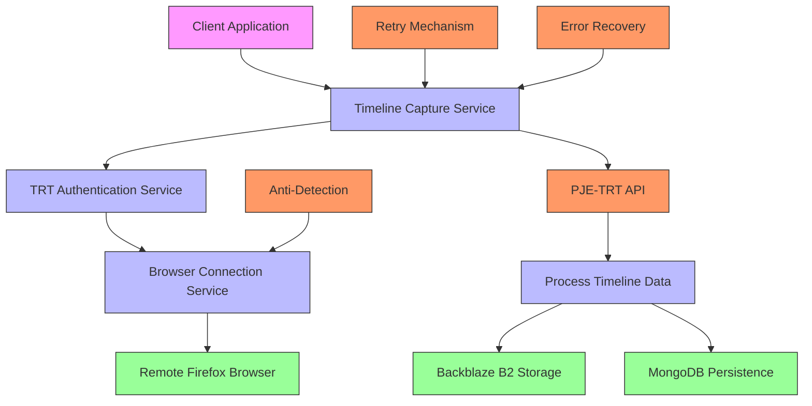
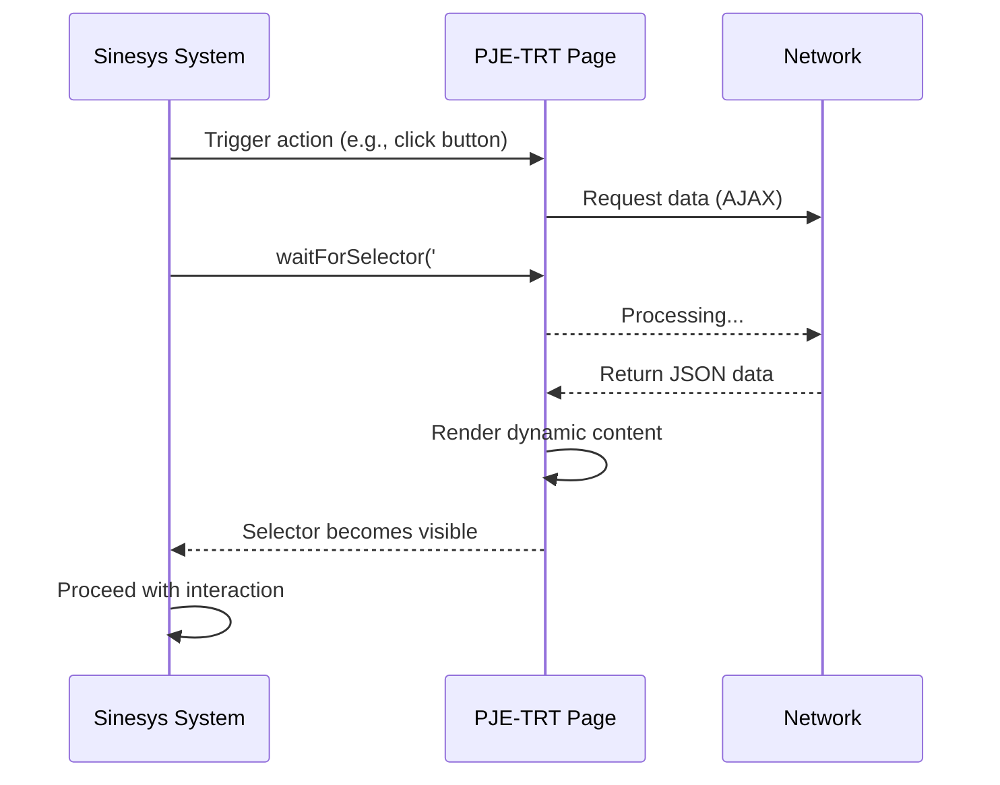
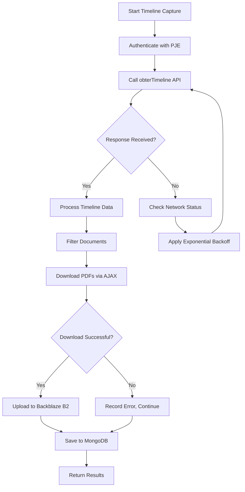
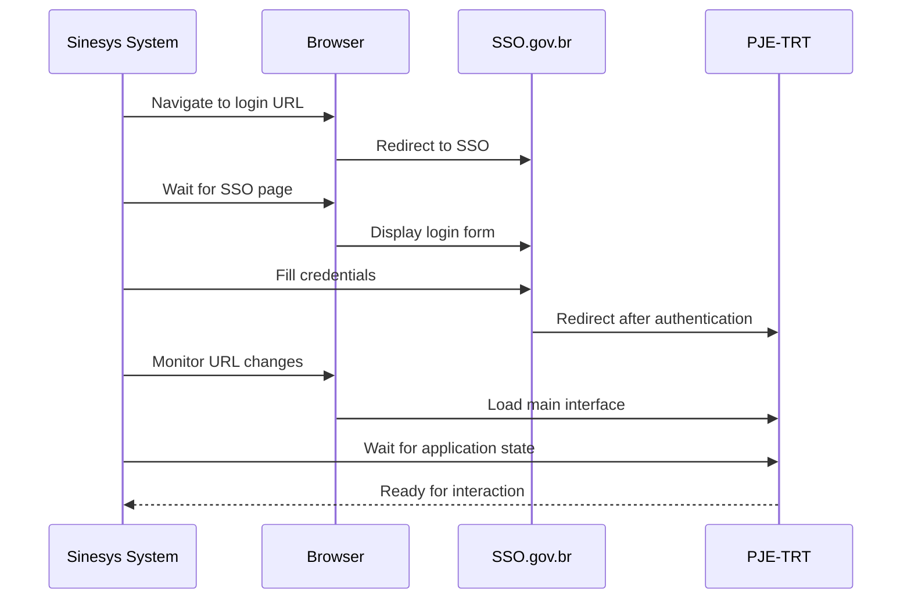
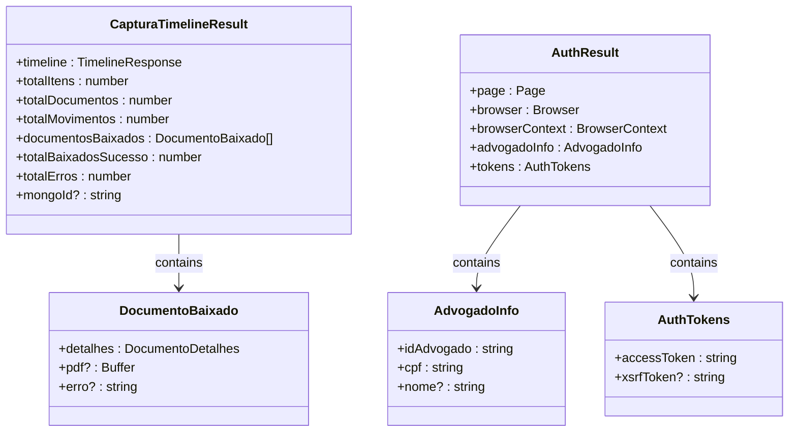
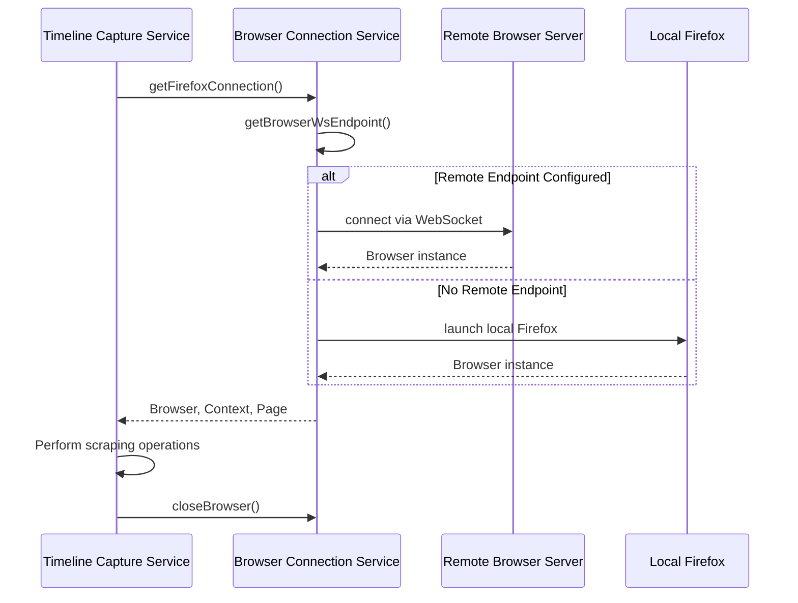
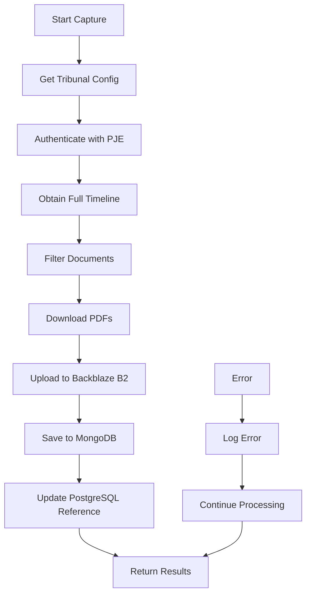

# Dynamic Content Handling

<cite>
**Referenced Files in This Document**   
- [trt-auth.service.ts](file://backend/captura/services/trt/trt-auth.service.ts)
- [browser-connection.service.ts](file://backend/captura/services/browser/browser-connection.service.ts)
- [timeline-capture.service.ts](file://backend/captura/services/timeline/timeline-capture.service.ts)
- [obter-timeline.ts](file://backend/api/pje-trt/timeline/obter-timeline.ts)
- [obter-documento.ts](file://backend/api/pje-trt/timeline/obter-documento.ts)
- [baixar-documento.ts](file://backend/api/pje-trt/timeline/baixar-documento.ts)
- [trt-capture.service.ts](file://backend/captura/services/trt/trt-capture.service.ts)
</cite>

## Table of Contents
1. [Introduction](#introduction)
2. [Architecture Overview](#architecture-overview)
3. [Dynamic Element Detection and Waiting](#dynamic-element-detection-and-waiting)
4. [Handling AJAX-Loaded Content](#handling-ajax-loaded-content)
5. [Single-Page Application Navigation](#single-page-application-navigation)
6. [Domain Model for Dynamic Page States](#domain-model-for-dynamic-page-states)
7. [Modal Dialogs and Infinite Scroll Handling](#modal-dialogs-and-infinite-scroll-handling)
8. [Browser Connection Service Integration](#browser-connection-service-integration)
9. [Timeline Capture Service Integration](#timeline-capture-service-integration)
10. [Error Handling and Recovery Strategies](#error-handling-and-recovery-strategies)
11. [Best Practices and Usage Patterns](#best-practices-and-usage-patterns)

## Introduction

The Sinesys data capture system implements sophisticated mechanisms for interacting with JavaScript-heavy PJE-TRT (Tribunal Regional do Trabalho) interfaces. These government legal portals present significant challenges due to their dynamic nature, including AJAX-loaded content, single-page application navigation patterns, modal dialogs, and infinite scroll interfaces. This document details the implementation strategies used to reliably capture data from these complex interfaces while avoiding detection by anti-automation measures.

The system employs a multi-layered approach combining browser automation with Playwright, anti-detection techniques, explicit waiting strategies, and robust error recovery mechanisms. The architecture is designed to handle the asynchronous nature of modern web applications while maintaining reliability and performance.

**Section sources**
- [trt-auth.service.ts](file://backend/captura/services/trt/trt-auth.service.ts#L1-L603)
- [browser-connection.service.ts](file://backend/captura/services/browser/browser-connection.service.ts#L1-L274)

## Architecture Overview

The dynamic content handling system in Sinesys follows a service-oriented architecture with clear separation of concerns. The core components work together to provide a reliable interface for capturing data from PJE-TRT systems.



**Diagram sources**
- [timeline-capture.service.ts](file://backend/captura/services/timeline/timeline-capture.service.ts#L1-L352)
- [trt-auth.service.ts](file://backend/captura/services/trt/trt-auth.service.ts#L1-L603)
- [browser-connection.service.ts](file://backend/captura/services/browser/browser-connection.service.ts#L1-L274)

## Dynamic Element Detection and Waiting

The system implements comprehensive strategies for detecting and waiting for dynamic elements in PJE-TRT interfaces. Unlike traditional web scraping that relies on static page loads, the Sinesys system must handle elements that appear asynchronously after various events.

The primary mechanism for element detection uses Playwright's built-in waiting capabilities combined with custom polling logic. When navigating to a page or triggering an action that loads dynamic content, the system employs explicit waits rather than fixed timeouts:



**Diagram sources**
- [trt-auth.service.ts](file://backend/captura/services/trt/trt-auth.service.ts#L94-L134)
- [obter-timeline.ts](file://backend/api/pje-trt/timeline/obter-timeline.ts)

The `processOTP` function in the authentication service demonstrates a sophisticated waiting strategy for OTP fields:

```typescript
// Wait for OTP field to appear and become visible
let otpFieldVisible = false;
let retries = 0;
const MAX_OTP_CHECK_RETRIES = 10;

while (!otpFieldVisible && retries < MAX_OTP_CHECK_RETRIES) {
  const otpFieldInfo = await page.evaluate(() => {
    const field = document.querySelector('#otp') || document.querySelector('input[name="otp"]');
    if (!field) return { exists: false, visible: false };

    const rect = field.getBoundingClientRect();
    const isVisible = !!(rect.width && rect.height && (field as HTMLElement).offsetParent !== null);

    return { exists: true, visible: isVisible };
  });

  if (otpFieldInfo.exists && otpFieldInfo.visible) {
    otpFieldVisible = true;
    break;
  }

  retries++;
  if (retries < MAX_OTP_CHECK_RETRIES) {
    await delay(2000);
  }
}
```

This approach combines DOM inspection with visibility checks, ensuring the element is not only present in the DOM but also visible to users.

**Section sources**
- [trt-auth.service.ts](file://backend/captura/services/trt/trt-auth.service.ts#L89-L134)

## Handling AJAX-Loaded Content

AJAX-loaded content presents one of the most significant challenges in capturing data from PJE-TRT interfaces. The system implements multiple strategies to handle asynchronous data loading, including network request interception, response waiting, and content polling.

The timeline capture service demonstrates a comprehensive approach to handling AJAX-loaded content. When capturing a process timeline, the system makes direct API calls to retrieve structured data rather than relying solely on DOM scraping:



**Diagram sources**
- [timeline-capture.service.ts](file://backend/captura/services/timeline/timeline-capture.service.ts#L123-L352)
- [obter-timeline.ts](file://backend/api/pje-trt/timeline/obter-timeline.ts)

The system uses the `obterTimeline` function to fetch timeline data directly from the PJE-TRT API:

```typescript
// 4. Obter timeline completa
console.log('📥 [capturarTimeline] Obtendo timeline...');
const timeline = await obterTimeline(page, processoId, {
  somenteDocumentosAssinados: false,
  buscarMovimentos: true,
  buscarDocumentos: true,
});
```

This approach is more reliable than scraping rendered content, as it bypasses potential rendering issues and directly accesses the structured data.

For cases where API access is not available, the system falls back to DOM-based detection with explicit waits:

```typescript
// Aguardar página estabilizar
await page.waitForLoadState('networkidle', { timeout }).catch(() => {
  // Não bloquear se não conseguir networkidle
});
await delay(2000);
```

**Section sources**
- [timeline-capture.service.ts](file://backend/captura/services/timeline/timeline-capture.service.ts#L180-L186)
- [trt-auth.service.ts](file://backend/captura/services/trt/trt-auth.service.ts#L97-L102)

## Single-Page Application Navigation

PJE-TRT interfaces often implement single-page application (SPA) patterns, where navigation occurs without full page reloads. This presents challenges for traditional web scraping approaches that rely on page load events.

The Sinesys system handles SPA navigation through a combination of URL monitoring, DOM mutation observation, and state tracking. The authentication flow demonstrates this approach when handling redirects through the SSO (Single Sign-On) process:



**Diagram sources**
- [trt-auth.service.ts](file://backend/captura/services/trt/trt-auth.service.ts#L234-L285)
- [trt-auth.service.ts](file://backend/captura/services/trt/trt-auth.service.ts#L362-L367)

The `esperarSaidaSSO` function implements a robust mechanism for detecting when the authentication flow has completed and the user has been redirected to the PJE-TRT domain:

```typescript
async function esperarSaidaSSO(
  page: Page,
  targetHost: string,
  timeout: number = 120000
): Promise<void> {
  const targetHostname = new URL(`https://${targetHost}`).hostname;
  const startTime = Date.now();
  const checkInterval = 2000;

  while (Date.now() - startTime < timeout) {
    try {
      const currentUrl = page.url();
      const currentHostname = new URL(currentUrl).hostname;

      if (currentHostname.includes(targetHostname) && !currentHostname.includes('sso.')) {
        return;
      }

      await delay(checkInterval);
    } catch (error) {
      await delay(checkInterval);
    }
  }
  
  throw new Error(`Timeout ao aguardar saída do SSO. URL atual: ${finalUrl}. Esperado domínio: ${targetHostname}`);
}
```

This function continuously monitors the URL and only proceeds when the hostname indicates successful authentication and redirection to the target PJE-TRT domain.

**Section sources**
- [trt-auth.service.ts](file://backend/captura/services/trt/trt-auth.service.ts#L234-L285)

## Domain Model for Dynamic Page States

The system implements a comprehensive domain model to represent dynamic page states during the capture process. This model enables the system to track progress, handle interruptions, and resume operations when necessary.

The `CapturaTimelineResult` interface defines the structure of the captured data:

```typescript
export interface CapturaTimelineResult {
  timeline: TimelineResponse;
  totalItens: number;
  totalDocumentos: number;
  totalMovimentos: number;
  documentosBaixados: DocumentoBaixado[];
  totalBaixadosSucesso: number;
  totalErros: number;
  mongoId?: string;
}
```

This model captures both the raw data and metadata about the capture process, enabling comprehensive monitoring and error analysis.

The system also maintains state during the authentication process through the `AuthResult` interface:

```typescript
export interface AuthResult {
  page: Page;
  browser: Browser;
  browserContext: BrowserContext;
  advogadoInfo: AdvogadoInfo;
  tokens: AuthTokens;
}
```

This state includes both the browser context and authentication tokens, allowing subsequent operations to reuse the authenticated session.



**Diagram sources**
- [timeline-capture.service.ts](file://backend/captura/services/timeline/timeline-capture.service.ts#L63-L80)
- [trt-auth.service.ts](file://backend/captura/services/trt/trt-auth.service.ts#L25-L31)

**Section sources**
- [timeline-capture.service.ts](file://backend/captura/services/timeline/timeline-capture.service.ts#L63-L80)
- [trt-auth.service.ts](file://backend/captura/services/trt/trt-auth.service.ts#L25-L31)

## Modal Dialogs and Infinite Scroll Handling

The system implements specialized strategies for handling modal dialogs and infinite scroll interfaces commonly found in PJE-TRT applications.

For modal dialogs, the authentication process includes handling OTP (One-Time Password) entry through a modal interface:

```typescript
// Wait for OTP modal to appear
const otpFieldInfo = await page.evaluate(() => {
  const field = document.querySelector('#otp') || document.querySelector('input[name="otp"]');
  // Check visibility through bounding rectangle and offsetParent
  const rect = field.getBoundingClientRect();
  const isVisible = !!(rect.width && rect.height && (field as HTMLElement).offsetParent !== null);
  return { exists: !!field, visible: isVisible };
});
```

The system also handles infinite scroll patterns when capturing large datasets. The timeline capture service processes documents sequentially with delays to prevent overwhelming the target system:

```typescript
for (let i = 0; i < documentosFiltrados.length; i++) {
  // Process each document
  await new Promise((resolve) => setTimeout(resolve, 500));
}
```

This approach simulates human-like interaction patterns, reducing the risk of detection and rate limiting.

## Browser Connection Service Integration

The browser connection service provides a critical abstraction layer between the application logic and the underlying browser automation infrastructure. It supports both remote and local browser connections, enabling flexible deployment options.



**Diagram sources**
- [browser-connection.service.ts](file://backend/captura/services/browser/browser-connection.service.ts#L149-L189)
- [timeline-capture.service.ts](file://backend/captura/services/timeline/timeline-capture.service.ts#L145-L177)

The service implements a fallback mechanism that automatically switches to a local browser if the remote connection fails:

```typescript
if (wsEndpoint) {
  try {
    return await connectToRemoteBrowser(wsEndpoint, options);
  } catch (error) {
    console.error('❌ [Browser] Falha ao conectar ao browser remoto:', error);
    console.warn('⚠️ [Browser] Tentando fallback para browser local...');
    return await launchLocalBrowser(options);
  }
}
```

This ensures reliability even when the preferred remote browser service is unavailable.

**Section sources**
- [browser-connection.service.ts](file://backend/captura/services/browser/browser-connection.service.ts#L170-L189)

## Timeline Capture Service Integration

The timeline capture service orchestrates the entire process of capturing data from PJE-TRT interfaces, integrating multiple components to provide a reliable data capture solution.

The service follows a structured workflow:



**Diagram sources**
- [timeline-capture.service.ts](file://backend/captura/services/timeline/timeline-capture.service.ts#L123-L352)

The service handles the complete lifecycle of a capture operation, from authentication to persistence:

```typescript
export async function capturarTimeline(
  params: CapturaTimelineParams
): Promise<CapturaTimelineResult> {
  // 1. Obter configuração do tribunal
  // 2. Autenticar no PJE
  // 3. Obter timeline completa
  // 4. Filtrar documentos
  // 5. Baixar documentos
  // 6. Upload para Backblaze B2
  // 7. Salvar timeline no MongoDB
  // 8. Atualizar referência no PostgreSQL
  // 9. Retornar resultado
}
```

The service also implements comprehensive error handling, ensuring that partial failures do not abort the entire capture process:

```typescript
try {
  // ... capture logic
} catch (error) {
  console.error('❌ [capturarTimeline] Erro durante captura:', error);
  throw error;
} finally {
  // Limpar recursos
  if (authResult?.browser) {
    await authResult.browser.close();
  }
}
```

**Section sources**
- [timeline-capture.service.ts](file://backend/captura/services/timeline/timeline-capture.service.ts#L123-L352)

## Error Handling and Recovery Strategies

The system implements robust error handling and recovery strategies to address common issues in dynamic content capture, including race conditions, element visibility problems, and timing-related failures.

### Retry Mechanisms

The system uses exponential backoff with jitter for retrying failed operations:

```typescript
export interface RetryOptions {
  maxAttempts: number;
  baseDelay: number;
  maxDelay: number;
  isRetryable?: (error: unknown) => boolean;
  onRetry?: (attempt: number, error: unknown) => void;
}
```

### Race Condition Prevention

To prevent race conditions during authentication, the system uses sequential processing with explicit waits:

```typescript
// Wait for network idle before proceeding
await page.waitForLoadState('networkidle', { timeout: 60000 }).catch(() => {
  // Continue even if network idle not reached
});

// Add additional delay for page stabilization
await delay(3000);
```

### Element Visibility Solutions

The system implements comprehensive checks for element visibility, going beyond simple presence in the DOM:

```typescript
const rect = field.getBoundingClientRect();
const isVisible = !!(rect.width && rect.height && (field as HTMLElement).offsetParent !== null);
```

This approach checks both geometric visibility (non-zero dimensions) and DOM visibility (presence in the rendered tree).

### Error Recovery

The system implements graceful degradation when errors occur:

```typescript
// Continue processing even if MongoDB save fails
try {
  const persistenceResult = await salvarTimelineNoMongoDB({ /* ... */ });
  mongoId = persistenceResult.mongoId;
} catch (error) {
  console.error('❌ [capturarTimeline] Erro ao salvar no MongoDB:', error);
  // Continue with capture process
}
```

This ensures that partial data capture is preserved even when some components fail.

**Section sources**
- [timeline-capture.service.ts](file://backend/captura/services/timeline/timeline-capture.service.ts#L321-L324)
- [trt-auth.service.ts](file://backend/captura/services/trt/trt-auth.service.ts#L31-L54)

## Best Practices and Usage Patterns

The following best practices and usage patterns are recommended when working with the dynamic content handling system:

### Use Direct API Calls When Available

Whenever possible, use direct API calls rather than DOM scraping:

```typescript
// Preferred: Direct API call
const timeline = await obterTimeline(page, processoId, options);

// Fallback: DOM scraping
const timeline = await page.locator('.timeline-item').all();
```

### Implement Explicit Waits

Always use explicit waits rather than fixed timeouts:

```typescript
// Good: Wait for specific condition
await page.waitForSelector('#dynamic-content', { state: 'visible' });

// Avoid: Fixed timeouts
await delay(5000);
```

### Handle Authentication State Properly

Preserve authentication state to avoid repeated logins:

```typescript
// Reuse authenticated session
const { page, browser } = authResult;
// Perform operations
await browser.close();
```

### Respect Rate Limiting

Implement delays between operations to simulate human behavior:

```typescript
// Add delay between document downloads
await new Promise((resolve) => setTimeout(resolve, 500));
```

### Clean Up Resources

Always clean up browser resources to prevent memory leaks:

```typescript
finally {
  if (authResult?.browser) {
    await authResult.browser.close();
  }
}
```

These patterns ensure reliable and sustainable interaction with PJE-TRT interfaces while minimizing the risk of detection and service disruption.

**Section sources**
- [timeline-capture.service.ts](file://backend/captura/services/timeline/timeline-capture.service.ts)
- [trt-auth.service.ts](file://backend/captura/services/trt/trt-auth.service.ts)
- [browser-connection.service.ts](file://backend/captura/services/browser/browser-connection.service.ts)