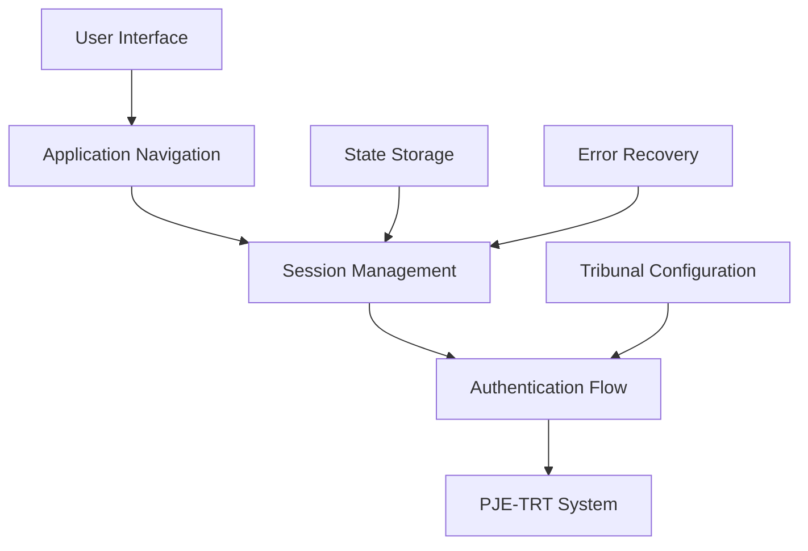
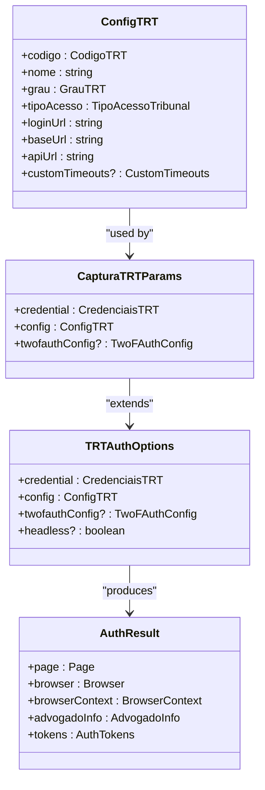
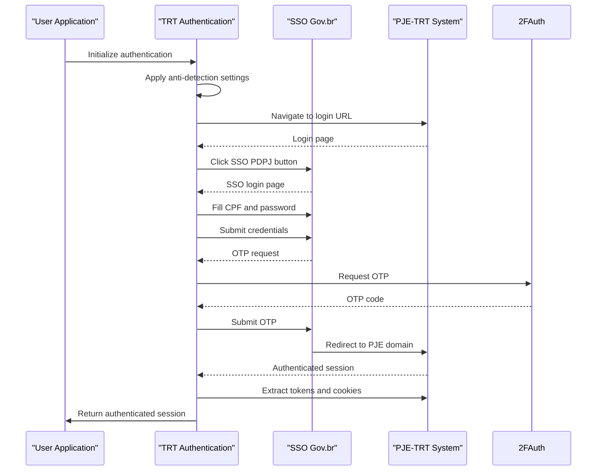
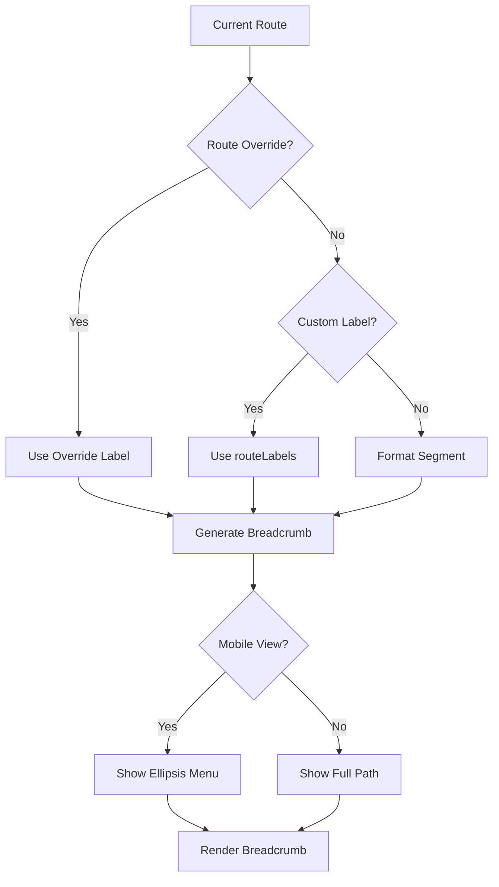

# Navigation State Management

<cite>
**Referenced Files in This Document**   
- [trt-auth.service.ts](file://backend/captura/services/trt/trt-auth.service.ts)
- [trt-types.ts](file://backend/types/captura/trt-types.ts)
- [pje-expediente-documento.service.ts](file://backend/captura/services/pje/pje-expediente-documento.service.ts)
- [breadcrumb-context.tsx](file://components/layout/breadcrumb-context.tsx)
- [app-breadcrumb.tsx](file://components/layout/app-breadcrumb.tsx)
- [middleware.ts](file://app/_lib/middleware.ts)
</cite>

## Table of Contents
1. [Introduction](#introduction)
2. [Navigation State Architecture](#navigation-state-architecture)
3. [Core Components](#core-components)
4. [State Management Implementation](#state-management-implementation)
5. [PJE-TRT Session Navigation](#pje-trt-session-navigation)
6. [Breadcrumb Navigation System](#breadcrumb-navigation-system)
7. [Error Handling and Recovery](#error-handling-and-recovery)
8. [Integration with Tribunal Configuration](#integration-with-tribunal-configuration)
9. [Best Practices](#best-practices)
10. [Conclusion](#conclusion)

## Introduction

The Sinesys data capture system implements a comprehensive navigation state management solution for handling complex navigation across PJE-TRT (Processo Judicial Eletrônico - Tribunal Regional do Trabalho) sessions. This documentation details the architecture, implementation, and usage patterns for maintaining navigation state throughout the data capture process, ensuring reliable session management, error recovery, and seamless user experience.

The system handles navigation state for various TRT services including acervo geral, pendentes de manifestação, arquivados, and audiências. It manages authentication flows, maintains context across page transitions, and provides mechanisms for resuming interrupted sessions. The navigation state management is critical for the system's ability to reliably capture data from the PJE-TRT platform while handling the complexities of government authentication systems and session timeouts.

**Section sources**
- [trt-auth.service.ts](file://backend/captura/services/trt/trt-auth.service.ts#L1-L603)
- [trt-types.ts](file://backend/types/captura/trt-types.ts#L1-L126)

## Navigation State Architecture

The navigation state management system in Sinesys follows a layered architecture that separates concerns between authentication, session management, and user interface navigation. The system is designed to handle the complex authentication flows required by PJE-TRT while maintaining state across potentially long-running data capture operations.

The architecture consists of three main layers:
1. **Authentication Layer**: Handles the complete PJE-TRT authentication flow including SSO, OTP verification, and JWT token management
2. **Session Management Layer**: Maintains browser context and page state throughout the navigation session
3. **Application Navigation Layer**: Manages UI-level navigation and breadcrumb trails for user context

The system uses Playwright for browser automation, which provides the necessary tools to maintain navigation state across page transitions and authentication steps. The navigation state is tightly coupled with authentication state, as successful navigation through PJE-TRT requires maintaining valid authentication tokens and cookies.

**Diagram sources**
- [trt-auth.service.ts](file://backend/captura/services/trt/trt-auth.service.ts#L1-L603)
- [trt-types.ts](file://backend/types/captura/trt-types.ts#L1-L126)

**Section sources**
- [trt-auth.service.ts](file://backend/captura/services/trt/trt-auth.service.ts#L1-L603)
- [trt-types.ts](file://backend/types/captura/trt-types.ts#L1-L126)

## Core Components

The navigation state management system comprises several core components that work together to maintain state throughout PJE-TRT sessions. These components handle authentication, state persistence, and navigation flow control.

The primary components include:
- **TRTAuthOptions**: Configuration interface for authentication parameters including credentials, TRT configuration, and 2FA settings
- **AuthResult**: Return type containing the authenticated page, browser context, and user information
- **ConfigTRT**: Tribunal configuration object that defines URLs, timeouts, and access types
- **CapturaTRTParams**: Base parameters for all TRT capture operations

These components work together to establish and maintain navigation state. The system uses a combination of browser context persistence, cookie management, and token extraction to ensure that navigation state is preserved across page transitions and authentication steps.

**Section sources**
- [trt-auth.service.ts](file://backend/captura/services/trt/trt-auth.service.ts#L1-L603)
- [trt-types.ts](file://backend/types/captura/trt-types.ts#L1-L126)

## State Management Implementation

The state management implementation in Sinesys uses a combination of browser automation context and application-level state tracking to maintain navigation state. The system leverages Playwright's browser context to preserve cookies, local storage, and session data throughout the navigation session.

Key aspects of the state management implementation include:

1. **Browser Context Persistence**: The system maintains a persistent browser context that survives page navigations and redirects. This ensures that authentication cookies and session data are preserved.

2. **Token Management**: JWT tokens (access_token and XSRF-Token) are extracted from cookies and stored in memory for use in subsequent API calls.

3. **Anti-Detection Measures**: The system applies stealth configurations to remove automation flags from the browser, preventing detection by PJE-TRT's security systems.

4. **OTP Handling**: The system integrates with a 2FAuth service to automatically retrieve and submit OTP codes during the authentication process.

5. **Error Recovery**: Comprehensive error handling and retry mechanisms are implemented to recover from network issues and authentication failures.

The state management is designed to handle the complex authentication flow of PJE-TRT, which includes multiple redirects, SSO integration, and two-factor authentication.

**Diagram sources**
- [trt-auth.service.ts](file://backend/captura/services/trt/trt-auth.service.ts#L1-L603)
- [trt-types.ts](file://backend/types/captura/trt-types.ts#L1-L126)

**Section sources**
- [trt-auth.service.ts](file://backend/captura/services/trt/trt-auth.service.ts#L1-L603)
- [trt-types.ts](file://backend/types/captura/trt-types.ts#L1-L126)

## PJE-TRT Session Navigation

The PJE-TRT session navigation implementation handles the complete workflow from initial authentication to data capture. The system manages navigation through multiple stages including SSO login, OTP verification, and access to specific TRT services.

The navigation flow follows these steps:
1. Initialize browser with anti-detection configurations
2. Navigate to TRT login URL
3. Click SSO PDPJ button to initiate government authentication
4. Fill CPF and password credentials
5. Submit login form
6. Process OTP verification using 2FAuth service
7. Wait for redirect to PJE domain
8. Extract authentication tokens from cookies
9. Extract advocate information from JWT payload

The system includes robust error handling for common issues such as network errors, authentication failures, and OTP validation problems. It implements retry mechanisms for transient network issues and fallback strategies for OTP failures (using both current and next OTP codes).

The navigation state is maintained through the entire process by preserving the browser context and cookies. This allows the system to continue navigation even after multiple redirects and authentication steps.

**Diagram sources**
- [trt-auth.service.ts](file://backend/captura/services/trt/trt-auth.service.ts#L1-L603)
- [pje-expediente-documento.service.ts](file://backend/captura/services/pje/pje-expediente-documento.service.ts#L1-L299)

**Section sources**
- [trt-auth.service.ts](file://backend/captura/services/trt/trt-auth.service.ts#L1-L603)
- [pje-expediente-documento.service.ts](file://backend/captura/services/pje/pje-expediente-documento.service.ts#L1-L299)

## Breadcrumb Navigation System

The breadcrumb navigation system in Sinesys provides user interface-level navigation state management, complementing the backend session management. This system helps users maintain context as they navigate through the application's various sections and features.

The breadcrumb system consists of two main components:
1. **BreadcrumbContext**: A React context that manages breadcrumb overrides and state
2. **AppBreadcrumb**: A component that renders the breadcrumb trail based on the current route

The system allows for dynamic breadcrumb labels through the use of overrides, enabling custom labels for specific routes. It also implements responsive design, showing different breadcrumb patterns on mobile versus desktop devices.

On mobile devices, the system uses an ellipsis dropdown menu to conserve space while still providing access to the full navigation path. On larger screens, it displays the complete breadcrumb trail with the home link always visible.

The breadcrumb system integrates with Next.js routing to automatically generate navigation paths based on the URL structure, while allowing for custom labels through the routeLabels mapping.

**Diagram sources**
- [breadcrumb-context.tsx](file://components/layout/breadcrumb-context.tsx#L1-L58)
- [app-breadcrumb.tsx](file://components/layout/app-breadcrumb.tsx#L1-L229)

**Section sources**
- [breadcrumb-context.tsx](file://components/layout/breadcrumb-context.tsx#L1-L58)
- [app-breadcrumb.tsx](file://components/layout/app-breadcrumb.tsx#L1-L229)

## Error Handling and Recovery

The navigation state management system implements comprehensive error handling and recovery mechanisms to ensure reliability in the face of various failure modes. These mechanisms are critical for maintaining navigation state during the complex PJE-TRT authentication process.

Key error handling features include:

1. **Network Error Recovery**: The system implements retry mechanisms for network-related errors, particularly during the SSO login process where network instability is common.

2. **OTP Failure Handling**: When an OTP code is rejected, the system automatically attempts with the next OTP code if available, providing a seamless recovery experience.

3. **Timeout Management**: Customizable timeouts are implemented for different stages of the authentication process, preventing indefinite waits while allowing sufficient time for slow responses.

4. **Cookie Monitoring**: The system actively monitors for the presence of authentication cookies, with retry logic if cookies are not immediately available after authentication.

5. **Redirect Tracking**: The system tracks redirects during the authentication flow, ensuring it correctly identifies when the user has been successfully redirected to the PJE domain.

The recovery system is designed to handle the most common failure points in PJE-TRT navigation, including temporary network outages, OTP timing issues, and session timeouts. By implementing these recovery mechanisms, the system can automatically resume navigation from common failure points without requiring user intervention.

**Section sources**
- [trt-auth.service.ts](file://backend/captura/services/trt/trt-auth.service.ts#L1-L603)

## Integration with Tribunal Configuration

The navigation state management system integrates closely with the tribunal configuration service to adapt navigation behavior based on specific tribunal requirements. The ConfigTRT interface defines tribunal-specific parameters that influence navigation behavior.

Key integration points include:
- **URL Configuration**: The system uses tribunal-specific URLs for login, base, and API endpoints
- **Access Type Handling**: Different authentication flows are used based on the tribunal's access type (primeiro_grau, segundo_grau, unificado, or unico)
- **Custom Timeouts**: Tribunal-specific timeouts can be configured to accommodate performance characteristics of different TRT systems
- **Grau Mapping**: The system maps tribunal access types to process degrees, ensuring correct navigation paths

This integration allows the system to support multiple TRT jurisdictions with varying authentication requirements and navigation patterns. The configuration-driven approach enables easy addition of support for new tribunals without code changes.

**Section sources**
- [trt-types.ts](file://backend/types/captura/trt-types.ts#L1-L126)
- [trt-auth.service.ts](file://backend/captura/services/trt/trt-auth.service.ts#L1-L603)

## Best Practices

When working with the navigation state management system in Sinesys, several best practices should be followed to ensure reliability and maintainability:

1. **Always Use ConfigTRT**: Configure tribunal-specific parameters through the ConfigTRT interface rather than hardcoding URLs or timeouts.

2. **Implement Proper Error Handling**: Wrap navigation operations in try-catch blocks and implement appropriate recovery strategies for common failure modes.

3. **Manage Browser Resources**: Ensure proper cleanup of browser contexts and pages to prevent resource leaks, especially in long-running applications.

4. **Respect Rate Limits**: Implement appropriate delays between navigation steps to avoid triggering anti-automation measures.

5. **Use Environment Variables**: Store sensitive configuration like 2FAuth credentials in environment variables rather than hardcoding them.

6. **Monitor Authentication State**: Regularly verify authentication state before initiating sensitive operations to prevent unauthorized access.

7. **Implement Logging**: Use the system's logging capabilities to track navigation progress and diagnose issues.

8. **Test Thoroughly**: Test navigation flows under various network conditions to ensure robustness.

Following these best practices will help ensure reliable navigation state management and minimize issues in production environments.

**Section sources**
- [trt-auth.service.ts](file://backend/captura/services/trt/trt-auth.service.ts#L1-L603)
- [trt-types.ts](file://backend/types/captura/trt-types.ts#L1-L126)

## Conclusion

The navigation state management system in Sinesys provides a robust solution for handling complex navigation across PJE-TRT sessions. By combining browser automation, authentication management, and application-level navigation, the system ensures reliable data capture while maintaining user context.

The architecture effectively separates concerns between authentication, session management, and UI navigation, allowing each component to focus on its specific responsibilities. The implementation demonstrates best practices in error handling, recovery, and configuration management.

Key strengths of the system include its ability to handle the complex PJE-TRT authentication flow, maintain state across redirects, and provide mechanisms for resuming interrupted sessions. The integration with tribunal configuration allows for flexible support of multiple jurisdictions.

For future improvements, consider implementing more sophisticated state persistence mechanisms, enhanced error recovery strategies, and improved monitoring of navigation performance. These enhancements would further increase the reliability and usability of the navigation state management system.