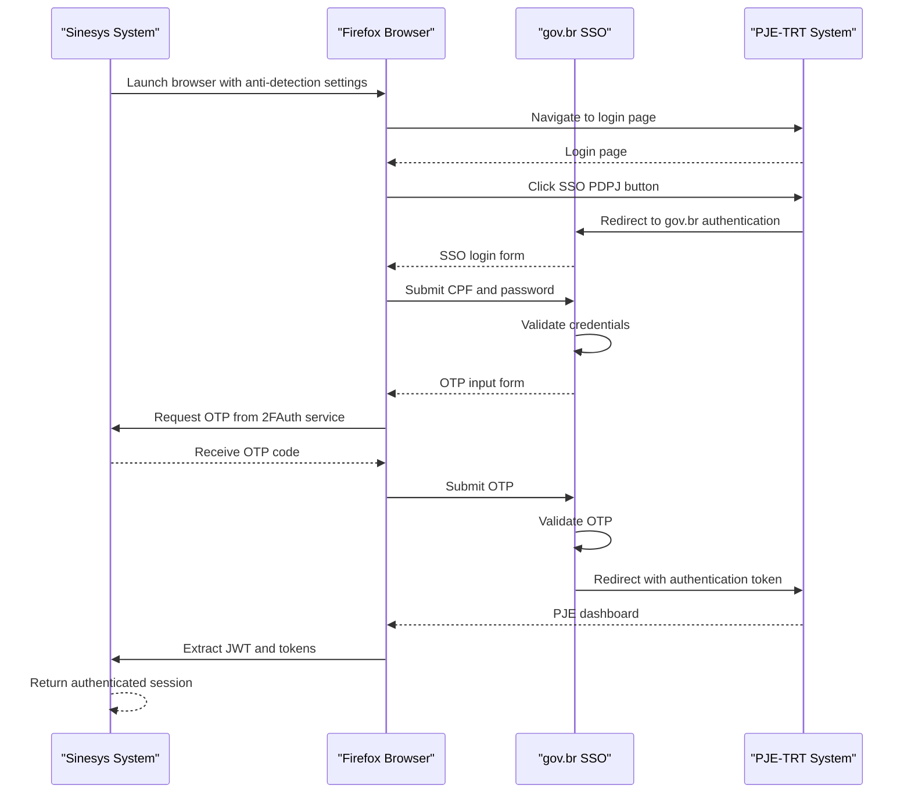
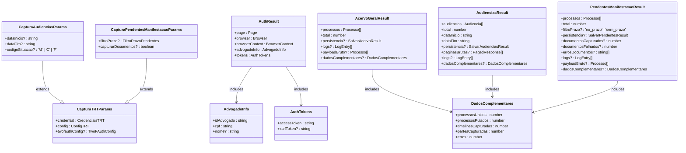
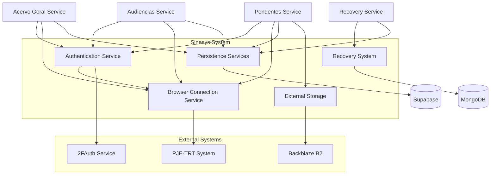
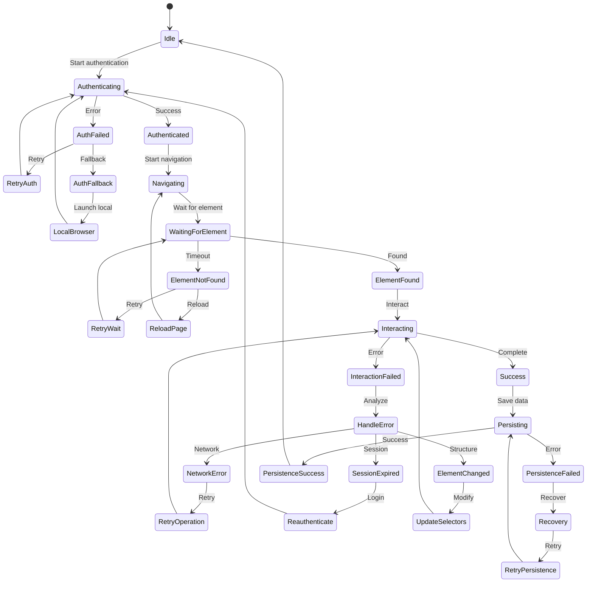

# Page Navigation Automation

<cite>
**Referenced Files in This Document**   
- [trt-auth.service.ts](file://backend/captura/services/trt/trt-auth.service.ts)
- [trt-capture.service.ts](file://backend/captura/services/trt/trt-capture.service.ts)
- [browser-connection.service.ts](file://backend/captura/services/browser/browser-connection.service.ts)
- [acervo-geral.service.ts](file://backend/captura/services/trt/acervo-geral.service.ts)
- [audiencias.service.ts](file://backend/captura/services/trt/audiencias.service.ts)
- [pendentes-manifestacao.service.ts](file://backend/captura/services/trt/pendentes-manifestacao.service.ts)
- [pje-expediente-documento.service.ts](file://backend/captura/services/pje/pje-expediente-documento.service.ts)
- [captura-recovery.service.ts](file://backend/captura/services/recovery/captura-recovery.service.ts)
- [obter-processos.ts](file://backend/api/pje-trt/acervo-geral/obter-processos.ts)
- [obter-pauta.ts](file://backend/api/pje-trt/audiencias/obter-pauta.ts)
- [obter-documento.ts](file://backend/api/pje-trt/timeline/obter-documento.ts)
- [baixar-documento.ts](file://backend/api/pje-trt/timeline/baixar-documento.ts)
- [fetch.ts](file://backend/api/pje-trt/shared/fetch.ts)
</cite>

## Table of Contents
1. [Introduction](#introduction)
2. [Authentication Flow](#authentication-flow)
3. [Navigation State Model](#navigation-state-model)
4. [Page Element Interaction](#page-element-interaction)
5. [Service Integration](#service-integration)
6. [Error Handling and Recovery](#error-handling-and-recovery)
7. [Usage Examples](#usage-examples)
8. [Best Practices](#best-practices)

## Introduction

The Sinesys data capture system implements automated navigation of the PJE-TRT (Processo Judicial Eletrônico - Tribunal Regional do Trabalho) interface through a sophisticated browser automation framework. This system enables programmatic access to case details, hearing schedules, and document repositories by simulating human interaction with the web interface. The navigation automation component is built on Playwright, providing robust capabilities for handling dynamic content, JavaScript-heavy interfaces, and complex authentication flows.

The system follows a modular architecture with distinct components for authentication, navigation, data extraction, and error recovery. It supports multiple TRT jurisdictions and handles both first and second instance cases. The automation is designed to be resilient against common issues such as element not found errors, navigation race conditions, and session expiration through comprehensive retry mechanisms and explicit waits.

This documentation provides a comprehensive overview of the page navigation automation implementation, detailing the interfaces for locating and interacting with page elements, the domain model for representing navigation states, and usage patterns for handling dynamic content. It also covers relationships with other components such as the authentication service and recovery system, along with solutions for common issues encountered during automated navigation.

**Section sources**
- [trt-auth.service.ts](file://backend/captura/services/trt/trt-auth.service.ts#L1-L603)
- [trt-capture.service.ts](file://backend/captura/services/trt/trt-capture.service.ts#L1-L36)

## Authentication Flow

The authentication flow for accessing the PJE-TRT interface follows a multi-step process that begins with SSO (Single Sign-On) authentication through gov.br, followed by two-factor authentication (2FA) using OTP (One-Time Password). The `autenticarPJE` function in the `trt-auth.service.ts` file orchestrates this entire process, returning an authenticated browser session with all necessary tokens and cookies.

The authentication process starts with launching a Firefox browser instance, either locally or connecting to a remote browser server via WebSocket. The system applies anti-detection configurations to the browser to prevent the PJE system from identifying the automation. This includes modifying navigator properties such as webdriver flag, plugins array, and languages to mimic a real user environment.

After browser initialization, the system navigates to the PJE login page and clicks the SSO PDPJ button to initiate the gov.br authentication flow. It then fills in the CPF and password credentials before submitting the form. The system handles potential network errors during this submission by implementing retry logic with exponential backoff.

The most critical phase is the OTP processing, which occurs after successful username/password authentication. The system waits for the OTP field to become visible, retrieves the current OTP code from the 2FAuth service, and fills it into the appropriate field. It includes logic to handle cases where the OTP is rejected by attempting with the next OTP in sequence if available. The system also implements a robust mechanism to detect when the authentication process has successfully redirected to the PJE domain, using both URL monitoring and network idle detection.

Upon successful authentication, the system extracts the JWT (JSON Web Token) from the access_token cookie, parsing it to obtain the advocate's ID, CPF, and name. This information is crucial for subsequent API calls and data association. The authentication result includes the authenticated page object, browser instance, browser context, advocate information, and authentication tokens, providing a complete session state for further navigation.

**Diagram sources **
- [trt-auth.service.ts](file://backend/captura/services/trt/trt-auth.service.ts#L552-L601)
- [browser-connection.service.ts](file://backend/captura/services/browser/browser-connection.service.ts#L170-L204)

**Section sources**
- [trt-auth.service.ts](file://backend/captura/services/trt/trt-auth.service.ts#L552-L601)
- [browser-connection.service.ts](file://backend/captura/services/browser/browser-connection.service.ts#L170-L204)

## Navigation State Model

The navigation state model in the Sinesys system is represented through a combination of service parameters and result interfaces that capture the complete state of a navigation session. The core navigation state is defined in the `CapturaTRTParams` interface, which includes credentials, configuration, and optional 2FAuth configuration. This base interface is extended by specific capture services to include additional parameters relevant to their domain.

For acervo geral (general inventory) capture, the system uses the `CapturaTRTParams` interface without additional parameters, as it captures all active cases for an advocate. For audiencias (hearings) capture, the `CapturaAudienciasParams` interface extends the base parameters with date range filters, hearing status codes, and sorting options. Similarly, for pendentes de manifestação (pending for manifestation) capture, the `CapturaPendentesManifestacaoParams` interface includes filters for deadline status and an option to capture associated documents.

The authentication result is modeled through the `AuthResult` interface, which contains the authenticated page, browser, browser context, advocate information, and authentication tokens. This comprehensive state object allows subsequent operations to continue from the authenticated session without re-authenticating. The advocate information includes the advocate ID, CPF, and optional name, extracted from the JWT token.

Each capture service returns a result interface that models the complete outcome of the navigation and data capture process. For example, the `AcervoGeralResult` interface includes the captured processes, total count, persistence results, logs, and data about complementary information captured. These result interfaces provide a complete picture of the navigation session, including success metrics, error counts, and performance indicators.

The system also implements a recovery model through the `captura-recovery.service.ts` file, which provides functions to list, search, and consult capture logs stored in MongoDB. This allows for recovery and re-persistence of captured data, ensuring data integrity even if the initial persistence fails. The recovery system includes functions to list logs with filters and pagination, search by MongoDB ID or capture log ID, and extract raw payloads for reprocessing.

**Diagram sources **
- [trt-capture.service.ts](file://backend/captura/services/trt/trt-capture.service.ts#L11-L35)
- [trt-auth.service.ts](file://backend/captura/services/trt/trt-auth.service.ts#L25-L31)
- [acervo-geral.service.ts](file://backend/captura/services/trt/acervo-geral.service.ts#L65-L85)
- [audiencias.service.ts](file://backend/captura/services/trt/audiencias.service.ts#L70-L92)
- [pendentes-manifestacao.service.ts](file://backend/captura/services/trt/pendentes-manifestacao.service.ts#L71-L95)
- [captura-recovery.service.ts](file://backend/captura/services/recovery/captura-recovery.service.ts#L13-L15)

**Section sources**
- [trt-capture.service.ts](file://backend/captura/services/trt/trt-capture.service.ts#L11-L35)
- [trt-auth.service.ts](file://backend/captura/services/trt/trt-auth.service.ts#L25-L31)
- [acervo-geral.service.ts](file://backend/captura/services/trt/acervo-geral.service.ts#L65-L85)
- [audiencias.service.ts](file://backend/captura/services/trt/audiencias.service.ts#L70-L92)
- [pendentes-manifestacao.service.ts](file://backend/captura/services/trt/pendentes-manifestacao.service.ts#L71-L95)

## Page Element Interaction

The Sinesys system interacts with page elements in the PJE-TRT interface through Playwright's powerful locator system, which provides multiple strategies for finding and interacting with elements. The system primarily uses CSS selectors and attribute-based locators to identify elements, with fallback mechanisms for dynamic content.

For authentication-related elements, the system uses specific selectors such as `#otp` for the OTP input field and `#kc-login` for the login button. These selectors are chosen based on their stability and uniqueness in the PJE interface. The system implements explicit waits for elements to become visible before interacting with them, using Playwright's `waitForSelector` method with appropriate timeouts.

When dealing with dynamic content such as search results or paginated data, the system uses a combination of network idle detection and element visibility checks to ensure the page has fully loaded before proceeding. For example, after submitting a search query, the system waits for the network to become idle and then verifies that result elements are visible before extracting data.

The system also implements sophisticated error handling for element interaction, including retry mechanisms for transient failures. If an element interaction fails due to a timeout or other error, the system may attempt to reload the page or navigate back and retry the operation. This is particularly important for handling race conditions that can occur in JavaScript-heavy interfaces.

For form interactions, the system uses Playwright's `fill` method to input text into fields, `click` to submit forms or navigate through menus, and `selectOption` for dropdown selections. It also handles file uploads through the `setInputFiles` method when interacting with document submission forms.

The system includes specialized functions for handling common PJE interface patterns, such as modal dialogs, tabs, and accordions. These functions abstract the underlying element interactions, providing a higher-level API for navigating complex interface components.

```mermaid
flowchart TD
Start([Start Interaction]) --> WaitForElement["Wait for element visibility"]
WaitForElement --> ElementVisible{"Element visible?"}
ElementVisible --> |Yes| Interact["Interact with element"]
ElementVisible --> |No| CheckTimeout{"Timeout reached?"}
CheckTimeout --> |No| WaitMore["Wait and retry"]
CheckTimeout --> |Yes| HandleError["Handle element not found"]
HandleError --> Retry{"Retry possible?"}
Retry --> |Yes| ReloadPage["Reload page"]
Retry --> |No| ReturnError["Return error"]
ReloadPage --> WaitForElement
Interact --> CheckResult{"Interaction successful?"}
CheckResult --> |Yes| End([End Interaction])
CheckResult --> |No| HandleInteractionError["Handle interaction error"]
HandleInteractionError --> Retry
End --> Exit([Exit])
ReturnError --> Exit
```

**Diagram sources **
- [trt-auth.service.ts](file://backend/captura/services/trt/trt-auth.service.ts#L94-L133)
- [trt-auth.service.ts](file://backend/captura/services/trt/trt-auth.service.ts#L149-L151)
- [trt-auth.service.ts](file://backend/captura/services/trt/trt-auth.service.ts#L164-L167)

**Section sources**
- [trt-auth.service.ts](file://backend/captura/services/trt/trt-auth.service.ts#L94-L133)
- [trt-auth.service.ts](file://backend/captura/services/trt/trt-auth.service.ts#L149-L151)
- [trt-auth.service.ts](file://backend/captura/services/trt/trt-auth.service.ts#L164-L167)

## Service Integration

The page navigation automation component integrates with several other services in the Sinesys system to provide a complete data capture solution. The primary integration points include the authentication service, recovery system, data persistence services, and external storage systems.

The authentication service, implemented in `trt-auth.service.ts`, provides the foundation for all navigation operations by establishing and maintaining authenticated sessions with the PJE-TRT system. Other services depend on this authentication to access protected resources. The browser connection service manages the lifecycle of browser instances, either connecting to a remote browser server or launching a local instance, providing a consistent interface for browser automation.

The recovery system, implemented in `captura-recovery.service.ts`, allows for the retrieval and reprocessing of captured data in case of persistence failures. This service stores raw capture logs in MongoDB, enabling recovery and re-persistence of data. It provides functions to list, search, and extract payloads from previous capture sessions, ensuring data integrity and reliability.

Data capture services such as `acervo-geral.service.ts`, `audiencias.service.ts`, and `pendentes-manifestacao.service.ts` integrate with the authentication and browser services to perform specific navigation tasks. These services follow a standardized flow: authenticate, navigate to the target page, extract data, and persist results. They also integrate with data persistence services to store captured information in Supabase and MongoDB.

For document handling, the system integrates with external storage systems such as Backblaze B2. The `pje-expediente-documento.service.ts` file implements functionality to download documents from the PJE system and upload them to cloud storage, generating appropriate filenames and paths based on case information.

The system also integrates with the 2FAuth service for OTP retrieval, using environment variables or provided configuration to authenticate with the OTP service and retrieve current and next OTP codes. This integration is critical for the authentication flow, as the PJE-TRT system requires OTP verification for all logins.

**Diagram sources **
- [trt-auth.service.ts](file://backend/captura/services/trt/trt-auth.service.ts#L552-L601)
- [browser-connection.service.ts](file://backend/captura/services/browser/browser-connection.service.ts#L170-L204)
- [captura-recovery.service.ts](file://backend/captura/services/recovery/captura-recovery.service.ts#L35-L148)
- [acervo-geral.service.ts](file://backend/captura/services/trt/acervo-geral.service.ts#L107-L354)
- [audiencias.service.ts](file://backend/captura/services/trt/audiencias.service.ts#L133-L481)
- [pendentes-manifestacao.service.ts](file://backend/captura/services/trt/pendentes-manifestacao.service.ts#L125-L456)
- [pje-expediente-documento.service.ts](file://backend/captura/services/pje/pje-expediente-documento.service.ts#L1-L100)

**Section sources**
- [trt-auth.service.ts](file://backend/captura/services/trt/trt-auth.service.ts#L552-L601)
- [browser-connection.service.ts](file://backend/captura/services/browser/browser-connection.service.ts#L170-L204)
- [captura-recovery.service.ts](file://backend/captura/services/recovery/captura-recovery.service.ts#L35-L148)
- [acervo-geral.service.ts](file://backend/captura/services/trt/acervo-geral.service.ts#L107-L354)
- [audiencias.service.ts](file://backend/captura/services/trt/audiencias.service.ts#L133-L481)
- [pendentes-manifestacao.service.ts](file://backend/captura/services/trt/pendentes-manifestacao.service.ts#L125-L456)

## Error Handling and Recovery

The Sinesys system implements comprehensive error handling and recovery mechanisms to ensure reliable navigation of the PJE-TRT interface. These mechanisms address common issues such as element not found errors, navigation race conditions, session expiration, and network failures.

For element not found errors, the system implements explicit waits with timeouts, retrying the element lookup at regular intervals until the element becomes available or the timeout is reached. This is particularly important for dynamic content that loads asynchronously. The system also includes fallback strategies, such as reloading the page or navigating back and retrying the operation if an element cannot be found.

Navigation race conditions are handled through a combination of network idle detection and explicit waits. After navigation actions, the system waits for the network to become idle using Playwright's `waitForLoadState('networkidle')` method, ensuring that all resources have finished loading before proceeding. Additional explicit waits are implemented for specific elements that are known to load slowly.

Session expiration is managed through the authentication service, which detects when a session has expired and automatically re-authenticates. The system monitors for signs of session expiration, such as redirects to the login page or authentication errors on API calls, and triggers the re-authentication flow when necessary.

Network failures are handled with retry mechanisms and fallback strategies. For example, when clicking the SSO PDPJ button, the system implements a retry loop with exponential backoff in case of network errors. If the remote browser connection fails, the system falls back to launching a local browser instance.

The recovery system provides additional resilience by storing raw capture logs in MongoDB. If a capture session fails during persistence, the raw data can be recovered and re-persisted later. The system also implements progress tracking and logging, allowing failed sessions to be resumed from the point of failure rather than starting over.

**Diagram sources **
- [trt-auth.service.ts](file://backend/captura/services/trt/trt-auth.service.ts#L313-L341)
- [trt-auth.service.ts](file://backend/captura/services/trt/trt-auth.service.ts#L234-L285)
- [captura-recovery.service.ts](file://backend/captura/services/recovery/captura-recovery.service.ts#L35-L148)

**Section sources**
- [trt-auth.service.ts](file://backend/captura/services/trt/trt-auth.service.ts#L313-L341)
- [trt-auth.service.ts](file://backend/captura/services/trt/trt-auth.service.ts#L234-L285)
- [captura-recovery.service.ts](file://backend/captura/services/recovery/captura-recovery.service.ts#L35-L148)

## Usage Examples

The Sinesys page navigation automation system provides several concrete examples of how navigation is used to access specific types of information in the PJE-TRT interface. These examples demonstrate the practical application of the navigation components for accessing case details, hearing schedules, and document repositories.

For accessing case details in the acervo geral (general inventory), the `acervoGeralCapture` service follows a six-phase flow: authentication, fetching processes, extracting unique process IDs, fetching complementary data (timeline and parties), persisting data, and closing the browser. This service uses the `obterTodosProcessosAcervoGeral` function to retrieve all active cases for an advocate, then enriches this data with timeline and party information for each unique process.

To access hearing schedules, the `audienciasCapture` service implements a similar flow but with parameters for date ranges and hearing status. It uses the `obterTodasAudiencias` function to retrieve hearings within a specified period, filtering by status (scheduled, canceled, or completed). For completed hearings, the service can also retrieve and store the hearing minutes by downloading the associated document and uploading it to cloud storage.

For accessing pending matters (pendentes de manifestação), the `pendentesManifestacaoCapture` service allows filtering by deadline status (with deadline or without deadline). It can optionally capture the associated documents by downloading them from the PJE system and storing them in cloud storage. This service uses the `obterTodosProcessosPendentesManifestacao` function with additional parameters to filter the results.

The system also provides lower-level functions for specific navigation tasks, such as `obterTimeline` to retrieve the timeline of a specific process, `obterDocumento` to get document details, and `baixarDocumento` to download a document as PDF. These functions can be used independently or as part of larger workflows.

```mermaid
flowchart TD
subgraph "Acervo Geral"
A1[Authenticate] --> A2[Fetch all processes]
A2 --> A3[Extract unique process IDs]
A3 --> A4[Fetch timeline and parties]
A4 --> A5[Persist data]
A5 --> A6[Close browser]
end
subgraph "Hearing Schedule"
B1[Authenticate] --> B2[Fetch hearings by date range]
B2 --> B3[Filter by status]
B3 --> B4[Extract process IDs]
B4 --> B5[Fetch timeline and parties]
B5 --> B6[Retrieve minutes for completed hearings]
B6 --> B7[Persist data]
B7 --> B8[Close browser]
end
subgraph "Pending Matters"
C1[Authenticate] --> C2[Fetch pending matters]
C2 --> C3[Filter by deadline status]
C3 --> C4[Extract process IDs]
C4 --> C5[Fetch timeline and parties]
C5 --> C6[Persist pending matters]
C6 --> C7[Download documents if requested]
C7 --> C8[Upload to cloud storage]
C8 --> C9[Close browser]
end
```

**Diagram sources **
- [acervo-geral.service.ts](file://backend/captura/services/trt/acervo-geral.service.ts#L107-L354)
- [audiencias.service.ts](file://backend/captura/services/trt/audiencias.service.ts#L133-L481)
- [pendentes-manifestacao.service.ts](file://backend/captura/services/trt/pendentes-manifestacao.service.ts#L125-L456)

**Section sources**
- [acervo-geral.service.ts](file://backend/captura/services/trt/acervo-geral.service.ts#L107-L354)
- [audiencias.service.ts](file://backend/captura/services/trt/audiencias.service.ts#L133-L481)
- [pendentes-manifestacao.service.ts](file://backend/captura/services/trt/pendentes-manifestacao.service.ts#L125-L456)

## Best Practices

When working with the Sinesys page navigation automation system, several best practices should be followed to ensure reliable and efficient operation. These practices address performance optimization, error prevention, and system integration.

First, always use the provided service interfaces rather than implementing direct browser automation. The service layers provide important error handling, retry mechanisms, and state management that would be difficult to replicate in custom implementations. For example, use the `acervoGeralCapture` service for retrieving case details rather than implementing a custom navigation flow.

Second, handle credentials securely by using environment variables or secure configuration management rather than hardcoding them in the application. The system supports providing credentials through the `CredenciaisTRT` interface, which should be populated from secure sources.

Third, implement proper error handling and logging in applications that use the navigation services. The services return detailed result objects that include success metrics, error counts, and logs, which should be monitored and analyzed to identify and resolve issues.

Fourth, respect rate limits and implement appropriate delays between operations to avoid overwhelming the PJE-TRT system. The system includes built-in delays, but additional delays may be necessary when performing bulk operations.

Fifth, use the recovery system to handle persistence failures. If a capture session fails during data persistence, the raw data can be recovered from MongoDB and re-persisted, ensuring data integrity.

Sixth, monitor browser resource usage and implement proper cleanup. The system automatically closes browser instances after use, but in long-running applications, it's important to ensure that browser instances are properly disposed of to prevent memory leaks.

Finally, keep the system updated with changes to the PJE-TRT interface. The selectors and navigation flows may need to be updated when the PJE interface changes, so regular testing and maintenance are essential.

**Section sources**
- [trt-auth.service.ts](file://backend/captura/services/trt/trt-auth.service.ts#L552-L601)
- [acervo-geral.service.ts](file://backend/captura/services/trt/acervo-geral.service.ts#L107-L354)
- [captura-recovery.service.ts](file://backend/captura/services/recovery/captura-recovery.service.ts#L35-L148)