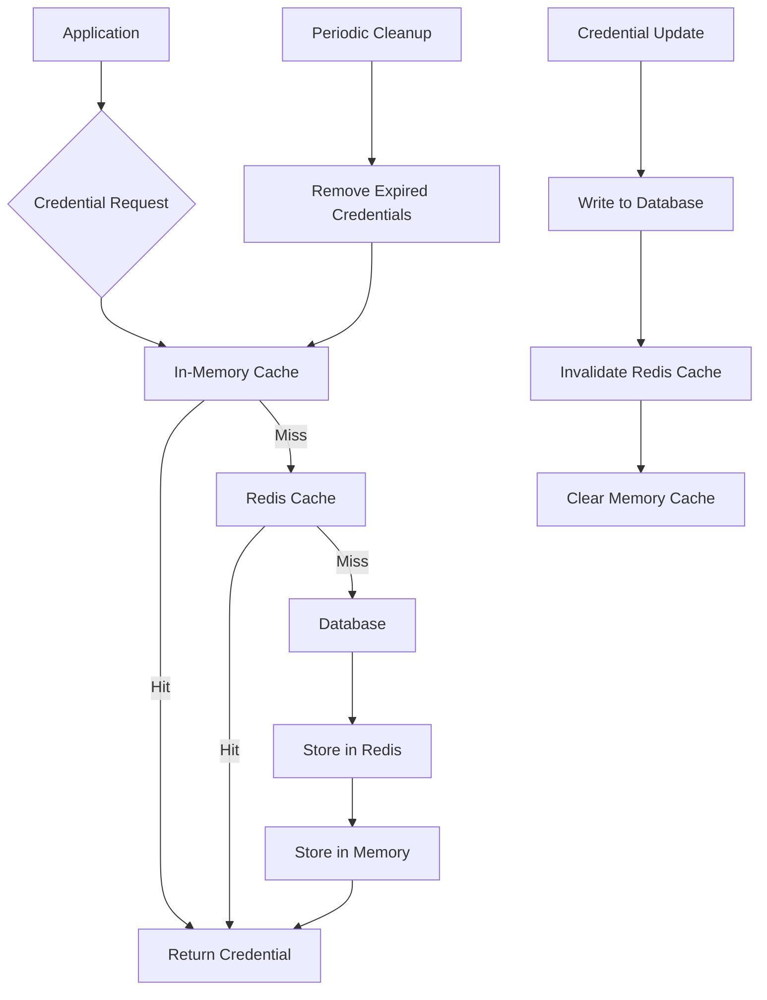
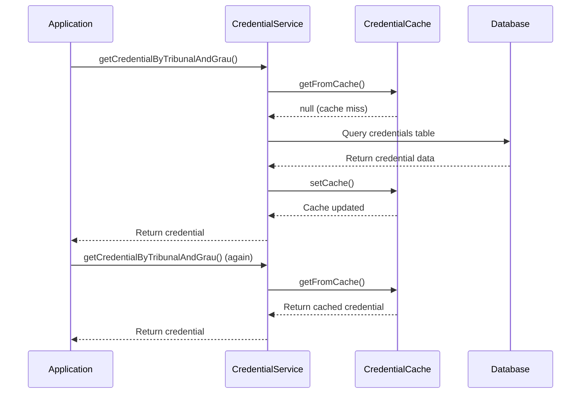
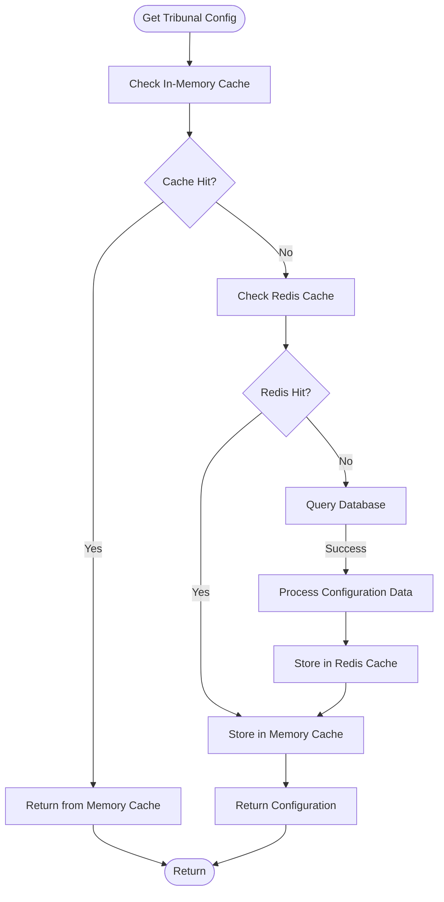
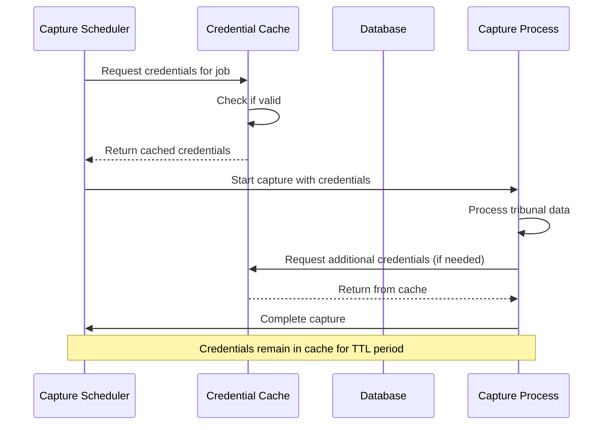

# Credential Caching

<cite>
**Referenced Files in This Document**   
- [credential-cache.service.ts](file://backend/captura/credentials/credential-cache.service.ts)
- [credential.service.ts](file://backend/captura/credentials/credential.service.ts)
- [client.ts](file://backend/utils/redis/client.ts)
- [cache-utils.ts](file://backend/utils/redis/cache-utils.ts)
- [invalidation.ts](file://backend/utils/redis/invalidation.ts)
- [config.ts](file://backend/captura/services/trt/config.ts)
- [executar-agendamento.service.ts](file://backend/captura/services/scheduler/executar-agendamento.service.ts)
</cite>

## Table of Contents
1. [Introduction](#introduction)
2. [Core Components](#core-components)
3. [Architecture Overview](#architecture-overview)
4. [Detailed Component Analysis](#detailed-component-analysis)
5. [Cache Configuration and Management](#cache-configuration-and-management)
6. [Integration with Capture Process](#integration-with-capture-process)
7. [Common Issues and Solutions](#common-issues-and-solutions)
8. [Performance Considerations](#performance-considerations)
9. [Conclusion](#conclusion)

## Introduction
The credential caching system in Sinesys is designed to optimize credential access performance by reducing database queries and improving response times for automated capture sessions. This document provides a comprehensive analysis of the `credential-cache.service` implementation, detailing how frequently used credentials are stored in memory with appropriate TTL (Time To Live) settings. The system integrates with Redis for distributed caching while maintaining an in-memory cache for optimal performance. The credential caching layer works in conjunction with the capture process, providing efficient access to tribunal credentials while ensuring data consistency across distributed instances.

**Section sources**
- [credential-cache.service.ts](file://backend/captura/credentials/credential-cache.service.ts#L1-L445)
- [credential.service.ts](file://backend/captura/credentials/credential.service.ts#L1-L401)

## Core Components
The credential caching system consists of several key components that work together to provide efficient credential access. The core is the `credential-cache.service.ts` which implements an in-memory cache using JavaScript Map objects with TTL-based expiration. This service works in tandem with the `credential.service.ts` which serves as the primary interface for credential retrieval, implementing a cache-aside pattern. The system also integrates with Redis through the `client.ts` and `cache-utils.ts` modules, providing distributed caching capabilities. The `invalidation.ts` module handles cache invalidation across the system, ensuring data consistency. Additionally, the tribunal configuration system in `config.ts` implements its own caching mechanism with similar TTL principles.

**Section sources**
- [credential-cache.service.ts](file://backend/captura/credentials/credential-cache.service.ts#L1-L445)
- [credential.service.ts](file://backend/captura/credentials/credential.service.ts#L1-L401)
- [client.ts](file://backend/utils/redis/client.ts#L1-L68)
- [cache-utils.ts](file://backend/utils/redis/cache-utils.ts#L1-L212)

## Architecture Overview
The credential caching architecture follows a multi-layered approach with both in-memory and distributed caching. The system prioritizes in-memory caching for maximum performance, falling back to Redis when enabled. The architecture implements a cache-aside pattern where applications check the cache before accessing the database, and write through to both cache and database on updates.



**Diagram sources **
- [credential-cache.service.ts](file://backend/captura/credentials/credential-cache.service.ts#L44-L45)
- [client.ts](file://backend/utils/redis/client.ts#L1-L68)
- [cache-utils.ts](file://backend/utils/redis/cache-utils.ts#L63-L89)

## Detailed Component Analysis

### Credential Cache Service Analysis
The credential cache service implements a sophisticated in-memory caching mechanism optimized for credential access patterns. The cache uses a Map data structure with composite keys combining advogadoId, tribunal, and grau to ensure unique identification of credentials. Each cache entry includes a timestamp for TTL-based expiration.

#### For Object-Oriented Components:
```mermaid
classDiagram
class CacheItem {
+credential CredenciaisTRT
+timestamp number
}
class CredentialCacheService {
-credentialCache Map~string, CacheItem~
-CACHE_TTL_MS number
+getFromCache(advogadoId, tribunal, grau) CredenciaisTRT | null
+setCache(advogadoId, tribunal, grau, credential) void
+getCredentialsBatch(advogadoId, combinations) Promise~Map~string, CredenciaisTRT | null~~
+clearCredentialCache() void
+cleanExpiredCache() number
+getCacheStats() {total : number, valid : number, expired : number}
}
class CacheUtils {
+getCached~T~(key) Promise~T | null~
+setCached~T~(key, data, ttl) Promise~void~
+deleteCached(key) Promise~void~
+deletePattern(pattern) Promise~number~
}
CredentialCacheService --> CacheItem : "contains"
CredentialCacheService --> CacheUtils : "uses"
```

**Diagram sources **
- [credential-cache.service.ts](file://backend/captura/credentials/credential-cache.service.ts#L26-L29)
- [credential-cache.service.ts](file://backend/captura/credentials/credential-cache.service.ts#L44-L45)
- [cache-utils.ts](file://backend/utils/redis/cache-utils.ts#L63-L89)

### Credential Service Analysis
The credential service acts as the primary interface for credential access, implementing the cache-aside pattern. It coordinates between the cache layer and the database, ensuring efficient credential retrieval while maintaining data consistency.

#### For API/Service Components:


**Diagram sources **
- [credential.service.ts](file://backend/captura/credentials/credential.service.ts#L106-L183)
- [credential-cache.service.ts](file://backend/captura/credentials/credential-cache.service.ts#L124-L143)

### Tribunal Configuration Cache Analysis
The tribunal configuration system implements a similar caching pattern to the credential cache, with its own TTL-based expiration mechanism. This ensures that tribunal configuration data is efficiently accessed while maintaining consistency.

#### For Complex Logic Components:


**Diagram sources **
- [config.ts](file://backend/captura/services/trt/config.ts#L23-L26)
- [config.ts](file://backend/captura/services/trt/config.ts#L104-L132)

**Section sources**
- [credential-cache.service.ts](file://backend/captura/credentials/credential-cache.service.ts#L1-L445)
- [credential.service.ts](file://backend/captura/credentials/credential.service.ts#L1-L401)
- [config.ts](file://backend/captura/services/trt/config.ts#L1-L203)

## Cache Configuration and Management
The credential caching system provides comprehensive configuration options for cache behavior, size, and eviction policies. The in-memory cache uses a TTL of 5 minutes (300,000 milliseconds) before credentials are considered expired. This value is defined as a constant in the credential cache service and can be adjusted based on performance requirements and security considerations.

The Redis integration is controlled by environment variables that enable or disable Redis caching and configure connection parameters. The system uses a write-through pattern for cache updates, ensuring that when credentials are updated in the database, the cache is immediately invalidated. The cache implements periodic cleanup through the `cleanExpiredCache()` function, which can be called at regular intervals (e.g., every minute) to remove expired credentials and free up memory.

Cache statistics are available through the `getCacheStats()` function, which returns information about the total number of cache entries, valid entries, and expired entries. This allows for monitoring cache performance and effectiveness. The system also provides explicit cache invalidation functions like `clearCredentialCache()` for testing and maintenance purposes.

**Section sources**
- [credential-cache.service.ts](file://backend/captura/credentials/credential-cache.service.ts#L54-L55)
- [client.ts](file://backend/utils/redis/client.ts#L5-L9)
- [cache-utils.ts](file://backend/utils/redis/cache-utils.ts#L3-L34)

## Integration with Capture Process
The credential caching system is tightly integrated with the capture process scheduler, providing optimized credential access during automated capture sessions. When a capture job is scheduled, the system first attempts to retrieve credentials from the cache before falling back to the database.

The capture scheduler uses the `getCredentialComplete()` function to retrieve credential information, which internally checks the cache first. For batch operations, the system uses `getCredentialsBatch()` to efficiently retrieve multiple credentials in a single database query while populating the cache for subsequent access. This optimization significantly reduces database load during high-volume capture operations.

The integration follows a specific workflow: when a capture job starts, it checks the cache for credentials; if not found or expired, it queries the database and stores the result in cache; during the capture process, subsequent credential requests use the cached values; after completion, the system maintains the cache according to TTL settings.



**Diagram sources **
- [executar-agendamento.service.ts](file://backend/captura/services/scheduler/executar-agendamento.service.ts#L107-L119)
- [credential-cache.service.ts](file://backend/captura/credentials/credential-cache.service.ts#L124-L143)

**Section sources**
- [executar-agendamento.service.ts](file://backend/captura/services/scheduler/executar-agendamento.service.ts#L1-L485)
- [credential.service.ts](file://backend/captura/credentials/credential.service.ts#L106-L183)

## Common Issues and Solutions
The credential caching system addresses several common issues related to cache management in distributed environments. Cache invalidation after credential updates is handled through explicit cache clearing operations. When credentials are updated in the database, the system calls `clearCredentialCache()` to ensure that stale data is not served from the cache.

Cache penetration during high load is mitigated through the use of the cache-aside pattern and efficient batching with `getCredentialsBatch()`. This function reduces the number of database queries by fetching multiple credentials in a single operation, significantly improving performance during peak usage periods.

Cache consistency across distributed instances is maintained through the Redis integration. When Redis is enabled, all instances share the same cache, ensuring that credential updates are immediately visible to all nodes. The system also implements distributed locking mechanisms through Redis to prevent race conditions during cache updates.

For scenarios requiring immediate consistency, the system provides write-through caching patterns where updates are written to both the database and cache atomically. The periodic cleanup process (`cleanExpiredCache()`) helps prevent memory leaks by removing expired entries, while the `getCacheStats()` function enables monitoring of cache health and performance.

**Section sources**
- [credential-cache.service.ts](file://backend/captura/credentials/credential-cache.service.ts#L375-L411)
- [invalidation.ts](file://backend/utils/redis/invalidation.ts#L1-L118)
- [credential.service.ts](file://backend/captura/credentials/credential.service.ts#L179-L180)

## Performance Considerations
The credential caching system is designed with performance as a primary consideration. The in-memory cache provides sub-millisecond access times for credential retrieval, significantly faster than database queries. The 5-minute TTL strikes a balance between performance and data freshness, ensuring that credential updates are reflected within a reasonable timeframe while maximizing cache hit rates.

The batching mechanism in `getCredentialsBatch()` optimizes database access by reducing multiple queries into a single operation. This is particularly beneficial during automated capture sessions that process multiple tribunals and degrees. The function extracts unique tribunals and degrees from the request combinations, using SQL IN clauses to retrieve all required credentials in one query.

Memory usage is managed through the TTL-based expiration and periodic cleanup processes. The cache only stores credential data (CPF and password), minimizing memory footprint. For large deployments, the Redis integration allows for distributed caching, preventing memory pressure on individual application instances.

The system also implements error handling and fallback mechanisms to ensure availability. If Redis is unavailable, the system continues to operate using the in-memory cache. Database query errors are logged but do not prevent the system from functioning, with appropriate error responses returned to callers.

**Section sources**
- [credential-cache.service.ts](file://backend/captura/credentials/credential-cache.service.ts#L277-L300)
- [credential-cache.service.ts](file://backend/captura/credentials/credential-cache.service.ts#L427-L445)
- [client.ts](file://backend/utils/redis/client.ts#L15-L56)

## Conclusion
The credential caching system in Sinesys provides an efficient and reliable solution for optimizing credential access performance. By implementing a multi-layered caching strategy with both in-memory and Redis-based storage, the system achieves high performance while maintaining data consistency. The integration with the capture process scheduler ensures that automated sessions can quickly access credentials without overwhelming the database.

The system's design follows best practices for cache management, including proper TTL settings, cache invalidation mechanisms, and performance monitoring. The modular architecture allows for easy maintenance and extension, while the comprehensive error handling ensures reliability in production environments. For future improvements, consider implementing more sophisticated eviction policies and enhanced monitoring capabilities to further optimize cache performance.