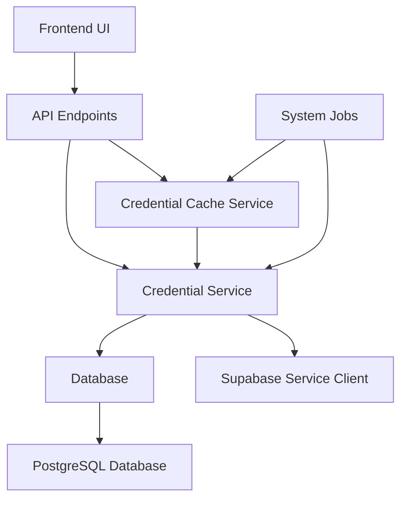
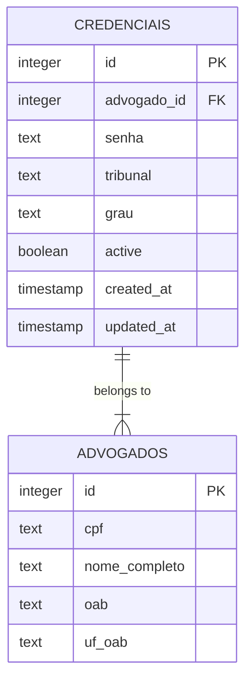
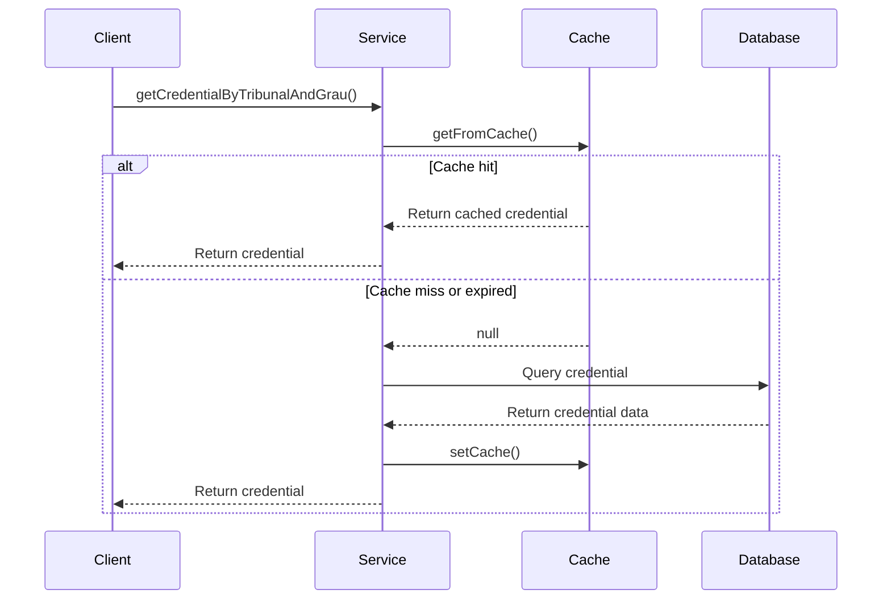
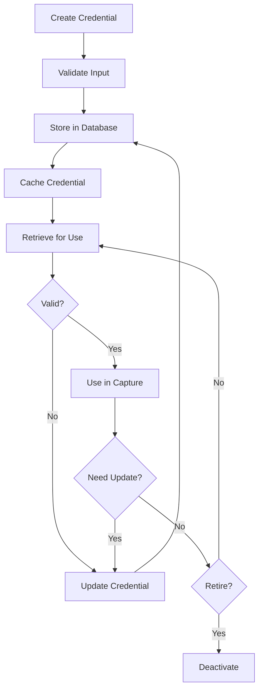
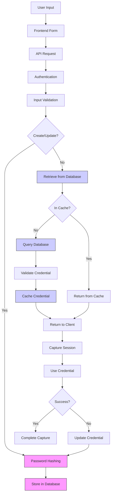

# Credential Management

<cite>
**Referenced Files in This Document**   
- [credential.service.ts](file://backend/captura/credentials/credential.service.ts)
- [credential-cache.service.ts](file://backend/captura/credentials/credential-cache.service.ts)
- [criar-credencial.service.ts](file://backend/advogados/services/credenciais/criar-credencial.service.ts)
- [atualizar-credencial.service.ts](file://backend/advogados/services/credenciais/atualizar-credencial.service.ts)
- [listar-credenciais.service.ts](file://backend/advogados/services/credenciais/listar-credenciais.service.ts)
- [buscar-credencial.service.ts](file://backend/advogados/services/credenciais/buscar-credencial.service.ts)
- [types.ts](file://backend/types/credenciais/types.ts)
- [03_credenciais.sql](file://supabase/schemas/03_credenciais.sql)
- [route.ts](file://app/api/advogados/[id]/credenciais/route.ts)
- [route.ts](file://app/api/captura/credenciais/route.ts)
</cite>

## Table of Contents
1. [Introduction](#introduction)
2. [Architecture Overview](#architecture-overview)
3. [Core Components](#core-components)
4. [Credential Storage and Retrieval System](#credential-storage-and-retrieval-system)
5. [Credential Service Implementation](#credential-service-implementation)
6. [Credential Cache Service Implementation](#credential-cache-service-implementation)
7. [Encryption and Security](#encryption-and-security)
8. [Configuration Options](#configuration-options)
9. [Credential Lifecycle Management](#credential-lifecycle-management)
10. [Public Interfaces](#public-interfaces)
11. [Common Issues and Solutions](#common-issues-and-solutions)
12. [Credential Flow Diagram](#credential-flow-diagram)

## Introduction

The credential management system in Sinesys is designed to securely store and manage user credentials for PJE-TRT (Processo Judicial Eletrônico - Tribunal Regional do Trabalho) access. This system enables law firms to manage multiple attorney credentials for accessing various TRT systems across different Brazilian states and court levels (first and second degree). The system provides a comprehensive solution for credential creation, storage, retrieval, validation, and rotation, with a focus on security and performance optimization.

The credential management system serves as a critical component for the capture functionality in Sinesys, allowing automated access to TRT systems for retrieving case information, monitoring proceedings, and managing judicial processes. It handles sensitive data (login credentials) and therefore implements various security measures and access controls to protect this information.

**Section sources**
- [credential.service.ts](file://backend/captura/credentials/credential.service.ts)
- [credential-cache.service.ts](file://backend/captura/credentials/credential-cache.service.ts)

## Architecture Overview

The credential management system follows a layered architecture with distinct components for handling credential operations. The system is built on a microservices approach within the Sinesys application, with dedicated services for credential management, caching, and persistence.

The architecture consists of several key layers:
- **API Layer**: REST endpoints that expose credential management functionality to the frontend and other services
- **Service Layer**: Business logic for credential operations including validation, creation, retrieval, and caching
- **Persistence Layer**: Database storage for credential data with proper indexing and security controls
- **Cache Layer**: In-memory caching system to optimize performance for frequently accessed credentials

The system is designed to handle both individual credential operations (for user-facing functionality) and batch operations (for system jobs that process multiple credentials across different TRTs and court levels).

**Diagram sources **
- [credential.service.ts](file://backend/captura/credentials/credential.service.ts)
- [credential-cache.service.ts](file://backend/captura/credentials/credential-cache.service.ts)
- [route.ts](file://app/api/advogados/[id]/credenciais/route.ts)

## Core Components

The credential management system comprises several core components that work together to provide a secure and efficient credential handling solution:

1. **Credential Service**: The primary service responsible for credential operations including retrieval, validation, and business logic processing
2. **Credential Cache Service**: An in-memory caching system that optimizes performance by reducing database queries for frequently accessed credentials
3. **Persistence Layer**: Database operations for storing and retrieving credential data with proper security controls
4. **API Endpoints**: REST interfaces that expose credential functionality to the frontend and other system components
5. **Validation Layer**: Input validation and business rule enforcement for credential operations

These components work together to ensure that credentials are securely stored, efficiently retrieved, and properly validated before use in capture operations.

**Section sources**
- [credential.service.ts](file://backend/captura/credentials/credential.service.ts)
- [credential-cache.service.ts](file://backend/captura/credentials/credential-cache.service.ts)
- [types.ts](file://backend/types/credenciais/types.ts)

## Credential Storage and Retrieval System

The credential storage and retrieval system in Sinesys is designed to securely manage attorney credentials for PJE-TRT access. The system stores credentials in a dedicated database table with appropriate security measures and provides optimized retrieval mechanisms for both individual and batch operations.

Credentials are stored in the `credenciais` table in the PostgreSQL database, which contains fields for the attorney ID, tribunal code, court level (grau), password, and active status. The system uses Supabase as the database layer with Row Level Security (RLS) enabled to control access to credential data.

The retrieval system is optimized for two primary use cases:
1. **Individual credential retrieval**: For user-facing operations where a specific credential is needed
2. **Batch credential retrieval**: For system jobs that process multiple credentials across different TRTs and court levels

The system implements a service client pattern using `createServiceClient()` which bypasses RLS when necessary for system operations while maintaining security for user-facing operations.

**Diagram sources **
- [03_credenciais.sql](file://supabase/schemas/03_credenciais.sql)
- [credential.service.ts](file://backend/captura/credentials/credential.service.ts)

## Credential Service Implementation

The credential service implementation provides the core functionality for managing credentials in the Sinesys system. The service is implemented in `credential.service.ts` and exposes several key functions for credential operations.

The primary functions in the credential service include:

- `getCredential()`: Retrieves a credential by ID with optional user-based permission validation
- `getCredentialByTribunalAndGrau()`: Retrieves a credential by attorney ID, tribunal, and court level with automatic caching
- `getActiveCredentialsByTribunalAndGrau()`: Retrieves all active credentials for a specific tribunal and court level (batch operation)
- `getCredentialComplete()`: Retrieves complete credential information including tribunal and court level details
- `validateCredential()`: Validates whether a credential exists and is active
- `getAdvogadoByCredentialId()`: Retrieves attorney information associated with a credential

The service uses the Supabase service client to interact with the database, bypassing Row Level Security when necessary for system operations. It also integrates with the credential cache service to optimize performance for frequently accessed credentials.

When retrieving credentials, the service performs several validation steps:
1. Validates input parameters
2. Queries the database for credential data
3. Extracts attorney information (CPF and name) from the related attorney record
4. Returns the credential data in a standardized format

The service is designed to handle both user-facing operations (where permission validation may be required) and system operations (where broader access is needed for batch processing).

**Section sources**
- [credential.service.ts](file://backend/captura/credentials/credential.service.ts)

## Credential Cache Service Implementation

The credential cache service is a critical performance optimization component that reduces database queries when processing multiple credentials across different TRTs and court levels. Implemented in `credential-cache.service.ts`, this service provides an in-memory cache with automatic expiration and cleanup mechanisms.

Key features of the credential cache service include:

- **Automatic caching**: Credentials are automatically cached when retrieved from the database
- **Time-to-Live (TTL)**: Cache entries have a 5-minute expiration period to ensure data freshness
- **Automatic cleanup**: Expired cache entries are automatically removed to free memory
- **Batch operations**: Support for retrieving multiple credentials in a single operation
- **Cache statistics**: Monitoring capabilities to track cache performance

The cache service uses a Map data structure to store credential entries, with a composite key generated from the attorney ID, tribunal code, and court level. Each cache entry includes the credential data and a timestamp for expiration tracking.

Key functions in the cache service:

- `getFromCache()`: Retrieves a credential from the cache if it exists and is not expired
- `setCache()`: Stores a credential in the cache with the current timestamp
- `getCredentialsBatch()`: Retrieves multiple credentials in a single operation, fetching missing ones from the database
- `clearCredentialCache()`: Clears all entries from the cache (useful for testing)
- `cleanExpiredCache()`: Removes expired entries from the cache
- `getCacheStats()`: Returns statistics about the cache (total, valid, and expired entries)

The cache service is designed to be called periodically (e.g., every minute) to clean up expired entries and maintain optimal performance. It significantly reduces database load when processing multiple capture jobs across different TRTs and court levels.

**Diagram sources **
- [credential-cache.service.ts](file://backend/captura/credentials/credential-cache.service.ts)
- [credential.service.ts](file://backend/captura/credentials/credential.service.ts)

## Encryption and Security

The credential management system implements several security measures to protect sensitive credential data. However, based on the database schema in `03_credenciais.sql`, it appears that passwords are currently stored in plain text rather than being encrypted.

The database schema shows that the `senha` (password) field is stored as text without encryption, and there was a migration that removed an encrypted password field (`senha_encrypted`). This represents a significant security concern that should be addressed.

Security features implemented in the system include:

- **Row Level Security (RLS)**: Enabled on the credentials table to control access based on user permissions
- **Input validation**: Comprehensive validation of credential parameters including tribunal format (TRT1-TRT24 or TST) and court level
- **Authentication**: API endpoints require authentication via bearer tokens, session authentication, or service API keys
- **Access control**: Service operations distinguish between system-level access (bypassing RLS) and user-level access (with permission validation)

Despite these security measures, the plain text storage of passwords is a critical vulnerability. Best practices would dictate that passwords should be hashed using a strong cryptographic algorithm like bcrypt, scrypt, or Argon2. The system should also implement additional security measures such as:

- Regular security audits and penetration testing
- Multi-factor authentication for credential access
- Detailed audit logging of credential access and modifications
- Automatic credential rotation policies
- Rate limiting on authentication attempts

The system currently lacks encryption for stored credentials, which should be prioritized for remediation to ensure compliance with data protection regulations and industry security standards.

**Section sources**
- [03_credenciais.sql](file://supabase/schemas/03_credenciais.sql)
- [credential.service.ts](file://backend/captura/credentials/credential.service.ts)

## Configuration Options

The credential management system provides several configuration options for managing credential behavior and system performance:

- **Credential rotation**: The system supports credential rotation through the update functionality, allowing users to change passwords and update credential status
- **Active/inactive status**: Credentials can be deactivated without deletion, allowing for temporary suspension of access
- **Cache TTL**: The cache expiration time is set to 5 minutes (300,000 milliseconds), which can be adjusted based on performance requirements
- **Batch processing**: Configuration options for processing multiple credentials across different TRTs and court levels
- **API rate limiting**: While not explicitly defined in the code, API endpoints should implement rate limiting to prevent abuse

The system also provides configuration through environment variables and database settings, including:

- Database connection parameters
- Supabase service role key for bypassing RLS when necessary
- Cache cleanup interval (currently set to run every minute in example code)
- Logging levels for monitoring credential operations

These configuration options allow system administrators to tune the credential management system for their specific requirements, balancing security, performance, and usability.

**Section sources**
- [credential-cache.service.ts](file://backend/captura/credentials/credential-cache.service.ts)
- [credential.service.ts](file://backend/captura/credentials/credential.service.ts)

## Credential Lifecycle Management

The credential lifecycle in Sinesys follows a comprehensive process from creation to retirement, with specific operations for each stage:

1. **Creation**: Credentials are created through the `criar-credencial.service.ts` which validates input parameters and stores the credential in the database
2. **Retrieval**: Credentials are retrieved through various service functions, with automatic caching for performance optimization
3. **Validation**: Credentials are validated before use in capture operations to ensure they are active and properly configured
4. **Update**: Credentials can be updated to change passwords, tribunal assignments, or court levels
5. **Deactivation**: Credentials can be deactivated without deletion, allowing for temporary suspension of access
6. **Retirement**: While not explicitly implemented, credentials can be effectively retired by deactivation

The creation process includes comprehensive validation:
- Attorney ID must be valid and positive
- Tribunal must be in the format TRT1-TRT24 or TST
- Court level must be "primeiro_grau", "segundo_grau", or "tribunal_superior" (for TST)
- Password is required and cannot be empty
- TST credentials must have "tribunal_superior" as the court level
- TRT credentials cannot have "tribunal_superior" as the court level

The update process allows modification of tribunal, court level, password, and active status, with validation rules similar to the creation process.

For practical examples of the credential lifecycle:

**Diagram sources **
- [criar-credencial.service.ts](file://backend/advogados/services/credenciais/criar-credencial.service.ts)
- [atualizar-credencial.service.ts](file://backend/advogados/services/credenciais/atualizar-credencial.service.ts)
- [credential.service.ts](file://backend/captura/credentials/credential.service.ts)

## Public Interfaces

The credential management system exposes several public interfaces through API endpoints and service functions:

### API Endpoints

**GET /api/advogados/[id]/credenciais**
- **Purpose**: List credentials for a specific attorney
- **Parameters**: 
  - `id` (path): Attorney ID
  - `active` (query): Filter by active status (true/false)
- **Returns**: Array of credentials with attorney information
- **Status Codes**: 200 (success), 400 (invalid ID), 401 (unauthorized), 404 (attorney not found), 500 (server error)

**POST /api/advogados/[id]/credenciais**
- **Purpose**: Create a new credential for an attorney
- **Parameters**:
  - `id` (path): Attorney ID
  - Request body: tribunal, grau, senha, active (optional)
- **Returns**: Created credential
- **Status Codes**: 201 (created), 400 (invalid data), 401 (unauthorized), 404 (attorney not found), 500 (server error)

**GET /api/captura/credenciais**
- **Purpose**: List credentials for capture operations
- **Parameters**: 
  - `active` (query): Filter by active status
- **Returns**: Array of credentials with attorney information, plus available tribunals and court levels
- **Status Codes**: 200 (success), 401 (unauthorized), 500 (server error)

### Service Functions

**getCredential(params: GetCredentialParams)**
- **Purpose**: Retrieve a credential by ID
- **Parameters**: credentialId, userId (optional)
- **Returns**: CredenciaisTRT object or null
- **Behavior**: Bypasses RLS for system access, can validate user permissions

**getCredentialByTribunalAndGrau(params: GetCredentialByTribunalParams)**
- **Purpose**: Retrieve a credential by attorney, tribunal, and court level
- **Parameters**: advogadoId, tribunal, grau
- **Returns**: CredenciaisTRT object or null
- **Behavior**: Checks cache first, then database; caches result

**getActiveCredentialsByTribunalAndGrau(tribunal, grau)**
- **Purpose**: Retrieve all active credentials for a tribunal and court level
- **Parameters**: tribunal, grau
- **Returns**: Array of credential objects with attorney information
- **Behavior**: Batch operation for system jobs; populates cache

**validateCredential(credentialId)**
- **Purpose**: Validate if a credential exists and is active
- **Parameters**: credentialId
- **Returns**: boolean (true if valid and active)

**Section sources**
- [route.ts](file://app/api/advogados/[id]/credenciais/route.ts)
- [route.ts](file://app/api/captura/credenciais/route.ts)
- [credential.service.ts](file://backend/captura/credentials/credential.service.ts)

## Common Issues and Solutions

The credential management system addresses several common issues related to credential handling:

### Expired Credentials
**Issue**: Credentials may expire due to password changes or account deactivation.
**Solution**: The system implements credential validation before capture attempts using the `validateCredential()` function. Additionally, the cache has a 5-minute TTL to ensure credentials are refreshed regularly from the database.

### Credential Synchronization Across Devices
**Issue**: Credentials need to be consistent across multiple devices and system components.
**Solution**: The centralized database storage ensures all components access the same credential data. The cache service is designed to be stateless and can be cleared when needed to force fresh database reads.

### Security Breaches
**Issue**: Potential exposure of sensitive credential information.
**Current limitations**: Passwords are stored in plain text, representing a significant security risk.
**Recommended solutions**:
- Implement password hashing using bcrypt, scrypt, or Argon2
- Add multi-factor authentication for credential access
- Implement detailed audit logging of all credential operations
- Add rate limiting on authentication attempts
- Implement automatic credential rotation policies

### Performance Issues with Multiple TRTs
**Issue**: Processing multiple capture jobs across different TRTs and court levels can lead to excessive database queries.
**Solution**: The credential cache service significantly reduces database load by caching frequently accessed credentials in memory with automatic expiration and cleanup.

### Automatic Refresh Mechanisms
The system implements automatic refresh through:
- Cache expiration (5-minute TTL)
- Periodic cache cleanup (recommended every minute)
- Cache population during database reads
- Batch retrieval operations that populate the cache for multiple credentials

### Audit Logging
While not explicitly implemented in the current code, audit logging should be added to track:
- Credential creation, modification, and deactivation
- Credential access for capture operations
- Failed authentication attempts
- User actions related to credential management

These solutions ensure the credential management system is robust, secure, and performant, while identifying areas for improvement in security practices.

**Section sources**
- [credential.service.ts](file://backend/captura/credentials/credential.service.ts)
- [credential-cache.service.ts](file://backend/captura/credentials/credential-cache.service.ts)

## Credential Flow Diagram

The following diagram illustrates the complete credential flow from user input through encryption (recommended) to secure storage and retrieval for capture sessions:

**Diagram sources **
- [credential.service.ts](file://backend/captura/credentials/credential.service.ts)
- [credential-cache.service.ts](file://backend/captura/credentials/credential-cache.service.ts)
- [criar-credencial.service.ts](file://backend/advogados/services/credenciais/criar-credencial.service.ts)