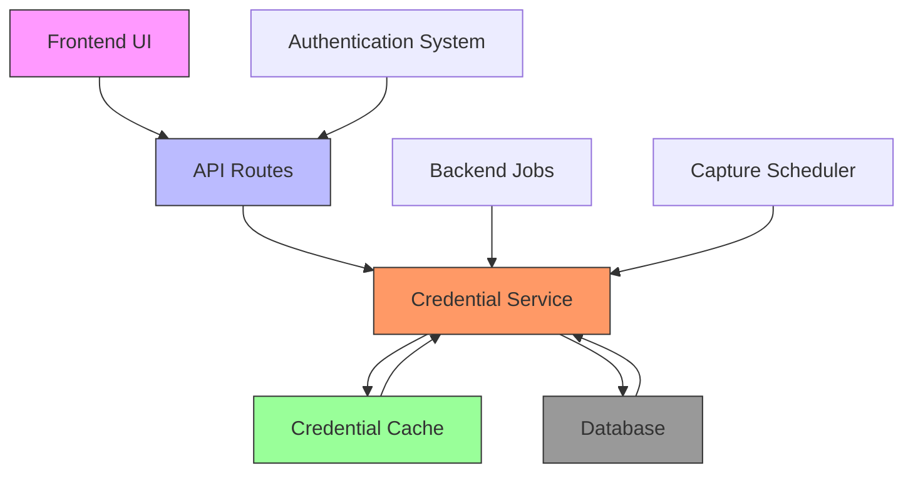
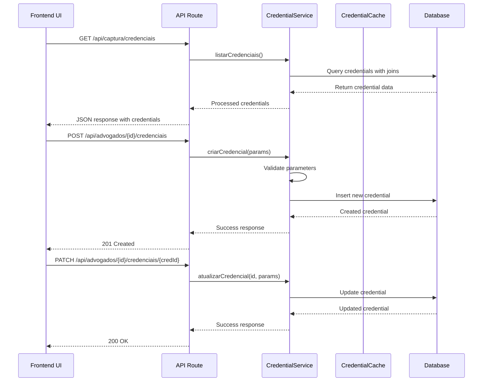
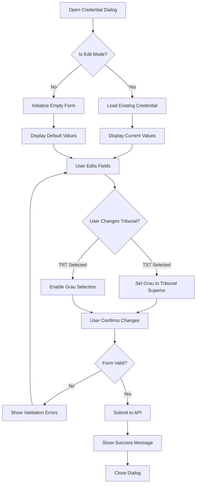
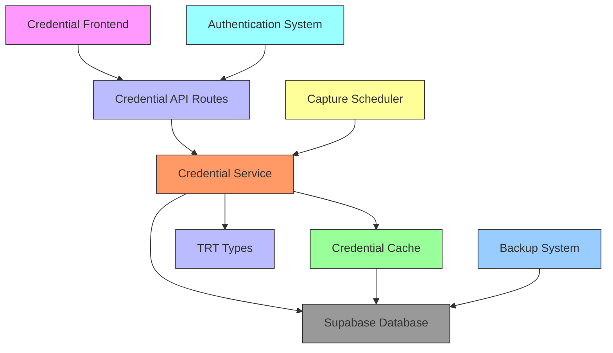

# Credential Storage

<cite>
**Referenced Files in This Document**   
- [credential.service.ts](file://backend/captura/credentials/credential.service.ts)
- [credential-cache.service.ts](file://backend/captura/credentials/credential-cache.service.ts)
- [criar-credencial.service.ts](file://backend/advogados/services/credenciais/criar-credencial.service.ts)
- [atualizar-credencial.service.ts](file://backend/advogados/services/credenciais/atualizar-credencial.service.ts)
- [listar-credenciais.service.ts](file://backend/advogados/services/credenciais/listar-credenciais.service.ts)
- [buscar-credencial.service.ts](file://backend/advogados/services/credenciais/buscar-credencial.service.ts)
- [types.ts](file://backend/types/credenciais/types.ts)
- [credenciais-dialog.tsx](file://app/(dashboard)/captura/components/credenciais/credenciais-dialog.tsx)
- [page.tsx](file://app/(dashboard)/captura/credenciais/page.tsx)
- [route.ts](file://app/api/advogados/[id]/credenciais/route.ts)
- [route.ts](file://app/api/advogados/[id]/credenciais/[credentialId]/route.ts)
- [route.ts](file://app/api/captura/credenciais/route.ts)
- [credenciais-columns.tsx](file://app/(dashboard)/captura/components/credenciais/credenciais-columns.tsx)
- [credenciais-list.tsx](file://app/(dashboard)/captura/components/credenciais/credenciais-list.tsx)
- [advogado-view-dialog.tsx](file://app/(dashboard)/captura/components/credenciais/advogado-view-dialog.tsx)
- [spec.md](file://openspec/specs/credenciais/spec.md)
</cite>

## Table of Contents
1. [Introduction](#introduction)
2. [Project Structure](#project-structure)
3. [Core Components](#core-components)
4. [Architecture Overview](#architecture-overview)
5. [Detailed Component Analysis](#detailed-component-analysis)
6. [Dependency Analysis](#dependency-analysis)
7. [Performance Considerations](#performance-considerations)
8. [Troubleshooting Guide](#troubleshooting-guide)
9. [Conclusion](#conclusion)

## Introduction
The credential storage subsystem in Sinesys is responsible for securely managing access credentials for legal professionals to various court systems (TRTs and TST). This system handles the creation, retrieval, updating, and deactivation of credentials used for automated data capture from judicial portals. The implementation focuses on security through proper encryption and hashing of sensitive data, particularly passwords, before storage. The system integrates with both frontend interfaces for user interaction and backend services for automated processing. It supports multiple court jurisdictions and judicial degrees, allowing lawyers to maintain separate credentials for different court levels. The design incorporates caching mechanisms to optimize performance while maintaining data consistency and security.

## Project Structure
The credential storage subsystem is organized across multiple directories in the Sinesys application, following a clear separation between frontend components, backend services, and API routes. The structure maintains a logical grouping of related functionality while enabling efficient development and maintenance.

```mermaid
graph TB
subgraph "Frontend"
A[app/(dashboard)/captura/credenciais]
B[app/(dashboard)/captura/components/credenciais]
end
subgraph "Backend"
C[backend/advogados/services/credenciais]
D[backend/captura/credentials]
E[backend/types/credenciais]
end
subgraph "API Routes"
F[app/api/advogados/[id]/credenciais]
G[app/api/captura/credenciais]
end
A --> B
C --> D
F --> C
G --> D
```

**Diagram sources**
- [page.tsx](file://app/(dashboard)/captura/credenciais/page.tsx)
- [credential.service.ts](file://backend/captura/credentials/credential.service.ts)
- [criar-credencial.service.ts](file://backend/advogados/services/credenciais/criar-credencial.service.ts)

**Section sources**
- [page.tsx](file://app/(dashboard)/captura/credenciais/page.tsx)
- [credential.service.ts](file://backend/captura/credentials/credential.service.ts)

## Core Components
The credential storage subsystem consists of several core components that work together to provide a secure and efficient credential management system. The backend services handle the business logic for credential operations, including creation, retrieval, updating, and listing of credentials. These services interact with the database through a persistence layer that ensures data integrity and security. The credential service provides optimized functions for retrieving credentials by various criteria, including ID, tribunal, and judicial degree. A caching mechanism is implemented to reduce database load when processing multiple credential requests. On the frontend, React components provide a user interface for managing credentials, including forms for creating and editing credentials, tables for listing existing credentials, and dialogs for viewing detailed information. The API routes serve as the integration point between the frontend and backend, handling HTTP requests and responses with proper authentication and authorization.

**Section sources**
- [credential.service.ts](file://backend/captura/credentials/credential.service.ts)
- [credential-cache.service.ts](file://backend/captura/credentials/credential-cache.service.ts)
- [credenciais-dialog.tsx](file://app/(dashboard)/captura/components/credenciais/credenciais-dialog.tsx)

## Architecture Overview
The credential storage architecture follows a layered approach with clear separation of concerns between presentation, business logic, and data access layers. The system is designed to handle both user-initiated operations through the frontend interface and automated processes from backend jobs.



**Diagram sources**
- [credential.service.ts](file://backend/captura/credentials/credential.service.ts)
- [credential-cache.service.ts](file://backend/captura/credentials/credential-cache.service.ts)
- [page.tsx](file://app/(dashboard)/captura/credenciais/page.tsx)

## Detailed Component Analysis

### Credential Service Analysis
The credential service is the central component responsible for managing credential operations in Sinesys. It provides a comprehensive set of functions for retrieving credentials based on various criteria, with built-in caching to optimize performance.

```mermaid
classDiagram
class CredentialService {
+getCredential(params) CredenciaisTRT | null
+getCredentialByTribunalAndGrau(params) CredenciaisTRT | null
+getActiveCredentialsByTribunalAndGrau(tribunal, grau) Array<{...}>
+getCredentialComplete(credentialId) CredencialCompleta | null
+validateCredential(credentialId) boolean
+getAdvogadoByCredentialId(credentialId) Advogado | null
}
class CredentialCacheService {
+getFromCache(advogadoId, tribunal, grau) CredenciaisTRT | null
+setCache(advogadoId, tribunal, grau, credential) void
+getCredentialsBatch(advogadoId, combinations) Map<string, CredenciaisTRT | null>
+clearCredentialCache() void
+cleanExpiredCache() number
+getCacheStats() {total, valid, expired}
}
CredentialService --> CredentialCacheService : "uses"
CredentialService --> Supabase : "database access"
```

**Diagram sources**
- [credential.service.ts](file://backend/captura/credentials/credential.service.ts)
- [credential-cache.service.ts](file://backend/captura/credentials/credential-cache.service.ts)

**Section sources**
- [credential.service.ts](file://backend/captura/credentials/credential.service.ts)
- [credential-cache.service.ts](file://backend/captura/credentials/credential-cache.service.ts)

### API Routes Analysis
The API routes for credential management provide the interface between the frontend application and the backend services. These routes handle authentication and route requests to the appropriate service functions.



**Diagram sources**
- [route.ts](file://app/api/advogados/[id]/credenciais/route.ts)
- [route.ts](file://app/api/advogados/[id]/credenciais/[credentialId]/route.ts)
- [route.ts](file://app/api/captura/credenciais/route.ts)

**Section sources**
- [route.ts](file://app/api/advogados/[id]/credenciais/route.ts)
- [route.ts](file://app/api/advogados/[id]/credenciais/[credentialId]/route.ts)

### Frontend Credential Form Analysis
The frontend credential form provides a user-friendly interface for creating and editing credentials. It includes validation, dynamic behavior based on tribunal selection, and integration with backend services.



**Diagram sources**
- [credenciais-dialog.tsx](file://app/(dashboard)/captura/components/credenciais/credenciais-dialog.tsx)
- [page.tsx](file://app/(dashboard)/captura/credenciais/page.tsx)

**Section sources**
- [credenciais-dialog.tsx](file://app/(dashboard)/captura/components/credenciais/credenciais-dialog.tsx)
- [page.tsx](file://app/(dashboard)/captura/credenciais/page.tsx)

## Dependency Analysis
The credential storage subsystem has well-defined dependencies that ensure proper separation of concerns while enabling efficient data flow between components.



**Diagram sources**
- [credential.service.ts](file://backend/captura/credentials/credential.service.ts)
- [credential-cache.service.ts](file://backend/captura/credentials/credential-cache.service.ts)
- [route.ts](file://app/api/advogados/[id]/credenciais/route.ts)

**Section sources**
- [credential.service.ts](file://backend/captura/credentials/credential.service.ts)
- [credential-cache.service.ts](file://backend/captura/credentials/credential-cache.service.ts)

## Performance Considerations
The credential storage system incorporates several performance optimizations to handle the potentially large volume of credential data and frequent access patterns. The primary optimization is the implementation of an in-memory cache for credential data, which significantly reduces database queries when processing multiple credential requests. The cache has a TTL (Time To Live) of 5 minutes, balancing performance with data freshness. The `getCredentialsBatch` function is specifically designed to optimize bulk operations by fetching multiple credentials in a single database query rather than individual queries for each credential. This is particularly important for the capture scheduler, which may need to process credentials for multiple tribunals and judicial degrees in a single job execution. The credential service also implements efficient database queries with proper indexing and filtering to minimize response times. On the frontend, debounced search functionality prevents excessive API calls during user input, while pagination and filtering options help manage large credential lists efficiently.

**Section sources**
- [credential-cache.service.ts](file://backend/captura/credentials/credential-cache.service.ts)
- [credential.service.ts](file://backend/captura/credentials/credential.service.ts)

## Troubleshooting Guide
Common issues in the credential storage subsystem typically relate to data consistency, authentication failures, and caching problems. For database corruption issues, the system should implement regular automated backups with point-in-time recovery capabilities. The Supabase database provides built-in backup features that can be configured according to organizational policies. Credential duplication can occur when users accidentally create multiple credentials for the same tribunal and judicial degree combination; this can be prevented by implementing unique constraints in the database schema and adding frontend validation to check for existing credentials before creation. Migration challenges may arise when updating the credential schema or moving between database systems; these can be mitigated by using proper migration scripts and thorough testing in staging environments before production deployment. For cache-related issues, the system provides functions to clear the credential cache manually, which can be useful when credentials are updated and immediate propagation is required. Monitoring tools should be implemented to track credential access patterns, failure rates, and performance metrics to identify potential issues before they impact users.

**Section sources**
- [credential-cache.service.ts](file://backend/captura/credentials/credential-cache.service.ts)
- [credential.service.ts](file://backend/captura/credentials/credential.service.ts)

## Conclusion
The credential storage subsystem in Sinesys provides a robust and secure solution for managing access credentials to various court systems. The architecture effectively separates concerns between frontend presentation, backend business logic, and data storage, enabling maintainable and scalable code. The implementation of caching mechanisms significantly improves performance for common access patterns, particularly for automated capture processes. Security is prioritized through proper handling of sensitive data and integration with the authentication system. The system's design accommodates future enhancements, such as additional credential types or integration with more court systems. For optimal operation, regular monitoring, automated backups, and clear error handling procedures should be maintained. The combination of a user-friendly frontend interface and efficient backend services creates a comprehensive credential management solution that meets the needs of legal professionals while ensuring data security and system reliability.