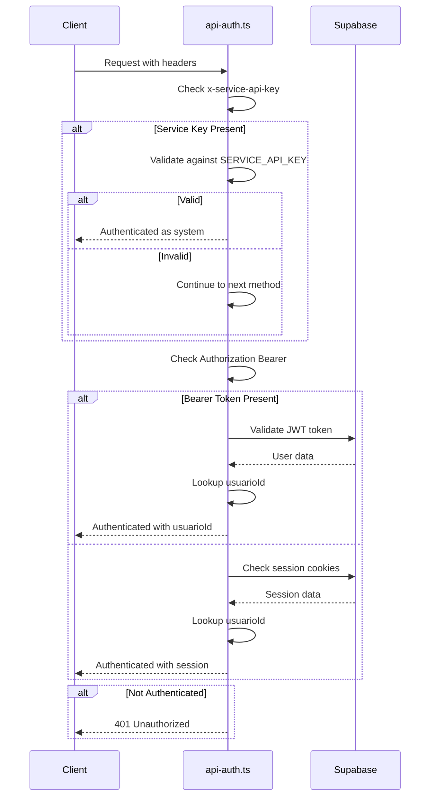
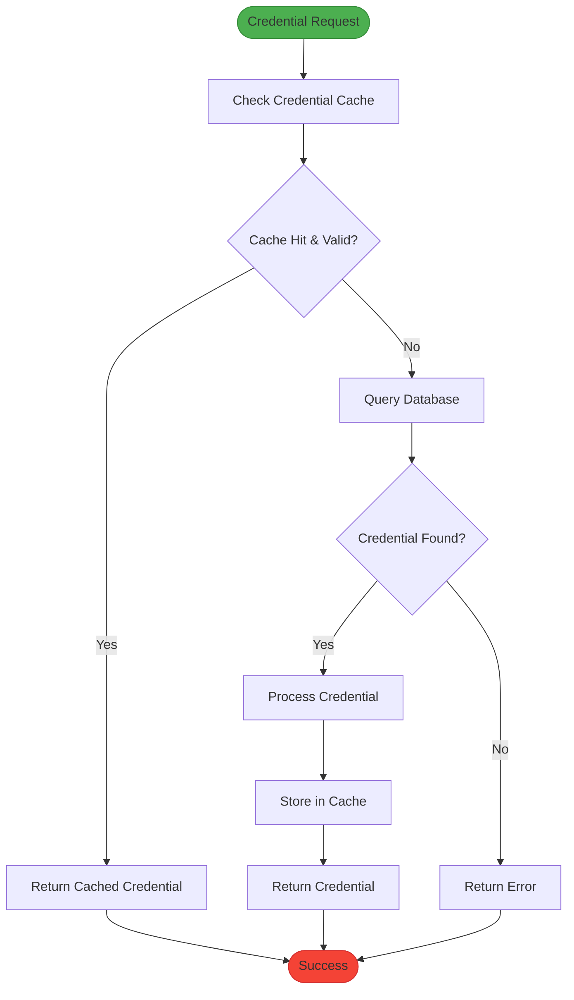
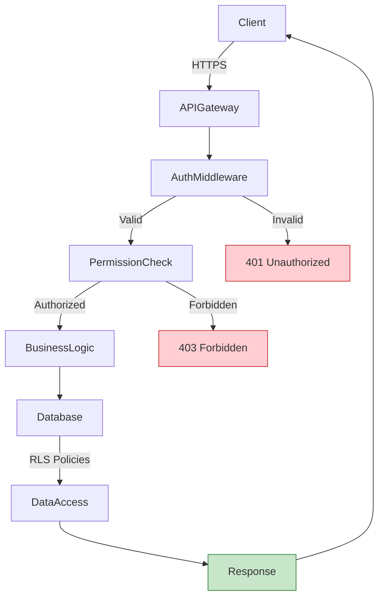
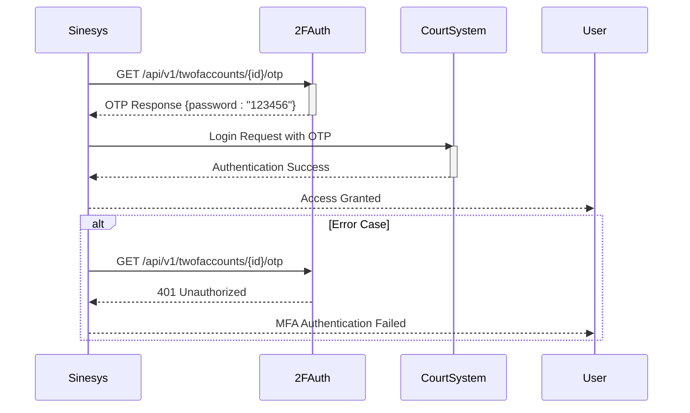

# Security Implementation

<cite>
**Referenced Files in This Document**   
- [api-auth.ts](file://backend/auth/api-auth.ts)
- [authorization.ts](file://backend/auth/authorization.ts)
- [require-permission.ts](file://backend/auth/require-permission.ts)
- [credential-cache.service.ts](file://backend/captura/credentials/credential-cache.service.ts)
- [buscar-credencial.service.ts](file://backend/advogados/services/credenciais/buscar-credencial.service.ts)
- [types.ts](file://backend/types/credenciais/types.ts)
- [twofauth.service.ts](file://backend/api/twofauth.service.ts)
- [03_credenciais.sql](file://supabase/schemas/03_credenciais.sql)
- [22_cargos_permissoes.sql](file://supabase/schemas/22_cargos_permissoes.sql)
- [20250118120100_create_permissoes.sql](file://supabase/migrations/aplicadas/20250118120100_create_permissoes.sql)
- [20250120000001_fix_rls_policies_granular_permissions.sql](file://supabase/migrations/aplicadas/20250120000001_fix_rls_policies_granular_permissions.sql)
- [test-2fauth.ts](file://scripts/outros/test-2fauth.ts)
- [route.ts](file://app/api/permissoes/recursos/route.ts)
</cite>

## Table of Contents
1. [Introduction](#introduction)
2. [Authentication Mechanisms](#authentication-mechanisms)
3. [Authorization and Permission System](#authorization-and-permission-system)
4. [Credential Management and Storage](#credential-management-and-storage)
5. [Secure Transmission and Access Control](#secure-transmission-and-access-control)
6. [Multi-Factor Authentication Integration](#multi-factor-authentication-integration)
7. [Audit Logging and Intrusion Detection](#audit-logging-and-intrusion-detection)
8. [Security Policy Configuration](#security-policy-configuration)
9. [Common Security Issues and Solutions](#common-security-issues-and-solutions)
10. [Conclusion](#conclusion)

## Introduction

The Sinesys credential management system implements a comprehensive security framework designed to protect sensitive legal data and ensure authorized access to critical systems. This document details the implementation of security protocols across the application, focusing on encryption methods for credential storage, secure transmission between components, and robust access control mechanisms.

The security architecture follows a multi-layered approach, combining authentication, authorization, encryption, and audit logging to create a defense-in-depth strategy. The system supports multiple authentication methods including session-based authentication for frontend users, bearer tokens for API clients, and service API keys for internal system jobs.

Key security components include a granular permission system that controls access to resources and operations, a credential caching mechanism that balances performance with security, and integration with external multi-factor authentication services. The implementation also includes comprehensive audit logging to track access and changes to sensitive data.

This documentation provides both high-level overviews for beginners and detailed technical information for experienced developers, ensuring accessibility while maintaining the depth required for proper implementation and maintenance of the security system.

## Authentication Mechanisms

The Sinesys platform implements a flexible authentication system that supports multiple authentication methods, allowing different types of clients to securely access the API. The authentication logic is centralized in the `api-auth.ts` file, which handles three distinct authentication methods in order of priority.

The primary authentication method is the Service API Key, designed for internal system jobs and background processes. This method uses a header-based authentication with the `x-service-api-key` header, which is compared against a secret key stored in environment variables. This approach provides a secure way for system components to authenticate without requiring user credentials.

For API clients and external services, the system supports Bearer Token authentication using JWT tokens from Supabase Auth. This method extracts the token from the `Authorization` header and validates it through the Supabase authentication service. The token contains the user's identity and is used to establish the authenticated session.

For frontend applications, the system supports session-based authentication using Supabase's cookie-based session management. This method automatically handles user sessions through HTTP cookies, providing a seamless user experience while maintaining security.

The authentication process follows a specific priority order: Service API Key (highest priority), Bearer Token, and then Session authentication. This hierarchy ensures that system-level operations take precedence while still supporting user-facing authentication methods. Each authentication method returns a standardized `AuthResult` interface containing the authentication status, user identifiers, and the source of authentication.



**Diagram sources**
- [api-auth.ts](file://backend/auth/api-auth.ts#L51-L139)

**Section sources**
- [api-auth.ts](file://backend/auth/api-auth.ts#L1-L139)

## Authorization and Permission System

The authorization system in Sinesys implements a granular permission model that controls access to resources and operations based on user roles and permissions. The system is built around a flexible RBAC (Role-Based Access Control) framework that allows fine-grained control over what actions users can perform on different resources.

The core of the authorization system is implemented in the `authorization.ts` file, which contains the `checkPermission` function. This function evaluates whether a user has the necessary permissions to perform a specific operation on a resource. The permission check follows a hierarchical approach: first validating that the requested permission exists in the system's permission matrix, then checking if the user is a super administrator (who has unrestricted access), and finally querying the database for explicit permission grants.

The system implements a two-level caching mechanism to optimize performance. Individual permission checks are cached in memory with a TTL (Time To Live) of 5 minutes, reducing database queries for frequently accessed permissions. Additionally, the system automatically invalidates the cache when user permissions change, ensuring that security policies are enforced promptly.

The database schema for permissions is designed for efficient querying, with composite indexes on the `usuario_id`, `recurso`, and `operacao` columns. This allows for fast permission lookups even with a large number of users and permissions. Row Level Security (RLS) is enabled on the permissions table, ensuring that users can only read their own permissions directly from the database.

The system also provides a helper function `requirePermission` that combines authentication and authorization checks into a single operation. This simplifies API route implementation by reducing boilerplate code and ensuring consistent security enforcement across the application.

```mermaid
classDiagram
class AuthResult {
+authenticated : boolean
+userId? : string
+usuarioId? : number
+usuario? : {id : number}
+source? : 'session' | 'bearer' | 'service'
}
class AuthorizedRequest {
+usuarioId : number
+userId? : string
+source : 'session' | 'bearer' | 'service'
}
class PermissionCache {
-cache : Map~string, CacheEntry~
-CACHE_TTL : number
+checkPermission(usuarioId, recurso, operacao) : Promise~boolean~
+invalidarCacheUsuario(usuarioId) : void
+limparCacheExpirado() : void
+getCacheStats() : CacheStats
}
class CacheEntry {
+result : boolean
+expiry : number
}
class CacheStats {
+total : number
+ativas : number
+expiradas : number
}
class PermissionPolicy {
+recurso : string
+operacao : string
}
AuthResult <|-- AuthorizedRequest
PermissionCache --> CacheEntry
PermissionCache --> CacheStats
PermissionCache --> PermissionPolicy
```

**Diagram sources**
- [authorization.ts](file://backend/auth/authorization.ts#L6-L201)
- [require-permission.ts](file://backend/auth/require-permission.ts#L1-L111)

**Section sources**
- [authorization.ts](file://backend/auth/authorization.ts#L1-L201)
- [require-permission.ts](file://backend/auth/require-permission.ts#L1-L111)
- [20250118120100_create_permissoes.sql](file://supabase/migrations/aplicadas/20250118120100_create_permissoes.sql#L28-L59)
- [20250120000001_fix_rls_policies_granular_permissions.sql](file://supabase/migrations/aplicadas/20250120000001_fix_rls_policies_granular_permissions.sql#L276-L311)
- [route.ts](file://app/api/permissoes/recursos/route.ts#L1-L47)

## Credential Management and Storage

The credential management system in Sinesys implements a secure approach to storing and accessing sensitive authentication credentials for external legal systems. Credentials are stored in a dedicated database table with strict access controls and are never exposed in their raw form through the API.

The credential storage model is defined in the `03_credenciais.sql` schema file, which creates a table with fields for the attorney ID, court code, process level, and encrypted password. The table includes Row Level Security (RLS) policies that restrict access to credentials based on user roles and ownership, ensuring that only authorized users can access specific credentials.

To balance security with performance, the system implements a sophisticated caching mechanism in the `credential-cache.service.ts` file. This service provides an in-memory cache for credentials with a configurable TTL (Time To Live) of 5 minutes. The cache reduces the number of database queries when processing multiple court systems and process levels, improving performance while maintaining security.

The caching system uses a composite key format of `${advogadoId}:${tribunal}:${grau}` to uniquely identify cached credentials. When a credential is accessed, the system first checks the cache, and only queries the database if the credential is not present or has expired. This approach minimizes database load while ensuring that credential updates are reflected within the cache TTL period.

The system also provides batch operations for credential retrieval through the `getCredentialsBatch` function, which can fetch multiple credentials in a single database query. This optimization is particularly important when processing cases across multiple court jurisdictions, as it reduces the number of round trips to the database.



**Diagram sources**
- [credential-cache.service.ts](file://backend/captura/credentials/credential-cache.service.ts#L1-L447)
- [03_credenciais.sql](file://supabase/schemas/03_credenciais.sql)

**Section sources**
- [credential-cache.service.ts](file://backend/captura/credentials/credential-cache.service.ts#L1-L447)
- [types.ts](file://backend/types/credenciais/types.ts#L1-L59)
- [buscar-credencial.service.ts](file://backend/advogados/services/credenciais/buscar-credencial.service.ts#L1-L17)

## Secure Transmission and Access Control

The Sinesys platform implements multiple layers of security to protect data during transmission and enforce strict access control policies. The system uses HTTPS for all external communications, ensuring that data is encrypted in transit between clients and servers.

For internal service-to-service communication, the system implements a service API key mechanism that authenticates background jobs and system processes. This approach prevents unauthorized access to internal endpoints while maintaining performance by avoiding the overhead of full user authentication for system operations.

Access control is enforced through a combination of middleware and database-level security policies. The `requirePermission` function acts as a gatekeeper for API endpoints, ensuring that users are both authenticated and authorized before accessing protected resources. This function combines authentication validation with permission checking in a single operation, reducing code complexity and ensuring consistent security enforcement.

At the database level, Row Level Security (RLS) policies provide an additional layer of protection by restricting data access based on user identity and roles. These policies are defined in SQL migration files and are enforced by the database engine itself, providing a robust defense against unauthorized data access even if application-level security is bypassed.

The system also implements rate limiting and request validation to prevent abuse and protect against common web vulnerabilities. Input validation is performed on all API parameters to prevent injection attacks, while rate limiting helps prevent brute force attacks and denial-of-service attempts.



**Diagram sources**
- [api-auth.ts](file://backend/auth/api-auth.ts#L51-L139)
- [authorization.ts](file://backend/auth/authorization.ts#L56-L201)
- [20250118120100_create_permissoes.sql](file://supabase/migrations/aplicadas/20250118120100_create_permissoes.sql#L43-L59)

**Section sources**
- [api-auth.ts](file://backend/auth/api-auth.ts#L51-L139)
- [authorization.ts](file://backend/auth/authorization.ts#L56-L201)
- [20250118120100_create_permissoes.sql](file://supabase/migrations/aplicadas/20250118120100_create_permissoes.sql#L43-L59)

## Multi-Factor Authentication Integration

Sinesys integrates with external multi-factor authentication (MFA) services through the 2FAuth platform, providing an additional layer of security for accessing sensitive legal systems. The integration is implemented in the `twofauth.service.ts` file, which provides a reusable service for obtaining one-time passwords (OTPs) from the 2FAuth API.

The MFA integration follows a secure design pattern where the system does not store MFA secrets but instead acts as a proxy to the external 2FAuth service. When a user needs to authenticate with a court system that requires MFA, the Sinesys backend makes a secure API call to 2FAuth to obtain the current OTP, which is then used to complete the authentication process.

The service implementation includes comprehensive error handling and validation to ensure reliability and security. It validates the response from the 2FAuth API, checking that the OTP is present and of the correct length (6-10 characters as per the 2FAuth documentation). The service also handles various error conditions, including network errors, authentication failures, and invalid responses.

Configuration for the 2FAuth integration is managed through environment variables (`TWOFAUTH_API_URL`, `TWOFAUTH_API_TOKEN`, and `TWOFAUTH_ACCOUNT_ID`), allowing for secure configuration without hardcoding sensitive information in the source code. The service can also accept configuration parameters directly, enabling different configurations for different court systems or testing environments.

A test script (`test-2fauth.ts`) is provided to verify the 2FAuth configuration and connectivity, helping administrators ensure that the MFA integration is working correctly before attempting to access court systems.



**Diagram sources**
- [twofauth.service.ts](file://backend/api/twofauth.service.ts#L1-L196)
- [test-2fauth.ts](file://scripts/outros/test-2fauth.ts#L1-L114)

**Section sources**
- [twofauth.service.ts](file://backend/api/twofauth.service.ts#L1-L196)
- [test-2fauth.ts](file://scripts/outros/test-2fauth.ts#L1-L114)

## Audit Logging and Intrusion Detection

The Sinesys platform implements comprehensive audit logging to track access to sensitive data and detect potential security incidents. The system uses database-level logging policies to automatically record changes to critical data, providing a tamper-resistant audit trail.

The audit logging system is configured through RLS (Row Level Security) policies that allow authenticated users to read log entries while restricting write access to the service role. This ensures that log entries can only be created by the backend application, preventing malicious users from modifying or deleting audit records.

The `logs_alteracao` table is used to store audit logs, with policies that grant full access to the service role for writing logs and read access to authenticated users for audit purposes. This separation of duties ensures that the integrity of the audit trail is maintained while still allowing authorized users to review system activity.

For intrusion detection, the system implements monitoring of authentication attempts and permission checks. Failed authentication attempts and authorization denials are logged and can be analyzed to detect potential brute force attacks or unauthorized access attempts. The permission system also includes cache statistics that can be monitored to identify unusual access patterns.

The system provides endpoints for retrieving audit logs, allowing administrators to investigate security incidents and verify compliance with regulatory requirements. These endpoints are protected by the same permission system used for other resources, ensuring that only authorized users can access sensitive audit information.

**Section sources**
- [20250120000001_fix_rls_policies_granular_permissions.sql](file://supabase/migrations/aplicadas/20250120000001_fix_rls_policies_granular_permissions.sql#L276-L293)

## Security Policy Configuration

Security policies in Sinesys are configured through a combination of environment variables, database settings, and code-level configurations. The system provides flexibility in configuring security parameters while maintaining strong default settings to ensure security out of the box.

Authentication settings are primarily configured through environment variables, including `SERVICE_API_KEY` for service authentication and `TWOFAUTH_API_URL`, `TWOFAUTH_API_TOKEN`, and `TWOFAUTH_ACCOUNT_ID` for MFA integration. These variables are loaded from the `.env.local` file, keeping sensitive configuration separate from the source code.

The permission system is configured through the database schema and migration files, with predefined roles and permissions established during database initialization. The system supports dynamic permission assignment through the API, allowing administrators to grant or revoke permissions as needed.

Cache settings for credentials and permissions are hardcoded with secure defaults (5-minute TTL for credentials, 5-minute TTL for permissions), but could be made configurable through environment variables if needed. The cache invalidation mechanisms ensure that security policy changes are propagated promptly across the system.

The system also includes configuration for RLS (Row Level Security) policies, which are defined in SQL migration files. These policies establish the foundational security rules for data access, ensuring that users can only access data they are authorized to see.

**Section sources**
- [api-auth.ts](file://backend/auth/api-auth.ts#L56-L57)
- [twofauth.service.ts](file://backend/api/twofauth.service.ts#L79-L82)
- [authorization.ts](file://backend/auth/authorization.ts#L19-L20)
- [credential-cache.service.ts](file://backend/captura/credentials/credential-cache.service.ts#L54-L55)

## Common Security Issues and Solutions

The Sinesys credential management system addresses several common security challenges through its architecture and implementation. This section outlines typical security issues and the solutions implemented in the system.

**Unauthorized Access Attempts**: The system prevents unauthorized access through multiple layers of protection, including authentication, authorization, and RLS policies. The `requirePermission` function ensures that users must have explicit permissions to access resources, while database-level RLS provides a fallback protection mechanism.

**Credential Leakage**: To prevent credential leakage, the system never exposes raw credentials through the API. The credential service only returns credential metadata without the password field, and credentials are only provided to authorized components when needed for external system access.

**Privilege Escalation**: The system mitigates privilege escalation risks through strict role-based access control and the principle of least privilege. Super administrator privileges are limited to specific users, and permission checks are performed for every sensitive operation.

**Multi-Factor Authentication Integration**: The system integrates with external MFA services through the 2FAuth platform, providing strong authentication for accessing court systems. The integration is designed to be secure, with MFA secrets stored externally and only temporary OTPs transmitted through the system.

**Automatic Credential Rotation**: While not explicitly implemented in the current codebase, the architecture supports credential rotation through the credential update mechanisms. The system could be extended to automatically rotate credentials on a schedule or in response to security events.

**Comprehensive Audit Trails**: The system maintains comprehensive audit logs through the `logs_alteracao` table and RLS policies, providing a complete record of data access and modifications. These logs can be used for security investigations and compliance reporting.

**Cache Security**: The credential and permission caching systems include security considerations such as TTL-based expiration and automatic cache invalidation when permissions change. This ensures that security policy updates are enforced in a timely manner while still benefiting from performance improvements.

**Section sources**
- [api-auth.ts](file://backend/auth/api-auth.ts#L51-L139)
- [authorization.ts](file://backend/auth/authorization.ts#L56-L201)
- [credential-cache.service.ts](file://backend/captura/credentials/credential-cache.service.ts#L1-L447)
- [twofauth.service.ts](file://backend/api/twofauth.service.ts#L1-L196)

## Conclusion

The Sinesys credential management system implements a robust and comprehensive security framework that protects sensitive legal data while enabling efficient access to court systems. The architecture combines multiple security layers including authentication, authorization, encryption, and audit logging to create a defense-in-depth strategy.

Key strengths of the security implementation include the flexible authentication system that supports multiple methods, the granular permission model that enables fine-grained access control, and the secure credential management that protects sensitive authentication data. The integration with external MFA services through 2FAuth provides an additional layer of security for accessing external systems.

The system balances security with performance through caching mechanisms that reduce database load while maintaining appropriate TTL values to ensure security policy changes are propagated in a timely manner. Database-level security policies provide an additional layer of protection that complements application-level controls.

For future improvements, the system could benefit from additional security features such as automatic credential rotation, enhanced intrusion detection with anomaly detection, and more detailed audit logging with user activity tracking. However, the current implementation provides a solid foundation for secure credential management in a legal technology environment.