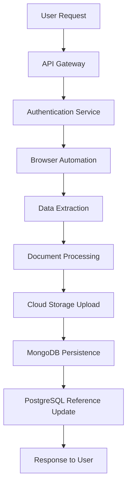
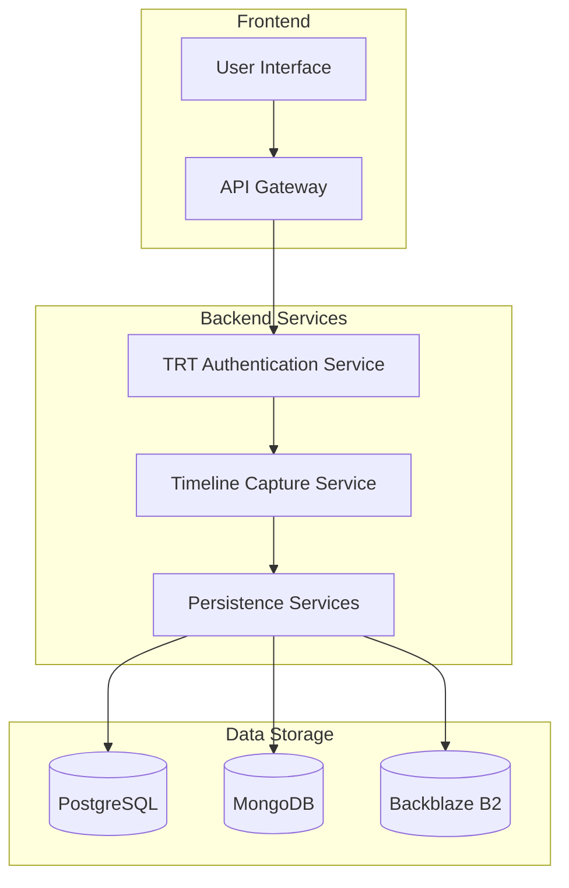
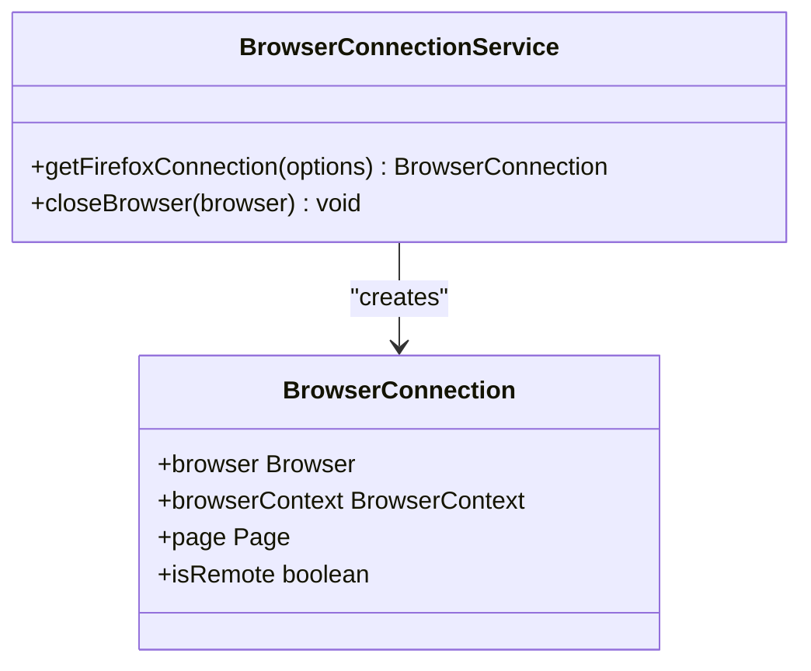
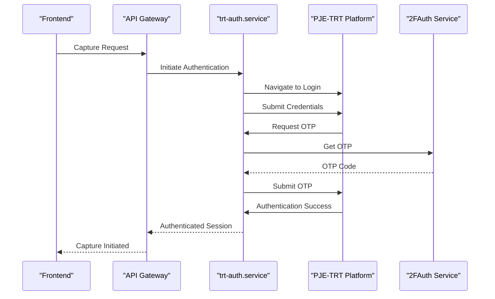
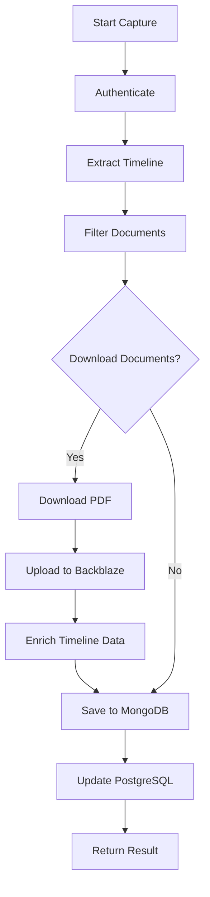
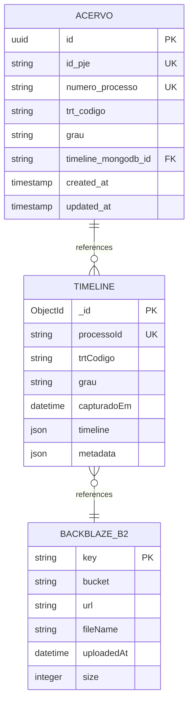
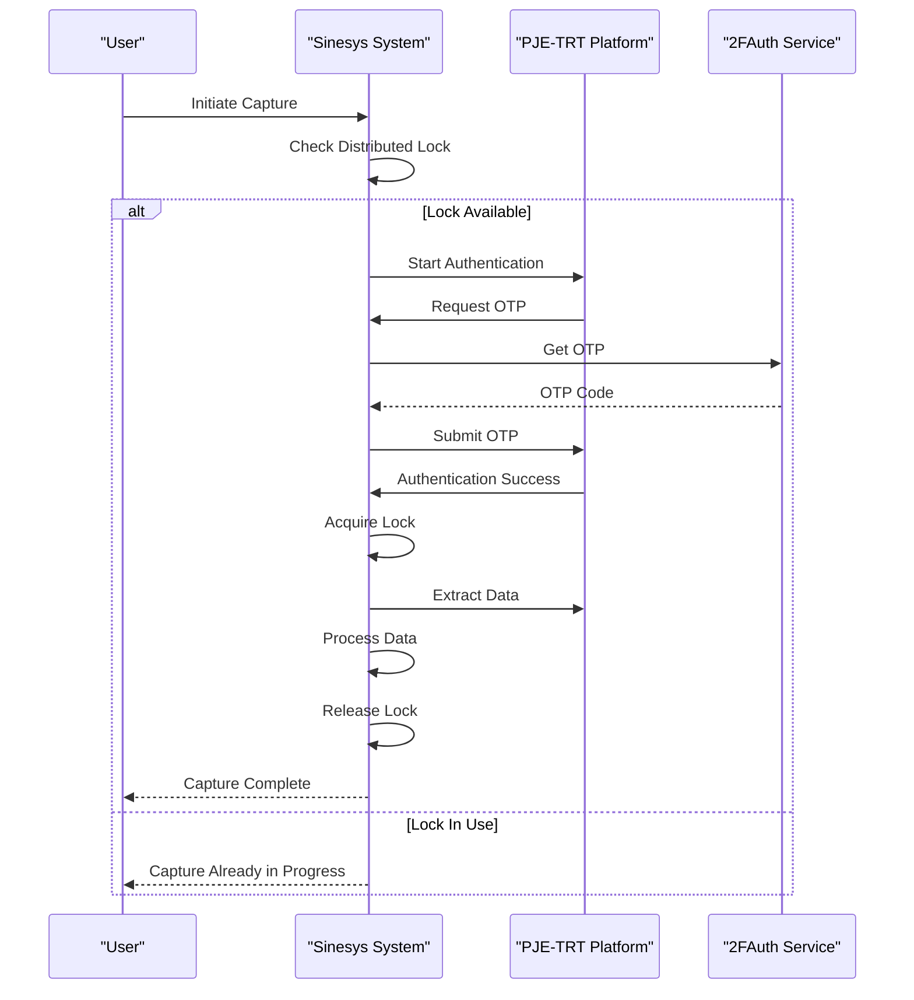

# Data Capture System

<cite>
**Referenced Files in This Document**   
- [trt-auth.service.ts](file://backend/captura/services/trt/trt-auth.service.ts)
- [timeline-capture.service.ts](file://backend/captura/services/timeline/timeline-capture.service.ts)
- [credential-cache.service.ts](file://backend/captura/credentials/credential-cache.service.ts)
- [distributed-lock.ts](file://backend/utils/locks/distributed-lock.ts)
- [browser-connection.service.ts](file://backend/captura/services/browser/browser-connection.service.ts)
- [route.ts](file://app/api/captura/trt/timeline/route.ts)
- [timeline-persistence.service.ts](file://backend/captura/services/timeline/timeline-persistence.service.ts)
- [client.ts](file://backend/utils/mongodb/client.ts)
</cite>

## Table of Contents
1. [Introduction](#introduction)
2. [System Context and Data Flow](#system-context-and-data-flow)
3. [Core Components](#core-components)
4. [Architecture Overview](#architecture-overview)
5. [Detailed Component Analysis](#detailed-component-analysis)
6. [Persistence and Data Storage](#persistence-and-data-storage)
7. [Security and Authentication](#security-and-authentication)
8. [Error Handling and Recovery](#error-handling-and-recovery)
9. [Scalability and Infrastructure](#scalability-and-infrastructure)
10. [Conclusion](#conclusion)

## Introduction

The Sinesys data capture system is designed to automate the extraction of judicial data from the PJE-TRT (Processo Judicial Eletrônico - Tribunal Regional do Trabalho) platform. This system enables users to capture comprehensive process timelines, including all movements and signed documents, through a sophisticated integration of browser automation, backend services, and distributed data storage. The architecture is built around a robust workflow that begins with user-initiated capture requests and culminates in the persistent storage of enriched judicial data.

The system's primary objective is to streamline the process of data acquisition from judicial systems, eliminating the need for manual intervention while ensuring data integrity and security. By leveraging browser automation technologies like Playwright, the system can navigate the complex authentication mechanisms of the PJE-TRT platform, extract relevant data, and store it in a structured format for further analysis and processing. The integration with the trt-auth.service for authentication and timeline-capture.service for data extraction forms the backbone of this automation process.

This documentation provides a comprehensive overview of the system's architecture, detailing the component interactions, technical decisions, and operational considerations that enable reliable and scalable data capture from judicial systems.

## System Context and Data Flow

The Sinesys data capture system operates through a well-defined sequence of operations that begins with a user request and ends with persistent data storage. The process initiates when a user triggers a capture request through the frontend interface, which then propagates through the system's various layers. The API layer receives the request and validates the necessary parameters, including the tribunal code, process instance, process ID, and attorney identifier. This request then flows to the backend capture services, where the core automation logic resides.

The capture process begins with authentication to the PJE-TRT platform using the trt-auth.service, which handles the complex SSO (Single Sign-On) and two-factor authentication mechanisms. Once authenticated, the system navigates to the target process and extracts the complete timeline, including all movements and documents. The extracted data is then processed, with signed documents being filtered and downloaded as PDFs. These documents are uploaded to a cloud storage service (Backblaze B2), and their metadata is enriched with storage information before being persisted.

The final stage involves storing the complete timeline data in MongoDB for flexible querying and analysis, while maintaining a reference to this data in the primary PostgreSQL database. Throughout this process, the system maintains detailed logs and implements robust error handling mechanisms to ensure data integrity and provide recovery options in case of failures. The entire workflow is designed to be asynchronous, allowing users to continue using the application while the capture process runs in the background.

**Diagram sources**
- [route.ts](file://app/api/captura/trt/timeline/route.ts)
- [timeline-capture.service.ts](file://backend/captura/services/timeline/timeline-capture.service.ts)
- [timeline-persistence.service.ts](file://backend/captura/services/timeline/timeline-persistence.service.ts)

## Core Components

The Sinesys data capture system comprises several core components that work together to achieve automated data extraction from judicial systems. The browser automation layer, built on Playwright, serves as the foundation for interacting with the PJE-TRT platform. This layer is responsible for simulating user interactions, navigating through the judicial system's interface, and extracting data from web pages. The automation is designed to be resilient, with anti-detection measures to prevent the system from being identified as a bot by the target platform.

The backend capture services form the processing core of the system, orchestrating the various stages of data capture. These services handle the authentication process, coordinate data extraction, manage document downloads, and oversee the persistence of captured data. The trt-auth.service specifically manages the authentication workflow, including handling two-factor authentication through integration with the 2FAuth service. The timeline-capture.service coordinates the entire capture process, from authentication to final data storage.

The database persistence layer ensures that captured data is stored reliably and efficiently. The system employs a hybrid storage approach, using PostgreSQL for structured data and references, while leveraging MongoDB for storing the flexible, hierarchical timeline data. This combination allows for efficient querying of process metadata in PostgreSQL while enabling rich, document-based storage of the complete timeline in MongoDB. The persistence layer also manages the relationship between these two databases, ensuring data consistency through proper reference management.

**Section sources**
- [trt-auth.service.ts](file://backend/captura/services/trt/trt-auth.service.ts)
- [timeline-capture.service.ts](file://backend/captura/services/timeline/timeline-capture.service.ts)
- [timeline-persistence.service.ts](file://backend/captura/services/timeline/timeline-persistence.service.ts)

## Architecture Overview

The Sinesys data capture system follows a layered architecture that separates concerns and promotes maintainability. At the foundation is the browser automation layer, which interacts directly with the PJE-TRT web interface. This layer is abstracted through the browser-connection.service, which provides a consistent interface for browser operations regardless of whether the browser is running locally or remotely. The service supports both Firefox local execution for development and remote connection to a browser server for production environments.

Above the automation layer sits the service layer, which contains the business logic for data capture. This layer is organized into specialized services, each responsible for a specific aspect of the capture process. The trt-auth.service handles authentication, the timeline-capture.service orchestrates the capture workflow, and various persistence services manage data storage. These services communicate through well-defined interfaces, promoting loose coupling and enabling independent development and testing.

The data storage layer implements a polyglot persistence strategy, utilizing different database technologies for different purposes. PostgreSQL serves as the primary relational database for structured data and user information, while MongoDB provides flexible document storage for the hierarchical timeline data. The system also integrates with cloud storage (Backblaze B2) for binary document storage, ensuring that large PDF files do not impact the performance of the primary databases.

**Diagram sources**
- [browser-connection.service.ts](file://backend/captura/services/browser/browser-connection.service.ts)
- [trt-auth.service.ts](file://backend/captura/services/trt/trt-auth.service.ts)
- [timeline-capture.service.ts](file://backend/captura/services/timeline/timeline-capture.service.ts)
- [timeline-persistence.service.ts](file://backend/captura/services/timeline/timeline-persistence.service.ts)

## Detailed Component Analysis

### Browser Automation Layer

The browser automation layer is implemented using Playwright, providing a robust foundation for interacting with the PJE-TRT platform. The browser-connection.service manages the lifecycle of browser instances, supporting both local Firefox execution and remote connection to a browser server. This flexibility allows for different deployment strategies, with local execution suitable for development and remote connection preferred for production environments where resource isolation is important.

The automation layer includes sophisticated anti-detection measures to prevent the system from being identified as a bot. These measures include modifying browser properties such as the navigator.webdriver flag, plugins array, and languages property to mimic a real user environment. The system also implements realistic delays between actions and handles network instability through retry mechanisms, ensuring reliable operation even under challenging network conditions.

**Diagram sources**
- [browser-connection.service.ts](file://backend/captura/services/browser/browser-connection.service.ts)

### Authentication Service

The trt-auth.service implements a comprehensive authentication workflow for accessing the PJE-TRT platform. The service handles the complete SSO (Single Sign-On) process, including navigating to the login page, submitting credentials, and processing two-factor authentication. The authentication flow is designed to be resilient, with retry mechanisms for handling network errors and automated detection of authentication challenges.

Two-factor authentication is managed through integration with the 2FAuth service, which provides time-based one-time passwords (TOTP) for secure authentication. The service implements a fallback mechanism where it attempts to use the current OTP and, if rejected, automatically tries the next OTP in sequence. This ensures successful authentication even if there is a slight timing mismatch between the generated code and the validation window.

**Diagram sources**
- [trt-auth.service.ts](file://backend/captura/services/trt/trt-auth.service.ts)

### Timeline Capture Service

The timeline-capture.service orchestrates the complete process of extracting timeline data from the PJE-TRT platform. The service follows a structured workflow that begins with authentication and proceeds through data extraction, document processing, and persistence. The capture process is designed to be idempotent, allowing for safe retries in case of failures without duplicating data.

Document handling is a critical aspect of the timeline capture process. The service filters documents based on configurable criteria, such as whether they are signed and non-confidential. For each document that meets the criteria, the service downloads the PDF, uploads it to cloud storage, and enriches the timeline data with storage metadata. This ensures that the complete document chain is preserved while maintaining efficient access to the binary content.

**Diagram sources**
- [timeline-capture.service.ts](file://backend/captura/services/timeline/timeline-capture.service.ts)

## Persistence and Data Storage

The Sinesys data capture system employs a sophisticated persistence strategy that leverages multiple storage technologies to optimize performance and data integrity. The primary relational database, PostgreSQL, stores structured data such as user information, process metadata, and capture logs. This database serves as the system of record for all structured information and provides ACID guarantees for transactional operations.

For the hierarchical timeline data, the system uses MongoDB as a document database. This choice enables flexible storage of the complex, nested structure of process timelines, including movements, documents, and their relationships. The timeline-persistence.service manages the interaction with MongoDB, handling both the creation of new timeline documents and the updating of existing ones. The service implements upsert operations to ensure that timeline data is either created or updated atomically.

The system also integrates with Backblaze B2 for storing binary document content. This cloud storage solution provides scalable and cost-effective storage for PDF documents extracted during the capture process. Each document is uploaded with metadata that includes the process number and document ID, enabling efficient retrieval. The timeline data in MongoDB is enriched with references to these stored documents, creating a complete chain of custody for all captured data.

**Diagram sources**
- [timeline-persistence.service.ts](file://backend/captura/services/timeline/timeline-persistence.service.ts)
- [client.ts](file://backend/utils/mongodb/client.ts)

## Security and Authentication

The Sinesys data capture system implements a comprehensive security framework to protect sensitive judicial data and ensure secure access to the PJE-TRT platform. Credential management is a critical aspect of this framework, with the system employing encrypted storage for all authentication credentials. The credential-cache.service implements an in-memory cache with a 5-minute TTL (Time To Live) to minimize database queries while ensuring that credentials are not stored in memory longer than necessary.

Two-factor authentication is integrated throughout the system, with the trt-auth.service coordinating the retrieval of time-based one-time passwords (TOTP) from the 2FAuth service. This integration ensures that all access to the PJE-TRT platform complies with the security requirements of the judicial system. The authentication process includes automated retry mechanisms for handling OTP validation failures, improving reliability while maintaining security.

The system also implements distributed locking through the distributed-lock.ts module to prevent concurrent captures for the same process. This ensures data consistency and prevents race conditions that could lead to incomplete or corrupted data. The locking mechanism uses PostgreSQL advisory locks as a fallback, providing reliability even in distributed environments.

**Diagram sources**
- [trt-auth.service.ts](file://backend/captura/services/trt/trt-auth.service.ts)
- [credential-cache.service.ts](file://backend/captura/credentials/credential-cache.service.ts)
- [distributed-lock.ts](file://backend/utils/locks/distributed-lock.ts)

## Error Handling and Recovery

The Sinesys data capture system incorporates robust error handling and recovery mechanisms to ensure data integrity and system reliability. The capture process is designed to be resilient, with comprehensive logging at each stage to facilitate debugging and monitoring. The system captures detailed information about each operation, including timestamps, parameters, and outcomes, enabling thorough analysis of both successful and failed captures.

When errors occur during the capture process, the system implements a structured recovery strategy. The timeline-capture.service includes retry mechanisms for transient failures, such as network timeouts or temporary unavailability of the PJE-TRT platform. For more persistent errors, the system provides detailed error information that can be used to diagnose and resolve issues. The error handling is designed to be granular, allowing the system to continue processing even if individual documents cannot be downloaded.

The system also implements a comprehensive logging framework that captures both operational metrics and diagnostic information. This logging infrastructure supports correlation IDs to trace requests across different components and services, enabling end-to-end visibility into the capture process. The logs are structured to support automated analysis and alerting, allowing for proactive identification and resolution of issues.

**Section sources**
- [timeline-capture.service.ts](file://backend/captura/services/timeline/timeline-capture.service.ts)
- [timeline-persistence.service.ts](file://backend/captura/services/timeline/timeline-persistence.service.ts)

## Scalability and Infrastructure

The Sinesys data capture system is designed with scalability in mind, supporting both vertical and horizontal scaling strategies to handle increasing workloads. The architecture supports distributed deployment, with browser instances potentially running on separate servers from the application logic. This separation allows for independent scaling of compute resources based on the specific demands of browser automation versus application processing.

The system's infrastructure requirements include sufficient memory and CPU resources to support multiple concurrent browser instances, as well as reliable network connectivity to the PJE-TRT platform. The browser automation layer can be configured to run in headless mode, reducing resource consumption while maintaining functionality. For production deployments, the system supports connection to remote browser servers, enabling centralized management of browser resources.

Deployment topology options include both monolithic and microservices architectures. In a monolithic deployment, all components run on a single server, which is suitable for smaller workloads. For larger deployments, the system can be deployed in a microservices architecture, with separate services for authentication, data capture, and persistence. This approach enables independent scaling and deployment of different components based on their specific resource requirements.

The system also supports containerized deployment through Docker, facilitating consistent deployment across different environments. The docker-compose configuration files indicate support for both Portainer and Swarm deployments, providing flexibility in orchestration options. This containerization enables easy scaling and management of the system in cloud environments.

**Section sources**
- [docker-compose.portainer.yml](file://docker-compose.portainer.yml)
- [docker-compose.swarm.yml](file://docker-compose.swarm.yml)
- [Dockerfile](file://Dockerfile)

## Conclusion

The Sinesys data capture system represents a sophisticated integration of browser automation, backend services, and distributed data storage to automate the extraction of judicial data from the PJE-TRT platform. The system's architecture is designed to be robust, secure, and scalable, with careful attention to detail in each component and their interactions. By leveraging modern technologies like Playwright for browser automation and MongoDB for flexible data storage, the system achieves a balance between reliability and performance.

The implementation of key technical decisions, such as credential caching, distributed locking, and hybrid persistence, demonstrates a thoughtful approach to solving the challenges of automated data capture from complex web applications. These decisions enable the system to handle concurrent operations efficiently while maintaining data integrity and security. The comprehensive error handling and recovery mechanisms ensure that the system can operate reliably even in the face of network instability or platform changes.

Looking forward, the system's modular architecture provides a solid foundation for future enhancements, such as support for additional judicial platforms, improved document processing capabilities, and enhanced analytics features. The documented integration points and clear component boundaries make it well-positioned for continued development and expansion to meet evolving requirements in the legal technology domain.