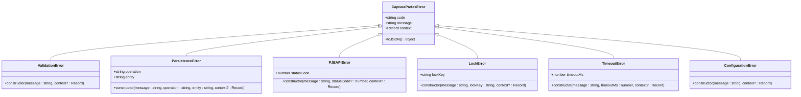
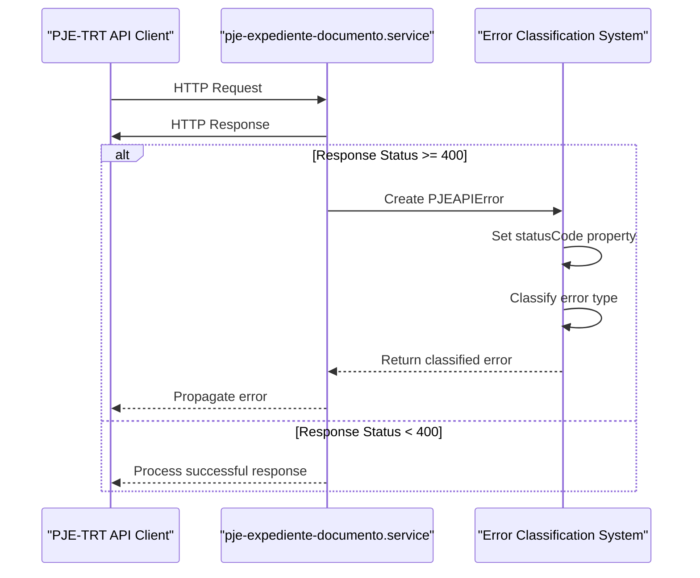
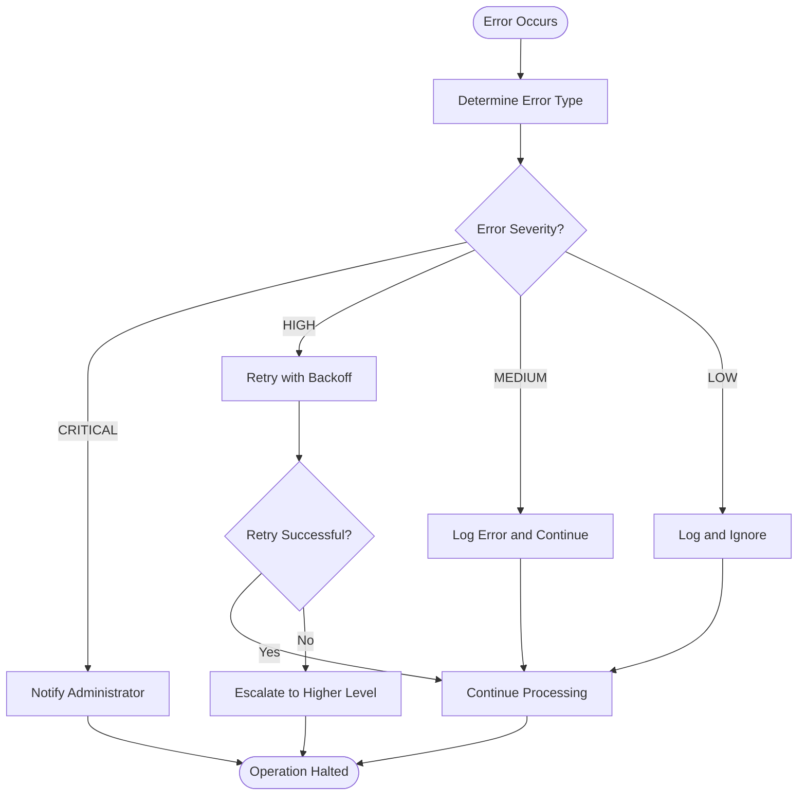

# Error Classification

<cite>
**Referenced Files in This Document**   
- [types.ts](file://backend/types/pje-trt/types.ts)
- [errors.ts](file://backend/captura/services/partes/errors.ts)
- [types.ts](file://backend/captura/services/partes/types.ts)
- [types.ts](file://backend/captura/services/recovery/types.ts)
- [captura-recovery.service.ts](file://backend/captura/services/recovery/captura-recovery.service.ts)
- [pje-expediente-documento.service.ts](file://backend/captura/services/pje/pje-expediente-documento.service.ts)
- [captura-log.service.ts](file://backend/captura/services/captura-log.service.ts)
</cite>

## Table of Contents
1. [Introduction](#introduction)
2. [Error Classification Model](#error-classification-model)
3. [Error Type Definitions](#error-type-definitions)
4. [Error Severity Levels](#error-severity-levels)
5. [HTTP Status Code Mapping](#http-status-code-mapping)
6. [Error Matching Patterns](#error-matching-patterns)
7. [Recovery Strategy Implementation](#recovery-strategy-implementation)
8. [Relationships with Other Components](#relationships-with-other-components)
9. [Handling Ambiguous Error Responses](#handling-ambiguous-error-responses)
10. [Conclusion](#conclusion)

## Introduction
The Sinesys data capture system implements a comprehensive error classification framework designed to handle various error scenarios encountered during data retrieval from PJE-TRT APIs. This documentation provides a detailed analysis of the error categorization model, focusing on the implementation details of error types, severity levels, and recovery strategies. The system is designed to ensure robust error handling, facilitate effective troubleshooting, and enable appropriate recovery actions based on the nature and severity of errors encountered during data capture operations.

**Section sources**
- [types.ts](file://backend/types/pje-trt/types.ts)
- [errors.ts](file://backend/captura/services/partes/errors.ts)

## Error Classification Model
The error classification system in Sinesys is built around a hierarchical structure of error types and categories, designed to provide granular error handling and appropriate recovery strategies. The model is implemented through a combination of TypeScript interfaces and custom error classes that define the structure and behavior of different error types.

The core of the error classification model is defined in the `CapturaPartesError` class, which serves as the base class for all specific error types in the system. This base class provides a standardized structure for error objects, including error codes, messages, and contextual information. The inheritance hierarchy allows for specialized error handling while maintaining a consistent interface across different error types.

**Diagram sources **
- [errors.ts](file://backend/captura/services/partes/errors.ts)

**Section sources**
- [errors.ts](file://backend/captura/services/partes/errors.ts)
- [types.ts](file://backend/captura/services/partes/types.ts)

## Error Type Definitions
The error classification system defines several specific error types that correspond to different failure scenarios encountered during data capture operations. Each error type is implemented as a class that extends the base `CapturaPartesError` class, providing specialized properties and constructors for specific error scenarios.

The primary error types defined in the system include:

- **ValidationError**: Represents errors related to data validation, such as invalid input data or malformed responses from external APIs.
- **PersistenceError**: Indicates failures during database operations, including insert, update, delete, or upsert operations on various entities.
- **PJEAPIError**: Represents errors encountered when communicating with the PJE-TRT API, including HTTP status code errors and API-specific error responses.
- **LockError**: Indicates failures in acquiring distributed locks, which are used to prevent concurrent access to shared resources.
- **TimeoutError**: Represents operation timeouts, typically occurring when an operation exceeds its allowed execution time.
- **ConfigurationError**: Indicates issues with system configuration, such as missing or invalid configuration values.

Each error type includes specific properties that provide additional context for the error. For example, the `PersistenceError` class includes properties for the operation type (insert, update, delete, upsert) and the entity type (cliente, parte_contraria, terceiro, representante, endereco, vinculo), which helps in identifying the specific database operation and entity that failed.

The system also includes utility functions for error handling, such as the `isCapturaPartesError` type guard function, which allows for safe type checking of error objects, and the `extractErrorInfo` helper function, which extracts standardized error information from any error object, whether it's a custom error or a standard JavaScript Error.

**Section sources**
- [errors.ts](file://backend/captura/services/partes/errors.ts)
- [types.ts](file://backend/captura/services/partes/types.ts)

## Error Severity Levels
The error classification system incorporates a severity level model to prioritize error handling and determine appropriate recovery actions. While the provided code does not explicitly define severity levels as an enumeration, the system implicitly implements a severity hierarchy through the structure and usage of different error types.

The severity levels can be inferred from the nature and impact of different error types:

- **CRITICAL**: Errors that prevent the completion of essential operations, such as `PersistenceError` when saving critical data or `PJEAPIError` with authentication failures (401/403). These errors typically require immediate attention and may halt the entire data capture process.
- **HIGH**: Errors that affect significant portions of functionality but allow partial operation, such as `TimeoutError` or `LockError`. These errors may allow for retry mechanisms or alternative processing paths.
- **MEDIUM**: Errors that affect specific components or operations but do not prevent overall system functionality, such as certain `ValidationError` instances or partial data retrieval failures.
- **LOW**: Errors that have minimal impact on system functionality, such as logging failures or non-critical data validation issues.

The system's error handling strategy takes severity into account when determining recovery actions. For example, critical errors may trigger immediate notification to administrators and halt further processing, while lower severity errors may be logged and allow the system to continue with degraded functionality.

**Section sources**
- [errors.ts](file://backend/captura/services/partes/errors.ts)
- [captura-log.service.ts](file://backend/captura/services/captura-log.service.ts)

## HTTP Status Code Mapping
The error classification system includes mechanisms for mapping HTTP status codes from PJE-TRT API responses to specific error categories. This mapping is implemented through the `PJEAPIError` class, which captures the HTTP status code as part of its properties and uses it to determine the appropriate error classification.

Specific HTTP status code mappings include:

- **401/403 responses**: Mapped to authentication failures, indicating that the request was unauthorized or forbidden. These responses trigger the creation of a `PJEAPIError` with a specific error code indicating authentication issues.
- **429 responses**: Mapped to rate limiting, indicating that the client has exceeded the allowed request rate. These responses are classified as `PJEAPIError` instances with a rate limiting error code.
- **400 responses**: Mapped to validation errors, indicating that the request contained invalid data or parameters. These responses are typically handled by the `ValidationError` class.
- **404 responses**: Mapped to resource not found errors, indicating that the requested resource does not exist. These responses are handled as `PJEAPIError` instances with a resource not found error code.
- **5xx responses**: Mapped to server errors, indicating issues with the PJE-TRT server. These responses are classified as `PJEAPIError` instances with appropriate server error codes.

The mapping is implemented in the `pje-expediente-documento.service.ts` file, where HTTP responses from the PJE-TRT API are evaluated, and appropriate error objects are created based on the response status. For example, when a non-200 response is received, the system extracts the error text and creates a `PJEAPIError` with the corresponding status code and error message.

**Diagram sources **
- [pje-expediente-documento.service.ts](file://backend/captura/services/pje/pje-expediente-documento.service.ts)
- [errors.ts](file://backend/captura/services/partes/errors.ts)

**Section sources**
- [pje-expediente-documento.service.ts](file://backend/captura/services/pje/pje-expediente-documento.service.ts)
- [errors.ts](file://backend/captura/services/partes/errors.ts)

## Error Matching Patterns
The error classification system employs pattern matching to identify and categorize errors based on specific characteristics of error responses. This approach allows for more nuanced error handling by examining not just HTTP status codes but also response content and context.

Key error matching patterns include:

- **Status code patterns**: The system matches HTTP status codes to broad error categories (e.g., 4xx for client errors, 5xx for server errors).
- **Response content patterns**: The system examines response bodies for specific error messages or patterns that indicate particular error types.
- **Contextual patterns**: The system considers the context of the operation, such as the type of entity being processed or the specific API endpoint being accessed.

The pattern matching is implemented through a combination of conditional logic and error type constructors. For example, in the `downloadAndUploadDocumento` function, the system checks if the document type is 'PDF' and throws a specific error if it's not, demonstrating a content-based pattern match.

The system also supports priority-based matching, where certain error patterns take precedence over others. This is particularly important when dealing with ambiguous error responses that could match multiple categories. The priority is typically determined by the severity of the error, with more critical errors taking precedence in the matching process.

**Section sources**
- [pje-expediente-documento.service.ts](file://backend/captura/services/pje/pje-expediente-documento.service.ts)
- [errors.ts](file://backend/captura/services/partes/errors.ts)

## Recovery Strategy Implementation
The error classification system is closely integrated with recovery strategies that determine appropriate actions based on the type and severity of errors encountered. The recovery strategy is implemented through a combination of error-specific handling and general recovery mechanisms.

Key aspects of the recovery strategy include:

- **Error-specific recovery**: Different error types trigger specific recovery actions. For example, `TimeoutError` might trigger a retry with exponential backoff, while `PersistenceError` might trigger a fallback to an alternative storage mechanism.
- **Logging and monitoring**: All errors are logged with detailed context information, enabling post-mortem analysis and system improvement.
- **User notification**: Critical errors trigger notifications to administrators or users, depending on the severity and impact.
- **Graceful degradation**: The system attempts to continue operation with reduced functionality when possible, rather than failing completely.

The recovery strategy is implemented in various service files, such as `captura-recovery.service.ts`, which provides functions for listing, searching, and analyzing capture logs for recovery purposes. The service includes functions for counting logs by status, obtaining statistics by TRT, and verifying payload availability for reprocessing.

**Diagram sources **
- [captura-recovery.service.ts](file://backend/captura/services/recovery/captura-recovery.service.ts)
- [errors.ts](file://backend/captura/services/partes/errors.ts)

**Section sources**
- [captura-recovery.service.ts](file://backend/captura/services/recovery/captura-recovery.service.ts)
- [errors.ts](file://backend/captura/services/partes/errors.ts)

## Relationships with Other Components
The error classification system is integrated with several other components in the Sinesys architecture, forming a cohesive error handling and recovery framework.

Key relationships include:

- **Capture Log System**: The error classification system works closely with the capture log system to record detailed information about errors. The `captura-log.service.ts` file provides functions for creating and updating capture logs, including recording errors and their context.
- **Recovery Execution Service**: The system provides data and context to the recovery execution service, enabling targeted recovery operations based on the specific error type and context.
- **Data Persistence Layer**: The error classification system interacts with the data persistence layer to handle database operation errors and implement appropriate recovery strategies.
- **External API Clients**: The system handles errors from external API clients, such as the PJE-TRT API, and translates them into a consistent error format for internal processing.

The integration with the capture log system is particularly important, as it enables long-term analysis of error patterns and system reliability. The system records error information in both the PostgreSQL database and MongoDB, providing redundancy and different access patterns for error analysis.

**Section sources**
- [captura-log.service.ts](file://backend/captura/services/captura-log.service.ts)
- [captura-recovery.service.ts](file://backend/captura/services/recovery/captura-recovery.service.ts)
- [pje-expediente-documento.service.ts](file://backend/captura/services/pje/pje-expediente-documento.service.ts)

## Handling Ambiguous Error Responses
The error classification system addresses the challenge of ambiguous error responses through several mechanisms:

- **Priority-based matching**: When an error response could match multiple categories, the system uses a priority system to determine the most appropriate classification. This priority is typically based on error severity, with more critical errors taking precedence.
- **Context-aware classification**: The system considers the context of the operation, such as the specific API endpoint, the type of data being processed, and the sequence of operations leading to the error.
- **Fallback mechanisms**: When primary classification methods fail, the system employs fallback mechanisms to ensure that errors are still categorized and handled appropriately.

For example, when dealing with a 403 response from the PJE-TRT API, the system might first check if it's a rate limiting issue (429) before classifying it as a general authorization error. This context-aware approach ensures more accurate error classification and appropriate recovery actions.

The system also includes mechanisms for handling errors that occur during error handling itself, preventing cascading failures and ensuring system stability even in the face of unexpected error scenarios.

**Section sources**
- [errors.ts](file://backend/captura/services/partes/errors.ts)
- [pje-expediente-documento.service.ts](file://backend/captura/services/pje/pje-expediente-documento.service.ts)

## Conclusion
The error classification system in Sinesys provides a robust framework for handling various error scenarios encountered during data capture operations. By implementing a hierarchical structure of error types, integrating with logging and recovery systems, and employing sophisticated pattern matching and context-aware classification, the system ensures reliable operation and effective error handling. The design balances the need for detailed error information with the practical requirements of system stability and user experience, making it a critical component of the overall Sinesys architecture.