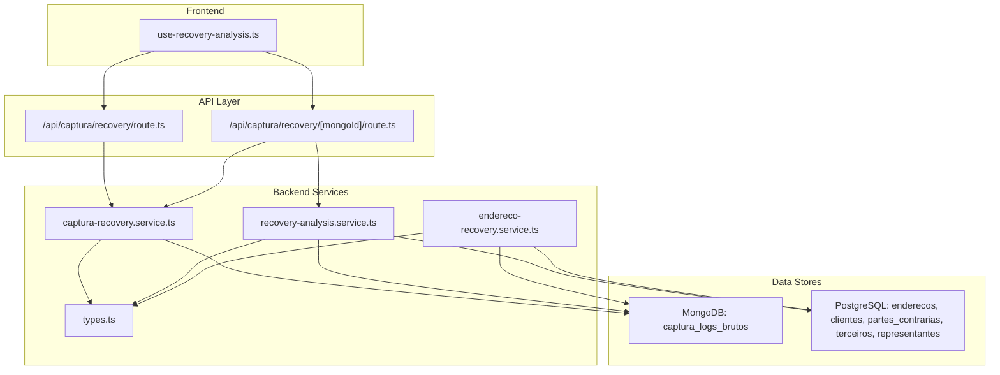
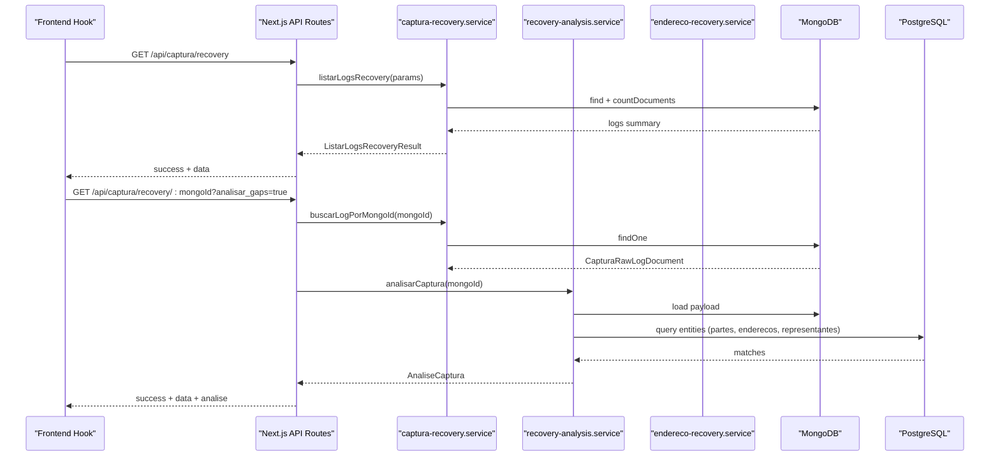
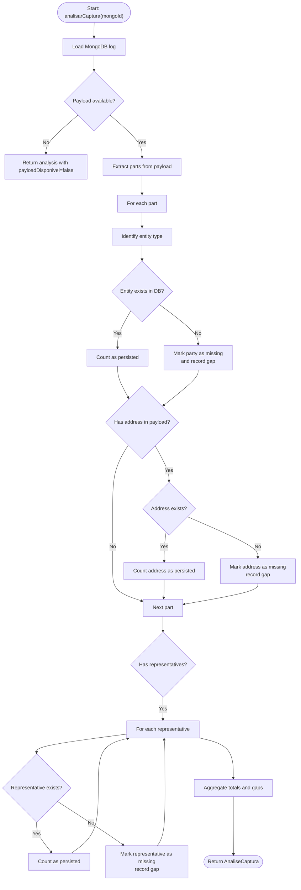
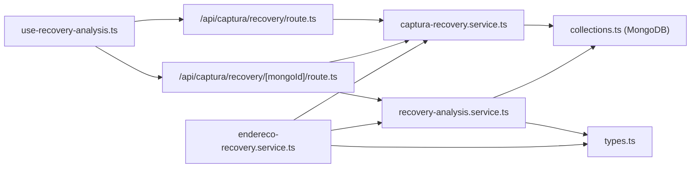

# Error Detection

<cite>
**Referenced Files in This Document**
- [recovery-analysis.service.ts](file://backend/captura/services/recovery/recovery-analysis.service.ts)
- [types.ts](file://backend/captura/services/recovery/types.ts)
- [captura-recovery.service.ts](file://backend/captura/services/recovery/captura-recovery.service.ts)
- [collections.ts](file://backend/utils/mongodb/collections.ts)
- [README.md](file://backend/captura/services/recovery/README.md)
- [route.ts](file://app/api/captura/recovery/route.ts)
- [route.ts](file://app/api/captura/recovery/[mongoId]/route.ts)
- [use-recovery-analysis.ts](file://app/_lib/hooks/use-recovery-analysis.ts)
- [endereco-recovery.service.ts](file://backend/captura/services/recovery/endereco-recovery.service.ts)
- [errors.ts](file://backend/captura/services/partes/errors.ts)
- [captura-raw-log.service.ts](file://backend/captura/services/persistence/captura-raw-log.service.ts)
- [twofauth.service.ts](file://backend/api/twofauth.service.ts)
</cite>

## Table of Contents
1. [Introduction](#introduction)
2. [Project Structure](#project-structure)
3. [Core Components](#core-components)
4. [Architecture Overview](#architecture-overview)
5. [Detailed Component Analysis](#detailed-component-analysis)
6. [Dependency Analysis](#dependency-analysis)
7. [Performance Considerations](#performance-considerations)
8. [Troubleshooting Guide](#troubleshooting-guide)
9. [Conclusion](#conclusion)

## Introduction
This document explains the error detection and recovery system for Sinesys data capture. It focuses on the recovery-analysis.service and related components that analyze failed or partial capture attempts, classify gaps between captured payloads and persisted data, and support recovery workflows. The system distinguishes between missing elements (gaps) such as parties, addresses, and representatives, and does not directly detect authentication failures, network timeouts, parsing errors, or rate-limiting responses from external APIs. Instead, it relies on metadata stored in MongoDB logs (captura_logs_brutos) to identify what was captured and what is missing in PostgreSQL, enabling targeted re-processing.

## Project Structure
The error detection and recovery system spans backend services, API routes, and frontend hooks:
- Backend recovery services: recovery-analysis.service.ts, captura-recovery.service.ts, endereco-recovery.service.ts, types.ts
- MongoDB collections and indices: collections.ts
- API routes: app/api/captura/recovery/route.ts, app/api/captura/recovery/[mongoId]/route.ts
- Frontend hook: app/_lib/hooks/use-recovery-analysis.ts
- Supporting error types: backend/captura/services/partes/errors.ts
- Raw log persistence: backend/captura/services/persistence/captura-raw-log.service.ts
- External API error handling example: backend/api/twofauth.service.ts

**Diagram sources**
- [route.ts](file://app/api/captura/recovery/route.ts#L1-L241)
- [route.ts](file://app/api/captura/recovery/[mongoId]/route.ts#L1-L217)
- [captura-recovery.service.ts](file://backend/captura/services/recovery/captura-recovery.service.ts#L1-L395)
- [recovery-analysis.service.ts](file://backend/captura/services/recovery/recovery-analysis.service.ts#L1-L800)
- [endereco-recovery.service.ts](file://backend/captura/services/recovery/endereco-recovery.service.ts#L1-L595)
- [types.ts](file://backend/captura/services/recovery/types.ts#L1-L571)
- [collections.ts](file://backend/utils/mongodb/collections.ts#L1-L120)

**Section sources**
- [route.ts](file://app/api/captura/recovery/route.ts#L1-L241)
- [route.ts](file://app/api/captura/recovery/[mongoId]/route.ts#L1-L217)
- [captura-recovery.service.ts](file://backend/captura/services/recovery/captura-recovery.service.ts#L1-L395)
- [recovery-analysis.service.ts](file://backend/captura/services/recovery/recovery-analysis.service.ts#L1-L800)
- [endereco-recovery.service.ts](file://backend/captura/services/recovery/endereco-recovery.service.ts#L1-L595)
- [types.ts](file://backend/captura/services/recovery/types.ts#L1-L571)
- [collections.ts](file://backend/utils/mongodb/collections.ts#L1-L120)

## Core Components
- recovery-analysis.service.ts: Extracts and compares payload data against PostgreSQL to identify gaps (missing addresses, parties, representatives). It also performs aggregated gap analysis across multiple logs.
- captura-recovery.service.ts: Lists and retrieves MongoDB logs, counts statuses, and computes statistics by TRT.
- endereco-recovery.service.ts: Re-processes and persists missing addresses using MongoDB payloads and PostgreSQL upserts.
- types.ts: Defines domain models for recovery analysis, element statuses, and result structures.
- collections.ts: Provides MongoDB collection access and creates indices to optimize queries.

Key capabilities:
- Gap identification: Compares payload entities with persisted entities and records missing elements.
- Aggregated analytics: Computes totals, distributions, and top processes with gaps.
- Re-processing: Supports targeted re-persistence of addresses with retry and conflict handling.

**Section sources**
- [recovery-analysis.service.ts](file://backend/captura/services/recovery/recovery-analysis.service.ts#L1-L800)
- [captura-recovery.service.ts](file://backend/captura/services/recovery/captura-recovery.service.ts#L1-L395)
- [endereco-recovery.service.ts](file://backend/captura/services/recovery/endereco-recovery.service.ts#L1-L595)
- [types.ts](file://backend/captura/services/recovery/types.ts#L1-L571)
- [collections.ts](file://backend/utils/mongodb/collections.ts#L1-L120)

## Architecture Overview
The system operates on MongoDB logs of raw captures and PostgreSQL persistence. The API routes expose listing and detail endpoints, while the backend services orchestrate analysis and recovery.

**Diagram sources**
- [route.ts](file://app/api/captura/recovery/route.ts#L1-L241)
- [route.ts](file://app/api/captura/recovery/[mongoId]/route.ts#L1-L217)
- [captura-recovery.service.ts](file://backend/captura/services/recovery/captura-recovery.service.ts#L1-L395)
- [recovery-analysis.service.ts](file://backend/captura/services/recovery/recovery-analysis.service.ts#L1-L800)
- [collections.ts](file://backend/utils/mongodb/collections.ts#L1-L120)

## Detailed Component Analysis

### Recovery Analysis Service
The recovery-analysis.service identifies gaps by:
- Loading a MongoDB log and extracting payload parts.
- Determining entity types (cliente, parte_contraria, terceiro) based on payload fields.
- Checking PostgreSQL for existing entities and addresses.
- Recording gaps for missing addresses, parties, and representatives.

**Diagram sources**
- [recovery-analysis.service.ts](file://backend/captura/services/recovery/recovery-analysis.service.ts#L1-L800)
- [types.ts](file://backend/captura/services/recovery/types.ts#L1-L571)

**Section sources**
- [recovery-analysis.service.ts](file://backend/captura/services/recovery/recovery-analysis.service.ts#L1-L800)
- [types.ts](file://backend/captura/services/recovery/types.ts#L1-L571)

### Domain Model for Error Classification and Severity
The system does not classify external API errors (authentication failures, network timeouts, parsing errors, rate limits). Instead, it classifies gaps as missing elements:
- ElementoRecuperavel.statusPersistencia: 'pendente' | 'existente' | 'faltando' | 'erro'
- GapsAnalise: lists of missing elements grouped by type
- AnaliseCaptura: aggregates totals and gaps for a given log

These types enable downstream recovery decisions (e.g., only re-process missing addresses).

**Section sources**
- [types.ts](file://backend/captura/services/recovery/types.ts#L1-L571)

### Interfaces Used for Error Detection and Recovery
- Recovery analysis endpoints:
  - GET /api/captura/recovery: list logs with filters and optional statistics
  - GET /api/captura/recovery/:mongoId: detail log with optional gap analysis and payload inclusion
- Frontend hook:
  - useRecoveryAnalysis: fetches and exposes log, analysis, and payload availability

These interfaces trigger recovery-analysis.service and optionally endereco-recovery.service.

**Section sources**
- [route.ts](file://app/api/captura/recovery/route.ts#L1-L241)
- [route.ts](file://app/api/captura/recovery/[mongoId]/route.ts#L1-L217)
- [use-recovery-analysis.ts](file://app/_lib/hooks/use-recovery-analysis.ts#L1-L92)

### Usage Patterns for Triggering Recovery Workflows
- Identify logs with gaps:
  - Call GET /api/captura/recovery with filters and include statistics
  - Use the returned logs to target specific mongoIds
- Analyze a specific log:
  - Call GET /api/captura/recovery/:mongoId?analisar_gaps=true
  - Inspect gaps and payload availability
- Re-process missing addresses:
  - Use endereco-recovery.service to upsert addresses with retry and conflict checks
  - Optionally force updates or limit to gaps only

**Section sources**
- [route.ts](file://app/api/captura/recovery/route.ts#L1-L241)
- [route.ts](file://app/api/captura/recovery/[mongoId]/route.ts#L1-L217)
- [endereco-recovery.service.ts](file://backend/captura/services/recovery/endereco-recovery.service.ts#L1-L595)

### Concrete Examples from the Codebase
- Gap identification:
  - Party missing: recorded in gaps.partesFaltantes with statusPersistencia 'faltando'
  - Address missing: recorded in gaps.enderecosFaltantes with contextual entity info
  - Representative missing: recorded in gaps.representantesFaltantes
- Aggregated analysis:
  - analisarGapsAgregado computes top processes with gaps and distribution by TRT
- Re-processing:
  - reprocessarEndereco uses upsert with retry and links address to entity

**Section sources**
- [recovery-analysis.service.ts](file://backend/captura/services/recovery/recovery-analysis.service.ts#L1-L800)
- [endereco-recovery.service.ts](file://backend/captura/services/recovery/endereco-recovery.service.ts#L1-L595)
- [README.md](file://backend/captura/services/recovery/README.md#L1-L387)

### Configuration Options and Sensitivity Tuning
- Query parameters:
  - /api/captura/recovery: pagina, limite (max 100), captura_log_id, tipo_captura, status, trt, grau, advogado_id, data_inicio, data_fim, incluir_estatisticas
  - /api/captura/recovery/:mongoId: incluir_payload, analisar_gaps
- Internal thresholds and limits:
  - Maximum 1000 documents scanned for aggregated gap analysis
  - Default page size 50 for listing logs
  - Retry configuration for re-processing addresses (maxAttempts, baseDelay, maxDelay)

**Section sources**
- [route.ts](file://app/api/captura/recovery/route.ts#L1-L241)
- [route.ts](file://app/api/captura/recovery/[mongoId]/route.ts#L1-L217)
- [endereco-recovery.service.ts](file://backend/captura/services/recovery/endereco-recovery.service.ts#L1-L595)
- [captura-recovery.service.ts](file://backend/captura/services/recovery/captura-recovery.service.ts#L1-L395)

### Return Values and Results
- Recovery analysis result:
  - AnaliseCaptura includes mongoId, capturaLogId, tipoCaptura, dataCaptura, status, processo, totais, gaps, payloadDisponivel, erroOriginal
- Aggregated analysis result:
  - AnaliseAgregadaResult includes totalLogs, logsComGaps, resumoGaps, topProcessosComGaps, distribuicaoPorTrt
- Re-processing result:
  - ReprocessarResult includes totalDocumentos, totalElementos, totalSucessos, totalErros, documentos, duracaoMs

**Section sources**
- [types.ts](file://backend/captura/services/recovery/types.ts#L1-L571)
- [recovery-analysis.service.ts](file://backend/captura/services/recovery/recovery-analysis.service.ts#L1-L800)
- [endereco-recovery.service.ts](file://backend/captura/services/recovery/endereco-recovery.service.ts#L1-L595)

### Relationships with Other Components
- MongoDB collections:
  - captura_logs_brutos stores raw capture logs and payloads
  - Indices improve filtering by status, tribunal, and time
- PostgreSQL entities:
  - enderecos, clientes, partes_contrarias, terceiros, representantes are queried during analysis and re-processing
- Capture raw log persistence:
  - captura-raw-log.service writes raw logs with sanitized payloads and tracks status

**Section sources**
- [collections.ts](file://backend/utils/mongodb/collections.ts#L1-L120)
- [captura-raw-log.service.ts](file://backend/captura/services/persistence/captura-raw-log.service.ts#L1-L162)
- [recovery-analysis.service.ts](file://backend/captura/services/recovery/recovery-analysis.service.ts#L1-L800)

## Dependency Analysis

**Diagram sources**
- [use-recovery-analysis.ts](file://app/_lib/hooks/use-recovery-analysis.ts#L1-L92)
- [route.ts](file://app/api/captura/recovery/route.ts#L1-L241)
- [route.ts](file://app/api/captura/recovery/[mongoId]/route.ts#L1-L217)
- [captura-recovery.service.ts](file://backend/captura/services/recovery/captura-recovery.service.ts#L1-L395)
- [recovery-analysis.service.ts](file://backend/captura/services/recovery/recovery-analysis.service.ts#L1-L800)
- [endereco-recovery.service.ts](file://backend/captura/services/recovery/endereco-recovery.service.ts#L1-L595)
- [collections.ts](file://backend/utils/mongodb/collections.ts#L1-L120)
- [types.ts](file://backend/captura/services/recovery/types.ts#L1-L571)

**Section sources**
- [use-recovery-analysis.ts](file://app/_lib/hooks/use-recovery-analysis.ts#L1-L92)
- [route.ts](file://app/api/captura/recovery/route.ts#L1-L241)
- [route.ts](file://app/api/captura/recovery/[mongoId]/route.ts#L1-L217)
- [captura-recovery.service.ts](file://backend/captura/services/recovery/captura-recovery.service.ts#L1-L395)
- [recovery-analysis.service.ts](file://backend/captura/services/recovery/recovery-analysis.service.ts#L1-L800)
- [endereco-recovery.service.ts](file://backend/captura/services/recovery/endereco-recovery.service.ts#L1-L595)
- [collections.ts](file://backend/utils/mongodb/collections.ts#L1-L120)
- [types.ts](file://backend/captura/services/recovery/types.ts#L1-L571)

## Performance Considerations
- Indexes on MongoDB:
  - Status and time-based indices reduce scan costs for listing and filtering
  - Text index on erro enables efficient error-term searches
- Aggregated analysis:
  - Limit scan to 1000 documents to keep performance predictable
- Payload handling:
  - Avoid loading full payloads unless incluir_payload is requested
  - Use projections to minimize transferred data
- Retry and concurrency:
  - Endereco re-processing uses retry with exponential backoff to handle transient DB issues

**Section sources**
- [collections.ts](file://backend/utils/mongodb/collections.ts#L1-L120)
- [recovery-analysis.service.ts](file://backend/captura/services/recovery/recovery-analysis.service.ts#L1-L800)
- [endereco-recovery.service.ts](file://backend/captura/services/recovery/endereco-recovery.service.ts#L1-L595)

## Troubleshooting Guide
Common issues and solutions:
- False positives in gap detection:
  - Ensure entity type identification matches payload fields; verify polo and tipo fields
  - Confirm document cleaning (remove non-digits for CPF/CNPJ) before DB lookup
- Ambiguous error responses from external APIs:
  - The recovery system does not parse external API errors; rely on MongoDB log erro field and payload availability
  - Use incluir_payload to inspect raw responses when available
- Performance overhead of error analysis:
  - Disable payload inclusion when not needed
  - Prefer aggregated analysis for broad insights; use detailed analysis per log only when necessary
- Address not created:
  - Verify entity exists (cliente/parte_contraria/terceiro) before linking address
  - Check for duplicate id_pje conflicts
  - Use reprocessarEnderecoIndividual to target specific addresses

**Section sources**
- [recovery-analysis.service.ts](file://backend/captura/services/recovery/recovery-analysis.service.ts#L1-L800)
- [endereco-recovery.service.ts](file://backend/captura/services/recovery/endereco-recovery.service.ts#L1-L595)
- [README.md](file://backend/captura/services/recovery/README.md#L1-L387)

## Conclusion
The recovery-analysis.service and related components provide a robust mechanism to identify and resolve gaps between captured payloads and persisted data. While it does not directly detect authentication failures, network timeouts, parsing errors, or rate-limiting responses from external APIs, it leverages MongoDB logs and PostgreSQL queries to pinpoint missing elements and drive targeted re-processing. By combining filtered listings, detailed analyses, and controlled re-processing with retries, the system supports efficient recovery workflows with clear diagnostics and performance safeguards.