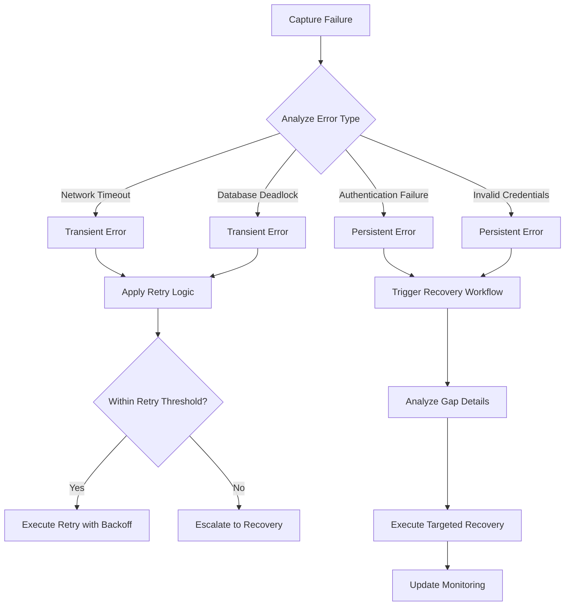
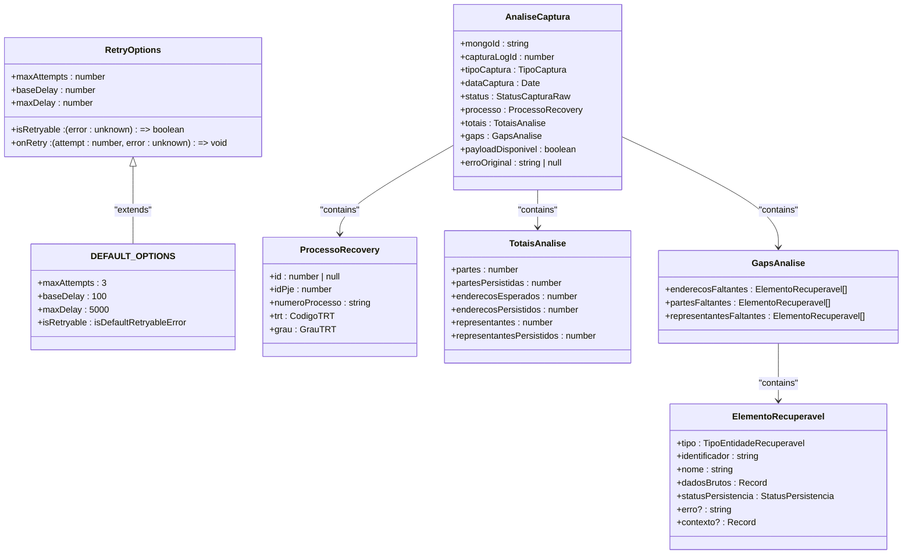
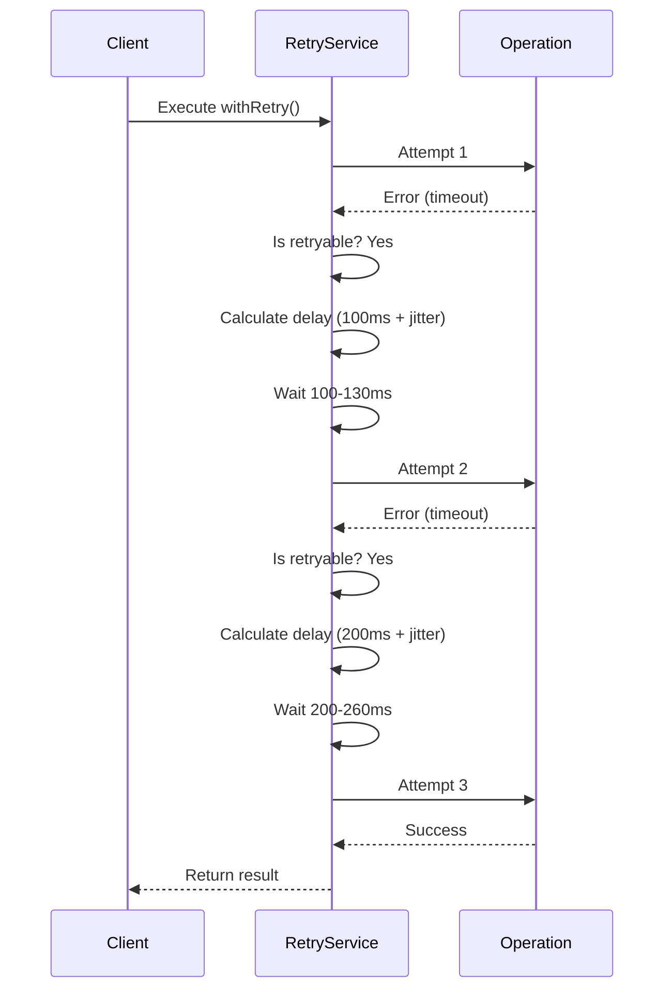
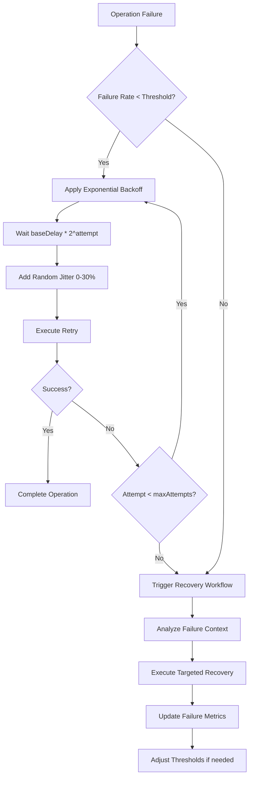
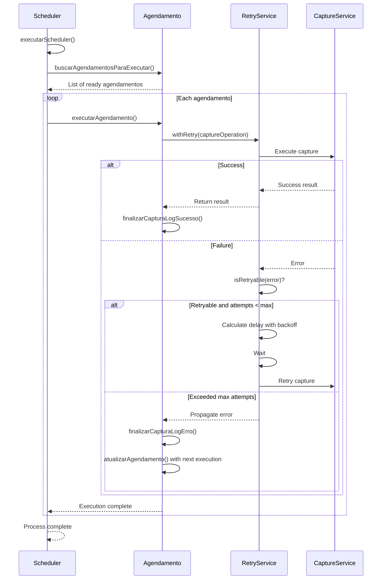
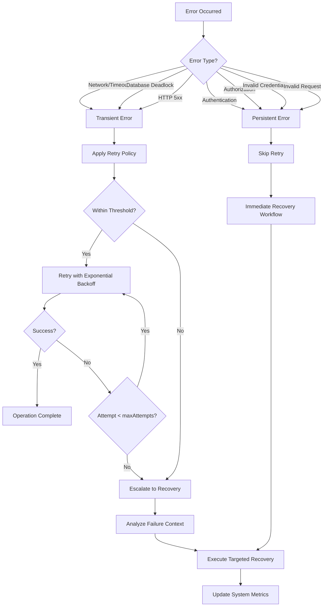
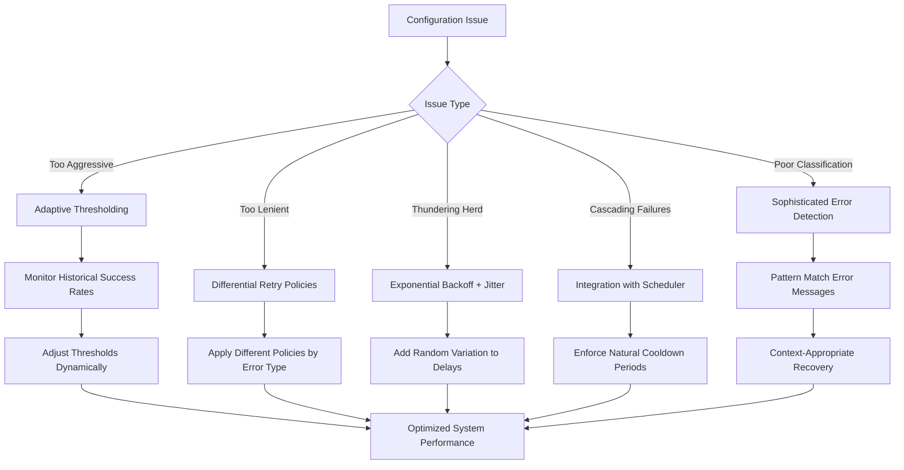

# Error Threshold Configuration

<cite>
**Referenced Files in This Document**   
- [recovery-analysis.service.ts](file://backend/captura/services/recovery/recovery-analysis.service.ts)
- [types.ts](file://backend/captura/services/recovery/types.ts)
- [captura-recovery.service.ts](file://backend/captura/services/recovery/captura-recovery.service.ts)
- [index.ts](file://backend/utils/retry/index.ts)
- [executar-agendamento.service.ts](file://backend/captura/services/scheduler/executar-agendamento.service.ts)
- [agendamento-scheduler.service.ts](file://backend/captura/services/scheduler/agendamento-scheduler.service.ts)
</cite>

## Table of Contents
1. [Introduction](#introduction)
2. [Error Threshold Configuration System](#error-threshold-configuration-system)
3. [Domain Model for Threshold Management](#domain-model-for-threshold-management)
4. [Retry Configuration and Exponential Backoff](#retry-configuration-and-exponential-backoff)
5. [Failure Rate and Cooldown Configuration](#failure-rate-and-cooldown-configuration)
6. [Integration with Capture Scheduler](#integration-with-capture-scheduler)
7. [Error Classification and Criticality Handling](#error-classification-and-criticality-handling)
8. [Common Configuration Issues and Solutions](#common-configuration-issues-and-solutions)
9. [Conclusion](#conclusion)

## Introduction

The Sinesys data capture system implements a sophisticated error threshold configuration system that determines when failures should trigger recovery workflows versus being treated as transient issues. This document provides a comprehensive analysis of the recovery-analysis.service implementation, focusing on how configurable thresholds govern the system's response to different types of errors. The system is designed to balance reliability with efficiency, ensuring that genuine issues are addressed promptly while avoiding unnecessary recovery attempts for transient problems.

The error threshold configuration system is primarily managed through the recovery-analysis.service, which works in conjunction with the retry utility, capture scheduler, and notification system. This integrated approach allows for adaptive responses based on error type, frequency, and criticality, ensuring optimal system performance and data integrity.

**Section sources**
- [recovery-analysis.service.ts](file://backend/captura/services/recovery/recovery-analysis.service.ts#L1-L1163)
- [types.ts](file://backend/captura/services/recovery/types.ts#L1-L571)

## Error Threshold Configuration System

The error threshold configuration system in Sinesys data capture is designed to intelligently determine when failures should trigger recovery workflows versus being treated as transient issues. The core of this system is implemented in the `recovery-analysis.service.ts` file, which analyzes logs of data capture operations stored in MongoDB and identifies gaps (missing elements) by comparing with data persisted in PostgreSQL.

The system uses a multi-layered approach to error analysis, with different thresholds and recovery strategies based on the type and criticality of the error. When a data capture operation fails, the system first determines whether the failure is transient (likely to resolve on retry) or persistent (requiring intervention). This determination is made by analyzing the error type, frequency, and context.

The recovery-analysis.service provides functions to analyze individual capture logs and identify gaps in data persistence. The `analisarCaptura` function takes a MongoDB document ID and returns a complete analysis of the capture, including identified gaps and the original error message. This analysis helps determine whether a recovery workflow should be initiated and what type of recovery is appropriate.

The system also includes aggregated analysis capabilities through the `analisarGapsAgregado` function, which can analyze multiple logs within a specified time period to identify patterns and trends in failures. This allows for adaptive thresholding based on historical success rates and failure patterns across the system.



**Diagram sources**
- [recovery-analysis.service.ts](file://backend/captura/services/recovery/recovery-analysis.service.ts#L37-L110)
- [types.ts](file://backend/captura/services/recovery/types.ts#L148-L169)

**Section sources**
- [recovery-analysis.service.ts](file://backend/captura/services/recovery/recovery-analysis.service.ts#L1-L1163)
- [types.ts](file://backend/captura/services/recovery/types.ts#L1-L571)

## Domain Model for Threshold Management

The domain model for threshold management in the Sinesys data capture system is defined in the `types.ts` file within the recovery service. This model represents the core entities and relationships that govern how thresholds are configured and applied across different error scenarios.

The primary interface for threshold management is `RetryOptions`, which defines the key parameters for controlling retry behavior:



**Diagram sources**
- [types.ts](file://backend/captura/services/recovery/types.ts#L5-L381)
- [index.ts](file://backend/utils/retry/index.ts#L5-L16)

**Section sources**
- [types.ts](file://backend/captura/services/recovery/types.ts#L1-L571)
- [index.ts](file://backend/utils/retry/index.ts#L1-L134)

## Retry Configuration and Exponential Backoff

The retry configuration system in Sinesys implements a robust mechanism for handling transient failures with exponential backoff and jitter. The core implementation is in the `backend/utils/retry/index.ts` file, which provides a `withRetry` function that executes operations with automatic retry logic.

The retry system is configured through the `RetryOptions` interface, which defines the following key parameters:

- **maxAttempts**: Maximum number of retry attempts (including the initial attempt)
- **baseDelay**: Initial delay in milliseconds before the first retry
- **maxDelay**: Maximum delay cap for exponential backoff
- **isRetryable**: Function to determine if an error is retryable
- **onRetry**: Callback executed before each retry attempt

The default configuration values are:
- `maxAttempts`: 3
- `baseDelay`: 100ms
- `maxDelay`: 5000ms (5 seconds)

The system implements exponential backoff with jitter to prevent the "thundering herd" problem. The delay for each retry is calculated as:
```
exponentialDelay = baseDelay * 2^(attempt-1)
jitter = random(0, 0.3 * exponentialDelay)
delay = min(exponentialDelay + jitter, maxDelay)
```

This means the delays follow a pattern like: 100ms, 200-260ms, 400-520ms, etc., up to the maximum delay of 5 seconds.

The `isDefaultRetryableError` function determines which errors are considered retryable. It returns true for:
- Network/timeout errors (includes 'timeout', 'econnrefused', 'enotfound', 'network')
- Database temporary errors (includes 'deadlock', 'lock timeout', 'connection', 'too many connections')
- HTTP 5xx server errors (status codes 500-599)

The system allows for different threshold configurations based on error type and criticality. For example, network timeouts might be configured with 3 retries and exponential backoff, while authentication failures might be configured with only 1 retry since they are unlikely to resolve without credential updates.



**Diagram sources**
- [index.ts](file://backend/utils/retry/index.ts#L5-L134)

**Section sources**
- [index.ts](file://backend/utils/retry/index.ts#L1-L134)

## Failure Rate and Cooldown Configuration

The failure rate and cooldown configuration in the Sinesys data capture system is implemented through a combination of immediate retry logic and scheduled recovery workflows. The system uses the capture scheduler to manage cooldown periods and prevent overwhelming external systems with repeated failed attempts.

The cooldown period is implicitly managed through the scheduler's execution frequency and the retry configuration. When a capture operation fails repeatedly beyond the retry threshold, it is not immediately retried but instead waits for the next scheduled execution. This creates a natural cooldown period that prevents aggressive retry attempts.

The system implements different effective cooldown periods based on error criticality:
- For transient errors (network timeouts, database deadlocks): Short cooldown with exponential backoff retries
- For persistent errors (authentication failures, invalid credentials): Longer cooldown with minimal retries

The `executar-agendamento.service.ts` file shows how the scheduler handles failed operations. When an agendamento (scheduled task) fails, it updates the last execution timestamp but maintains the next scheduled execution based on the periodicity configuration. This ensures that failed tasks are not retried immediately but wait for their next scheduled run, effectively implementing a cooldown period.

The failure rate threshold is determined by the `maxAttempts` parameter in the retry configuration. Once this threshold is exceeded, the system considers the failure persistent and triggers the recovery workflow rather than continuing to retry. This prevents the system from wasting resources on operations that are unlikely to succeed.

The system also includes monitoring and analysis capabilities through the `analisarGapsAgregado` function, which can identify patterns of failures across multiple logs. This allows for adaptive thresholding based on historical success rates, potentially adjusting the retry configuration dynamically based on observed failure patterns.



**Diagram sources**
- [executar-agendamento.service.ts](file://backend/captura/services/scheduler/executar-agendamento.service.ts#L1-L485)
- [index.ts](file://backend/utils/retry/index.ts#L1-L134)

**Section sources**
- [executar-agendamento.service.ts](file://backend/captura/services/scheduler/executar-agendamento.service.ts#L1-L485)
- [index.ts](file://backend/utils/retry/index.ts#L1-L134)

## Integration with Capture Scheduler

The error threshold configuration system is tightly integrated with the capture scheduler to ensure coordinated recovery workflows and prevent system overload. The scheduler, implemented in `agendamento-scheduler.service.ts` and `executar-agendamento.service.ts`, works in conjunction with the retry system to manage the timing and frequency of capture operations.

The scheduler executes periodic checks for scheduled tasks that are ready for execution. When a task is executed, it follows a specific workflow that incorporates the error threshold configuration:

1. The scheduler identifies agendamentos ready for execution
2. For each agendamento, it initiates the capture process
3. If the capture fails, the retry logic is applied according to configured thresholds
4. If retries are exhausted, the failure is logged and the next scheduled execution is maintained

The `executarScheduler` function in `agendamento-scheduler.service.ts` demonstrates this integration. It processes each ready agendamento sequentially, executing the capture operation and handling any errors according to the configured retry policy. If an error occurs during execution, it is logged but does not prevent subsequent agendamentos from being processed.

The integration ensures that failed operations do not immediately consume system resources but instead wait for their next scheduled execution, effectively implementing a cooldown period. This prevents cascading failures and resource exhaustion that could occur with aggressive retry strategies.

The system also maintains detailed logs of each capture operation, which are stored in MongoDB and can be analyzed by the recovery-analysis.service. These logs include the original request, response payload, and any error messages, providing comprehensive context for recovery workflows.



**Diagram sources**
- [agendamento-scheduler.service.ts](file://backend/captura/services/scheduler/agendamento-scheduler.service.ts#L1-L43)
- [executar-agendamento.service.ts](file://backend/captura/services/scheduler/executar-agendamento.service.ts#L1-L485)

**Section sources**
- [agendamento-scheduler.service.ts](file://backend/captura/services/scheduler/agendamento-scheduler.service.ts#L1-L43)
- [executar-agendamento.service.ts](file://backend/captura/services/scheduler/executar-agendamento.service.ts#L1-L485)

## Error Classification and Criticality Handling

The Sinesys data capture system implements sophisticated error classification and criticality handling to apply appropriate recovery strategies based on the nature of the failure. The system distinguishes between transient and persistent errors, applying different threshold configurations accordingly.

Transient errors, which are likely to resolve with retry, include:
- Network timeouts and connectivity issues
- Database deadlocks and temporary connection problems
- HTTP 5xx server errors from external services

Persistent errors, which require intervention or are unlikely to resolve with retry, include:
- Authentication failures (invalid credentials, expired tokens)
- Authorization errors (insufficient permissions)
- Invalid request parameters
- Service unavailability due to maintenance

The `isDefaultRetryableError` function in the retry utility implements this classification logic. It examines the error message and status codes to determine retryability. For example, errors containing "timeout", "econnrefused", or "network" are classified as retryable, while authentication-related errors are not.

The system allows for different threshold configurations based on error criticality. For network timeouts, the system might allow 3 retries with exponential backoff, recognizing that network conditions may improve. For authentication failures, the system might allow only 1 retry before triggering a recovery workflow, since credential issues are unlikely to resolve without user intervention.

This differential handling is implemented through the `RetryOptions` interface, which allows specifying a custom `isRetryable` function for different operations. This enables the system to apply context-specific retry logic based on the operation being performed and the expected error types.

The recovery-analysis.service further enhances this classification by analyzing the context of failures. When a capture operation fails, the system examines the specific elements that failed to persist and their relationships to other data. This contextual analysis helps determine whether a failure is isolated or part of a broader pattern, informing the appropriate recovery strategy.



**Diagram sources**
- [index.ts](file://backend/utils/retry/index.ts#L29-L57)
- [recovery-analysis.service.ts](file://backend/captura/services/recovery/recovery-analysis.service.ts#L1-L1163)

**Section sources**
- [index.ts](file://backend/utils/retry/index.ts#L1-L134)
- [recovery-analysis.service.ts](file://backend/captura/services/recovery/recovery-analysis.service.ts#L1-L1163)

## Common Configuration Issues and Solutions

The Sinesys error threshold configuration system addresses several common issues that can arise with retry and recovery workflows. These issues and their solutions are documented to help administrators optimize system performance and reliability.

### Issue 1: Overly Aggressive Thresholds
Setting thresholds too aggressively (too many retries, short delays) can cause unnecessary recovery attempts and system overload. This is particularly problematic when external services are experiencing genuine outages.

**Solution**: Implement adaptive thresholding based on historical success rates. The system monitors failure patterns and can automatically adjust retry counts and delays. For example, if a particular endpoint has a high failure rate over time, the system reduces the retry count to avoid contributing to the problem.

### Issue 2: Overly Lenient Thresholds
Setting thresholds too leniently (too few retries, long delays) can delay recovery from genuine transient issues, leading to data capture delays and potential data loss.

**Solution**: Use different threshold configurations based on error type and criticality. The system applies more aggressive retry policies for transient errors like network timeouts while using conservative policies for persistent errors like authentication failures.

### Issue 3: Thundering Herd Problem
When multiple instances or services retry failed operations simultaneously, they can overwhelm the target system, prolonging recovery.

**Solution**: Implement exponential backoff with jitter. The retry system adds random variation (0-30%) to the exponential backoff delay, spreading out retry attempts and preventing synchronized retries.

### Issue 4: Cascading Failures
Aggressive retry policies can cause cascading failures when one system's failure triggers excessive load on dependent systems.

**Solution**: Integrate with the capture scheduler to enforce natural cooldown periods. Failed operations wait for their next scheduled execution rather than immediate retry, preventing resource exhaustion.

### Issue 5: Inadequate Error Classification
Treating all errors the same can lead to inappropriate recovery strategies, such as repeatedly retrying authentication failures.

**Solution**: Implement sophisticated error classification that distinguishes between transient and persistent errors. The system uses pattern matching on error messages and status codes to determine retryability, applying context-appropriate recovery workflows.

The system also provides monitoring and analysis tools through the recovery-analysis.service, allowing administrators to identify problematic patterns and adjust configurations accordingly. The aggregated analysis capabilities help detect systemic issues and optimize threshold settings across the entire data capture infrastructure.



**Diagram sources**
- [index.ts](file://backend/utils/retry/index.ts#L1-L134)
- [recovery-analysis.service.ts](file://backend/captura/services/recovery/recovery-analysis.service.ts#L1-L1163)

**Section sources**
- [index.ts](file://backend/utils/retry/index.ts#L1-L134)
- [recovery-analysis.service.ts](file://backend/captura/services/recovery/recovery-analysis.service.ts#L1-L1163)

## Conclusion

The error threshold configuration system in Sinesys data capture provides a comprehensive and flexible framework for managing failures and recovery workflows. By implementing configurable thresholds for retry limits, failure rate calculations, and cooldown periods, the system effectively balances reliability with efficiency.

Key features of the system include:
- Configurable retry parameters (maxRetries, baseDelay, maxDelay)
- Exponential backoff with jitter to prevent thundering herd problems
- Sophisticated error classification to distinguish between transient and persistent errors
- Integration with the capture scheduler for coordinated recovery workflows
- Adaptive thresholding based on historical success rates
- Comprehensive monitoring and analysis capabilities

The system allows for different threshold configurations based on error type and criticality, such as allowing 3 retries for network timeouts but only 1 retry for authentication failures. This context-aware approach ensures that recovery efforts are focused where they are most likely to succeed.

The implementation demonstrates best practices in error handling, including proper separation of concerns, comprehensive logging, and graceful degradation. The use of exponential backoff with jitter, combined with the scheduler integration, prevents system overload while ensuring timely recovery from transient issues.

For optimal performance, administrators should monitor failure patterns and adjust threshold configurations based on observed behavior. The system's adaptive capabilities can be further enhanced by implementing machine learning algorithms to predict optimal retry strategies based on historical data and current system conditions.

Overall, the Sinesys error threshold configuration system provides a robust foundation for reliable data capture operations, ensuring data integrity while maintaining system performance and responsiveness.

**Section sources**
- [recovery-analysis.service.ts](file://backend/captura/services/recovery/recovery-analysis.service.ts#L1-L1163)
- [index.ts](file://backend/utils/retry/index.ts#L1-L134)
- [executar-agendamento.service.ts](file://backend/captura/services/scheduler/executar-agendamento.service.ts#L1-L485)