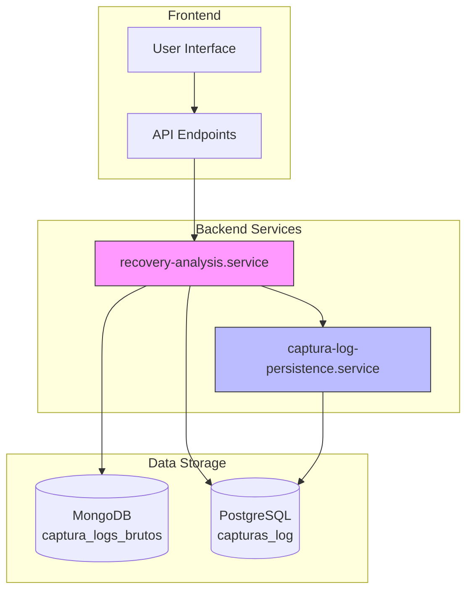
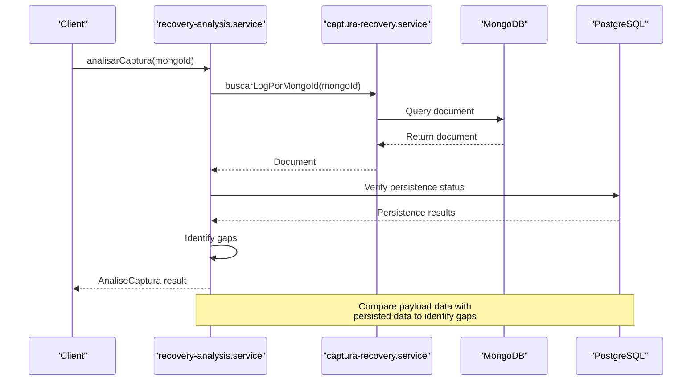
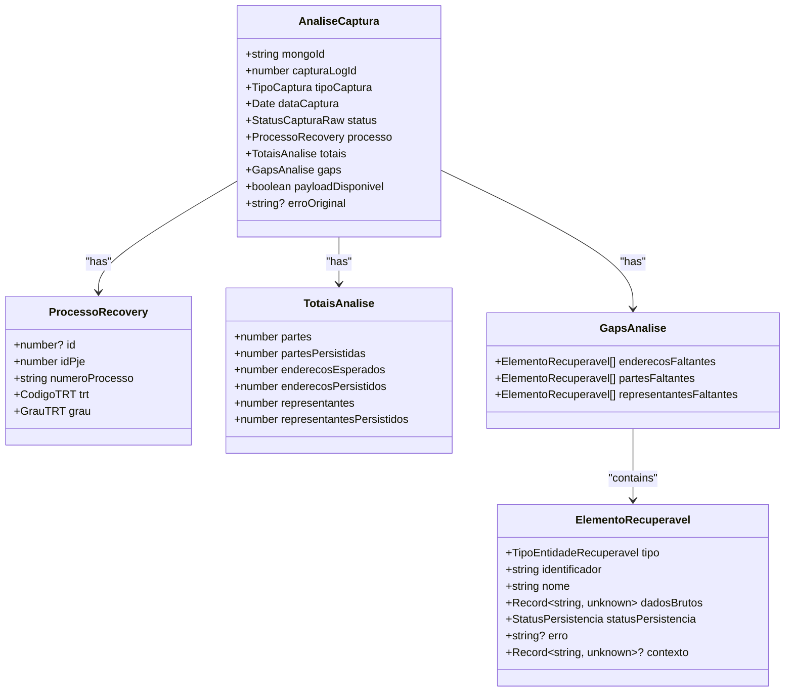
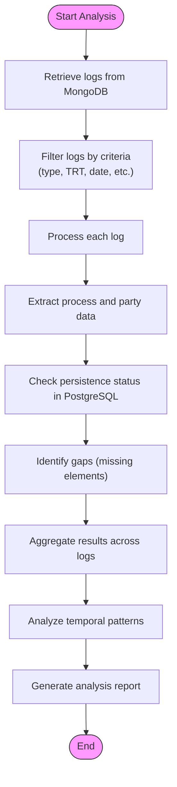
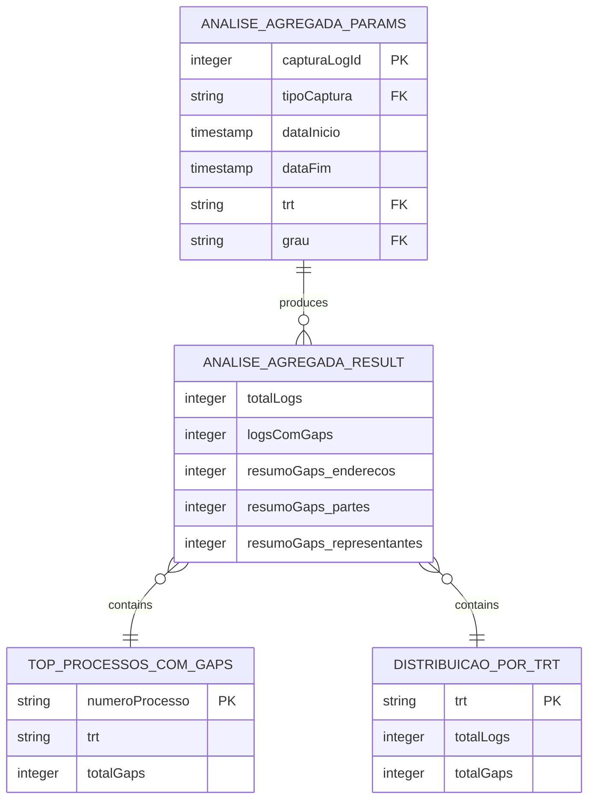
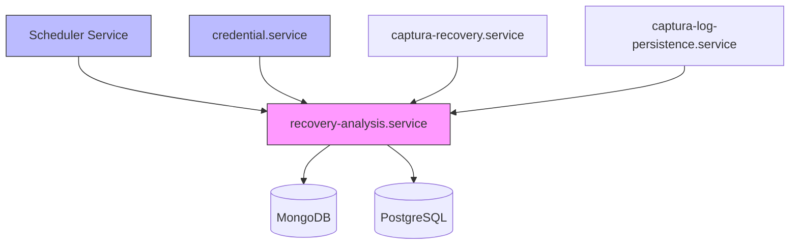

# Failure Pattern Recognition

<cite>
**Referenced Files in This Document**   
- [recovery-analysis.service.ts](file://backend/captura/services/recovery/recovery-analysis.service.ts)
- [types.ts](file://backend/captura/services/recovery/types.ts)
- [captura-log-persistence.service.ts](file://backend/captura/services/persistence/captura-log-persistence.service.ts)
- [credential.service.ts](file://backend/captura/credentials/credential.service.ts)
- [captura-recovery.service.ts](file://backend/captura/services/recovery/captura-recovery.service.ts)
- [collections.ts](file://backend/utils/mongodb/collections.ts)
- [captura-log.ts](file://backend/types/mongodb/captura-log.ts)
- [executar-agendamento.service.ts](file://backend/captura/services/scheduler/executar-agendamento.service.ts)
</cite>

## Table of Contents
1. [Introduction](#introduction)
2. [System Architecture](#system-architecture)
3. [Core Components](#core-components)
4. [Failure Pattern Recognition Implementation](#failure-pattern-recognition-implementation)
5. [Domain Model and Data Structures](#domain-model-and-data-structures)
6. [Pattern Detection Algorithms](#pattern-detection-algorithms)
7. [Configuration and Parameters](#configuration-and-parameters)
8. [Integration with Other Components](#integration-with-other-components)
9. [Common Issues and Solutions](#common-issues-and-solutions)
10. [Conclusion](#conclusion)

## Introduction

The failure pattern recognition system in Sinesys data capture is designed to identify recurring failure patterns by analyzing historical capture logs stored in the captura-log-persistence.service. This system plays a critical role in maintaining data integrity and reliability by detecting systematic issues such as credential expiration cycles or periodic API downtime. The recovery-analysis.service is the core component responsible for analyzing these logs and identifying gaps between captured data and persisted data in PostgreSQL.

The system analyzes logs from MongoDB that contain raw capture data, including successful captures and error information. By comparing the payload data from successful captures with the actual persisted data in PostgreSQL, the system can identify missing elements such as addresses, parties, or representatives. This analysis helps distinguish between random failures and genuine patterns that require attention.

The failure pattern recognition system is integrated with various components including the credential management system, scheduler service, and data capture services. It provides valuable insights into the reliability of data capture processes and helps identify systemic issues that might otherwise go unnoticed. The system returns confidence levels in pattern detection and supports configuration options for pattern matching sensitivity and time window analysis.

**Section sources**
- [recovery-analysis.service.ts](file://backend/captura/services/recovery/recovery-analysis.service.ts#L1-L1163)

## System Architecture

The failure pattern recognition system follows a layered architecture with clear separation of concerns. At the core is the recovery-analysis.service which orchestrates the analysis process by coordinating with various persistence and retrieval services. The system interacts with MongoDB to access raw capture logs and with PostgreSQL to verify data persistence status.

**Diagram sources **
- [recovery-analysis.service.ts](file://backend/captura/services/recovery/recovery-analysis.service.ts#L1-L1163)
- [captura-log-persistence.service.ts](file://backend/captura/services/persistence/captura-log-persistence.service.ts#L1-L199)

**Section sources**
- [recovery-analysis.service.ts](file://backend/captura/services/recovery/recovery-analysis.service.ts#L1-L1163)
- [captura-log-persistence.service.ts](file://backend/captura/services/persistence/captura-log-persistence.service.ts#L1-L199)

## Core Components

The failure pattern recognition system consists of several core components that work together to identify and analyze failure patterns. The primary component is the recovery-analysis.service, which provides functions for analyzing individual capture logs and aggregating results across multiple logs. This service works in conjunction with the captura-recovery.service for retrieving raw logs from MongoDB and the captura-log-persistence.service for accessing metadata from PostgreSQL.

The system uses a modular design with clear interfaces between components. The recovery-analysis.service exposes functions like analisarCaptura for analyzing individual logs and analisarGapsAgregado for performing aggregated analysis across multiple logs. These functions return structured results that include detailed information about identified gaps and their context.

The credential.service plays a supporting role by providing access to credential information that may be relevant to failure patterns, particularly those related to authentication issues. The scheduler service triggers periodic analysis of capture logs, ensuring that failure patterns are detected in a timely manner.

**Section sources**
- [recovery-analysis.service.ts](file://backend/captura/services/recovery/recovery-analysis.service.ts#L1-L1163)
- [captura-recovery.service.ts](file://backend/captura/services/recovery/captura-recovery.service.ts#L1-L395)
- [captura-log-persistence.service.ts](file://backend/captura/services/persistence/captura-log-persistence.service.ts#L1-L199)

## Failure Pattern Recognition Implementation

The failure pattern recognition system implements a comprehensive approach to identifying recurring failure patterns by analyzing historical capture logs. The core implementation is in the recovery-analysis.service, which provides functions for analyzing individual capture logs and aggregating results across multiple logs. The system compares data from successful captures in MongoDB with the actual persisted data in PostgreSQL to identify gaps.

The primary function analisarCaptura takes a MongoDB document ID and analyzes the corresponding capture log. It first retrieves the log using buscarLogPorMongoId from the captura-recovery.service, then extracts process information and payload data. If the payload is available, it identifies gaps by comparing the expected elements (parties, addresses, representatives) with what has been persisted in PostgreSQL.

**Diagram sources **
- [recovery-analysis.service.ts](file://backend/captura/services/recovery/recovery-analysis.service.ts#L37-L45)
- [captura-recovery.service.ts](file://backend/captura/services/recovery/captura-recovery.service.ts#L166-L186)

**Section sources**
- [recovery-analysis.service.ts](file://backend/captura/services/recovery/recovery-analysis.service.ts#L1-L1163)

## Domain Model and Data Structures

The failure pattern recognition system uses a well-defined domain model with specific data structures for representing failure sequences and temporal patterns. The core interface is AnaliseCaptura, which represents the result of analyzing a single capture log. This interface includes information about the MongoDB document, PostgreSQL log ID, capture type, timestamps, process details, and identified gaps.

The system defines several key types for representing recoverable elements. ElementoRecuperavel is the base interface for elements that can be recovered, including parties, addresses, and representatives. Each element has a type, identifier, name, raw data, and persistence status. The persistence status can be 'pendente' (pending), 'existente' (existing), 'faltando' (missing), or 'erro' (error).

**Diagram sources **
- [types.ts](file://backend/captura/services/recovery/types.ts#L1-L571)
- [recovery-analysis.service.ts](file://backend/captura/services/recovery/recovery-analysis.service.ts#L14-L24)

**Section sources**
- [types.ts](file://backend/captura/services/recovery/types.ts#L1-L571)

## Pattern Detection Algorithms

The failure pattern recognition system implements sophisticated algorithms for detecting specific failure patterns in the capture logs. The primary algorithm is implemented in the identificarGaps function, which compares the payload data from successful captures with the actual persisted data in PostgreSQL. This function iterates through each party in the payload, checks if it exists in the database, and verifies the persistence status of associated addresses and representatives.

For temporal pattern detection, the system uses the analisarGapsAgregado function, which performs aggregated analysis across multiple logs within a specified time window. This function applies filters based on capture type, TRT, grade, and date range, then analyzes each log to identify gaps. It maintains statistics on the distribution of gaps by TRT and identifies the top processes with the most gaps.

The system can detect specific patterns such as credential expiration cycles by analyzing the timing of authentication failures. When authentication failures consistently occur after approximately 30 days, the system can identify this as a token expiration pattern. Similarly, it can detect periodic API downtime by identifying clusters of timeouts during specific hours, which may indicate system maintenance windows.

**Diagram sources **
- [recovery-analysis.service.ts](file://backend/captura/services/recovery/recovery-analysis.service.ts#L224-L348)
- [recovery-analysis.service.ts](file://backend/captura/services/recovery/recovery-analysis.service.ts#L497-L601)

**Section sources**
- [recovery-analysis.service.ts](file://backend/captura/services/recovery/recovery-analysis.service.ts#L1-L1163)

## Configuration and Parameters

The failure pattern recognition system provides several configuration options and parameters for customizing pattern matching sensitivity and time window analysis. The analisarGapsAgregado function accepts parameters that allow filtering of logs by various criteria including capture log ID, capture type, date range, TRT, and grade. These parameters enable focused analysis on specific subsets of data.

The system supports time window analysis through the dataInicio and dataFim parameters, which allow analysis of logs within a specific date range. This is particularly useful for detecting temporal patterns such as daily, weekly, or monthly cycles of failures. The default time window is limited to 1000 logs for performance reasons, but this can be adjusted based on the analysis requirements.

The system returns confidence levels in pattern detection through the return values of its analysis functions. The AnaliseAgregadaResult interface includes metrics such as totalLogs, logsComGaps, and resumoGaps that provide quantitative measures of failure patterns. The topProcessosComGaps array identifies processes with the highest number of gaps, while distribuicaoPorTrt shows the distribution of gaps by TRT.

**Diagram sources **
- [types.ts](file://backend/captura/services/recovery/types.ts#L339-L380)
- [recovery-analysis.service.ts](file://backend/captura/services/recovery/recovery-analysis.service.ts#L497-L601)

**Section sources**
- [types.ts](file://backend/captura/services/recovery/types.ts#L1-L571)
- [recovery-analysis.service.ts](file://backend/captura/services/recovery/recovery-analysis.service.ts#L1-L1163)

## Integration with Other Components

The failure pattern recognition system integrates closely with several other components in the Sinesys architecture. The most critical integration is with the credential management system, which provides information about credentials used in data capture. The credential.service is used to retrieve credential details that may be relevant to authentication-related failure patterns.

The system also integrates with the scheduler service, which triggers periodic analysis of capture logs. The agendamento-scheduler.service calls executarScheduler at regular intervals, which in turn processes pending agendamentos and executes capture tasks. This integration ensures that failure pattern analysis is performed regularly and systematically.

The recovery-analysis.service depends on the captura-recovery.service for accessing raw logs from MongoDB and the captura-log-persistence.service for accessing metadata from PostgreSQL. These dependencies enable the system to correlate data between the two storage systems and identify persistence gaps.

**Diagram sources **
- [executar-agendamento.service.ts](file://backend/captura/services/scheduler/executar-agendamento.service.ts#L101-L485)
- [credential.service.ts](file://backend/captura/credentials/credential.service.ts#L1-L401)

**Section sources**
- [executar-agendamento.service.ts](file://backend/captura/services/scheduler/executar-agendamento.service.ts#L1-L485)
- [credential.service.ts](file://backend/captura/credentials/credential.service.ts#L1-L401)

## Common Issues and Solutions

The failure pattern recognition system addresses several common issues in pattern detection, particularly the challenge of distinguishing between random failures and genuine patterns. One key solution is the use of statistical significance testing through aggregated analysis across multiple logs. By analyzing a large number of logs within a specified time window, the system can identify patterns that occur with sufficient frequency to be considered significant.

The system implements minimum occurrence thresholds to filter out isolated incidents that are likely random. For example, a single authentication failure might be random, but consistent failures occurring every 30 days suggest a credential expiration cycle. The analisarGapsAgregado function helps identify these patterns by aggregating gap statistics across multiple logs.

Another common issue is false positives in pattern detection. The system addresses this by requiring both temporal consistency and contextual relevance. For example, when detecting periodic API downtime, the system looks for clusters of timeouts during specific hours across multiple days, rather than isolated incidents. This approach reduces false positives and increases confidence in detected patterns.

The system also provides mechanisms for validating detected patterns. The extrairTodosElementos function allows for comprehensive extraction of all elements from a capture log, enabling detailed verification of persistence status. This helps ensure that identified gaps are genuine and not artifacts of the analysis process.

**Section sources**
- [recovery-analysis.service.ts](file://backend/captura/services/recovery/recovery-analysis.service.ts#L1-L1163)
- [types.ts](file://backend/captura/services/recovery/types.ts#L1-L571)

## Conclusion

The failure pattern recognition system in Sinesys data capture provides a robust framework for identifying and analyzing recurring failure patterns. By leveraging historical capture logs stored in MongoDB and comparing them with persisted data in PostgreSQL, the system can detect systematic issues such as credential expiration cycles and periodic API downtime. The recovery-analysis.service serves as the core component, implementing sophisticated algorithms for gap identification and pattern detection.

The system's modular design with clear interfaces between components enables flexible configuration and integration with other services. The domain model provides a comprehensive representation of failure sequences and temporal patterns, while the configuration options allow for customization of pattern matching sensitivity and time window analysis. Integration with the credential management system and scheduler service ensures that the system operates effectively within the broader Sinesys architecture.

By addressing common issues such as distinguishing random failures from genuine patterns and reducing false positives, the system provides reliable insights into data capture reliability. The implementation demonstrates a thoughtful approach to failure pattern recognition, combining statistical analysis with contextual understanding to deliver actionable intelligence for improving system reliability.