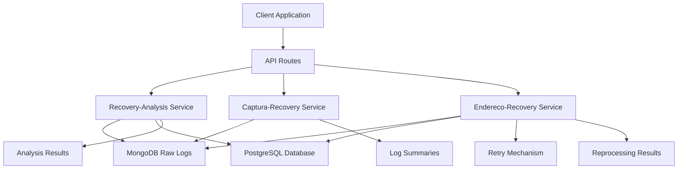
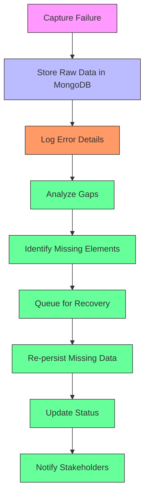
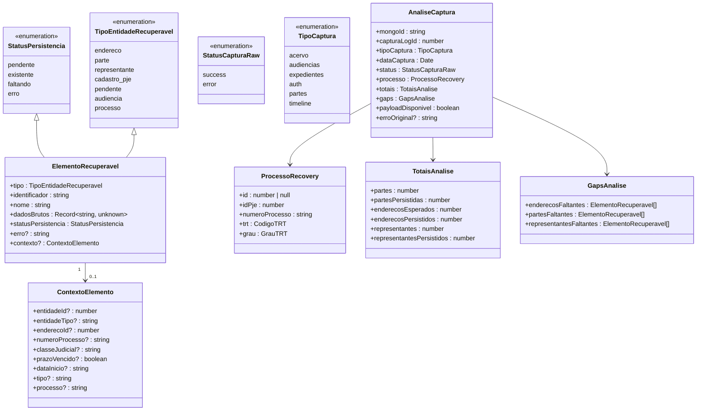
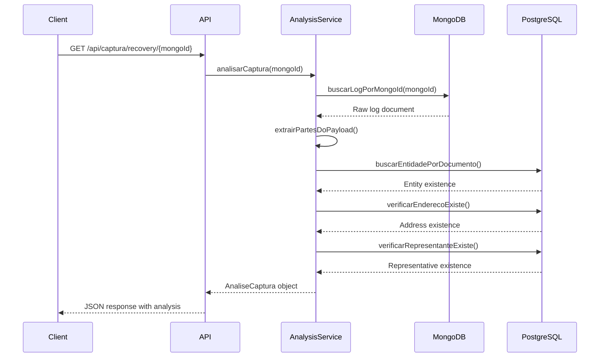
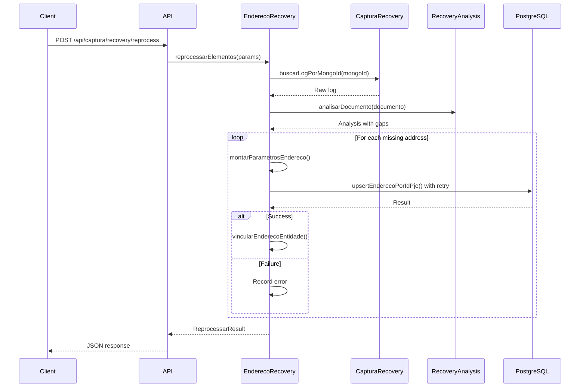
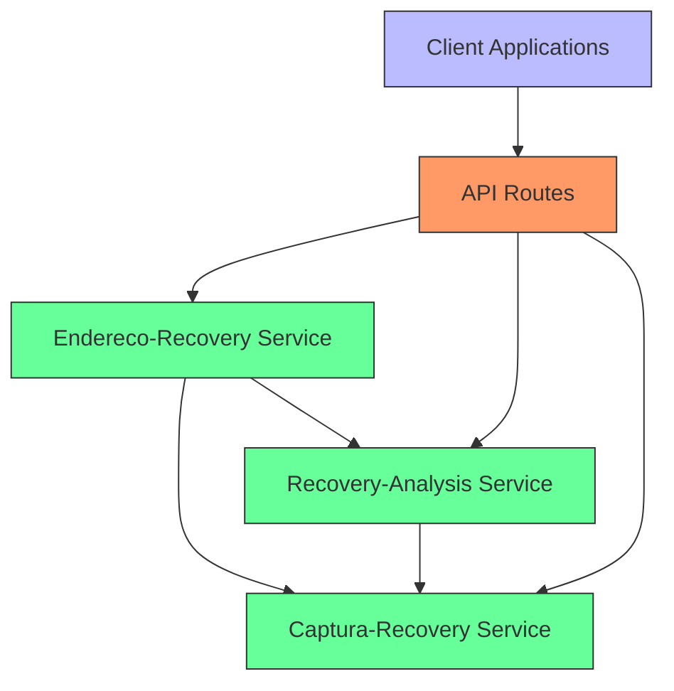
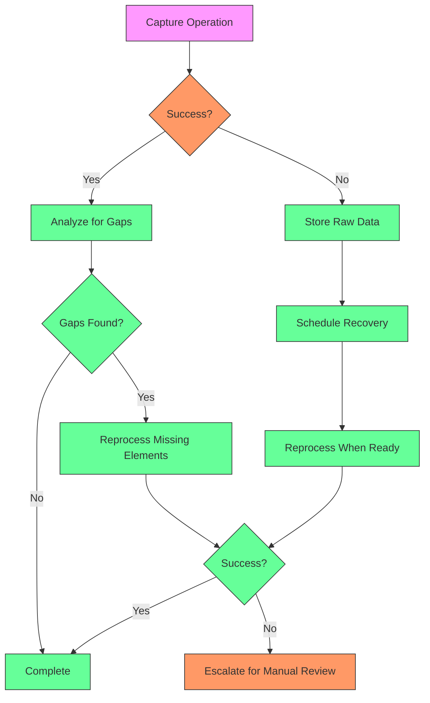
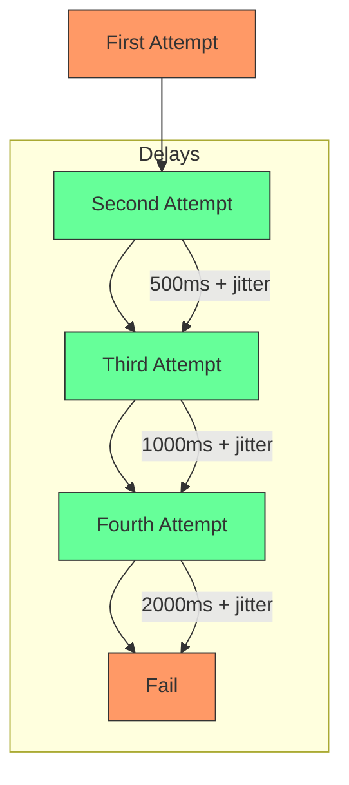
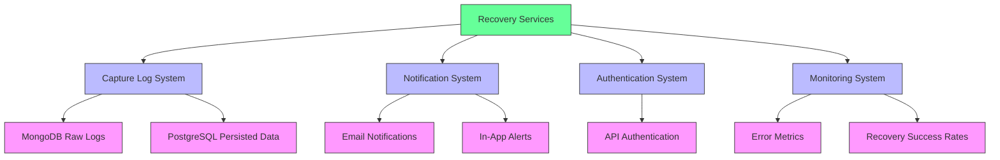
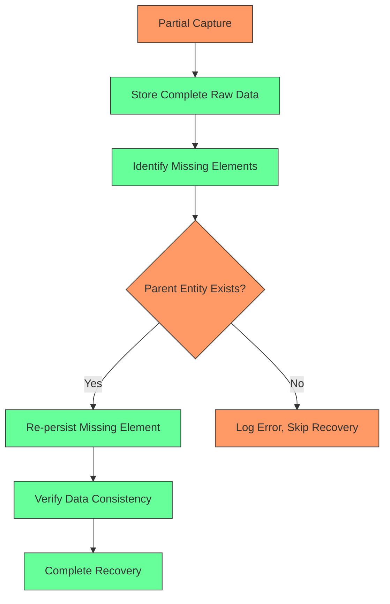

# Error Handling

<cite>
**Referenced Files in This Document**   
- [recovery-analysis.service.ts](file://backend/captura/services/recovery/recovery-analysis.service.ts)
- [captura-recovery.service.ts](file://backend/captura/services/recovery/captura-recovery.service.ts)
- [endereco-recovery.service.ts](file://backend/captura/services/recovery/endereco-recovery.service.ts)
- [types.ts](file://backend/captura/services/recovery/types.ts)
- [use-recovery-analysis.ts](file://app/_lib/hooks/use-recovery-analysis.ts)
- [capture-log.service.ts](file://backend/captura/services/persistence/capture-log.service.ts)
- [retry/index.ts](file://backend/utils/retry/index.ts)
- [route.ts](file://app/api/captura/recovery/[mongoId]/route.ts)
- [route.ts](file://app/api/captura/recovery/reprocess/route.ts)
</cite>

## Table of Contents
1. [Introduction](#introduction)
2. [Recovery Service Architecture](#recovery-service-architecture)
3. [Error Detection and Analysis](#error-detection-and-analysis)
4. [Domain Model for Error Types](#domain-model-for-error-types)
5. [Recovery-Analysis Service](#recovery-analysis-service)
6. [Captura-Recovery Service](#captura-recovery-service)
7. [Endereco-Recovery Service](#endereco-recovery-service)
8. [Invocation Relationships](#invocation-relationships)
9. [Automatic Recovery Patterns](#automatic-recovery-patterns)
10. [Configuration and Retry Policies](#configuration-and-retry-policies)
11. [Integration with Other Systems](#integration-with-other-systems)
12. [Common Issues and Solutions](#common-issues-and-solutions)
13. [Conclusion](#conclusion)

## Introduction

The Sinesys data capture system implements a comprehensive error handling and recovery framework designed to ensure data integrity and reliability during the capture process from external sources like PJE (Processo Judicial Eletrônico). When capture operations fail due to various reasons such as network issues, authentication failures, or parsing errors, the system preserves the raw data in MongoDB and provides mechanisms to analyze gaps and re-persist missing elements.

This documentation details the implementation of the recovery system, focusing on three core services: `recovery-analysis.service`, `captura-recovery.service`, and `endereco-recovery.service`. These services work together to detect, analyze, and recover from capture failures, ensuring that data is not lost and can be restored to the PostgreSQL database when possible.

The system is designed to be accessible to beginners while providing sufficient technical depth for experienced developers. It includes robust error detection, domain modeling for different error types, automatic recovery attempts with configurable retry policies, and integration with logging and notification systems.

**Section sources**
- [recovery-analysis.service.ts](file://backend/captura/services/recovery/recovery-analysis.service.ts#L1-L1163)
- [captura-recovery.service.ts](file://backend/captura/services/recovery/captura-recovery.service.ts#L1-L395)
- [endereco-recovery.service.ts](file://backend/captura/services/recovery/endereco-recovery.service.ts#L1-L595)

## Recovery Service Architecture

The recovery system in Sinesys follows a modular architecture with three primary services that handle different aspects of error recovery. The architecture is designed to separate concerns between analysis, data retrieval, and re-persistence operations.



**Diagram sources**
- [recovery-analysis.service.ts](file://backend/captura/services/recovery/recovery-analysis.service.ts#L1-L1163)
- [captura-recovery.service.ts](file://backend/captura/services/recovery/captura-recovery.service.ts#L1-L395)
- [endereco-recovery.service.ts](file://backend/captura/services/recovery/endereco-recovery.service.ts#L1-L595)

The recovery-analysis service is responsible for comparing data between MongoDB (raw capture logs) and PostgreSQL (persisted data) to identify gaps. The captura-recovery service provides data access to raw logs stored in MongoDB, while the endereco-recovery service handles the actual re-persistence of missing data elements back to PostgreSQL.

This separation of concerns allows each service to focus on its specific responsibility, making the system more maintainable and testable. The services communicate through well-defined interfaces and types, ensuring type safety and clear contracts between components.

**Section sources**
- [recovery-analysis.service.ts](file://backend/captura/services/recovery/recovery-analysis.service.ts#L1-L1163)
- [captura-recovery.service.ts](file://backend/captura/services/recovery/captura-recovery.service.ts#L1-L395)
- [endereco-recovery.service.ts](file://backend/captura/services/recovery/endereco-recovery.service.ts#L1-L595)

## Error Detection and Analysis

The error detection system in Sinesys captures and analyzes failures at multiple levels, from network connectivity issues to data parsing errors. When a capture operation fails, the system preserves the raw response in MongoDB along with metadata about the failure, enabling later analysis and recovery.

The primary mechanism for error detection is the comparison between raw data in MongoDB and persisted data in PostgreSQL. The recovery-analysis service performs this gap analysis by extracting entities from the raw payload and verifying their presence in the PostgreSQL database. This approach allows the system to detect not only complete capture failures but also partial failures where some data was persisted while other elements were lost.



**Diagram sources**
- [recovery-analysis.service.ts](file://backend/captura/services/recovery/recovery-analysis.service.ts#L1-L1163)
- [capture-log.service.ts](file://backend/captura/services/persistence/capture-log.service.ts#L1-L197)

The system detects various error types including network timeouts during document downloads, authentication failures when accessing external systems, and parsing errors when processing timeline data. Each error type is categorized and stored with relevant context, allowing for targeted recovery strategies. For example, network timeouts might trigger an immediate retry with exponential backoff, while parsing errors might require manual intervention or data correction.

The analysis process is triggered either manually through the API or automatically based on system monitoring. The results of the analysis include detailed information about missing elements, their types, and the context in which they should be re-persisted.

**Section sources**
- [recovery-analysis.service.ts](file://backend/captura/services/recovery/recovery-analysis.service.ts#L1-L1163)
- [capture-log.service.ts](file://backend/captura/services/persistence/capture-log.service.ts#L1-L197)

## Domain Model for Error Types

The Sinesys system implements a comprehensive domain model for representing different error types and recovery states. This model is defined in the types system and used consistently across all recovery services.



**Diagram sources**
- [types.ts](file://backend/captura/services/recovery/types.ts#L1-L571)

The domain model includes several key components. The `StatusPersistencia` enumeration represents the persistence state of an element, with values like 'pendente' (pending), 'existente' (existing), 'faltando' (missing), and 'erro' (error). The `TipoEntidadeRecuperavel` enumeration defines the types of entities that can be recovered, including 'endereco' (address), 'parte' (party), and 'representante' (representative).

The `ElementoRecuperavel` interface represents a recoverable element with properties for its type, identifier, name, raw data, persistence status, and optional error message. The `contexto` property provides additional context needed for recovery, such as entity IDs and types. This rich context enables the recovery system to accurately re-persist elements to their correct locations in the database.

The `AnaliseCaptura` interface represents the complete analysis of a capture operation, including information about the process, totals of elements found versus persisted, and identified gaps. This comprehensive model allows the system to provide detailed insights into capture failures and guide the recovery process.

**Section sources**
- [types.ts](file://backend/captura/services/recovery/types.ts#L1-L571)

## Recovery-Analysis Service

The recovery-analysis.service is the core component responsible for identifying gaps between raw capture data in MongoDB and persisted data in PostgreSQL. It analyzes capture logs to determine which elements were successfully persisted and which are missing, providing the foundation for recovery operations.



**Diagram sources**
- [recovery-analysis.service.ts](file://backend/captura/services/recovery/recovery-analysis.service.ts#L1-L1163)
- [captura-recovery.service.ts](file://backend/captura/services/recovery/captura-recovery.service.ts#L1-L395)

The service provides several key functions. The `analisarCaptura` function takes a MongoDB document ID and returns a complete analysis of the capture, including identified gaps. It first retrieves the raw log from MongoDB using the `buscarLogPorMongoId` function from the captura-recovery service, then extracts parts from the payload and compares them with the PostgreSQL database to identify missing elements.

The analysis process involves several steps. First, it extracts process information from the document, including the process ID, number, and tribunal details. Then, it extracts parts from the payload, which may have different structures depending on the capture type. For PJE captures, the payload typically has an {ATIVO: [...], PASSIVO: [...]} structure.

The service then iterates through each part, checking if it exists in the PostgreSQL database. For each existing part, it verifies that associated addresses and representatives are also persisted. Any missing elements are recorded in the gaps analysis. The service handles various payload structures and field name variations to ensure robust analysis across different capture types.

**Section sources**
- [recovery-analysis.service.ts](file://backend/captura/services/recovery/recovery-analysis.service.ts#L1-L1163)
- [captura-recovery.service.ts](file://backend/captura/services/recovery/captura-recovery.service.ts#L1-L395)

## Captura-Recovery Service

The captura-recovery.service provides data access to raw capture logs stored in MongoDB, serving as the bridge between the recovery system and the raw data. It offers functions to list, search, and retrieve capture logs for analysis and recovery purposes.

```mermaid
classDiagram
class CapturaRecoveryService {
+listarLogsRecovery(params) : Promise~ListarLogsRecoveryResult~
+buscarLogPorMongoId(mongoId) : Promise~CapturaRawLogDocument | null~
+buscarLogsPorCapturaLogId(capturaLogId) : Promise~CapturaRawLogDocument[]~
+contarLogsPorStatus(params) : Promise~{success : number, error : number, total : number}~
+estatisticasPorTrt(params) : Promise~{trt : string, total : number, success : number, error : number}[]~
+verificarPayloadDisponivel(mongoId) : Promise~boolean~
+extrairPayloadBruto(mongoId) : Promise~unknown | null~
}
class ListarLogsRecoveryParams {
+pagina? : number
+limite? : number
+capturaLogId? : number
+tipoCaptura? : TipoCaptura
+status? : StatusCapturaRaw
+trt? : CodigoTRT
+grau? : GrauTRT
+advogadoId? : number
+dataInicio? : string
+dataFim? : string
}
class ListarLogsRecoveryResult {
+logs : LogRecoverySumario[]
+total : number
+pagina : number
+limite : number
+totalPaginas : number
}
class LogRecoverySumario {
+mongoId : string
+capturaLogId : number
+tipoCaptura : TipoCaptura
+status : StatusCapturaRaw
+trt : CodigoTRT
+grau : GrauTRT
+advogadoId : number
+criadoEm : Date
+numeroProcesso? : string
+processoIdPje? : number
+erro? : string
}
CapturaRecoveryService --> ListarLogsRecoveryParams
CapturaRecoveryService --> ListarLogsRecoveryResult
CapturaRecoveryService --> LogRecoverySumario
```

**Diagram sources**
- [captura-recovery.service.ts](file://backend/captura/services/recovery/captura-recovery.service.ts#L1-L395)

The service provides several key functions for accessing recovery data. The `listarLogsRecovery` function allows listing capture logs with various filters such as capture type, status, tribunal, and date range. It returns a paginated result with log summaries that include essential information without the full payload for performance reasons.

The `buscarLogPorMongoId` function retrieves a specific log by its MongoDB ID, returning the complete document including the raw payload. This function is critical for recovery operations that need access to the original data. The service validates the MongoDB ID format before querying to prevent errors from invalid IDs.

Additional utility functions include `contarLogsPorStatus` and `estatisticasPorTrt` which provide aggregated statistics about capture logs, helping identify patterns in failures. The `verificarPayloadDisponivel` function quickly checks if a log has a payload available for reprocessing without retrieving the entire document.

The service implements proper error handling, logging any issues that occur during database operations and wrapping them in meaningful error messages. This ensures that consumers of the service can handle errors appropriately and provides visibility into issues with the recovery data access layer.

**Section sources**
- [captura-recovery.service.ts](file://backend/captura/services/recovery/captura-recovery.service.ts#L1-L395)

## Endereco-Recovery Service

The endereco-recovery.service is responsible for re-persisting missing address data from raw capture logs back to the PostgreSQL database. It implements the actual recovery logic, using data from the recovery analysis to recreate missing elements.



**Diagram sources**
- [endereco-recovery.service.ts](file://backend/captura/services/recovery/endereco-recovery.service.ts#L1-L595)
- [captura-recovery.service.ts](file://backend/captura/services/recovery/captura-recovery.service.ts#L1-L395)
- [recovery-analysis.service.ts](file://backend/captura/services/recovery/recovery-analysis.service.ts#L1-L1163)

The service provides the `reprocessarElementos` function as its main entry point, which processes multiple documents and their elements. For each document, it first retrieves the raw log from MongoDB using the captura-recovery service, then analyzes it for gaps using the recovery-analysis service. Based on the analysis, it identifies missing addresses and attempts to re-persist them.

The reprocessing logic includes several important features. It uses the `withRetry` utility to handle transient database errors, implementing exponential backoff with jitter to avoid overwhelming the database during recovery operations. The retry configuration allows up to 3 attempts with increasing delays between attempts.

When re-persisting an address, the service first verifies that the parent entity (client, opposing party, or third party) exists in the database. If the entity doesn't exist, the address cannot be properly linked, and the recovery fails with an appropriate error message. This dependency checking ensures data integrity during the recovery process.

The service also supports different recovery modes through its parameters. The `apenasGaps` flag controls whether to process only missing elements or all elements in the payload. The `forcarAtualizacao` flag determines whether to update existing records or only create missing ones. These options provide flexibility in recovery scenarios, allowing for both gap-filling and complete data refresh operations.

**Section sources**
- [endereco-recovery.service.ts](file://backend/captura/services/recovery/endereco-recovery.service.ts#L1-L595)
- [captura-recovery.service.ts](file://backend/captura/services/recovery/captura-recovery.service.ts#L1-L395)
- [recovery-analysis.service.ts](file://backend/captura/services/recovery/recovery-analysis.service.ts#L1-L1163)

## Invocation Relationships

The three recovery services work together in a coordinated manner to detect, analyze, and recover from capture failures. Their invocation relationships follow a clear pattern where higher-level services depend on lower-level ones for data access and analysis.



**Diagram sources**
- [recovery-analysis.service.ts](file://backend/captura/services/recovery/recovery-analysis.service.ts#L1-L1163)
- [captura-recovery.service.ts](file://backend/captura/services/recovery/captura-recovery.service.ts#L1-L395)
- [endereco-recovery.service.ts](file://backend/captura/services/recovery/endereco-recovery.service.ts#L1-L595)

When a recovery operation is initiated, the API routes serve as the entry point. For analysis requests, the API calls the recovery-analysis service directly, which in turn uses the captura-recovery service to access raw logs from MongoDB. For reprocessing requests, the API calls the endereco-recovery service, which depends on both the captura-recovery service for data access and the recovery-analysis service for gap identification.

The dependency hierarchy ensures that each service has a single responsibility. The captura-recovery service is the lowest level, providing raw data access without any business logic. The recovery-analysis service builds on this by adding analysis capabilities, comparing raw data with persisted data to identify gaps. The endereco-recovery service is the highest level, using both data access and analysis results to perform actual recovery operations.

This layered architecture provides several benefits. It allows for independent testing of each service, as they can be mocked or stubbed for unit tests. It also enables reuse of components - for example, the same analysis logic can be used for both manual recovery operations and automated monitoring systems. The clear interfaces between services make it easier to understand the flow of data and control through the system.

**Section sources**
- [recovery-analysis.service.ts](file://backend/captura/services/recovery/recovery-analysis.service.ts#L1-L1163)
- [captura-recovery.service.ts](file://backend/captura/services/recovery/captura-recovery.service.ts#L1-L395)
- [endereco-recovery.service.ts](file://backend/captura/services/recovery/endereco-recovery.service.ts#L1-L595)

## Automatic Recovery Patterns

The Sinesys system implements several patterns for automatic recovery from capture failures. These patterns leverage the recovery services to detect and correct issues without manual intervention, improving system reliability and reducing operational overhead.

One key pattern is the gap analysis and reprocessing workflow. When a capture operation completes, the system can automatically analyze the results to identify any gaps between raw data and persisted data. If gaps are found, the system can initiate a recovery process to re-persist missing elements. This pattern ensures that transient failures during the initial persistence phase don't result in permanent data loss.



**Diagram sources**
- [recovery-analysis.service.ts](file://backend/captura/services/recovery/recovery-analysis.service.ts#L1-L1163)
- [endereco-recovery.service.ts](file://backend/captura/services/recovery/endereco-recovery.service.ts#L1-L595)

Another pattern is the scheduled recovery check. The system can periodically analyze recent capture operations for gaps and automatically reprocess any missing elements. This pattern acts as a safety net, catching issues that might have been missed during the initial capture and recovery process.

For specific error types, the system implements targeted recovery patterns. Network timeouts during document downloads trigger immediate retries with exponential backoff, while authentication failures prompt credential refresh before retrying. Parsing errors in timeline data may trigger data validation and cleaning before reprocessing.

The system also supports batch recovery operations, where multiple failed captures are processed together. This is particularly useful after system maintenance or network outages that affect multiple capture operations. The batch processing can be prioritized based on factors like process importance or data freshness.

These automatic recovery patterns work together to create a resilient system that can handle a wide range of failure scenarios. By combining immediate retries for transient issues with scheduled gap analysis for persistent issues, the system maximizes data completeness while minimizing manual intervention.

**Section sources**
- [recovery-analysis.service.ts](file://backend/captura/services/recovery/recovery-analysis.service.ts#L1-L1163)
- [endereco-recovery.service.ts](file://backend/captura/services/recovery/endereco-recovery.service.ts#L1-L595)
- [retry/index.ts](file://backend/utils/retry/index.ts#L1-L134)

## Configuration and Retry Policies

The recovery system includes configurable parameters that control its behavior, particularly around retry policies and recovery operations. These configurations allow administrators to tune the system for their specific environment and requirements.

The retry mechanism is configured through the `RETRY_CONFIG` constant in the endereco-recovery service, which defines parameters for exponential backoff:

```typescript
const RETRY_CONFIG = {
  maxAttempts: 3,
  baseDelay: 500,
  maxDelay: 5000,
};
```

This configuration specifies that operations will be retried up to 3 times (including the initial attempt) with a base delay of 500ms between attempts, using exponential backoff capped at a maximum delay of 5000ms. The actual delay includes jitter to prevent thundering herd problems when multiple operations fail simultaneously.



**Diagram sources**
- [endereco-recovery.service.ts](file://backend/captura/services/recovery/endereco-recovery.service.ts#L32-L36)
- [retry/index.ts](file://backend/utils/retry/index.ts#L1-L134)

The system also includes configuration options for recovery operations through function parameters. The `reprocessarElementos` function accepts a `filtros` parameter with options like `apenasGaps` (process only missing elements) and `forcarAtualizacao` (force update even if record exists). These options provide flexibility in recovery scenarios, allowing for both conservative gap-filling and aggressive data refresh operations.

API endpoints expose additional configuration through query parameters. The recovery analysis endpoint supports `analisar_gaps` (whether to perform gap analysis) and `incluir_payload` (whether to include the raw payload in the response). These parameters allow clients to control the scope and detail of the analysis based on their needs.

The retry utility in `backend/utils/retry/index.ts` provides a more sophisticated configuration interface with options for customizing retry behavior:

```typescript
interface RetryOptions {
  maxAttempts: number;
  baseDelay: number;
  maxDelay: number;
  isRetryable?: (error: unknown) => boolean;
  onRetry?: (attempt: number, error: unknown) => void;
}
```

This interface allows defining custom logic for determining which errors are retryable and executing callbacks before each retry attempt. The default implementation considers network errors, timeouts, and database deadlocks as retryable, while permanent errors like validation failures are not retried.

These configuration options and retry policies work together to create a flexible recovery system that can adapt to different failure scenarios and operational requirements.

**Section sources**
- [endereco-recovery.service.ts](file://backend/captura/services/recovery/endereco-recovery.service.ts#L32-L36)
- [retry/index.ts](file://backend/utils/retry/index.ts#L1-L134)

## Integration with Other Systems

The recovery system integrates with several other components in the Sinesys architecture, including the capture log system and notification system. These integrations provide visibility into recovery operations and enable coordinated error handling across the platform.

The primary integration is with the capture log system, which provides the raw data for recovery operations. The captura-recovery service accesses capture logs stored in MongoDB, while the recovery-analysis service compares this data with the PostgreSQL database. This integration ensures that recovery operations have access to complete and accurate data from failed capture attempts.



**Diagram sources**
- [captura-recovery.service.ts](file://backend/captura/services/recovery/captura-recovery.service.ts#L1-L395)
- [capture-log.service.ts](file://backend/captura/services/persistence/capture-log.service.ts#L1-L197)

The integration with the notification system allows the recovery services to report the status of recovery operations. When a recovery operation completes, whether successfully or with errors, the system can send notifications to relevant stakeholders. This ensures that teams are aware of data recovery activities and can investigate persistent issues.

The recovery API routes integrate with the authentication system, requiring valid credentials to access recovery functionality. This security measure prevents unauthorized access to sensitive recovery operations and ensures that only authorized personnel can initiate data recovery.

The system also integrates with monitoring and observability tools. Recovery operations generate logs and metrics that are collected and analyzed to identify trends in capture failures and recovery success rates. This data helps improve the system over time by highlighting areas that need optimization or additional error handling.

These integrations create a cohesive error handling ecosystem where failures are detected, analyzed, recovered, and reported in a coordinated manner. The tight integration between components ensures that the recovery system operates effectively within the broader Sinesys architecture.

**Section sources**
- [captura-recovery.service.ts](file://backend/captura/services/recovery/captura-recovery.service.ts#L1-L395)
- [capture-log.service.ts](file://backend/captura/services/persistence/capture-log.service.ts#L1-L197)
- [route.ts](file://app/api/captura/recovery/[mongoId]/route.ts#L1-L217)
- [route.ts](file://app/api/captura/recovery/reprocess/route.ts#L1-L319)

## Common Issues and Solutions

The Sinesys recovery system addresses several common issues that can occur during data capture and recovery operations. These solutions are built into the architecture and implementation to prevent data loss and ensure system reliability.

One common issue is infinite retry loops, where a failed operation continues to retry indefinitely without success. The system prevents this through the retry configuration, which limits the number of retry attempts. The `maxAttempts` parameter ensures that operations eventually fail after a configurable number of attempts, preventing infinite loops. Additionally, the exponential backoff strategy with jitter reduces the load on external systems during recovery attempts.

Data corruption during partial captures is another potential issue. The system addresses this by storing complete raw responses in MongoDB before any processing begins. This ensures that even if partial data is persisted to PostgreSQL, the complete original data is available for recovery. The gap analysis process also verifies the consistency between related entities, such as ensuring that an address is only recovered if its parent entity exists.



**Diagram sources**
- [recovery-analysis.service.ts](file://backend/captura/services/recovery/recovery-analysis.service.ts#L1-L1163)
- [endereco-recovery.service.ts](file://backend/captura/services/recovery/endereco-recovery.service.ts#L1-L595)

Cascading failures, where one failure triggers multiple subsequent failures, are mitigated through isolation of recovery operations. Each recovery operation is independent, so a failure in one does not directly affect others. The system also implements circuit breaker patterns through the retry mechanism, temporarily halting recovery attempts after repeated failures to prevent overwhelming external systems.

Network timeouts during document downloads are handled through the retry mechanism with exponential backoff. The system automatically retries failed downloads with increasing delays between attempts, giving the network time to recover. For critical documents, the system may also implement fallback mechanisms, such as attempting alternative download methods or sources.

Parsing errors in timeline data are addressed through robust error handling and data validation. When a parsing error occurs, the system logs the raw data and error details, allowing for later analysis and correction. The recovery system can then reprocess the data once the parsing issue is resolved, ensuring that no data is permanently lost due to transient parsing problems.

These solutions work together to create a resilient system that can handle a wide range of failure scenarios while maintaining data integrity and system stability.

**Section sources**
- [recovery-analysis.service.ts](file://backend/captura/services/recovery/recovery-analysis.service.ts#L1-L1163)
- [endereco-recovery.service.ts](file://backend/captura/services/recovery/endereco-recovery.service.ts#L1-L595)
- [retry/index.ts](file://backend/utils/retry/index.ts#L1-L134)

## Conclusion

The error handling and recovery system in Sinesys provides a comprehensive solution for managing capture failures and ensuring data integrity. Through the coordinated operation of the recovery-analysis.service, captura-recovery.service, and endereco-recovery.service, the system can detect, analyze, and recover from a wide range of failure scenarios.

The architecture follows sound principles of separation of concerns, with each service having a clear responsibility. The recovery-analysis service focuses on gap detection, the captura-recovery.service provides data access, and the endereco-recovery.service handles the actual re-persistence of missing data. This modular design makes the system maintainable and extensible.

Key features of the system include robust error detection, a comprehensive domain model for representing different error types, automatic recovery attempts with configurable retry policies, and integration with logging and notification systems. The system addresses common issues like infinite retry loops, data corruption during partial captures, and cascading failures through mechanisms such as exponential backoff strategies and data validation checkpoints.

The implementation provides both immediate recovery for transient issues and scheduled gap analysis for persistent issues, creating a resilient system that maximizes data completeness while minimizing manual intervention. The configuration options and retry policies allow administrators to tune the system for their specific environment and requirements.

Overall, the Sinesys recovery system demonstrates a thoughtful approach to error handling that prioritizes data integrity, system reliability, and operational efficiency. By preserving raw data and providing mechanisms to analyze and recover from failures, the system ensures that valuable data is not lost and can be restored when possible.

[No sources needed since this section summarizes without analyzing specific files]