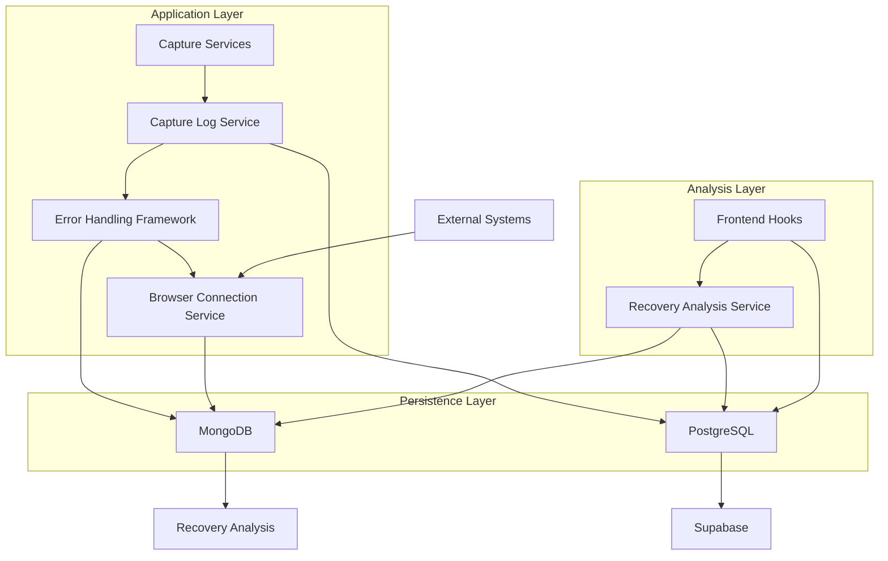
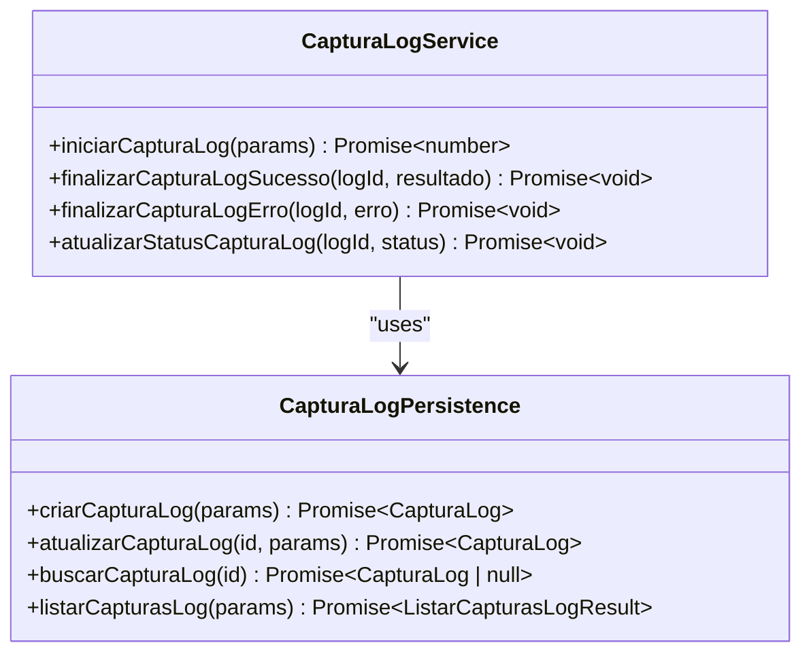
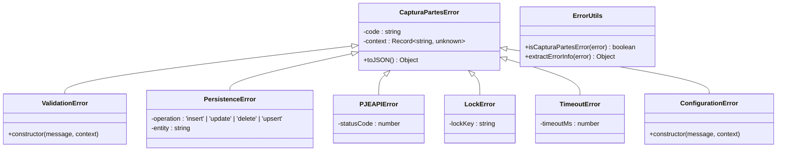
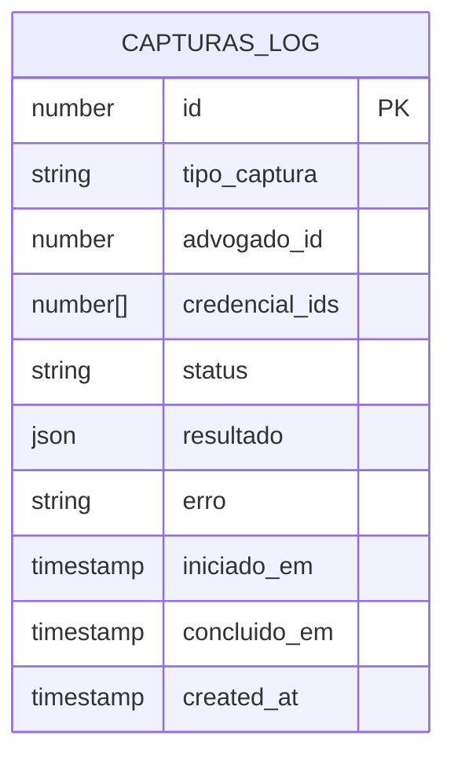
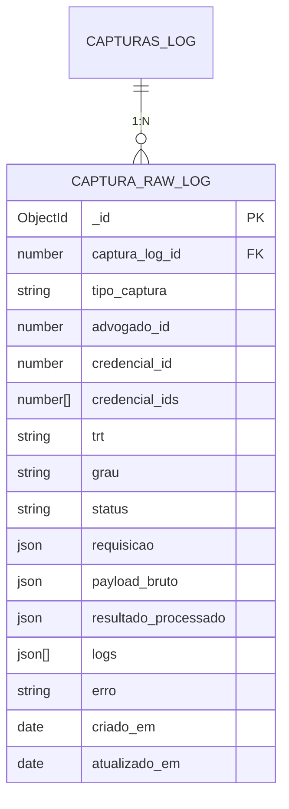
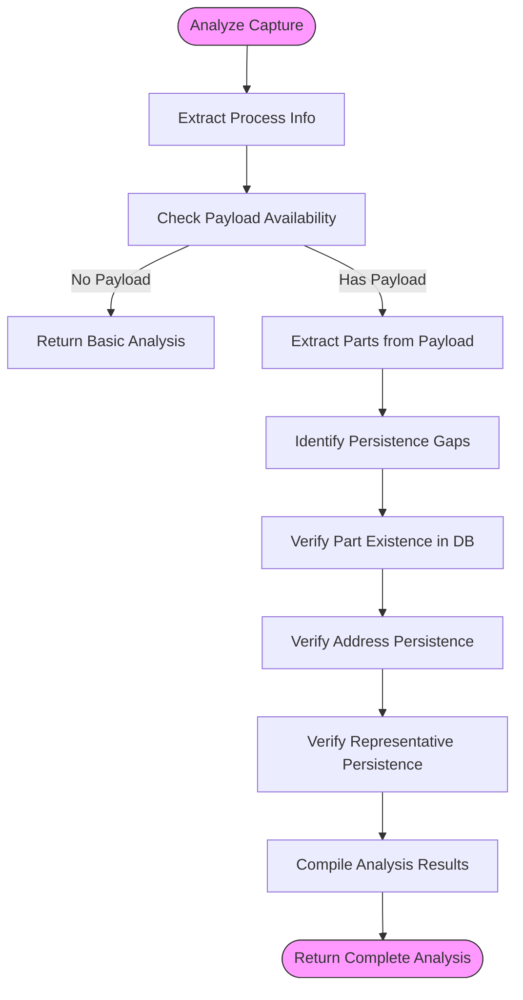

# Error Context Capture

<cite>
**Referenced Files in This Document**   
- [captura-log.service.ts](file://backend/captura/services/captura-log.service.ts)
- [errors.ts](file://backend/captura/services/partes/errors.ts)
- [recovery-analysis.service.ts](file://backend/captura/services/recovery/recovery-analysis.service.ts)
- [captura-log-persistence.service.ts](file://backend/captura/services/persistence/captura-log-persistence.service.ts)
- [captura-log.ts](file://backend/types/mongodb/captura-log.ts)
- [capturas-log-types.ts](file://backend/types/captura/capturas-log-types.ts)
- [captura-raw-log.service.ts](file://backend/captura/services/persistence/captura-raw-log.service.ts)
- [browser-connection.service.ts](file://backend/captura/services/browser/browser-connection.service.ts)
- [use-capturas-log.ts](file://app/_lib/hooks/use-capturas-log.ts)
- [use-recovery-logs.ts](file://app/_lib/hooks/use-recovery-logs.ts)
</cite>

## Table of Contents
1. [Introduction](#introduction)
2. [Core Components](#core-components)
3. [Architecture Overview](#architecture-overview)
4. [Detailed Component Analysis](#detailed-component-analysis)
5. [Error Context Domain Model](#error-context-domain-model)
6. [Context Capture Implementation](#context-capture-implementation)
7. [Recovery Analysis System](#recovery-analysis-system)
8. [Configuration and Parameters](#configuration-and-parameters)
9. [Common Issues and Solutions](#common-issues-and-solutions)
10. [Troubleshooting Guide](#troubleshooting-guide)

## Introduction

The Sinesys data capture system implements a comprehensive error context capture mechanism designed to preserve critical information during failure conditions. This system captures contextual data including browser state, network responses, and user actions leading up to failures, enabling effective debugging and issue reproduction. The architecture combines PostgreSQL for structured logging with MongoDB for raw data storage, creating a robust context preservation system that supports both immediate error analysis and long-term recovery operations.

The error context capture system is particularly important for the Sinesys platform, which performs automated data capture from external legal systems like PJE-TRT. These operations are prone to various failure modes including authentication issues, network timeouts, and data validation errors. By capturing rich contextual information at the time of failure, the system enables developers and support staff to understand exactly what occurred and why, significantly reducing mean time to resolution for complex issues.

**Section sources**
- [captura-log.service.ts](file://backend/captura/services/captura-log.service.ts#L1-L66)
- [errors.ts](file://backend/captura/services/partes/errors.ts#L1-L139)

## Core Components

The error context capture system in Sinesys consists of several interconnected components that work together to capture, store, and analyze contextual information during error conditions. The core components include the capture logging service, error handling framework, MongoDB raw log persistence, and recovery analysis system.

The capture logging service provides the primary interface for recording capture operations and their outcomes. It manages the lifecycle of capture operations from initiation through completion or failure, recording essential metadata about each operation. When errors occur, this service ensures that error information is properly recorded and associated with the corresponding capture operation.

The error handling framework implements a hierarchy of custom error classes that extend the base `CapturaPartesError`. These error classes provide structured error information with standardized codes, messages, and contextual data. This approach enables consistent error handling across the application and facilitates automated analysis of error patterns.

**Section sources**
- [captura-log.service.ts](file://backend/captura/services/captura-log.service.ts#L1-L66)
- [errors.ts](file://backend/captura/services/partes/errors.ts#L1-L139)

## Architecture Overview

The error context capture system follows a multi-layered architecture that separates concerns between operation management, context capture, and analysis. The architecture consists of three main layers: the application layer, the persistence layer, and the analysis layer.

**Diagram sources **
- [captura-log.service.ts](file://backend/captura/services/captura-log.service.ts#L1-L66)
- [captura-log.ts](file://backend/types/mongodb/captura-log.ts#L1-L80)
- [recovery-analysis.service.ts](file://backend/captura/services/recovery/recovery-analysis.service.ts#L1-L800)

## Detailed Component Analysis

### Capture Logging Service

The capture logging service is the central component for managing capture operations and their associated context. It provides functions for initiating, updating, and finalizing capture operations, ensuring that all operations are properly tracked regardless of outcome.

**Diagram sources **
- [captura-log.service.ts](file://backend/captura/services/captura-log.service.ts#L1-L66)
- [captura-log-persistence.service.ts](file://backend/captura/services/persistence/captura-log-persistence.service.ts#L1-L199)

### Error Handling Framework

The error handling framework provides a structured approach to error management with custom error classes that capture detailed context. This framework enables consistent error reporting and facilitates automated analysis of error patterns.

**Diagram sources **
- [errors.ts](file://backend/captura/services/partes/errors.ts#L1-L139)

## Error Context Domain Model

The error context capture system in Sinesys is built around a comprehensive domain model that defines how contextual information is structured and stored. The model consists of two main components: the PostgreSQL-based capture log and the MongoDB-based raw log.

The PostgreSQL capture log stores structured information about capture operations in the `capturas_log` table. This includes metadata such as the capture type, status, timestamps, and high-level results. The schema is defined by the `CapturaLog` interface, which includes fields for the capture ID, type, status, result, and error message.

**Diagram sources **
- [capturas-log-types.ts](file://backend/types/captura/capturas-log-types.ts#L1-L94)

The MongoDB raw log stores detailed, unstructured context information in the `captura_logs_brutos` collection. This includes the raw payload from external systems, request parameters, structured logs, and error details. The schema is defined by the `CapturaRawLogDocument` interface, which extends the PostgreSQL log with additional context fields.

**Diagram sources **
- [captura-log.ts](file://backend/types/mongodb/captura-log.ts#L1-L80)

## Context Capture Implementation

The context capture implementation in Sinesys follows a systematic approach to ensure that all relevant information is preserved during error conditions. When a capture operation is initiated, the system creates a record in the PostgreSQL database and associates it with subsequent context captured in MongoDB.

The capture process begins with the `iniciarCapturaLog` function, which creates a new record in the `capturas_log` table with a status of 'in_progress'. As the capture operation proceeds, the system captures various types of context:

1. **Browser state**: When interacting with external systems via browser automation, the system captures the current page state, including URL, title, and DOM structure.
2. **Network responses**: All HTTP requests and responses are logged, including headers, status codes, and response bodies.
3. **User actions**: The sequence of user actions leading up to the failure is recorded, providing insight into the operational context.
4. **Variable states**: Key variables and data structures at the time of failure are preserved for analysis.

When an error occurs, the system uses the `finalizarCapturaLogErro` function to update the capture record with the error status and message. Simultaneously, the `registrarCapturaRawLog` function is called to store detailed context in MongoDB, including the error object, stack trace, and any relevant payload data.

The system also implements automatic context sanitization to handle data types that are incompatible with MongoDB, such as BigInt values. The `sanitizarParaMongoDB` function converts these values to strings to preserve their content without causing storage errors.

**Section sources**
- [captura-log.service.ts](file://backend/captura/services/captura-log.service.ts#L1-L66)
- [captura-raw-log.service.ts](file://backend/captura/services/persistence/captura-raw-log.service.ts#L1-L162)
- [browser-connection.service.ts](file://backend/captura/services/browser/browser-connection.service.ts#L1-L274)

## Recovery Analysis System

The recovery analysis system is a critical component that uses captured context data to identify and resolve issues. This system analyzes logs from both PostgreSQL and MongoDB to identify gaps in data persistence and recommend recovery actions.

The primary function of the recovery analysis system is `analisarCaptura`, which takes a MongoDB document ID and performs a comprehensive analysis of the associated capture operation. The analysis compares the raw payload data from MongoDB with the persisted data in PostgreSQL to identify any elements that were not successfully saved.

**Diagram sources **
- [recovery-analysis.service.ts](file://backend/captura/services/recovery/recovery-analysis.service.ts#L1-L800)

The analysis process identifies three main types of gaps:
1. **Missing parts**: Entities that were present in the source data but not persisted to the database
2. **Missing addresses**: Address information that was not saved for existing entities
3. **Missing representatives**: Representative relationships that were not established

For each identified gap, the system provides detailed information including the element type, identifier, name, raw data, and persistence status. This information enables targeted recovery operations to fill the gaps and ensure data completeness.

The system also provides aggregated analysis through the `analisarGapsAgregado` function, which can analyze multiple capture logs to identify patterns and trends in data persistence issues. This function returns statistics on the total number of logs analyzed, the number with gaps, and a breakdown of gaps by type.

**Section sources**
- [recovery-analysis.service.ts](file://backend/captura/services/recovery/recovery-analysis.service.ts#L1-L800)

## Configuration and Parameters

The error context capture system in Sinesys provides several configuration options that control the depth and scope of context capture. These options allow administrators to balance the need for detailed context against storage requirements and performance considerations.

The primary configuration parameters are defined in environment variables and service options:

- **BROWSER_WS_ENDPOINT**: Specifies the WebSocket endpoint for remote browser connections, enabling centralized browser management
- **BROWSER_SERVICE_TOKEN**: Authentication token for secure access to the browser service
- **Context capture depth**: Controlled by the inclusion of various data fields in the raw log, such as request parameters, raw payloads, and structured logs
- **Sensitive data filtering**: Automatic redaction of sensitive information like credentials and personal data

The system also provides parameters for controlling the behavior of context capture operations:

- **Timeout settings**: Configurable timeouts for browser connections and capture operations
- **Retry policies**: Configuration for automatic retry of failed operations
- **Sampling rate**: Option to sample context capture for high-volume operations to reduce storage requirements

These configuration options are implemented through service parameters and environment variables, allowing them to be adjusted without code changes. The system validates configuration values at startup and provides appropriate error messages for invalid configurations.

**Section sources**
- [browser-connection.service.ts](file://backend/captura/services/browser/browser-connection.service.ts#L1-L274)
- [captura-raw-log.service.ts](file://backend/captura/services/persistence/captura-raw-log.service.ts#L1-L162)

## Common Issues and Solutions

The error context capture system in Sinesys addresses several common issues related to capturing and preserving context during failures. These issues include excessive context data size, privacy concerns, and difficulties in reproducing intermittent errors.

### Excessive Context Data Size

Large context captures can consume significant storage space and impact system performance. The system addresses this issue through several mechanisms:

1. **Context sampling**: For high-frequency operations, the system can be configured to sample context captures rather than recording every operation
2. **Data compression**: Raw payload data is compressed when stored in MongoDB to reduce storage requirements
3. **Automatic cleanup**: Old context data is automatically purged based on configurable retention policies

### Privacy Concerns

Capturing detailed context can raise privacy concerns, especially when sensitive data is involved. The system mitigates these concerns through:

1. **Automatic redaction**: Sensitive data such as credentials and personal information is automatically redacted from context captures
2. **Access controls**: Context data is protected by the same authorization system as other application data
3. **Data minimization**: Only context necessary for debugging is captured, following the principle of least privilege

### Intermittent Error Reproduction

Intermittent errors are particularly challenging to diagnose because they may not occur consistently. The system addresses this issue through:

1. **Progressive context capture**: The system captures context at multiple points during an operation, increasing the likelihood of capturing relevant information when an intermittent error occurs
2. **Correlation IDs**: Each operation is assigned a unique correlation ID that links all related context, making it easier to trace the complete execution path
3. **Predictive capture**: Based on historical patterns, the system can increase context capture depth for operations that are more likely to fail

These solutions ensure that the error context capture system remains effective while minimizing its impact on performance and respecting user privacy.

**Section sources**
- [captura-raw-log.service.ts](file://backend/captura/services/persistence/captura-raw-log.service.ts#L1-L162)
- [errors.ts](file://backend/captura/services/partes/errors.ts#L1-L139)
- [recovery-analysis.service.ts](file://backend/captura/services/recovery/recovery-analysis.service.ts#L1-L800)

## Troubleshooting Guide

When troubleshooting issues with the error context capture system, follow these steps to diagnose and resolve problems:

1. **Verify capture log creation**: Check that capture logs are being created in the PostgreSQL database by querying the `capturas_log` table. If logs are not being created, verify that the `iniciarCapturaLog` function is being called correctly.

2. **Check raw log persistence**: Verify that raw context is being stored in MongoDB by checking the `captura_logs_brutos` collection. If raw logs are missing, check the connection to MongoDB and the `registrarCapturaRawLog` function.

3. **Analyze error patterns**: Use the recovery analysis system to identify common error patterns. The `analisarGapsAgregado` function can help identify systemic issues with data persistence.

4. **Review browser connections**: If browser automation is failing, check the browser service health using the `checkBrowserServiceHealth` function. Verify that the BROWSER_WS_ENDPOINT and BROWSER_SERVICE_TOKEN environment variables are correctly configured.

5. **Examine custom errors**: When specific error types are occurring frequently, use the structured error classes to identify the root cause. For example, `TimeoutError` instances indicate that operations are exceeding their time limits.

6. **Validate context sanitization**: If MongoDB storage is failing, check that the `sanitizarParaMongoDB` function is properly handling all data types, particularly BigInt values and functions.

By following this troubleshooting guide, you can effectively diagnose and resolve issues with the error context capture system, ensuring that critical context is preserved during failures.

**Section sources**
- [captura-log.service.ts](file://backend/captura/services/captura-log.service.ts#L1-L66)
- [captura-raw-log.service.ts](file://backend/captura/services/persistence/captura-raw-log.service.ts#L1-L162)
- [recovery-analysis.service.ts](file://backend/captura/services/recovery/recovery-analysis.service.ts#L1-L800)
- [browser-connection.service.ts](file://backend/captura/services/browser/browser-connection.service.ts#L1-L274)