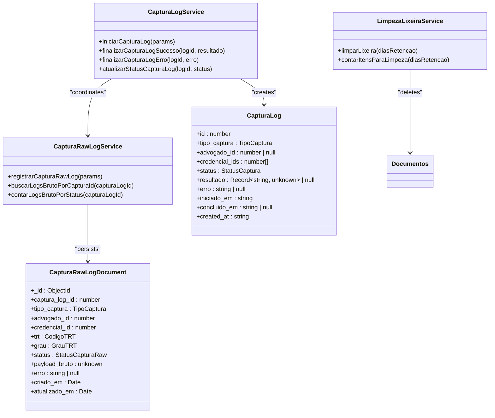
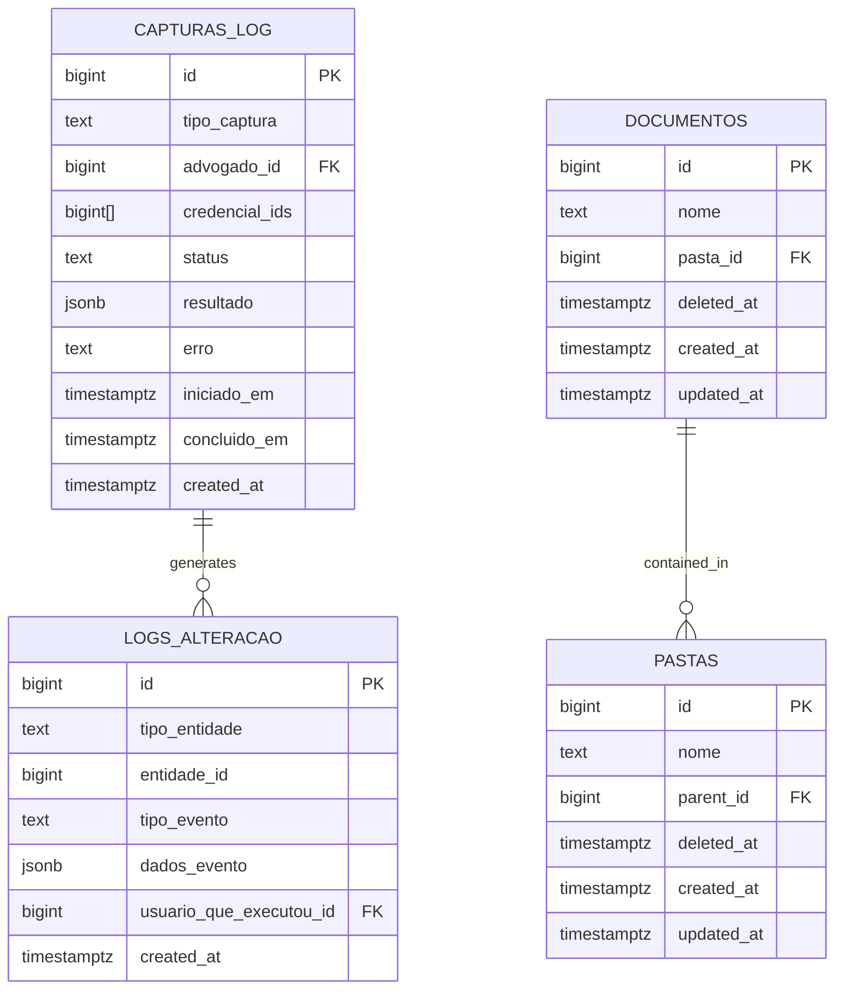
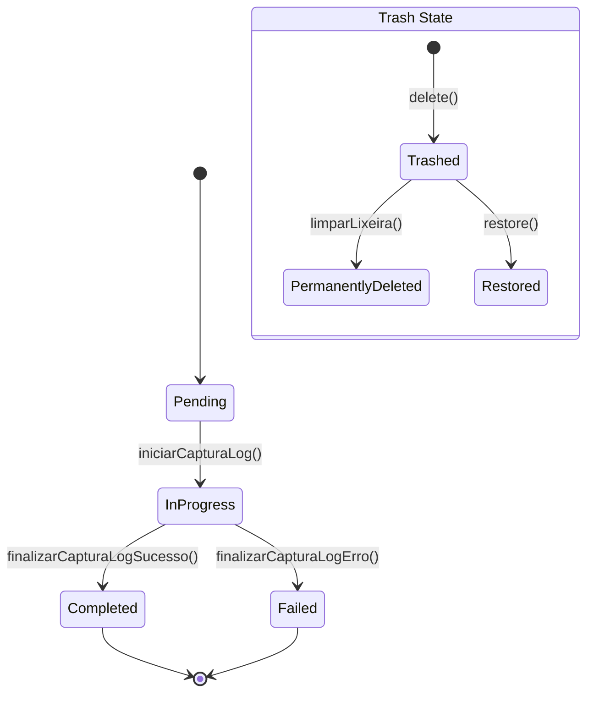
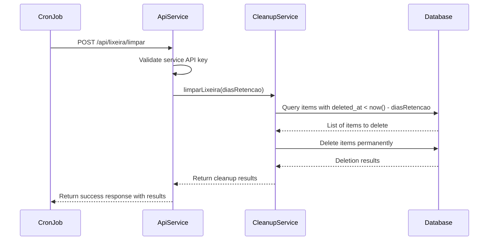
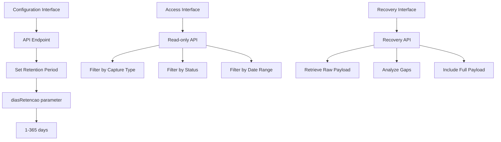
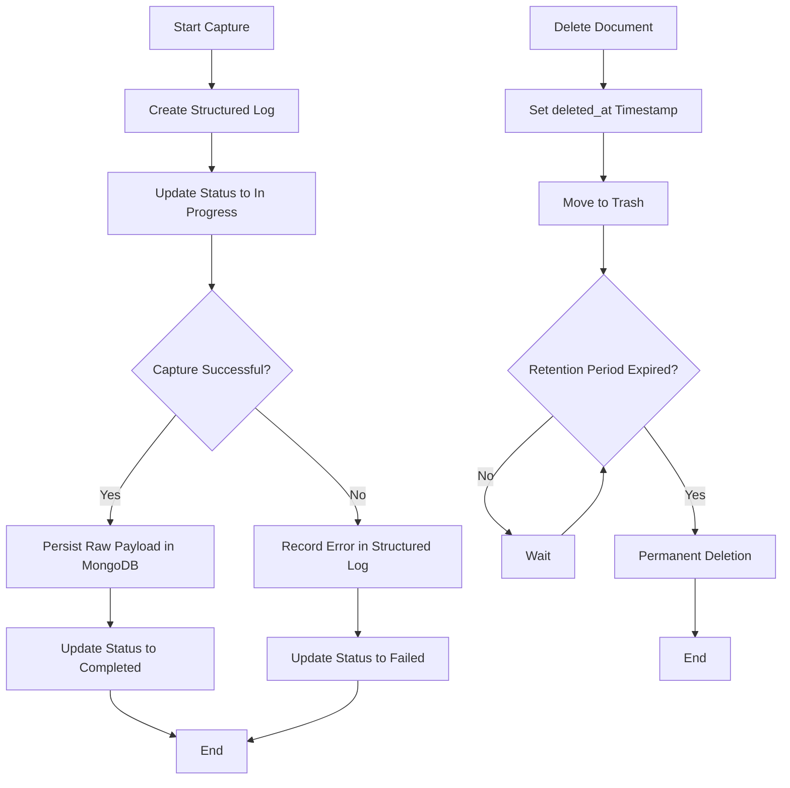
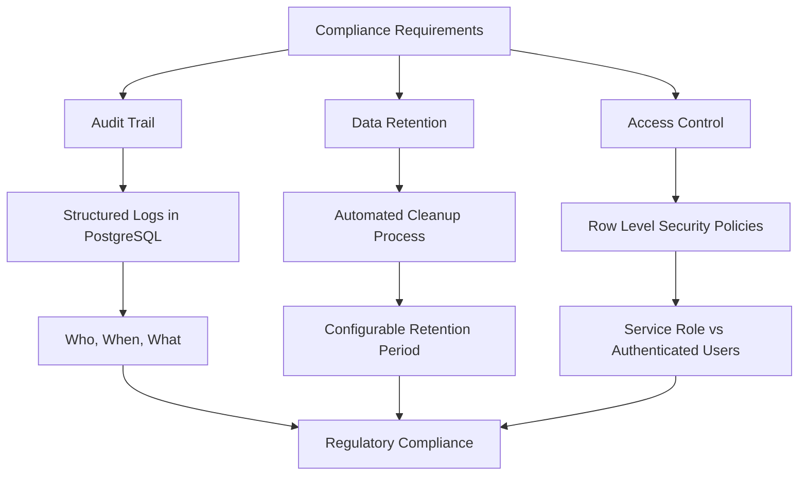
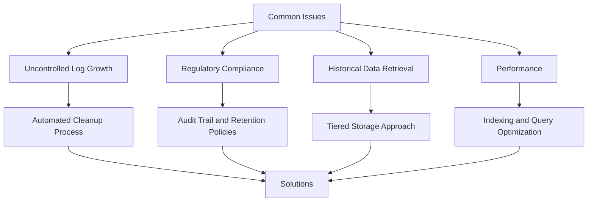

# Log Retention Policies

<cite>
**Referenced Files in This Document**   
- [captura-log.service.ts](file://backend/captura/services/captura-log.service.ts)
- [capturas-log-types.ts](file://backend/types/captura/capturas-log-types.ts)
- [create_capturas_log.sql](file://supabase/migrations/aplicadas/20250120000000_create_capturas_log.sql)
- [captura-raw-log.service.ts](file://backend/captura/services/persistence/captura-raw-log.service.ts)
- [captura-log.ts](file://backend/types/mongodb/captura-log.ts)
- [collections.ts](file://backend/utils/mongodb/collections.ts)
- [limpar-lixeira.service.ts](file://backend/documentos/services/lixeira/limpar-lixeira.service.ts)
- [route.ts](file://app/api/lixeira/limpar/route.ts)
- [logs_alteracao.sql](file://supabase/migrations/aplicadas/20251117015304_create_logs_alteracao.sql)
- [use-recovery-logs.ts](file://app/_lib/hooks/use-recovery-logs.ts)
</cite>

## Table of Contents
1. [Introduction](#introduction)
2. [Core Components](#core-components)
3. [Database Schema and Retention Implementation](#database-schema-and-retention-implementation)
4. [Domain Model for Log Lifecycle Management](#domain-model-for-log-lifecycle-management)
5. [Automated Cleanup and Background Jobs](#automated-cleanup-and-background-jobs)
6. [Configuration and Interfaces](#configuration-and-interfaces)
7. [Data Flow and Processing Logic](#data-flow-and-processing-logic)
8. [Compliance and Monitoring](#compliance-and-monitoring)
9. [Common Issues and Solutions](#common-issues-and-solutions)
10. [Conclusion](#conclusion)

## Introduction

The Sinesys data capture system implements a comprehensive log retention policy to manage the lifecycle of log data across different storage tiers. This documentation details the implementation of log retention policies, focusing on how log data is managed over time, including retention periods, archival strategies, and deletion procedures. The system employs a multi-tiered approach to balance storage costs with debugging needs, ensuring regulatory compliance while maintaining operational efficiency.

The log retention architecture is designed to handle two primary types of logs: structured logs in PostgreSQL for operational monitoring and audit trails, and raw logs in MongoDB for detailed recovery and debugging purposes. The system implements automated cleanup processes to manage the lifecycle of these logs, with configurable retention periods and tiered storage strategies.

**Section sources**
- [captura-log.service.ts](file://backend/captura/services/captura-log.service.ts#L1-L66)
- [capturas-log-types.ts](file://backend/types/captura/capturas-log-types.ts#L1-L94)

## Core Components

The log retention system in Sinesys consists of several core components that work together to manage the lifecycle of log data. These components include the capture log service, raw log persistence, and automated cleanup processes.

The capture log service manages the structured logs in PostgreSQL, recording the status and results of data capture operations. This service provides a clean interface for creating and updating log entries, with methods for marking captures as successful, failed, or in progress. The raw log service, on the other hand, persists the complete payload data in MongoDB, enabling detailed recovery and analysis when needed.

The automated cleanup system handles the deletion of expired data, particularly for items in the document trash. This system runs as a background job, periodically removing items that have exceeded their retention period. The cleanup process is designed to be idempotent and safe, with proper error handling and logging to ensure data integrity.

**Diagram sources **
- [captura-log.service.ts](file://backend/captura/services/captura-log.service.ts#L1-L66)
- [capturas-log-types.ts](file://backend/types/captura/capturas-log-types.ts#L1-L94)
- [captura-raw-log.service.ts](file://backend/captura/services/persistence/captura-raw-log.service.ts#L1-L162)
- [limpar-lixeira.service.ts](file://backend/documentos/services/lixeira/limpar-lixeira.service.ts#L1-L250)

**Section sources**
- [captura-log.service.ts](file://backend/captura/services/captura-log.service.ts#L1-L66)
- [captura-raw-log.service.ts](file://backend/captura/services/persistence/captura-raw-log.service.ts#L1-L162)
- [limpar-lixeira.service.ts](file://backend/documentos/services/lixeira/limpar-lixeira.service.ts#L1-L250)

## Database Schema and Retention Implementation

The log retention policy is implemented through a combination of database schema design and application-level logic. The PostgreSQL database contains the `capturas_log` table, which stores structured information about data capture operations. This table includes fields for the capture type, status, start and completion times, and any error messages that occurred during the capture process.

The schema is designed with appropriate indexes to support efficient querying of log data by various criteria, including capture type, status, and timestamp. The retention policy for these logs is enforced through application logic rather than database-level constraints, allowing for more flexible management of log data.

In addition to the structured logs in PostgreSQL, the system maintains raw logs in MongoDB. These raw logs contain the complete payload data from capture operations, enabling detailed recovery and analysis when needed. The MongoDB collection is indexed to support efficient queries by capture log ID, capture type, and creation timestamp.

**Diagram sources **
- [create_capturas_log.sql](file://supabase/migrations/aplicadas/20250120000000_create_capturas_log.sql#L1-L49)
- [logs_alteracao.sql](file://supabase/migrations/aplicadas/20251117015304_create_logs_alteracao.sql#L1-L52)

**Section sources**
- [create_capturas_log.sql](file://supabase/migrations/aplicadas/20250120000000_create_capturas_log.sql#L1-L49)
- [logs_alteracao.sql](file://supabase/migrations/aplicadas/20251117015304_create_logs_alteracao.sql#L1-L52)

## Domain Model for Log Lifecycle Management

The domain model for log lifecycle management in Sinesys is centered around the concept of structured and raw logs, each with their own lifecycle states. The structured logs in PostgreSQL follow a simple state machine with four primary states: pending, in progress, completed, and failed. These states are represented by the `StatusCaptura` enum in the application code.

The raw logs in MongoDB have a simpler state model with only two states: success and error. This reflects the fact that raw logs are primarily used for recovery and debugging, where the focus is on whether the data was successfully captured or not.

The lifecycle of a log entry begins when a capture operation is initiated. At this point, a structured log entry is created in PostgreSQL with a status of "pending". As the capture progresses, the status is updated to "in progress". When the capture completes, the status is updated to either "completed" or "failed", depending on the outcome. If the capture is successful, the raw payload data is also persisted in MongoDB.

For document management, the system implements a soft delete pattern where deleted items are moved to a trash state rather than being immediately removed. These items remain in the trash for a configurable period (default 30 days) before being permanently deleted by the automated cleanup process.

**Diagram sources **
- [capturas-log-types.ts](file://backend/types/captura/capturas-log-types.ts#L1-L94)
- [limpar-lixeira.service.ts](file://backend/documentos/services/lixeira/limpar-lixeira.service.ts#L1-L250)

**Section sources**
- [capturas-log-types.ts](file://backend/types/captura/capturas-log-types.ts#L1-L94)
- [limpar-lixeira.service.ts](file://backend/documentos/services/lixeira/limpar-lixeira.service.ts#L1-L250)

## Automated Cleanup and Background Jobs

The automated cleanup system in Sinesys is responsible for managing the deletion of expired data, particularly for items in the document trash. This system runs as a background job, typically triggered by a cron schedule, and is designed to be idempotent and safe.

The cleanup process follows a two-phase approach: first, it identifies items that have exceeded their retention period, and then it permanently removes them from the database. The default retention period for items in the trash is 30 days, but this can be configured through the API.

The cleanup job is implemented as an API endpoint that can be called by a scheduled task. This endpoint validates authentication using a service API key, ensuring that only authorized processes can trigger the cleanup. The job logs its progress and results, providing visibility into the cleanup process.

**Diagram sources **
- [route.ts](file://app/api/lixeira/limpar/route.ts#L1-L177)
- [limpar-lixeira.service.ts](file://backend/documentos/services/lixeira/limpar-lixeira.service.ts#L1-L250)

**Section sources**
- [route.ts](file://app/api/lixeira/limpar/route.ts#L1-L177)
- [limpar-lixeira.service.ts](file://backend/documentos/services/lixeira/limpar-lixeira.service.ts#L1-L250)

## Configuration and Interfaces

The log retention system in Sinesys provides several interfaces for configuring retention policies and accessing log data. The primary configuration interface is the API endpoint for the automated cleanup job, which accepts a `diasRetencao` parameter to specify the retention period in days.

The system also provides a read-only API for accessing log data, allowing users to query the history of capture operations and view detailed information about specific logs. This API supports filtering by various criteria, including capture type, status, and date range.

For the raw logs in MongoDB, the system provides a recovery API that allows users to retrieve detailed information about specific capture operations, including the raw payload data. This API is particularly useful for debugging and recovery scenarios.

The configuration options for retention duration are currently limited to the document trash retention period, with a default of 30 days. However, the system is designed to be extensible, allowing for additional configuration options to be added in the future.

**Diagram sources **
- [route.ts](file://app/api/lixeira/limpar/route.ts#L1-L177)
- [use-recovery-logs.ts](file://app/_lib/hooks/use-recovery-logs.ts#L51-L68)

**Section sources**
- [route.ts](file://app/api/lixeira/limpar/route.ts#L1-L177)
- [use-recovery-logs.ts](file://app/_lib/hooks/use-recovery-logs.ts#L51-L68)

## Data Flow and Processing Logic

The data flow for log retention in Sinesys follows a well-defined pattern that begins with the initiation of a capture operation and ends with the eventual cleanup of expired data. When a capture operation is initiated, the system creates a structured log entry in PostgreSQL and begins the capture process.

As the capture progresses, the system updates the status of the log entry and, if successful, persists the raw payload data in MongoDB. This raw data is indexed to support efficient queries and recovery operations. The system also generates detailed logs of the capture process, including information about inserted, updated, and unchanged records.

When a document is deleted, it is not immediately removed from the database. Instead, it is marked as deleted by setting the `deleted_at` timestamp. This soft delete pattern allows users to restore accidentally deleted items within the retention period.

The automated cleanup process periodically scans the database for items that have exceeded their retention period and permanently removes them. This process is designed to be efficient and safe, with proper error handling and logging to ensure data integrity.

**Diagram sources **
- [captura-log.service.ts](file://backend/captura/services/captura-log.service.ts#L1-L66)
- [captura-raw-log.service.ts](file://backend/captura/services/persistence/captura-raw-log.service.ts#L1-L162)
- [limpar-lixeira.service.ts](file://backend/documentos/services/lixeira/limpar-lixeira.service.ts#L1-L250)

**Section sources**
- [captura-log.service.ts](file://backend/captura/services/captura-log.service.ts#L1-L66)
- [captura-raw-log.service.ts](file://backend/captura/services/persistence/captura-raw-log.service.ts#L1-L162)
- [limpar-lixeira.service.ts](file://backend/documentos/services/lixeira/limpar-lixeira.service.ts#L1-L250)

## Compliance and Monitoring

The log retention system in Sinesys is designed to support regulatory compliance and provide monitoring capabilities for system administrators. The structured logs in PostgreSQL serve as an audit trail for all data capture operations, recording who performed the operation, when it was performed, and the outcome.

The system implements Row Level Security (RLS) policies to ensure that only authorized users can access log data. The service role has full access to create and update log entries, while authenticated users can read log data for auditing purposes.

The raw logs in MongoDB provide a detailed record of all capture operations, enabling recovery and forensic analysis when needed. These logs are particularly valuable for compliance scenarios where detailed records of data access and modification are required.

The automated cleanup process includes logging and monitoring capabilities to ensure that data deletion is performed correctly and can be audited. The cleanup job logs its results, including the number of items deleted and any errors that occurred during the process.

**Diagram sources **
- [create_capturas_log.sql](file://supabase/migrations/aplicadas/20250120000000_create_capturas_log.sql#L1-L49)
- [logs_alteracao.sql](file://supabase/migrations/aplicadas/20251117015304_create_logs_alteracao.sql#L1-L52)
- [fix_rls_policies_granular_permissions.sql](file://supabase/migrations/aplicadas/20250120000001_fix_rls_policies_granular_permissions.sql#L276-L311)

**Section sources**
- [create_capturas_log.sql](file://supabase/migrations/aplicadas/20250120000000_create_capturas_log.sql#L1-L49)
- [logs_alteracao.sql](file://supabase/migrations/aplicadas/20251117015304_create_logs_alteracao.sql#L1-L52)
- [fix_rls_policies_granular_permissions.sql](file://supabase/migrations/aplicadas/20250120000001_fix_rls_policies_granular_permissions.sql#L276-L311)

## Common Issues and Solutions

The log retention system in Sinesys addresses several common issues related to data management and storage. One of the primary challenges is uncontrolled log growth, which can quickly consume storage resources and impact system performance. The system addresses this through the automated cleanup process, which regularly removes expired data from the system.

Another common issue is regulatory compliance, particularly in industries with strict data retention requirements. The system's audit trail and configurable retention periods help ensure compliance with these requirements, while the detailed logging capabilities support forensic analysis when needed.

Difficulty in retrieving historical data is another challenge that the system addresses through its tiered storage approach. By maintaining both structured logs in PostgreSQL and raw logs in MongoDB, the system provides multiple ways to access historical data, depending on the level of detail required.

The system also addresses performance considerations by using appropriate indexing and query optimization techniques. The structured logs are indexed to support efficient queries by various criteria, while the raw logs in MongoDB are indexed to support efficient recovery operations.

**Diagram sources **
- [limpar-lixeira.service.ts](file://backend/documentos/services/lixeira/limpar-lixeira.service.ts#L1-L250)
- [create_capturas_log.sql](file://supabase/migrations/aplicadas/20250120000000_create_capturas_log.sql#L1-L49)
- [captura-raw-log.service.ts](file://backend/captura/services/persistence/captura-raw-log.service.ts#L1-L162)

**Section sources**
- [limpar-lixeira.service.ts](file://backend/documentos/services/lixeira/limpar-lixeira.service.ts#L1-L250)
- [create_capturas_log.sql](file://supabase/migrations/aplicadas/20250120000000_create_capturas_log.sql#L1-L49)
- [captura-raw-log.service.ts](file://backend/captura/services/persistence/captura-raw-log.service.ts#L1-L162)

## Conclusion

The log retention policies in the Sinesys data capture system provide a comprehensive solution for managing the lifecycle of log data. By implementing a multi-tiered approach with structured logs in PostgreSQL and raw logs in MongoDB, the system balances storage costs with debugging needs while ensuring regulatory compliance.

The automated cleanup process effectively manages the deletion of expired data, preventing uncontrolled log growth and maintaining system performance. The configurable retention periods and detailed audit trail support compliance with regulatory requirements, while the tiered storage approach enables efficient retrieval of historical data when needed.

The system's design emphasizes safety and reliability, with proper error handling, logging, and access control mechanisms. The use of Row Level Security policies ensures that only authorized users can access log data, while the service role has the necessary permissions to manage the logs.

Overall, the log retention system in Sinesys provides a robust foundation for managing log data throughout its lifecycle, from creation to eventual deletion. The system's modular design and clear interfaces make it easy to extend and adapt to changing requirements, ensuring that it can continue to meet the needs of the organization as it grows.

[No sources needed since this section summarizes without analyzing specific files]