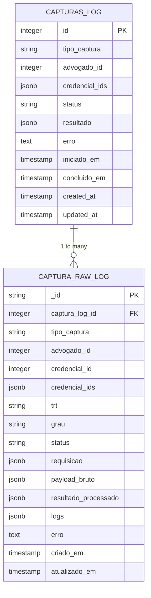
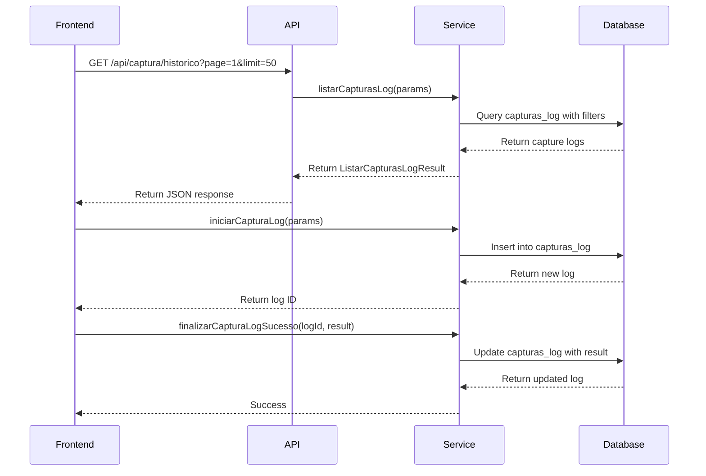
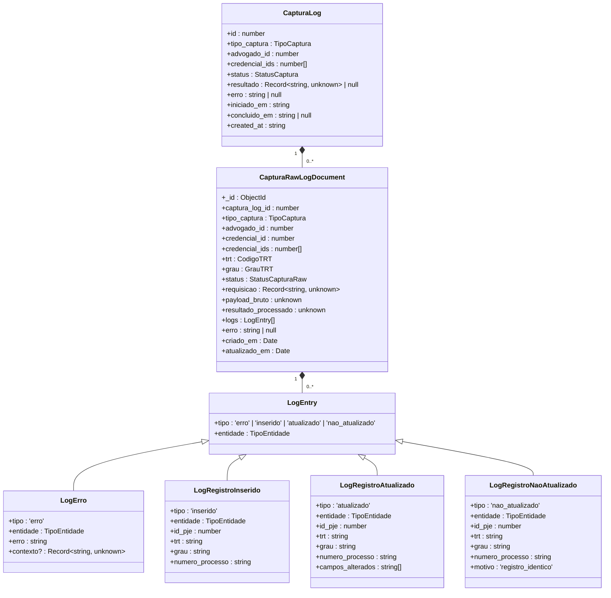
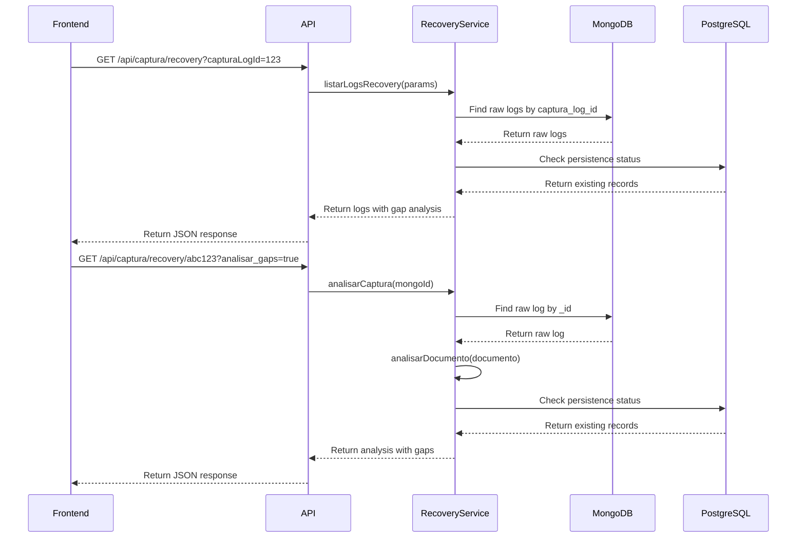

# Log Structure

<cite>
**Referenced Files in This Document**   
- [captura-log.service.ts](file://backend/captura/services/captura-log.service.ts)
- [captura-log-persistence.service.ts](file://backend/captura/services/persistence/captura-log-persistence.service.ts)
- [captura-raw-log.service.ts](file://backend/captura/services/persistence/captura-raw-log.service.ts)
- [capturas-log-types.ts](file://backend/types/captura/capturas-log-types.ts)
- [captura-log.ts](file://backend/types/mongodb/captura-log.ts)
- [capture-log.service.ts](file://backend/captura/services/persistence/capture-log.service.ts)
- [use-capturas-log.ts](file://app/_lib/hooks/use-capturas-log.ts)
- [use-recovery-logs.ts](file://app/_lib/hooks/use-recovery-logs.ts)
- [recovery-analysis.service.ts](file://backend/captura/services/recovery/recovery-analysis.service.ts)
- [types.ts](file://backend/captura/services/recovery/types.ts)
- [route.ts](file://app/api/captura/recovery/route.ts)
- [route.ts](file://app/api/captura/recovery/[mongoId]/route.ts)
- [recovery-section.tsx](file://app/(dashboard)/captura/historico/[id]/components/recovery-section.tsx)
- [dashboard-metricas.persistence.ts](file://backend/dashboard/services/persistence/dashboard-metricas.persistence.ts)
</cite>

## Table of Contents
1. [Introduction](#introduction)
2. [Log Entry Schema](#log-entry-schema)
3. [Log Creation and Retrieval Interfaces](#log-creation-and-retrieval-interfaces)
4. [Domain Model and Hierarchical Context](#domain-model-and-hierarchical-context)
5. [Usage Patterns and Examples](#usage-patterns-and-examples)
6. [Configuration and Formatting Options](#configuration-and-formatting-options)
7. [Integration with Recovery Analysis System](#integration-with-recovery-analysis-system)
8. [Monitoring Dashboard Integration](#monitoring-dashboard-integration)
9. [Common Issues and Solutions](#common-issues-and-solutions)
10. [Conclusion](#conclusion)

## Introduction

The Sinesys data capture system implements a comprehensive logging architecture designed to track and analyze the success and failure of data capture operations from various sources. The logging system is built around two primary components: a PostgreSQL-based capture log for high-level tracking and a MongoDB-based raw log for detailed, structured data storage. This dual-layer approach enables efficient querying of capture status while preserving the complete context of each operation for recovery and analysis purposes.

The system captures data from multiple sources including acervo geral, arquivados, audiencias, pendentes, and partes, with each capture operation generating detailed logs that include timestamps, correlation IDs, capture session IDs, error types, and structured metadata. The logs serve as the foundation for the recovery analysis system, which identifies failure patterns and enables reprocessing of failed captures, as well as the monitoring dashboard that visualizes log trends and system performance.

This document provides a detailed analysis of the log structure implementation, covering the schema design, interfaces for log creation and retrieval, domain model for log data, usage patterns across different capture scenarios, configuration options, and integration with downstream systems.

**Section sources**
- [captura-log.service.ts](file://backend/captura/services/captura-log.service.ts#L1-L66)
- [captura-raw-log.service.ts](file://backend/captura/services/persistence/captura-raw-log.service.ts#L1-L162)

## Log Entry Schema

The Sinesys logging system implements a comprehensive schema with two distinct layers: a high-level capture log in PostgreSQL and a detailed raw log in MongoDB. The PostgreSQL capture log (capturas_log table) serves as the primary tracking mechanism for capture operations, containing essential metadata about each capture session. This table includes fields such as id (primary key), tipo_captura (capture type), advogado_id (lawyer ID), credencial_ids (credential IDs), status (capture status), resultado (result data), erro (error message), iniciado_em (start timestamp), concluido_em (completion timestamp), created_at (creation timestamp), and updated_at (update timestamp).

The MongoDB raw log (captura_logs_brutos collection) provides a detailed, structured record of each capture operation, preserving the complete context for recovery and analysis. The schema for this collection is defined by the CapturaRawLogDocument interface and includes fields such as _id (MongoDB ObjectId), captura_log_id (reference to PostgreSQL log), tipo_captura (capture type), advogado_id (lawyer ID), credencial_id (credential ID), trt (TRT code), grau (court level), status (raw capture status), requisicao (request data), payload_bruto (raw PJE response), resultado_processado (processed result), logs (structured log entries), erro (error details), criado_em (creation timestamp), and atualizado_em (update timestamp).

The structured log entries within the logs array follow a well-defined schema with four primary types: 'erro' (error), 'inserido' (inserted), 'atualizado' (updated), and 'nao_atualizado' (not updated). Each log entry includes a tipo field indicating the operation type, an entidade field specifying the entity type (acervo, audiencias, expedientes, auth, partes, or timeline), and additional context-specific fields. For example, error entries include an erro field with the error message and an optional contexto field with additional context, while update entries include a campos_alterados field listing the changed fields.



**Diagram sources**
- [capturas-log-types.ts](file://backend/types/captura/capturas-log-types.ts#L39-L50)
- [captura-log.ts](file://backend/types/mongodb/captura-log.ts#L12-L54)
- [capture-log.service.ts](file://backend/captura/services/persistence/capture-log.service.ts#L42-L46)

**Section sources**
- [capturas-log-types.ts](file://backend/types/captura/capturas-log-types.ts#L39-L94)
- [captura-log.ts](file://backend/types/mongodb/captura-log.ts#L1-L80)
- [capture-log.service.ts](file://backend/captura/services/persistence/capture-log.service.ts#L1-L197)

## Log Creation and Retrieval Interfaces

The Sinesys logging system provides a comprehensive set of interfaces for creating and retrieving log entries, implemented through a combination of service functions and API endpoints. The primary interface for log creation is the captura-log.service.ts file, which exports several functions for managing the lifecycle of a capture log. The iniciarCapturaLog function creates a new capture log entry with a specified type, lawyer ID, and credential IDs, returning the generated log ID. This function serves as the entry point for all capture operations, establishing the correlation between the capture session and its log entries.

For updating log entries, the system provides three specialized functions: finalizarCapturaLogSucesso for marking a capture as completed with a result object, finalizarCapturaLogErro for marking a capture as failed with an error message, and atualizarStatusCapturaLog for updating the status during the capture process. These functions abstract the underlying persistence operations, ensuring consistent updates to the PostgreSQL database through the captura-log-persistence.service.ts module.

The retrieval interfaces are implemented through both backend services and frontend hooks. The backend provides the listarCapturasLog function, which supports filtering by various parameters including capture type, lawyer ID, status, and date range, with pagination support. This function is exposed through the /api/captura/historico API endpoint, which accepts query parameters for all filter options and returns a structured response with the capture logs and pagination metadata.

On the frontend, the useCapturasLog hook provides a React hook interface for consuming the capture log data in the UI. This hook encapsulates the API call logic, handling loading states, errors, and pagination, and returns a structured result with the capture logs, pagination information, and a refetch function. Similarly, the useRecoveryLogs hook provides access to the raw logs in MongoDB, with additional filtering options for TRT, court level, and status, as well as the option to include statistics in the response.



**Diagram sources**
- [captura-log.service.ts](file://backend/captura/services/captura-log.service.ts#L16-L64)
- [captura-log-persistence.service.ts](file://backend/captura/services/persistence/captura-log-persistence.service.ts#L119-L178)
- [use-capturas-log.ts](file://app/_lib/hooks/use-capturas-log.ts#L1-L120)

**Section sources**
- [captura-log.service.ts](file://backend/captura/services/captura-log.service.ts#L16-L64)
- [captura-log-persistence.service.ts](file://backend/captura/services/persistence/captura-log-persistence.service.ts#L16-L199)
- [use-capturas-log.ts](file://app/_lib/hooks/use-capturas-log.ts#L1-L120)
- [use-recovery-logs.ts](file://app/_lib/hooks/use-recovery-logs.ts#L1-L162)

## Domain Model and Hierarchical Context

The Sinesys logging system implements a sophisticated domain model that preserves hierarchical context across the capture process, enabling comprehensive analysis and recovery of failed operations. The model is structured around a parent-child relationship between the PostgreSQL capture log and the MongoDB raw logs, where each capture log entry in PostgreSQL can have multiple corresponding raw log entries in MongoDB. This relationship is established through the captura_log_id field in the MongoDB document, which references the ID of the corresponding PostgreSQL log entry.

The hierarchical context is preserved through several mechanisms. First, the capture log entry in PostgreSQL contains high-level information about the capture session, including the type of capture, the lawyer and credentials used, and the overall status and result. This serves as the root context for all related operations. Second, each raw log entry in MongoDB contains detailed information about a specific operation within the capture session, including the request data, raw response from the PJE system, processed result, and structured log entries. This preserves the complete context of each operation, enabling precise recovery and analysis.

The structured log entries within the logs array provide an additional layer of context, capturing the specific operations performed during the capture process. These entries are typed and include entity-specific information, such as the ID and number of the process being processed, the fields that were changed, and the reason for non-updates. This hierarchical structure enables the system to answer questions at multiple levels of granularity, from high-level capture success rates to detailed analysis of individual operation failures.

The domain model also includes specialized types for different capture scenarios, such as the ResultadoCapturaPartes interface for parts capture, which includes detailed statistics about the number of processes, parts, clients, opposing parties, third parties, representatives, and links created. This specialized result structure preserves the context of the capture operation, enabling detailed analysis of the capture effectiveness and identification of patterns in data availability.



**Diagram sources**
- [capturas-log-types.ts](file://backend/types/captura/capturas-log-types.ts#L39-L50)
- [captura-log.ts](file://backend/types/mongodb/captura-log.ts#L12-L54)
- [capture-log.service.ts](file://backend/captura/services/persistence/capture-log.service.ts#L42-L46)

**Section sources**
- [capturas-log-types.ts](file://backend/types/captura/capturas-log-types.ts#L18-L34)
- [captura-log.ts](file://backend/types/mongodb/captura-log.ts#L12-L80)
- [capture-log.service.ts](file://backend/captura/services/persistence/capture-log.service.ts#L42-L46)

## Usage Patterns and Examples

The Sinesys logging system implements consistent usage patterns across different capture scenarios, with specific examples demonstrating how log entries are structured for various error types and successful operations. The system follows a standardized pattern for all capture operations: initiating a capture log, performing the capture operations with structured logging, and finalizing the log with either success or failure status.

For authentication failures, the system creates a capture log entry with status 'failed' and includes a detailed error message in the erro field. The raw log entry in MongoDB includes the request data that was used for authentication, allowing for analysis of the failure cause. For example, when a credential is invalid, the log entry includes the credential ID and the specific error message from the authentication service, enabling quick identification and resolution of the issue.

Network timeouts are handled by creating a capture log entry with status 'failed' and a specific error message indicating the timeout. The raw log entry includes the request data and the duration of the operation before the timeout, providing context for performance analysis. The system also logs the specific endpoint that timed out, enabling identification of problematic services or network paths.

Parsing errors are captured with detailed context about the data that failed to parse. When processing the raw response from the PJE system, if a parsing error occurs, the system creates a structured log entry with tipo 'erro', the entidade that was being processed, and a detailed error message describing the parsing issue. The contexto field includes the raw data that failed to parse, enabling developers to reproduce and fix the parsing logic.

For successful operations, the system creates structured log entries for each significant operation, such as inserting or updating records. For example, when processing parts data, the system creates 'inserido' log entries for new parts, 'atualizado' entries for updated parts, and 'nao_atualizado' entries for parts that were identical to existing records. This detailed logging enables verification of data integrity and identification of data quality issues.

The ResultadoCapturaPartes interface provides a concrete example of how structured metadata is used to capture detailed information about a capture operation. This result object includes counts of various entities processed, such as total_processos, total_partes, clientes, partes_contrarias, terceiros, representantes, and vinculos, as well as performance metrics like duracao_ms and mongodb_ids. This comprehensive result structure enables detailed analysis of capture effectiveness and identification of patterns in data availability.

**Section sources**
- [captura-log.service.ts](file://backend/captura/services/captura-log.service.ts#L43-L52)
- [captura-raw-log.service.ts](file://backend/captura/services/persistence/captura-raw-log.service.ts#L58-L115)
- [capturas-log-types.ts](file://backend/types/captura/capturas-log-types.ts#L18-L34)
- [capture-log.service.ts](file://backend/captura/services/persistence/capture-log.service.ts#L117-L128)

## Configuration and Formatting Options

The Sinesys logging system provides several configuration options for log formatting and custom field inclusion, implemented through parameterized functions and configurable service classes. The primary configuration options are exposed through the parameters of the logging functions and the structure of the log entry types.

For log creation, the CriarCapturaLogParams interface defines the configurable fields for a new capture log, including required fields like tipo_captura, advogado_id, and credencial_ids, and an optional status field that defaults to 'pending'. This allows callers to specify the initial state of the capture log, enabling different workflows for immediate processing versus scheduled captures.

The AtualizarCapturaLogParams interface provides configuration options for updating a capture log, with optional fields for status, resultado, erro, and concluido_em. This flexibility allows for partial updates to the log entry, enabling incremental updates during long-running capture operations. The resultado field accepts a generic Record<string, unknown> type, allowing for custom result structures specific to each capture type.

For the raw logs in MongoDB, the RegistrarCapturaRawLogParams interface extends the base CapturaRawLogCreate type with an optional status field, allowing callers to specify the initial status of the raw log entry. The system also provides configuration options for the structured log entries through the LogEntry union type, which supports different types of operations with entity-specific context.

The system implements automatic context injection through the CaptureLogService class, which maintains a buffer of log entries and provides methods for creating different types of log entries with consistent formatting. This service automatically includes contextual information like the current timestamp and entity type, ensuring consistent log formatting across different capture scenarios.

The recovery analysis system provides additional configuration options through query parameters, allowing clients to customize the response format and content. For example, the /api/captura/recovery endpoint accepts an incluir_estatisticas parameter that, when true, includes aggregated statistics in the response. Similarly, the /api/captura/recovery/[mongoId] endpoint accepts analisar_gaps and incluir_payload parameters that control whether gap analysis is performed and whether the raw payload is included in the response.

**Section sources**
- [capturas-log-types.ts](file://backend/types/captura/capturas-log-types.ts#L55-L70)
- [captura-log.ts](file://backend/types/mongodb/captura-log.ts#L56-L57)
- [capture-log.service.ts](file://backend/captura/services/persistence/capture-log.service.ts#L48-L197)
- [route.ts](file://app/api/captura/recovery/route.ts#L197-L224)
- [route.ts](file://app/api/captura/recovery/[mongoId]/route.ts#L171-L204)

## Integration with Recovery Analysis System

The Sinesys logging system is tightly integrated with the recovery analysis system, which uses log data to identify failure patterns and enable reprocessing of failed captures. This integration is implemented through a combination of data structures, services, and API endpoints that expose the raw log data for analysis and recovery operations.

The recovery analysis system uses the raw log data in MongoDB to identify gaps in data persistence, such as missing addresses, parties, or representatives that were present in the raw PJE response but not successfully persisted to the PostgreSQL database. The system analyzes the payload_bruto field of the raw log entries to extract the complete context of each capture operation, comparing it with the data in the PostgreSQL database to identify discrepancies.

The recovery analysis service provides several key functions for this purpose. The analisarCaptura function performs a comprehensive analysis of a single raw log entry, identifying gaps in data persistence and generating a detailed report of the findings. This function returns an AnaliseCaptura object that includes information about the process, totals of elements found versus persisted, and lists of missing elements that can be reprocessed.

The system also provides functions for reprocessing identified gaps, such as the reprocessarElementos function that takes a list of MongoDB document IDs and reprocesses the missing elements. This function uses the payload_bruto field to extract the missing data and attempts to persist it to the PostgreSQL database, logging the results of each reprocessing attempt.

The API endpoints for the recovery analysis system expose these functions to the frontend, enabling users to view and manage recovery operations through the dashboard. The /api/captura/recovery endpoint provides a list of raw log entries with filtering and pagination, while the /api/captura/recovery/[mongoId] endpoint provides detailed analysis of a specific log entry, including gap analysis and the option to include the raw payload.



**Diagram sources**
- [types.ts](file://backend/captura/services/recovery/types.ts#L148-L169)
- [recovery-analysis.service.ts](file://backend/captura/services/recovery/recovery-analysis.service.ts#L53-L93)
- [route.ts](file://app/api/captura/recovery/route.ts#L192-L229)
- [route.ts](file://app/api/captura/recovery/[mongoId]/route.ts#L170-L206)

**Section sources**
- [types.ts](file://backend/captura/services/recovery/types.ts#L148-L169)
- [recovery-analysis.service.ts](file://backend/captura/services/recovery/recovery-analysis.service.ts#L53-L93)
- [route.ts](file://app/api/captura/recovery/route.ts#L192-L239)
- [route.ts](file://app/api/captura/recovery/[mongoId]/route.ts#L170-L215)
- [recovery-section.tsx](file://app/(dashboard)/captura/historico/[id]/components/recovery-section.tsx#L124-L232)

## Monitoring Dashboard Integration

The Sinesys logging system integrates with the monitoring dashboard to visualize log trends and system performance, providing insights into capture success rates, error patterns, and system health. This integration is implemented through specialized API endpoints and frontend components that consume and display the log data in a user-friendly format.

The dashboard integration is centered around the /api/dashboard/capturas endpoint, which provides aggregated metrics about capture operations. This endpoint returns data that is used to populate various widgets on the dashboard, including charts showing capture success rates over time, tables listing recent capture operations, and summary statistics about capture volume and performance.

The dashboard displays several key metrics derived from the log data, including the total number of capture operations, the number of successful and failed captures, the distribution of captures by type, and the average duration of capture operations. These metrics are calculated by querying the capturas_log table in PostgreSQL and aggregating the results by various dimensions such as date, capture type, and lawyer.

The dashboard also provides drill-down capabilities, allowing users to click on a specific capture operation to view detailed logs and analysis. This is implemented through the /api/captura/historico/[id] endpoint, which returns detailed information about a specific capture log entry, including the associated raw logs from MongoDB and the results of any recovery analysis.

The recovery analysis system is also integrated into the dashboard, with a dedicated section for viewing and managing recovery operations. This section displays a list of raw log entries with gaps identified, allowing users to select specific entries for reprocessing. The dashboard also provides visualizations of gap patterns, such as the distribution of gaps by TRT and court level, enabling identification of systemic issues in data capture.

```mermaid
flowchart TD
A[Dashboard] --> B[Fetch Metrics]
B --> C[/api/dashboard/capturas]
C --> D[Aggregate Data]
D --> E[Display Charts and Stats]
A --> F[View Capture Details]
F --> G[/api/captura/historico/[id]]
G --> H[Fetch Capture Log]
H --> I[Fetch Raw Logs]
I --> J[Display Detailed Logs]
A --> K[View Recovery Analysis]
K --> L[/api/captura/recovery]
L --> M[Fetch Raw Logs with Gaps]
M --> N[Display Gap Analysis]
N --> O[Reprocess Gaps]
O --> P[/api/captura/recovery/reprocessar]
P --> Q[Update Database]
Q --> R[Update Dashboard]
```

**Diagram sources**
- [dashboard-metricas.persistence.ts](file://backend/dashboard/services/persistence/dashboard-metricas.persistence.ts#L1-L50)
- [route.ts](file://app/api/dashboard/capturas/route.ts#L51-L93)
- [recovery-section.tsx](file://app/(dashboard)/captura/historico/[id]/components/recovery-section.tsx#L198-L232)

**Section sources**
- [dashboard-metricas.persistence.ts](file://backend/dashboard/services/persistence/dashboard-metricas.persistence.ts#L1-L50)
- [route.ts](file://app/api/dashboard/capturas/route.ts#L51-L93)
- [recovery-section.tsx](file://app/(dashboard)/captura/historico/[id]/components/recovery-section.tsx#L198-L232)

## Common Issues and Solutions

The Sinesys logging system addresses several common issues in logging and data capture through standardized solutions and best practices. These issues include inconsistent log formats, missing contextual information, and performance overhead from excessive logging, each of which is addressed through specific design patterns and implementation choices.

Inconsistent log formats are prevented through the use of standardized log templates and type definitions. The system defines strict interfaces for log entries, such as the LogEntry union type and the CapturaRawLogDocument interface, which enforce consistent field names and data types across all log entries. This ensures that all log data is structured and queryable, regardless of the source or capture type.

Missing contextual information is addressed through automatic context injection and hierarchical logging. The CaptureLogService class automatically includes contextual information like entity type and process number in each log entry, ensuring that all entries have the necessary context for analysis. The hierarchical relationship between the PostgreSQL capture log and the MongoDB raw logs preserves the complete context of each capture operation, from high-level session information to detailed operation data.

Performance overhead from excessive logging is mitigated through asynchronous logging and selective data storage. The system uses MongoDB for raw log storage, which provides high write performance and scalability for large volumes of log data. The raw logs are stored with a TTL (time-to-live) policy, automatically removing old logs to manage storage costs. Additionally, the system provides configuration options to control the level of detail in log entries, allowing for reduced logging in production environments.

The system also implements solutions for specific error scenarios, such as handling errors that occur before the capture log is created. In these cases, the system uses a special captura_log_id value of -1 to indicate that the error occurred before the PostgreSQL log entry was created, allowing for consistent error reporting even in failure scenarios.

Another common issue addressed by the system is the need for recovery from failed captures. The detailed raw logs in MongoDB, including the complete payload from the PJE system, enable reprocessing of failed captures without requiring a new request to the external system. This reduces load on external systems and improves data availability, as failed captures can be retried with the original data.

**Section sources**
- [capture-log.service.ts](file://backend/captura/services/persistence/capture-log.service.ts#L48-L197)
- [captura-raw-log.service.ts](file://backend/captura/services/persistence/captura-raw-log.service.ts#L63-L67)
- [captura-log.ts](file://backend/types/mongodb/captura-log.ts#L16-L17)
- [recovery-analysis.service.ts](file://backend/captura/services/recovery/recovery-analysis.service.ts#L65-L69)

## Conclusion

The Sinesys data capture system implements a comprehensive and robust logging architecture that effectively addresses the challenges of tracking, analyzing, and recovering from data capture operations. The dual-layer approach of using PostgreSQL for high-level tracking and MongoDB for detailed raw logs provides a balance between query performance and data completeness, enabling efficient monitoring and in-depth analysis.

The system's well-defined log entry schema, with standardized fields for timestamp, correlation ID, capture session ID, error type, and structured metadata, ensures consistency and queryability across all capture scenarios. The interfaces for creating and retrieving log entries are designed for ease of use while providing the flexibility needed for different capture workflows.

The domain model effectively preserves hierarchical context through the parent-child relationship between capture logs and raw logs, enabling comprehensive analysis of capture operations at multiple levels of granularity. The usage patterns demonstrated for different error types show how the system provides detailed, actionable information for debugging and resolution.

The integration with the recovery analysis system and monitoring dashboard demonstrates how the log data is used to identify failure patterns, enable reprocessing of failed captures, and visualize system performance. The solutions for common issues like inconsistent log formats, missing contextual information, and performance overhead show how the system is designed for reliability and maintainability in production environments.

Overall, the Sinesys logging system provides a solid foundation for data capture operations, ensuring data integrity, enabling effective monitoring and analysis, and supporting recovery from failures. The design choices reflect a deep understanding of the challenges in data capture systems and provide a scalable, maintainable solution for logging and analysis.

[No sources needed since this section summarizes without analyzing specific files]