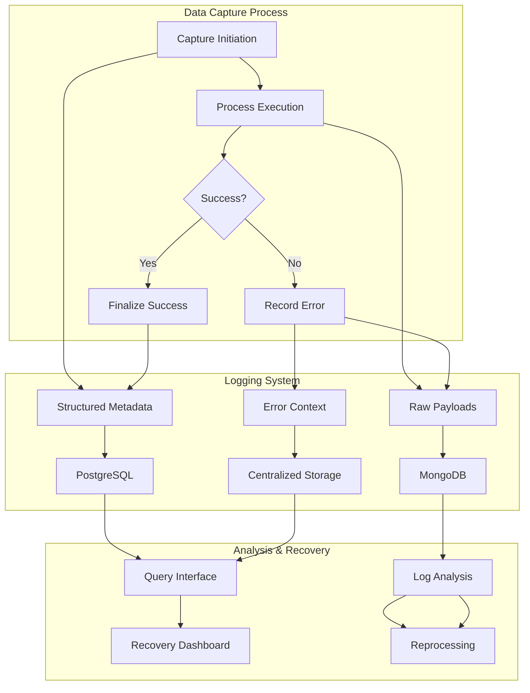
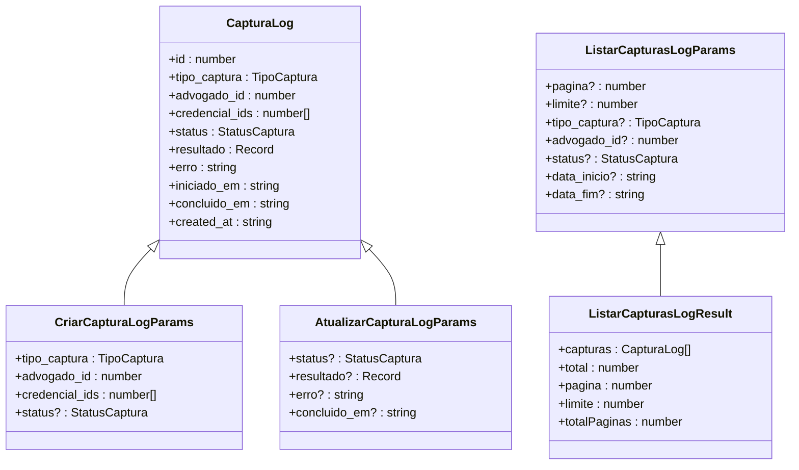
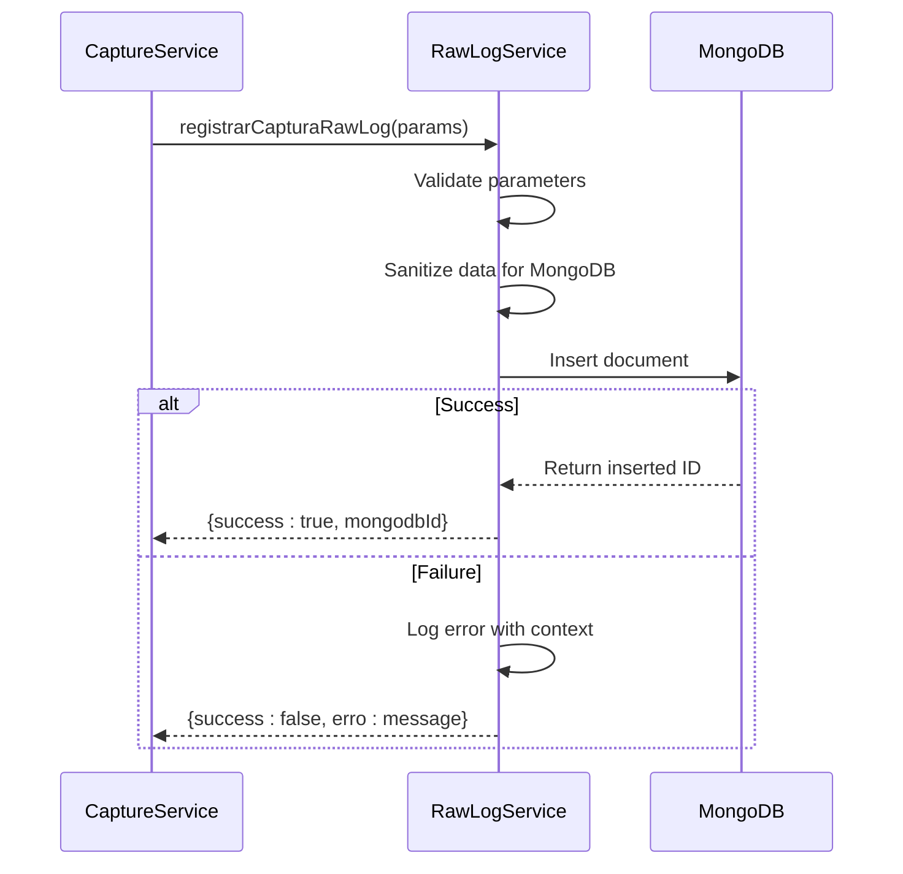
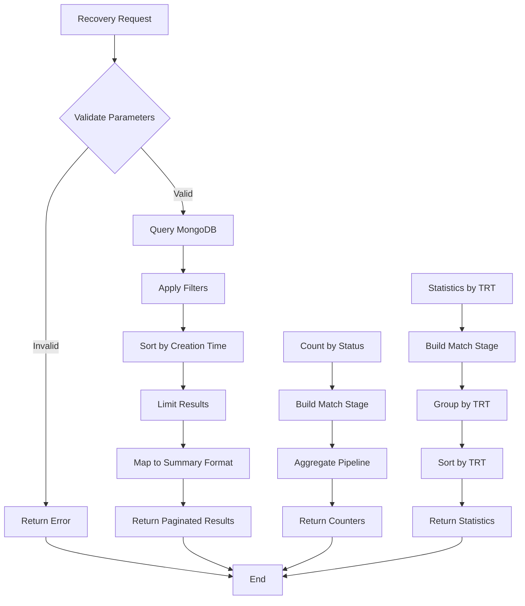
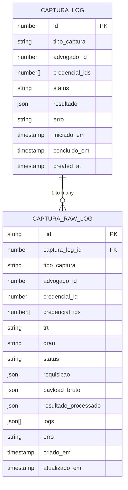

# Logging Strategy

<cite>
**Referenced Files in This Document**   
- [captura-log-persistence.service.ts](file://backend/captura/services/persistence/captura-log-persistence.service.ts)
- [captura-log.service.ts](file://backend/captura/services/captura-log.service.ts)
- [captura-raw-log.service.ts](file://backend/captura/services/persistence/captura-raw-log.service.ts)
- [captura-recovery.service.ts](file://backend/captura/services/recovery/captura-recovery.service.ts)
- [capture-log.service.ts](file://backend/captura/services/persistence/capture-log.service.ts)
- [capturas-log-types.ts](file://backend/types/captura/capturas-log-types.ts)
- [captura-log.ts](file://backend/types/mongodb/captura-log.ts)
- [logger.ts](file://backend/utils/logger/index.ts)
- [logger.ts](file://backend/assinatura-digital/services/logger.ts)
</cite>

## Table of Contents
1. [Introduction](#introduction)
2. [Core Components](#core-components)
3. [Architecture Overview](#architecture-overview)
4. [Detailed Component Analysis](#detailed-component-analysis)
5. [Domain Model for Log Entries](#domain-model-for-log-entries)
6. [Error Handling and Recovery](#error-handling-and-recovery)
7. [Configuration and Parameters](#configuration-and-parameters)
8. [Common Issues and Solutions](#common-issues-and-solutions)
9. [Integration with Other Systems](#integration-with-other-systems)
10. [Best Practices](#best-practices)

## Introduction
The Sinesys data capture system implements a comprehensive logging strategy designed to capture, structure, and store error events for analysis and recovery. This documentation details the implementation of the `captura-log-persistence.service` and the centralized logging system that handles error information throughout the data capture process. The logging infrastructure is built to provide detailed context for troubleshooting, support recovery operations, and enable analysis of failure patterns across the system.

The logging strategy employs a dual-layer approach with both PostgreSQL and MongoDB storage, allowing for structured querying of capture metadata while preserving raw JSON payloads for detailed forensic analysis. This design enables the system to handle complex error scenarios, maintain audit trails, and support reprocessing of failed captures when necessary.

**Section sources**
- [captura-log-persistence.service.ts](file://backend/captura/services/persistence/captura-log-persistence.service.ts#L1-L199)
- [captura-raw-log.service.ts](file://backend/captura/services/persistence/captura-raw-log.service.ts#L1-L162)

## Core Components
The logging system in Sinesys consists of several key components that work together to capture, persist, and analyze error information. The core services include the `captura-log-persistence.service` which manages the PostgreSQL records of capture attempts, and the `captura-raw-log.service` which stores detailed raw data in MongoDB. These services are coordinated through the `captura-log.service` which provides a high-level interface for initiating and finalizing capture logs.

The system also includes a recovery service that enables analysis of failed captures and supports reprocessing operations. This recovery functionality is critical for maintaining data integrity when capture attempts fail due to transient errors or authentication issues. The logging components are designed to work seamlessly with the data capture workflow, automatically recording relevant context such as timestamps, correlation IDs, and error details.

**Section sources**
- [captura-log.service.ts](file://backend/captura/services/captura-log.service.ts#L1-L66)
- [captura-recovery.service.ts](file://backend/captura/services/recovery/captura-recovery.service.ts#L1-L395)
- [capture-log.service.ts](file://backend/captura/services/persistence/capture-log.service.ts#L166-L195)

## Architecture Overview
The logging architecture in Sinesys follows a centralized pattern with dual storage backends to optimize for both query performance and data fidelity. The system captures error events at multiple levels of the data capture process, structuring them for efficient storage and retrieval.

**Diagram sources**
- [captura-log-persistence.service.ts](file://backend/captura/services/persistence/captura-log-persistence.service.ts#L1-L199)
- [captura-raw-log.service.ts](file://backend/captura/services/persistence/captura-raw-log.service.ts#L1-L162)
- [captura-recovery.service.ts](file://backend/captura/services/recovery/captura-recovery.service.ts#L1-L395)

## Detailed Component Analysis

### captura-log-persistence.service Analysis
The `captura-log-persistence.service` is responsible for managing the lifecycle of capture logs in the PostgreSQL database. This service provides CRUD operations for capture records, including creation, updating, retrieval, and deletion. Each capture log contains metadata about the capture attempt, including its status, type, associated credentials, and execution results.

The service implements comprehensive error handling to ensure data consistency and provides detailed error messages when operations fail. It also supports pagination and filtering for efficient querying of historical capture records. The implementation uses Supabase as the database client, leveraging its type-safe query builder for reliable database interactions.

**Diagram sources**
- [captura-log-persistence.service.ts](file://backend/captura/services/persistence/captura-log-persistence.service.ts#L1-L199)
- [capturas-log-types.ts](file://backend/types/captura/capturas-log-types.ts#L1-L94)

### captura-raw-log.service Analysis
The `captura-raw-log.service` handles the persistence of detailed capture data in MongoDB, storing the raw payloads and comprehensive context for each capture attempt. This service is critical for recovery operations, as it preserves the complete state of each capture, including request parameters, raw responses from external systems, and processing logs.

The implementation includes sanitization logic to ensure compatibility with MongoDB by converting incompatible types like BigInt to strings. It also implements validation to prevent the storage of incomplete or malformed records. The service provides methods for counting logs by status and retrieving logs by capture ID, enabling efficient analysis of capture patterns and failure rates.

**Diagram sources**
- [captura-raw-log.service.ts](file://backend/captura/services/persistence/captura-raw-log.service.ts#L1-L162)
- [captura-log.ts](file://backend/types/mongodb/captura-log.ts#L1-L80)

### captura-recovery.service Analysis
The `captura-recovery.service` provides functionality for analyzing and recovering from failed capture attempts. This service enables the system to identify gaps in captured data, verify payload availability, and support reprocessing operations. It serves as the foundation for the recovery dashboard and analysis tools.

The service implements comprehensive querying capabilities, allowing for filtering by various criteria such as capture type, status, tribunal code, and date range. It also provides statistical functions to analyze capture success rates and identify patterns in failures. The recovery service works in conjunction with the raw log service to provide a complete picture of capture attempts and their outcomes.

**Diagram sources**
- [captura-recovery.service.ts](file://backend/captura/services/recovery/captura-recovery.service.ts#L1-L395)
- [types.ts](file://backend/captura/services/recovery/types.ts)

## Domain Model for Log Entries
The logging system in Sinesys employs a well-defined domain model for log entries that captures essential information for analysis and recovery. The model is divided into two main components: structured metadata stored in PostgreSQL and detailed raw data stored in MongoDB.

The PostgreSQL model (`CapturaLog`) contains high-level information about each capture attempt, including its type, status, associated credentials, and execution results. This model is optimized for querying and provides a summary view of capture operations. The MongoDB model (`CapturaRawLogDocument`) contains the complete context of each capture, including the raw payload from external systems, detailed request parameters, and processing logs.

Both models include timestamps for key events in the capture lifecycle, such as when the capture was initiated and completed. They also include error information when applicable, with the PostgreSQL model storing a summary error message and the MongoDB model preserving the complete error context. The models are linked through the `captura_log_id` field, which allows for correlation between the summary and detailed records.

**Diagram sources**
- [capturas-log-types.ts](file://backend/types/captura/capturas-log-types.ts#L1-L94)
- [captura-log.ts](file://backend/types/mongodb/captura-log.ts#L1-L80)

## Error Handling and Recovery
The error handling strategy in Sinesys is designed to capture comprehensive context when capture attempts fail, enabling effective troubleshooting and recovery. When an error occurs during a capture attempt, the system records detailed information about the failure, including the error message, stack trace, and relevant request parameters.

The recovery process begins with the identification of failed captures through the recovery service, which can query logs by status and other criteria. Once a failed capture is identified, the system can analyze the raw payload to determine the root cause of the failure and whether reprocessing is possible. The recovery dashboard provides a user interface for this analysis, showing the status of individual elements within a capture and allowing users to initiate reprocessing.

For authentication errors specifically, the system captures the sequence of authentication attempts, including the credentials used and the responses from the authentication service. This information is critical for diagnosing issues with credential validity or authentication service availability. The system also implements automatic retry logic for transient errors, with exponential backoff to prevent overwhelming external services.

**Section sources**
- [captura-log.service.ts](file://backend/captura/services/captura-log.service.ts#L40-L52)
- [captura-raw-log.service.ts](file://backend/captura/services/persistence/captura-raw-log.service.ts#L104-L115)
- [captura-recovery.service.ts](file://backend/captura/services/recovery/captura-recovery.service.ts#L166-L185)

## Configuration and Parameters
The logging system in Sinesys includes several configuration options that control its behavior and performance characteristics. These configurations are primarily managed through environment variables and service parameters, allowing for flexible deployment across different environments.

Log retention is controlled by the database retention policies for both PostgreSQL and MongoDB. The system does not implement application-level log deletion, relying instead on database-level retention rules to manage storage usage. This approach simplifies the application logic while providing flexibility in retention policies.

Log verbosity is controlled through the `LOG_LEVEL` environment variable, which can be set to 'debug', 'info', 'warn', or 'error'. In development environments, debug logging is enabled to provide detailed information for troubleshooting. In production environments, the log level is typically set to 'info' or higher to reduce log volume while still capturing important events.

The system also includes parameters for controlling the behavior of the recovery service, such as the default and maximum limits for paginated results. These parameters help prevent performance issues when querying large volumes of log data.

**Section sources**
- [logger.ts](file://backend/utils/logger/index.ts#L1-L57)
- [captura-recovery.service.ts](file://backend/captura/services/recovery/captura-recovery.service.ts#L22-L23)
- [.env.example](file://.env.example#L54-L70)

## Common Issues and Solutions
The logging system in Sinesys addresses several common issues related to error handling and data capture. One of the primary challenges is log data overload, which is mitigated through the dual-storage architecture that separates summary metadata from detailed raw data. This design allows for efficient querying of summary information while preserving complete context for detailed analysis.

Sensitive information leakage in logs is prevented through data sanitization and selective logging. The system sanitizes data before storing it in MongoDB, converting potentially problematic types like BigInt to strings and removing functions and symbols. Additionally, the recovery service provides a filtered view of logs that excludes sensitive information by default.

Difficulties in correlating related events are addressed through the use of correlation IDs and the linking of PostgreSQL and MongoDB records. Each capture attempt is assigned a unique ID in PostgreSQL, which is then used to associate all related raw log entries in MongoDB. This linkage enables comprehensive analysis of entire capture workflows, even when they involve multiple requests and responses.

The system also implements structured logging to improve the readability and analyzability of log data. Log entries include standardized fields for service, operation, duration, and other metrics, making it easier to identify patterns and trends in the data. This structured approach supports automated log analysis and monitoring.

**Section sources**
- [captura-raw-log.service.ts](file://backend/captura/services/persistence/captura-raw-log.service.ts#L13-L51)
- [logger.ts](file://backend/utils/logger/index.ts#L1-L57)
- [captura-log.ts](file://backend/types/mongodb/captura-log.ts#L1-L80)

## Integration with Other Systems
The logging system in Sinesys integrates with several other components to provide a comprehensive error handling and monitoring solution. The most critical integration is with the recovery analysis system, which uses the logged data to identify gaps in captured information and support reprocessing operations.

The monitoring dashboard consumes data from both the PostgreSQL and MongoDB logs to provide real-time visibility into capture operations. It displays key metrics such as success rates, error counts, and processing times, enabling users to quickly identify issues and trends. The dashboard also provides drill-down capabilities to examine individual capture attempts in detail.

The system also integrates with external monitoring tools through standardized logging formats. The structured logs produced by the system can be ingested by log management platforms for long-term storage, analysis, and alerting. This integration enables proactive monitoring of system health and performance.

Additionally, the logging system supports integration with alerting services, which can be configured to notify administrators of critical errors or unusual patterns in the logs. This capability ensures that issues are addressed promptly, minimizing the impact on data capture operations.

**Section sources**
- [captura-recovery.service.ts](file://backend/captura/services/recovery/captura-recovery.service.ts#L194-L213)
- [logger.ts](file://backend/assinatura-digital/services/logger.ts#L1-L145)
- [captura-log-persistence.service.ts](file://backend/captura/services/persistence/captura-log-persistence.service.ts#L1-L199)

## Best Practices
When working with the logging system in Sinesys, several best practices should be followed to ensure effective error handling and recovery. First, always use the provided service interfaces rather than directly manipulating the database records. This ensures data consistency and allows for future enhancements to the logging system without requiring changes to client code.

When logging errors, provide as much context as possible without including sensitive information. Include relevant identifiers, timestamps, and parameter values that can help diagnose the issue, but avoid logging passwords, tokens, or other confidential data. Use structured logging formats to make the logs more readable and analyzable.

For recovery operations, always verify the availability of the raw payload before attempting to reprocess a failed capture. Use the recovery service's validation functions to check if the necessary data is available and in a suitable state for reprocessing. This prevents unnecessary processing attempts that are likely to fail.

Monitor log volumes and adjust retention policies as needed to balance storage costs with the need for historical data. Consider implementing log sampling for high-volume operations to reduce storage requirements while still capturing representative data for analysis.

Finally, regularly review error patterns and trends in the logs to identify systemic issues that may require architectural changes. Use the statistical functions provided by the recovery service to identify recurring errors and their root causes, and prioritize fixes based on their impact on data capture success rates.

**Section sources**
- [captura-log.service.ts](file://backend/captura/services/captura-log.service.ts#L1-L66)
- [captura-raw-log.service.ts](file://backend/captura/services/persistence/captura-raw-log.service.ts#L1-L162)
- [captura-recovery.service.ts](file://backend/captura/services/recovery/captura-recovery.service.ts#L1-L395)