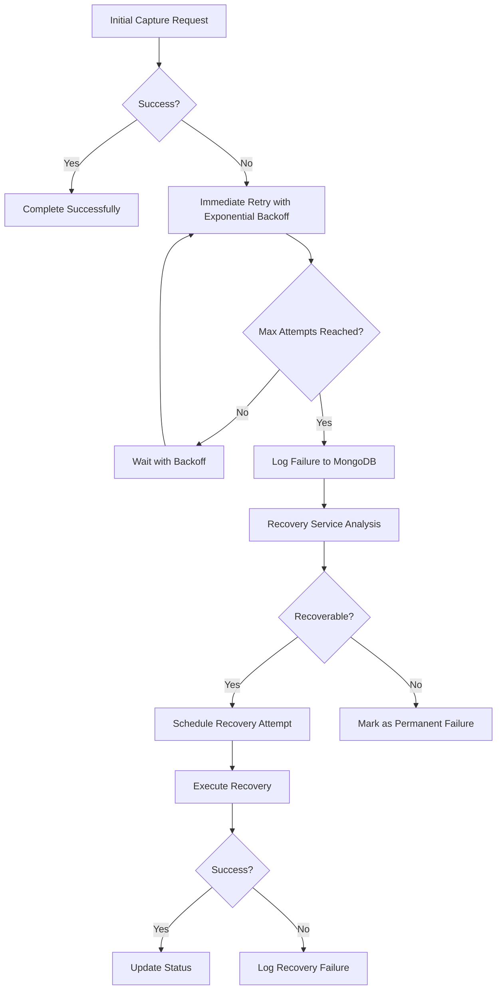
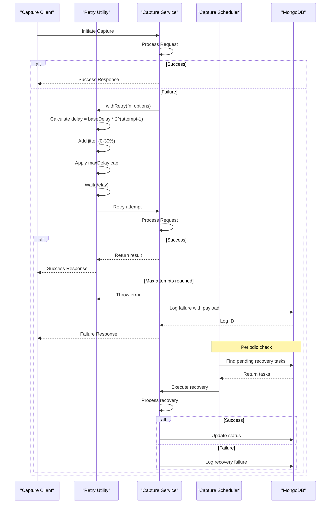
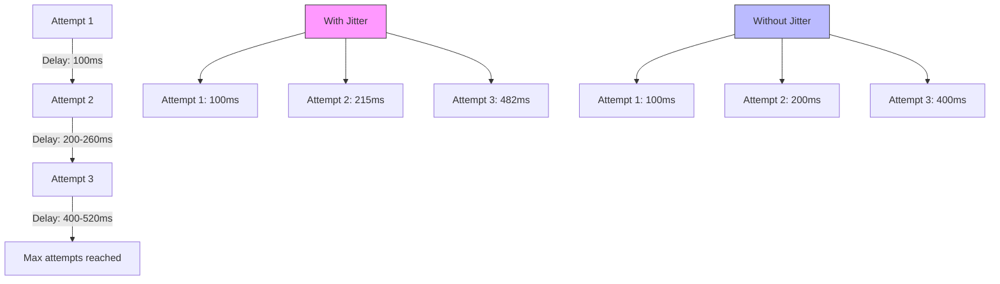
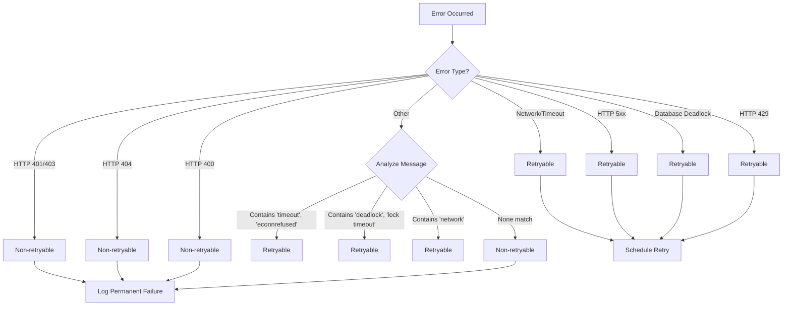
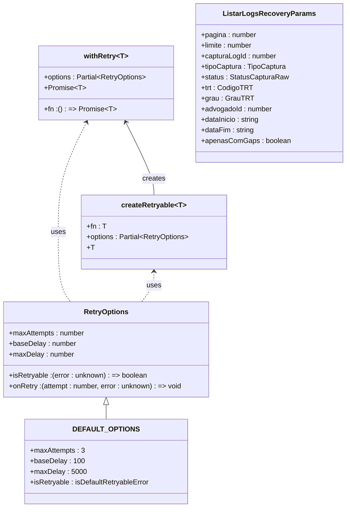
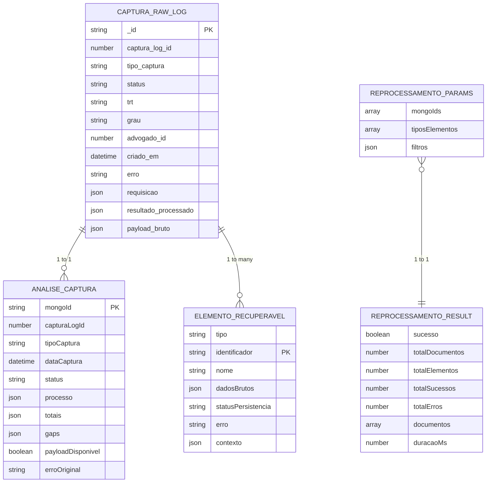
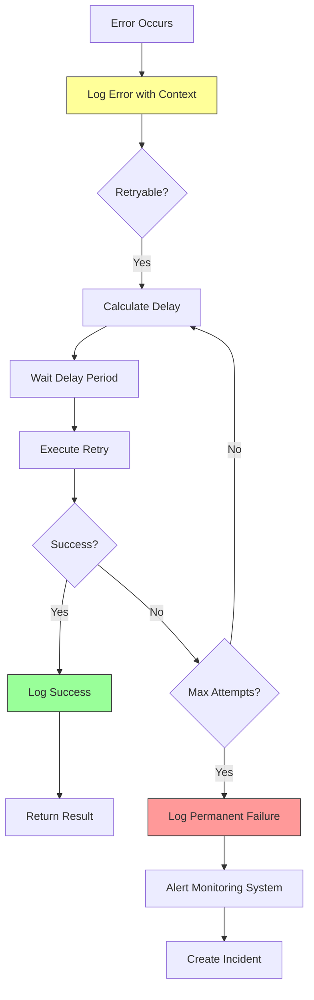
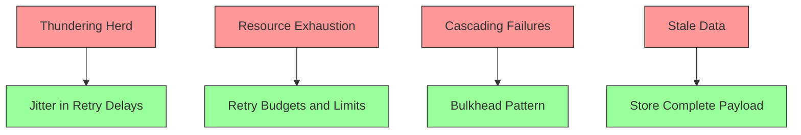

# Automated Retry Strategies

<cite>
**Referenced Files in This Document**   
- [captura-recovery.service.ts](file://backend/captura/services/recovery/captura-recovery.service.ts)
- [recovery-analysis.service.ts](file://backend/captura/services/recovery/recovery-analysis.service.ts)
- [types.ts](file://backend/captura/services/recovery/types.ts)
- [index.ts](file://backend/utils/retry/index.ts)
- [use-recovery-analysis.ts](file://app/_lib/hooks/use-recovery-analysis.ts)
- [use-recovery-logs.ts](file://app/_lib/hooks/use-recovery-logs.ts)
- [captura.ts](file://app/api/captura/captura.ts)
- [agendamento-scheduler.service.ts](file://backend/captura/services/scheduler/agendamento-scheduler.service.ts)
</cite>

## Table of Contents
1. [Introduction](#introduction)
2. [Retry Mechanism Overview](#retry-mechanism-overview)
3. [Core Components](#core-components)
4. [Retry Scheduling Algorithm](#retry-scheduling-algorithm)
5. [Backoff Strategies](#backoff-strategies)
6. [Failure Detection Logic](#failure-detection-logic)
7. [Configuration Interfaces](#configuration-interfaces)
8. [Domain Model](#domain-model)
9. [Usage Patterns](#usage-patterns)
10. [Error Handling and Monitoring](#error-handling-and-monitoring)
11. [Common Issues and Solutions](#common-issues-and-solutions)
12. [Performance Considerations](#performance-considerations)

## Introduction

The Sinesys data capture system implements a comprehensive automated retry strategy to ensure reliable data retrieval from external sources, particularly the PJE (Processo Judicial Eletrônico) system. This document details the implementation of the retry mechanisms in the `captura-recovery.service`, focusing on the retry scheduling algorithm, backoff strategies, and failure detection logic.

The system is designed to handle various types of failures including network timeouts, rate limiting, and temporary service unavailability. The retry framework provides configurable policies for maximum attempts, initial delay, and multiplier factors, with return values indicating retry status and final outcomes.

This documentation explains the relationships with other components such as the capture scheduler and error monitoring system, and addresses common issues like thundering herd problems, resource exhaustion during retries, and cascading failures, providing solutions such as jitter in backoff intervals, retry budgets, and bulkhead patterns.

**Section sources**
- [captura-recovery.service.ts](file://backend/captura/services/recovery/captura-recovery.service.ts#L1-L395)
- [recovery-analysis.service.ts](file://backend/captura/services/recovery/recovery-analysis.service.ts#L1-L1163)

## Retry Mechanism Overview

The automated retry system in Sinesys is implemented as a multi-layered approach that combines immediate retry logic with scheduled recovery mechanisms. The core retry functionality is provided by the `withRetry` function in the retry utility, while the recovery service handles persistent retry attempts through the MongoDB-based logging system.

The system distinguishes between transient failures (which are handled by immediate retries with exponential backoff) and persistent failures (which are handled by the recovery service that can reprocess failed captures at a later time). This dual approach ensures both immediate recovery from temporary issues and long-term reliability for data capture operations.

The retry mechanism is integrated throughout the data capture pipeline, from initial API calls to database persistence operations. Each component can leverage the retry utilities based on its specific requirements, with appropriate configuration for different types of operations.



**Diagram sources**
- [captura-recovery.service.ts](file://backend/captura/services/recovery/captura-recovery.service.ts#L1-L395)
- [recovery-analysis.service.ts](file://backend/captura/services/recovery/recovery-analysis.service.ts#L1-L1163)

**Section sources**
- [captura-recovery.service.ts](file://backend/captura/services/recovery/captura-recovery.service.ts#L1-L395)
- [recovery-analysis.service.ts](file://backend/captura/services/recovery/recovery-analysis.service.ts#L1-L1163)

## Core Components

The automated retry system consists of several core components that work together to provide reliable data capture:

1. **Retry Utility**: The foundational retry mechanism implemented in `backend/utils/retry/index.ts` that provides the `withRetry` function with exponential backoff and jitter.

2. **Recovery Service**: The `captura-recovery.service.ts` that manages the recovery of failed captures by storing logs in MongoDB and providing APIs to analyze and reprocess them.

3. **Analysis Service**: The `recovery-analysis.service.ts` that analyzes captured data to identify gaps between what was captured and what was persisted.

4. **Scheduler**: The `agendamento-scheduler.service.ts` that periodically checks for and executes scheduled capture tasks, including recovery attempts.

5. **API Endpoints**: The frontend API client in `app/api/captura/captura.ts` that provides the interface for initiating captures and handling responses.

These components work together to create a robust retry system that can handle both immediate transient failures and longer-term recovery scenarios.

**Section sources**
- [captura-recovery.service.ts](file://backend/captura/services/recovery/captura-recovery.service.ts#L1-L395)
- [recovery-analysis.service.ts](file://backend/captura/services/recovery/recovery-analysis.service.ts#L1-L1163)
- [index.ts](file://backend/utils/retry/index.ts#L1-L134)
- [agendamento-scheduler.service.ts](file://backend/captura/services/scheduler/agendamento-scheduler.service.ts#L1-L43)

## Retry Scheduling Algorithm

The retry scheduling algorithm in Sinesys combines immediate retries with scheduled recovery attempts. For immediate retries, the system uses an exponential backoff strategy with jitter to prevent thundering herd problems. For persistent failures, the system relies on the capture scheduler to execute recovery attempts at predetermined intervals.

The immediate retry scheduling follows this algorithm:
1. On failure, calculate delay using exponential backoff: `baseDelay * 2^(attempt-1)`
2. Add random jitter (0-30% of the exponential delay) to prevent synchronized retries
3. Cap the delay at a maximum value to prevent excessively long waits
4. Wait for the calculated delay before retrying
5. Repeat until success or maximum attempts are reached

For scheduled recovery, the algorithm is:
1. Log failed captures to MongoDB with complete payload
2. The recovery service analyzes logs to identify recoverable failures
3. The capture scheduler periodically checks for pending recovery tasks
4. Recovery tasks are executed according to their schedule
5. Success/failure is logged and the cycle continues if needed

The scheduler runs periodically (typically every minute) and processes all agendamentos (scheduled tasks) that are due for execution. This ensures that recovery attempts are made in a controlled manner without overwhelming the system.



**Diagram sources**
- [index.ts](file://backend/utils/retry/index.ts#L63-L134)
- [agendamento-scheduler.service.ts](file://backend/captura/services/scheduler/agendamento-scheduler.service.ts#L1-L43)
- [captura-recovery.service.ts](file://backend/captura/services/recovery/captura-recovery.service.ts#L1-L395)

**Section sources**
- [index.ts](file://backend/utils/retry/index.ts#L63-L134)
- [agendamento-scheduler.service.ts](file://backend/captura/services/scheduler/agendamento-scheduler.service.ts#L1-L43)

## Backoff Strategies

The Sinesys retry system implements exponential backoff with jitter as its primary backoff strategy. This approach balances the need to give the system time to recover from transient failures while avoiding the "thundering herd" problem where many clients retry simultaneously.

The exponential backoff formula used is: `delay = baseDelay * 2^(attempt-1) + jitter`

Where:
- `baseDelay`: Initial delay in milliseconds (default: 100ms)
- `attempt`: Current attempt number (1-based)
- `jitter`: Random value between 0 and 30% of the exponential delay

The system also applies a maximum delay cap to prevent excessively long waits. The default configuration uses:
- Maximum attempts: 3 (including the initial attempt)
- Base delay: 100ms
- Maximum delay: 5000ms (5 seconds)

The jitter component is crucial for distributed systems as it prevents multiple instances from retrying at exactly the same time, which could overwhelm the target system. The randomization of retry times spreads the load more evenly over time.

For different types of operations, the backoff strategy can be customized through configuration options. For example, database operations might use shorter delays than external API calls, which might be subject to rate limiting.



**Diagram sources**
- [index.ts](file://backend/utils/retry/index.ts#L90-L94)

**Section sources**
- [index.ts](file://backend/utils/retry/index.ts#L5-L134)

## Failure Detection Logic

The failure detection logic in the Sinesys retry system is implemented through a combination of error type classification and response analysis. The system distinguishes between retryable and non-retryable errors to ensure that only appropriate failures trigger retry attempts.

Retryable errors include:
- Network timeouts and connection issues
- HTTP 5xx server errors
- Database deadlock and lock timeout errors
- Rate limiting responses (HTTP 429)
- Temporary service unavailability

Non-retryable errors include:
- Authentication failures (HTTP 401, 403)
- Resource not found (HTTP 404)
- Client-side validation errors (HTTP 400)
- Permanent data inconsistencies

The detection logic is implemented in the `isDefaultRetryableError` function, which analyzes error messages and status codes to determine retry eligibility. For network and database errors, the system checks for specific keywords in the error message. For HTTP responses, it examines the status code.

The system also implements gap analysis to detect partial failures where some data was captured but not fully persisted. This is particularly important for complex data structures like process parties and their associated addresses and representatives.



**Diagram sources**
- [index.ts](file://backend/utils/retry/index.ts#L29-L57)

**Section sources**
- [index.ts](file://backend/utils/retry/index.ts#L29-L57)
- [recovery-analysis.service.ts](file://backend/captura/services/recovery/recovery-analysis.service.ts#L224-L348)

## Configuration Interfaces

The retry system provides flexible configuration interfaces that allow customization of retry behavior based on specific requirements. The primary configuration interface is the `RetryOptions` type, which defines all configurable parameters for retry operations.

Key configuration options include:
- `maxAttempts`: Maximum number of retry attempts (including the initial attempt)
- `baseDelay`: Initial delay in milliseconds before the first retry
- `maxDelay`: Maximum delay cap for exponential backoff
- `isRetryable`: Custom function to determine if an error is retryable
- `onRetry`: Callback function executed before each retry attempt

The system also provides a `createRetryable` wrapper function that allows creating pre-configured retryable functions. This is useful for operations that are frequently retried with the same configuration.

For the recovery service, configuration is primarily handled through API parameters and query string options. The frontend hooks provide additional configuration options for controlling the behavior of recovery analysis and log retrieval.



**Diagram sources**
- [index.ts](file://backend/utils/retry/index.ts#L5-L134)
- [types.ts](file://backend/captura/services/recovery/types.ts#L178-L201)

**Section sources**
- [index.ts](file://backend/utils/retry/index.ts#L5-L134)
- [types.ts](file://backend/captura/services/recovery/types.ts#L178-L201)

## Domain Model

The domain model for the retry and recovery system consists of several key entities that represent the state and metadata of capture operations and their retry attempts. The model is designed to track both successful and failed captures, enabling analysis and recovery of incomplete operations.

The core entities in the domain model are:

1. **CapturaRawLogDocument**: Represents a raw log of a capture operation stored in MongoDB, containing the complete request, response, and metadata.

2. **AnaliseCaptura**: Represents the analysis of a capture operation, including identified gaps between captured data and persisted data.

3. **ElementoRecuperavel**: Represents a recoverable element (parte, endereco, representante) that can be reprocessed from the raw payload.

4. **ReprocessarParams**: Represents the parameters for reprocessing one or more capture logs.

5. **ReprocessarResult**: Represents the result of a reprocessing operation, including success/failure status and detailed outcomes.

The model also includes supporting types for statistics, filtering, and pagination of recovery logs. The relationships between these entities enable comprehensive analysis of capture operations and their outcomes.



**Diagram sources**
- [types.ts](file://backend/captura/services/recovery/types.ts#L1-L571)
- [captura-recovery.service.ts](file://backend/captura/services/recovery/captura-recovery.service.ts#L1-L395)

**Section sources**
- [types.ts](file://backend/captura/services/recovery/types.ts#L1-L571)

## Usage Patterns

The retry system supports several usage patterns for different types of failures and operational requirements:

### Network Timeouts
For network timeouts, the system uses immediate retries with exponential backoff. The default configuration of 3 attempts with 100ms base delay and 5s maximum delay is typically sufficient for transient network issues.

```typescript
// Example usage for network timeout recovery
const result = await withRetry(
  () => fetch('/api/data'),
  { maxAttempts: 3, baseDelay: 100, maxDelay: 5000 }
);
```

### Rate Limiting
For rate limiting scenarios (HTTP 429), the system detects the rate limit response and implements a longer delay before retrying. The recovery service can also be configured to respect rate limit headers and schedule retries accordingly.

```typescript
// Example usage with custom retryable function for rate limiting
const result = await withRetry(
  () => apiClient.getData(),
  {
    maxAttempts: 5,
    baseDelay: 1000,
    isRetryable: (error) => {
      return error.status === 429 || 
             error.message.includes('rate limit');
    }
  }
);
```

### Temporary Service Unavailability
For temporary service unavailability (HTTP 5xx), the system uses exponential backoff with jitter to avoid overwhelming the recovering service. The retry budget limits the total number of attempts to prevent indefinite retries.

```typescript
// Example usage for service unavailability
const result = await withRetry(
  () => externalService.process(),
  {
    maxAttempts: 4,
    baseDelay: 200,
    maxDelay: 10000,
    onRetry: (attempt, error) => {
      logger.warn(`Retry attempt ${attempt} after error: ${error}`);
    }
  }
);
```

### Partial Data Persistence
For scenarios where data is partially persisted, the recovery service analyzes the gaps and allows selective reprocessing of missing elements.

```typescript
// Example usage for gap recovery
const analysis = await analisarCaptura(mongoId);
if (analysis.gaps.partesFaltantes.length > 0) {
  await reprocessarRecovery({
    mongoIds: [mongoId],
    tiposElementos: ['parte'],
    filtros: { apenasGaps: true }
  });
}
```

**Section sources**
- [index.ts](file://backend/utils/retry/index.ts#L63-L134)
- [recovery-analysis.service.ts](file://backend/captura/services/recovery/recovery-analysis.service.ts#L37-L110)
- [captura.ts](file://app/api/captura/captura.ts#L717-L751)

## Error Handling and Monitoring

The retry system implements comprehensive error handling and monitoring to ensure reliability and provide visibility into retry operations. Errors are logged with detailed context including the attempt number, error type, and calculated delay.

The monitoring system tracks several key metrics:
- Number of retry attempts and their outcomes
- Distribution of retry delays
- Types of errors encountered
- Success rate of retry operations
- Time to recovery for failed operations

These metrics are used to identify patterns in failures and optimize retry configurations. The system also integrates with the broader error monitoring infrastructure, ensuring that retry-related issues are captured and alerted appropriately.

For debugging purposes, the system provides detailed logs that can be used to trace the complete retry sequence for any operation. The recovery service also provides APIs to query and analyze historical retry attempts.



**Diagram sources**
- [index.ts](file://backend/utils/retry/index.ts#L78-L87)
- [index.ts](file://backend/utils/retry/index.ts#L95-L103)

**Section sources**
- [index.ts](file://backend/utils/retry/index.ts#L78-L115)

## Common Issues and Solutions

The retry system addresses several common issues that can occur in distributed systems:

### Thundering Herd Problem
When many instances retry simultaneously after a service outage, they can overwhelm the recovering system. The solution is to add jitter to the retry delay, spreading the retries over time.

**Solution**: The system implements jitter by adding a random value (0-30% of the exponential delay) to each retry delay.

```typescript
const jitter = Math.random() * 0.3 * exponentialDelay;
const delay = Math.min(exponentialDelay + jitter, opts.maxDelay);
```

### Resource Exhaustion
Excessive retries can consume system resources like memory, CPU, and network bandwidth. The solution is to implement retry budgets and circuit breakers.

**Solution**: The system limits the maximum number of retry attempts and uses exponential backoff to reduce the retry frequency over time.

### Cascading Failures
When one service's retries overwhelm another service, it can cause cascading failures throughout the system. The solution is to implement bulkhead patterns and rate limiting.

**Solution**: The system isolates retry operations and respects rate limits from external services, pausing retries when rate limits are reached.

### Stale Data
Retrying with stale data can lead to consistency issues. The solution is to ensure that retry operations use fresh data when possible.

**Solution**: The recovery service stores the complete payload from the original request, ensuring that retry operations use the same data as the initial attempt.



**Diagram sources**
- [index.ts](file://backend/utils/retry/index.ts#L92-L93)

**Section sources**
- [index.ts](file://backend/utils/retry/index.ts#L90-L94)

## Performance Considerations

The retry system is designed with performance considerations to minimize the impact on system resources while maintaining reliability. Key performance optimizations include:

1. **Efficient Logging**: The recovery service uses MongoDB for storage, with optimized queries and indexing to ensure fast retrieval of recovery logs.

2. **Selective Payload Storage**: Only payloads from failed or incomplete captures are stored in full, reducing storage requirements.

3. **Batch Processing**: The recovery service can process multiple recovery attempts in a single operation, reducing overhead.

4. **Caching**: Frequently accessed data is cached to reduce database queries during recovery analysis.

5. **Connection Pooling**: Database connections are pooled to reduce connection overhead during retry operations.

The system also monitors performance metrics such as retry latency, success rates, and resource utilization to identify and address performance bottlenecks.

**Section sources**
- [captura-recovery.service.ts](file://backend/captura/services/recovery/captura-recovery.service.ts#L100-L113)
- [recovery-analysis.service.ts](file://backend/captura/services/recovery/recovery-analysis.service.ts#L534-L538)