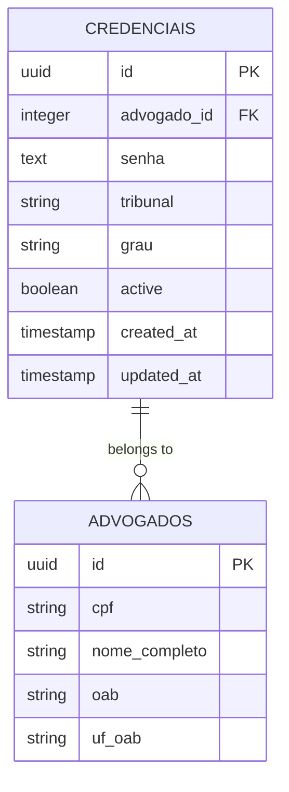
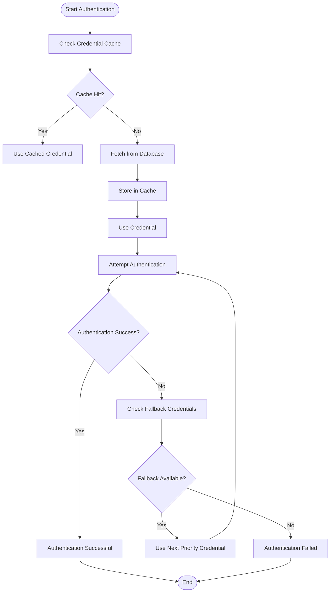
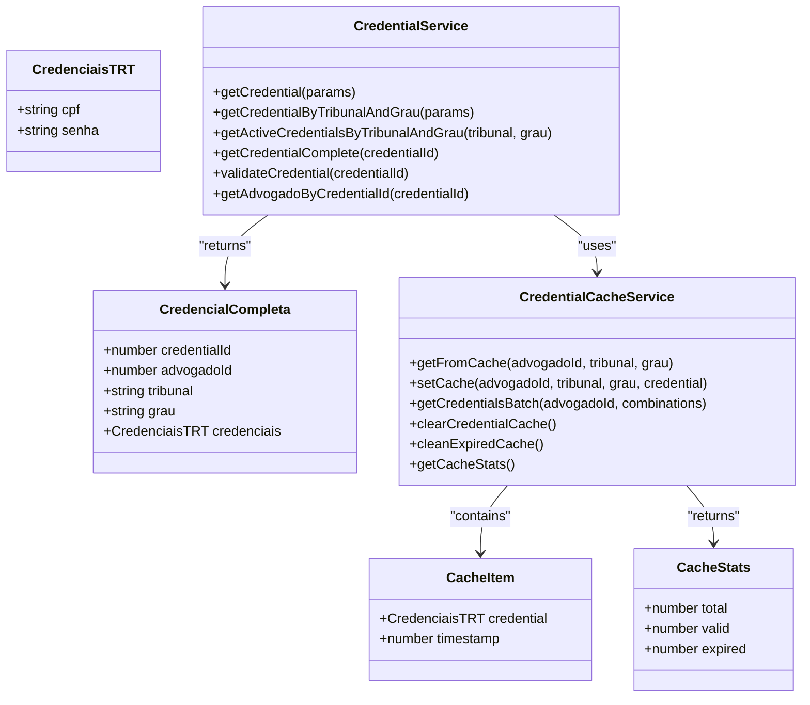
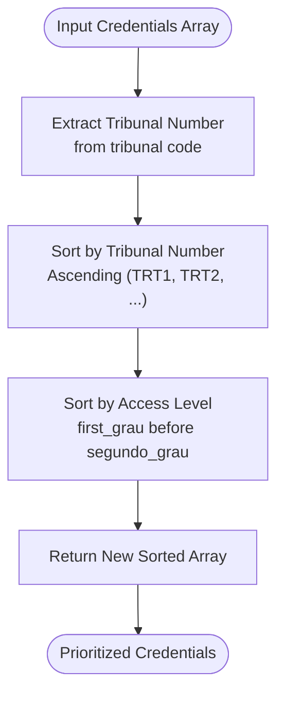
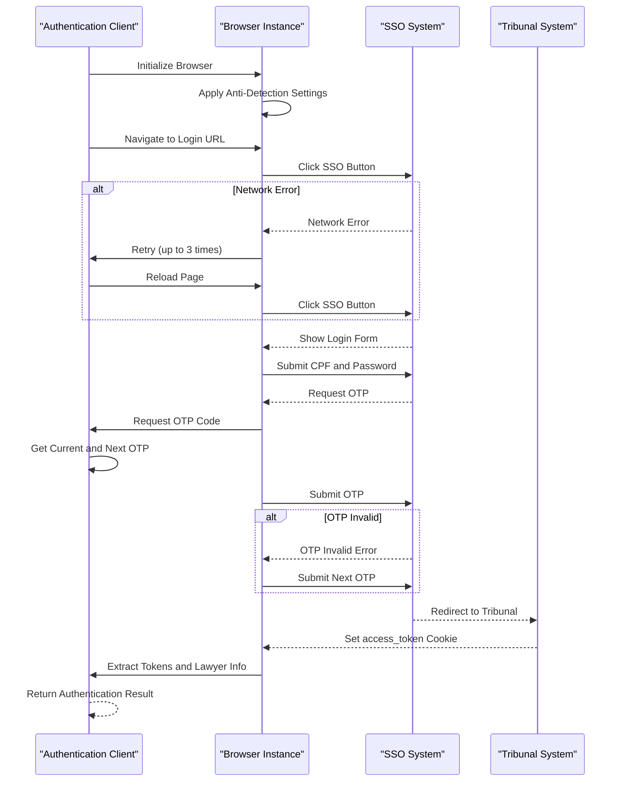

# Credential Fallback Systems

<cite>
**Referenced Files in This Document**   
- [credential.service.ts](file://backend/captura/credentials/credential.service.ts)
- [credential-cache.service.ts](file://backend/captura/credentials/credential-cache.service.ts)
- [trt-auth.service.ts](file://backend/captura/services/trt/trt-auth.service.ts)
- [ordenar-credenciais.ts](file://backend/captura/utils/ordenar-credenciais.ts)
- [03_credenciais.sql](file://supabase/schemas/03_credenciais.sql)
- [atualizar-credencial.service.ts](file://backend/advogados/services/credenciais/atualizar-credencial.service.ts)
- [criar-credencial.service.ts](file://backend/advogados/services/credenciais/criar-credencial.service.ts)
- [buscar-credencial.service.ts](file://backend/advogados/services/credenciais/buscar-credencial.service.ts)
- [listar-credenciais.service.ts](file://backend/advogados/services/credenciais/listar-credenciais.service.ts)
</cite>

## Table of Contents
1. [Introduction](#introduction)
2. [Credential Management System](#credential-management-system)
3. [Credential Fallback and Rotation Mechanisms](#credential-fallback-and-rotation-mechanisms)
4. [Domain Model for Credential Validity and Usage](#domain-model-for-credential-validity-and-usage)
5. [Credential Prioritization with ordenar-credenciais Utility](#credential-prioritization-with-ordenar-credenciais-utility)
6. [Authentication Flow and Error Handling](#authentication-flow-and-error-handling)
7. [Configuration Options and Selection Strategies](#configuration-options-and-selection-strategies)
8. [Common Issues and Solutions](#common-issues-and-solutions)
9. [Integration with Other Components](#integration-with-other-components)
10. [Conclusion](#conclusion)

## Introduction

The Sinesys data capture system implements a robust credential fallback mechanism designed to ensure uninterrupted access to tribunal systems during data capture operations. This documentation provides a comprehensive overview of the credential management, fallback, and rotation systems that enable reliable authentication across multiple tribunal instances (TRT1-TRT24) and access levels (first and second degree). The system is designed to handle credential expiration, revocation, lockout scenarios, and network-related authentication failures through automated fallback mechanisms and intelligent credential prioritization.

The credential system is built around a multi-layered architecture that includes database persistence, in-memory caching, browser automation for authentication, and sophisticated fallback logic. When capturing data from tribunal systems, the application must authenticate using credentials stored in the database. If authentication fails with one credential set, the system automatically attempts fallback to alternative credentials according to predefined prioritization rules.

This documentation will explore the implementation details of the credential fallback system, including how credential failures are detected, how the system automatically switches to alternative credentials, the interfaces for managing credential priorities, and the domain model for representing credential validity and usage statistics. We'll also examine configuration options for credential selection strategies, parameters controlling fallback behavior, and integration points with other system components.

**Section sources**
- [credential.service.ts](file://backend/captura/credentials/credential.service.ts#L1-L401)
- [trt-auth.service.ts](file://backend/captura/services/trt/trt-auth.service.ts#L1-L603)

## Credential Management System

The credential management system in Sinesys is responsible for storing, retrieving, and managing access credentials for tribunal systems. Credentials are stored in the PostgreSQL database with a dedicated schema that ensures data integrity and security. The system provides a comprehensive API for creating, reading, updating, and deleting credentials through well-defined service interfaces.

Credentials are stored in the `credenciais` table with the following structure:
- `id`: Unique identifier for the credential
- `advogado_id`: Reference to the lawyer who owns the credential
- `senha`: Password for tribunal access (stored in plain text)
- `tribunal`: Tribunal code (TRT1 to TRT24)
- `grau`: Access level (first_grau or segundo_grau)
- `active`: Boolean flag indicating if the credential is active

The database schema includes appropriate indexes for efficient querying by lawyer ID, tribunal, and access level, ensuring fast credential retrieval during authentication processes. Row-level security is enabled on the credentials table to ensure that only authorized users can access credential data.

The system provides several service interfaces for managing credentials:
- `criarCredencial`: Creates a new credential with validation of tribunal format (TRT1-TRT24) and access level
- `atualizarCredencial`: Updates existing credential information with input validation
- `buscarCredencial`: Retrieves a specific credential by ID
- `listarCredenciais`: Lists all credentials for a specific lawyer

These services implement comprehensive validation to ensure data integrity. For example, when creating a credential, the system validates that the tribunal code follows the TRT1-TRT24 format and that the access level is either "primeiro_grau" or "segundo_grau". The TST tribunal has special validation requiring the "tribunal_superior" access level.

**Diagram sources **
- [03_credenciais.sql](file://supabase/schemas/03_credenciais.sql#L1-L48)
- [atualizar-credencial.service.ts](file://backend/advogados/services/credenciais/atualizar-credencial.service.ts#L1-L49)
- [criar-credencial.service.ts](file://backend/advogados/services/credenciais/criar-credencial.service.ts#L1-L57)

**Section sources**
- [03_credenciais.sql](file://supabase/schemas/03_credenciais.sql#L1-L48)
- [atualizar-credencial.service.ts](file://backend/advogados/services/credenciais/atualizar-credencial.service.ts#L1-L49)
- [criar-credencial.service.ts](file://backend/advogados/services/credenciais/criar-credencial.service.ts#L1-L57)
- [buscar-credencial.service.ts](file://backend/advogados/services/credenciais/buscar-credencial.service.ts#L1-L17)
- [listar-credenciais.service.ts](file://backend/advogados/services/credenciais/listar-credenciais.service.ts#L1-L20)

## Credential Fallback and Rotation Mechanisms

The credential fallback system in Sinesys is designed to ensure continuous operation even when individual credentials fail due to expiration, revocation, or temporary lockout. The system implements a sophisticated fallback mechanism that automatically attempts authentication with alternative credentials when the primary credential fails.

The fallback process begins with the credential retrieval system, which provides multiple methods for obtaining credentials:
- `getCredential`: Retrieves a specific credential by ID
- `getCredentialByTribunalAndGrau`: Retrieves a credential by lawyer, tribunal, and access level with automatic caching
- `getActiveCredentialsByTribunalAndGrau`: Retrieves all active credentials for a specific tribunal and access level

The core of the fallback mechanism is implemented in the `credential-cache.service.ts` file, which provides an in-memory cache for credentials to reduce database queries and improve performance. The cache uses a TTL (Time To Live) of 5 minutes, after which credentials are considered expired and automatically removed from the cache. This ensures that updated credentials in the database are reflected in the system within a reasonable timeframe.

When processing multiple tribunal systems, the system uses the `getCredentialsBatch` function to efficiently retrieve credentials for multiple tribunal/grade combinations in a single database query. This optimization reduces the number of database round-trips from potentially 48 (24 TRTs × 2 grades) to just one, significantly improving performance during bulk operations.

The fallback mechanism works as follows:
1. The system attempts to retrieve credentials from the in-memory cache
2. If not found in cache or cache has expired, credentials are retrieved from the database
3. Credentials are stored in the cache for future use
4. During authentication, if the primary credential fails, the system can fall back to alternative credentials based on the prioritization rules

The system also includes mechanisms for handling credential rotation, where credentials are periodically updated to maintain access. When credentials are updated, the cache is automatically invalidated to ensure the new credentials are used in subsequent authentication attempts.

**Diagram sources **
- [credential-cache.service.ts](file://backend/captura/credentials/credential-cache.service.ts#L1-L447)
- [credential.service.ts](file://backend/captura/credentials/credential.service.ts#L1-L401)

**Section sources**
- [credential-cache.service.ts](file://backend/captura/credentials/credential-cache.service.ts#L1-L447)
- [credential.service.ts](file://backend/captura/credentials/credential.service.ts#L1-L401)

## Domain Model for Credential Validity and Usage

The credential system in Sinesys implements a comprehensive domain model that represents credential validity, usage patterns, and statistical information. This model enables the system to make intelligent decisions about credential selection and fallback based on historical performance and current validity status.

The core credential model includes the following properties:
- `cpf`: The lawyer's CPF used for authentication
- `senha`: The password for tribunal access
- `tribunal`: The tribunal code (TRT1-TRT24)
- `grau`: The access level (first_grau or segundo_grau)
- `active`: Boolean flag indicating if the credential is currently active

The system tracks credential validity through several mechanisms:
1. Database-level active flag that can be toggled when credentials are expired or revoked
2. Cache TTL that automatically expires credentials after 5 minutes
3. Real-time validation during authentication attempts

The credential service provides methods to validate credential existence and status:
- `validateCredential`: Checks if a credential exists and is active
- `getAdvogadoByCredentialId`: Retrieves lawyer information associated with a credential

Usage statistics are implicitly tracked through the caching system, which provides insights into credential access patterns. The cache statistics include:
- Total number of cached credentials
- Number of valid credentials
- Number of expired credentials

These statistics can be retrieved using the `getCacheStats` function, which returns an object with `total`, `valid`, and `expired` counts. This information can be used for monitoring and troubleshooting credential usage patterns.

The system also implements automatic cache cleanup through the `cleanExpiredCache` function, which removes expired credentials from the cache. This function can be called periodically (e.g., every minute) to maintain cache efficiency and prevent memory bloat.

**Diagram sources **
- [credential.service.ts](file://backend/captura/credentials/credential.service.ts#L1-L401)
- [credential-cache.service.ts](file://backend/captura/credentials/credential-cache.service.ts#L1-L447)

**Section sources**
- [credential.service.ts](file://backend/captura/credentials/credential.service.ts#L1-L401)
- [credential-cache.service.ts](file://backend/captura/credentials/credential-cache.service.ts#L1-L447)

## Credential Prioritization with ordenar-credenciais Utility

The `ordenar-credenciais` utility is a critical component of the credential fallback system, responsible for prioritizing credentials based on tribunal number and access level. This utility ensures that credential fallback follows a consistent and predictable order, which is essential for systematic troubleshooting and reliable operation.

The `ordenarCredenciaisPorTRT` function implements the prioritization logic by sorting credentials according to two criteria:
1. Tribunal number in ascending order (TRT1, TRT2, ..., TRT24)
2. Access level, with first_grau prioritized over segundo_grau

This sorting algorithm ensures that when multiple credentials are available for fallback, the system attempts authentication in a consistent sequence. The prioritization follows the pattern: TRT1 primeiro_grau, TRT1 segundo_grau, TRT2 primeiro_grau, TRT2 segundo_grau, and so on.

The utility extracts the tribunal number using a regular expression that matches the TRT prefix followed by digits. This extracted number is used for sorting, ensuring that TRT10 is correctly ordered after TRT9 rather than alphabetically after TRT1.

The implementation is straightforward but effective:
1. Extract the numeric portion of the tribunal code (e.g., "1" from "TRT1")
2. Sort primarily by this numeric value in ascending order
3. For credentials with the same tribunal, sort by access level (first_grau before segundo_grau)

This prioritization strategy provides several benefits:
- Predictable fallback behavior that aids in troubleshooting
- Systematic coverage of tribunal systems in numerical order
- Consistent handling of credentials across different system components
- Efficient processing when multiple credentials need to be evaluated

The utility returns a new array with sorted credentials, preserving the original array unchanged. This immutability ensures that the sorting operation does not have unintended side effects on other parts of the system.

**Diagram sources **
- [ordenar-credenciais.ts](file://backend/captura/utils/ordenar-credenciais.ts#L1-L38)

**Section sources**
- [ordenar-credenciais.ts](file://backend/captura/utils/ordenar-credenciais.ts#L1-L38)

## Authentication Flow and Error Handling

The authentication flow in Sinesys is implemented in the `trt-auth.service.ts` file and follows a comprehensive process to ensure successful authentication with tribunal systems. The flow handles various scenarios including credential expiration, OTP (One-Time Password) requirements, and network-related issues.

The authentication process consists of several key steps:
1. Browser initialization with anti-detection configurations
2. Navigation to the tribunal login page
3. Submission of credentials (CPF and password)
4. OTP processing when required
5. Token extraction and validation
6. Lawyer information extraction from JWT

The system implements robust error handling at each stage of the authentication process. For OTP processing, the system includes a retry mechanism that attempts to use the next OTP code if the current one fails. This is particularly important because OTP codes have a limited validity period, and network delays can cause timing issues.

When submitting credentials, the system includes retry logic for network-related errors. If a network error occurs during the SSO (Single Sign-On) button click, the system will retry up to three times with a 5-second delay between attempts. After each retry, the login page is reloaded to ensure a clean state.

The system also implements sophisticated detection of authentication failure reasons:
- OTP field visibility detection to confirm OTP is required
- Error message parsing to identify "invalid" or "incorrect" OTP codes
- Network error detection in page content
- Timeout handling for SSO redirection

For token extraction, the system implements a 20-second polling mechanism to wait for the access_token cookie to appear. If the cookie is not found within this timeframe, a retry is attempted after a 3-second delay. This accommodates variations in system response times across different tribunal instances.

The authentication result includes the authenticated page, browser instance, browser context, lawyer information, and authentication tokens (access_token and XSRF-Token). This comprehensive result enables subsequent operations to proceed with the established authentication session.

**Diagram sources **
- [trt-auth.service.ts](file://backend/captura/services/trt/trt-auth.service.ts#L1-L603)

**Section sources**
- [trt-auth.service.ts](file://backend/captura/services/trt/trt-auth.service.ts#L1-L603)

## Configuration Options and Selection Strategies

The credential system in Sinesys provides several configuration options and selection strategies to accommodate different operational requirements and environments. These configurations allow the system to adapt to various scenarios, from development to production, and handle different authentication requirements across tribunal instances.

Key configuration options include:
- `headless`: Boolean flag to control whether browser operations run in headless mode
- `twofauthConfig`: Configuration for the 2FAuth service used to retrieve OTP codes
- `CACHE_TTL_MS`: Time-to-live for credential cache (default 5 minutes)
- `MAX_OTP_CHECK_RETRIES`: Maximum number of retries when waiting for OTP field

The credential selection strategy is primarily determined by the retrieval method used:
- `getCredentialByTribunalAndGrau`: Retrieves a specific credential for a tribunal and access level, using cache when available
- `getActiveCredentialsByTribunalAndGrau`: Retrieves all active credentials for a tribunal and access level, enabling batch processing
- `getCredentialsBatch`: Retrieves multiple credentials in a single optimized query, ideal for processing multiple tribunal systems

The system also supports different browser connection strategies through the `getFirefoxConnection` function:
- Remote connection to Browserless (Chromium) in production
- Local Firefox instance in development

Authentication parameters are configurable through the `TRTAuthOptions` interface, which includes:
- `credential`: The credential to use for authentication
- `config`: Tribunal-specific configuration (login URL, base URL)
- `twofauthConfig`: 2FAuth configuration for OTP retrieval
- `headless`: Whether to run in headless mode

The return values from authentication operations provide clear indicators of success or failure:
- Successful authentication returns an `AuthResult` object with the authenticated page, browser instance, tokens, and lawyer information
- Failed authentication throws specific error messages indicating the failure reason (e.g., "Campo OTP não apareceu", "Falha ao validar OTP")
- Credential validation returns a boolean indicating if the credential exists and is active

These configuration options and selection strategies enable the system to be flexible and adaptable to different environments and requirements while maintaining a consistent interface for credential management and authentication.

**Section sources**
- [trt-auth.service.ts](file://backend/captura/services/trt/trt-auth.service.ts#L1-L603)
- [credential-cache.service.ts](file://backend/captura/credentials/credential-cache.service.ts#L1-L447)
- [credential.service.ts](file://backend/captura/credentials/credential.service.ts#L1-L401)

## Common Issues and Solutions

The credential system in Sinesys addresses several common issues that can occur in distributed authentication scenarios. These solutions ensure reliable operation across multiple tribunal instances and prevent common failure modes.

### Credential Synchronization Across Instances

In multi-instance deployments, credential updates made on one instance may not be immediately reflected on others due to caching. The system addresses this through:
- 5-minute cache TTL that automatically expires credentials
- Explicit cache invalidation when credentials are updated
- The `clearCredentialCache` function for manual cache clearing

### Stale Credential Caches

Stale caches can cause authentication failures when credentials are updated but the old values remain in memory. The system mitigates this through:
- Automatic cache expiration after 5 minutes
- Periodic cleanup of expired credentials via `cleanExpiredCache`
- Cache population only after successful database retrieval

### Race Conditions During Credential Rotation

When multiple processes attempt to use or update credentials simultaneously, race conditions can occur. The system handles this through:
- Atomic database operations for credential updates
- In-memory cache that serves consistent values during its TTL period
- Service-level validation that checks credential status before use

### Network-Related Authentication Failures

Network issues can interrupt the authentication flow, particularly during SSO redirection. The system implements several solutions:
- Retry logic for network errors during SSO button click (up to 3 attempts)
- Extended timeouts for page loading and URL changes
- Robust error detection and reporting

### OTP Synchronization Issues

OTP codes have a limited validity period, which can cause timing issues. The system addresses this by:
- Retrieving both current and next OTP codes
- Using the next code as a fallback if the current one fails
- Implementing appropriate delays between OTP submission attempts

### Browser Automation Detection

Tribunal systems may detect and block automated browser access. The system counters this through:
- Anti-detection configurations that modify browser properties
- Realistic delays between user actions
- Firefox browser with stealth settings in production

These solutions ensure that the credential system remains robust and reliable even in challenging network conditions and when facing anti-automation measures.

**Section sources**
- [credential-cache.service.ts](file://backend/captura/credentials/credential-cache.service.ts#L1-L447)
- [trt-auth.service.ts](file://backend/captura/services/trt/trt-auth.service.ts#L1-L603)

## Integration with Other Components

The credential fallback system integrates with several other components in the Sinesys architecture, forming a cohesive ecosystem for data capture and authentication. These integrations enable seamless operation across different system boundaries.

### Integration with Credential Management System

The credential service integrates directly with the credential management system through database queries to the `credenciais` table. It uses the Supabase service client to bypass RLS (Row Level Security) when necessary, allowing system-level access to credentials. The service retrieves not only credential information but also associated lawyer data through database joins.

### Integration with Authentication Service

The authentication service (`trt-auth.service.ts`) consumes credentials from the credential system and uses them to authenticate with tribunal systems. It passes credential information to the authentication flow and handles the results, including token extraction and lawyer information retrieval.

### Integration with Data Capture Services

The credential system supports various data capture services through the `captura` module, including:
- TRT data capture services for different tribunal systems
- Browser connection services for managing browser instances
- Persistence services for storing capture logs

### Integration with Two-Factor Authentication

The system integrates with the 2FAuth service for OTP code retrieval. This integration is configurable through environment variables or direct configuration objects, allowing flexibility in 2FAuth provider selection.

### Integration with Monitoring and Logging

The credential system includes comprehensive logging at different levels (info, success, warn, error) to facilitate monitoring and troubleshooting. These logs provide visibility into credential retrieval, cache operations, and authentication attempts.

The integration points ensure that the credential system operates as a cohesive component within the larger Sinesys architecture, providing reliable authentication services to support data capture operations across multiple tribunal systems.

**Section sources**
- [credential.service.ts](file://backend/captura/credentials/credential.service.ts#L1-L401)
- [trt-auth.service.ts](file://backend/captura/services/trt/trt-auth.service.ts#L1-L603)
- [credential-cache.service.ts](file://backend/captura/credentials/credential-cache.service.ts#L1-L447)

## Conclusion

The credential fallback system in Sinesys provides a robust and reliable mechanism for managing authentication to tribunal systems during data capture operations. By implementing a multi-layered approach that combines database persistence, in-memory caching, intelligent prioritization, and comprehensive error handling, the system ensures continuous operation even when individual credentials fail.

Key strengths of the system include:
- Efficient credential retrieval through batch operations and caching
- Predictable fallback behavior using the ordenar-credenciais utility
- Comprehensive error handling for network issues and authentication failures
- Flexible configuration options for different environments
- Robust solutions for common distributed system challenges

The system's design prioritizes reliability and maintainability, with clear separation of concerns between credential management, authentication, and fallback logic. The extensive logging and monitoring capabilities enable effective troubleshooting and performance optimization.

For developers working with the system, understanding the credential flow—from database retrieval to cache utilization to authentication attempts—is essential for effective maintenance and enhancement. The well-defined interfaces and comprehensive documentation make it accessible to both new and experienced developers.

As the system evolves, potential improvements could include more sophisticated credential health monitoring, adaptive fallback strategies based on historical success rates, and enhanced security measures for credential storage. However, the current implementation provides a solid foundation for reliable data capture operations across multiple tribunal systems.