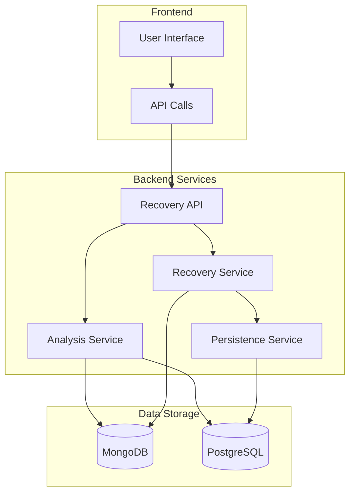

# Data Recovery Procedures

<cite>
**Referenced Files in This Document**   
- [README.md](file://backend/captura/services/recovery/README.md)
- [types.ts](file://backend/captura/services/recovery/types.ts)
- [captura-recovery.service.ts](file://backend/captura/services/recovery/captura-recovery.service.ts)
- [recovery-analysis.service.ts](file://backend/captura/services/recovery/recovery-analysis.service.ts)
- [endereco-recovery.service.ts](file://backend/captura/services/recovery/endereco-recovery.service.ts)
- [route.ts](file://app/api/captura/recovery/route.ts)
- [\[mongoId\]/route.ts](file://app/api/captura/recovery/[mongoId]/route.ts)
- [reprocess/route.ts](file://app/api/captura/recovery/reprocess/route.ts)
- [enderecos-persistence.service.ts](file://backend/enderecos/services/enderecos-persistence.service.ts)
- [captura.ts](file://app/api/captura/captura.ts)
</cite>

## Table of Contents
1. [Introduction](#introduction)
2. [System Architecture](#system-architecture)
3. [Data Recovery Workflow](#data-recovery-workflow)
4. [Domain Model and Data Structures](#domain-model-and-data-structures)
5. [API Interfaces](#api-interfaces)
6. [Recovery Implementation Details](#recovery-implementation-details)
7. [Error Handling and Troubleshooting](#error-handling-and-troubleshooting)
8. [Configuration and Parameters](#configuration-and-parameters)
9. [Integration with Other Components](#integration-with-other-components)
10. [Best Practices](#best-practices)

## Introduction

The Sinesys data recovery system provides a robust mechanism for recovering from partial or corrupted data captures, particularly from the PJE (Processo Judicial Eletrônico) system. When data capture operations fail to persist all elements successfully, the system retains the raw payload data in MongoDB, allowing for subsequent recovery and re-persistence of missing elements into the PostgreSQL database.

This documentation details the implementation of the data recovery procedures, focusing on how the system identifies incomplete captures, reconstructs missing data, and provides interfaces for initiating recovery operations. The primary use case involves recovering addresses that failed to persist during the initial capture process, though the system is designed to support recovery of other entity types in the future.

The recovery system addresses common issues such as failed address persistence due to validation errors, timeout issues during representative capture, or errors in linking PJE registrations. By leveraging the raw data stored in MongoDB, the system can reprocess and persist missing elements without requiring a complete recapture from the source system.

**Section sources**
- [README.md](file://backend/captura/services/recovery/README.md#L1-L303)

## System Architecture

The data recovery system follows a modular architecture with distinct components responsible for different aspects of the recovery process. The system is designed to work with data captured from external sources (primarily PJE) that is initially stored in MongoDB and then partially persisted to PostgreSQL.

The architecture consists of three main service layers:
1. **Recovery Service Layer**: Handles the listing and retrieval of capture logs from MongoDB
2. **Analysis Service Layer**: Compares data between MongoDB and PostgreSQL to identify gaps
3. **Recovery Implementation Layer**: Re-persists missing elements from raw data

The system uses a dual-database approach where raw capture data is stored in MongoDB with the `payload_bruto` field, while the processed data is persisted in PostgreSQL. This separation allows the system to maintain a complete record of the original capture data even when partial failures occur during the PostgreSQL persistence phase.

The recovery process is initiated through REST APIs that provide interfaces for listing problematic captures, analyzing specific capture logs for gaps, and executing re-persistence operations. The system is designed to be idempotent, allowing recovery operations to be safely retried without creating duplicate data.



**Diagram sources**
- [README.md](file://backend/captura/services/recovery/README.md#L18-L30)

## Data Recovery Workflow

The data recovery process follows a four-step workflow that guides users from identification of problematic captures to verification of successful recovery.

### Step 1: Identification
The process begins with identifying captures that may have incomplete data. This is done by querying the recovery API with filters such as capture type, date range, tribunal (TRT), and status. The system provides aggregated statistics that highlight captures with identified gaps, allowing users to prioritize recovery efforts.

### Step 2: Analysis
Once potential candidates are identified, the system analyzes specific capture logs to identify exactly which elements are missing. This analysis compares the raw data in MongoDB with the persisted data in PostgreSQL, generating a detailed report of gaps. For example, it can identify that while a process capture successfully persisted party information, it failed to persist two associated addresses.

### Step 3: Re-processing
After analysis confirms the presence of gaps, the recovery system re-processes the missing elements. It extracts the relevant data from the raw payload in MongoDB and attempts to persist it to PostgreSQL. The system supports different modes of operation, including processing only missing elements (gaps) or forcing updates to existing records.

### Step 4: Verification
Finally, the system allows verification of the recovery operation by re-analyzing the capture log to confirm that previously identified gaps have been resolved. This closed-loop process ensures data integrity and provides confidence that the recovery was successful.

The workflow is designed to be transactional where possible, with retry mechanisms in place to handle transient failures during the re-persistence phase. Each recovery operation is logged, providing an audit trail of recovery attempts and their outcomes.

```mermaid
graph TD
A[IDENTIFICATION] --> B[ANÁLISE]
B --> C[RE-PROCESSAMENTO]
C --> D[VERIFICAÇÃO]
A --> |GET /api/captura/recovery| A1["Listar logs com estatísticas de gaps"]
B --> |GET /api/captura/recovery/{mongoId}| B1["Ver detalhes e gaps específicos"]
C --> |POST /api/captura/recovery/reprocess| C1["Re-persistir elementos faltantes"]
D --> |GET /api/captura/recovery/{mongoId}| D1["Verificar se gaps foram resolvidos"]
```

**Diagram sources**
- [README.md](file://backend/captura/services/recovery/README.md#L304-L332)

## Domain Model and Data Structures

The data recovery system employs a well-defined domain model with specific data structures that represent the state of captures, gaps, and recovery operations.

### Capture Log Structure
The system tracks capture operations through logs stored in MongoDB with the following key fields:
- `mongoId`: Unique identifier in MongoDB
- `capturaLogId`: Reference to the PostgreSQL capture log
- `tipoCaptura`: Type of capture (e.g., partes, acervo_geral)
- `status`: Status of the capture operation
- `trt`: Tribunal Regional do Trabalho code
- `grau`: Court level (primeiro_grau or segundo_grau)
- `payload_bruto`: Raw payload data from the source system
- `resultado_processado`: Processed result information

### Gap Analysis Model
The gap analysis identifies discrepancies between the raw data and persisted data, categorizing them into different types of missing elements:

| Gap Type | Description | Status |
|---------|-------------|--------|
| `endereco` | Missing address information | ✅ Implemented |
| `parte` | Missing party information | 🔜 Planned |
| `representante` | Missing representative information | 🔜 Planned |
| `cadastro_pje` | Missing PJE registration linkage | 🔜 Planned |

### Recovery Result Structure
The system returns standardized response structures for recovery operations, including:
- Success status of the overall operation
- Counts of processed elements, successes, and errors
- Detailed results for each processed document
- Performance metrics (duration in milliseconds)

The domain model includes specific types for different entity types that can be recovered, with `endereco` (address) being the primary focus of the current implementation. The system is designed to be extensible to support recovery of other entity types in the future.

**Section sources**
- [types.ts](file://backend/captura/services/recovery/types.ts#L1-L571)
- [README.md](file://backend/captura/services/recovery/README.md#L334-L342)

## API Interfaces

The data recovery system provides a comprehensive REST API with three main endpoints that support the complete recovery workflow.

### GET /api/captura/recovery
This endpoint lists capture logs from MongoDB with optional filtering and pagination. It serves as the entry point for identifying captures that may require recovery.

**Query Parameters:**
| Parameter | Type | Description |
|---------|------|-------------|
| `pagina` | number | Page number (default: 1) |
| `limite` | number | Items per page (max: 100) |
| `captura_log_id` | number | Filter by PostgreSQL log ID |
| `tipo_captura` | string | Filter by capture type |
| `status` | string | Filter by status (success or error) |
| `trt` | string | Filter by TRT code |
| `grau` | string | Filter by court level |
| `advogado_id` | number | Filter by lawyer ID |
| `data_inicio` | string | Start date filter (YYYY-MM-DD) |
| `data_fim` | string | End date filter (YYYY-MM-DD) |
| `incluir_estatisticas` | boolean | Include aggregated statistics |

### GET /api/captura/recovery/{mongoId}
This endpoint retrieves detailed information about a specific capture log, including gap analysis.

**Path Parameters:**
- `mongoId`: MongoDB document ID (24 characters)

**Query Parameters:**
| Parameter | Type | Description |
|---------|------|-------------|
| `incluir_payload` | boolean | Include complete raw payload |
| `analisar_gaps` | boolean | Perform gap analysis (default: true) |

### POST /api/captura/recovery/reprocess
This endpoint executes the re-persistence of missing elements.

**Request Body:**
```json
{
  "mongoIds": ["507f1f77bcf86cd799439011"],
  "tiposElementos": ["endereco"],
  "filtros": {
    "apenasGaps": true,
    "forcarAtualizacao": false
  }
}
```

Or alternatively:
```json
{
  "capturaLogId": 123,
  "tiposElementos": ["endereco"],
  "filtros": {
    "apenasGaps": true
  }
}
```

The API supports two modes of operation: processing specific MongoDB documents by their IDs, or processing all documents associated with a particular capture log ID in PostgreSQL.

**Section sources**
- [route.ts](file://app/api/captura/recovery/route.ts#L1-L241)
- [[mongoId]/route.ts](file://app/api/captura/recovery/[mongoId]/route.ts#L1-L217)
- [reprocess/route.ts](file://app/api/captura/recovery/reprocess/route.ts#L1-L319)

## Recovery Implementation Details

The recovery implementation is centered around the `endereco-recovery.service.ts` file, which contains the core logic for re-persisting missing address information. The service uses the raw data stored in MongoDB to reconstruct and persist addresses that failed during the initial capture process.

### Address Recovery Process
The address recovery process follows these steps:
1. Retrieve the capture log from MongoDB using the provided mongoId
2. Extract the raw payload data containing address information
3. Analyze the data to identify missing addresses by comparing with PostgreSQL
4. For each missing address, prepare the persistence parameters
5. Execute the upsert operation with retry logic
6. Update the entity's reference to the recovered address

The service implements retry logic with exponential backoff to handle transient failures during the persistence phase. The retry configuration includes:
- Maximum of 3 attempts
- Base delay of 500ms
- Maximum delay of 5 seconds

### Upsert Strategy
The system uses an upsert strategy with conflict resolution based on the combination of `id_pje`, `entidade_tipo`, and `entidade_id`. This ensures idempotency and prevents duplicate address creation. When a conflict is detected, the system updates the existing record rather than creating a new one.

The upsert operation includes comprehensive field mapping from the PJE payload structure to the PostgreSQL schema, handling various data transformations and type conversions. The system preserves the complete raw PJE data in the `dados_pje_completo` field for audit and debugging purposes.

### Entity Relationship Management
When recovering an address, the system also updates the parent entity (client, opposing party, or third party) to reference the recovered address. This is done through a separate update operation that sets the `endereco_id` field on the entity table, maintaining referential integrity.

The recovery process is designed to handle cases where the parent entity does not exist, providing appropriate error messages to guide troubleshooting efforts.

**Section sources**
- [endereco-recovery.service.ts](file://backend/captura/services/recovery/endereco-recovery.service.ts#L1-L595)
- [enderecos-persistence.service.ts](file://backend/enderecos/services/enderecos-persistence.service.ts#L1-L517)

## Error Handling and Troubleshooting

The data recovery system includes comprehensive error handling and troubleshooting capabilities to address common issues that may arise during the recovery process.

### Common Error Scenarios
The system identifies and handles several common error scenarios:

**Address Not Created:**
Possible causes include:
- The parent entity (client, opposing party, or third party) does not exist in the database
- Duplicate `id_pje` constraint violation
- Invalid data in the payload

**Payload Not Available:**
This occurs when the capture failed before obtaining data from PJE, resulting in no `payload_bruto` being available for recovery.

**Entity-Address Mismatch:**
The system validates that addresses are properly associated with their parent entities, preventing orphaned address records.

### Diagnostic Tools
The system provides several diagnostic tools to assist with troubleshooting:

1. **Gap Analysis**: Detailed reporting of missing elements with context information
2. **Payload Inspection**: Option to include the complete raw payload in responses
3. **Error Context**: Specific error messages that identify the root cause
4. **Audit Logging**: Comprehensive logging of recovery attempts and outcomes

### Recovery Verification
After executing a recovery operation, the system allows verification through re-analysis of the capture log. This closed-loop verification ensures that previously identified gaps have been successfully resolved and provides confidence in data integrity.

The system also includes preventive measures such as data validation before persistence attempts and transactional operations where possible to maintain data consistency across recovery attempts.

**Section sources**
- [README.md](file://backend/captura/services/recovery/README.md#L350-L378)
- [endereco-recovery.service.ts](file://backend/captura/services/recovery/endereco-recovery.service.ts#L164-L173)

## Configuration and Parameters

The data recovery system provides several configuration options and parameters that control the behavior of recovery operations.

### Recovery Filters
The system supports two main filter parameters that control the scope of recovery operations:

**`apenasGaps`**: When set to true (default), the system processes only elements that are confirmed to be missing from PostgreSQL. When set to false, it processes all elements from the raw payload, potentially updating existing records.

**`forcarAtualizacao`**: When set to true, the system updates existing records even if they are already present in PostgreSQL. When set to false (default), it skips existing records to avoid unnecessary updates.

### Operational Parameters
The system includes several operational parameters that control its behavior:

- **Maximum Documents**: Limited to 50 documents per reprocessing request to prevent excessive load
- **Retry Configuration**: Configurable retry attempts, base delay, and maximum delay
- **Pagination**: Configurable page size (up to 100 items) for listing operations
- **Analysis Depth**: Option to include or exclude detailed gap analysis

### Performance Considerations
The system is optimized for performance with several considerations:

- The analysis of gaps can be resource-intensive for large payloads, so it's optional and can be disabled
- Payload data is excluded by default from list responses to improve performance
- Database queries are optimized with appropriate indexing on MongoDB collections

These configuration options allow administrators to balance thoroughness of recovery with system performance and resource utilization.

**Section sources**
- [README.md](file://backend/captura/services/recovery/README.md#L343-L347)
- [endereco-recovery.service.ts](file://backend/captura/services/recovery/endereco-recovery.service.ts#L32-L36)

## Integration with Other Components

The data recovery system integrates with several other components in the Sinesys architecture, forming a cohesive data management ecosystem.

### Persistence Layer Integration
The recovery system works closely with the PostgreSQL persistence layer, particularly the `enderecos-persistence.service.ts` which handles the actual database operations. The recovery service uses this persistence layer to upsert address records and maintain referential integrity with parent entities.

The system also interacts with the MongoDB storage layer through the `captura-recovery.service.ts`, which provides access to the raw capture logs and payload data. This dual-database integration allows the system to compare data between the two storage systems and identify discrepancies.

### Data Validation System
The recovery process incorporates data validation through the persistence layer, which performs several validation checks:
- Required fields are present
- Data types are correct
- Referential integrity is maintained
- Business rules are enforced

When validation fails during recovery, the system provides specific error messages that help identify the root cause, such as missing required fields or invalid data formats.

### Authentication and Authorization
The recovery APIs integrate with the system's authentication and authorization framework, requiring valid credentials for access. The system supports multiple authentication methods:
- Bearer tokens
- Session authentication
- Service API keys

This ensures that only authorized users and services can initiate recovery operations, maintaining data security and integrity.

### Monitoring and Logging
The system integrates with the overall monitoring and logging infrastructure, recording detailed information about recovery operations including:
- Start and end times
- Number of elements processed
- Success and failure counts
- Error details
- Performance metrics

This integration enables comprehensive monitoring of recovery activities and provides valuable data for system optimization.

**Section sources**
- [enderecos-persistence.service.ts](file://backend/enderecos/services/enderecos-persistence.service.ts#L1-L517)
- [captura-recovery.service.ts](file://backend/captura/services/recovery/captura-recovery.service.ts#L1-L395)

## Best Practices

To ensure successful and efficient data recovery operations, follow these best practices:

### Recovery Workflow
1. **Start with Identification**: Use the list endpoint with appropriate filters to identify captures that may have incomplete data
2. **Analyze Before Acting**: Always analyze specific capture logs before initiating recovery to understand the scope of missing data
3. **Verify After Recovery**: Re-analyze capture logs after recovery operations to confirm that gaps have been resolved
4. **Monitor Performance**: Be aware that gap analysis can be slow for large payloads; use the `analisar_gaps=false` parameter when detailed analysis is not needed

### Error Prevention
1. **Check Payload Availability**: Verify that the payload is available before attempting recovery
2. **Validate Entity Existence**: Ensure that parent entities exist before attempting to recover associated addresses
3. **Use Appropriate Filters**: Use the `apenasGaps` filter to avoid unnecessary updates to existing records
4. **Handle Rate Limits**: Respect the 50-document limit per request to avoid overwhelming the system

### Troubleshooting
1. **Examine Error Context**: When recovery fails, examine the error context to identify the root cause
2. **Check Entity Relationships**: Verify that entities and their relationships are correctly established
3. **Review Raw Payload**: When issues persist, review the raw payload data to understand the source data structure
4. **Monitor System Resources**: Be aware of system resource usage during large recovery operations

By following these best practices, users can maximize the effectiveness of the data recovery system while minimizing the risk of errors or data inconsistencies.

**Section sources**
- [README.md](file://backend/captura/services/recovery/README.md#L350-L378)
- [recovery-analysis.service.ts](file://backend/captura/services/recovery/recovery-analysis.service.ts#L1-L800)