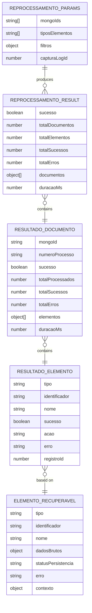
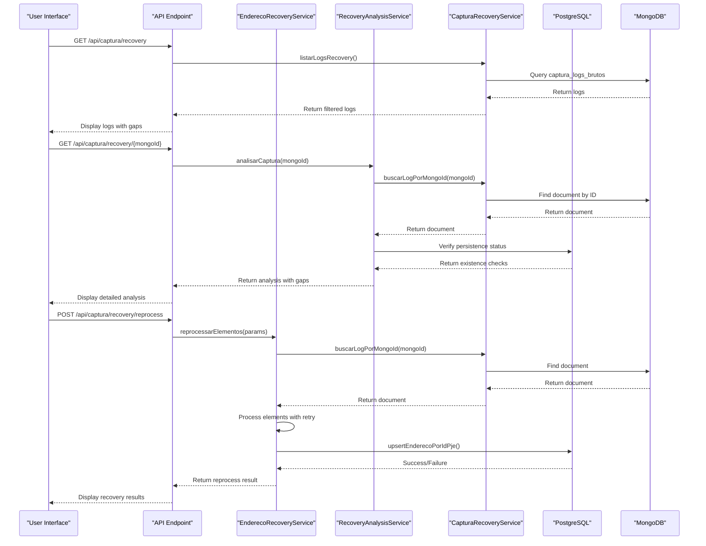
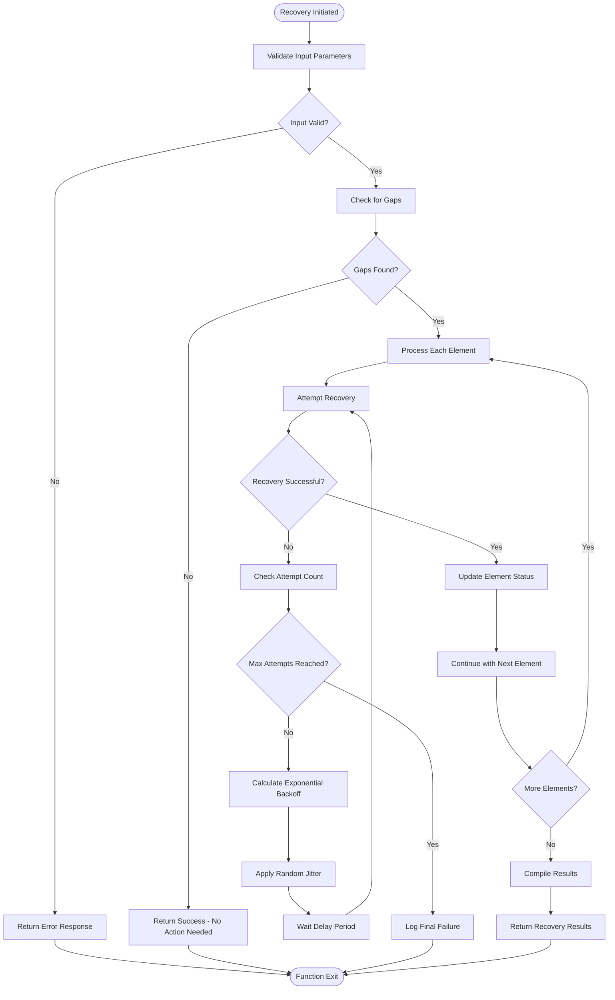
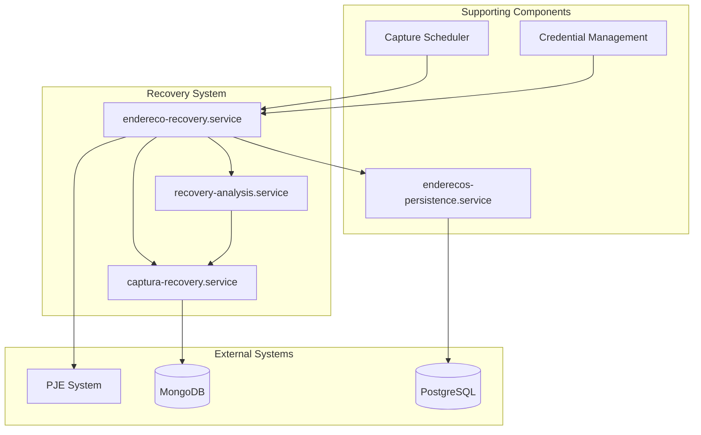

# Recovery Mechanisms

<cite>
**Referenced Files in This Document**   
- [captura-recovery.service.ts](file://backend/captura/services/recovery/captura-recovery.service.ts)
- [endereco-recovery.service.ts](file://backend/captura/services/recovery/endereco-recovery.service.ts)
- [recovery-analysis.service.ts](file://backend/captura/services/recovery/recovery-analysis.service.ts)
- [types.ts](file://backend/captura/services/recovery/types.ts)
- [route.ts](file://backend/captura/services/recovery/route.ts)
- [credential-cache.service.ts](file://backend/captura/credentials/credential-cache.service.ts)
- [use-recovery-analysis.ts](file://app/_lib/hooks/use-recovery-analysis.ts)
- [use-recovery-logs.ts](file://app/_lib/hooks/use-recovery-logs.ts)
</cite>

## Table of Contents
1. [Introduction](#introduction)
2. [Core Recovery Services](#core-recovery-services)
3. [Domain Model and Interfaces](#domain-model-and-interfaces)
4. [Recovery Workflows](#recovery-workflows)
5. [Configuration and Retry Strategies](#configuration-and-retry-strategies)
6. [Integration with Other Components](#integration-with-other-components)
7. [Common Issues and Solutions](#common-issues-and-solutions)
8. [Conclusion](#conclusion)

## Introduction

The Sinesys data capture system implements a robust recovery mechanism to handle partial failures during data extraction from external systems like PJE (Processo Judicial Eletrônico). When a capture operation fails to persist certain elements—such as addresses, parties, or representatives—the raw payload is preserved in MongoDB for later recovery. This document details the implementation of the `captura-recovery.service` and `endereco-recovery.service`, their invocation relationship, and how they coordinate recovery attempts. It also covers the domain model, usage patterns for different failure scenarios, configuration options, and integration with other system components such as credential management and the capture scheduler.

The recovery system enables re-persistence of failed elements by analyzing gaps between the raw data in MongoDB and the persisted data in PostgreSQL. It supports various failure scenarios including credential rotation, temporary service outages, and data corruption, providing mechanisms to retry operations with exponential backoff and circuit breaker patterns to prevent cascading failures.

**Section sources**
- [README.md](file://backend/captura/services/recovery/README.md#L1-L387)

## Core Recovery Services

The recovery mechanism in Sinesys is implemented through two primary services: `captura-recovery.service` and `endereco-recovery.service`. These services work in tandem to identify, analyze, and recover from partial capture failures.

The `captura-recovery.service` serves as the foundational layer for recovery operations. It provides functions to list, search, and retrieve raw capture logs stored in MongoDB. These logs contain the original payload from external systems, which is essential for reprocessing failed elements. The service includes methods for filtering logs by various criteria such as capture type, status, TRT (Tribunal Regional do Trabalho), and date range. It also provides statistical functions to count logs by status and generate TRT-specific metrics, enabling efficient identification of problematic captures.

The `endereco-recovery.service` builds upon the `captura-recovery.service` to implement the actual re-persistence logic, specifically for address data. It coordinates the recovery process by first identifying gaps—elements present in the raw payload but missing in the PostgreSQL database—and then attempting to re-persist them. This service uses a retry mechanism with exponential backoff to handle transient failures during the recovery process.

The invocation relationship between these services follows a clear pattern: the `endereco-recovery.service` calls functions from the `captura-recovery.service` to obtain the raw logs, then processes these logs to identify and recover missing addresses. This separation of concerns allows for modular design, where the data retrieval logic is decoupled from the recovery logic.

```mermaid
classDiagram
class CapturaRecoveryService {
+listarLogsRecovery(params) Promise~ListarLogsRecoveryResult~
+buscarLogPorMongoId(mongoId) Promise~CapturaRawLogDocument | null~
+buscarLogsPorCapturaLogId(capturaLogId) Promise~CapturaRawLogDocument[]~
+contarLogsPorStatus(params) Promise~{success : number, error : number, total : number}~
+estatisticasPorTrt(params) Promise~Array<{trt : string, total : number, success : number, error : number}>~
+verificarPayloadDisponivel(mongoId) Promise~boolean~
+extrairPayloadBruto(mongoId) Promise~unknown | null~
}
class EnderecoRecoveryService {
+reprocessarElementos(params) Promise~ReprocessarResult~
+reprocessarDocumento(mongoId, tiposElementos, filtros) Promise~ResultadoDocumento~
+reprocessarEndereco(elemento, forcarAtualizacao) Promise~ResultadoElemento~
+reprocessarEnderecosPorCapturaLogId(capturaLogId, filtros) Promise~ReprocessarResult~
+reprocessarEnderecoIndividual(mongoId, entidadeTipo, entidadeId, idPjeEndereco) Promise~ResultadoElemento~
}
class RecoveryAnalysisService {
+analisarCaptura(mongoId) Promise~AnaliseCaptura | null~
+analisarDocumento(documento) Promise~AnaliseCaptura~
+analisarGapsAgregado(params) Promise~AnaliseAgregadaResult~
+verificarSeLogPossuiGaps(mongoId) Promise~boolean~
+extrairTodosElementos(mongoId) Promise~TodosElementosResult | null~
}
CapturaRecoveryService <|-- EnderecoRecoveryService : "uses"
RecoveryAnalysisService <|-- EnderecoRecoveryService : "uses"
RecoveryAnalysisService <|-- CapturaRecoveryService : "uses"
```

**Diagram sources **
- [captura-recovery.service.ts](file://backend/captura/services/recovery/captura-recovery.service.ts#L35-L393)
- [endereco-recovery.service.ts](file://backend/captura/services/recovery/endereco-recovery.service.ts#L48-L593)
- [recovery-analysis.service.ts](file://backend/captura/services/recovery/recovery-analysis.service.ts#L37-L647)

**Section sources**
- [captura-recovery.service.ts](file://backend/captura/services/recovery/captura-recovery.service.ts#L1-L395)
- [endereco-recovery.service.ts](file://backend/captura/services/recovery/endereco-recovery.service.ts#L1-L595)

## Domain Model and Interfaces

The recovery system in Sinesys is built around a well-defined domain model that represents the state and progress of recovery operations. This model is implemented through a set of TypeScript interfaces that define the structure of data exchanged between components.

The core interface is `ReprocessarParams`, which defines the parameters for initiating a recovery operation. It includes the MongoDB document IDs (`mongoIds`) or the PostgreSQL capture log ID (`capturaLogId`) to identify which captures to process, the types of elements to recover (`tiposElementos`), and additional filters such as whether to process only missing elements (`apenasGaps`) or force updates even if elements exist (`forcarAtualizacao`).

The recovery process produces results structured according to the `ReprocessarResult` interface, which contains high-level statistics about the operation's success, including the total number of documents processed, elements processed, successes, and errors. For each document processed, a `ResultadoDocumento` object provides detailed information about the recovery attempt, including per-element results in the form of `ResultadoElemento` objects. Each `ResultadoElemento` indicates whether the recovery was successful, the action taken (created, updated, ignored, or errored), and any error message if applicable.

The system also defines interfaces for representing the elements that can be recovered. The `ElementoRecuperavel` interface represents a recoverable entity such as an address, party, or representative, containing its type, identifier, name, raw data, persistence status, and context information. The context may include the entity ID and type in PostgreSQL, which is crucial for establishing relationships during re-persistence.



**Diagram sources **
- [types.ts](file://backend/captura/services/recovery/types.ts#L256-L330)
- [types.ts](file://backend/captura/services/recovery/types.ts#L273-L288)
- [types.ts](file://backend/captura/services/recovery/types.ts#L44-L93)

**Section sources**
- [types.ts](file://backend/captura/services/recovery/types.ts#L1-L571)

## Recovery Workflows

The recovery mechanism in Sinesys follows a structured workflow to identify, analyze, and recover from partial capture failures. This workflow is designed to handle various failure scenarios such as credential rotation, temporary service outages, and data corruption.

The process begins with identification, where the system lists capture logs from MongoDB using the `listarLogsRecovery` function. This function supports filtering by various criteria such as capture type, status, TRT, and date range, allowing users to focus on specific sets of captures that may have failed. The API endpoint `GET /api/captura/recovery` exposes this functionality, enabling both programmatic and UI-based access to the recovery system.

Once potential recovery candidates are identified, the system performs analysis using the `analisarCaptura` function from the `recovery-analysis.service`. This function compares the raw payload in MongoDB with the persisted data in PostgreSQL to identify gaps—elements that exist in the raw data but are missing in the database. For example, it can detect when an address was successfully extracted from PJE but failed to persist due to a validation error or database constraint.

The actual recovery is initiated through the `reprocessarElementos` function in the `endereco-recovery.service`. This function takes the identified MongoDB document IDs and processes them to re-persist missing elements. It supports two modes of operation: processing specific documents by their MongoDB IDs or processing all documents associated with a particular capture log ID in PostgreSQL.

For credential rotation scenarios, the system automatically handles the transition by validating credentials before use and falling back to alternative credentials if necessary. When a temporary service outage occurs, the recovery mechanism can be triggered after the service is restored, using the preserved raw data to complete the capture. In cases of data corruption, the system can reprocess the original payload to create clean records, bypassing the corrupted intermediate state.



**Diagram sources **
- [route.ts](file://app/api/captura/recovery/route.ts#L155-L241)
- [endereco-recovery.service.ts](file://backend/captura/services/recovery/endereco-recovery.service.ts#L48-L593)
- [recovery-analysis.service.ts](file://backend/captura/services/recovery/recovery-analysis.service.ts#L37-L647)

**Section sources**
- [README.md](file://backend/captura/services/recovery/README.md#L303-L332)
- [use-recovery-analysis.ts](file://app/_lib/hooks/use-recovery-analysis.ts)
- [use-recovery-logs.ts](file://app/_lib/hooks/use-recovery-logs.ts)

## Configuration and Retry Strategies

The recovery system in Sinesys includes configurable parameters that control retry behavior and recovery strategies. These configurations are essential for handling transient failures and preventing cascading issues during the recovery process.

The `endereco-recovery.service` implements a retry mechanism with exponential backoff through the `withRetry` utility function. This configuration is defined in the `RETRY_CONFIG` constant, which specifies the maximum number of attempts (3), base delay (500ms), and maximum delay (5000ms). This strategy ensures that temporary issues like network timeouts or database locks are handled gracefully by progressively increasing the wait time between retries.

The recovery process also supports several parameters that control its behavior. The `apenasGaps` filter ensures that only missing elements are processed, preventing unnecessary updates to existing data. The `forcarAtualizacao` parameter allows forcing an update even if the element already exists, which is useful when correcting data corruption. These parameters can be passed through the API or programmatically when calling the recovery functions.

The system's retry logic is implemented in the `withRetry` function from the `backend/utils/retry` module. This function supports custom retry conditions through the `isRetryable` callback, which determines whether a specific error should trigger a retry. By default, it retries on network errors, timeouts, database deadlocks, and HTTP 5xx server errors, but not on client errors (4xx) or validation issues.



**Diagram sources **
- [endereco-recovery.service.ts](file://backend/captura/services/recovery/endereco-recovery.service.ts#L32-L36)
- [index.ts](file://backend/utils/retry/index.ts#L5-L134)

**Section sources**
- [endereco-recovery.service.ts](file://backend/captura/services/recovery/endereco-recovery.service.ts#L207-L210)
- [index.ts](file://backend/utils/retry/index.ts#L63-L114)

## Integration with Other Components

The recovery mechanism in Sinesys integrates closely with several other system components, particularly the credential management system and the capture scheduler. These integrations ensure that recovery operations can proceed smoothly even when the original failure was related to authentication or scheduling issues.

The credential management system plays a crucial role in recovery operations, especially when failures were caused by credential rotation or expiration. The `credential-cache.service` provides a caching layer for credentials, reducing database queries and improving performance during recovery. When a recovery operation requires access to external systems like PJE, it retrieves the necessary credentials through this service, which handles validation and automatic refresh if needed.

The capture scheduler coordinates the timing of both initial capture attempts and recovery operations. When a capture fails partially, the scheduler can be configured to automatically trigger recovery after a certain delay, allowing time for transient issues to resolve. The recovery system uses the same scheduling infrastructure as regular captures, ensuring consistent behavior and resource management.

The recovery services also integrate with the persistence layer through dedicated services like `enderecos-persistence.service`. When re-persisting addresses, the `endereco-recovery.service` calls the `upsertEnderecoPorIdPje` function, which handles the database operations with proper error handling and transaction management. This separation ensures that the recovery logic remains focused on coordination while delegating data access to specialized components.



**Diagram sources **
- [credential-cache.service.ts](file://backend/captura/credentials/credential-cache.service.ts#L1-L445)
- [captura-log.service.ts](file://backend/captura/services/captura-log.service.ts#L1-L66)

**Section sources**
- [credential-cache.service.ts](file://backend/captura/credentials/credential-cache.service.ts#L1-L445)
- [captura-log.service.ts](file://backend/captura/services/captura-log.service.ts#L1-L66)

## Common Issues and Solutions

The recovery mechanism in Sinesys addresses several common issues that can occur during data capture operations. Understanding these issues and their solutions is crucial for maintaining system reliability and data integrity.

One common issue is infinite retry loops, which can occur when a recovery operation consistently fails for the same reason. The system prevents this through the `maxAttempts` parameter in the retry configuration, which limits the number of retry attempts to three by default. After this limit is reached, the operation fails permanently, preventing resource exhaustion.

Resource contention during recovery is another potential issue, especially when multiple recovery operations run simultaneously. The system mitigates this through the use of exponential backoff with jitter, which spreads out retry attempts over time and reduces the likelihood of thundering herd problems. The jitter adds a random component (0-30%) to the delay, ensuring that retries from different operations are unlikely to coincide.

Cascading failures can occur when a failure in one component triggers failures in others. The recovery system addresses this through circuit breaker patterns and proper error isolation. Each element is processed independently, so a failure in one address recovery does not prevent others from being processed. Additionally, the system uses database transactions and proper error handling to ensure that partial failures do not leave the database in an inconsistent state.

For specific issues like address creation failures, the system provides detailed error messages that help diagnose the root cause. Common causes include the parent entity (client, opposing party, or third party) not existing, duplicate `id_pje` values causing constraint violations, or invalid data in the payload. The recovery analysis provides context about these issues, allowing administrators to take corrective action.

**Section sources**
- [README.md](file://backend/captura/services/recovery/README.md#L350-L366)

## Conclusion

The recovery mechanisms in Sinesys data capture provide a comprehensive solution for handling partial failures during data extraction from external systems. Through the coordinated operation of the `captura-recovery.service` and `endereco-recovery.service`, the system can identify, analyze, and recover from various failure scenarios including credential rotation, temporary service outages, and data corruption.

The domain model, built around well-defined interfaces, enables flexible recovery operations with configurable parameters for controlling retry behavior and processing strategies. The integration with credential management and the capture scheduler ensures that recovery operations can proceed smoothly, even when the original failure was related to authentication or timing issues.

By implementing exponential backoff, circuit breakers, and attempt limits, the system effectively addresses common issues like infinite retry loops, resource contention, and cascading failures. This robust recovery framework ensures data integrity and system reliability, making Sinesys capable of maintaining accurate and complete data even in the face of transient failures.