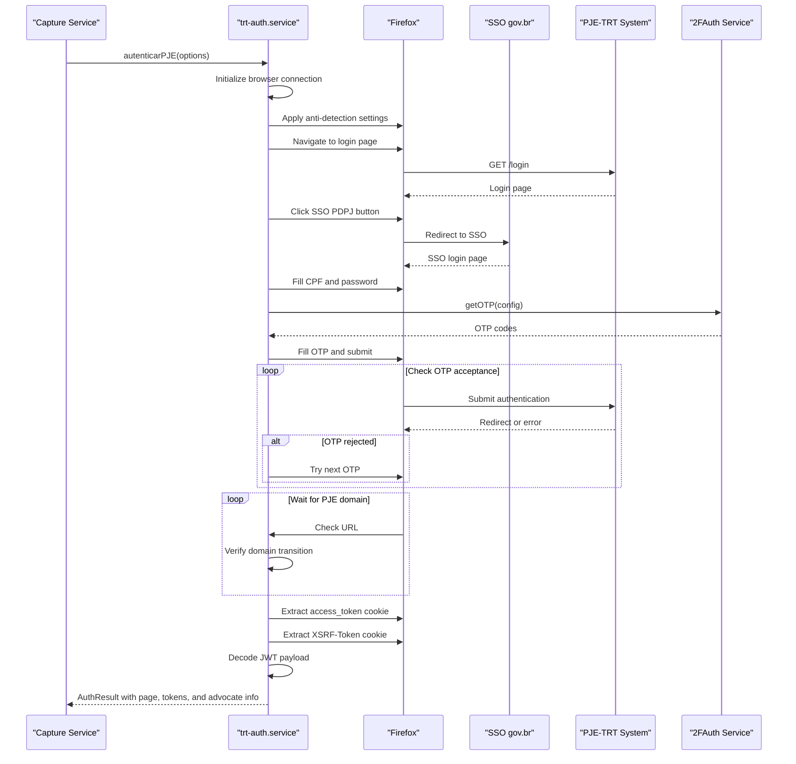
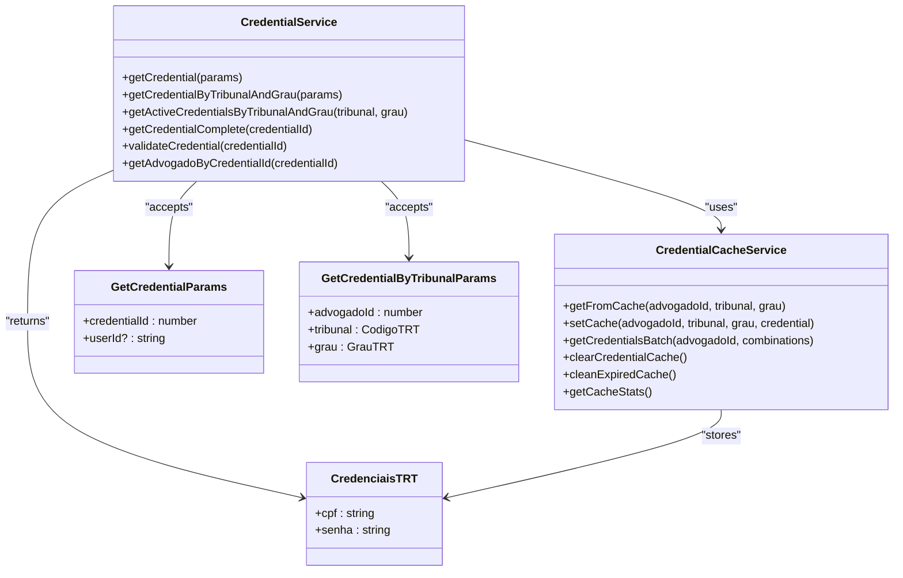
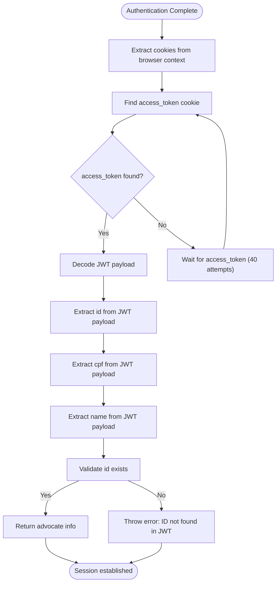
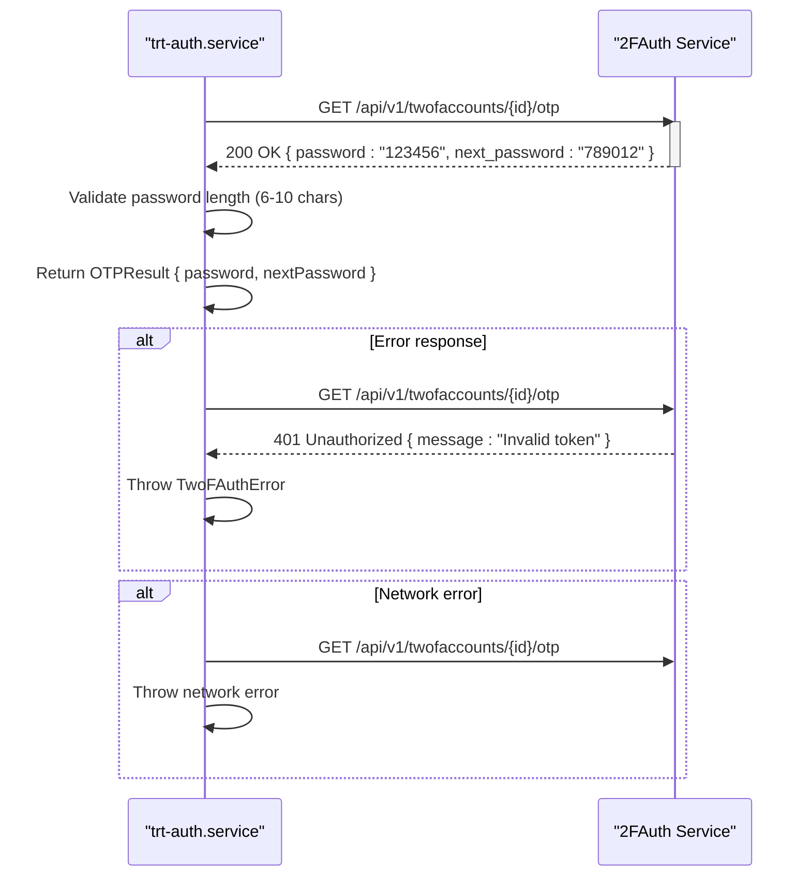
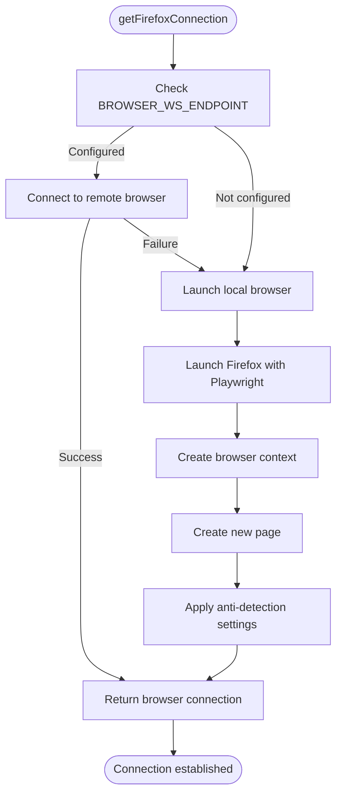
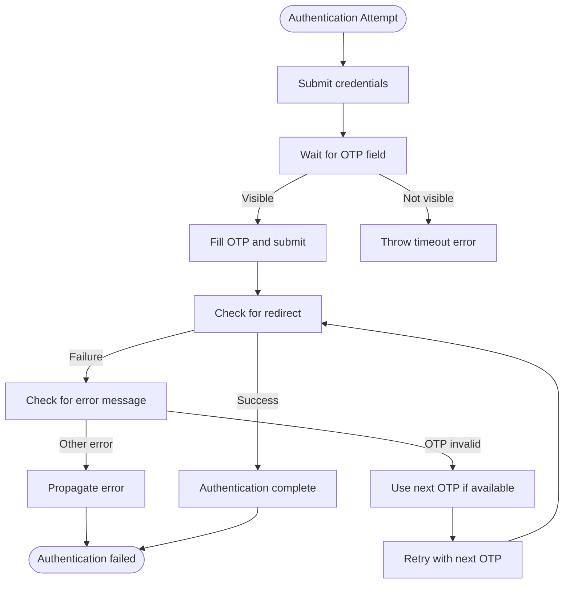
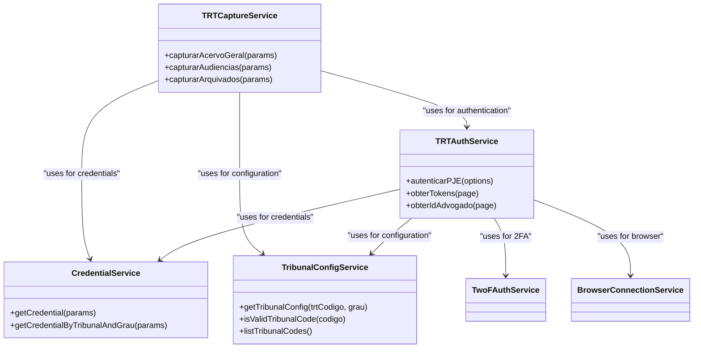

# Authentication Service

<cite>
**Referenced Files in This Document**   
- [trt-auth.service.ts](file://backend/captura/services/trt/trt-auth.service.ts)
- [credential.service.ts](file://backend/captura/credentials/credential.service.ts)
- [credential-cache.service.ts](file://backend/captura/credentials/credential-cache.service.ts)
- [config.ts](file://backend/captura/services/trt/config.ts)
- [trt-types.ts](file://backend/types/captura/trt-types.ts)
- [twofauth.service.ts](file://backend/api/twofauth.service.ts)
- [browser-connection.service.ts](file://backend/captura/services/browser/browser-connection.service.ts)
- [api-auth.ts](file://backend/auth/api-auth.ts)
</cite>

## Table of Contents
1. [Introduction](#introduction)
2. [Authentication Flow](#authentication-flow)
3. [Credential Management](#credential-management)
4. [Session Handling](#session-handling)
5. [Two-Factor Authentication Integration](#two-factor-authentication-integration)
6. [Browser Connection and Anti-Detection](#browser-connection-and-anti-detection)
7. [Error Handling and Common Issues](#error-handling-and-common-issues)
8. [Security Considerations](#security-considerations)
9. [Integration with Capture Orchestration](#integration-with-capture-orchestration)
10. [Configuration and Environment Variables](#configuration-and-environment-variables)

## Introduction

The PJE-TRT authentication service provides a robust mechanism for establishing and maintaining authenticated sessions with the PJE-TRT (Processo Judicial Eletrônico - Tribunal Regional do Trabalho) system. This service is designed to handle the complete authentication lifecycle, including credential management, two-factor authentication, session persistence, and browser automation. The implementation follows a modular architecture with clear separation of concerns between authentication logic, credential storage, and browser interaction components.

The authentication service is built on Playwright for browser automation and integrates with external services for two-factor authentication. It supports both remote (production) and local (development) browser execution modes, with comprehensive logging and error handling throughout the authentication process.

**Section sources**
- [trt-auth.service.ts](file://backend/captura/services/trt/trt-auth.service.ts#L1-L603)
- [trt-types.ts](file://backend/types/captura/trt-types.ts#L1-L126)

## Authentication Flow

The authentication flow for the PJE-TRT system follows a multi-step process that begins with browser initialization and concludes with a fully authenticated session. The primary function `autenticarPJE` orchestrates this entire process, which consists of the following stages:

1. **Browser Initialization**: The service establishes a connection to either a remote Firefox instance (in production) or launches a local Firefox browser (in development). This is handled by the `getFirefoxConnection` function, which abstracts the connection details.

2. **Anti-Detection Configuration**: Before navigation, the service applies anti-detection measures to prevent the PJE system from identifying the automated nature of the browser. This includes setting navigator properties to mask automation flags.

3. **SSO Login**: The service navigates to the PJE login page and clicks the SSO PDPJ button to initiate the government authentication process. It then fills in the CPF and password credentials obtained from the credential service.

4. **Two-Factor Authentication**: After submitting the credentials, the system detects and processes the OTP (One-Time Password) field. The service retrieves the current and next OTP codes from the 2FAuth service and handles submission with retry logic.

5. **Token Extraction**: Once authenticated, the service captures the JWT access token and XSRF token from cookies, which are used for subsequent API requests.

6. **Advocate Information Extraction**: The service decodes the JWT payload to extract the advocate's ID, CPF, and name, which are used for identification in subsequent operations.

**Diagram sources **
- [trt-auth.service.ts](file://backend/captura/services/trt/trt-auth.service.ts#L539-L603)
- [browser-connection.service.ts](file://backend/captura/services/browser/browser-connection.service.ts#L170-L204)

**Section sources**
- [trt-auth.service.ts](file://backend/captura/services/trt/trt-auth.service.ts#L539-L603)
- [browser-connection.service.ts](file://backend/captura/services/browser/browser-connection.service.ts#L170-L204)

## Credential Management

The credential management system provides secure storage and retrieval of advocate credentials for accessing the PJE-TRT system. Credentials are stored in the database and accessed through a layered service architecture that includes caching for performance optimization.

The `credential.service.ts` file implements the primary interface for credential operations, with functions to retrieve credentials by ID, by tribunal and degree, and in batch operations. The service uses Supabase for database access with appropriate permission handling based on the requesting user.

A key feature of the credential system is the in-memory cache implemented in `credential-cache.service.ts`. This cache stores credentials for a configurable TTL (Time To Live) of 5 minutes, reducing database queries when processing multiple tribunals or degrees for the same advocate. The cache uses a composite key format of `${advogadoId}:${tribunal}:${grau}` to uniquely identify cached credentials.

**Diagram sources **
- [credential.service.ts](file://backend/captura/credentials/credential.service.ts#L39-L400)
- [credential-cache.service.ts](file://backend/captura/credentials/credential-cache.service.ts#L1-L447)

**Section sources**
- [credential.service.ts](file://backend/captura/credentials/credential.service.ts#L39-L400)
- [credential-cache.service.ts](file://backend/captura/credentials/credential-cache.service.ts#L1-L447)

## Session Handling

Session management in the PJE-TRT authentication service involves the creation, maintenance, and extraction of authentication tokens that represent an authenticated session with the PJE system. The service handles both the browser-level session (Playwright context) and the application-level session tokens.

The primary session token is the JWT (JSON Web Token) stored in the `access_token` cookie, which is extracted from the browser context after successful authentication. This token contains the advocate's identification information and is used for subsequent API requests to the PJE system. The service also captures the XSRF token, which is required for state-changing operations.

Session persistence is maintained through the Playwright `BrowserContext` object, which preserves cookies, localStorage, and other session data across page navigations. The authentication service returns this context along with the page object, allowing subsequent operations to continue within the same authenticated session.

The service implements a robust mechanism for extracting the JWT payload by base64-decoding the token's payload segment. This allows the system to obtain the advocate's ID, CPF, and name directly from the token without making additional API calls to the PJE system.

**Diagram sources **
- [trt-auth.service.ts](file://backend/captura/services/trt/trt-auth.service.ts#L390-L533)
- [trt-auth.service.ts](file://backend/captura/services/trt/trt-auth.service.ts#L418-L533)

**Section sources**
- [trt-auth.service.ts](file://backend/captura/services/trt/trt-auth.service.ts#L390-L533)

## Two-Factor Authentication Integration

The PJE-TRT authentication service integrates with an external 2FAuth service to handle two-factor authentication requirements. This integration is implemented in the `twofauth.service.ts` file, which provides a standardized interface for obtaining OTP (One-Time Password) codes used in the authentication process.

The service uses the `getOTP` function to retrieve both the current and next OTP codes from the 2FAuth API. This dual-code retrieval is crucial for handling cases where the current code expires during transmission. The function supports configuration via parameters or environment variables, providing flexibility for different deployment environments.

The authentication flow implements a retry mechanism when the initial OTP is rejected. If the system detects an error message containing terms like "inválido", "invalid", "código", or "incorreto", it automatically attempts to authenticate with the next OTP code if available. This significantly improves success rates in scenarios with timing issues.

The 2FAuth service configuration requires three components: the API URL, authentication token, and account ID. These can be provided directly in the configuration object or through environment variables (`TWOFAUTH_API_URL`, `TWOFAUTH_API_TOKEN`, `TWOFAUTH_ACCOUNT_ID`), with the environment variables serving as fallbacks.

**Diagram sources **
- [twofauth.service.ts](file://backend/api/twofauth.service.ts#L77-L196)
- [trt-auth.service.ts](file://backend/captura/services/trt/trt-auth.service.ts#L89-L217)

**Section sources**
- [twofauth.service.ts](file://backend/api/twofauth.service.ts#L77-L196)
- [trt-auth.service.ts](file://backend/captura/services/trt/trt-auth.service.ts#L89-L217)

## Browser Connection and Anti-Detection

The browser connection system provides a flexible interface for establishing connections to Firefox instances, supporting both remote and local execution modes. This is implemented in the `browser-connection.service.ts` file, which abstracts the connection details and provides a consistent interface for browser automation.

In production environments, the service connects to a remote Firefox instance via WebSocket using the `BROWSER_WS_ENDPOINT` environment variable. This remote browser is typically hosted on a dedicated server with Playwright Browser Server. For development environments, the service falls back to launching a local Firefox instance.

The service implements anti-detection measures to prevent the PJE system from identifying automated access. These measures include:
- Setting `navigator.webdriver` to `false` to mask automation
- Overriding the `navigator.plugins` array to appear as a real browser
- Setting `navigator.languages` to Brazilian Portuguese
- Using a realistic Firefox user agent string

The connection service also includes health checking functionality to verify the availability of the remote browser service before attempting to establish a connection.

**Diagram sources **
- [browser-connection.service.ts](file://backend/captura/services/browser/browser-connection.service.ts#L170-L204)
- [browser-connection.service.ts](file://backend/captura/services/browser/browser-connection.service.ts#L54-L274)

**Section sources**
- [browser-connection.service.ts](file://backend/captura/services/browser/browser-connection.service.ts#L54-L274)

## Error Handling and Common Issues

The PJE-TRT authentication service implements comprehensive error handling to address common issues that may occur during the authentication process. The service uses structured logging with emoji indicators for different log levels (info, success, warn, error) to facilitate debugging and monitoring.

Common issues and their handling strategies include:

**Expired Sessions**: The service automatically handles session expiration by re-authenticating when needed. Since credentials are retrieved from the database and the authentication flow is designed to be idempotent, session renewal is transparent to higher-level services.

**Invalid Credentials**: When credentials are invalid, the service captures the error from the SSO login process and propagates it appropriately. The credential service validates that credentials exist and are active before use, reducing the likelihood of invalid credentials being attempted.

**Multi-Factor Authentication Challenges**: The service implements a robust OTP handling mechanism that includes:
- Waiting for the OTP field to become visible (up to 20 seconds)
- Retrieving both current and next OTP codes
- Automatic retry with the next code if the current one is rejected
- Detection of error messages containing keywords like "inválido" or "código"

**Network Issues**: The service includes retry logic for network-related errors during the SSO button click operation. If a network error occurs, the service reloads the login page and attempts the click again, up to three times.

**Browser Detection**: To counter browser detection mechanisms, the service applies anti-detection measures and uses realistic timing between operations (delays of 2-5 seconds).

**Timeout Handling**: The service implements multiple timeout mechanisms:
- 30-second timeout for page load states
- 120-second timeout for SSO redirects
- Configurable timeouts for specific tribunal operations

**Diagram sources **
- [trt-auth.service.ts](file://backend/captura/services/trt/trt-auth.service.ts#L94-L217)
- [trt-auth.service.ts](file://backend/captura/services/trt/trt-auth.service.ts#L309-L341)

**Section sources**
- [trt-auth.service.ts](file://backend/captura/services/trt/trt-auth.service.ts#L46-L54)
- [trt-auth.service.ts](file://backend/captura/services/trt/trt-auth.service.ts#L94-L217)

## Security Considerations

The PJE-TRT authentication service implements multiple security measures to protect sensitive credentials and maintain the integrity of the authentication process. These measures address both application-level security and browser-level security concerns.

Credential security is maintained through several mechanisms:
- Credentials are stored encrypted in the database
- The credential service validates user permissions when accessing credentials
- Credentials are only held in memory during the authentication process
- The service uses environment variables for sensitive configuration

Session security follows best practices:
- The `access_token` cookie is HTTPOnly and Secure, preventing JavaScript access and ensuring transmission only over HTTPS
- The service extracts JWT information server-side, avoiding client-side token handling
- XSRF tokens are captured and can be used for state-changing operations

The service implements anti-detection measures to prevent the PJE system from blocking automated access, while maintaining ethical scraping practices:
- Realistic user agent strings
- Human-like timing between operations
- Randomized delays to avoid pattern detection

Authentication is protected by multiple factors:
- Password-based authentication with CPF
- Two-factor authentication via time-based OTP
- Environment-level security through API keys and service tokens

```mermaid
flowchart TD
subgraph SecurityMeasures
Credentials["Credential Security"]
Sessions["Session Security"]
AntiDetection["Anti-Detection"]
Authentication["Authentication Security"]
end
Credentials --> EncryptedStorage["Encrypted database storage"]
Credentials --> PermissionValidation["Permission validation"]
Credentials --> InMemoryOnly["In-memory only during use"]
Sessions --> HTTPOnly["HTTPOnly cookies"]
Sessions --> Secure["Secure flag (HTTPS only)"]
Sessions --> ServerSideJWT["Server-side JWT processing"]
AntiDetection --> RealisticUserAgent["Realistic user agent"]
AntiDetection --> HumanTiming["Human-like timing"]
AntiDetection --> RandomDelays["Randomized delays"]
Authentication --> TwoFactor["Two-factor authentication"]
Authentication --> EnvironmentKeys["Environment-level API keys"]
Authentication --> ServiceTokens["Service authentication tokens"]
style Credentials fill:#f9f,stroke:#333
style Sessions fill:#f9f,stroke:#333
style AntiDetection fill:#f9f,stroke:#333
style Authentication fill:#f9f,stroke:#333
```

**Diagram sources **
- [credential.service.ts](file://backend/captura/credentials/credential.service.ts#L45-L66)
- [trt-auth.service.ts](file://backend/captura/services/trt/trt-auth.service.ts#L64-L83)
- [app/ajuda/desenvolvimento/integracao-pje/page.tsx](file://app/ajuda/desenvolvimento/integracao-pje/page.tsx#L92-L97)

**Section sources**
- [credential.service.ts](file://backend/captura/credentials/credential.service.ts#L45-L66)
- [trt-auth.service.ts](file://backend/captura/services/trt/trt-auth.service.ts#L64-L83)
- [app/ajuda/desenvolvimento/integracao-pje/page.tsx](file://app/ajuda/desenvolvimento/integracao-pje/page.tsx#L92-L97)

## Integration with Capture Orchestration

The PJE-TRT authentication service is designed to integrate seamlessly with the broader capture orchestration system. The service provides a clean interface that can be consumed by various capture services for different types of data extraction from the PJE system.

The authentication result (`AuthResult`) contains all necessary components for subsequent capture operations:
- The authenticated `Page` object for direct browser interaction
- The `Browser` and `BrowserContext` objects for managing the browser session
- The `advogadoInfo` object with advocate identification
- The `tokens` object with JWT and XSRF tokens for API requests

Capture services for specific data types (acervo geral, audiências, arquivados, etc.) use the authentication service to establish a session before performing their specialized operations. This separation of concerns allows each capture service to focus on its specific data extraction logic while relying on the authentication service for session management.

The service is configured through the `ConfigTRT` interface, which is populated from the database via the tribunal configuration service. This allows dynamic configuration of login URLs, base URLs, and API endpoints for different TRTs and degrees.

**Diagram sources **
- [trt-auth.service.ts](file://backend/captura/services/trt/trt-auth.service.ts#L552-L603)
- [trt-capture.service.ts](file://backend/captura/services/trt/trt-capture.service.ts#L11-L36)
- [config.ts](file://backend/captura/services/trt/config.ts#L100-L132)

**Section sources**
- [trt-auth.service.ts](file://backend/captura/services/trt/trt-auth.service.ts#L552-L603)
- [trt-capture.service.ts](file://backend/captura/services/trt/trt-capture.service.ts#L11-L36)
- [config.ts](file://backend/captura/services/trt/config.ts#L100-L132)

## Configuration and Environment Variables

The PJE-TRT authentication service relies on several configuration parameters and environment variables to control its behavior across different environments. These configurations are organized into logical groups that correspond to different aspects of the service.

**Browser Configuration**:
- `BROWSER_WS_ENDPOINT`: WebSocket endpoint for remote Firefox instance
- `BROWSER_SERVICE_TOKEN`: Authentication token for browser service
- `BROWSER_SERVICE_URL`: HTTP URL for browser service health checks

**Two-Factor Authentication Configuration**:
- `TWOFAUTH_API_URL`: Base URL for 2FAuth API
- `TWOFAUTH_API_TOKEN`: Authentication token for 2FAuth API
- `TWOFAUTH_ACCOUNT_ID`: Account ID for OTP retrieval

**Service Configuration**:
- `SERVICE_API_KEY`: API key for system service authentication
- `CACHE_TTL_MS`: Time-to-live for credential and configuration caches (default: 300000ms)

The service follows a hierarchy for configuration values, with explicit parameters taking precedence over environment variables. This allows for flexible configuration in different deployment scenarios while providing sensible defaults.

The tribunal configuration is stored in the database and cached in memory for 5 minutes to reduce database queries. The configuration includes login URLs, base URLs, API endpoints, and custom timeouts for each tribunal and degree combination.

**Section sources**
- [browser-connection.service.ts](file://backend/captura/services/browser/browser-connection.service.ts#L57-L66)
- [twofauth.service.ts](file://backend/api/twofauth.service.ts#L79-L81)
- [api-auth.ts](file://backend/auth/api-auth.ts#L56-L57)
- [credential-cache.service.ts](file://backend/captura/credentials/credential-cache.service.ts#L54)
- [config.ts](file://backend/captura/services/trt/config.ts#L33)