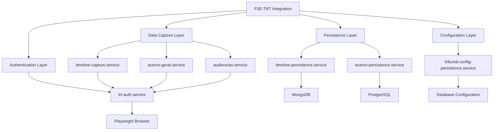
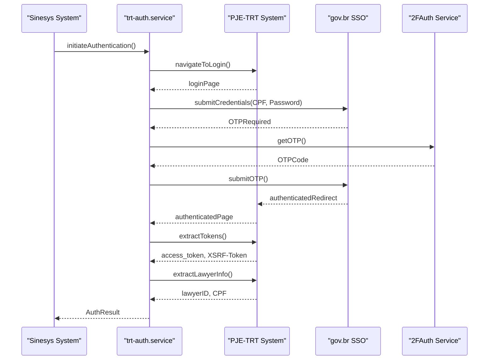
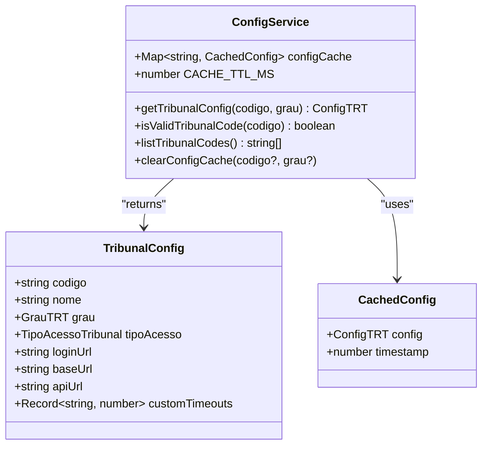
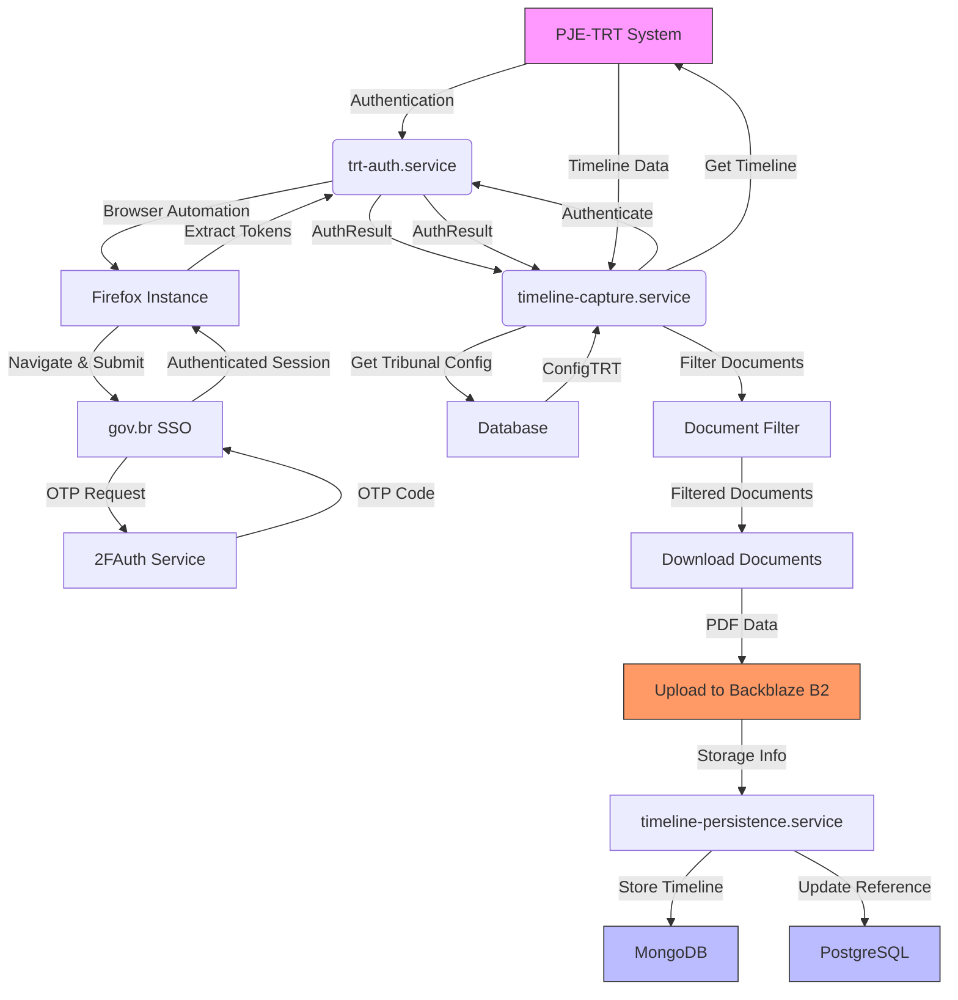

# PJE-TRT Integration

<cite>
**Referenced Files in This Document**   
- [trt-auth.service.ts](file://backend/captura/services/trt/trt-auth.service.ts)
- [trt-capture.service.ts](file://backend/captura/services/trt/trt-capture.service.ts)
- [timeline-capture.service.ts](file://backend/captura/services/timeline/timeline-capture.service.ts)
- [config.ts](file://backend/captura/services/trt/config.ts)
- [index.ts](file://backend/api/pje-trt/index.ts)
- [timeline/index.ts](file://backend/api/pje-trt/timeline/index.ts)
- [trt-types.ts](file://backend/types/captura/trt-types.ts)
- [timeline.ts](file://backend/types/pje-trt/timeline.ts)
</cite>

## Table of Contents
1. [Introduction](#introduction)
2. [Architecture Overview](#architecture-overview)
3. [Core Components](#core-components)
4. [Authentication Process](#authentication-process)
5. [Data Extraction Process](#data-extraction-process)
6. [Configuration and Tribunal Settings](#configuration-and-tribunal-settings)
7. [API Endpoints and Interfaces](#api-endpoints-and-interfaces)
8. [Error Handling and Common Issues](#error-handling-and-common-issues)
9. [Data Flow Diagrams](#data-flow-diagrams)
10. [Usage Patterns and Examples](#usage-patterns-and-examples)

## Introduction

The PJE-TRT integration component of the Sinesys data capture system enables automated extraction of judicial data from the PJE-TRT (Processo Judicial Eletrônico do Tribunal Regional do Trabalho) system. This integration facilitates seamless data retrieval for legal professionals, allowing them to access case information, timelines, documents, and other relevant data without manual intervention. The component is designed to handle the complexities of the PJE-TRT authentication system, including two-factor authentication, while providing robust error handling and recovery mechanisms.

The integration layer serves as a bridge between the Sinesys platform and the PJE-TRT judicial system, orchestrating the entire data capture process from authentication to data persistence. It supports multiple TRT jurisdictions and adapts to their specific configurations, ensuring compatibility across different regional labor courts in Brazil.

**Section sources**
- [trt-auth.service.ts](file://backend/captura/services/trt/trt-auth.service.ts#L1-L603)
- [trt-capture.service.ts](file://backend/captura/services/trt/trt-capture.service.ts#L1-L36)

## Architecture Overview

The PJE-TRT integration architecture consists of several interconnected components that work together to automate data extraction. The system follows a layered approach with clear separation of concerns between authentication, data capture, and persistence layers. At its core, the integration uses Playwright for browser automation to navigate the PJE-TRT web interface, handle authentication flows, and extract data.

The architecture is designed to be modular, with distinct services for different types of data extraction (timeline, acervo geral, audiências, etc.) while sharing common authentication and configuration infrastructure. This modular design allows for easy extension to support additional data types or tribunal configurations without affecting existing functionality.



**Diagram sources **
- [trt-auth.service.ts](file://backend/captura/services/trt/trt-auth.service.ts#L1-L603)
- [timeline-capture.service.ts](file://backend/captura/services/timeline/timeline-capture.service.ts#L1-L352)
- [config.ts](file://backend/captura/services/trt/config.ts#L1-L203)

## Core Components

The PJE-TRT integration comprises three primary services that handle different aspects of the data capture process: trt-auth.service for authentication, timeline-capture.service for data extraction, and trt-capture.service for orchestrating the capture process. These services work in concert to provide a complete solution for automated data retrieval from the PJE-TRT system.

The integration also includes supporting components for configuration management, data persistence, and error recovery. The system is designed to be resilient, with built-in retry mechanisms and error handling to cope with the inherent instability of web scraping operations and potential service outages in the target judicial system.

**Section sources**
- [trt-auth.service.ts](file://backend/captura/services/trt/trt-auth.service.ts#L1-L603)
- [trt-capture.service.ts](file://backend/captura/services/trt/trt-capture.service.ts#L1-L36)
- [timeline-capture.service.ts](file://backend/captura/services/timeline/timeline-capture.service.ts#L1-L352)

## Authentication Process

The trt-auth.service handles the complete authentication flow for accessing the PJE-TRT system. This service implements a robust authentication mechanism that navigates through the SSO (Single Sign-On) process, including the gov.br authentication gateway and two-factor authentication requirements. The authentication process follows these key steps:

1. Initialize a Firefox browser instance with anti-detection configurations to prevent the PJE system from identifying automated access
2. Navigate to the tribunal-specific login URL and initiate the SSO process
3. Submit the user credentials (CPF and password) through the gov.br authentication interface
4. Process the two-factor authentication (2FA) using the 2FAuth service to obtain and submit the OTP (One-Time Password)
5. Capture authentication tokens (access_token and XSRF-Token) from cookies for subsequent API requests
6. Extract the lawyer's identification information from the JWT token for audit and tracking purposes

The service includes comprehensive error handling for various authentication failure scenarios, including network errors, invalid credentials, and OTP validation failures. It also implements retry mechanisms with exponential backoff to handle temporary service unavailability.



**Diagram sources **
- [trt-auth.service.ts](file://backend/captura/services/trt/trt-auth.service.ts#L1-L603)

## Data Extraction Process

The timeline-capture.service orchestrates the complete data extraction process for case timelines and associated documents. This service coordinates between authentication, data retrieval, document downloading, and persistence operations to provide a seamless data capture experience. The extraction process follows these key steps:

1. Obtain tribunal-specific configuration from the database, including URLs and access parameters
2. Authenticate with the PJE-TRT system using the trt-auth.service
3. Retrieve the complete timeline for a specific case using the PJE-TRT API
4. Filter documents based on configurable criteria (signed status, confidentiality, document types, date ranges)
5. Download PDFs of selected documents with proper error handling and retry mechanisms
6. Upload downloaded documents to Backblaze B2 cloud storage
7. Persist the timeline data and document references in MongoDB
8. Update the PostgreSQL database with references to the stored timeline data

The service includes configurable parameters to control the extraction process, such as whether to download documents, filtering criteria for documents, and date ranges for timeline retrieval. It also implements rate limiting and delay mechanisms to prevent overloading the PJE-TRT system.

**Section sources**
- [timeline-capture.service.ts](file://backend/captura/services/timeline/timeline-capture.service.ts#L1-L352)
- [trt-auth.service.ts](file://backend/captura/services/trt/trt-auth.service.ts#L1-L603)

## Configuration and Tribunal Settings

The integration supports tribunal-specific configurations through a flexible configuration system that stores settings in the database. The config.ts service manages tribunal configurations with an in-memory cache to improve performance and reduce database load. Each tribunal configuration includes the following key parameters:

- **codigo**: Tribunal code (e.g., 'TRT3')
- **nome**: Tribunal name
- **grau**: Instance level ('primeiro_grau', 'segundo_grau', 'tribunal_superior')
- **tipoAcesso**: Access type determining the instance level mapping
- **loginUrl**: URL for the tribunal's login page
- **baseUrl**: Base URL for the tribunal's PJE system
- **apiUrl**: API endpoint URL for data retrieval
- **customTimeouts**: Optional custom timeout settings for specific operations

The configuration system implements a 5-minute in-memory cache with TTL (Time To Live) to balance performance and freshness of configuration data. It also provides functions to validate tribunal codes, list available tribunals, and clear the configuration cache when needed.



**Diagram sources **
- [config.ts](file://backend/captura/services/trt/config.ts#L1-L203)
- [trt-types.ts](file://backend/types/captura/trt-types.ts#L1-L100)

## API Endpoints and Interfaces

The PJE-TRT integration exposes a well-defined set of interfaces and parameters for initiating data capture operations. The main entry point is the timeline-capture.service, which provides the capturarTimeline function with the following parameters:

- **trtCodigo**: TRT code (e.g., 'TRT3')
- **grau**: Instance level ('primeiro_grau', 'segundo_grau', 'tribunal_superior')
- **processoId**: Case ID in the PJE system
- **numeroProcesso**: Case number in standard format
- **advogadoId**: Lawyer ID for credential retrieval
- **baixarDocumentos**: Flag to enable document downloading (default: true)
- **filtroDocumentos**: Document filtering criteria

The service returns a comprehensive result object containing the timeline data, document download status, and persistence information. The API layer (backend/api/pje-trt) provides re-exports of all PJE-TRT functions, allowing for clean imports and centralized access to the integration functionality.

**Section sources**
- [timeline-capture.service.ts](file://backend/captura/services/timeline/timeline-capture.service.ts#L31-L80)
- [index.ts](file://backend/api/pje-trt/index.ts#L1-L47)
- [timeline/index.ts](file://backend/api/pje-trt/timeline/index.ts#L1-L13)

## Error Handling and Common Issues

The PJE-TRT integration includes comprehensive error handling mechanisms to address common issues encountered during data capture operations. The system is designed to be resilient and provide meaningful feedback when problems occur.

Common issues and their solutions include:

**Authentication Failures**: The system handles OTP validation failures by attempting to use the next OTP code if available. It also implements retry mechanisms for network-related errors during the authentication process. For persistent authentication failures, the system provides detailed error messages to help diagnose the root cause.

**Rate Limiting**: The integration respects the PJE system's rate limits by implementing delays between document downloads (500ms) and using appropriate timeouts for API requests. The configuration system allows for custom timeouts to be set for specific tribunals that may have different performance characteristics.

**Temporary Service Outages**: The system implements retry mechanisms with exponential backoff for transient errors. It also includes comprehensive logging to help diagnose and recover from service outages. When a tribunal's service is temporarily unavailable, the system will continue to retry the operation according to the configured retry policy.

**Document Download Errors**: For failed document downloads, the system captures the error information and continues processing other documents. It maintains counters for successful and failed downloads, providing visibility into the overall success rate of the capture operation.

**Section sources**
- [trt-auth.service.ts](file://backend/captura/services/trt/trt-auth.service.ts#L1-L603)
- [timeline-capture.service.ts](file://backend/captura/services/timeline/timeline-capture.service.ts#L1-L352)

## Data Flow Diagrams

The following diagrams illustrate the complete data flow from the PJE-TRT system through the capture services to the database storage.



**Diagram sources **
- [trt-auth.service.ts](file://backend/captura/services/trt/trt-auth.service.ts#L1-L603)
- [timeline-capture.service.ts](file://backend/captura/services/timeline/timeline-capture.service.ts#L1-L352)
- [timeline-persistence.service.ts](file://backend/captura/services/timeline/timeline-persistence.service.ts#L1-L50)

## Usage Patterns and Examples

The PJE-TRT integration can be used in various scenarios to automate data capture from the judicial system. Typical usage patterns include scheduled captures, on-demand captures triggered by user actions, and bulk captures for multiple cases.

To initiate a timeline capture, the following code pattern is used:

```typescript
const result = await capturarTimeline({
  trtCodigo: 'TRT3',
  grau: 'primeiro_grau',
  processoId: '123456',
  numeroProcesso: '0010702-80.2025.5.03.0111',
  advogadoId: 123,
  baixarDocumentos: true,
  filtroDocumentos: {
    apenasAssinados: true,
    apenasNaoSigilosos: true,
    tipos: ['SENTENCA', 'ACORDO'],
    dataInicial: '2025-01-01',
    dataFinal: '2025-12-31'
  }
});
```

This example captures the timeline for a specific case, downloads all signed and non-confidential documents of type 'SENTENCA' or 'ACORDO' from the specified date range, and persists the data in the appropriate databases.

**Section sources**
- [timeline-capture.service.ts](file://backend/captura/services/timeline/timeline-capture.service.ts#L123-L352)
- [trt-capture.service.ts](file://backend/captura/services/trt/trt-capture.service.ts#L1-L36)