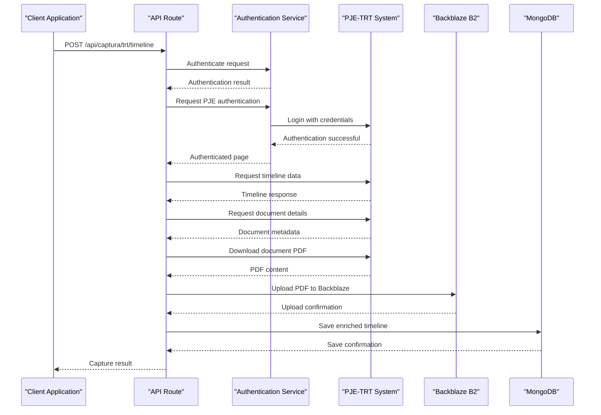
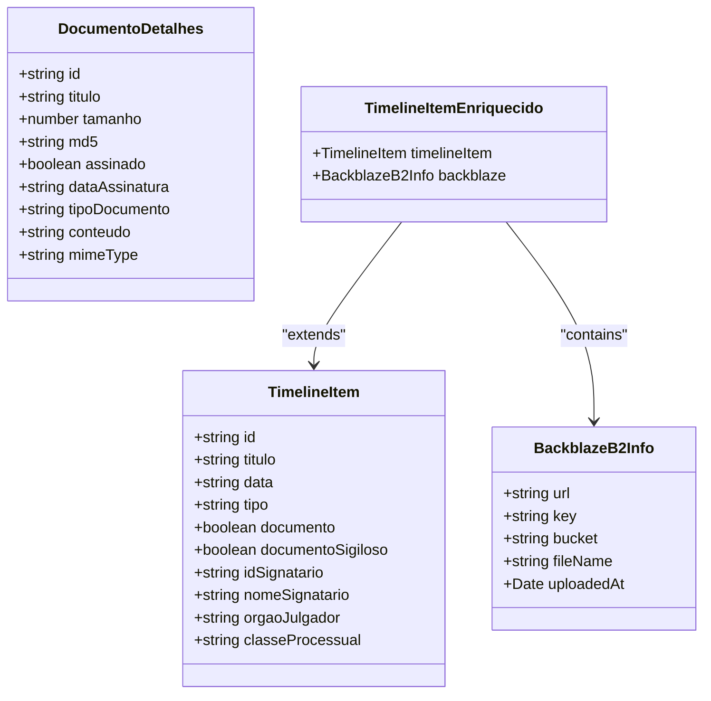
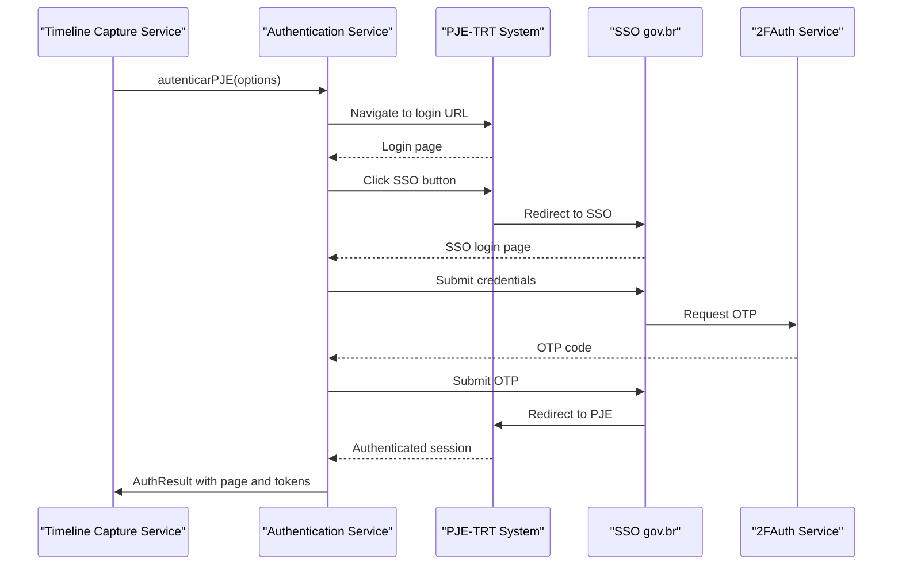
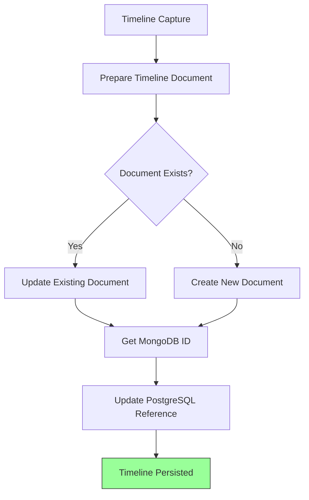
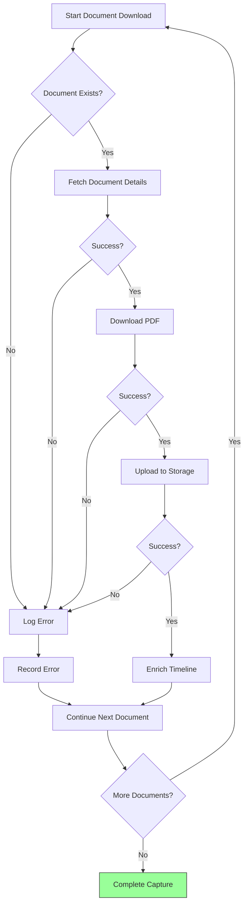

# Timeline Capture Service

<cite>
**Referenced Files in This Document**   
- [timeline-capture.service.ts](file://backend/captura/services/timeline/timeline-capture.service.ts)
- [timeline-persistence.service.ts](file://backend/captura/services/timeline/timeline-persistence.service.ts)
- [trt-auth.service.ts](file://backend/captura/services/trt/trt-auth.service.ts)
- [route.ts](file://app/api/captura/trt/timeline/route.ts)
- [obter-timeline.ts](file://backend/api/pje-trt/timeline/obter-timeline.ts)
- [obter-documento.ts](file://backend/api/pje-trt/timeline/obter-documento.ts)
- [upload-documento-timeline.service.ts](file://backend/captura/services/backblaze/upload-documento-timeline.service.ts)
</cite>

## Table of Contents
1. [Introduction](#introduction)
2. [Timeline Capture Process](#timeline-capture-process)
3. [Domain Model for Timeline Events](#domain-model-for-timeline-events)
4. [Authentication Service Integration](#authentication-service-integration)
5. [Persistence Layer Interaction](#persistence-layer-interaction)
6. [Data Transformation and Enrichment](#data-transformation-and-enrichment)
7. [Error Handling and Data Validation](#error-handling-and-data-validation)
8. [Performance Optimization](#performance-optimization)
9. [Conclusion](#conclusion)

## Introduction

The Timeline Capture Service is responsible for extracting timeline data from the PJE-TRT (Processo Judicial Eletrônico - Tribunal Regional do Trabalho) system, parsing document metadata, and handling pagination of results. This service plays a critical role in capturing the complete history of legal proceedings, including all movements and documents associated with a case. The service integrates with the authentication system to access PJE-TRT, processes the timeline data, and persists it in the application's storage system. It handles complex scenarios such as incomplete timelines, missing documents, and data parsing errors through robust validation and recovery mechanisms.

## Timeline Capture Process

The timeline capture process follows a structured workflow to extract data from PJE-TRT. The service begins by authenticating with the PJE system using credentials and configuration specific to the tribunal (TRT). Once authenticated, it retrieves the complete timeline for a specified process using the `obterTimeline` function, which calls the PJE API endpoint `/pje-comum-api/api/processos/id/{processoId}/timeline`. The service supports pagination through the API's built-in mechanisms, automatically handling multiple pages of results when necessary.

The capture process includes several key steps:
1. Authentication with PJE-TRT using tribunal-specific credentials
2. Retrieval of the complete timeline with configurable filters
3. Filtering of documents based on criteria such as signature status, confidentiality, and document type
4. Optional downloading of PDFs for signed documents
5. Upload of downloaded documents to Backblaze B2 storage
6. Persistence of the enriched timeline data

The service allows for flexible configuration through the `CapturaTimelineParams` interface, which includes parameters for filtering documents by signature status, confidentiality, specific types, and date ranges. This enables targeted capture of relevant timeline entries while minimizing unnecessary data transfer.

**Diagram sources**
- [timeline-capture.service.ts](file://backend/captura/services/timeline/timeline-capture.service.ts#L123-L351)
- [route.ts](file://app/api/captura/trt/timeline/route.ts#L133-L211)

**Section sources**
- [timeline-capture.service.ts](file://backend/captura/services/timeline/timeline-capture.service.ts#L1-L352)
- [obter-timeline.ts](file://backend/api/pje-trt/timeline/obter-timeline.ts#L1-L73)

## Domain Model for Timeline Events

The domain model for timeline events represents the structure of data captured from PJE-TRT. Each timeline entry contains comprehensive information about a specific event in the legal process, including document types, dates, parties involved, and metadata. The model is defined by the `TimelineItem` interface, which includes properties such as `id`, `titulo` (title), `data` (date), `tipo` (type), and `documento` (document indicator).

Key components of the domain model include:
- **Document Types**: Categorized by their legal significance (e.g., "Petição", "Certidão", "Decisão")
- **Dates**: Timestamps for when events occurred, stored in ISO 8601 format
- **Parties Involved**: Information about authors, recipients, and other participants in the event
- **Metadata**: Additional context such as document size, signature status, and confidentiality

The model supports hierarchical relationships between events, allowing for the representation of complex legal workflows. Each document in the timeline includes detailed metadata such as file size, MD5 hash for integrity verification, and signature information. The service enriches the basic timeline data with additional information from document details, creating a comprehensive view of the legal process.

**Diagram sources**
- [timeline-capture.service.ts](file://backend/captura/services/timeline/timeline-capture.service.ts#L20-L26)
- [timeline-persistence.service.ts](file://backend/captura/services/timeline/timeline-persistence.service.ts#L13-L14)

**Section sources**
- [timeline-capture.service.ts](file://backend/captura/services/timeline/timeline-capture.service.ts#L20-L26)
- [timeline-persistence.service.ts](file://backend/captura/services/timeline/timeline-persistence.service.ts#L13-L14)

## Authentication Service Integration

The Timeline Capture Service integrates with the authentication service to access PJE-TRT systems securely. This integration follows a multi-step authentication process that begins with SSO (Single Sign-On) via gov.br, followed by OTP (One-Time Password) verification. The service uses the `autenticarPJE` function from the authentication module, which handles the complete authentication workflow including browser automation, credential submission, and token extraction.

The authentication process includes several security measures:
- Anti-detection configurations to prevent automated browser detection
- OTP handling through the 2FAuth service
- JWT token extraction and validation
- Session management with proper cleanup

The service maintains authentication state throughout the capture process, reusing the authenticated browser session for multiple API calls. This approach minimizes authentication overhead and ensures consistent session context during data extraction. The integration also includes error handling for authentication failures, with retry mechanisms for transient issues and clear error reporting for permanent failures.

**Diagram sources**
- [trt-auth.service.ts](file://backend/captura/services/trt/trt-auth.service.ts#L552-L602)
- [timeline-capture.service.ts](file://backend/captura/services/timeline/timeline-capture.service.ts#L169-L174)

**Section sources**
- [trt-auth.service.ts](file://backend/captura/services/trt/trt-auth.service.ts#L1-L603)
- [timeline-capture.service.ts](file://backend/captura/services/timeline/timeline-capture.service.ts#L12-L13)

## Persistence Layer Interaction

The Timeline Capture Service interacts with the persistence layer to store captured timeline data in MongoDB and maintain references in PostgreSQL. This two-tier persistence strategy ensures data durability while providing efficient querying capabilities. The service uses the `salvarTimelineNoMongoDB` function to store the enriched timeline data in MongoDB, creating a document with the process ID, tribunal code, instance level, and complete timeline data.

The persistence process follows these steps:
1. Prepare the timeline document with metadata and statistics
2. Use upsert operation to create or update the timeline in MongoDB
3. Extract the MongoDB document ID
4. Update the PostgreSQL `acervo` table with the MongoDB ID reference

This approach enables efficient data retrieval through the `acervo` table while storing the complete timeline data in MongoDB, which is better suited for hierarchical and variable-structure data. The service handles potential errors during persistence, logging issues but not failing the entire capture process to ensure data availability even when persistence encounters temporary problems.

**Diagram sources**
- [timeline-persistence.service.ts](file://backend/captura/services/timeline/timeline-persistence.service.ts#L38-L113)
- [timeline-capture.service.ts](file://backend/captura/services/timeline/timeline-capture.service.ts#L303-L319)

**Section sources**
- [timeline-persistence.service.ts](file://backend/captura/services/timeline/timeline-persistence.service.ts#L1-L203)
- [timeline-capture.service.ts](file://backend/captura/services/timeline/timeline-capture.service.ts#L18-L19)

## Data Transformation and Enrichment

The Timeline Capture Service performs comprehensive data transformation and enrichment to create a complete and usable representation of the legal process timeline. The service transforms raw data from PJE-TRT into the application's domain model, adding valuable metadata and contextual information. This transformation process includes several key operations:

1. **Document Filtering**: Applying configurable filters to include only relevant documents based on signature status, confidentiality, type, and date range
2. **Metadata Enrichment**: Adding information from document details to timeline entries, including file size, MD5 hash, and signature data
3. **Storage Integration**: Attaching Backblaze B2 upload information to documents, enabling direct access to stored PDFs
4. **Statistical Calculation**: Computing metrics such as total documents, movements, and downloaded items

The service uses the `TimelineItemEnriquecido` interface to represent enriched timeline items, which extend basic timeline data with additional properties. This enriched model enables efficient rendering of the timeline in the user interface and supports advanced features like document preview and direct download. The transformation process is designed to be idempotent, allowing for safe reprocessing of timeline data when necessary.

**Diagram sources**
- [timeline-capture.service.ts](file://backend/captura/services/timeline/timeline-capture.service.ts#L210-L267)
- [timeline-persistence.service.ts](file://backend/captura/services/timeline/timeline-persistence.service.ts#L58-L78)

**Section sources**
- [timeline-capture.service.ts](file://backend/captura/services/timeline/timeline-capture.service.ts#L85-L117)
- [timeline-persistence.service.ts](file://backend/captura/services/timeline/timeline-persistence.service.ts#L58-L78)

## Error Handling and Data Validation

The Timeline Capture Service implements comprehensive error handling and data validation strategies to ensure reliability and data integrity. The service addresses common issues such as incomplete timelines, missing documents, and data parsing errors through a multi-layered approach. For each document download attempt, the service includes try-catch blocks to handle transient network errors, authentication timeouts, and other exceptions.

Key error handling mechanisms include:
- **Retry Logic**: Implementing delays between document downloads to prevent rate limiting
- **Graceful Degradation**: Continuing the capture process even when individual document downloads fail
- **Comprehensive Logging**: Detailed console output for debugging and monitoring
- **Resource Cleanup**: Ensuring browser instances are properly closed even when errors occur

The service validates data at multiple points in the capture process, verifying the presence of required fields, checking document integrity through MD5 hashes, and confirming successful storage uploads. When errors occur, the service captures detailed error information and includes it in the final result, allowing for post-capture analysis and recovery. This approach ensures that partial data is still available even when complete capture is not possible.

**Diagram sources**
- [timeline-capture.service.ts](file://backend/captura/services/timeline/timeline-capture.service.ts#L219-L287)
- [timeline-capture.service.ts](file://backend/captura/services/timeline/timeline-capture.service.ts#L341-L344)

**Section sources**
- [timeline-capture.service.ts](file://backend/captura/services/timeline/timeline-capture.service.ts#L219-L287)
- [timeline-capture.service.ts](file://backend/captura/services/timeline/timeline-capture.service.ts#L341-L344)

## Performance Optimization

The Timeline Capture Service incorporates several performance optimization strategies to handle large timelines efficiently and minimize resource consumption. The service implements rate limiting through deliberate delays between document downloads, preventing overwhelming the PJE-TRT system and avoiding IP blocking. The 500ms delay between downloads strikes a balance between capture speed and system stability.

Additional optimization techniques include:
- **Connection Reuse**: Maintaining a single authenticated browser session for all API calls
- **Parallel Processing**: Processing document downloads sequentially but with optimized resource usage
- **Memory Management**: Avoiding storage of large PDF buffers in memory when possible
- **Efficient Data Transfer**: Returning results without PDF buffers in API responses to reduce payload size

The service also optimizes database operations by using upsert operations with the `$setOnInsert` modifier, reducing the number of database round trips. The two-tier persistence model (MongoDB for detailed data, PostgreSQL for references) enables efficient querying while maintaining data integrity. These optimizations ensure that the service can handle timelines with hundreds of entries without excessive memory usage or processing time.

**Section sources**
- [timeline-capture.service.ts](file://backend/captura/services/timeline/timeline-capture.service.ts#L290-L291)
- [timeline-persistence.service.ts](file://backend/captura/services/timeline/timeline-persistence.service.ts#L84-L94)

## Conclusion

The Timeline Capture Service provides a robust solution for extracting and processing legal process timelines from PJE-TRT systems. By integrating authentication, data extraction, transformation, and persistence components, the service delivers comprehensive timeline data to the application. The service's modular design, with clear separation of concerns between capture, enrichment, and persistence, enables maintainability and extensibility.

Key strengths of the implementation include its comprehensive error handling, flexible filtering capabilities, and efficient resource management. The service successfully addresses common challenges in legal data capture, including authentication complexity, data volume, and system reliability. For developers, the service provides a well-documented API with clear interfaces and thorough logging, facilitating debugging and maintenance.

Future enhancements could include support for additional tribunal systems, improved parallel processing for faster capture, and enhanced data validation to ensure higher data quality. The current implementation provides a solid foundation for reliable timeline capture and serves as a critical component in the legal technology ecosystem.