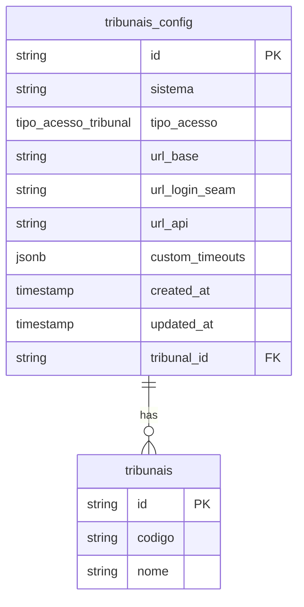
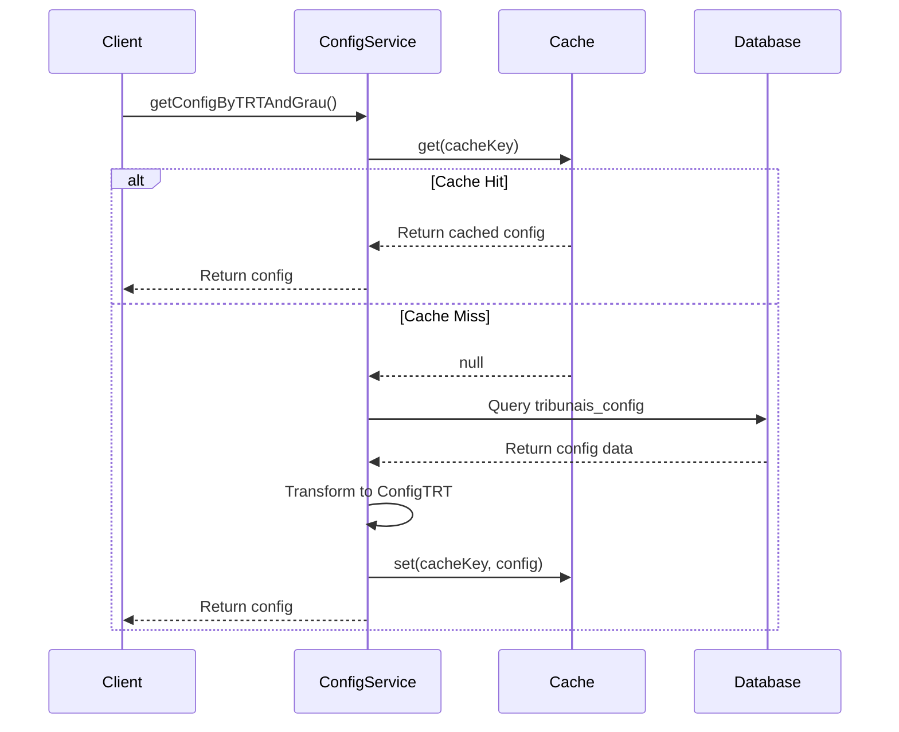
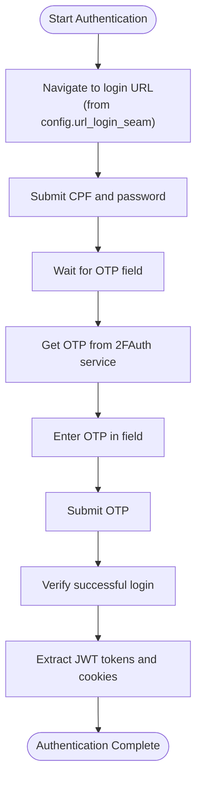
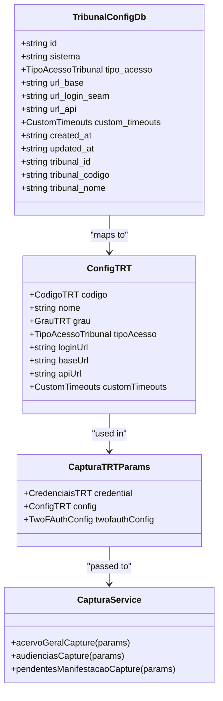
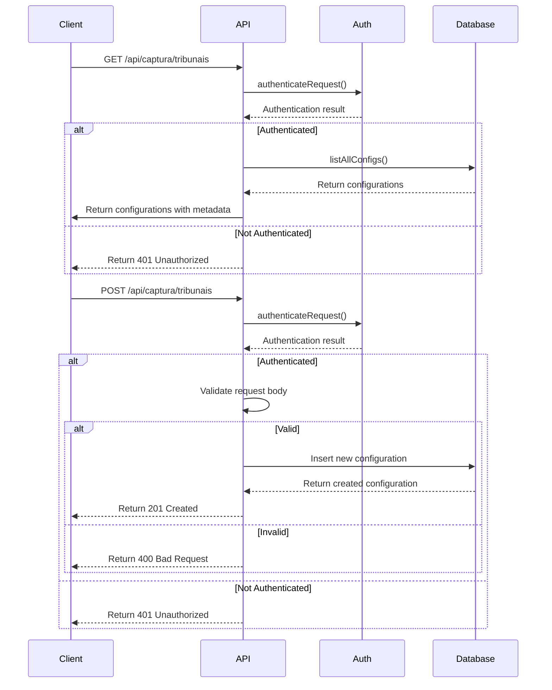

# Tribunal Configuration

<cite>
**Referenced Files in This Document**   
- [tribunal-config-persistence.service.ts](file://backend/captura/services/persistence/tribunal-config-persistence.service.ts)
- [config.ts](file://backend/captura/services/trt/config.ts)
- [trt-auth.service.ts](file://backend/captura/services/trt/trt-auth.service.ts)
- [acervo-geral.service.ts](file://backend/captura/services/trt/acervo-geral.service.ts)
- [audiencias.service.ts](file://backend/captura/services/trt/audiencias.service.ts)
- [route.ts](file://app/api/captura/tribunais/route.ts)
- [trt-types.ts](file://backend/types/captura/trt-types.ts)
- [20251122000002_rename_tribunal_config_to_snake_case.sql](file://supabase/migrations/aplicadas/20251122000002_rename_tribunal_config_to_snake_case.sql)
</cite>

## Table of Contents
1. [Introduction](#introduction)
2. [Tribunal Configuration System Overview](#tribunal-configuration-system-overview)
3. [Configuration Structure and Data Model](#configuration-structure-and-data-model)
4. [Configuration Loading and Caching Mechanism](#configuration-loading-and-caching-mechanism)
5. [Authentication and URL Patterns](#authentication-and-url-patterns)
6. [Capture Services Integration](#capture-services-integration)
7. [Configuration Management and API](#configuration-management-and-api)
8. [Common Issues and Solutions](#common-issues-and-solutions)
9. [Versioning and Inheritance](#versioning-and-inheritance)
10. [Conclusion](#conclusion)

## Introduction

The Tribunal Configuration system in the Sinesys application provides a flexible and robust framework for managing tribunal-specific settings across multiple jurisdictions. This system enables the application to capture data from various TRT (Tribunal Regional do Trabalho) jurisdictions with different configurations, authentication requirements, and data extraction rules. The configuration system is designed to support customization of the capture process per tribunal, including URL patterns, authentication methods, and response parsing rules. This document provides a comprehensive overview of the implementation details, relationships between components, and practical considerations for managing tribunal configurations in a multi-jurisdiction environment.

**Section sources**
- [tribunal-config-persistence.service.ts](file://backend/captura/services/persistence/tribunal-config-persistence.service.ts#L1-L225)
- [config.ts](file://backend/captura/services/trt/config.ts#L1-L203)

## Tribunal Configuration System Overview

The Tribunal Configuration system is a critical component of the Sinesys application's data capture functionality, enabling the application to interact with multiple tribunal jurisdictions through a unified interface. The system is designed to handle the diverse requirements of different TRT jurisdictions, including variations in authentication mechanisms, URL patterns, and data presentation formats. At its core, the configuration system provides a structured approach to defining and managing tribunal-specific settings that govern how the application connects to and extracts data from each tribunal's website.

The system operates on a configuration-driven model where each tribunal has a dedicated configuration that specifies essential parameters such as base URLs, login endpoints, API endpoints, and custom timeouts. These configurations are stored in a database table called `tribunais_config` and are accessed through a service layer that provides methods for retrieving and validating configurations. The configuration system supports multiple types of access, including first-degree, second-degree, unified, and unique access, which correspond to different authentication patterns used by various tribunals.

The configuration system is tightly integrated with the capture services, which use the configuration data to establish connections, authenticate, and extract data from tribunal websites. When a capture process is initiated, the system retrieves the appropriate configuration based on the tribunal code and access type, then uses this configuration to guide the entire capture workflow. This approach allows the application to maintain a consistent capture process while accommodating the specific requirements of each tribunal jurisdiction.

**Section sources**
- [tribunal-config-persistence.service.ts](file://backend/captura/services/persistence/tribunal-config-persistence.service.ts#L1-L225)
- [config.ts](file://backend/captura/services/trt/config.ts#L1-L203)
- [trt-types.ts](file://backend/types/captura/trt-types.ts#L1-L126)

## Configuration Structure and Data Model

The tribunal configuration system is built around a well-defined data model that captures all necessary information for connecting to and interacting with tribunal websites. The primary data structure is the `TribunalConfigDb` interface, which represents the configuration data stored in the database. This interface includes essential properties such as the system identifier, access type, base URL, login URL, API URL, and custom timeouts. The configuration also includes metadata such as creation and update timestamps, as well as references to the associated tribunal.

The data model has evolved through a migration process that standardized naming conventions and enhanced the configuration's capabilities. The migration renamed the original `TribunalConfig` table to `tribunais_config` and converted column names from camelCase to snake_case for consistency with database conventions. Additionally, the migration introduced a new enum type called `tipo_acesso_tribunal` to standardize access types across the system. This enum includes values for first-degree access, second-degree access, unified access, and unique access, providing a clear and consistent way to specify authentication patterns.

The configuration system also supports custom timeouts, allowing for tribunal-specific adjustments to various timing parameters. These custom timeouts are defined as a JSON object with optional properties for login, redirect, network idle, and API operations. This flexibility is crucial for accommodating variations in tribunal website performance and responsiveness. The configuration data is stored in a relational database with a foreign key relationship to the `tribunais` table, ensuring data integrity and enabling efficient queries across tribunal configurations.

**Diagram sources**
- [20251122000002_rename_tribunal_config_to_snake_case.sql](file://supabase/migrations/aplicadas/20251122000002_rename_tribunal_config_to_snake_case.sql#L1-L106)
- [trt-types.ts](file://backend/types/captura/trt-types.ts#L96-L109)

## Configuration Loading and Caching Mechanism

The tribunal configuration system employs a sophisticated loading and caching mechanism to optimize performance and ensure efficient access to configuration data. The system uses a two-layer approach that combines database persistence with in-memory caching to minimize latency and reduce database load. When a configuration is requested, the system first checks an in-memory cache before querying the database, significantly improving response times for frequently accessed configurations.

The caching mechanism is implemented using a Map data structure that stores configuration objects with timestamps. Each cached entry has a time-to-live (TTL) of five minutes, after which it is considered stale and will be refreshed from the database on the next access. This TTL strikes a balance between performance and data freshness, ensuring that configurations are updated regularly without overwhelming the database with repeated queries. The cache key is generated by combining the tribunal code and access type, allowing for precise retrieval of specific configurations.

The configuration loading process begins with the `getConfigByTRTAndGrau` function, which serves as the primary entry point for retrieving tribunal configurations. This function first checks the in-memory cache using the generated cache key. If a valid cached entry is found, it is returned immediately. Otherwise, the function queries the database through the `getConfigByTribunalAndTipoAcesso` method, which performs a JOIN operation between the `tribunais_config` and `tribunais` tables to retrieve complete configuration data. Once retrieved, the configuration is transformed from the database format to the application format and stored in the cache before being returned to the caller.

**Diagram sources**
- [config.ts](file://backend/captura/services/trt/config.ts#L28-L33)
- [tribunal-config-persistence.service.ts](file://backend/captura/services/persistence/tribunal-config-persistence.service.ts#L22-L91)

## Authentication and URL Patterns

The tribunal configuration system plays a crucial role in managing authentication and URL patterns for different tribunal jurisdictions. Each configuration includes specific URLs for the base site, login page, and API endpoints, which are used to establish connections and authenticate with tribunal websites. The authentication process is standardized across jurisdictions but adapted to each tribunal's specific requirements through the configuration parameters.

The authentication flow begins with navigating to the login URL specified in the configuration, which typically points to a SSO (Single Sign-On) page. The system then submits the user's credentials (CPF and password) to initiate the login process. Following successful credential submission, the system handles two-factor authentication (2FA) by retrieving a one-time password (OTP) from an external 2FAuth service. This OTP is automatically entered into the authentication form, completing the login sequence.

The configuration system supports different authentication patterns through the `tipo_acesso` parameter, which determines the specific login flow to use. For first-degree and second-degree access, separate login URLs are used, while unified access combines both degrees into a single login process. The system also includes anti-detection measures to prevent automated browser detection, such as modifying navigator properties and removing automation flags. These measures are essential for maintaining reliable access to tribunal websites that employ anti-bot protections.

**Diagram sources**
- [trt-auth.service.ts](file://backend/captura/services/trt/trt-auth.service.ts#L291-L384)
- [trt-types.ts](file://backend/types/captura/trt-types.ts#L100-L102)

## Capture Services Integration

The tribunal configuration system is deeply integrated with the capture services, serving as the foundation for all data extraction processes. Each capture service, such as the acervo-geral (general inventory) and audiencias (hearings) services, relies on the configuration data to establish connections, authenticate, and extract data from tribunal websites. The integration is achieved through the `CapturaTRTParams` interface, which bundles the credential, configuration, and optional 2FAuth configuration into a single parameter object passed to capture services.

The capture services use the configuration data in multiple ways throughout the capture process. First, the configuration's URL parameters are used to navigate to the appropriate tribunal website and initiate the authentication process. After successful authentication, the configuration's API URL is used to make REST API calls for retrieving data. The custom timeouts specified in the configuration are applied to various stages of the capture process, including login, redirects, network idle states, and API calls, ensuring that the process adapts to each tribunal's performance characteristics.

The integration between the configuration system and capture services follows a consistent pattern across different capture types. The process begins with retrieving the appropriate configuration using the `getTribunalConfig` function, which applies caching for performance optimization. Then, the `autenticarPJE` function is called with the configuration data to establish an authenticated session. Finally, the capture service uses the authenticated session and configuration data to extract and persist data, following a standardized workflow that ensures data integrity and consistency.

**Diagram sources**
- [acervo-geral.service.ts](file://backend/captura/services/trt/acervo-geral.service.ts#L107-L354)
- [audiencias.service.ts](file://backend/captura/services/trt/audiencias.service.ts#L133-L481)
- [trt-capture.service.ts](file://backend/captura/services/trt/trt-capture.service.ts#L11-L35)

## Configuration Management and API

The tribunal configuration system includes a comprehensive API for managing configurations, enabling both programmatic and user-driven configuration updates. The API provides endpoints for listing all configurations and creating new ones, with proper authentication and authorization controls. These endpoints are exposed through the `/api/captura/tribunais` route, which supports both GET and POST operations for retrieving and creating configurations.

The GET endpoint returns a comprehensive list of all tribunal configurations, including metadata such as tribunal codes and access types for filtering purposes. This endpoint is protected by authentication middleware that verifies the user's credentials before allowing access to the configuration data. The response includes the complete configuration objects, along with arrays of unique tribunal codes and access types that can be used for UI filtering and selection.

The POST endpoint allows for the creation of new tribunal configurations, requiring specific parameters such as the tribunal ID, access type, base URL, login URL, and API URL. This endpoint performs validation on the input data and uses a service client with elevated privileges to bypass row-level security (RLS) constraints when writing to the database. The creation process includes a SELECT operation to return the newly created configuration, ensuring that the client receives complete information about the created resource.

**Diagram sources**
- [route.ts](file://app/api/captura/tribunais/route.ts#L80-L285)
- [tribunal-config-persistence.service.ts](file://backend/captura/services/persistence/tribunal-config-persistence.service.ts#L142-L202)

## Common Issues and Solutions

The tribunal configuration system addresses several common challenges encountered when working with multiple tribunal jurisdictions. One of the primary issues is changes in tribunal website structure, which can break existing capture processes. The configuration system mitigates this risk by centralizing URL patterns and authentication flows, allowing updates to be made in a single location rather than across multiple capture services. When a tribunal website changes its structure, administrators can update the configuration parameters without modifying the underlying capture logic.

Regional variations in data presentation are another common challenge, as different tribunals may present similar information in different formats or locations. The configuration system addresses this through the use of custom selectors and parsing rules that can be tailored to each jurisdiction. These rules are applied during the data extraction phase, ensuring that information is correctly identified and processed regardless of its presentation format.

Configuration management across multiple tribunals presents scalability challenges, particularly when adding new jurisdictions or updating existing configurations. The system provides a versioning strategy through the use of database migrations and a structured configuration schema. When new configuration options are needed, they can be added through database migrations that maintain backward compatibility. The caching mechanism also helps manage configuration changes by ensuring that updates are propagated consistently across the application.

For troubleshooting configuration issues, the system includes comprehensive logging and error handling. When a configuration cannot be found or is invalid, descriptive error messages are generated that include the tribunal code and access type. This information helps administrators quickly identify and resolve configuration problems. The system also includes validation functions that can be used to verify the existence and correctness of tribunal configurations before initiating capture processes.

**Section sources**
- [config.ts](file://backend/captura/services/trt/config.ts#L138-L161)
- [tribunal-config-persistence.service.ts](file://backend/captura/services/persistence/tribunal-config-persistence.service.ts#L209-L224)

## Versioning and Inheritance

The tribunal configuration system incorporates a sophisticated versioning and inheritance mechanism that enables efficient management of configuration changes across multiple jurisdictions. The versioning strategy is implemented through database migrations that track changes to the configuration schema over time. Each migration is timestamped and includes descriptive comments that explain the purpose and impact of the changes. This approach provides a clear audit trail of configuration evolution and enables rollback to previous versions if necessary.

The inheritance mechanism is implemented through the configuration loading process, which applies default values and mappings when specific configuration options are not provided. For example, the `mapTipoAcessoToGrau` function maps access types to degree levels, providing a default mapping when specific values are not available. This inheritance pattern reduces redundancy and ensures consistency across configurations while allowing for jurisdiction-specific overrides when needed.

The system also supports configuration inheritance through the use of default values in the `ConfigTRT` interface. When custom timeouts are not specified in the database configuration, they are omitted from the application configuration rather than being set to null or undefined. This approach allows higher-level services to apply their own default timeout values, creating a hierarchy of configuration options that flows from the database to the application layer.

The versioning and inheritance mechanisms work together to provide a flexible and maintainable configuration system. New configuration options can be added through migrations without breaking existing functionality, while the inheritance model ensures that default behaviors are consistently applied across jurisdictions. This combination enables the system to adapt to changing requirements while maintaining stability and reliability in the capture processes.

**Section sources**
- [config.ts](file://backend/captura/services/trt/config.ts#L56-L68)
- [20251122000002_rename_tribunal_config_to_snake_case.sql](file://supabase/migrations/aplicadas/20251122000002_rename_tribunal_config_to_snake_case.sql#L1-L106)

## Conclusion

The Tribunal Configuration system in the Sinesys application provides a comprehensive and flexible framework for managing tribunal-specific settings across multiple jurisdictions. By centralizing configuration data and providing a standardized interface for capture services, the system enables efficient and reliable data extraction from diverse tribunal websites. The combination of database persistence, in-memory caching, and a well-defined data model ensures optimal performance and data integrity.

The system's integration with authentication processes and capture services demonstrates a thoughtful architectural approach that balances flexibility with consistency. The ability to customize URL patterns, authentication flows, and data extraction rules for each jurisdiction while maintaining a unified capture process is a key strength of the system. This design allows the application to adapt to the specific requirements of different tribunals without compromising the overall reliability and maintainability of the capture functionality.

For developers and administrators, the configuration system provides powerful tools for managing tribunal settings, including a comprehensive API, versioning through database migrations, and inheritance mechanisms for default values. These features enable efficient configuration management and troubleshooting, reducing the operational overhead of maintaining multiple jurisdiction-specific settings. The system's design principles of separation of concerns, modularity, and extensibility make it well-suited for future enhancements and the addition of new tribunal jurisdictions.