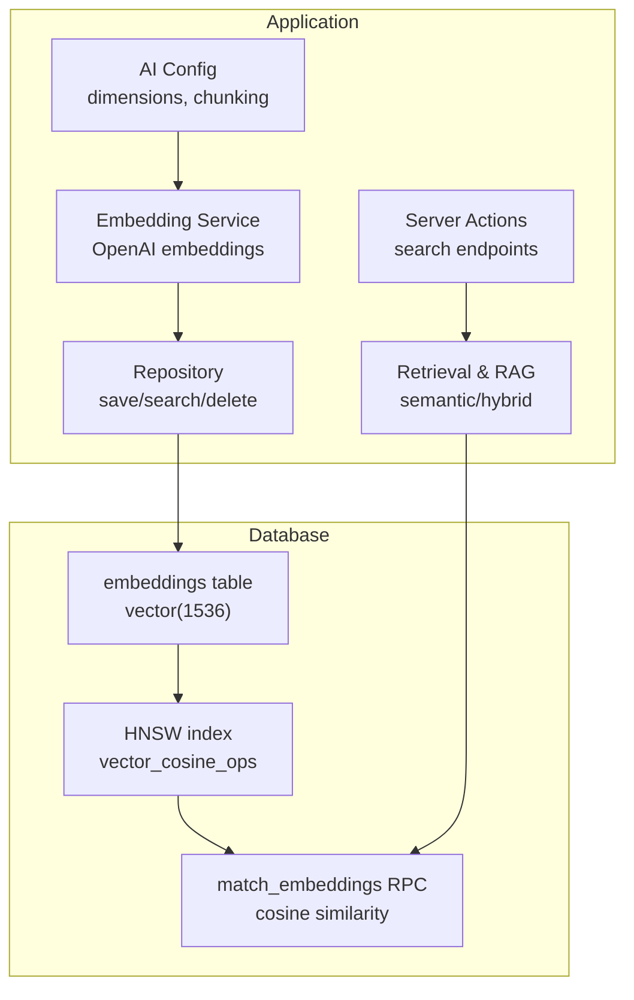
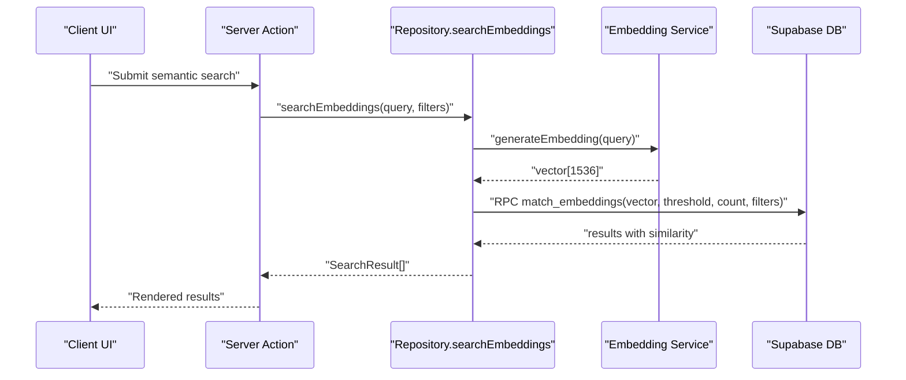
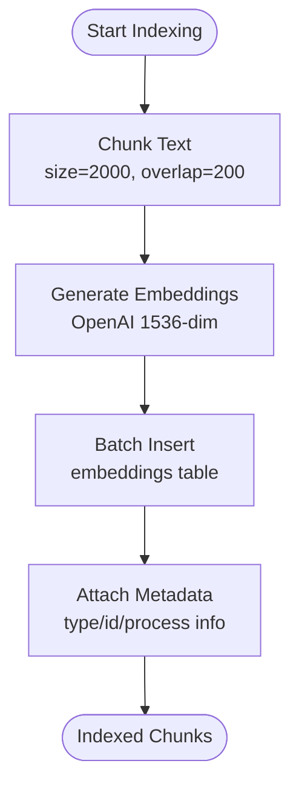
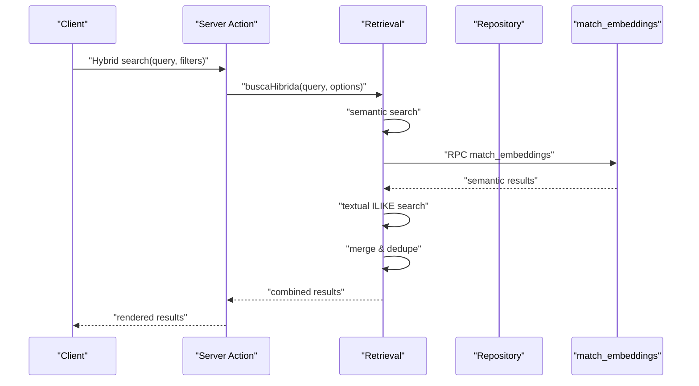
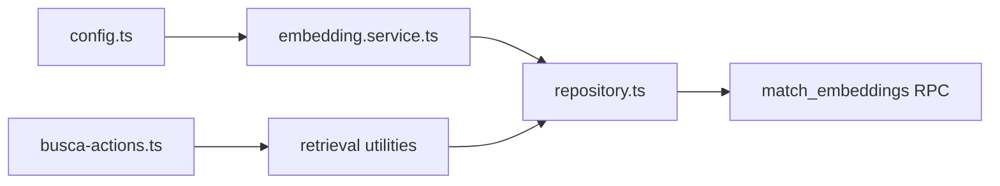

# AI and Vector Integration

<cite>
**Referenced Files in This Document**
- [20251216132616_create_embeddings_system.sql](file://supabase/migrations/20251216132616_create_embeddings_system.sql)
- [38_embeddings.sql](file://supabase/schemas/38_embeddings.sql)
- [repository.ts](file://src/lib/ai/repository.ts)
- [embedding.service.ts](file://src/lib/ai/services/embedding.service.ts)
- [config.ts](file://src/lib/ai/config.ts)
- [domain.ts](file://src/lib/ai/domain.ts)
- [ai.repository.test.ts](file://src/lib/ai/__tests__/unit/ai.repository.test.ts)
- [RULES.md](file://src/lib/busca/RULES.md)
- [busca-actions.ts](file://src/lib/busca/actions/busca-actions.ts)
- [reindex-all.ts](file://scripts/ai/reindex-all.ts)
- [index-existing-documents.ts](file://scripts/ai/index-existing-documents.ts)
</cite>

## Table of Contents
1. [Introduction](#introduction)
2. [Project Structure](#project-structure)
3. [Core Components](#core-components)
4. [Architecture Overview](#architecture-overview)
5. [Detailed Component Analysis](#detailed-component-analysis)
6. [Dependency Analysis](#dependency-analysis)
7. [Performance Considerations](#performance-considerations)
8. [Troubleshooting Guide](#troubleshooting-guide)
9. [Conclusion](#conclusion)
10. [Appendices](#appendices)

## Introduction
This document explains the AI and vector integration for ZattarOS, focusing on the pgvector-powered embeddings system, vector dimension configuration, similarity search capabilities, and the Retrieval-Augmented Generation (RAG) pipeline. It covers the unified embeddings table, indexing pipeline for legal documents, automated embedding generation, integration with AI services, and practical guidance for performance tuning and troubleshooting.

## Project Structure
The AI/vector system spans database migrations, Supabase functions, TypeScript services, and server actions:

- Database layer: embeddings table, HNSW index, and match_embeddings RPC function
- Application layer: embedding generation, indexing orchestration, retrieval, and RAG utilities
- API layer: server actions exposing semantic search and hybrid search to the UI

**Diagram sources**
- [20251216132616_create_embeddings_system.sql:57-96](file://supabase/migrations/20251216132616_create_embeddings_system.sql#L57-L96)
- [embedding.service.ts:100-106](file://src/lib/ai/services/embedding.service.ts#L100-L106)
- [repository.ts:21-41](file://src/lib/ai/repository.ts#L21-L41)
- [busca-actions.ts:38-97](file://src/lib/busca/actions/busca-actions.ts#L38-L97)

**Section sources**
- [20251216132616_create_embeddings_system.sql:1-105](file://supabase/migrations/20251216132616_create_embeddings_system.sql#L1-L105)
- [busca-actions.ts:1-125](file://src/lib/busca/actions/busca-actions.ts#L1-L125)

## Core Components
- Embeddings table and indices
  - Vector dimension: 1536 (OpenAI text-embedding-3-small)
  - HNSW index with cosine operations for fast similarity search
  - Additional GIN index on metadata and pre-filtering indexes on entity_type/entity_id/parent_id
- Embedding generation
  - OpenAI embeddings via direct API with automatic batching
  - Optional Cohere support via configuration
- Search and retrieval
  - match_embeddings RPC with configurable threshold and count
  - Hybrid search combining semantic and text ILIKE
  - RAG context builder respecting token limits
- Server actions
  - Semantic search, hybrid search, and RAG context endpoints

**Section sources**
- [20251216132616_create_embeddings_system.sql:8-47](file://supabase/migrations/20251216132616_create_embeddings_system.sql#L8-L47)
- [20251216132616_create_embeddings_system.sql:57-96](file://supabase/migrations/20251216132616_create_embeddings_system.sql#L57-L96)
- [embedding.service.ts:100-106](file://src/lib/ai/services/embedding.service.ts#L100-L106)
- [config.ts:13-32](file://src/lib/ai/config.ts#L13-L32)
- [repository.ts:21-41](file://src/lib/ai/repository.ts#L21-L41)
- [busca-actions.ts:38-125](file://src/lib/busca/actions/busca-actions.ts#L38-L125)

## Architecture Overview
The system integrates client requests with Supabase’s pgvector and custom RPC for similarity search.

**Diagram sources**
- [busca-actions.ts:38-97](file://src/lib/busca/actions/busca-actions.ts#L38-L97)
- [repository.ts:21-41](file://src/lib/ai/repository.ts#L21-L41)
- [embedding.service.ts:100-106](file://src/lib/ai/services/embedding.service.ts#L100-L106)
- [20251216132616_create_embeddings_system.sql:57-96](file://supabase/migrations/20251216132616_create_embeddings_system.sql#L57-L96)

## Detailed Component Analysis

### Embeddings Table and Indices
- Table: public.embeddings
  - Columns: id, content, embedding (vector 1536), entity_type, entity_id, parent_id, metadata (JSONB), timestamps, indexed_by
  - Entity types include: documento, processo_peca, processo_andamento, contrato, expediente, assinatura_digital
- Indices
  - HNSW on embedding with vector_cosine_ops for efficient similarity search
  - Pre-filtering: entity_type+entity_id, parent_id, metadata GIN, created_at
- RLS: service_role full access policy

**Section sources**
- [20251216132616_create_embeddings_system.sql:8-47](file://supabase/migrations/20251216132616_create_embeddings_system.sql#L8-L47)
- [38_embeddings.sql:52-105](file://supabase/schemas/38_embeddings.sql#L52-L105)

### Similarity Search Function
- Function: match_embeddings
  - Inputs: query_embedding (vector 1536), match_threshold, match_count, optional filters
  - Logic: cosine distance threshold filtering, optional entity_type, parent_id, and metadata containment
  - Output: id, content, entity_type, entity_id, parent_id, metadata, similarity

**Section sources**
- [20251216132616_create_embeddings_system.sql:57-96](file://supabase/migrations/20251216132616_create_embeddings_system.sql#L57-L96)
- [38_embeddings.sql:57-98](file://supabase/schemas/38_embeddings.sql#L57-L98)

### Embedding Generation and Configuration
- Provider selection
  - Default: OpenAI text-embedding-3-small (1536 dimensions)
  - Alternative: Cohere embed-multilingual-v3.0 (1024 dimensions)
- Environment variables
  - OPENAI_API_KEY or COHERE_API_KEY
  - OPENAI_EMBEDDING_MODEL or COHERE_EMBEDDING_MODEL
  - AI_EMBEDDING_PROVIDER=openai|cohere
- Batch processing
  - Automatic batching up to 2048 texts per request for OpenAI
- Tokenization and chunking
  - Max chunk size ~2000 chars with 200 char overlap
  - Separator priorities for natural splits

**Section sources**
- [embedding.service.ts:100-106](file://src/lib/ai/services/embedding.service.ts#L100-L106)
- [config.ts:13-32](file://src/lib/ai/config.ts#L13-L32)
- [config.ts:37-44](file://src/lib/ai/config.ts#L37-L44)

### Document Indexing Pipeline
- Chunking: intelligent splitting respecting boundaries and overlap
- Embedding: generate vectors per chunk with metadata (chunkIndex, chunkOffset, totalChunks)
- Storage: insert into public.embeddings in batches
- Removal/update: delete by entity_type+entity_id or parent_id; re-index replaces previous chunks

**Diagram sources**
- [config.ts:37-44](file://src/lib/ai/config.ts#L37-L44)
- [embedding.service.ts:100-106](file://src/lib/ai/services/embedding.service.ts#L100-L106)
- [repository.ts:4-19](file://src/lib/ai/repository.ts#L4-L19)

**Section sources**
- [repository.ts:4-19](file://src/lib/ai/repository.ts#L4-L19)
- [config.ts:37-44](file://src/lib/ai/config.ts#L37-L44)

### Retrieval and RAG Implementation
- Semantic search
  - Generates query embedding and calls match_embeddings RPC
  - Returns ordered results with similarity scores
- Hybrid search
  - Combines semantic results with text ILIKE matches
  - Deduplicates and prioritizes semantic matches
- RAG context builder
  - Builds a contextual string respecting token limits (~4 chars per token)
  - Includes metadata identifiers for provenance

**Diagram sources**
- [busca-actions.ts:80-97](file://src/lib/busca/actions/busca-actions.ts#L80-L97)
- [repository.ts:21-41](file://src/lib/ai/repository.ts#L21-L41)
- [20251216132616_create_embeddings_system.sql:57-96](file://supabase/migrations/20251216132616_create_embeddings_system.sql#L57-L96)

**Section sources**
- [busca-actions.ts:38-97](file://src/lib/busca/actions/busca-actions.ts#L38-L97)
- [repository.ts:21-41](file://src/lib/ai/repository.ts#L21-L41)
- [RULES.md:13-26](file://src/lib/busca/RULES.md#L13-L26)

### Domain Types and Validation
- Embedding record: id, content, embedding[], entity_type, entity_id, parent_id, metadata, timestamps, indexed_by
- Search parameters: query, match_threshold, match_count, optional filters for entity_type, parent_id, metadata
- Entity types enumeration for controlled values

**Section sources**
- [domain.ts:48-69](file://src/lib/ai/domain.ts#L48-L69)
- [domain.ts:35-42](file://src/lib/ai/domain.ts#L35-L42)
- [domain.ts:3-12](file://src/lib/ai/domain.ts#L3-L12)

## Dependency Analysis
- Repository depends on:
  - Supabase client for RPC and inserts
  - Embedding service for vector generation
- Embedding service depends on:
  - Environment variables for provider and keys
  - OpenAI API endpoint for embeddings
- Server actions depend on retrieval utilities and enforce authentication

**Diagram sources**
- [config.ts:13-32](file://src/lib/ai/config.ts#L13-L32)
- [embedding.service.ts:100-106](file://src/lib/ai/services/embedding.service.ts#L100-L106)
- [repository.ts:21-41](file://src/lib/ai/repository.ts#L21-L41)
- [busca-actions.ts:38-97](file://src/lib/busca/actions/busca-actions.ts#L38-L97)

**Section sources**
- [repository.ts:1-19](file://src/lib/ai/repository.ts#L1-L19)
- [embedding.service.ts:100-106](file://src/lib/ai/services/embedding.service.ts#L100-L106)
- [busca-actions.ts:10-27](file://src/lib/busca/actions/busca-actions.ts#L10-L27)

## Performance Considerations
- Index selection
  - HNSW with vector_cosine_ops is optimal for large-scale cosine similarity
  - Ensure adequate memory for index maintenance
- Batch sizes
  - Embedding generation batches up to 2048 texts per request
  - Repository inserts in batches of 100 to avoid large payloads
- Filtering and pre-filtering
  - Use entity_type/entity_id and parent_id filters to reduce candidate sets before similarity computation
  - Metadata GIN index supports efficient containment queries (@>)
- Threshold tuning
  - Lower thresholds increase recall but may raise cost and noise
  - Adjust match_count to balance relevance and performance
- Token budgeting
  - RAG context respects approximate token budgets; adjust maxTokens accordingly

[No sources needed since this section provides general guidance]

## Troubleshooting Guide
- Missing API keys
  - Ensure OPENAI_API_KEY or COHERE_API_KEY is configured
  - Verify AI_EMBEDDING_PROVIDER is set appropriately
- Empty or invalid text
  - Embedding generation rejects empty strings; normalize input before generating embeddings
- RPC errors
  - match_embeddings returns errors when query embedding fails or DB constraints are violated
  - Validate vector dimensionality matches configured model (1536 for OpenAI 3-small)
- Test coverage
  - Unit tests verify repository batch insert behavior and RPC parameter passing

**Section sources**
- [config.ts:73-102](file://src/lib/ai/config.ts#L73-L102)
- [embedding.service.ts:14-17](file://src/lib/ai/services/embedding.service.ts#L14-L17)
- [embedding.service.ts:57-65](file://src/lib/ai/services/embedding.service.ts#L57-L65)
- [ai.repository.test.ts:166-193](file://src/lib/ai/__tests__/unit/ai.repository.test.ts#L166-L193)

## Conclusion
ZattarOS implements a robust, production-grade vector search system using pgvector and Supabase. The unified embeddings table, HNSW index, and match_embeddings RPC provide scalable similarity search. The indexing pipeline, embedding generation, and RAG utilities enable legal document search and agent-driven retrieval. With proper configuration, filtering, and batch sizing, the system scales to large datasets while maintaining responsiveness.

[No sources needed since this section summarizes without analyzing specific files]

## Appendices

### Vector Dimension and Model Configuration
- Default model: OpenAI text-embedding-3-small (1536 dimensions)
- Cohere model: embed-multilingual-v3.0 (1024 dimensions)
- Environment variables:
  - OPENAI_API_KEY or COHERE_API_KEY
  - OPENAI_EMBEDDING_MODEL or COHERE_EMBEDDING_MODEL
  - AI_EMBEDDING_PROVIDER=openai|cohere

**Section sources**
- [config.ts:13-32](file://src/lib/ai/config.ts#L13-L32)
- [embedding.service.ts:100-106](file://src/lib/ai/services/embedding.service.ts#L100-L106)

### Search Parameter Reference
- match_threshold: 0–1 (default 0.7)
- match_count: positive integer (default 5, max 100)
- filter_entity_type: one of documento, processo_peca, processo_andamento, contrato, expediente, assinatura_digital
- filter_parent_id: numeric ID for parent context
- filter_metadata: JSON object for containment filtering

**Section sources**
- [domain.ts:35-42](file://src/lib/ai/domain.ts#L35-L42)
- [repository.ts:27-34](file://src/lib/ai/repository.ts#L27-L34)

### Document Indexing Scripts
- Reindex all: cleans existing embeddings and reindexes legal entities in batches
- Index existing documents: targeted reindexing for existing document records

**Section sources**
- [reindex-all.ts:46-82](file://scripts/ai/reindex-all.ts#L46-L82)