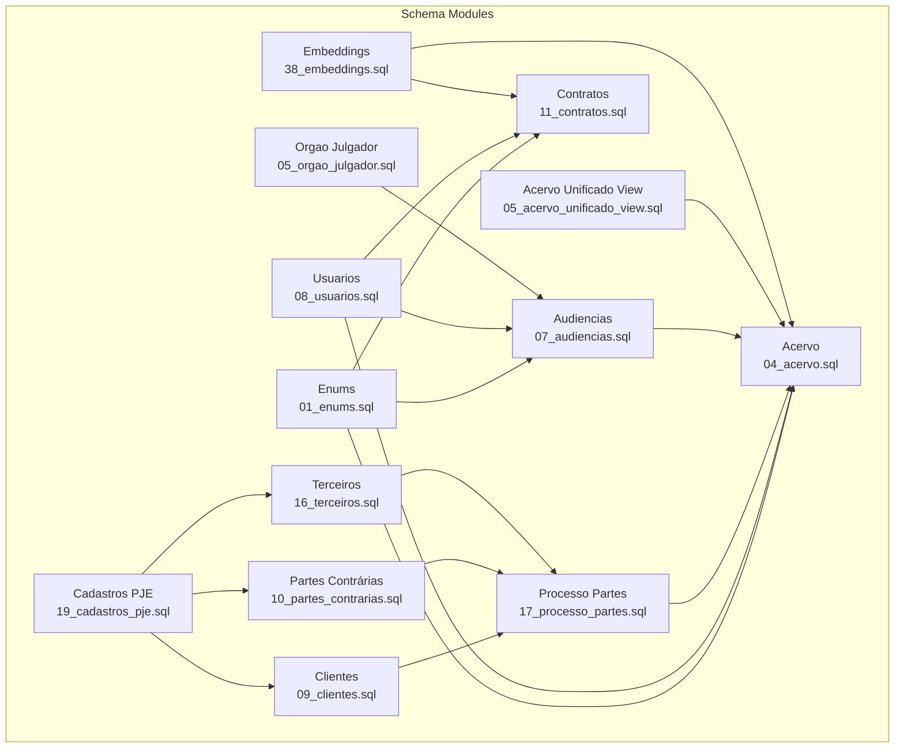
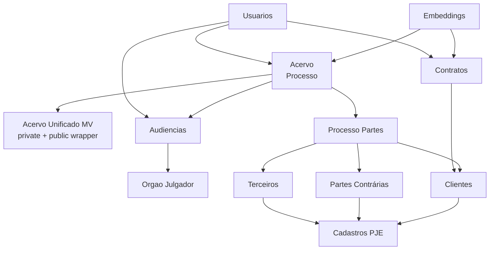

# Database Design

<cite>
**Referenced Files in This Document**
- [00_permissions.sql](file://supabase/schemas/00_permissions.sql)
- [01_enums.sql](file://supabase/schemas/01_enums.sql)
- [04_acervo.sql](file://supabase/schemas/04_acervo.sql)
- [04_acervo_functions.sql](file://supabase/schemas/04_acervo_functions.sql)
- [05_acervo_unificado_view.sql](file://supabase/schemas/05_acervo_unificado_view.sql)
- [05_orgao_julgador.sql](file://supabase/schemas/05_orgao_julgador.sql)
- [07_audiencias.sql](file://supabase/schemas/07_audiencias.sql)
- [08_usuarios.sql](file://supabase/schemas/08_usuarios.sql)
- [09_clientes.sql](file://supabase/schemas/09_clientes.sql)
- [10_partes_contrarias.sql](file://supabase/schemas/10_partes_contrarias.sql)
- [11_contratos.sql](file://supabase/schemas/11_contratos.sql)
- [16_terceiros.sql](file://supabase/schemas/16_terceiros.sql)
- [17_processo_partes.sql](file://supabase/schemas/17_processo_partes.sql)
- [19_cadastros_pje.sql](file://supabase/schemas/19_cadastros_pje.sql)
- [38_embeddings.sql](file://supabase/schemas/38_embeddings.sql)
</cite>

## Table of Contents
1. [Introduction](#introduction)
2. [Project Structure](#project-structure)
3. [Core Components](#core-components)
4. [Architecture Overview](#architecture-overview)
5. [Detailed Component Analysis](#detailed-component-analysis)
6. [Dependency Analysis](#dependency-analysis)
7. [Performance Considerations](#performance-considerations)
8. [Troubleshooting Guide](#troubleshooting-guide)
9. [Conclusion](#conclusion)
10. [Appendices](#appendices)

## Introduction
This document describes the ZattarOS database schema and data model, focusing on legal case management, unified views, timeline events, contract management, court hearings, and supporting entities. It documents primary and foreign keys, indexes, constraints, views, and Row Level Security (RLS) policies. It also explains data validation rules, referential integrity, access patterns, performance characteristics, and outlines the pgvector-based embeddings system for AI features and real-time triggers.

## Project Structure
The database schema is organized into modular SQL files under the Supabase schemas directory. Each file defines enums, tables, indexes, triggers, views, and RLS policies for specific domains (e.g., legal cases, audiencias, contracts, parties, and embeddings). Permissions are granted via a dedicated permissions script executed early in deployment.

```mermaid
graph TB
subgraph "Schema Modules"
E["Enums<br/>01_enums.sql"]
U["Usuarios<br/>08_usuarios.sql"]
C["Clientes<br/>09_clientes.sql"]
PC["Partes Contrárias<br/>10_partes_contrarias.sql"]
T["Terceiros<br/>16_terceiros.sql"]
PP["Processo Partes<br/>17_processo_partes.sql"]
CP["Cadastros PJE<br/>19_cadastros_pje.sql"]
A["Acervo<br/>04_acervo.sql"]
AU["Orgao Julgador<br/>05_orgao_julgador.sql"]
AU2["Audiencias<br/>07_audiencias.sql"]
CT["Contratos<br/>11_contratos.sql"]
VU["Acervo Unificado View<br/>05_acervo_unificado_view.sql"]
EM["Embeddings<br/>38_embeddings.sql"]
end
E --> A
E --> AU2
E --> CT
U --> A
U --> AU2
U --> CT
C --> PP
PC --> PP
T --> PP
PP --> A
AU --> AU2
AU2 --> A
CP --> C
CP --> PC
CP --> T
VU --> A
EM --> A
EM --> CT
```

**Diagram sources**
- [01_enums.sql:1-435](file://supabase/schemas/01_enums.sql#L1-L435)
- [04_acervo.sql:1-77](file://supabase/schemas/04_acervo.sql#L1-L77)
- [05_acervo_unificado_view.sql:1-247](file://supabase/schemas/05_acervo_unificado_view.sql#L1-L247)
- [05_orgao_julgador.sql:1-47](file://supabase/schemas/05_orgao_julgador.sql#L1-L47)
- [07_audiencias.sql:1-159](file://supabase/schemas/07_audiencias.sql#L1-L159)
- [08_usuarios.sql:1-100](file://supabase/schemas/08_usuarios.sql#L1-L100)
- [09_clientes.sql:1-139](file://supabase/schemas/09_clientes.sql#L1-L139)
- [10_partes_contrarias.sql:1-139](file://supabase/schemas/10_partes_contrarias.sql#L1-L139)
- [11_contratos.sql:1-61](file://supabase/schemas/11_contratos.sql#L1-L61)
- [16_terceiros.sql:1-122](file://supabase/schemas/16_terceiros.sql#L1-L122)
- [17_processo_partes.sql:1-144](file://supabase/schemas/17_processo_partes.sql#L1-L144)
- [19_cadastros_pje.sql:1-71](file://supabase/schemas/19_cadastros_pje.sql#L1-L71)
- [38_embeddings.sql:1-106](file://supabase/schemas/38_embeddings.sql#L1-L106)

**Section sources**
- [00_permissions.sql:1-21](file://supabase/schemas/00_permissions.sql#L1-L21)
- [01_enums.sql:1-435](file://supabase/schemas/01_enums.sql#L1-L435)

## Core Components
This section summarizes the principal entities and their roles in the ZattarOS data model.

- Processo (Acervo)
  - Stores captured legal cases from the PJE system, including jurisdiction, degree, parties, and status. Maintains timeline metadata and supports unified views.
  - Primary key: identity column id.
  - Unique constraint: (id_pje, trt, grau, numero_processo).
  - Foreign keys: advogado_id → advogados(id).
  - Indexes: multiple B-tree indexes on frequently filtered columns (advogado_id, trt, grau, numero_processo, id_pje, timestamps).
  - RLS enabled; service_role granted broad access; authenticated users can read via policies.

- ProcessoUnificado (Acervo Unificado Materialized View)
  - A private materialized view aggregating instances of the same process across degrees, identifying the current degree by latest data_autuacao and updated_at.
  - Provides JSONB aggregation of instances and exposes a public security_invoker view wrapper for PostgREST compatibility.
  - Includes refresh function and optional async notification trigger for maintenance.

- Movimentacao (Timeline Events)
  - Timeline data is stored as JSONB within the Processo entity (acervo.timeline_jsonb). No separate table is defined for Movimentacao in the referenced schema files.

- Contrato
  - Juridical contracts managed by the office, linking to clients and segments, tracking status and billing type.
  - Primary key: identity column id.
  - Foreign keys: segmento_id → segmentos(id), cliente_id → clientes(id), responsavel_id → usuarios(id), created_by → usuarios(id).
  - Indexes: B-tree indexes on segmento_id, tipo_contrato, status, cliente_id, responsavel_id, created_by.
  - RLS enabled; service_role has full access; authenticated users can read.

- Audiencia
  - Court hearings associated with legal cases, including scheduling, modalities (virtual, presencial, híbrida), and responsible users.
  - Primary key: identity column id.
  - Unique constraint: (id_pje, trt, grau, numero_processo).
  - Foreign keys: advogado_id → advogados(id), processo_id → acervo(id), orgao_julgador_id → orgao_julgador(id), tipo_audiencia_id → tipo_audiencia(id), classe_judicial_id → classe_judicial(id), responsavel_id → usuarios(id).
  - Indexes: B-tree indexes on advogado_id, processo_id, orgao_julgador_id, trt, grau, id_pje, numero_processo, status, data_inicio, data_fim, responsavel_id.
  - RLS enabled; service_role has full access; authenticated users can read.

- Supporting Entities
  - Usuarios: employee/collaborator records with profile and auth linkage.
  - Clientes: global client table with unique CPF/CNPJ and PJE attributes.
  - Partes Contrárias: global table for adverse parties with unique CPF/CNPJ.
  - Terceiros: third-party participants (peritos, MP, assistentes) with unique constraints on CPF/CNPJ.
  - Orgao Julgador: court panels used in audiencias.
  - Cadastros PJE: unified mapping of entities to multiple judicial IDs across tribunals and degrees.
  - Embeddings: pgvector-based semantic search for documents, process pieces, and related content.

**Section sources**
- [04_acervo.sql:1-77](file://supabase/schemas/04_acervo.sql#L1-L77)
- [05_acervo_unificado_view.sql:1-247](file://supabase/schemas/05_acervo_unificado_view.sql#L1-L247)
- [07_audiencias.sql:1-159](file://supabase/schemas/07_audiencias.sql#L1-L159)
- [08_usuarios.sql:1-100](file://supabase/schemas/08_usuarios.sql#L1-L100)
- [09_clientes.sql:1-139](file://supabase/schemas/09_clientes.sql#L1-L139)
- [10_partes_contrarias.sql:1-139](file://supabase/schemas/10_partes_contrarias.sql#L1-L139)
- [11_contratos.sql:1-61](file://supabase/schemas/11_contratos.sql#L1-L61)
- [16_terceiros.sql:1-122](file://supabase/schemas/16_terceiros.sql#L1-L122)
- [17_processo_partes.sql:1-144](file://supabase/schemas/17_processo_partes.sql#L1-L144)
- [19_cadastros_pje.sql:1-71](file://supabase/schemas/19_cadastros_pje.sql#L1-L71)
- [38_embeddings.sql:1-106](file://supabase/schemas/38_embeddings.sql#L1-L106)

## Architecture Overview
The database architecture centers around:
- Legal case capture and unification via the Acervo and Acervo Unificado Materialized View.
- Hearing orchestration through Audiencias with dynamic modalities and responsible users.
- Contract lifecycle management with clients and segments.
- Unified party participation via Processo Partes and global party tables.
- Judicial identity normalization via Cadastros PJE.
- Semantic search via Embeddings with pgvector.
- Access control via RLS and explicit service_role grants.

```mermaid
graph TB
A["Acervo<br/>Processo"] --> VU["Acervo Unificado MV<br/>private + public wrapper"]
A --> AU2["Audiencias"]
AU2 --> AU["Orgao Julgador"]
A --> PP["Processo Partes"]
PP --> C["Clientes"]
PP --> PC["Partes Contrárias"]
PP --> T["Terceiros"]
C --> CP["Cadastros PJE"]
PC --> CP
T --> CP
CT["Contratos"] --> C
EM["Embeddings"] --> A
EM --> CT
U["Usuarios"] --> A
U --> AU2
U --> CT
```

**Diagram sources**
- [04_acervo.sql:1-77](file://supabase/schemas/04_acervo.sql#L1-L77)
- [05_acervo_unificado_view.sql:1-247](file://supabase/schemas/05_acervo_unificado_view.sql#L1-L247)
- [05_orgao_julgador.sql:1-47](file://supabase/schemas/05_orgao_julgador.sql#L1-L47)
- [07_audiencias.sql:1-159](file://supabase/schemas/07_audiencias.sql#L1-L159)
- [09_clientes.sql:1-139](file://supabase/schemas/09_clientes.sql#L1-L139)
- [10_partes_contrarias.sql:1-139](file://supabase/schemas/10_partes_contrarias.sql#L1-L139)
- [11_contratos.sql:1-61](file://supabase/schemas/11_contratos.sql#L1-L61)
- [16_terceiros.sql:1-122](file://supabase/schemas/16_terceiros.sql#L1-L122)
- [17_processo_partes.sql:1-144](file://supabase/schemas/17_processo_partes.sql#L1-L144)
- [19_cadastros_pje.sql:1-71](file://supabase/schemas/19_cadastros_pje.sql#L1-L71)
- [38_embeddings.sql:1-106](file://supabase/schemas/38_embeddings.sql#L1-L106)

## Detailed Component Analysis

### Processo (Acervo)
- Purpose: Central repository for captured legal cases with jurisdiction, degree, parties, and status.
- Keys and constraints:
  - Primary key: id.
  - Unique: (id_pje, trt, grau, numero_processo).
  - Foreign key: advogado_id → advogados(id).
- Indexes: B-tree on advogado_id, origem, trt, grau, numero_processo, id_pje, data_autuacao, data_arquivamento, composite (advogado_id, trt, grau), (numero_processo, trt, grau).
- RLS: Enabled; service_role full access; authenticated users can read via policies.
- Notes: Timeline is stored as JSONB in the acervo table; no separate Movimentacao table exists in the referenced schema.

**Section sources**
- [04_acervo.sql:1-77](file://supabase/schemas/04_acervo.sql#L1-L77)
- [04_acervo_functions.sql:1-32](file://supabase/schemas/04_acervo_functions.sql#L1-L32)

### ProcessoUnificado (Acervo Unificado Materialized View)
- Purpose: Provide a unified view of a process across degrees, selecting the current degree by latest data_autuacao and updated_at, and aggregating all instances as JSONB.
- Ownership: Private schema; public security_invoker wrapper for PostgREST.
- Keys and constraints:
  - Unique index on (id, numero_processo, advogado_id) to support concurrent refresh.
  - Additional indexes on numero_processo, advogado_id, trt, grau_atual, data_autuacao, responsavel_id, origem, (advogado_id, trt), (numero_processo, advogado_id).
- Functions:
  - refresh_acervo_unificado(): refreshes the MV with concurrent fallback.
  - trigger_refresh_acervo_unificado(): notifies listeners for asynchronous refresh.
  - identificar_grau_atual_id(): auxiliary function to select current degree instance.
- Grants: service_role and authenticated users have SELECT on the public wrapper.

**Section sources**
- [05_acervo_unificado_view.sql:1-247](file://supabase/schemas/05_acervo_unificado_view.sql#L1-L247)

### Audiencia
- Purpose: Store scheduled court hearings for legal cases, including modalities and responsible users.
- Keys and constraints:
  - Primary key: id.
  - Unique: (id_pje, trt, grau, numero_processo).
  - Foreign keys: advogado_id → advogados(id), processo_id → acervo(id), orgao_julgador_id → orgao_julgador(id), tipo_audiencia_id → tipo_audiencia(id), classe_judicial_id → classe_judicial(id), responsavel_id → usuarios(id).
- Indexes: B-tree on advogado_id, processo_id, orgao_julgador_id, trt, grau, id_pje, numero_processo, status, data_inicio, data_fim, responsavel_id, (advogado_id, trt, grau), (processo_id, data_inicio), modalidade.
- Triggers:
  - populate_modalidade_audiencia(): automatically sets modalidade based on URL, type description, or presence of address.
  - update_audiencias_updated_at: updates updated_at on change.
- RLS: Enabled; service_role full access; authenticated users can read.

**Section sources**
- [07_audiencias.sql:1-159](file://supabase/schemas/07_audiencias.sql#L1-L159)

### Contrato
- Purpose: Manage juridical contracts, linking to clients and segments, tracking status and billing type.
- Keys and constraints:
  - Primary key: id.
  - Foreign keys: segmento_id → segmentos(id), cliente_id → clientes(id), responsavel_id → usuarios(id), created_by → usuarios(id).
- Indexes: B-tree on segmento_id, tipo_contrato, status, cliente_id, responsavel_id, created_by.
- RLS: Enabled; service_role full access; authenticated users can read.

**Section sources**
- [11_contratos.sql:1-61](file://supabase/schemas/11_contratos.sql#L1-L61)

### Processo Partes (N:N between Processos and Parties)
- Purpose: Link processes to participating parties (Clientes, Partes Contrárias, Terceiros) with degree-aware uniqueness.
- Keys and constraints:
  - Primary key: id.
  - Unique: (processo_id, tipo_entidade, entidade_id, grau).
  - Foreign key: processo_id → acervo(id) with cascade delete.
  - Checks: tipo_entidade ∈ {'cliente','parte_contraria','terceiro'}, tipo_parte ∈ PJE-defined set, polo ∈ {'ATIVO','PASSIVO','NEUTRO','TERCEIRO'}, grau ∈ {'primeiro_grau','segundo_grau'}.
- Indexes: B-tree on processo_id, (tipo_entidade, entidade_id), polo, (trt, grau), numero_processo, id_pessoa_pje (conditional).
- RLS: Enabled; service_role full access; authenticated users can read, insert, update, delete.

**Section sources**
- [17_processo_partes.sql:1-144](file://supabase/schemas/17_processo_partes.sql#L1-L144)

### Cadastros PJE (Unified Judicial IDs)
- Purpose: Normalize identities across tribunals and degrees by mapping entities to multiple judicial IDs.
- Keys and constraints:
  - Primary key: id.
  - Unique: (tipo_entidade, id_pessoa_pje, sistema, tribunal, grau).
  - Checks: sistema ∈ {'pje_trt','pje_tst','esaj','projudi'}, grau ∈ {'primeiro_grau','segundo_grau',null}.
- Indexes: B-tree on (tipo_entidade, entidade_id), (id_pessoa_pje, sistema, tribunal), (tribunal, sistema).
- RLS: Enabled; service_role full access; authenticated users can read.

**Section sources**
- [19_cadastros_pje.sql:1-71](file://supabase/schemas/19_cadastros_pje.sql#L1-L71)

### Embeddings (pgvector)
- Purpose: Store vectors for semantic search (RAG) across documents, process pieces, and related content.
- Keys and constraints:
  - Primary key: id.
  - Vector dimension: 1536 (OpenAI text-embedding-3-small).
  - Entity types: {'documento','processo_peca','processo_andamento','contrato','expediente','assinatura_digital'}.
- Indexes: HNSW cosine index on embedding; B-tree on (entity_type, entity_id), parent_id, metadata GIN, created_at.
- Function: match_embeddings(query_embedding, threshold, count, filter_entity_type, filter_parent_id, filter_metadata) returns ranked matches.
- RLS: Enabled; service_role full access.

**Section sources**
- [38_embeddings.sql:1-106](file://supabase/schemas/38_embeddings.sql#L1-L106)

### Supporting Entities
- Usuarios: Identity, contact, and employment data; RLS with self-update policy.
- Clientes: Global client table with unique CPF/CNPJ; RLS with read access.
- Partes Contrárias: Global adverse party table with unique CPF/CNPJ; RLS with read access.
- Terceiros: Third-party participants; unique CPF/CNPJ constraints; RLS with read access.
- Orgao Julgador: Court panels used in audiencias; RLS with read access.

**Section sources**
- [08_usuarios.sql:1-100](file://supabase/schemas/08_usuarios.sql#L1-L100)
- [09_clientes.sql:1-139](file://supabase/schemas/09_clientes.sql#L1-L139)
- [10_partes_contrarias.sql:1-139](file://supabase/schemas/10_partes_contrarias.sql#L1-L139)
- [16_terceiros.sql:1-122](file://supabase/schemas/16_terceiros.sql#L1-L122)
- [05_orgao_julgador.sql:1-47](file://supabase/schemas/05_orgao_julgador.sql#L1-L47)

## Dependency Analysis
This section maps dependencies among core entities and highlights referential integrity and constraints.

```mermaid
erDiagram
ACERVO {
bigint id PK
bigint id_pje
bigint advogado_id FK
text origem
text trt
text grau
text numero_processo
bigint numero
text descricao_orgao_julgador
text classe_judicial
boolean segredo_justica
text codigo_status_processo
integer prioridade_processual
text nome_parte_autora
integer qtde_parte_autora
text nome_parte_re
integer qtde_parte_re
timestamptz data_autuacao
boolean juizo_digital
timestamptz data_arquivamento
timestamptz data_proxima_audiencia
boolean tem_associacao
timestamptz created_at
timestamptz updated_at
}
AUDIENCIAS {
bigint id PK
bigint id_pje
bigint advogado_id FK
bigint processo_id FK
bigint orgao_julgador_id FK
text trt
text grau
text numero_processo
timestamptz data_inicio
timestamptz data_fim
time hora_inicio
time hora_fim
text modalidade
text sala_audiencia_nome
bigint sala_audiencia_id
text status
text status_descricao
bigint tipo_audiencia_id FK
bigint classe_judicial_id FK
boolean designada
boolean em_andamento
boolean documento_ativo
text polo_ativo_nome
boolean polo_ativo_representa_varios
text polo_passivo_nome
boolean polo_passivo_representa_varios
text url_audiencia_virtual
jsonb endereco_presencial
text presenca_hibrida
bigint ata_audiencia_id
text url_ata_audiencia
boolean segredo_justica
boolean juizo_digital
bigint responsavel_id FK
text observacoes
jsonb dados_anteriores
timestamptz created_at
timestamptz updated_at
}
CONTRATOS {
bigint id PK
bigint segmento_id FK
text tipo_contrato
text tipo_cobranca
bigint cliente_id FK
text papel_cliente_no_contrato
text status
timestamptz cadastrado_em
bigint responsavel_id FK
bigint created_by FK
text observacoes
jsonb dados_anteriores
timestamptz created_at
timestamptz updated_at
}
PROCESSO_PARTES {
bigint id PK
bigint processo_id FK
text tipo_entidade
bigint entidade_id
bigint id_pje
bigint id_pessoa_pje
bigint id_tipo_parte
text tipo_parte
text polo
text trt
text grau
text numero_processo
boolean principal
integer ordem
text status_pje
text situacao_pje
boolean autoridade
boolean endereco_desconhecido
jsonb dados_pje_completo
timestamptz ultima_atualizacao_pje
timestamptz created_at
timestamptz updated_at
}
CADASTROS_PJE {
bigint id PK
text tipo_entidade
bigint entidade_id
bigint id_pje
text sistema
text tribunal
text grau
jsonb dados_cadastro_pje
timestamptz created_at
timestamptz updated_at
}
CLIENTES {
bigint id PK
text tipo_pessoa
text nome
text nome_social_fantasia
text cpf
text cnpj
text rg
date data_nascimento
text genero
text estado_civil
text nacionalidade
text inscricao_estadual
text tipo_documento
jsonb emails
text status_pje
text situacao_pje
text login_pje
boolean autoridade
text ddd_celular
text numero_celular
text ddd_residencial
text numero_residencial
text ddd_comercial
text numero_comercial
text sexo
text nome_genitora
integer naturalidade_id_pje
text naturalidade_municipio
integer naturalidade_estado_id_pje
text naturalidade_estado_sigla
integer uf_nascimento_id_pje
text uf_nascimento_sigla
text uf_nascimento_descricao
integer pais_nascimento_id_pje
text pais_nascimento_codigo
text pais_nascimento_descricao
integer escolaridade_codigo
integer situacao_cpf_receita_id
text situacao_cpf_receita_descricao
boolean pode_usar_celular_mensagem
date data_abertura
date data_fim_atividade
boolean orgao_publico
text tipo_pessoa_codigo_pje
text tipo_pessoa_label_pje
text tipo_pessoa_validacao_receita
text ds_tipo_pessoa
integer situacao_cnpj_receita_id
text situacao_cnpj_receita_descricao
text ramo_atividade
text cpf_responsavel
boolean oficial
text ds_prazo_expediente_automatico
integer porte_codigo
text porte_descricao
timestamptz ultima_atualizacao_pje
bigint endereco_id FK
text observacoes
bigint created_by FK
jsonb dados_anteriores
boolean ativo
timestamptz created_at
timestamptz updated_at
}
PARTES_CONTRARIAS {
bigint id PK
text tipo_pessoa
text nome
text nome_social_fantasia
text cpf
text cnpj
text rg
date data_nascimento
text genero
text estado_civil
text nacionalidade
text inscricao_estadual
text tipo_documento
jsonb emails
text status_pje
text situacao_pje
text login_pje
boolean autoridade
text ddd_celular
text numero_celular
text ddd_residencial
text numero_residencial
text ddd_comercial
text numero_comercial
text sexo
text nome_genitora
integer naturalidade_id_pje
text naturalidade_municipio
integer naturalidade_estado_id_pje
text naturalidade_estado_sigla
integer uf_nascimento_id_pje
text uf_nascimento_sigla
text uf_nascimento_descricao
integer pais_nascimento_id_pje
text pais_nascimento_codigo
text pais_nascimento_descricao
integer escolaridade_codigo
integer situacao_cpf_receita_id
text situacao_cpf_receita_descricao
boolean pode_usar_celular_mensagem
date data_abertura
date data_fim_atividade
boolean orgao_publico
text tipo_pessoa_codigo_pje
text tipo_pessoa_label_pje
text tipo_pessoa_validacao_receita
text ds_tipo_pessoa
integer situacao_cnpj_receita_id
text situacao_cnpj_receita_descricao
text ramo_atividade
text cpf_responsavel
boolean oficial
text ds_prazo_expediente_automatico
integer porte_codigo
text porte_descricao
timestamptz ultima_atualizacao_pje
bigint endereco_id FK
text observacoes
bigint created_by FK
jsonb dados_anteriores
boolean ativo
timestamptz created_at
timestamptz updated_at
}
TERCEIROS {
bigint id PK
bigint id_tipo_parte
text tipo_parte
text polo
text tipo_pessoa
text nome
text nome_fantasia
text cpf
text cnpj
text tipo_documento
boolean principal
boolean autoridade
boolean endereco_desconhecido
text status_pje
text situacao_pje
text login_pje
integer ordem
jsonb emails
text ddd_celular
text numero_celular
text ddd_residencial
text numero_residencial
text ddd_comercial
text numero_comercial
text sexo
text rg
date data_nascimento
text genero
text estado_civil
text nome_genitora
text nacionalidade
integer uf_nascimento_id_pje
text uf_nascimento_sigla
text uf_nascimento_descricao
integer naturalidade_id_pje
text naturalidade_municipio
integer naturalidade_estado_id_pje
text naturalidade_estado_sigla
integer pais_nascimento_id_pje
text pais_nascimento_codigo
text pais_nascimento_descricao
integer escolaridade_codigo
integer situacao_cpf_receita_id
text situacao_cpf_receita_descricao
boolean pode_usar_celular_mensagem
date data_abertura
date data_fim_atividade
boolean orgao_publico
text tipo_pessoa_codigo_pje
text tipo_pessoa_label_pje
text tipo_pessoa_validacao_receita
text ds_tipo_pessoa
integer situacao_cnpj_receita_id
text situacao_cnpj_receita_descricao
text ramo_atividade
text cpf_responsavel
boolean oficial
text ds_prazo_expediente_automatico
integer porte_codigo
text porte_descricao
text inscricao_estadual
text observacoes
bigint endereco_id FK
boolean ativo
timestamptz created_at
timestamptz updated_at
jsonb dados_anteriores
}
USUARIOS {
bigint id PK
text nome_completo
text nome_exibicao
text cpf
text rg
date data_nascimento
text genero
text oab
text uf_oab
text email_pessoal
text email_corporativo
text telefone
text ramal
jsonb endereco
text avatar_url
text cover_url
uuid auth_user_id
bigint cargo_id FK
boolean is_super_admin
boolean ativo
timestamptz created_at
timestamptz updated_at
}
ORGAO_JULGADOR {
bigint id PK
bigint id_pje
text trt
text grau
text descricao
boolean cejusc
boolean ativo
boolean posto_avancado
boolean novo_orgao_julgador
integer codigo_serventia_cnj
timestamptz created_at
timestamptz updated_at
}
EMBEDDINGS {
bigint id PK
text content
vector embedding
text entity_type
bigint entity_id
bigint parent_id
jsonb metadata
timestamptz created_at
bigint indexed_by FK
}
ACERVO ||--o{ AUDIENCIAS : "contains"
ACERVO ||--o{ PROCESSO_PARTES : "participates"
CLIENTES ||--o{ PROCESSO_PARTES : "participates"
PARTES_CONTRARIAS ||--o{ PROCESSO_PARTES : "participates"
TERCEIROS ||--o{ PROCESSO_PARTES : "participates"
ORGAO_JULGADOR ||--o{ AUDIENCIAS : "hosts"
USUARIOS ||--o{ AUDIENCIAS : "responsible_for"
USUARIOS ||--o{ CONTRATOS : "responsible_for"
CLIENTES ||--o{ CONTRATOS : "client_of"
CADASTROS_PJE ||--o{ CLIENTES : "maps"
CADASTROS_PJE ||--o{ PARTES_CONTRARIAS : "maps"
CADASTROS_PJE ||--o{ TERCEIROS : "maps"
EMBEDDINGS }o--o{ ACERVO : "indexes"
EMBEDDINGS }o--o{ CONTRATOS : "indexes"
```

**Diagram sources**
- [04_acervo.sql:1-77](file://supabase/schemas/04_acervo.sql#L1-L77)
- [05_orgao_julgador.sql:1-47](file://supabase/schemas/05_orgao_julgador.sql#L1-L47)
- [07_audiencias.sql:1-159](file://supabase/schemas/07_audiencias.sql#L1-L159)
- [09_clientes.sql:1-139](file://supabase/schemas/09_clientes.sql#L1-L139)
- [10_partes_contrarias.sql:1-139](file://supabase/schemas/10_partes_contrarias.sql#L1-L139)
- [11_contratos.sql:1-61](file://supabase/schemas/11_contratos.sql#L1-L61)
- [16_terceiros.sql:1-122](file://supabase/schemas/16_terceiros.sql#L1-L122)
- [17_processo_partes.sql:1-144](file://supabase/schemas/17_processo_partes.sql#L1-L144)
- [19_cadastros_pje.sql:1-71](file://supabase/schemas/19_cadastros_pje.sql#L1-L71)
- [38_embeddings.sql:1-106](file://supabase/schemas/38_embeddings.sql#L1-L106)

**Section sources**
- [01_enums.sql:1-435](file://supabase/schemas/01_enums.sql#L1-L435)
- [04_acervo.sql:1-77](file://supabase/schemas/04_acervo.sql#L1-L77)
- [05_acervo_unificado_view.sql:1-247](file://supabase/schemas/05_acervo_unificado_view.sql#L1-L247)
- [07_audiencias.sql:1-159](file://supabase/schemas/07_audiencias.sql#L1-L159)
- [11_contratos.sql:1-61](file://supabase/schemas/11_contratos.sql#L1-L61)
- [17_processo_partes.sql:1-144](file://supabase/schemas/17_processo_partes.sql#L1-L144)
- [19_cadastros_pje.sql:1-71](file://supabase/schemas/19_cadastros_pje.sql#L1-L71)
- [38_embeddings.sql:1-106](file://supabase/schemas/38_embeddings.sql#L1-L106)

## Performance Considerations
- Indexing strategy
  - B-tree indexes on frequently filtered columns (e.g., advogado_id, trt, grau, numero_processo, id_pje, status, data_inicio/data_fim) improve query performance for legal cases and audiencias.
  - Composite indexes (e.g., (advogado_id, trt, grau), (numero_processo, trt, grau)) support targeted filtering.
  - Materialized view Acervo Unificado includes a unique index to enable concurrent refresh and additional B-tree indexes for efficient lookups.
  - Embeddings uses HNSW with vector_cosine_ops for fast similarity search and GIN on metadata for pre-filtering.
- Triggers and functions
  - Automatic updated_at triggers reduce application-side boilerplate.
  - populate_modalidade_audiencia minimizes manual data entry errors.
  - refresh_acervo_unificado provides controlled refresh behavior with fallback.
- RLS and grants
  - Early permission grant to service_role ensures backend functions bypass RLS while maintaining row-level isolation for authenticated users.
  - Policies are scoped to minimize overhead and maintain security boundaries.

[No sources needed since this section provides general guidance]

## Troubleshooting Guide
- RLS-related issues
  - Ensure service_role has USAGE on public schema and appropriate grants for tables, sequences, and functions.
  - Verify policies for tables enabling RLS (e.g., usuarios, clientes, partes_contrarias, terceiros, audiencias, contratos, processo_partes, cadastros_pje, embeddings).
- Materialized view refresh failures
  - Use refresh_acervo_unificado with concurrent mode; if it fails due to missing unique index, fall back to non-concurrent refresh.
  - Consider asynchronous refresh via trigger notification to avoid blocking writes.
- Audit trail and data lineage
  - Many tables include dados_anteriores JSONB for capturing previous states; ensure application logic persists and interprets this field consistently.
- Embedding search tuning
  - Adjust match_threshold and match_count in match_embeddings to balance precision and recall.
  - Filter by entity_type and parent_id to constrain search scope and improve relevance.

**Section sources**
- [00_permissions.sql:1-21](file://supabase/schemas/00_permissions.sql#L1-L21)
- [05_acervo_unificado_view.sql:171-215](file://supabase/schemas/05_acervo_unificado_view.sql#L171-L215)
- [38_embeddings.sql:57-98](file://supabase/schemas/38_embeddings.sql#L57-L98)

## Conclusion
The ZattarOS database schema is designed to unify legal case data across degrees, manage audiencias with flexible modalities, track contracts and parties, and support semantic search via embeddings. Strong indexing, RLS, and materialized views deliver performance and isolation. The documented entities, constraints, and policies provide a robust foundation for legal case lifecycle management and AI-driven features.

[No sources needed since this section summarizes without analyzing specific files]

## Appendices

### Data Validation Rules and Business Constraints
- Enumerations define allowed values for tribunal codes, process degrees, contract types, audiencia statuses, and modalities.
- Unique constraints prevent duplicate entries across degrees and judicial systems.
- Check constraints enforce valid party roles, degrees, and identifiers.
- JSONB fields store flexible metadata for timelines, audiencia addresses, and embeddings metadata.

**Section sources**
- [01_enums.sql:1-435](file://supabase/schemas/01_enums.sql#L1-L435)
- [04_acervo.sql:8-31](file://supabase/schemas/04_acervo.sql#L8-L31)
- [07_audiencias.sql:33-45](file://supabase/schemas/07_audiencias.sql#L33-L45)
- [17_processo_partes.sql:13-46](file://supabase/schemas/17_processo_partes.sql#L13-L46)
- [19_cadastros_pje.sql:28-29](file://supabase/schemas/19_cadastros_pje.sql#L28-L29)
- [38_embeddings.sql:18-26](file://supabase/schemas/38_embeddings.sql#L18-L26)

### Access Patterns and Real-Time Triggers
- Access patterns
  - Users authenticate and access data via RLS; service_role bypasses RLS for backend operations.
  - PostgREST consumes the public wrapper for the materialized view to preserve API compatibility.
- Real-time triggers
  - populate_modalidade_audiencia automatically sets modalities based on URL, type description, or address presence.
  - trigger_refresh_acervo_unificado notifies listeners for asynchronous refresh of the unified view.
  - Generic audit triggers and logging mechanisms are present in the broader schema ecosystem.

**Section sources**
- [07_audiencias.sql:100-148](file://supabase/schemas/07_audiencias.sql#L100-L148)
- [05_acervo_unificado_view.sql:198-221](file://supabase/schemas/05_acervo_unificado_view.sql#L198-L221)
- [00_permissions.sql:1-21](file://supabase/schemas/00_permissions.sql#L1-L21)