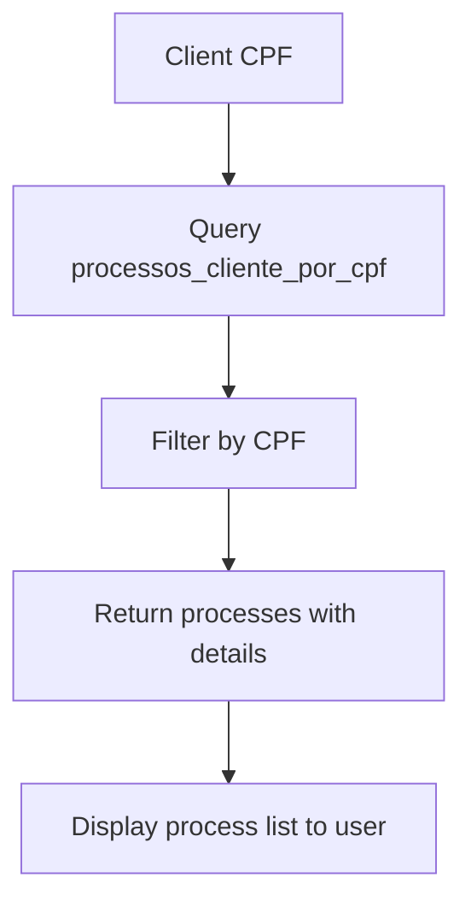
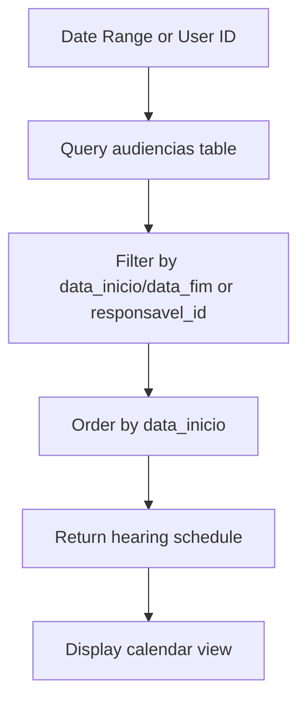
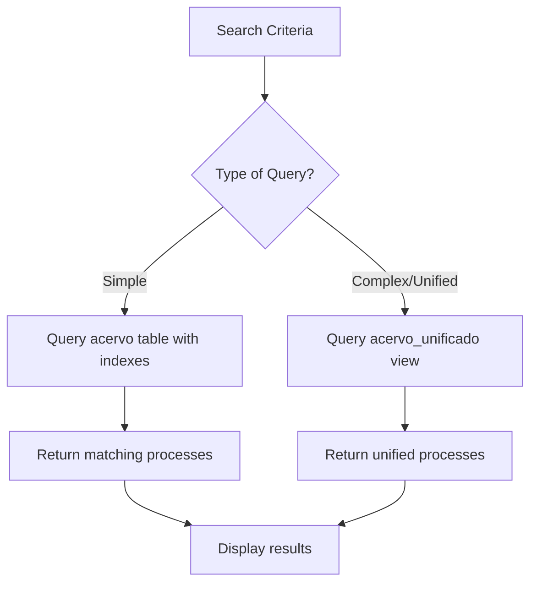

# Database Design

<cite>
**Referenced Files in This Document**   
- [01_enums.sql](file://supabase/schemas/01_enums.sql)
- [04_acervo.sql](file://supabase/schemas/04_acervo.sql)
- [07_audiencias.sql](file://supabase/schemas/07_audiencias.sql)
- [08_usuarios.sql](file://supabase/schemas/08_usuarios.sql)
- [09_clientes.sql](file://supabase/schemas/09_clientes.sql)
- [10_partes_contrarias.sql](file://supabase/schemas/10_partes_contrarias.sql)
- [11_contratos.sql](file://supabase/schemas/11_contratos.sql)
- [15_enderecos.sql](file://supabase/schemas/15_enderecos.sql)
- [16_terceiros.sql](file://supabase/schemas/16_terceiros.sql)
- [17_processo_partes.sql](file://supabase/schemas/17_processo_partes.sql)
- [20_acordos_condenacoes.sql](file://supabase/schemas/20_acordos_condenacoes.sql)
- [25_assinatura_digital.sql](file://supabase/schemas/25_assinatura_digital.sql)
- [05_acervo_unificado_view.sql](file://supabase/schemas/05_acervo_unificado_view.sql)
- [24_processos_cliente_por_cpf_view.sql](file://supabase/schemas/24_processos_cliente_por_cpf_view.sql)
</cite>

## Table of Contents
1. [Introduction](#introduction)
2. [Core Entities and Relationships](#core-entities-and-relationships)
3. [Entity Definitions](#entity-definitions)
4. [Data Validation and Business Rules](#data-validation-and-business-rules)
5. [Database Schema Diagrams](#database-schema-diagrams)
6. [Data Access Patterns](#data-access-patterns)
7. [Performance Considerations](#performance-considerations)
8. [Data Lifecycle and Retention](#data-lifecycle-and-retention)
9. [Data Migration and Version Management](#data-migration-and-version-management)
10. [Sample Data](#sample-data)

## Introduction

The Sinesys database schema is designed to manage legal processes and related entities for a law firm. The system captures and organizes data from the PJE (Processo Judicial Eletrônico) system, providing a comprehensive view of legal cases, clients, contracts, hearings, and other related entities. The database is built on PostgreSQL with Supabase, leveraging row-level security (RLS) for data access control and various performance optimization techniques.

The core of the system revolves around the Acervo entity, which represents legal processes. These processes are linked to various parties including clients (Clientes), opposing parties (Partes Contrárias), and third parties (Terceiros) through the Processo Partes relationship table. Additional entities include Contracts (Contratos), Hearings (Audiencias), Users (Usuarios), and Documents (Documentos), which are interconnected to provide a complete picture of the law firm's operations.

The database design follows a normalized approach with appropriate denormalization for performance where necessary, such as through materialized views. The schema includes comprehensive indexing strategies, constraints, and validation rules to ensure data integrity and optimal query performance.

**Section sources**
- [04_acervo.sql](file://supabase/schemas/04_acervo.sql#L1-L77)
- [09_clientes.sql](file://supabase/schemas/09_clientes.sql#L1-L139)
- [11_contratos.sql](file://supabase/schemas/11_contratos.sql#L1-L86)

## Core Entities and Relationships

The Sinesys database schema is centered around several core entities that represent the fundamental objects in a law firm's operations. These entities are interconnected through well-defined relationships that reflect the real-world associations between legal processes, parties, contracts, and other elements.

The primary entity is Acervo (legal processes), which serves as the central hub of the system. Each Acervo record represents a legal case captured from the PJE system and contains essential information about the process, including its number, status, parties involved, and key dates. The Acervo entity is linked to multiple parties through the Processo Partes table, which establishes a many-to-many relationship between processes and parties.

Parties in the system are represented by three distinct entities: Clientes (clients), Partes Contrárias (opposing parties), and Terceiros (third parties). This separation allows for different attributes and business rules to be applied to each type of party while maintaining a consistent approach to their participation in legal processes. The Processo Partes table acts as a polymorphic association, linking processes to any of these party types.

Contracts (Contratos) represent the agreements between the law firm and its clients, defining the terms of representation. These contracts are linked to clients and processes, establishing the business relationship behind the legal representation. Hearings (Audiencias) are events scheduled within legal processes, containing information about the date, time, location, and participants.

Users (Usuarios) represent the internal staff of the law firm who interact with the system. They may be assigned as responsible parties for processes or hearings, creating an audit trail of responsibility. The system also includes specialized entities for digital signatures, financial agreements, and other domain-specific requirements.


**Diagram sources**
- [04_acervo.sql](file://supabase/schemas/04_acervo.sql#L1-L77)
- [09_clientes.sql](file://supabase/schemas/09_clientes.sql#L1-L139)
- [10_partes_contrarias.sql](file://supabase/schemas/10_partes_contrarias.sql#L1-L139)
- [16_terceiros.sql](file://supabase/schemas/16_terceiros.sql#L1-L119)
- [17_processo_partes.sql](file://supabase/schemas/17_processo_partes.sql#L1-L144)
- [11_contratos.sql](file://supabase/schemas/11_contratos.sql#L1-L86)
- [07_audiencias.sql](file://supabase/schemas/07_audiencias.sql#L1-L159)
- [08_usuarios.sql](file://supabase/schemas/08_usuarios.sql#L1-L94)
- [15_enderecos.sql](file://supabase/schemas/15_enderecos.sql#L1-L94)

## Entity Definitions

This section provides detailed definitions of each core entity in the Sinesys database schema, including field definitions, data types, primary/foreign keys, indexes, and constraints.

### Acervo (Legal Processes)

The Acervo table represents legal processes captured from the PJE system. It serves as the central entity in the database, containing information about each legal case.

**Fields:**
- `id`: Primary key, auto-generated identifier for the record
- `id_pje`: ID of the process in the PJE system
- `advogado_id`: Foreign key referencing the lawyer who captured the process
- `origem`: Source of the process ('acervo_geral' or 'arquivado')
- `trt`: Tribunal code (TRT1 to TRT24 or TST)
- `grau`: Process level ('primeiro_grau' or 'segundo_grau')
- `numero_processo`: Process number in CNJ format
- `numero`: Sequential process number
- `descricao_orgao_julgador`: Description of the judging body
- `classe_judicial`: Judicial class of the process (e.g., ATOrd, ATSum)
- `segredo_justica`: Indicates if the process is confidential
- `codigo_status_processo`: Status code of the process
- `prioridade_processual`: Process priority level
- `nome_parte_autora`: Name of the plaintiff
- `qtde_parte_autora`: Quantity of plaintiffs
- `nome_parte_re`: Name of the defendant
- `qtde_parte_re`: Quantity of defendants
- `data_autuacao`: Process filing date
- `juizo_digital`: Indicates if the process is digital
- `data_arquivamento`: Process archiving date
- `data_proxima_audiencia`: Date of the next scheduled hearing
- `tem_associacao`: Indicates if the process has associated processes
- `created_at`: Timestamp of record creation
- `updated_at`: Timestamp of last record update

**Constraints:**
- Primary key: `id`
- Foreign key: `advogado_id` references `advogados(id)`
- Unique constraint: `(id_pje, trt, grau, numero_processo)` ensures process uniqueness
- Check constraint: `origem` must be 'acervo_geral' or 'arquivado'

**Indexes:**
- `idx_acervo_advogado_id`: B-tree on `advogado_id`
- `idx_acervo_origem`: B-tree on `origem`
- `idx_acervo_trt`: B-tree on `trt`
- `idx_acervo_grau`: B-tree on `grau`
- `idx_acervo_numero_processo`: B-tree on `numero_processo`
- `idx_acervo_id_pje`: B-tree on `id_pje`
- `idx_acervo_data_autuacao`: B-tree on `data_autuacao`
- `idx_acervo_data_arquivamento`: B-tree on `data_arquivamento`
- `idx_acervo_advogado_trt_grau`: B-tree on `(advogado_id, trt, grau)`
- `idx_acervo_numero_processo_trt_grau`: B-tree on `(numero_processo, trt, grau)`

**Section sources**
- [04_acervo.sql](file://supabase/schemas/04_acervo.sql#L1-L77)

### Clientes (Clients)

The Clientes table stores information about the law firm's clients. It contains personal and professional details for both individuals and legal entities.

**Fields:**
- `id`: Primary key, auto-generated identifier
- `tipo_pessoa`: Type of person ('pf' for individual, 'pj' for legal entity)
- `nome`: Full name (individual) or company name (legal entity)
- `nome_social_fantasia`: Social name (individual) or trade name (legal entity)
- `cpf`: Individual's CPF (unique)
- `cnpj`: Company's CNPJ (unique)
- `rg`: Individual's ID document
- `data_nascimento`: Date of birth
- `genero`: Gender of the individual
- `estado_civil`: Marital status
- `nacionalidade`: Nationality
- `inscricao_estadual`: State registration number
- `tipo_documento`: Main document type ('CPF' or 'CNPJ')
- `emails`: Array of emails from PJE in JSONB format
- `status_pje`: Status in PJE system
- `situacao_pje`: Situation in PJE system
- `login_pje`: PJE system username
- `autoridade`: Indicates if the person is an authority
- `ddd_celular`, `numero_celular`: Mobile phone details
- `ddd_residencial`, `numero_residencial`: Residential phone details
- `ddd_comercial`, `numero_comercial`: Business phone details
- `sexo`: Gender in PJE system (different from enum)
- `nome_genitora`: Mother's name
- `naturalidade_id_pje`, `naturalidade_municipio`: Birthplace details
- `naturalidade_estado_id_pje`, `naturalidade_estado_sigla`: State of birth details
- `uf_nascimento_id_pje`, `uf_nascimento_sigla`, `uf_nascimento_descricao`: State of birth description
- `pais_nascimento_id_pje`, `pais_nascimento_codigo`, `pais_nascimento_descricao`: Country of birth details
- `escolaridade_codigo`: Education level code
- `situacao_cpf_receita_id`, `situacao_cpf_receita_descricao`: CPF status with tax authority
- `pode_usar_celular_mensagem`: Indicates if mobile messaging is allowed
- `data_abertura`: Company opening date
- `data_fim_atividade`: Company closure date
- `orgao_publico`: Indicates if it's a public entity
- `tipo_pessoa_codigo_pje`, `tipo_pessoa_label_pje`: PJE-specific person type details
- `tipo_pessoa_validacao_receita`: Tax authority validation for person type
- `ds_tipo_pessoa`: Description of legal entity type
- `situacao_cnpj_receita_id`, `situacao_cnpj_receita_descricao`: CNPJ status with tax authority
- `ramo_atividade`: Business activity sector
- `cpf_responsavel`: Responsible person's CPF
- `oficial`: Indicates if it's an official entity
- `ds_prazo_expediente_automatico`: Automatic process deadline description
- `porte_codigo`, `porte_descricao`: Company size description
- `ultima_atualizacao_pje`: Last PJE update timestamp
- `endereco_id`: Foreign key to addresses table
- `observacoes`: Notes about the client
- `created_by`: User who created the record
- `dados_anteriores`: Previous state of the record before last update
- `ativo`: Indicates if the client is active
- `created_at`: Record creation timestamp
- `updated_at`: Last update timestamp

**Constraints:**
- Primary key: `id`
- Foreign keys: `endereco_id` references `enderecos(id)`, `created_by` references `usuarios(id)`
- Unique constraints: `cpf`, `cnpj`
- Check constraint: `tipo_documento` must be 'CPF' or 'CNPJ'

**Indexes:**
- `idx_clientes_tipo_pessoa`: B-tree on `tipo_pessoa`
- `idx_clientes_cpf`: B-tree on `cpf` (where not null)
- `idx_clientes_cnpj`: B-tree on `cnpj` (where not null)
- `idx_clientes_nome`: B-tree on `nome`
- `idx_clientes_ativo`: B-tree on `ativo`
- `idx_clientes_created_by`: B-tree on `created_by`
- `idx_clientes_endereco_id`: B-tree on `endereco_id`

**Section sources**
- [09_clientes.sql](file://supabase/schemas/09_clientes.sql#L1-L139)

### Contratos (Contracts)

The Contratos table stores legal contracts between the law firm and its clients, defining the terms of representation.

**Fields:**
- `id`: Primary key, auto-generated identifier
- `area_direito`: Legal area of the contract
- `tipo_contrato`: Type of legal contract
- `tipo_cobranca`: Billing type ('pro_exito' or 'pro_labore')
- `cliente_id`: Foreign key to the main client
- `polo_cliente`: Process position of the client ('autor' or 're')
- `parte_contraria_id`: Foreign key to the main opposing party
- `parte_autora`: Array of plaintiffs in JSONB format
- `parte_re`: Array of defendants in JSONB format
- `qtde_parte_autora`: Quantity of plaintiffs
- `qtde_parte_re`: Quantity of defendants
- `status`: Contract status
- `data_contratacao`: Contract initiation date
- `data_assinatura`: Contract signing date
- `data_distribuicao`: Process distribution date
- `data_desistencia`: Contract termination date
- `responsavel_id`: User responsible for the contract
- `created_by`: User who created the record
- `observacoes`: General notes about the contract
- `dados_anteriores`: Previous state of the record before last update
- `created_at`: Record creation timestamp
- `updated_at`: Last update timestamp

**Constraints:**
- Primary key: `id`
- Foreign keys: `cliente_id` references `clientes(id)`, `parte_contraria_id` references `partes_contrarias(id)`, `responsavel_id` references `usuarios(id)`, `created_by` references `usuarios(id)`
- Default value: `status` defaults to 'em_contratacao'

**Indexes:**
- `idx_contratos_area_direito`: B-tree on `area_direito`
- `idx_contratos_tipo_contrato`: B-tree on `tipo_contrato`
- `idx_contratos_status`: B-tree on `status`
- `idx_contratos_cliente_id`: B-tree on `cliente_id`
- `idx_contratos_parte_contraria_id`: B-tree on `parte_contraria_id`
- `idx_contratos_responsavel_id`: B-tree on `responsavel_id`
- `idx_contratos_created_by`: B-tree on `created_by`
- `idx_contratos_data_assinatura`: B-tree on `data_assinatura` (where not null)
- `idx_contratos_data_distribuicao`: B-tree on `data_distribuicao` (where not null)
- `idx_contratos_parte_autora`: GIN on `parte_autora` (for JSONB search)
- `idx_contratos_parte_re`: GIN on `parte_re` (for JSONB search)

**Section sources**
- [11_contratos.sql](file://supabase/schemas/11_contratos.sql#L1-L86)

### Audiencias (Hearings)

The Audiencias table stores information about scheduled hearings in legal processes.

**Fields:**
- `id`: Primary key, auto-generated identifier
- `id_pje`: ID of the hearing in the PJE system
- `advogado_id`: Foreign key to the lawyer who captured the hearing
- `processo_id`: Foreign key to the related process
- `orgao_julgador_id`: Foreign key to the judging body
- `trt`: Tribunal code
- `grau`: Process level
- `numero_processo`: Process number
- `data_inicio`: Start date and time of the hearing
- `data_fim`: End date and time of the hearing
- `hora_inicio`: Start time (extracted from PJE)
- `hora_fim`: End time (extracted from PJE)
- `modalidade`: Hearing modality ('virtual', 'presencial', or 'hibrida')
- `sala_audiencia_nome`: Hearing room name
- `sala_audiencia_id`: ID of the hearing room in PJE
- `status`: Hearing status ('M' for scheduled, 'R' for completed, 'C' for canceled)
- `status_descricao`: Status description
- `tipo_audiencia_id`: Foreign key to hearing type
- `classe_judicial_id`: Foreign key to judicial class
- `designada`: Indicates if the hearing is scheduled
- `em_andamento`: Indicates if the hearing is in progress
- `documento_ativo`: Indicates if there is an active document
- `polo_ativo_nome`: Name of the plaintiff
- `polo_ativo_representa_varios`: Indicates if the plaintiff represents multiple parties
- `polo_passivo_nome`: Name of the defendant
- `polo_passivo_representa_varios`: Indicates if the defendant represents multiple parties
- `url_audiencia_virtual`: URL for virtual hearings
- `endereco_presencial`: Address for in-person hearings in JSON format
- `presenca_hibrida`: For hybrid hearings, indicates who attends in person ('advogado' or 'cliente')
- `ata_audiencia_id`: ID of the hearing minutes document in PJE
- `url_ata_audiencia`: URL to download the hearing minutes
- `segredo_justica`: Indicates if the process is confidential
- `juizo_digital`: Indicates if the process is digital
- `responsavel_id`: User responsible for the hearing
- `observacoes`: Notes about the hearing
- `dados_anteriores`: Previous state of the record before last update
- `created_at`: Record creation timestamp
- `updated_at`: Last update timestamp

**Constraints:**
- Primary key: `id`
- Foreign keys: `advogado_id` references `advogados(id)`, `processo_id` references `acervo(id)`, `orgao_julgador_id` references `orgao_julgador(id)`, `tipo_audiencia_id` references `tipo_audiencia(id)`, `classe_judicial_id` references `classe_judicial(id)`, `responsavel_id` references `usuarios(id)`
- Unique constraint: `(id_pje, trt, grau, numero_processo)` ensures hearing uniqueness

**Indexes:**
- `idx_audiencias_advogado_id`: B-tree on `advogado_id`
- `idx_audiencias_processo_id`: B-tree on `processo_id`
- `idx_audiencias_orgao_julgador_id`: B-tree on `orgao_julgador_id`
- `idx_audiencias_trt`: B-tree on `trt`
- `idx_audiencias_grau`: B-tree on `grau`
- `idx_audiencias_id_pje`: B-tree on `id_pje`
- `idx_audiencias_numero_processo`: B-tree on `numero_processo`
- `idx_audiencias_status`: B-tree on `status`
- `idx_audiencias_data_inicio`: B-tree on `data_inicio`
- `idx_audiencias_data_fim`: B-tree on `data_fim`
- `idx_audiencias_responsavel_id`: B-tree on `responsavel_id`
- `idx_audiencias_advogado_trt_grau`: B-tree on `(advogado_id, trt, grau)`
- `idx_audiencias_processo_data`: B-tree on `(processo_id, data_inicio)`
- `idx_audiencias_modalidade`: B-tree on `modalidade`

**Section sources**
- [07_audiencias.sql](file://supabase/schemas/07_audiencias.sql#L1-L159)

### Usuarios (Users)

The Usuarios table stores information about the law firm's staff members who use the system.

**Fields:**
- `id`: Primary key, auto-generated identifier
- `nome_completo`: Full name of the user
- `nome_exibicao`: Display name in the system
- `cpf`: User's CPF (unique)
- `rg`: User's ID document
- `data_nascimento`: Date of birth
- `genero`: Gender
- `oab`: OAB number (for lawyers)
- `uf_oab`: State where OAB was issued
- `email_pessoal`: Personal email
- `email_corporativo`: Corporate email (unique)
- `telefone`: Phone number
- `ramal`: Phone extension
- `endereco`: Complete address in JSONB format
- `auth_user_id`: Reference to Supabase Auth user
- `cargo_id`: ID of the user's position
- `is_super_admin`: Indicates if the user is a super admin
- `ativo`: Indicates if the user is active
- `created_at`: Record creation timestamp
- `updated_at`: Last update timestamp

**Constraints:**
- Primary key: `id`
- Foreign keys: `auth_user_id` references `auth.users(id)`, `cargo_id` references `cargos(id)`
- Unique constraints: `cpf`, `email_corporativo`

**Indexes:**
- `idx_usuarios_cpf`: Unique B-tree on `cpf`
- `idx_usuarios_email_corporativo`: Unique B-tree on `email_corporativo`
- `idx_usuarios_auth_user_id`: B-tree on `auth_user_id`
- `idx_usuarios_cargo_id`: B-tree on `cargo_id`
- `idx_usuarios_ativo`: B-tree on `ativo`
- `idx_usuarios_nome_completo`: B-tree on `nome_completo`
- `idx_usuarios_oab`: B-tree on `(oab, uf_oab)` (where oab is not null)
- `idx_usuarios_endereco`: GIN on `endereco` (for JSONB search)

**Section sources**
- [08_usuarios.sql](file://supabase/schemas/08_usuarios.sql#L1-L94)

### Partes Contrárias (Opposing Parties)

The Partes Contrárias table stores information about opposing parties in legal processes. It has a similar structure to the Clientes table but is used specifically for parties on the opposing side.

**Fields:**
- `id`: Primary key, auto-generated identifier
- `tipo_pessoa`: Type of person ('pf' or 'pj')
- `nome`: Full name (individual) or company name (legal entity)
- `nome_social_fantasia`: Social name (individual) or trade name (legal entity)
- `cpf`: Individual's CPF (unique)
- `cnpj`: Company's CNPJ (unique)
- `rg`: Individual's ID document
- `data_nascimento`: Date of birth
- `genero`: Gender
- `estado_civil`: Marital status
- `nacionalidade`: Nationality
- `inscricao_estadual`: State registration number
- `tipo_documento`: Main document type ('CPF' or 'CNPJ')
- `emails`: Array of emails from PJE in JSONB format
- `status_pje`: Status in PJE system
- `situacao_pje`: Situation in PJE system
- `login_pje`: PJE system username
- `autoridade`: Indicates if the person is an authority
- `ddd_celular`, `numero_celular`: Mobile phone details
- `ddd_residencial`, `numero_residencial`: Residential phone details
- `ddd_comercial`, `numero_comercial`: Business phone details
- `sexo`: Gender in PJE system
- `nome_genitora`: Mother's name
- `naturalidade_id_pje`, `naturalidade_municipio`: Birthplace details
- `naturalidade_estado_id_pje`, `naturalidade_estado_sigla`: State of birth details
- `uf_nascimento_id_pje`, `uf_nascimento_sigla`, `uf_nascimento_descricao`: State of birth description
- `pais_nascimento_id_pje`, `pais_nascimento_codigo`, `pais_nascimento_descricao`: Country of birth details
- `escolaridade_codigo`: Education level code
- `situacao_cpf_receita_id`, `situacao_cpf_receita_descricao`: CPF status with tax authority
- `pode_usar_celular_mensagem`: Indicates if mobile messaging is allowed
- `data_abertura`: Company opening date
- `data_fim_atividade`: Company closure date
- `orgao_publico`: Indicates if it's a public entity
- `tipo_pessoa_codigo_pje`, `tipo_pessoa_label_pje`: PJE-specific person type details
- `tipo_pessoa_validacao_receita`: Tax authority validation for person type
- `ds_tipo_pessoa`: Description of legal entity type
- `situacao_cnpj_receita_id`, `situacao_cnpj_receita_descricao`: CNPJ status with tax authority
- `ramo_atividade`: Business activity sector
- `cpf_responsavel`: Responsible person's CPF
- `oficial`: Indicates if it's an official entity
- `ds_prazo_expediente_automatico`: Automatic process deadline description
- `porte_codigo`, `porte_descricao`: Company size description
- `ultima_atualizacao_pje`: Last PJE update timestamp
- `endereco_id`: Foreign key to addresses table
- `observacoes`: Notes about the opposing party
- `created_by`: User who created the record
- `dados_anteriores`: Previous state of the record before last update
- `ativo`: Indicates if the opposing party is active
- `created_at`: Record creation timestamp
- `updated_at`: Last update timestamp

**Constraints:**
- Primary key: `id`
- Foreign keys: `endereco_id` references `enderecos(id)`, `created_by` references `usuarios(id)`
- Unique constraints: `cpf`, `cnpj`
- Check constraint: `tipo_documento` must be 'CPF' or 'CNPJ'

**Indexes:**
- `idx_partes_contrarias_tipo_pessoa`: B-tree on `tipo_pessoa`
- `idx_partes_contrarias_cpf`: B-tree on `cpf` (where not null)
- `idx_partes_contrarias_cnpj`: B-tree on `cnpj` (where not null)
- `idx_partes_contrarias_nome`: B-tree on `nome`
- `idx_partes_contrarias_ativo`: B-tree on `ativo`
- `idx_partes_contrarias_created_by`: B-tree on `created_by`
- `idx_partes_contrarias_endereco_id`: B-tree on `endereco_id`

**Section sources**
- [10_partes_contrarias.sql](file://supabase/schemas/10_partes_contrarias.sql#L1-L139)

### Terceiros (Third Parties)

The Terceiros table stores information about third parties in legal processes, such as experts, public prosecutors, assistants, etc.

**Fields:**
- `id`: Primary key, auto-generated identifier
- `id_tipo_parte`: ID of the party type
- `tipo_parte`: Type of party ('PERITO', 'MINISTERIO_PUBLICO', 'ASSISTENTE', etc.)
- `polo`: Process position ('ativo', 'passivo', 'outros')
- `tipo_pessoa`: Type of person ('pf' or 'pj')
- `nome`: Name of the third party
- `nome_fantasia`: Trade name (for legal entities)
- `cpf`: Individual's CPF
- `cnpj`: Company's CNPJ
- `tipo_documento`: Main document type ('CPF' or 'CNPJ')
- `principal`: Indicates if it's the main party in the position
- `autoridade`: Indicates if the person is an authority
- `endereco_desconhecido`: Indicates if the address is unknown
- `status_pje`: Status in PJE system
- `situacao_pje`: Situation in PJE system
- `login_pje`: PJE system username
- `ordem`: Order of display within the position
- `emails`: Array of emails in JSONB format
- `ddd_celular`, `numero_celular`: Mobile phone details
- `ddd_residencial`, `numero_residencial`: Residential phone details
- `ddd_comercial`, `numero_comercial`: Business phone details
- `sexo`: Gender
- `rg`: ID document
- `data_nascimento`: Date of birth
- `genero`: Gender
- `estado_civil`: Marital status
- `nome_genitora`: Mother's name
- `nacionalidade`: Nationality
- `uf_nascimento_id_pje`, `uf_nascimento_sigla`, `uf_nascimento_descricao`: State of birth details
- `naturalidade_id_pje`, `naturalidade_municipio`, `naturalidade_estado_id_pje`, `naturalidade_estado_sigla`: Birthplace details
- `pais_nascimento_id_pje`, `pais_nascimento_codigo`, `pais_nascimento_descricao`: Country of birth details
- `escolaridade_codigo`: Education level code
- `situacao_cpf_receita_id`, `situacao_cpf_receita_descricao`: CPF status with tax authority
- `pode_usar_celular_mensagem`: Indicates if mobile messaging is allowed
- `data_abertura`: Company opening date
- `data_fim_atividade`: Company closure date
- `orgao_publico`: Indicates if it's a public entity
- `tipo_pessoa_codigo_pje`, `tipo_pessoa_label_pje`: PJE-specific person type details
- `tipo_pessoa_validacao_receita`: Tax authority validation for person type
- `ds_tipo_pessoa`: Description of legal entity type
- `situacao_cnpj_receita_id`, `situacao_cnpj_receita_descricao`: CNPJ status with tax authority
- `ramo_atividade`: Business activity sector
- `cpf_responsavel`: Responsible person's CPF
- `oficial`: Indicates if it's an official entity
- `ds_prazo_expediente_automatico`: Automatic process deadline description
- `porte_codigo`, `porte_descricao`: Company size description
- `inscricao_estadual`: State registration number
- `observacoes`: Notes about the third party
- `endereco_id`: Foreign key to addresses table
- `ativo`: Indicates if the third party is active
- `created_at`: Record creation timestamp
- `updated_at`: Last update timestamp

**Constraints:**
- Primary key: `id`
- Foreign key: `endereco_id` references `enderecos(id)`
- Unique constraints: `cpf` (where not null), `cnpj` (where not null)
- Check constraints: `tipo_documento` must be 'CPF' or 'CNPJ'

**Indexes:**
- `idx_terceiros_tipo_parte`: B-tree on `tipo_parte`

**Section sources**
- [16_terceiros.sql](file://supabase/schemas/16_terceiros.sql#L1-L119)

### Processo Partes (Process Parties)

The Processo Partes table establishes the many-to-many relationship between processes and parties (clients, opposing parties, third parties).

**Fields:**
- `id`: Primary key, auto-generated identifier
- `processo_id`: Foreign key to the process
- `tipo_entidade`: Type of entity ('cliente', 'parte_contraria', 'terceiro')
- `entidade_id`: ID of the entity in the corresponding table
- `id_pje`: ID of the party in the PJE system
- `id_pessoa_pje`: ID of the person in the PJE system (for audit)
- `id_tipo_parte`: ID of the party type in the PJE system
- `tipo_parte`: Type of participant in the process ('AUTOR', 'REU', 'RECLAMANTE', etc.)
- `polo`: Process position ('ATIVO', 'PASSIVO', 'NEUTRO', 'TERCEIRO')
- `trt`: Tribunal code
- `grau`: Process level ('primeiro_grau' or 'segundo_grau')
- `numero_processo`: Process number
- `principal`: Indicates if it's the main party in the position
- `ordem`: Order of display within the position (base 0, >= 0)
- `status_pje`: Status in PJE system
- `situacao_pje`: Situation in PJE system
- `autoridade`: Indicates if it's an authority
- `endereco_desconhecido`: Indicates if the address is unknown
- `dados_pje_completo`: Complete JSON from PJE for audit and history
- `ultima_atualizacao_pje`: Last PJE update timestamp
- `created_at`: Record creation timestamp
- `updated_at`: Last update timestamp

**Constraints:**
- Primary key: `id`
- Foreign key: `processo_id` references `acervo(id)`
- Unique constraint: `(processo_id, tipo_entidade, entidade_id, grau)` prevents duplicate entity participation in the same process-grade combination

**Indexes:**
- `idx_processo_partes_processo_id`: B-tree on `processo_id`
- `idx_processo_partes_entidade`: B-tree on `(tipo_entidade, entidade_id)`
- `idx_processo_partes_polo`: B-tree on `polo`
- `idx_processo_partes_trt_grau`: B-tree on `(trt, grau)`
- `idx_processo_partes_numero_processo`: B-tree on `numero_processo`
- `idx_processo_partes_id_pessoa_pje`: B-tree on `id_pessoa_pje` (where not null)

**Section sources**
- [17_processo_partes.sql](file://supabase/schemas/17_processo_partes.sql#L1-L144)

### Enderecos (Addresses)

The Enderecos table stores addresses for clients, opposing parties, and third parties.

**Fields:**
- `id`: Primary key, auto-generated identifier
- `id_pje`: ID of the address in the PJE system
- `entidade_tipo`: Type of entity owner ('cliente', 'parte_contraria', 'terceiro')
- `entidade_id`: ID of the entity in the respective table
- `trt`: Tribunal Regional do Trabalho (process context)
- `grau`: Process level ('primeiro_grau', 'segundo_grau')
- `numero_processo`: Process number (process context)
- `logradouro`: Street address
- `numero`: Street number
- `complemento`: Address complement
- `bairro`: Neighborhood
- `cep`: Postal code
- `id_municipio_pje`: Municipality ID in PJE
- `municipio`: Municipality name
- `municipio_ibge`: IBGE municipality code
- `estado_id_pje`: State ID in PJE
- `estado_sigla`: State abbreviation
- `estado_descricao`: State description
- `estado`: State name
- `pais_id_pje`: Country ID in PJE
- `pais_codigo`: Country code
- `pais_descricao`: Country description
- `pais`: Country name
- `classificacoes_endereco`: Array of PJE classifications ('R' for residential, 'C' for commercial, 'A' for current)
- `correspondencia`: Indicates if it's a correspondence address
- `situacao`: Address status in PJE ('P' for primary, 'V' for current)
- `id_usuario_cadastrador_pje`: ID of the user who registered the address in PJE
- `data_alteracao_pje`: PJE address change timestamp
- `dados_pje_completo`: Complete JSON of the address captured from PJE (audit)
- `ativo`: Indicates if the address is active
- `created_at`: Record creation timestamp
- `updated_at`: Last update timestamp

**Constraints:**
- Primary key: `id`
- Foreign key: `endereco_id` references `enderecos(id)`
- Unique constraint: `(id_pje, entidade_tipo, entidade_id)` where `id_pje` is not null (for deduplication of PJE addresses)

**Indexes:**
- `idx_enderecos_entidade`: B-tree on `(entidade_tipo, entidade_id)`
- `idx_enderecos_processo`: B-tree on `(numero_processo, trt, grau)`
- `idx_enderecos_id_pje`: B-tree on `id_pje`
- `idx_enderecos_pje_unique`: Unique B-tree on `(id_pje, entidade_tipo, entidade_id)` where `id_pje` is not null

**Section sources**
- [15_enderecos.sql](file://supabase/schemas/15_enderecos.sql#L1-L94)

## Data Validation and Business Rules

The Sinesys database schema implements several data validation rules and business rules at the database level to ensure data integrity and enforce business logic.

### Enum Types

The system uses PostgreSQL enum types to constrain values in various fields, ensuring data consistency and preventing invalid entries. Key enum types include:

- `codigo_tribunal`: Restricts tribunal codes to valid values (TRT1 to TRT24, TST)
- `grau_tribunal`: Restricts process levels to 'primeiro_grau', 'segundo_grau', or 'tribunal_superior'
- `tipo_pessoa`: Restricts person types to 'pf' (individual) or 'pj' (legal entity)
- `genero_usuario`: Restricts gender to 'masculino', 'feminino', 'outro', or 'prefiro_nao_informar'
- `estado_civil`: Restricts marital status to predefined values
- `area_direito`: Restricts legal areas to predefined values
- `tipo_contrato`: Restricts contract types to predefined values
- `tipo_cobranca`: Restricts billing types to 'pro_exito' or 'pro_labore'
- `status_contrato`: Restricts contract statuses to predefined values
- `polo_processual`: Restricts process positions to 'autor' or 're'
- `modalidade_audiencia`: Restricts hearing modalities to 'virtual', 'presencial', or 'hibrida'

### Check Constraints

The schema includes check constraints to enforce business rules at the database level:

- In the `acervo` table, the `origem` field must be either 'acervo_geral' or 'arquivado'
- In the `clientes` and `partes_contrarias` tables, the `tipo_documento` field must be 'CPF' or 'CNPJ'
- In the `audiencias` table, the `presenca_hibrida` field must be null or one of 'advogado' or 'cliente'
- In the `processo_partes` table, the `tipo_entidade` field must be one of 'cliente', 'parte_contraria', or 'terceiro'
- In the `processo_partes` table, the `tipo_parte` field must be one of the predefined party types
- In the `processo_partes` table, the `polo` field must be one of 'ATIVO', 'PASSIVO', 'NEUTRO', or 'TERCEIRO'
- In the `processo_partes` table, the `grau` field must be 'primeiro_grau' or 'segundo_grau'
- In the `contratos` table, the `status` field must be one of the predefined contract statuses
- In the `contratos` table, the `qtde_parte_autora` and `qtde_parte_re` fields must be greater than 0
- In the `acordos_condenacoes` table, the `tipo` field must be one of 'acordo', 'condenacao', or 'custas_processuais'
- In the `acordos_condenacoes` table, the `direcao` field must be 'recebimento' or 'pagamento'
- In the `acordos_condenacoes` table, the `valor_total` field must be greater than 0
- In the `acordos_condenacoes` table, the `numero_parcelas` field must be greater than 0
- In the `acordos_condenacoes` table, the `percentual_escritorio` field must be between 0 and 100
- In the `parcelas` table, the `forma_pagamento` field must be one of the predefined payment methods

### Unique Constraints

The schema includes unique constraints to prevent duplicate data:

- In the `acervo` table, the combination of `id_pje`, `trt`, `grau`, and `numero_processo` must be unique, ensuring that the same process is not duplicated
- In the `audiencias` table, the combination of `id_pje`, `trt`, `grau`, and `numero_processo` must be unique, ensuring that the same hearing is not duplicated
- In the `clientes` table, the `cpf` and `cnpj` fields must be unique, preventing duplicate clients
- In the `partes_contrarias` table, the `cpf` and `cnpj` fields must be unique, preventing duplicate opposing parties
- In the `terceiros` table, the `cpf` and `cnpj` fields must be unique (with partial constraints where the field is not null), preventing duplicate third parties
- In the `usuarios` table, the `cpf` and `email_corporativo` fields must be unique, preventing duplicate users
- In the `enderecos` table, the combination of `id_pje`, `entidade_tipo`, and `entidade_id` must be unique (where `id_pje` is not null), preventing duplicate addresses from PJE
- In the `processo_partes` table, the combination of `processo_id`, `tipo_entidade`, `entidade_id`, and `grau` must be unique, preventing the same entity from being added multiple times to the same process-grade combination

### Triggers and Functions

The schema includes several triggers and functions to enforce business rules and maintain data integrity:

- The `populate_modalidade_audiencia` function automatically sets the `modalidade` field in the `audiencias` table based on the presence of a virtual hearing URL, the type of hearing, or a physical address
- The `update_updated_at_column` function automatically updates the `updated_at` field whenever a record is modified
- Various triggers call the `update_updated_at_column` function before updating records in multiple tables to ensure the `updated_at` field is always current

### Row Level Security (RLS)

The system implements Row Level Security (RLS) policies to control data access:

- Service role has full access to all tables
- Authenticated users can read most tables
- Users can only update their own profile in the `usuarios` table
- Specific policies are defined for each table to ensure appropriate access control

**Section sources**
- [01_enums.sql](file://supabase/schemas/01_enums.sql#L1-L400)
- [04_acervo.sql](file://supabase/schemas/04_acervo.sql#L1-L77)
- [07_audiencias.sql](file://supabase/schemas/07_audiencias.sql#L1-L159)
- [08_usuarios.sql](file://supabase/schemas/08_usuarios.sql#L1-L94)
- [09_clientes.sql](file://supabase/schemas/09_clientes.sql#L1-L139)
- [10_partes_contrarias.sql](file://supabase/schemas/10_partes_contrarias.sql#L1-L139)
- [11_contratos.sql](file://supabase/schemas/11_contratos.sql#L1-L86)
- [15_enderecos.sql](file://supabase/schemas/15_enderecos.sql#L1-L94)
- [16_terceiros.sql](file://supabase/schemas/16_terceiros.sql#L1-L119)
- [17_processo_partes.sql](file://supabase/schemas/17_processo_partes.sql#L1-L144)

## Database Schema Diagrams

This section provides visual representations of the database schema, showing the relationships between tables and their key attributes.

```mermaid
erDiagram
ACERVO ||--o{ PROCESSO_PARTES : "contains"
CLIENTES ||--o{ PROCESSO_PARTES : "participates as"
PARTES_CONTRARIAS ||--o{ PROCESSO_PARTES : "participates as"
TERCEIROS ||--o{ PROCESSO_PARTES : "participates as"
CONTRATOS }o--|| ACERVO : "related to"
AUDIENCIAS }o--|| ACERVO : "scheduled for"
USUARIOS ||--o{ AUDIENCIAS : "responsible for"
USUARIOS ||--o{ CONTRATOS : "responsible for"
ENDERECOS }o--|| CLIENTES : "has"
ENDERECOS }o--|| PARTES_CONTRARIAS : "has"
ENDERECOS }o--|| TERCEIROS : "has"
ACERVO {
bigint id PK
bigint id_pje
bigint advogado_id FK
text origem
codigo_tribunal trt
grau_tribunal grau
text numero_processo
text descricao_orgao_julgador
text classe_judicial
boolean segredo_justica
text codigo_status_processo
integer prioridade_processual
text nome_parte_autora
integer qtde_parte_autora
text nome_parte_re
integer qtde_parte_re
timestamptz data_autuacao
boolean juizo_digital
timestamptz data_arquivamento
timestamptz data_proxima_audiencia
boolean tem_associacao
timestamptz created_at
timestamptz updated_at
}
CLIENTES {
bigint id PK
tipo_pessoa tipo_pessoa
text nome
text nome_social_fantasia
text cpf
text cnpj
text rg
date data_nascimento
genero_usuario genero
estado_civil estado_civil
text nacionalidade
text inscricao_estadual
text tipo_documento
jsonb emails
text status_pje
text situacao_pje
text login_pje
boolean autoridade
text ddd_celular
text numero_celular
text ddd_residencial
text numero_residencial
text ddd_comercial
text numero_comercial
text sexo
text nome_genitora
integer naturalidade_id_pje
text naturalidade_municipio
integer naturalidade_estado_id_pje
text naturalidade_estado_sigla
integer uf_nascimento_id_pje
text uf_nascimento_sigla
text uf_nascimento_descricao
integer pais_nascimento_id_pje
text pais_nascimento_codigo
text pais_nascimento_descricao
integer escolaridade_codigo
integer situacao_cpf_receita_id
text situacao_cpf_receita_descricao
boolean pode_usar_celular_mensagem
date data_abertura
date data_fim_atividade
boolean orgao_publico
text tipo_pessoa_codigo_pje
text tipo_pessoa_label_pje
text tipo_pessoa_validacao_receita
text ds_tipo_pessoa
integer situacao_cnpj_receita_id
text situacao_cnpj_receita_descricao
text ramo_atividade
text cpf_responsavel
boolean oficial
text ds_prazo_expediente_automatico
integer porte_codigo
text porte_descricao
timestamptz ultima_atualizacao_pje
bigint endereco_id FK
text observacoes
jsonb dados_anteriores
boolean ativo
timestamptz created_at
timestamptz updated_at
bigint created_by FK
}
PARTES_CONTRARIAS {
bigint id PK
tipo_pessoa tipo_pessoa
text nome
text nome_social_fantasia
text cpf
text cnpj
text rg
date data_nascimento
genero_usuario genero
estado_civil estado_civil
text nacionalidade
text inscricao_estadual
text tipo_documento
jsonb emails
text status_pje
text situacao_pje
text login_pje
boolean autoridade
text ddd_celular
text numero_celular
text ddd_residencial
text numero_residencial
text ddd_comercial
text numero_comercial
text sexo
text nome_genitora
integer naturalidade_id_pje
text naturalidade_municipio
integer naturalidade_estado_id_pje
text naturalidade_estado_sigla
integer uf_nascimento_id_pje
text uf_nascimento_sigla
text uf_nascimento_descricao
integer pais_nascimento_id_pje
text pais_nascimento_codigo
text pais_nascimento_descricao
integer escolaridade_codigo
integer situacao_cpf_receita_id
text situacao_cpf_receita_descricao
boolean pode_usar_celular_mensagem
date data_abertura
date data_fim_atividade
boolean orgao_publico
text tipo_pessoa_codigo_pje
text tipo_pessoa_label_pje
text tipo_pessoa_validacao_receita
text ds_tipo_pessoa
integer situacao_cnpj_receita_id
text situacao_cnpj_receita_descricao
text ramo_atividade
text cpf_responsavel
boolean oficial
text ds_prazo_expediente_automatico
integer porte_codigo
text porte_descricao
timestamptz ultima_atualizacao_pje
bigint endereco_id FK
text observacoes
jsonb dados_anteriores
boolean ativo
timestamptz created_at
timestamptz updated_at
bigint created_by FK
}
TERCEIROS {
bigint id PK
bigint id_tipo_parte
text tipo_parte
text polo
tipo_pessoa tipo_pessoa
text nome
text nome_fantasia
text cpf
text cnpj
text tipo_documento
boolean principal
boolean autoridade
boolean endereco_desconhecido
text status_pje
text situacao_pje
text login_pje
integer ordem
jsonb emails
text ddd_celular
text numero_celular
text ddd_residencial
text numero_residencial
text ddd_comercial
text numero_comercial
text sexo
text rg
date data_nascimento
genero_usuario genero
estado_civil estado_civil
text nome_genitora
text nacionalidade
integer uf_nascimento_id_pje
text uf_nascimento_sigla
text uf_nascimento_descricao
integer naturalidade_id_pje
text naturalidade_municipio
integer naturalidade_estado_id_pje
text naturalidade_estado_sigla
integer pais_nascimento_id_pje
text pais_nascimento_codigo
text pais_nascimento_descricao
integer escolaridade_codigo
integer situacao_cpf_receita_id
text situacao_cpf_receita_descricao
boolean pode_usar_celular_mensagem
date data_abertura
date data_fim_atividade
boolean orgao_publico
text tipo_pessoa_codigo_pje
text tipo_pessoa_label_pje
text tipo_pessoa_validacao_receita
text ds_tipo_pessoa
integer situacao_cnpj_receita_id
text situacao_cnpj_receita_descricao
text ramo_atividade
text cpf_responsavel
boolean oficial
text ds_prazo_expediente_automatico
integer porte_codigo
text porte_descricao
text inscricao_estadual
text observacoes
bigint endereco_id FK
boolean ativo
timestamptz created_at
timestamptz updated_at
}
PROCESSO_PARTES {
bigint id PK
bigint processo_id FK
text tipo_entidade
bigint entidade_id
bigint id_pje
bigint id_pessoa_pje
bigint id_tipo_parte
text tipo_parte
text polo
text trt
text grau
text numero_processo
boolean principal
integer ordem
text status_pje
text situacao_pje
boolean autoridade
boolean endereco_desconhecido
jsonb dados_pje_completo
timestamptz ultima_atualizacao_pje
timestamptz created_at
timestamptz updated_at
}
CONTRATOS {
bigint id PK
area_direito area_direito
tipo_contrato tipo_contrato
tipo_cobranca tipo_cobranca
bigint cliente_id FK
polo_processual polo_cliente
bigint parte_contraria_id FK
jsonb parte_autora
jsonb parte_re
integer qtde_parte_autora
integer qtde_parte_re
status_contrato status
timestamptz data_contratacao
date data_assinatura
date data_distribuicao
date data_desistencia
bigint responsavel_id FK
bigint created_by FK
text observacoes
jsonb dados_anteriores
timestamptz created_at
timestamptz updated_at
}
AUDIENCIAS {
bigint id PK
bigint id_pje
bigint advogado_id FK
bigint processo_id FK
bigint orgao_julgador_id FK
codigo_tribunal trt
grau_tribunal grau
text numero_processo
timestamptz data_inicio
timestamptz data_fim
time hora_inicio
time hora_fim
modalidade_audiencia modalidade
text sala_audiencia_nome
bigint sala_audiencia_id
text status
text status_descricao
bigint tipo_audiencia_id FK
bigint classe_judicial_id FK
boolean designada
boolean em_andamento
boolean documento_ativo
text polo_ativo_nome
boolean polo_ativo_representa_varios
text polo_passivo_nome
boolean polo_passivo_representa_varios
text url_audiencia_virtual
jsonb endereco_presencial
text presenca_hibrida
bigint ata_audiencia_id
text url_ata_audiencia
boolean segredo_justica
boolean juizo_digital
bigint responsavel_id FK
text observacoes
jsonb dados_anteriores
timestamptz created_at
timestamptz updated_at
}
USUARIOS {
bigint id PK
text nome_completo
text nome_exibicao
text cpf
text rg
date data_nascimento
genero_usuario genero
text oab
text uf_oab
text email_pessoal
text email_corporativo
text telefone
text ramal
jsonb endereco
uuid auth_user_id FK
bigint cargo_id FK
boolean is_super_admin
boolean ativo
timestamp created_at
timestamp updated_at
}
ENDERECOS {
bigint id PK
bigint id_pje
text entidade_tipo
bigint entidade_id
text trt
text grau
text numero_processo
text logradouro
text numero
text complemento
text bairro
text cep
integer id_municipio_pje
text municipio
text municipio_ibge
integer estado_id_pje
text estado_sigla
text estado_descricao
text estado
integer pais_id_pje
text pais_codigo
text pais_descricao
text pais
jsonb classificacoes_endereco
boolean correspondencia
text situacao
bigint id_usuario_cadastrador_pje
timestamp data_alteracao_pje
jsonb dados_pje_completo
boolean ativo
timestamp created_at
timestamp updated_at
}
```



**Diagram sources**
- [04_acervo.sql](file://supabase/schemas/04_acervo.sql#L1-L77)
- [09_clientes.sql](file://supabase/schemas/09_clientes.sql#L1-L139)
- [10_partes_contrarias.sql](file://supabase/schemas/10_partes_contrarias.sql#L1-L139)
- [16_terceiros.sql](file://supabase/schemas/16_terceiros.sql#L1-L119)
- [17_processo_partes.sql](file://supabase/schemas/17_processo_partes.sql#L1-L144)
- [11_contratos.sql](file://supabase/schemas/11_contratos.sql#L1-L86)
- [07_audiencias.sql](file://supabase/schemas/07_audiencias.sql#L1-L159)
- [08_usuarios.sql](file://supabase/schemas/08_usuarios.sql#L1-L94)
- [15_enderecos.sql](file://supabase/schemas/15_enderecos.sql#L1-L94)

## Data Access Patterns

The Sinesys database schema supports several common data access patterns that are optimized for performance through appropriate indexing and materialized views.

### Client Process Retrieval

One of the most common access patterns is retrieving all processes associated with a specific client. This is optimized through the `processos_cliente_por_cpf` materialized view, which pre-joins the `clientes`, `processo_partes`, and `acervo` tables to enable fast lookups by client CPF.

The materialized view includes a unique index on `(cpf, processo_id, grau)` and a regular index on `cpf`, allowing for efficient queries to find all processes for a given client. This pattern is particularly important for the WhatsApp agent functionality, which needs to quickly retrieve a client's processes based on their CPF.



**Section sources**
- [24_processos_cliente_por_cpf_view.sql](file://supabase/schemas/24_processos_cliente_por_cpf_view.sql#L1-L105)

### Hearing Schedule Queries

Another common access pattern is retrieving hearing schedules for a specific date range or for a particular user. This is optimized through indexes on the `data_inicio` and `data_fim` columns in the `audiencias` table, as well as an index on `responsavel_id` for filtering by responsible user.

The system also includes a function to automatically determine the hearing modality (virtual, in-person, or hybrid) based on the presence of a virtual meeting URL or physical address, reducing the need for application-level logic.



**Section sources**
- [07_audiencias.sql](file://supabase/schemas/07_audiencias.sql#L1-L159)

### Process Search and Filtering

The system supports complex search and filtering operations on legal processes, which are optimized through multiple indexes on key columns in the `acervo` table. These include indexes on `numero_processo`, `trt`, `grau`, `data_autuacao`, and `advogado_id`.

For more advanced queries that need to unify multiple instances of the same process (across different grades), the system uses the `acervo_unificado` materialized view. This view groups processes with the same `numero_processo` and identifies the current grade based on the most recent filing date.



**Section sources**
- [04_acervo.sql](file://supabase/schemas/04_acervo.sql#L1-L77)
- [05_acervo_unificado_view.sql](file://supabase/schemas/05_acervo_unificado_view.sql#L1-L223)

### Caching Strategies with Redis

The system implements caching strategies using Redis to improve performance for frequently accessed data. While the specific Redis implementation details are not visible in the database schema, the design of the database supports effective caching through:

1. Materialized views that pre-compute complex joins and aggregations
2. Stable primary keys that can be used as cache keys
3. Timestamps (`created_at`, `updated_at`) that enable cache invalidation
4. Unique constraints that ensure data consistency

The materialized views, in particular, are well-suited for caching as they represent expensive queries that benefit from being computed once and reused multiple times.

**Section sources**
- [05_acervo_unificado_view.sql](file://supabase/schemas/05_acervo_unificado_view.sql#L1-L223)
- [24_processos_cliente_por_cpf_view.sql](file://supabase/schemas/24_processos_cliente_por_cpf_view.sql#L1-L105)

## Performance Considerations

The Sinesys database schema incorporates several performance optimization strategies to ensure efficient query execution and scalability.

### Indexing Strategies

The schema employs a comprehensive indexing strategy to optimize query performance for common access patterns:

**B-tree Indexes:** Used for exact match and range queries on single columns or combinations of columns. Examples include:
- `idx_acervo_advogado_id` on `acervo.advogado_id` for filtering processes by lawyer
- `idx_acervo_numero_processo` on `acervo.numero_processo` for searching by process number
- `idx_acervo_data_autuacao` on `acervo.data_autuacao` for date-based filtering
- `idx_clientes_cpf` on `clientes.cpf` for client lookups

**Composite Indexes:** Used for queries that filter on multiple columns simultaneously. Examples include:
- `idx_acervo_advogado_trt_grau` on `(advogado_id, trt, grau)` for filtering processes by lawyer, tribunal, and grade
- `idx_acervo_numero_processo_trt_grau` on `(numero_processo, trt, grau)` for precise process identification
- `idx_audiencias_processo_data` on `(processo_id, data_inicio)` for finding hearings by process and date

**GIN Indexes:** Used for JSONB columns to enable efficient querying of semi-structured data. Examples include:
- `idx_contratos_parte_autora` on `contratos.parte_autora` for searching contracts by plaintiff
- `idx_contratos_parte_re` on `contratos.parte_re` for searching contracts by defendant
- `idx_usuarios_endereco` on `usuarios.endereco` for searching users by address components

### Materialized Views

The schema uses materialized views to pre-compute expensive queries and improve performance:

**acervo_unificado:** This materialized view unifies processes with the same `numero_processo` into a single record, identifying the current grade based on the most recent filing date. It includes a unique index on `(id, numero_processo, advogado_id)` to support concurrent refreshes and indexes on key columns for fast querying.

**processos_cliente_por_cpf:** This materialized view pre-joins client, process participation, and process data to enable fast lookups of a client's processes by CPF. It includes a unique index on `(cpf, processo_id, grau)` and a regular index on `cpf` for optimal performance.

### Query Optimization

The schema design supports several query optimization techniques:

**Covering Indexes:** Many indexes include all the columns needed for common queries, allowing the database to satisfy queries entirely from the index without accessing the table data.

**Partitioning Considerations:** While not explicitly implemented in the provided schema, the structure supports potential partitioning strategies. For example, the `acervo` table could be partitioned by `trt` (tribunal) or by date ranges of `data_autuacao` to improve query performance for large datasets.

**Concurrency Control:** The use of materialized views with concurrent refresh capabilities allows the system to update these views without blocking read operations, improving overall system availability.

**Section sources**
- [04_acervo.sql](file://supabase/schemas/04_acervo.sql#L1-L77)
- [05_acervo_unificado_view.sql](file://supabase/schemas/05_acervo_unificado_view.sql#L1-L223)
- [24_processos_cliente_por_cpf_view.sql](file://supabase/schemas/24_processos_cliente_por_cpf_view.sql#L1-L105)

## Data Lifecycle and Retention

The Sinesys database schema includes mechanisms for managing the data lifecycle and implementing retention policies for historical data.

### Data Archival Rules

The system distinguishes between active and archived processes through the `origem` field in the `acervo` table, which can have values of 'acervo_geral' (active) or 'arquivado' (archived). This allows the system to maintain a complete history of all processes while providing a clear distinction between current and historical cases.

The `data_arquivamento` field in the `acervo` table records the date when a process was archived, enabling time-based queries and reporting on case closure rates.

### Historical Data Management

The schema includes several features for managing historical data:

**Temporal Tracking:** Most tables include `created_at` and `updated_at` timestamps, providing a complete audit trail of when records were created and modified.

**Change History:** Several tables include a `dados_anteriores` field of type JSONB that stores the previous state of the record before the last update. This enables detailed change tracking and rollback capabilities.

**PJE Integration:** The schema preserves the original data from the PJE system through fields like `dados_pje_completo` (in the `processo_partes` and `enderecos` tables), which store the complete JSON response from PJE. This ensures that historical data from the source system is preserved even if the local schema evolves.

### Retention Policies

While specific retention policies are not defined in the database schema itself, the structure supports various retention strategies:

**Soft Deletion:** The `ativo` field in tables like `clientes`, `partes_contrarias`, and `terceiros` enables soft deletion, allowing records to be marked as inactive rather than permanently removed. This preserves historical data while hiding inactive entities from most views.

**Event-Based Archiving:** The system could implement automated archiving based on business rules, such as moving processes to the 'arquivado' category when certain conditions are met (e.g., final judgment, settlement, or expiration of appeal periods).

**Data Purging:** For compliance with data protection regulations, the system could implement data purging procedures for truly obsolete data, potentially using the `created_at` timestamps to identify records that are beyond the required retention period.

**Section sources**
- [04_acervo.sql](file://supabase/schemas/04_acervo.sql#L1-L77)
- [09_clientes.sql](file://supabase/schemas/09_clientes.sql#L1-L139)
- [10_partes_contrarias.sql](file://supabase/schemas/10_partes_contrarias.sql#L1-L139)
- [16_terceiros.sql](file://supabase/schemas/16_terceiros.sql#L1-L119)
- [17_processo_partes.sql](file://supabase/schemas/17_processo_partes.sql#L1-L144)
- [15_enderecos.sql](file://supabase/schemas/15_enderecos.sql#L1-L94)

## Data Migration and Version Management

The Sinesys database schema is managed through the Supabase migration system, which provides version control and deployment capabilities for database changes.

### Migration Structure

The migration files are organized in the `supabase/migrations/` directory, with each migration represented by a SQL file named with a timestamp prefix (e.g., `20251118120000_create_acervo_table.sql`). This naming convention ensures that migrations are applied in the correct order.

The schema files in `supabase/schemas/` represent the current state of the database and are used to generate the initial database structure. These files are likely used in conjunction with the migration system to ensure consistency between the documented schema and the actual database structure.

### Migration Execution

The system includes scripts to apply migrations, such as `apply-migrations-manual.ts` and various scripts in the `scripts/database/` directory. These scripts likely use the Supabase CLI or API to apply migrations to different environments (development, staging, production).

The migration process supports both sequential and concurrent operations, with functions like `refresh_acervo_unificado` that can use concurrent refresh for materialized views to minimize downtime.

### Schema Evolution

The schema demonstrates several patterns for evolving the database over time:

**Backward Compatibility:** Changes are made in a way that maintains compatibility with existing data and applications. For example, the `credenciais` table was modified to remove encrypted passwords and add a plain text `senha` field, but the change was implemented with careful consideration of existing data.

**Incremental Changes:** The system uses small, focused migration files that make specific changes rather than large, monolithic schema updates. This approach reduces the risk of errors and makes it easier to understand the evolution of the schema.

**Data Migration:** When structural changes require data transformation, the system includes migration scripts to handle the conversion. For example, the `reprocessamento` directory likely contains scripts to update existing data to conform to new schema requirements.

**Section sources**
- [supabase/migrations/](file://supabase/migrations/)
- [supabase/schemas/](file://supabase/schemas/)
- [scripts/database/](file://scripts/database/)

## Sample Data

This section provides sample data illustrating typical records in each of the core tables.

### Acervo (Legal Processes)

```json
{
  "id": 12345,
  "id_pje": 67890,
  "advogado_id": 1,
  "origem": "acervo_geral",
  "trt": "TRT1",
  "grau": "primeiro_grau",
  "numero_processo": "0101450-28.2025.5.01.0431",
  "numero": 101450,
  "descricao_orgao_julgador": "1ª Vara do Trabalho de São Paulo",
  "classe_judicial": "ATOrd",
  "segredo_justica": false,
  "codigo_status_processo": "DISTRIBUIDO",
  "prioridade_processual": 0,
  "nome_parte_autora": "João Silva",
  "qtde_parte_autora": 1,
  "nome_parte_re": "Empresa ABC Ltda",
  "qtde_parte_re": 1,
  "data_autuacao": "2025-01-15T10:30:00Z",
  "juizo_digital": true,
  "data_arquivamento": null,
  "data_proxima_audiencia": "2025-02-20T14:00:00Z",
  "tem_associacao": false,
  "created_at": "2025-01-15T10:30:00Z",
  "updated_at": "2025-01-15T10:30:00Z"
}
```

### Clientes (Clients)

```json
{
  "id": 1001,
  "tipo_pessoa": "pf",
  "nome": "Maria Santos",
  "nome_social_fantasia": "Marizinha",
  "cpf": "123.456.789-00",
  "cnpj": null,
  "rg": "12.345.678-9",
  "data_nascimento": "1985-03-20",
  "genero": "feminino",
  "estado_civil": "casado",
  "nacionalidade": "brasileira",
  "inscricao_estadual": null,
  "tipo_documento": "CPF",
  "emails": ["maria.santos@email.com", "maria.santos@empresa.com"],
  "status_pje": "A",
  "situacao_pje": "Ativo",
  "login_pje": "maria.santos",
  "autoridade": false,
  "ddd_celular": "11",
  "numero_celular": "98765-4321",
  "ddd_residencial": "11",
  "numero_residencial": "3456-7890",
  "ddd_comercial": null,
  "numero_comercial": null,
  "sexo": "FEMININO",
  "nome_genitora": "Ana Santos",
  "naturalidade_id_pje": 1234,
  "naturalidade_municipio": "São Paulo",
  "naturalidade_estado_id_pje": 26,
  "naturalidade_estado_sigla": "SP",
  "uf_nascimento_id_pje": 26,
  "uf_nascimento_sigla": "SP",
  "uf_nascimento_descricao": "São Paulo",
  "pais_nascimento_id_pje": 31,
  "pais_nascimento_codigo": "BR",
  "pais_nascimento_descricao": "Brasil",
  "escolaridade_codigo": 5,
  "situacao_cpf_receita_id": 1,
  "situacao_cpf_receita_descricao": "REGULAR",
  "pode_usar_celular_mensagem": true,
  "data_abertura": null,
  "data_fim_atividade": null,
  "orgao_publico": false,
  "tipo_pessoa_codigo_pje": null,
  "tipo_pessoa_label_pje": null,
  "tipo_pessoa_validacao_receita": null,
  "ds_tipo_pessoa": null,
  "situacao_cnpj_receita_id": null,
  "situacao_cnpj_receita_descricao": null,
  "ramo_atividade": null,
  "cpf_responsavel": null,
  "oficial": false,
  "ds_prazo_expediente_automatico": null,
  "porte_codigo": null,
  "porte_descricao": null,
  "ultima_atualizacao_pje": "2025-01-15T10:30:00Z",
  "endereco_id": 5001,
  "observacoes": "Cliente preferencial, atendimento prioritário",
  "created_by": 5,
  "dados_anteriores": null,
  "ativo": true,
  "created_at": "2025-01-15T10:30:00Z",
  "updated_at": "2025-01-15T10:30:00Z"
}
```

### Contratos (Contracts)

```json
{
  "id": 501,
  "area_direito": "trabalhista",
  "tipo_contrato": "ajuizamento",
  "tipo_cobranca": "pro_exito",
  "cliente_id": 1001,
  "polo_cliente": "autor",
  "parte_contraria_id": 2001,
  "parte_autora": [
    {
      "tipo": "cliente",
      "id": 1001,
      "nome": "Maria Santos"
    }
  ],
  "parte_re": [
    {
      "tipo": "parte_contraria",
      "id": 2001,
      "nome": "Empresa XYZ S/A"
    }
  ],
  "qtde_parte_autora": 1,
  "qtde_parte_re": 1,
  "status": "contratado",
  "data_contratacao": "2025-01-10T09:00:00Z",
  "data_assinatura": "2025-01-12",
  "data_distribuicao": "2025-01-15",
  "data_desistencia": null,
  "responsavel_id": 3,
  "created_by": 5,
  "observacoes": "Contrato com cláusula de confidencialidade",
  "dados_anteriores": null,
  "created_at": "2025-01-10T09:00:00Z",
  "updated_at": "2025-01-12T14:30:00Z"
}
```

### Audiencias (Hearings)

```json
{
  "id": 8001,
  "id_pje": 9001,
  "advogado_id": 1,
  "processo_id": 12345,
  "orgao_julgador_id": 101,
  "trt": "TRT1",
  "grau": "primeiro_grau",
  "numero_processo": "0101450-28.2025.5.01.0431",
  "data_inicio": "2025-02-20T14:00:00Z",
  "data_fim": "2025-02-20T16:00:00Z",
  "hora_inicio": "14:00:00",
  "hora_fim": "16:00:00",
  "modalidade": "virtual",
  "sala_audiencia_nome": "Sala de Audiências Virtuais",
  "sala_audiencia_id": 50,
  "status": "M",
  "status_descricao": "Marcada",
  "tipo_audiencia_id": 15,
  "classe_judicial_id": 7,
  "designada": true,
  "em_andamento": false,
  "documento_ativo": false,
  "polo_ativo_nome": "Maria Santos",
  "polo_ativo_representa_varios": false,
  "polo_passivo_nome": "Empresa XYZ S/A",
  "polo_passivo_representa_varios": false,
  "url_audiencia_virtual": "https://meet.google.com/abc-defg-hij",
  "endereco_presencial": null,
  "presenca_hibrida": null,
  "ata_audiencia_id": null,
  "url_ata_audiencia": null,
  "segredo_justica": false,
  "juizo_digital": true,
  "responsavel_id": 3,
  "observacoes": "Confirmar presença do cliente 24h antes",
  "dados_anteriores": null,
  "created_at": "2025-01-15T10:30:00Z",
  "updated_at": "2025-01-15T10:30:00Z"
}
```

### Usuarios (Users)

```json
{
  "id": 3,
  "nome_completo": "Dr. Carlos Mendes",
  "nome_exibicao": "Dr. Carlos",
  "cpf": "987.654.321-00",
  "rg": "98.765.432-1",
  "data_nascimento": "1978-07-15",
  "genero": "masculino",
  "oab": "123456",
  "uf_oab": "SP",
  "email_pessoal": "carlos.mendes@email.com",
  "email_corporativo": "carlos.mendes@escritorio.com",
  "telefone": "(11) 99876-5432",
  "ramal": "103",
  "endereco": {
    "logradouro": "Avenida Paulista",
    "numero": "1000",
    "complemento": "Sala 501",
    "bairro": "Bela Vista",
    "cep": "01310-100",
    "municipio": "São Paulo",
    "estado": "São Paulo",
    "pais": "Brasil"
  },
  "auth_user_id": "a1b2c3d4-e5f6-7890-g1h2-i3j4k5l6m7n8",
  "cargo_id": 2,
  "is_super_admin": false,
  "ativo": true,
  "created_at": "2024-01-01T09:00:00Z",
  "updated_at": "2025-01-15T10:30:00Z"
}
```

**Section sources**
- [04_acervo.sql](file://supabase/schemas/04_acervo.sql#L1-L77)
- [09_clientes.sql](file://supabase/schemas/09_clientes.sql#L1-L139)
- [11_contratos.sql](file://supabase/schemas/11_contratos.sql#L1-L86)
- [07_audiencias.sql](file://supabase/schemas/07_audiencias.sql#L1-L159)
- [08_usuarios.sql](file://supabase/schemas/08_usuarios.sql#L1-L94)