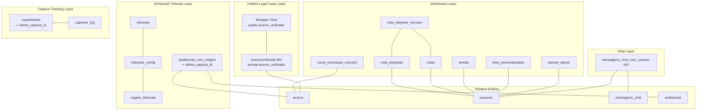
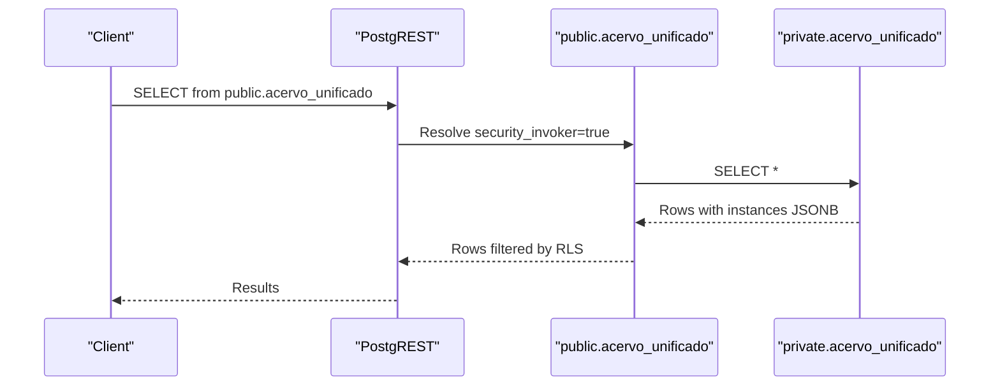
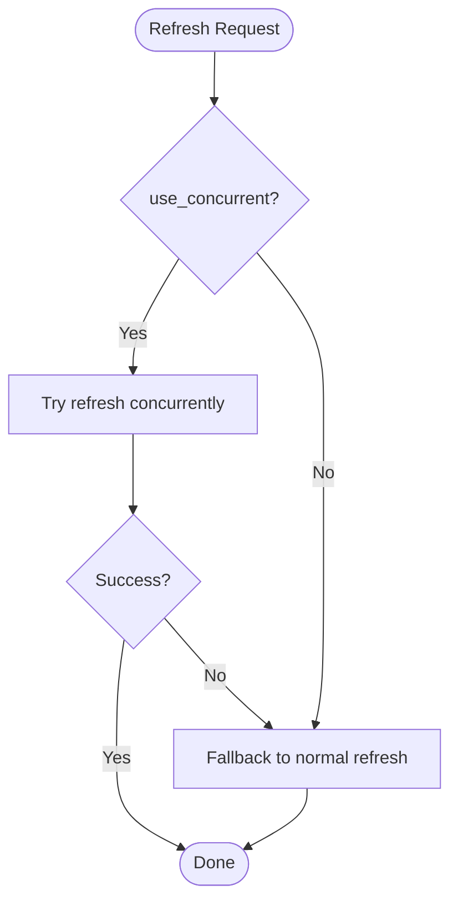
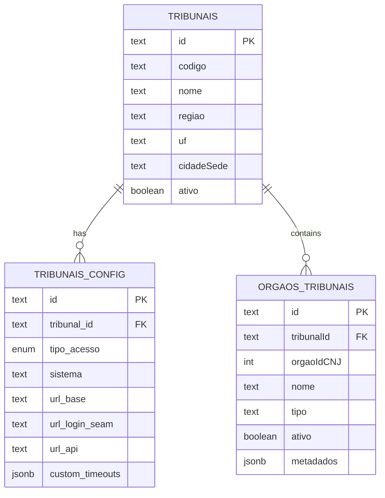
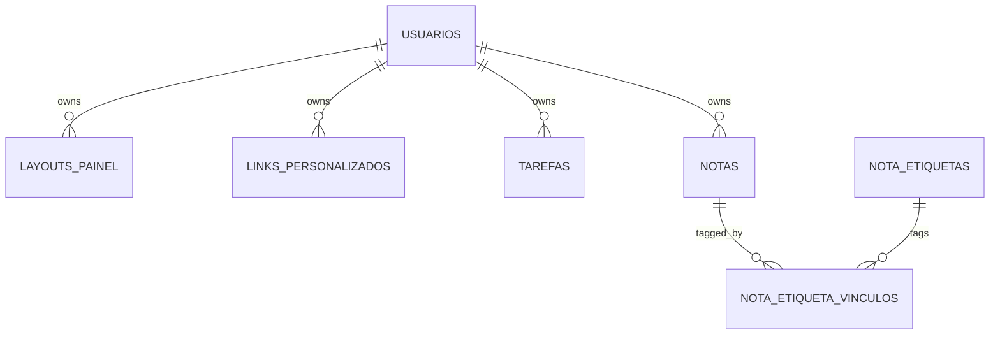
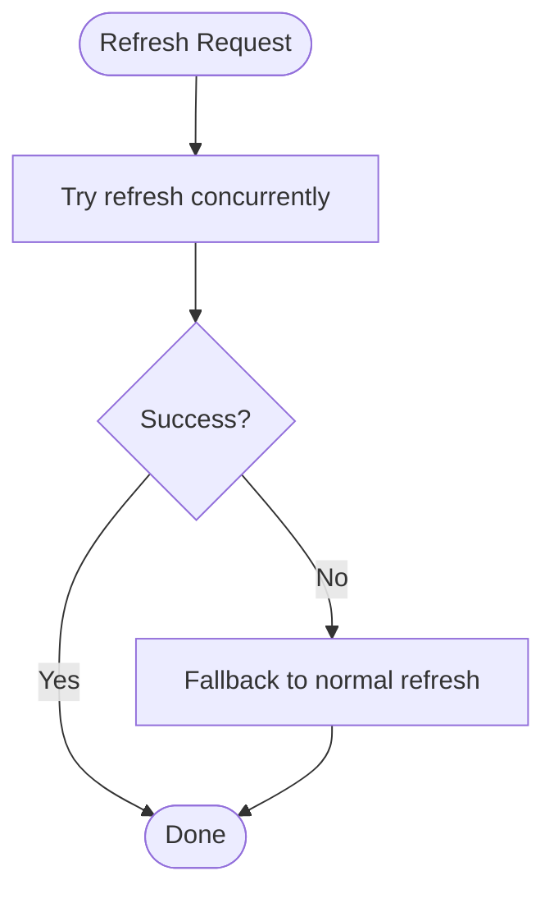
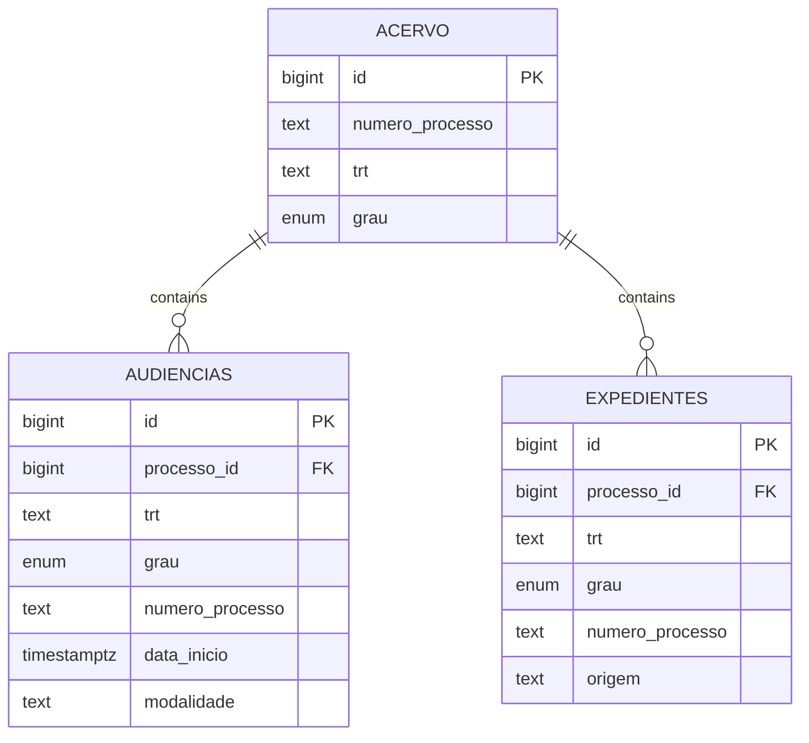
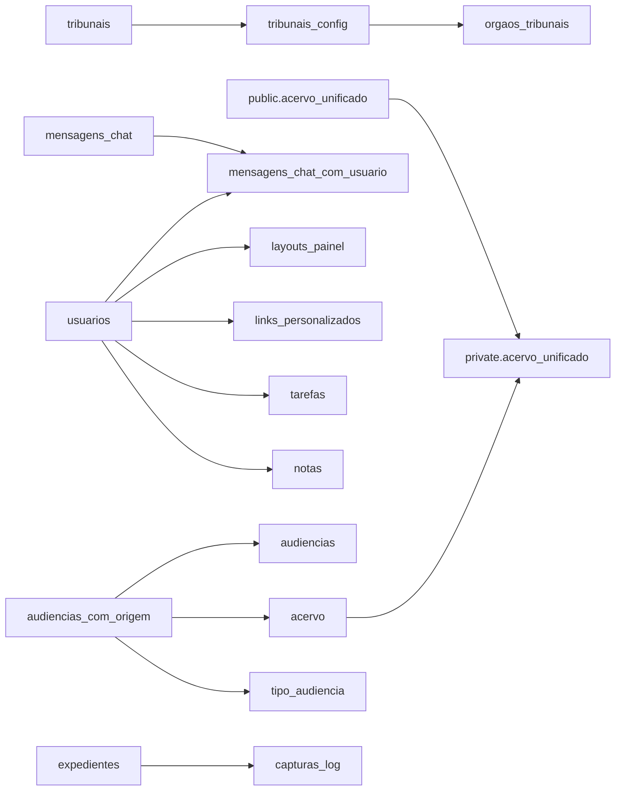

# Database Views

<cite>
**Referenced Files in This Document**
- [05_acervo_unificado_view.sql](file://supabase/schemas/05_acervo_unificado_view.sql)
- [20251122185339_create_acervo_unificado_view.sql](file://supabase/migrations/20251122185339_create_acervo_unificado_view.sql)
- [20260110000000_create_mensagens_chat_materialized_view.sql](file://supabase/migrations/20260110000000_create_mensagens_chat_materialized_view.sql)
- [23_dashboard.sql](file://supabase/schemas/23_dashboard.sql)
- [13_tribunais.sql](file://supabase/schemas/13_tribunais.sql)
- [20251122000002_rename_tribunal_config_to_snake_case.sql](file://supabase/migrations/20251122000002_rename_tribunal_config_to_snake_case.sql)
- [07_audiencias.sql](file://supabase/schemas/07_audiencias.sql)
- [06_expedientes.sql](file://supabase/schemas/06_expedientes.sql)
- [20260413171021_add_comunica_cnj_views.sql](file://supabase/migrations/20260413171021_add_comunica_cnj_views.sql)
- [20260213120002_create_audiencias_com_origem_view.sql](file://supabase/migrations/20260213120002_create_audiencias_com_origem_view.sql)
- [20260427130000_add_ultima_captura_id_to_audiencias_com_origem.sql](file://supabase/migrations/20260427130000_add_ultima_captura_id_to_audiencias_com_origem.sql)
- [20260427090510_add_ultima_captura_id_to_expedientes.sql](file://supabase/migrations/20260427090510_add_ultima_captura_id_to_expedientes.sql)
</cite>

## Update Summary
**Changes Made**
- Enhanced audiencias_com_origem view with new ultima_captura_id column for improved data tracking
- Updated tribunal-related views with improved data sourcing from first-degree courts for second-degree audiências
- Added comprehensive capture tracking capabilities through the new column
- Improved audit trail and data provenance for captured legal proceedings

## Table of Contents
1. [Introduction](#introduction)
2. [Project Structure](#project-structure)
3. [Core Components](#core-components)
4. [Architecture Overview](#architecture-overview)
5. [Detailed Component Analysis](#detailed-component-analysis)
6. [Dependency Analysis](#dependency-analysis)
7. [Performance Considerations](#performance-considerations)
8. [Troubleshooting Guide](#troubleshooting-guide)
9. [Conclusion](#conclusion)

## Introduction
This document describes the ZattarOS analytical and unified data access layers focused on database views. It covers:
- The AcervoUnificado materialized view that consolidates legal case instances into a single unified record per process, including historical instances and active degrees.
- Tribunal-related schemas and enums that support capture configurations and tribunal access types.
- Dashboard-related tables and analytics functions for reporting and user customization.
- The Materialized View for chat messages optimized for real-time dashboards.
- Enhanced audiencias_com_origem view with improved data sourcing from first-degree courts for second-degree audiências and new capture tracking capabilities.
- Creation syntax, refresh strategies, maintenance procedures, and troubleshooting guidance.

## Project Structure
The views and supporting schemas are implemented in Supabase migrations and schema files. Key locations:
- Unified legal case view: [05_acervo_unificado_view.sql](file://supabase/schemas/05_acervo_unificado_view.sql) and [20251122185339_create_acervo_unificado_view.sql](file://supabase/migrations/20251122185339_create_acervo_unificado_view.sql)
- Chat messages view: [20260110000000_create_mensagens_chat_materialized_view.sql](file://supabase/migrations/20260110000000_create_mensagens_chat_materialized_view.sql)
- Dashboard tables and analytics: [23_dashboard.sql](file://supabase/schemas/23_dashboard.sql)
- Tribunal schemas and enums: [13_tribunais.sql](file://supabase/schemas/13_tribunais.sql) and [20251122000002_rename_tribunal_config_to_snake_case.sql](file://supabase/migrations/20251122000002_rename_tribunal_config_to_snake_case.sql)
- Tribunal-related entities (audiencias, expedientes): [07_audiencias.sql](file://supabase/schemas/07_audiencias.sql), [06_expedientes.sql](file://supabase/schemas/06_expedientes.sql)
- Comunica CNJ views: [20260413171021_add_comunica_cnj_views.sql](file://supabase/migrations/20260413171021_add_comunica_cnj_views.sql)
- Enhanced audiencias_com_origem view: [20260213120002_create_audiencias_com_origem_view.sql](file://supabase/migrations/20260213120002_create_audiencias_com_origem_view.sql) and [20260427130000_add_ultima_captura_id_to_audiencias_com_origem.sql](file://supabase/migrations/20260427130000_add_ultima_captura_id_to_audiencias_com_origem.sql)
- Capture tracking enhancements: [20260427090510_add_ultima_captura_id_to_expedientes.sql](file://supabase/migrations/20260427090510_add_ultima_captura_id_to_expedientes.sql)



**Diagram sources**
- [05_acervo_unificado_view.sql:44-151](file://supabase/schemas/05_acervo_unificado_view.sql#L44-L151)
- [20251122185339_create_acervo_unificado_view.sql:7-114](file://supabase/migrations/20251122185339_create_acervo_unificado_view.sql#L7-L114)
- [20260110000000_create_mensagens_chat_materialized_view.sql:4-22](file://supabase/migrations/20260110000000_create_mensagens_chat_materialized_view.sql#L4-L22)
- [23_dashboard.sql:6-201](file://supabase/schemas/23_dashboard.sql#L6-L201)
- [13_tribunais.sql:6-94](file://supabase/schemas/13_tribunais.sql#L6-L94)
- [20251122000002_rename_tribunal_config_to_snake_case.sql:8-106](file://supabase/migrations/20251122000002_rename_tribunal_config_to_snake_case.sql#L8-L106)
- [07_audiencias.sql:4-46](file://supabase/schemas/07_audiencias.sql#L4-L46)
- [06_expedientes.sql:6-60](file://supabase/schemas/06_expedientes.sql#L6-L60)
- [20260213120002_create_audiencias_com_origem_view.sql:13-77](file://supabase/migrations/20260213120002_create_audiencias_com_origem_view.sql#L13-L77)
- [20260427130000_add_ultima_captura_id_to_audiencias_com_origem.sql:9-77](file://supabase/migrations/20260427130000_add_ultima_captura_id_to_audiencias_com_origem.sql#L9-L77)
- [20260427090510_add_ultima_captura_id_to_expedientes.sql:4-14](file://supabase/migrations/20260427090510_add_ultima_captura_id_to_expedientes.sql#L4-L14)

**Section sources**
- [05_acervo_unificado_view.sql:1-247](file://supabase/schemas/05_acervo_unificado_view.sql#L1-L247)
- [20251122185339_create_acervo_unificado_view.sql:1-177](file://supabase/migrations/20251122185339_create_acervo_unificado_view.sql#L1-L177)
- [20260110000000_create_mensagens_chat_materialized_view.sql:1-59](file://supabase/migrations/20260110000000_create_mensagens_chat_materialized_view.sql#L1-L59)
- [23_dashboard.sql:1-284](file://supabase/schemas/23_dashboard.sql#L1-L284)
- [13_tribunais.sql:1-94](file://supabase/schemas/13_tribunais.sql#L1-L94)
- [20251122000002_rename_tribunal_config_to_snake_case.sql:1-106](file://supabase/migrations/20251122000002_rename_tribunal_config_to_snake_case.sql#L1-L106)
- [07_audiencias.sql:1-159](file://supabase/schemas/07_audiencias.sql#L1-L159)
- [06_expedientes.sql:1-249](file://supabase/schemas/06_expedientes.sql#L1-L249)
- [20260413171021_add_comunica_cnj_views.sql:1-36](file://supabase/migrations/20260413171021_add_comunica_cnj_views.sql#L1-L36)
- [20260213120002_create_audiencias_com_origem_view.sql:1-89](file://supabase/migrations/20260213120002_create_audiencias_com_origem_view.sql#L1-L89)
- [20260427130000_add_ultima_captura_id_to_audiencias_com_origem.sql:1-90](file://supabase/migrations/20260427130000_add_ultima_captura_id_to_audiencias_com_origem.sql#L1-L90)
- [20260427090510_add_ultima_captura_id_to_expedientes.sql:1-14](file://supabase/migrations/20260427090510_add_ultima_captura_id_to_expedientes.sql#L1-L14)

## Core Components
- AcervoUnificado Materialized View
  - Purpose: Consolidates multiple instances of the same process into a single record, marking the "current degree" by latest autuation date and updated timestamp, and aggregates all instances as JSONB for downstream UIs.
  - Location: Private schema MV with a public security_invoker wrapper.
  - Key columns: Current instance fields, current degree, active degrees array, and instances JSONB with an is_grau_atual flag.
  - Indexes: Unique and selective B-tree indexes to support fast refresh and queries.
  - Refresh: Function supports concurrent refresh with fallback; optional auto-refresh trigger exists but is commented out by default.
  - Security: MV in private schema; wrapper view preserves RLS via security_invoker.

- Enhanced Tribunal-Related Views and Data Sourcing
  - audiencias_com_origem: Now includes ultima_captura_id column for improved capture tracking and enhanced data sourcing from first-degree courts for second-degree audiências.
  - Improved data provenance: When audiência is of second degree, the view now properly sources party information from the first-degree process, ensuring "source of truth" remains the first-degree court data.
  - Capture tracking: New ultima_captura_id column enables filtering and auditing of audiências by capture session.

- Tribunal Schemas and Enums
  - Tables: tribunais, tribunais_config, orgaos_tribunais.
  - Enum: tipo_acesso_tribunal with values for access modes (first degree, second degree, unified, single).
  - Purpose: Centralize tribunal access configuration and tribunal organ definitions.

- Dashboard Tables and Analytics
  - Tables: layouts_painel, links_personalizados, tarefas, notas, nota_etiquetas, nota_etiqueta_vinculos.
  - Functions: count_processos_unicos to compute distinct process counts with optional filters.
  - Policies: Row-level security policies per table for authenticated users and service roles.

- Chat Messages Materialized View
  - Purpose: Pre-join messages with user details to avoid extra queries after Realtime events.
  - Refresh: Concurrent refresh function with fallback; initial refresh executed after creation.
  - Indexes: Unique index for concurrent refresh and composite index for filtering by room and time.

- Enhanced Capture Tracking System
  - expedientes: Now includes ultima_captura_id column with foreign key reference to capturas_log for complete audit trail.
  - Index optimization: Dedicated index on ultima_captura_id for efficient filtering and reporting.
  - Data integrity: Proper foreign key constraints ensure referential integrity with capture logs.

**Section sources**
- [05_acervo_unificado_view.sql:44-151](file://supabase/schemas/05_acervo_unificado_view.sql#L44-L151)
- [20251122185339_create_acervo_unificado_view.sql:7-114](file://supabase/migrations/20251122185339_create_acervo_unificado_view.sql#L7-L114)
- [20260110000000_create_mensagens_chat_materialized_view.sql:4-22](file://supabase/migrations/20260110000000_create_mensagens_chat_materialized_view.sql#L4-L22)
- [23_dashboard.sql:6-201](file://supabase/schemas/23_dashboard.sql#L6-L201)
- [13_tribunais.sql:6-94](file://supabase/schemas/13_tribunais.sql#L6-L94)
- [20251122000002_rename_tribunal_config_to_snake_case.sql:8-106](file://supabase/migrations/20251122000002_rename_tribunal_config_to_snake_case.sql#L8-L106)
- [20260213120002_create_audiencias_com_origem_view.sql:13-77](file://supabase/migrations/20260213120002_create_audiencias_com_origem_view.sql#L13-L77)
- [20260427130000_add_ultima_captura_id_to_audiencias_com_origem.sql:9-77](file://supabase/migrations/20260427130000_add_ultima_captura_id_to_audiencias_com_origem.sql#L9-L77)
- [20260427090510_add_ultima_captura_id_to_expedientes.sql:4-14](file://supabase/migrations/20260427090510_add_ultima_captura_id_to_expedientes.sql#L4-L14)

## Architecture Overview
The unified access layer centers around AcervoUnificado, which:
- Aggregates instances grouped by process number and lawyer.
- Identifies the current degree by latest autuation date and updated timestamp.
- Stores all instances as JSONB with an is_grau_atual marker.
- Exposes a public wrapper view with security_invoker to preserve RLS evaluation under the calling user's permissions.

The enhanced audiencias_com_origem view now provides improved data sourcing and capture tracking capabilities, ensuring data integrity and auditability across the tribunal system.



**Diagram sources**
- [05_acervo_unificado_view.sql:233-235](file://supabase/schemas/05_acervo_unificado_view.sql#L233-L235)
- [05_acervo_unificado_view.sql:44-151](file://supabase/schemas/05_acervo_unificado_view.sql#L44-L151)

**Section sources**
- [05_acervo_unificado_view.sql:233-235](file://supabase/schemas/05_acervo_unificado_view.sql#L233-L235)
- [05_acervo_unificado_view.sql:44-151](file://supabase/schemas/05_acervo_unificado_view.sql#L44-L151)

## Detailed Component Analysis

### AcervoUnificado Materialized View
- Aggregation logic:
  - Instances grouped by process number and lawyer ID.
  - Current degree identified via window function ordering by autuation date and updated timestamp.
  - All instances aggregated as JSONB and later ordered by autuation date and updated timestamp; each instance marked with is_grau_atual.
  - Active degrees array built per process and lawyer.
- Indexes:
  - Unique index on (id, numero_processo, advogado_id) to enable concurrent refresh.
  - Additional selective indexes on numero_processo, advogado_id, trt, grau_atual, data_autuacao, responsavel_id, origem, and compound keys.
- Refresh strategy:
  - Function refresh_acervo_unificado supports concurrent refresh with fallback.
  - Optional auto-refresh trigger exists but is disabled by default; production should prefer scheduled refresh.
- Security:
  - MV in private schema; public wrapper uses security_invoker=true to enforce RLS under the caller's session.



**Diagram sources**
- [05_acervo_unificado_view.sql:173-194](file://supabase/schemas/05_acervo_unificado_view.sql#L173-L194)

**Section sources**
- [05_acervo_unificado_view.sql:44-151](file://supabase/schemas/05_acervo_unificado_view.sql#L44-L151)
- [05_acervo_unificado_view.sql:155-194](file://supabase/schemas/05_acervo_unificado_view.sql#L155-L194)
- [05_acervo_unificado_view.sql:233-235](file://supabase/schemas/05_acervo_unificado_view.sql#L233-L235)

### Enhanced Tribunal-Related Views and Data Sourcing
- audiencias_com_origem: Enhanced with new ultima_captura_id column and improved data sourcing logic
  - **New ultima_captura_id column**: Enables filtering and auditing of audiências by capture session, allowing users to track which capture operation created or updated each audiência.
  - **Improved first-degree data sourcing**: When audiência is of second degree, the view now properly sources party information from the first-degree process, ensuring "source of truth" remains the first-degree court data.
  - **Enhanced comment documentation**: Updated to reflect new capture tracking capabilities and improved data provenance.
  - **Security improvements**: Maintains proper RLS policies while adding new tracking capabilities.

- Enhanced capture tracking system:
  - **expedientes table**: Now includes ultima_captura_id column with foreign key reference to capturas_log for complete audit trail.
  - **Index optimization**: Dedicated index on ultima_captura_id for efficient filtering and reporting.
  - **Data integrity**: Proper foreign key constraints ensure referential integrity with capture logs.

```mermaid
erDiagram
AUDIENCIAS_COM_ORIGEM {
bigint id PK
bigint id_pje
bigint advogado_id FK
bigint processo_id FK
text trt
enum grau
text numero_processo
timestamptz data_inicio
timestamptz data_fim
bigint ultima_captura_id FK
}
DADOS_PRIMEIRO_GRAU {
text numero_processo PK
text trt_origem
text nome_parte_autora_origem
text nome_parte_re_origem
text orgao_julgador_origem
}
CAPTURAS_LOG {
bigint id PK
enum tipo_captura
timestamptz iniciado_em
timestamptz concluido_em
enum status
}
AUDIENCIAS ||--|| DADOS_PRIMEIRO_GRAU : "sources from"
AUDIENCIAS ||--o|-- CAPTURAS_LOG : "ultima_captura_id"
```

**Diagram sources**
- [20260213120002_create_audiencias_com_origem_view.sql:13-77](file://supabase/migrations/20260213120002_create_audiencias_com_origem_view.sql#L13-L77)
- [20260427130000_add_ultima_captura_id_to_audiencias_com_origem.sql:9-77](file://supabase/migrations/20260427130000_add_ultima_captura_id_to_audiencias_com_origem.sql#L9-L77)
- [20260427090510_add_ultima_captura_id_to_expedientes.sql:4-14](file://supabase/migrations/20260427090510_add_ultima_captura_id_to_expedientes.sql#L4-L14)

**Section sources**
- [20260213120002_create_audiencias_com_origem_view.sql:13-77](file://supabase/migrations/20260213120002_create_audiencias_com_origem_view.sql#L13-L77)
- [20260427130000_add_ultima_captura_id_to_audiencias_com_origem.sql:9-77](file://supabase/migrations/20260427130000_add_ultima_captura_id_to_audiencias_com_origem.sql#L9-L77)
- [20260427090510_add_ultima_captura_id_to_expedientes.sql:4-14](file://supabase/migrations/20260427090510_add_ultima_captura_id_to_expedientes.sql#L4-L14)

### Tribunal-Related Views and Aggregation Logic
- Enums and access types:
  - New enum tipo_acesso_tribunal defines access modes: first degree, second degree, unified, single.
  - Migration renames old table/columns to snake_case and adds tipo_acesso column with NOT NULL constraint.
- Schemas:
  - tribunais: tribunal catalog with region, state, city, and activity flag.
  - tribunais_config: access URLs, login SSO endpoints, API base, and custom timeouts per tribunal and access mode.
  - orgaos_tribunais: tribunal organs (varas, turmas, etc.) with CNJ identifiers and metadata.



**Diagram sources**
- [13_tribunais.sql:6-94](file://supabase/schemas/13_tribunais.sql#L6-L94)
- [20251122000002_rename_tribunal_config_to_snake_case.sql:8-106](file://supabase/migrations/20251122000002_rename_tribunal_config_to_snake_case.sql#L8-L106)

**Section sources**
- [13_tribunais.sql:6-94](file://supabase/schemas/13_tribunais.sql#L6-L94)
- [20251122000002_rename_tribunal_config_to_snake_case.sql:8-106](file://supabase/migrations/20251122000002_rename_tribunal_config_to_snake_case.sql#L8-L106)

### Dashboard Views for Reporting and Analytics
- Tables:
  - layouts_painel: user dashboard layout configuration stored as JSONB.
  - links_personalizados: user customizable links with ordering and icons.
  - tarefas: task management aligned with TanStack Table contract.
  - notas and nota_etiquetas with junction table for tagging notes.
- Analytics:
  - count_processos_unicos: counts distinct processes with optional filters by origin, responsible user, and time range.



**Diagram sources**
- [23_dashboard.sql:6-201](file://supabase/schemas/23_dashboard.sql#L6-L201)

**Section sources**
- [23_dashboard.sql:6-201](file://supabase/schemas/23_dashboard.sql#L6-L201)

### Materialized View for Chat Messages
- Purpose: Pre-join chat messages with user profile fields to reduce downstream queries after Realtime events.
- Columns: Message fields plus user display fields (full name, display name, corporate email, avatar).
- Indexes: Unique index for concurrent refresh and composite index for room and creation time.
- Refresh: Function refresh_mensagens_chat_com_usuario supports concurrent refresh with fallback; initial refresh executed post-creation.



**Diagram sources**
- [20260110000000_create_mensagens_chat_materialized_view.sql:37-49](file://supabase/migrations/20260110000000_create_mensagens_chat_materialized_view.sql#L37-L49)

**Section sources**
- [20260110000000_create_mensagens_chat_materialized_view.sql:4-59](file://supabase/migrations/20260110000000_create_mensagens_chat_materialized_view.sql#L4-L59)

### Tribunal-Related Entities Supporting Views
- audiencias: captures scheduled hearings with modalities, rooms, and status, with automatic modalitiy population and RLS.
- expedientes: consolidated procedural documents across capture, manual, and Comunica CNJ origins, with RLS and triggers to synchronize process references.



**Diagram sources**
- [07_audiencias.sql:4-46](file://supabase/schemas/07_audiencias.sql#L4-L46)
- [06_expedientes.sql:6-60](file://supabase/schemas/06_expedientes.sql#L6-L60)

**Section sources**
- [07_audiencias.sql:4-46](file://supabase/schemas/07_audiencias.sql#L4-L46)
- [06_expedientes.sql:6-60](file://supabase/schemas/06_expedientes.sql#L6-L60)

## Dependency Analysis
- AcervoUnificado MV depends on acervo and uses window functions and JSONB aggregation.
- Chat MV depends on mensagens_chat and usuarios; requires unique index for concurrent refresh.
- Dashboard tables depend on usuarios; each has RLS policies.
- Tribunal schemas depend on each other and are referenced by capture and integration logic.
- Enhanced audiencias_com_origem view depends on audiencias, acervo, and tipo_audiencia tables with improved data sourcing.
- Capture tracking system depends on capturas_log table for audit trail and session management.



**Diagram sources**
- [05_acervo_unificado_view.sql:44-151](file://supabase/schemas/05_acervo_unificado_view.sql#L44-L151)
- [20260110000000_create_mensagens_chat_materialized_view.sql:4-22](file://supabase/migrations/20260110000000_create_mensagens_chat_materialized_view.sql#L4-L22)
- [23_dashboard.sql:6-201](file://supabase/schemas/23_dashboard.sql#L6-L201)
- [13_tribunais.sql:6-94](file://supabase/schemas/13_tribunais.sql#L6-L94)
- [20260213120002_create_audiencias_com_origem_view.sql:13-77](file://supabase/migrations/20260213120002_create_audiencias_com_origem_view.sql#L13-L77)
- [20260427130000_add_ultima_captura_id_to_audiencias_com_origem.sql:9-77](file://supabase/migrations/20260427130000_add_ultima_captura_id_to_audiencias_com_origem.sql#L9-L77)
- [20260427090510_add_ultima_captura_id_to_expedientes.sql:4-14](file://supabase/migrations/20260427090510_add_ultima_captura_id_to_expedientes.sql#L4-L14)

**Section sources**
- [05_acervo_unificado_view.sql:44-151](file://supabase/schemas/05_acervo_unificado_view.sql#L44-L151)
- [20260110000000_create_mensagens_chat_materialized_view.sql:4-22](file://supabase/migrations/20260110000000_create_mensagens_chat_materialized_view.sql#L4-L22)
- [23_dashboard.sql:6-201](file://supabase/schemas/23_dashboard.sql#L6-L201)
- [13_tribunais.sql:6-94](file://supabase/schemas/13_tribunais.sql#L6-L94)
- [20260213120002_create_audiencias_com_origem_view.sql:13-77](file://supabase/migrations/20260213120002_create_audiencias_com_origem_view.sql#L13-L77)
- [20260427130000_add_ultima_captura_id_to_audiencias_com_origem.sql:9-77](file://supabase/migrations/20260427130000_add_ultima_captura_id_to_audiencias_com_origem.sql#L9-L77)
- [20260427090510_add_ultima_captura_id_to_expedientes.sql:4-14](file://supabase/migrations/20260427090510_add_ultima_captura_id_to_expedientes.sql#L4-L14)

## Performance Considerations
- Use concurrent refresh for materialized views when a unique index exists; otherwise fall back to normal refresh.
- Create targeted indexes on columns frequently used in filters and joins (e.g., numero_processo, advogado_id, trt, grau_atual, created_at).
- Prefer pre-joining related entities (as in the chat MV) to avoid repeated joins during hot-path reads.
- Keep JSONB fields selective; avoid GIN indexing unless necessary and monitor storage overhead.
- Schedule refreshes during off-peak hours to minimize impact on concurrent workloads.
- Monitor vacuum and autovacuum settings for tables backing MVs to maintain query performance.
- **Enhanced capture tracking**: The new ultima_captura_id column requires dedicated indexes for optimal performance in filtering and reporting scenarios.
- **Improved data sourcing**: The enhanced audiencias_com_origem view with first-degree data sourcing may require additional indexing on numero_processo for optimal join performance.

## Troubleshooting Guide
- Materialized view refresh fails:
  - Ensure a unique index exists for concurrent refresh; if missing or incompatible, the function falls back to normal refresh.
  - Verify permissions on the MV owner and grants to authenticated/service roles.
- Auto-refresh trigger causing performance issues:
  - The trigger exists but is commented out by default; prefer scheduled refresh jobs instead of statement-level triggers on high-frequency tables.
- JSONB aggregation appears unordered:
  - Instances are ordered by autuation date and updated timestamp during aggregation; downstream sorting should align with this order.
- Dashboard analytics discrepancies:
  - Use count_processos_unicos with explicit filters to validate counts; confirm RLS policies are not excluding records unintentionally.
- Tribunal access configuration errors:
  - Confirm tipo_acesso_tribunal enum values match expected access modes; verify foreign keys and indices on tribunais_config.
- **Enhanced audiencias_com_origem view issues**:
  - If encountering "column does not exist" errors for ultima_captura_id, ensure the migration has been applied and the view has been recreated.
  - Verify that the first-degree data sourcing logic is working correctly by checking the dados_primeiro_grau CTE results.
  - Confirm that the foreign key relationship with capturas_log is properly established.
- **Capture tracking problems**:
  - If expedientes ultima_captura_id filtering is slow, verify that the dedicated index is properly created and maintained.
  - Check for orphaned records where ultima_captura_id references non-existent capture sessions.
  - Ensure proper cleanup of expired capture sessions to maintain data integrity.

**Section sources**
- [05_acervo_unificado_view.sql:173-194](file://supabase/schemas/05_acervo_unificado_view.sql#L173-L194)
- [20260110000000_create_mensagens_chat_materialized_view.sql:37-49](file://supabase/migrations/20260110000000_create_mensagens_chat_materialized_view.sql#L37-L49)
- [23_dashboard.sql:255-281](file://supabase/schemas/23_dashboard.sql#L255-L281)
- [20251122000002_rename_tribunal_config_to_snake_case.sql:8-106](file://supabase/migrations/20251122000002_rename_tribunal_config_to_snake_case.sql#L8-L106)
- [20260427130000_add_ultima_captura_id_to_audiencias_com_origem.sql:1-90](file://supabase/migrations/20260427130000_add_ultima_captura_id_to_audiencias_com_origem.sql#L1-L90)
- [20260427090510_add_ultima_captura_id_to_expedientes.sql:1-14](file://supabase/migrations/20260427090510_add_ultima_captura_id_to_expedientes.sql#L1-L14)

## Conclusion
ZattarOS employs materialized views and carefully designed schemas to unify legal case data, optimize chat analytics, and support dashboard customization. The AcervoUnificado MV centralizes process instances with robust refresh strategies and security enforcement. Tribunal schemas standardize access configurations, while dashboard tables and analytics functions provide extensible reporting capabilities.

**Key enhancements in this update**:
- **Enhanced audiencias_com_origem view**: Now includes ultima_captura_id column for improved capture tracking and enhanced data sourcing from first-degree courts for second-degree audiências, ensuring data integrity and auditability.
- **Comprehensive capture tracking system**: Both audiências and expedientes now include ultima_captura_id columns with proper foreign key relationships and dedicated indexes for optimal performance.
- **Improved data provenance**: The system now guarantees that party information for second-degree audiências comes from the authoritative first-degree process data.

These improvements strengthen the analytical foundation of the ZattarOS platform while maintaining the robust security and performance characteristics essential for legal case management systems.