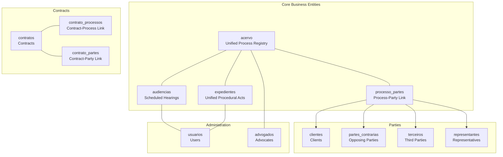
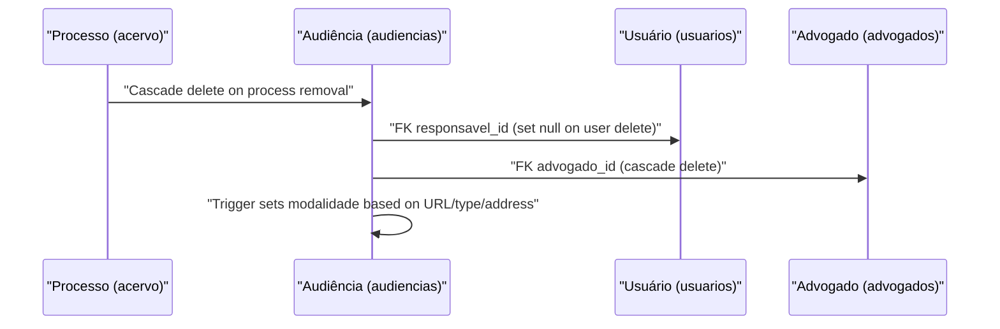
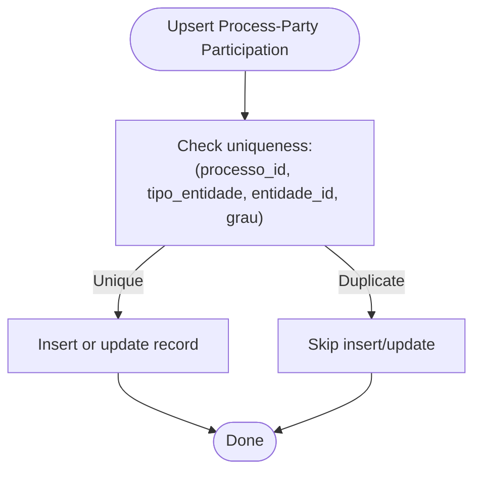
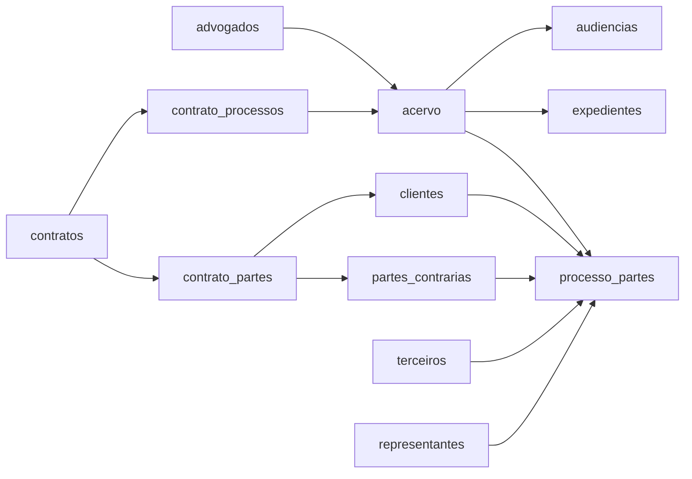

# Entity Relationships

<cite>
**Referenced Files in This Document**
- [02_advogados.sql](file://supabase/schemas/02_advogados.sql)
- [04_acervo.sql](file://supabase/schemas/04_acervo.sql)
- [06_expedientes.sql](file://supabase/schemas/06_expedientes.sql)
- [07_audiencias.sql](file://supabase/schemas/07_audiencias.sql)
- [08_usuarios.sql](file://supabase/schemas/08_usuarios.sql)
- [09_clientes.sql](file://supabase/schemas/09_clientes.sql)
- [10_partes_contrarias.sql](file://supabase/schemas/10_partes_contrarias.sql)
- [11_contratos.sql](file://supabase/schemas/11_contratos.sql)
- [12_contrato_processos.sql](file://supabase/schemas/12_contrato_processos.sql)
- [16_terceiros.sql](file://supabase/schemas/16_terceiros.sql)
- [17_processo_partes.sql](file://supabase/schemas/17_processo_partes.sql)
- [18_representantes.sql](file://supabase/schemas/18_representantes.sql)
- [42_contrato_partes.sql](file://supabase/schemas/42_contrato_partes.sql)
- [20251127000000_create_processo_partes.sql](file://supabase/migrations/20251127000000_create_processo_partes.sql)
- [20251125000004_fix_processo_partes_constraint.sql](file://supabase/migrations/20251125000004_fix_processo_partes_constraint.sql)
</cite>

## Table of Contents
1. [Introduction](#introduction)
2. [Project Structure](#project-structure)
3. [Core Components](#core-components)
4. [Architecture Overview](#architecture-overview)
5. [Detailed Component Analysis](#detailed-component-analysis)
6. [Dependency Analysis](#dependency-analysis)
7. [Performance Considerations](#performance-considerations)
8. [Troubleshooting Guide](#troubleshooting-guide)
9. [Conclusion](#conclusion)

## Introduction
This document describes the entity relationship model for ZattarOS core business entities. It focuses on Processo (legal case) as the central hub connecting unified processes, movements, and parties. It also documents relationships among Advocates, Clients, Opposing Parties, Representatives, and Third Parties, as well as contractual relationships via Contracts, Contract-Processes, and Contract-Parties. Finally, it explains the hearing scheduling system linking to Users and Unified Hearing records, including foreign keys, cascade behaviors, and referential integrity constraints.

## Project Structure
The entity model is defined in the Supabase schema SQL files and migrations. The most relevant tables for this document are:
- Process-related: acervo (unified process registry), expedientes (unified procedural acts), audiencias (scheduled hearings)
- Party-related: processo_partes (N:N between processes and parties), clientes, partes_contrarias, terceiros, representantes
- Contractual: contratos, contrato_processos, contrato_partes
- Administrative: usuarios, advogados

**Diagram sources**
- [04_acervo.sql:4-32](file://supabase/schemas/04_acervo.sql#L4-L32)
- [06_expedientes.sql:6-60](file://supabase/schemas/06_expedientes.sql#L6-L60)
- [07_audiencias.sql:4-46](file://supabase/schemas/07_audiencias.sql#L4-L46)
- [17_processo_partes.sql:6-69](file://supabase/schemas/17_processo_partes.sql#L6-L69)
- [09_clientes.sql:8-86](file://supabase/schemas/09_clientes.sql#L8-L86)
- [10_partes_contrarias.sql:8-86](file://supabase/schemas/10_partes_contrarias.sql#L8-L86)
- [16_terceiros.sql:6-94](file://supabase/schemas/16_terceiros.sql#L6-L94)
- [18_representantes.sql:7-37](file://supabase/schemas/18_representantes.sql#L7-L37)
- [11_contratos.sql:4-27](file://supabase/schemas/11_contratos.sql#L4-L27)
- [12_contrato_processos.sql:4-12](file://supabase/schemas/12_contrato_processos.sql#L4-L12)
- [42_contrato_partes.sql:3-14](file://supabase/schemas/42_contrato_partes.sql#L3-L14)
- [08_usuarios.sql:6-41](file://supabase/schemas/08_usuarios.sql#L6-L41)
- [02_advogados.sql:3-11](file://supabase/schemas/02_advogados.sql#L3-L11)

**Section sources**
- [04_acervo.sql:1-77](file://supabase/schemas/04_acervo.sql#L1-L77)
- [06_expedientes.sql:1-249](file://supabase/schemas/06_expedientes.sql#L1-L249)
- [07_audiencias.sql:1-159](file://supabase/schemas/07_audiencias.sql#L1-L159)
- [17_processo_partes.sql:1-144](file://supabase/schemas/17_processo_partes.sql#L1-L144)
- [09_clientes.sql:1-139](file://supabase/schemas/09_clientes.sql#L1-L139)
- [10_partes_contrarias.sql:1-139](file://supabase/schemas/10_partes_contrarias.sql#L1-L139)
- [16_terceiros.sql:1-122](file://supabase/schemas/16_terceiros.sql#L1-L122)
- [18_representantes.sql:1-63](file://supabase/schemas/18_representantes.sql#L1-L63)
- [11_contratos.sql:1-61](file://supabase/schemas/11_contratos.sql#L1-L61)
- [12_contrato_processos.sql:1-29](file://supabase/schemas/12_contrato_processos.sql#L1-L29)
- [42_contrato_partes.sql:1-21](file://supabase/schemas/42_contrato_partes.sql#L1-L21)
- [08_usuarios.sql:1-100](file://supabase/schemas/08_usuarios.sql#L1-L100)
- [02_advogados.sql:1-45](file://supabase/schemas/02_advogados.sql#L1-L45)

## Core Components
- Processo (acervo): Central unified legal case registry. It stores process metadata, parties’ counts, and links to hearings and unified acts. Cascading deletes on process deletion propagate to related hearings and acts.
- Audiência (audiencias): Scheduled hearings associated with a specific process and responsible user. It references the unified process and optionally the responsible user.
- Expediente (expedientes): Unified procedural acts derived from PJE captures, manual entries, or CNJ communications. It references the unified process and maintains origin and status.
- ProcessoPartes (processo_partes): Polymorphic N:N bridge between processes and parties. It supports clients, opposing parties, third parties, and representatives, with a unique constraint ensuring one participation per process-degree per entity type.
- Clientes, PartesContrarias, Terceiros, Representantes: Global party registries with deduplication by CPF/CNPJ. They connect to processes via processo_partes.
- Contratos, ContratoProcessos, ContratoPartes: Contract lifecycle and linkage to processes and parties. One contract can link to multiple processes and multiple parties.

**Section sources**
- [04_acervo.sql:4-32](file://supabase/schemas/04_acervo.sql#L4-L32)
- [07_audiencias.sql:4-46](file://supabase/schemas/07_audiencias.sql#L4-L46)
- [06_expedientes.sql:6-60](file://supabase/schemas/06_expedientes.sql#L6-L60)
- [17_processo_partes.sql:6-69](file://supabase/schemas/17_processo_partes.sql#L6-L69)
- [09_clientes.sql:8-86](file://supabase/schemas/09_clientes.sql#L8-L86)
- [10_partes_contrarias.sql:8-86](file://supabase/schemas/10_partes_contrarias.sql#L8-L86)
- [16_terceiros.sql:6-94](file://supabase/schemas/16_terceiros.sql#L6-L94)
- [18_representantes.sql:7-37](file://supabase/schemas/18_representantes.sql#L7-L37)
- [11_contratos.sql:4-27](file://supabase/schemas/11_contratos.sql#L4-L27)
- [12_contrato_processos.sql:4-12](file://supabase/schemas/12_contrato_processos.sql#L4-L12)
- [42_contrato_partes.sql:3-14](file://supabase/schemas/42_contrato_partes.sql#L3-L14)

## Architecture Overview
The Processo entity (acervo) is the center of gravity. All other entities connect to it either directly (audiencias, expedientes) or indirectly (processo_partes). Contracts are orthogonal but can link to processes and parties for billing and responsibility tracking.

```mermaid
erDiagram
ACERVO {
bigint id PK
bigint id_pje
bigint advogado_id FK
text origem
text trt
text grau
text numero_processo
bigint numero
text descricao_orgao_julgador
text classe_judicial
boolean segredo_justica
text codigo_status_processo
int prioridade_processual
text nome_parte_autora
int qtde_parte_autora
text nome_parte_re
int qtde_parte_re
timestamptz data_autuacao
boolean juizo_digital
timestamptz data_arquivamento
timestamptz data_proxima_audiencia
boolean tem_associacao
}
AUDIENCIAS {
bigint id PK
bigint id_pje
bigint advogado_id FK
bigint processo_id FK
bigint orgao_julgador_id
text trt
text grau
text numero_processo
timestamptz data_inicio
timestamptz data_fim
time hora_inicio
time hora_fim
text modalidade
text sala_audiencia_nome
bigint sala_audiencia_id
text status
text status_descricao
bigint tipo_audiencia_id
bigint classe_judicial_id
boolean designada
boolean em_andamento
boolean documento_ativo
text polo_ativo_nome
boolean polo_ativo_representa_varios
text polo_passivo_nome
boolean polo_passivo_representa_varios
text url_audiencia_virtual
jsonb endereco_presencial
text presenca_hibrida
bigint ata_audiencia_id
text url_ata_audiencia
boolean segredo_justica
boolean juizo_digital
bigint responsavel_id FK
text observacoes
jsonb dados_anteriores
}
EXPEDIENTES {
bigint id PK
bigint id_pje
bigint advogado_id FK
bigint processo_id FK
text trt
text grau
text numero_processo
text descricao_orgao_julgador
text classe_judicial
bigint numero
boolean segredo_justica
text codigo_status_processo
int prioridade_processual
text nome_parte_autora
int qtde_parte_autora
text nome_parte_re
int qtde_parte_re
timestamptz data_autuacao
boolean juizo_digital
timestamptz data_arquivamento
bigint id_documento
timestamptz data_ciencia_parte
timestamptz data_prazo_legal_parte
timestamptz data_criacao_expediente
boolean prazo_vencido
text sigla_orgao_julgador
jsonb dados_anteriores
bigint responsavel_id FK
timestamptz baixado_em
text protocolo_id
text justificativa_baixa
bigint tipo_expediente_id
text descricao_arquivos
text arquivo_nome
text arquivo_url
text arquivo_bucket
text arquivo_key
text observacoes
text origem
}
PROCESO_PARTES {
bigint id PK
bigint processo_id FK
text tipo_entidade
bigint entidade_id
bigint id_pje
bigint id_pessoa_pje
bigint id_tipo_parte
text tipo_parte
text polo
text trt
text grau
text numero_processo
boolean principal
int ordem
text status_pje
text situacao_pje
boolean autoridade
boolean endereco_desconhecido
jsonb dados_pje_completo
timestamptz ultima_atualizacao_pje
}
CLIENTES {
bigint id PK
text tipo_pessoa
text nome
text nome_social_fantasia
text cpf
text cnpj
text tipo_documento
jsonb emails
text status_pje
text situacao_pje
text login_pje
boolean autoridade
text ddd_celular
text numero_celular
text ddd_residencial
text numero_residencial
text ddd_comercial
text numero_comercial
text sexo
text nome_genitora
int naturalidade_id_pje
text naturalidade_municipio
int naturalidade_estado_id_pje
text naturalidade_estado_sigla
int uf_nascimento_id_pje
text uf_nascimento_sigla
text uf_nascimento_descricao
int pais_nascimento_id_pje
text pais_nascimento_codigo
text pais_nascimento_descricao
int escolaridade_codigo
int situacao_cpf_receita_id
text situacao_cpf_receita_descricao
boolean pode_usar_celular_mensagem
date data_abertura
date data_fim_atividade
boolean orgao_publico
text tipo_pessoa_codigo_pje
text tipo_pessoa_label_pje
text tipo_pessoa_validacao_receita
text ds_tipo_pessoa
int situacao_cnpj_receita_id
text situacao_cnpj_receita_descricao
text ramo_atividade
text cpf_responsavel
boolean oficial
text ds_prazo_expediente_automatico
int porte_codigo
text porte_descricao
timestamptz ultima_atualizacao_pje
bigint endereco_id
text observacoes
bigint created_by FK
jsonb dados_anteriores
boolean ativo
}
PARTES_CONTRARIAS {
bigint id PK
text tipo_pessoa
text nome
text nome_social_fantasia
text cpf
text cnpj
text tipo_documento
jsonb emails
text status_pje
text situacao_pje
text login_pje
boolean autoridade
text ddd_celular
text numero_celular
text ddd_residencial
text numero_residencial
text ddd_comercial
text numero_comercial
text sexo
text nome_genitora
int naturalidade_id_pje
text naturalidade_municipio
int naturalidade_estado_id_pje
text naturalidade_estado_sigla
int uf_nascimento_id_pje
text uf_nascimento_sigla
text uf_nascimento_descricao
int pais_nascimento_id_pje
text pais_nascimento_codigo
text pais_nascimento_descricao
int escolaridade_codigo
int situacao_cpf_receita_id
text situacao_cpf_receita_descricao
boolean pode_usar_celular_mensagem
date data_abertura
date data_fim_atividade
boolean orgao_publico
text tipo_pessoa_codigo_pje
text tipo_pessoa_label_pje
text tipo_pessoa_validacao_receita
text ds_tipo_pessoa
int situacao_cnpj_receita_id
text situacao_cnpj_receita_descricao
text ramo_atividade
text cpf_responsavel
boolean oficial
text ds_prazo_expediente_automatico
int porte_codigo
text porte_descricao
timestamptz ultima_atualizacao_pje
bigint endereco_id
text observacoes
bigint created_by FK
jsonb dados_anteriores
boolean ativo
}
TERCEROS {
bigint id PK
bigint id_tipo_parte
text tipo_parte
text polo
text tipo_pessoa
text nome
text nome_fantasia
text cpf
text cnpj
text tipo_documento
boolean principal
boolean autoridade
boolean endereco_desconhecido
text status_pje
text situacao_pje
text login_pje
int ordem
jsonb emails
text ddd_celular
text numero_celular
text ddd_residencial
text numero_residencial
text ddd_comercial
text numero_comercial
text sexo
text rg
date data_nascimento
text genero
text estado_civil
text nome_genitora
text nacionalidade
int uf_nascimento_id_pje
text uf_nascimento_sigla
text uf_nascimento_descricao
int naturalidade_id_pje
text naturalidade_municipio
int naturalidade_estado_id_pje
text naturalidade_estado_sigla
int pais_nascimento_id_pje
text pais_nascimento_codigo
text pais_nascimento_descricao
int escolaridade_codigo
int situacao_cpf_receita_id
text situacao_cpf_receita_descricao
boolean pode_usar_celular_mensagem
date data_abertura
date data_fim_atividade
boolean orgao_publico
text tipo_pessoa_codigo_pje
text tipo_pessoa_label_pje
text tipo_pessoa_validacao_receita
text ds_tipo_pessoa
int situacao_cnpj_receita_id
text situacao_cnpj_receita_descricao
text ramo_atividade
text cpf_responsavel
boolean oficial
text ds_prazo_expediente_automatico
int porte_codigo
text porte_descricao
text inscricao_estadual
text observacoes
bigint endereco_id
boolean ativo
timestamptz created_at
timestamptz updated_at
jsonb dados_anteriores
}
REPRESENTANTES {
bigint id PK
text cpf
text nome
text sexo
text tipo
jsonb oabs
jsonb emails
text email
text ddd_celular
text numero_celular
text ddd_residencial
text numero_residencial
text ddd_comercial
text numero_comercial
bigint endereco_id
jsonb dados_anteriores
timestamptz created_at
timestamptz updated_at
}
CONTRATOS {
bigint id PK
bigint segmento_id
text tipo_contrato
text tipo_cobranca
bigint cliente_id FK
text papel_cliente_no_contrato
text status
timestamptz cadastrado_em
bigint responsavel_id FK
bigint created_by FK
text observacoes
jsonb dados_anteriores
}
CONTRATO_PROCESSOS {
bigint id PK
bigint contrato_id FK
bigint processo_id FK
timestamptz created_at
}
CONTRATO_PARTES {
bigint id PK
bigint contrato_id FK
text tipo_entidade
bigint entidade_id
text papel_contratual
int ordem
text nome_snapshot
text cpf_cnpj_snapshot
timestamptz created_at
}
USUARIOS {
bigint id PK
text nome_completo
text nome_exibicao
text cpf
text rg
date data_nascimento
text genero
text oab
text uf_oab
text email_pessoal
text email_corporativo
text telefone
text ramal
jsonb endereco
text avatar_url
text cover_url
uuid auth_user_id
bigint cargo_id
boolean is_super_admin
boolean ativo
timestamptz created_at
timestamptz updated_at
}
ADVOGADOS {
bigint id PK
text nome_completo
text cpf
text oab
text uf_oab
timestamptz created_at
timestamptz updated_at
}
ACERVO ||--o{ AUDIENCIAS : "has"
ACERVO ||--o{ EXPEDIENTES : "has"
ACERVO ||--o{ PROCESO_PARTES : "links"
PROCESO_PARTES }o--|| CLIENTES : "party"
PROCESO_PARTES }o--|| PARTES_CONTRARIAS : "party"
PROCESO_PARTES }o--|| TERCEROS : "party"
PROCESO_PARTES }o--|| REPRESENTANTES : "party"
CONTRATOS ||--o{ CONTRATO_PROCESSOS : "links"
CONTRATOS ||--o{ CONTRATO_PARTES : "includes"
AUDIENCIAS }o--|| USUARIOS : "assigned_to"
EXPEDIENTES }o--|| USUARIOS : "responsible_for"
ACERVO }o--|| ADVOGADOS : "captured_by"
```

**Diagram sources**
- [04_acervo.sql:4-32](file://supabase/schemas/04_acervo.sql#L4-L32)
- [07_audiencias.sql:4-46](file://supabase/schemas/07_audiencias.sql#L4-L46)
- [06_expedientes.sql:6-60](file://supabase/schemas/06_expedientes.sql#L6-L60)
- [17_processo_partes.sql:6-69](file://supabase/schemas/17_processo_partes.sql#L6-L69)
- [09_clientes.sql:8-86](file://supabase/schemas/09_clientes.sql#L8-L86)
- [10_partes_contrarias.sql:8-86](file://supabase/schemas/10_partes_contrarias.sql#L8-L86)
- [16_terceiros.sql:6-94](file://supabase/schemas/16_terceiros.sql#L6-L94)
- [18_representantes.sql:7-37](file://supabase/schemas/18_representantes.sql#L7-L37)
- [11_contratos.sql:4-27](file://supabase/schemas/11_contratos.sql#L4-L27)
- [12_contrato_processos.sql:4-12](file://supabase/schemas/12_contrato_processos.sql#L4-L12)
- [42_contrato_partes.sql:3-14](file://supabase/schemas/42_contrato_partes.sql#L3-L14)
- [08_usuarios.sql:6-41](file://supabase/schemas/08_usuarios.sql#L6-L41)
- [02_advogados.sql:3-11](file://supabase/schemas/02_advogados.sql#L3-L11)

## Detailed Component Analysis

### Processo (acervo) as Central Hub
- Purpose: Unified registry of legal cases, capturing metadata and linking to hearings and unified acts.
- Keys and constraints:
  - Primary key: id
  - Unique constraint: (id_pje, trt, grau, numero_processo) to avoid duplication across degrees
  - Cascade: Deleting a process cascades to audiencias and expedientes due to FKs.
- Cardinality:
  - One acervo to many audiencias (1:N)
  - One acervo to many expedientes (1:N)
  - One acervo to many processo_partes (1:N)

**Section sources**
- [04_acervo.sql:4-32](file://supabase/schemas/04_acervo.sql#L4-L32)
- [07_audiencias.sql:7-8](file://supabase/schemas/07_audiencias.sql#L7-L8)
- [06_expedientes.sql:9-10](file://supabase/schemas/06_expedientes.sql#L9-L10)

### Audiência Scheduling System
- Purpose: Schedule and track hearings for processes.
- Keys and constraints:
  - Primary key: id
  - Unique constraint: (id_pje, trt, grau, numero_processo)
  - FKs:
    - processo_id → acervo(id) with cascade delete
    - responsavel_id → usuarios(id) with set null on delete
    - advogado_id → advogados(id) with cascade delete
- Modalities: Virtual, presencial, or híbrida, populated automatically by a trigger based on URL, type, or address presence.
- Cardinality:
  - Many audiencias to one acervo (N:1)
  - Many audiencias to one usuario (N:1)

**Diagram sources**
- [07_audiencias.sql:4-46](file://supabase/schemas/07_audiencias.sql#L4-L46)
- [08_usuarios.sql:6-41](file://supabase/schemas/08_usuarios.sql#L6-L41)
- [02_advogados.sql:3-11](file://supabase/schemas/02_advogados.sql#L3-L11)

**Section sources**
- [07_audiencias.sql:1-159](file://supabase/schemas/07_audiencias.sql#L1-L159)
- [08_usuarios.sql:1-100](file://supabase/schemas/08_usuarios.sql#L1-L100)
- [02_advogados.sql:1-45](file://supabase/schemas/02_advogados.sql#L1-L45)

### Unified Procedural Acts (Expedientes)
- Purpose: Consolidate procedural acts from multiple sources (capture, manual, CNJ).
- Keys and constraints:
  - Primary key: id
  - Unique constraint: (id_pje, trt, grau, numero_processo)
  - FKs:
    - processo_id → acervo(id) with set null on delete
    - responsavel_id → usuarios(id) with set null on delete
    - advogado_id → advogados(id) with cascade delete
  - Conditional constraint: if baixado_em is not null, then protocolo_id or justificativa_baixa must be present.
- Cardinality:
  - Many expedientes to one acervo (N:1)
  - Many expedientes to one usuario (N:1)

**Section sources**
- [06_expedientes.sql:1-249](file://supabase/schemas/06_expedientes.sql#L1-L249)
- [08_usuarios.sql:1-100](file://supabase/schemas/08_usuarios.sql#L1-L100)
- [02_advogados.sql:1-45](file://supabase/schemas/02_advogados.sql#L1-L45)

### ProcessoPartes Bridge (Polymorphic N:N)
- Purpose: Connect processes to parties (clients, opposing parties, third parties, representatives) with participation-specific attributes.
- Keys and constraints:
  - Primary key: id
  - Unique constraint: (processo_id, tipo_entidade, entidade_id, grau) to prevent duplicate participation per process-degree
  - FK: processo_id → acervo(id) with cascade delete
  - Polymorphic FK: tipo_entidade + entidade_id map to clientes, partes_contrarias, terceiros, representantes
- Cardinality:
  - Many processo_partes to one acervo (N:1)
  - Many processo_partes to one cliente/parte_contraria/terceiro/representante (N:1)

**Diagram sources**
- [17_processo_partes.sql:98-99](file://supabase/schemas/17_processo_partes.sql#L98-L99)
- [20251127000000_create_processo_partes.sql:97-98](file://supabase/migrations/20251127000000_create_processo_partes.sql#L97-L98)
- [20251125000004_fix_processo_partes_constraint.sql:17-19](file://supabase/migrations/20251125000004_fix_processo_partes_constraint.sql#L17-L19)

**Section sources**
- [17_processo_partes.sql:1-144](file://supabase/schemas/17_processo_partes.sql#L1-L144)
- [20251127000000_create_processo_partes.sql:1-128](file://supabase/migrations/20251127000000_create_processo_partes.sql#L1-L128)
- [20251125000004_fix_processo_partes_constraint.sql:1-22](file://supabase/migrations/20251125000004_fix_processo_partes_constraint.sql#L1-L22)

### Parties: Clientes, PartesContrarias, Terceiros, Representantes
- Clientes:
  - Deduplication by CPF/CNPJ
  - Links to enderecos via endereco_id
  - Created by reference via created_by → usuarios(id) with set null on delete
- PartesContrarias:
  - Same structure as clientes for deduplication and linkage
- Terceiros:
  - Includes authority flags, contact info, and address linkage
- Representantes:
  - Unique by CPF, with JSONB array of OAB registrations
  - Links to enderecos via endereco_id

**Section sources**
- [09_clientes.sql:1-139](file://supabase/schemas/09_clientes.sql#L1-L139)
- [10_partes_contrarias.sql:1-139](file://supabase/schemas/10_partes_contrarias.sql#L1-L139)
- [16_terceiros.sql:1-122](file://supabase/schemas/16_terceiros.sql#L1-L122)
- [18_representantes.sql:1-63](file://supabase/schemas/18_representantes.sql#L1-L63)

### Contractual Relationships
- Contratos:
  - Links to segmento, tipo_contrato, tipo_cobranca
  - References cliente_id → clientes(id) with restrict delete
  - References responsavel_id, created_by → usuarios(id) with set null on delete
- ContratoProcessos:
  - Many-to-many between contratos and acervo
  - Unique constraint: (contrato_id, processo_id)
  - Cascade delete on either side
- ContratoPartes:
  - Many-to-many between contratos and parties (cliente, parte_contraria)
  - Unique constraint: (contrato_id, tipo_entidade, entidade_id, papel_contratual)

**Section sources**
- [11_contratos.sql:1-61](file://supabase/schemas/11_contratos.sql#L1-L61)
- [12_contrato_processos.sql:1-29](file://supabase/schemas/12_contrato_processos.sql#L1-L29)
- [42_contrato_partes.sql:1-21](file://supabase/schemas/42_contrato_partes.sql#L1-L21)

## Dependency Analysis
- acervo depends on advogados (captura) and is referenced by audiencias and expedientes.
- audiencias depends on usuarios (responsável) and acervo.
- expedientes depends on usuarios (responsável) and acervo.
- processo_partes depends on acervo and polymorphically on clients/opposing parties/third parties/representatives.
- contratos depends on clientes and usuarios; links to acervo via contrato_processos; links to parties via contrato_partes.

**Diagram sources**
- [02_advogados.sql:3-11](file://supabase/schemas/02_advogados.sql#L3-L11)
- [04_acervo.sql:7-8](file://supabase/schemas/04_acervo.sql#L7-L8)
- [07_audiencias.sql:7-8](file://supabase/schemas/07_audiencias.sql#L7-L8)
- [06_expedientes.sql:9-10](file://supabase/schemas/06_expedientes.sql#L9-L10)
- [17_processo_partes.sql:9-10](file://supabase/schemas/17_processo_partes.sql#L9-L10)
- [11_contratos.sql:13-22](file://supabase/schemas/11_contratos.sql#L13-L22)
- [12_contrato_processos.sql:6-7](file://supabase/schemas/12_contrato_processos.sql#L6-L7)
- [42_contrato_partes.sql:5-8](file://supabase/schemas/42_contrato_partes.sql#L5-L8)

**Section sources**
- [02_advogados.sql:1-45](file://supabase/schemas/02_advogados.sql#L1-L45)
- [04_acervo.sql:1-77](file://supabase/schemas/04_acervo.sql#L1-L77)
- [07_audiencias.sql:1-159](file://supabase/schemas/07_audiencias.sql#L1-L159)
- [06_expedientes.sql:1-249](file://supabase/schemas/06_expedientes.sql#L1-L249)
- [17_processo_partes.sql:1-144](file://supabase/schemas/17_processo_partes.sql#L1-L144)
- [11_contratos.sql:1-61](file://supabase/schemas/11_contratos.sql#L1-L61)
- [12_contrato_processos.sql:1-29](file://supabase/schemas/12_contrato_processos.sql#L1-L29)
- [42_contrato_partes.sql:1-21](file://supabase/schemas/42_contrato_partes.sql#L1-L21)

## Performance Considerations
- Indexes are defined on frequently filtered/sorted columns:
  - acervo: indices on advogado_id, origem, trt, grau, numero_processo, id_pje, data_autuacao, data_arquivamento
  - audiencias: indices on advogado_id, processo_id, orgao_julgador_id, trt, grau, id_pje, numero_processo, status, data_inicio, data_fim, responsavel_id, modalidade
  - expedientes: indices on advogado_id, processo_id, trt, grau, numero_processo, id_pje, prazo_vencido, data_prazo_legal_parte, responsavel_id, tipo_expediente_id, origem
  - processo_partes: indices on processo_id, entidade (tipo_entidade, entidade_id), polo, trt_grau, numero_processo, id_pessoa_pje
- Triggers update timestamps automatically to avoid stale data.
- Unique constraints prevent redundant participation and support efficient upsert logic.

[No sources needed since this section provides general guidance]

## Troubleshooting Guide
- Duplicate participation in a process-degree:
  - Symptom: Insert fails with unique violation on (processo_id, tipo_entidade, entidade_id, grau)
  - Resolution: Ensure the unique constraint is respected; use upsert logic that checks this tuple.
  - Reference: [processo_partes unique constraint:98-99](file://supabase/schemas/17_processo_partes.sql#L98-L99)
- Cascade deletion behavior:
  - Removing a process removes related audiencias/expedientes automatically.
  - Removing a user sets responsavel_id to null in audiencias/expedientes.
  - Removing an advocate cascades to related audiencias.
  - References:
    - [audiencias FKs:7-8](file://supabase/schemas/07_audiencias.sql#L7-L8)
    - [expedientes FKs:9-10](file://supabase/schemas/06_expedientes.sql#L9-L10)
    - [audiencias responsavel_id set null](file://supabase/schemas/07_audiencias.sql#L38)
    - [expedientes responsavel_id set null](file://supabase/schemas/06_expedientes.sql#L34)
    - [audiencias advogado_id cascade](file://supabase/schemas/07_audiencias.sql#L7)
    - [advogados cascade](file://supabase/schemas/02_advogados.sql#L7)
- Contract-party linkage:
  - If deleting a client fails due to restrict on cliente_id, remove or reassign contracts first.
  - References:
    - [contratos cliente_id restrict](file://supabase/schemas/11_contratos.sql#L13)
    - [contrato_partes unique constraint](file://supabase/schemas/42_contrato_partes.sql#L13)

**Section sources**
- [17_processo_partes.sql:98-99](file://supabase/schemas/17_processo_partes.sql#L98-L99)
- [07_audiencias.sql:7-8](file://supabase/schemas/07_audiencias.sql#L7-L8)
- [06_expedientes.sql:9-10](file://supabase/schemas/06_expedientes.sql#L9-L10)
- [11_contratos.sql](file://supabase/schemas/11_contratos.sql#L13)
- [42_contrato_partes.sql](file://supabase/schemas/42_contrato_partes.sql#L13)

## Conclusion
ZattarOS models legal cases as the central Processo entity, with audiências and expedientes as specialized extensions. The processo_partes bridge enables flexible, polymorphic participation of clients, opposing parties, third parties, and representatives. Contracts complement case management by linking to processes and parties. Robust foreign keys, cascade behaviors, and unique constraints ensure referential integrity and predictable data lifecycle management.

[No sources needed since this section summarizes without analyzing specific files]