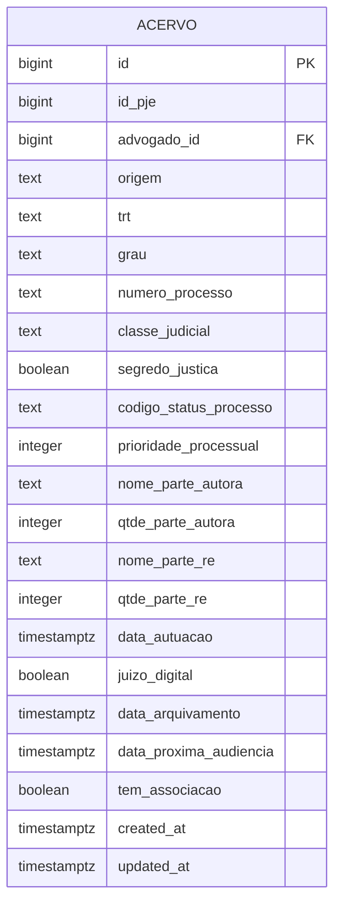
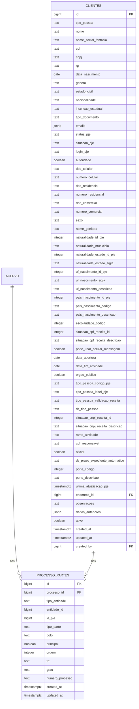
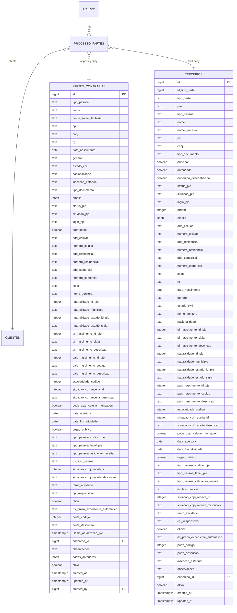
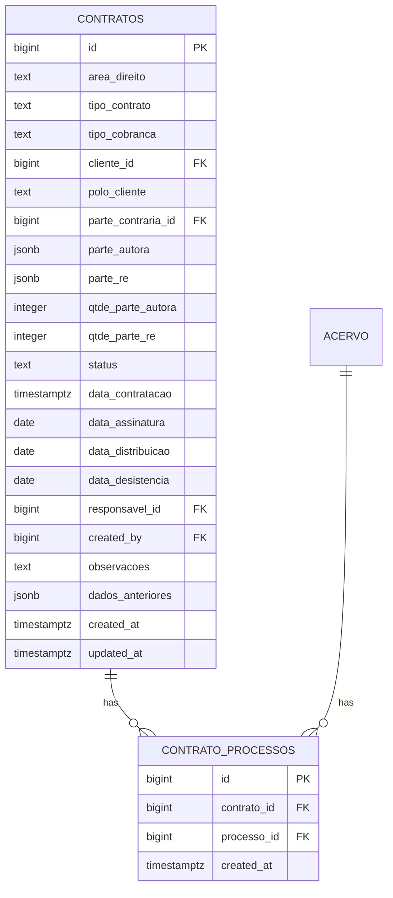
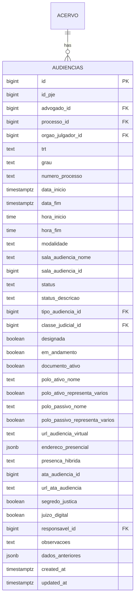
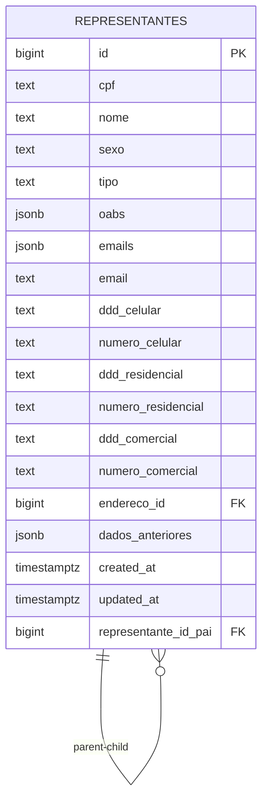

# Core Entity Relationships

<cite>
**Referenced Files in This Document**   
- [04_acervo.sql](file://supabase/schemas/04_acervo.sql)
- [09_clientes.sql](file://supabase/schemas/09_clientes.sql)
- [10_partes_contrarias.sql](file://supabase/schemas/10_partes_contrarias.sql)
- [11_contratos.sql](file://supabase/schemas/11_contratos.sql)
- [12_contrato_processos.sql](file://supabase/schemas/12_contrato_processos.sql)
- [17_processo_partes.sql](file://supabase/schemas/17_processo_partes.sql)
- [18_representantes.sql](file://supabase/schemas/18_representantes.sql)
- [07_audiencias.sql](file://supabase/schemas/07_audiencias.sql)
- [24_processos_cliente_por_cpf_view.sql](file://supabase/schemas/24_processos_cliente_por_cpf_view.sql)
- [processo-partes-persistence.service.ts](file://backend/partes/services/processo-partes-persistence.service.ts)
- [representantes-persistence.service.ts](file://backend/representantes/services/representantes-persistence.service.ts)
</cite>

## Table of Contents
1. [Introduction](#introduction)
2. [Acervo Entity](#acervo-entity)
3. [Relationship with Clientes](#relationship-with-clientes)
4. [Relationship with Partes](#relationship-with-partes)
5. [Relationship with Contratos](#relationship-with-contratos)
6. [Relationship with Audiencias](#relationship-with-audiencias)
7. [Representantes Hierarchy](#representantes-hierarchy)
8. [Query Examples](#query-examples)
9. [Conclusion](#conclusion)

## Introduction
This document details the core entity relationships in the Sinesys system, focusing on the Acervo (legal processes) entity as the central hub connecting to multiple other entities. The documentation explains how the Acervo entity serves as the foundation for tracking legal processes and how it connects to clients, parties, contracts, hearings, and representatives through various relationships and junction tables.

**Section sources**
- [04_acervo.sql](file://supabase/schemas/04_acervo.sql#L1-L77)

## Acervo Entity
The Acervo entity represents the central hub of the Sinesys system, storing all legal processes captured from the PJE (Processo Judicial Eletrônico) system. This table contains comprehensive information about each legal process, including its identification, status, parties involved, and metadata.

The acervo table is designed with several key features:
- **Primary Key**: The `id` field serves as the primary key, with `id_pje` representing the process ID in the PJE system
- **Process Identification**: The combination of `id_pje`, `trt` (TRT code), `grau` (degree), and `numero_processo` ensures uniqueness of processes
- **Status Tracking**: Fields like `origem` (origin), `codigo_status_processo`, and `data_arquivamento` track the process status and lifecycle
- **Party Information**: Basic party information is stored with `nome_parte_autora` and `nome_parte_re` fields
- **Temporal Data**: Key dates such as `data_autuacao` (filing date) and `data_proxima_audiencia` (next hearing date) are tracked

The table is optimized with multiple indexes for performance, including indexes on `advogado_id`, `origem`, `trt`, `grau`, and `numero_processo`. Row Level Security (RLS) is enabled to control access to the data.



**Diagram sources**
- [04_acervo.sql](file://supabase/schemas/04_acervo.sql#L1-L77)

**Section sources**
- [04_acervo.sql](file://supabase/schemas/04_acervo.sql#L1-L77)

## Relationship with Clientes
The relationship between Acervo and Clientes is established through the processo_cliente view, which connects clients to their legal processes. This relationship is implemented through the processo_partes junction table, which serves as a many-to-many relationship table between processes and various entities including clients.

The processo_cliente view (implemented as processos_cliente_por_cpf) provides an optimized way to query processes by client CPF. This materialized view joins the clientes, processo_partes, and acervo tables to create a denormalized structure that facilitates efficient querying of client-process relationships.

Key aspects of this relationship:
- **Junction Table**: The processo_partes table connects clientes to acervo through the `tipo_entidade` field set to 'cliente'
- **Materialized View**: The processos_cliente_por_cpf view provides optimized access to client-process relationships
- **Indexing**: The view includes critical indexes on CPF and processo_id for performance
- **Refresh Mechanism**: The view can be refreshed concurrently to avoid blocking reads

The relationship allows for multiple processes to be associated with a single client, and a single process can have multiple clients associated with it, depending on the case structure.



**Diagram sources**
- [04_acervo.sql](file://supabase/schemas/04_acervo.sql#L1-L77)
- [09_clientes.sql](file://supabase/schemas/09_clientes.sql#L1-L139)
- [17_processo_partes.sql](file://supabase/schemas/17_processo_partes.sql#L1-L144)
- [24_processos_cliente_por_cpf_view.sql](file://supabase/schemas/24_processos_cliente_por_cpf_view.sql#L1-L105)

**Section sources**
- [09_clientes.sql](file://supabase/schemas/09_clientes.sql#L1-L139)
- [24_processos_cliente_por_cpf_view.sql](file://supabase/schemas/24_processos_cliente_por_cpf_view.sql#L1-L105)

## Relationship with Partes
The relationship between Acervo and Partes (parties) is implemented through a many-to-many relationship using the processo_partes junction table. This design allows for flexible association of various types of parties to legal processes, including clients, opposing parties, and third parties.

The processo_partes table serves as a polymorphic junction table with the following key features:
- **Polymorphic Design**: The `tipo_entidade` field can be 'cliente', 'parte_contraria', or 'terceiro', allowing the same table to connect different entity types to processes
- **Composite Unique Constraint**: The combination of `processo_id`, `tipo_entidade`, `entidade_id`, and `grau` ensures no duplicate relationships
- **PJE Integration**: The table stores PJE-specific identifiers and metadata for audit and synchronization purposes
- **Process Context**: Fields like `trt`, `grau`, and `numero_processo` maintain the process context for each relationship

The relationship supports complex scenarios where a single process can have multiple parties on each side (plaintiff and defendant), and a single party can be involved in multiple processes. The table also tracks the role of each party in the process through the `tipo_parte` field (e.g., RECLAMANTE, RECLAMADO) and their procedural pole through the `polo` field (ATIVO, PASSIVO).



**Diagram sources**
- [10_partes_contrarias.sql](file://supabase/schemas/10_partes_contrarias.sql#L1-L139)
- [16_terceiros.sql](file://supabase/schemas/16_terceiros.sql#L1-L119)
- [17_processo_partes.sql](file://supabase/schemas/17_processo_partes.sql#L1-L144)

**Section sources**
- [17_processo_partes.sql](file://supabase/schemas/17_processo_partes.sql#L1-L144)
- [processo-partes-persistence.service.ts](file://backend/partes/services/processo-partes-persistence.service.ts#L1-L398)

## Relationship with Contratos
The relationship between Acervo and Contratos (contracts) is established through the contrato_processos junction table, which implements a many-to-many relationship between contracts and processes. This design allows a single contract to be associated with multiple legal processes, which is common in legal practice where a single engagement might involve multiple related cases.

The contrato_processos table has the following characteristics:
- **Composite Primary Key**: The table has a simple auto-incrementing primary key, but enforces uniqueness through a constraint on the combination of `contrato_id` and `processo_id`
- **Cascade Deletion**: Both foreign keys have cascade deletion behavior, ensuring that when a contract or process is deleted, the relationship is automatically removed
- **Temporal Tracking**: The `created_at` field tracks when the relationship was established

The contratos table itself contains comprehensive information about legal contracts, including:
- **Contract Details**: Area of law, contract type, and billing type
- **Parties**: References to the main client and opposing party, with JSONB fields for multiple parties
- **Status and Dates**: Contract status and key dates like signing and distribution
- **Responsibility**: Assignment of responsibility to specific users

This relationship enables the system to track which processes are associated with which contracts, facilitating billing, reporting, and case management.



**Diagram sources**
- [11_contratos.sql](file://supabase/schemas/11_contratos.sql#L1-L86)
- [12_contrato_processos.sql](file://supabase/schemas/12_contrato_processos.sql#L1-L29)

**Section sources**
- [11_contratos.sql](file://supabase/schemas/11_contratos.sql#L1-L86)
- [12_contrato_processos.sql](file://supabase/schemas/12_contrato_processos.sql#L1-L29)

## Relationship with Audiencias
The relationship between Acervo and Audiencias (hearings) is a one-to-many relationship, where a single legal process can have multiple hearings scheduled over time. This relationship is implemented through a direct foreign key from the audiencias table to the acervo table.

The audiencias table contains comprehensive information about scheduled hearings, including:
- **Hearing Details**: Start and end times, modality (virtual, presential, hybrid), and location information
- **Process Context**: Reference to the parent process through `processo_id` and replication of key process identifiers like `numero_processo` and `trt`
- **Status Tracking**: Current status of the hearing (scheduled, completed, canceled)
- **Virtual Hearing Support**: URL for virtual hearings and presence configuration for hybrid hearings
- **Procedural Information**: Information about the active and passive poles in the hearing

A notable feature of this relationship is the automatic population of the `modalidade` field through a database trigger. The trigger determines the hearing modality based on the presence of a virtual hearing URL, the type of hearing description, or a presential address, with hybrid modality taking precedence when manually set.



**Diagram sources**
- [07_audiencias.sql](file://supabase/schemas/07_audiencias.sql#L1-L159)

**Section sources**
- [07_audiencias.sql](file://supabase/schemas/07_audiencias.sql#L1-L159)

## Representantes Hierarchy
The Representantes (representatives) entity has a hierarchical structure implemented through the representante_id_pai field, which creates a parent-child relationship between representatives. This design allows for modeling organizational hierarchies within the legal team, such as partners, associates, and junior attorneys.

The representantes table is designed with the following key features:
- **Unique Identification**: Representatives are uniquely identified by CPF, with a unique constraint on the `cpf` field
- **OAB Information**: The `oabs` field is a JSONB array that stores multiple OAB (Brazilian Bar Association) registrations, allowing a single representative to have registrations in multiple states
- **Contact Information**: Comprehensive contact details including multiple phone numbers and email addresses
- **Hierarchical Structure**: The `representante_id_pai` field creates a self-referencing relationship that enables organizational hierarchy modeling

The hierarchical structure supports various organizational models, such as:
- **Partnership Structure**: Senior partners at the top, with associates and junior attorneys reporting to them
- **Departmental Structure**: Department heads with team members reporting to them
- **Mentorship Structure**: Experienced attorneys mentoring junior colleagues

This hierarchy can be leveraged for workflow management, reporting structures, and access control within the system.



**Diagram sources**
- [18_representantes.sql](file://supabase/schemas/18_representantes.sql#L1-L63)

**Section sources**
- [18_representantes.sql](file://supabase/schemas/18_representantes.sql#L1-L63)
- [representantes-persistence.service.ts](file://backend/representantes/services/representantes-persistence.service.ts#L1-L843)

## Query Examples
This section provides practical examples of queries that traverse the relationships documented above, demonstrating how to extract meaningful information from the interconnected entities.

### Finding All Parties in a Specific Process
To find all parties involved in a specific process, you can join the processo_partes table with the relevant entity tables:

```sql
SELECT 
    pp.tipo_entidade,
    pp.tipo_parte,
    pp.polo,
    pp.principal,
    c.nome as cliente_nome,
    pc.nome as parte_contraria_nome,
    t.nome as terceiro_nome
FROM processo_partes pp
LEFT JOIN clientes c ON pp.tipo_entidade = 'cliente' AND pp.entidade_id = c.id
LEFT JOIN partes_contrarias pc ON pp.tipo_entidade = 'parte_contraria' AND pp.entidade_id = pc.id
LEFT JOIN terceiros t ON pp.tipo_entidade = 'terceiro' AND pp.entidade_id = t.id
WHERE pp.processo_id = :processo_id
ORDER BY pp.polo, pp.principal DESC, pp.ordem;
```

### Identifying Contracts Associated with a Client's Processes
To find all contracts associated with a client's processes, you can traverse the relationships from client to processes to contracts:

```sql
SELECT DISTINCT
    cont.id as contrato_id,
    cont.area_direito,
    cont.tipo_contrato,
    cont.status,
    cont.data_assinatura,
    a.numero_processo,
    a.nome_parte_autora,
    a.nome_parte_re
FROM clientes c
JOIN processo_partes pp ON pp.tipo_entidade = 'cliente' AND pp.entidade_id = c.id
JOIN acervo a ON pp.processo_id = a.id
JOIN contrato_processos cp ON a.id = cp.processo_id
JOIN contratos cont ON cp.contrato_id = cont.id
WHERE c.cpf = :cliente_cpf
ORDER BY cont.created_at DESC;
```

### Finding All Hearings for a Client's Active Processes
To retrieve all upcoming hearings for a client's active processes, you can combine the client-process relationship with the hearing data:

```sql
SELECT 
    a.numero_processo,
    a.nome_parte_autora,
    a.nome_parte_re,
    aud.data_inicio,
    aud.data_fim,
    aud.modalidade,
    aud.url_audiencia_virtual,
    aud.endereco_presencial,
    aud.status
FROM clientes c
JOIN processo_partes pp ON pp.tipo_entidade = 'cliente' AND pp.entidade_id = c.id
JOIN acervo a ON pp.processo_id = a.id
JOIN audiencias aud ON a.id = aud.processo_id
WHERE c.cpf = :cliente_cpf
    AND aud.data_inicio >= NOW()
    AND aud.status = 'M'  -- Scheduled hearings
ORDER BY aud.data_inicio;
```

**Section sources**
- [04_acervo.sql](file://supabase/schemas/04_acervo.sql#L1-L77)
- [09_clientes.sql](file://supabase/schemas/09_clientes.sql#L1-L139)
- [11_contratos.sql](file://supabase/schemas/11_contratos.sql#L1-L86)
- [12_contrato_processos.sql](file://supabase/schemas/12_contrato_processos.sql#L1-L29)
- [17_processo_partes.sql](file://supabase/schemas/17_processo_partes.sql#L1-L144)
- [07_audiencias.sql](file://supabase/schemas/07_audiencias.sql#L1-L159)

## Conclusion
The Sinesys system implements a comprehensive entity relationship model centered around the Acervo (legal processes) entity. This central hub connects to various other entities through well-defined relationships that support the complex requirements of legal practice management.

Key architectural decisions include:
- **Junction Tables**: The use of junction tables like processo_partes and contrato_processos to implement many-to-many relationships
- **Polymorphic Design**: The processo_partes table's ability to connect different entity types to processes through the tipo_entidade field
- **Materialized Views**: The use of materialized views like processos_cliente_por_cpf for optimized querying
- **Hierarchical Structures**: Support for organizational hierarchies through self-referencing relationships in entities like representantes
- **PJE Integration**: Comprehensive storage of PJE identifiers and metadata to support synchronization and audit requirements

These relationships enable the system to effectively manage the complex web of connections between legal processes, clients, parties, contracts, hearings, and representatives, providing a robust foundation for legal case management.

**Section sources**
- [04_acervo.sql](file://supabase/schemas/04_acervo.sql#L1-L77)
- [09_clientes.sql](file://supabase/schemas/09_clientes.sql#L1-L139)
- [10_partes_contrarias.sql](file://supabase/schemas/10_partes_contrarias.sql#L1-L139)
- [11_contratos.sql](file://supabase/schemas/11_contratos.sql#L1-L86)
- [12_contrato_processos.sql](file://supabase/schemas/12_contrato_processos.sql#L1-L29)
- [17_processo_partes.sql](file://supabase/schemas/17_processo_partes.sql#L1-L144)
- [18_representantes.sql](file://supabase/schemas/18_representantes.sql#L1-L63)
- [07_audiencias.sql](file://supabase/schemas/07_audiencias.sql#L1-L159)
- [24_processos_cliente_por_cpf_view.sql](file://supabase/schemas/24_processos_cliente_por_cpf_view.sql#L1-L105)