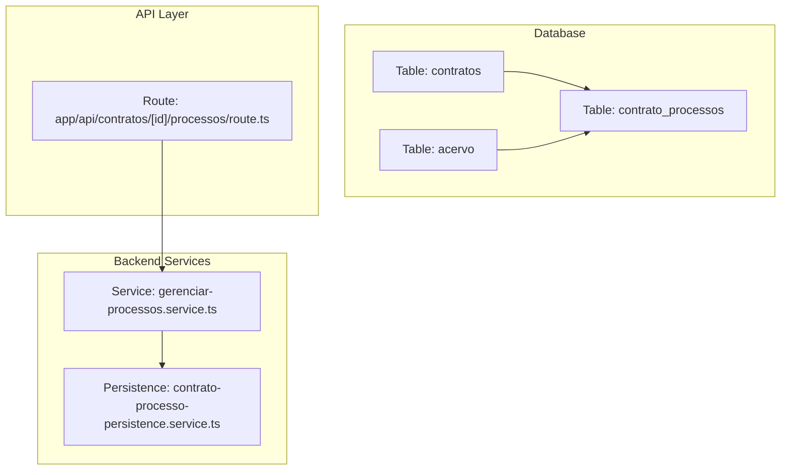
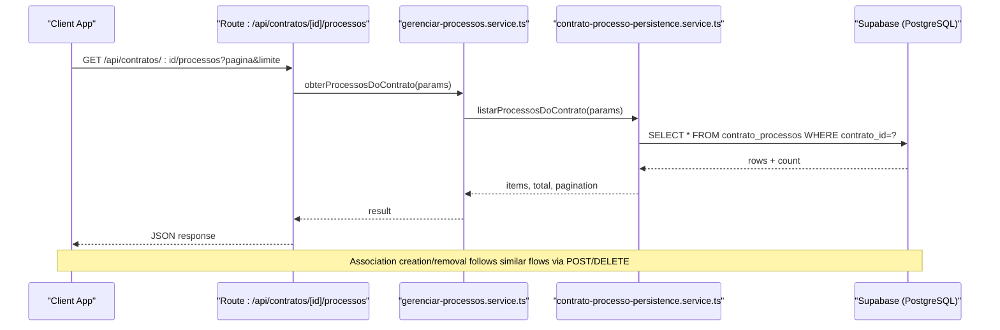
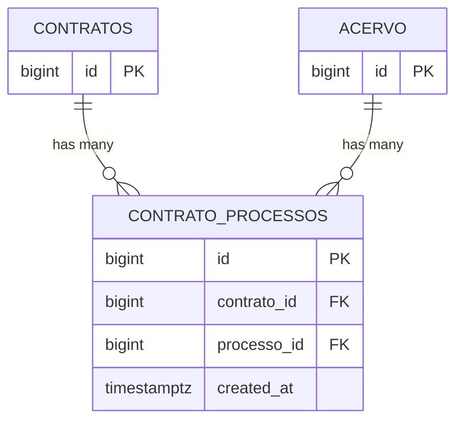
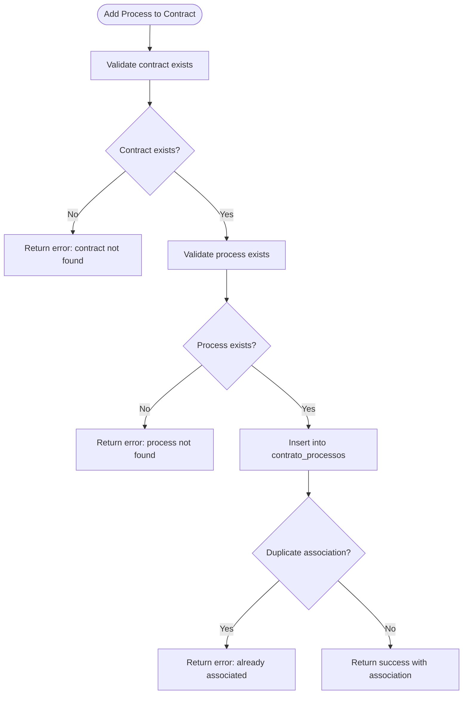
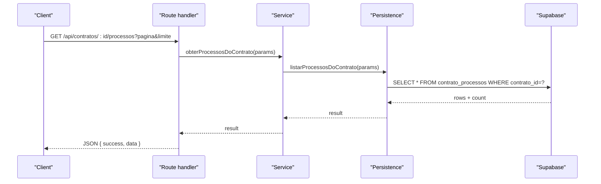
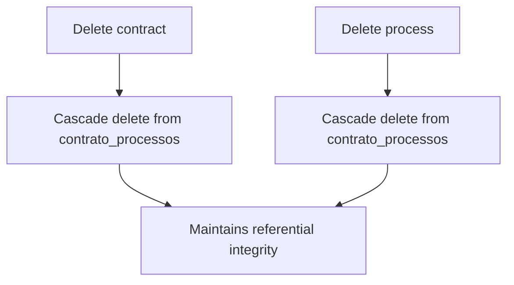
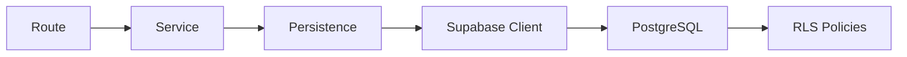

# Process-Contract Relationships

<cite>
**Referenced Files in This Document**
- [12_contrato_processos.sql](file://supabase/schemas/12_contrato_processos.sql)
- [11_contratos.sql](file://supabase/schemas/11_contratos.sql)
- [04_acervo.sql](file://supabase/schemas/04_acervo.sql)
- [24_processos_cliente_por_cpf_view.sql](file://supabase/schemas/24_processos_cliente_por_cpf_view.sql)
- [204-242_rls_policies_granular_permissions.sql](file://supabase/migrations/aplicadas/20250120000001_fix_rls_policies_granular_permissions.sql)
- [gerenciar-processos.service.ts](file://backend/contratos/services/contratos/gerenciar-processos.service.ts)
- [contrato-processo-persistence.service.ts](file://backend/contratos/services/persistence/contrato-processo-persistence.service.ts)
- [route.ts](file://app/api/contratos/[id]/processos/route.ts)
</cite>

## Table of Contents
1. [Introduction](#introduction)
2. [Project Structure](#project-structure)
3. [Core Components](#core-components)
4. [Architecture Overview](#architecture-overview)
5. [Detailed Component Analysis](#detailed-component-analysis)
6. [Dependency Analysis](#dependency-analysis)
7. [Performance Considerations](#performance-considerations)
8. [Troubleshooting Guide](#troubleshooting-guide)
9. [Conclusion](#conclusion)
10. [Appendices](#appendices)

## Introduction
This document explains the process-contract relationship model in the Sinesys system. It focuses on the many-to-many junction table that connects contracts and legal processes, detailing the foreign keys, constraints, indexing, and Row Level Security (RLS). It also describes how the system maintains data integrity when contracts or processes are modified or deleted, and how this relationship supports contract lifecycle management during ongoing legal proceedings. Practical query patterns are included to help users discover associations such as all contracts linked to a client’s legal processes, all processes linked to a specific contract, and reporting on contract exposure across multiple cases.

## Project Structure
The process-contract relationship spans database schema definitions, backend services, and API routes:
- Database schema defines the junction table and foreign keys to contracts and acervo.
- Backend services encapsulate CRUD operations for the relationship.
- API routes expose endpoints to list and manage process associations for a given contract.

**Diagram sources**
- [12_contrato_processos.sql](file://supabase/schemas/12_contrato_processos.sql#L1-L29)
- [11_contratos.sql](file://supabase/schemas/11_contratos.sql#L1-L86)
- [04_acervo.sql](file://supabase/schemas/04_acervo.sql#L1-L77)
- [gerenciar-processos.service.ts](file://backend/contratos/services/contratos/gerenciar-processos.service.ts#L1-L39)
- [contrato-processo-persistence.service.ts](file://backend/contratos/services/persistence/contrato-processo-persistence.service.ts#L1-L191)
- [route.ts](file://app/api/contratos/[id]/processos/route.ts#L1-L136)

**Section sources**
- [12_contrato_processos.sql](file://supabase/schemas/12_contrato_processos.sql#L1-L29)
- [11_contratos.sql](file://supabase/schemas/11_contratos.sql#L1-L86)
- [04_acervo.sql](file://supabase/schemas/04_acervo.sql#L1-L77)
- [gerenciar-processos.service.ts](file://backend/contratos/services/contratos/gerenciar-processos.service.ts#L1-L39)
- [contrato-processo-persistence.service.ts](file://backend/contratos/services/persistence/contrato-processo-persistence.service.ts#L1-L191)
- [route.ts](file://app/api/contratos/[id]/processos/route.ts#L1-L136)

## Core Components
- Junction table: contrato_processos
  - Primary key: id
  - Foreign keys: contrato_id → contratos(id), processo_id → acervo(id)
  - Unique constraint: (contrato_id, processo_id) prevents duplicate associations
  - Indexes: individual and composite for performance
  - RLS enabled
- Contracts table: contratos
  - Contains contract metadata and references to clients and parties
- Acervo table: acervo
  - Stores captured legal processes with identifiers and jurisdictional attributes
- Backend services:
  - gerenciar-processos.service.ts: orchestrates association operations
  - contrato-processo-persistence.service.ts: executes Supabase queries and validates inputs
- API route: app/api/contratos/[id]/processos/route.ts: exposes endpoints for listing and associating processes with a contract

**Section sources**
- [12_contrato_processos.sql](file://supabase/schemas/12_contrato_processos.sql#L1-L29)
- [11_contratos.sql](file://supabase/schemas/11_contratos.sql#L1-L86)
- [04_acervo.sql](file://supabase/schemas/04_acervo.sql#L1-L77)
- [gerenciar-processos.service.ts](file://backend/contratos/services/contratos/gerenciar-processos.service.ts#L1-L39)
- [contrato-processo-persistence.service.ts](file://backend/contratos/services/persistence/contrato-processo-persistence.service.ts#L1-L191)
- [route.ts](file://app/api/contratos/[id]/processos/route.ts#L1-L136)

## Architecture Overview
The relationship is enforced at the database level with foreign keys and cascading deletes. Backend services validate existence and enforce uniqueness, while API routes expose controlled access to the relationship.

**Diagram sources**
- [route.ts](file://app/api/contratos/[id]/processos/route.ts#L1-L136)
- [gerenciar-processos.service.ts](file://backend/contratos/services/contratos/gerenciar-processos.service.ts#L1-L39)
- [contrato-processo-persistence.service.ts](file://backend/contratos/services/persistence/contrato-processo-persistence.service.ts#L157-L191)

## Detailed Component Analysis

### Database Schema: contrato_processos
- Purpose: Many-to-many relationship between contracts and legal processes
- Keys and constraints:
  - contrato_id references contratos(id) with on delete cascade
  - processo_id references acervo(id) with on delete cascade
  - Unique constraint on (contrato_id, processo_id)
- Indexes:
  - Individual: contrato_id, processo_id
  - Composite: (contrato_id, processo_id)
- RLS: Enabled for fine-grained access control

**Diagram sources**
- [12_contrato_processos.sql](file://supabase/schemas/12_contrato_processos.sql#L1-L29)
- [11_contratos.sql](file://supabase/schemas/11_contratos.sql#L1-L86)
- [04_acervo.sql](file://supabase/schemas/04_acervo.sql#L1-L77)

**Section sources**
- [12_contrato_processos.sql](file://supabase/schemas/12_contrato_processos.sql#L1-L29)

### Backend Service: Relationship Management
- Functions:
  - associarProcessoAoContrato: adds a process to a contract
  - desassociarProcessoDoContrato: removes a process from a contract
  - obterProcessosDoContrato: lists processes associated with a contract
- Validation:
  - Ensures the contract exists
  - Ensures the process exists
  - Prevents duplicate associations via database unique constraint
- Pagination and ordering:
  - Supports pagination and sorts by created_at descending

**Diagram sources**
- [gerenciar-processos.service.ts](file://backend/contratos/services/contratos/gerenciar-processos.service.ts#L1-L39)
- [contrato-processo-persistence.service.ts](file://backend/contratos/services/persistence/contrato-processo-persistence.service.ts#L60-L117)

**Section sources**
- [gerenciar-processos.service.ts](file://backend/contratos/services/contratos/gerenciar-processos.service.ts#L1-L39)
- [contrato-processo-persistence.service.ts](file://backend/contratos/services/persistence/contrato-processo-persistence.service.ts#L60-L117)

### API Layer: Endpoint for Contract Processes
- Route: GET /api/contratos/:id/processos
- Behavior:
  - Authenticates requests
  - Parses pagination parameters
  - Delegates to backend service
  - Returns paginated results

**Diagram sources**
- [route.ts](file://app/api/contratos/[id]/processos/route.ts#L1-L136)
- [gerenciar-processos.service.ts](file://backend/contratos/services/contratos/gerenciar-processos.service.ts#L1-L39)
- [contrato-processo-persistence.service.ts](file://backend/contratos/services/persistence/contrato-processo-persistence.service.ts#L157-L191)

**Section sources**
- [route.ts](file://app/api/contratos/[id]/processos/route.ts#L1-L136)

### Cascading Behavior and Data Integrity
- Foreign keys:
  - contrato_id → contratos(id) with on delete cascade
  - processo_id → acervo(id) with on delete cascade
- Implication:
  - Deleting a contract removes all its associations
  - Deleting a process removes all its associations
- Uniqueness:
  - Unique constraint on (contrato_id, processo_id) prevents duplicates

**Diagram sources**
- [12_contrato_processos.sql](file://supabase/schemas/12_contrato_processos.sql#L1-L29)
- [11_contratos.sql](file://supabase/schemas/11_contratos.sql#L1-L86)
- [04_acervo.sql](file://supabase/schemas/04_acervo.sql#L1-L77)

**Section sources**
- [12_contrato_processos.sql](file://supabase/schemas/12_contrato_processos.sql#L1-L29)

### Practical Query Patterns
Below are practical patterns that leverage the relationship. Replace placeholders with actual IDs or filters.

- Find all contracts associated with a specific process (by acervo id):
  - Query: Select all rows from contrato_processos where processo_id equals the target process id
  - Use-case: Determine which contracts are exposed by a given legal process

- Find all processes linked to a specific contract (by contract id):
  - Query: Select all rows from contrato_processos where contrato_id equals the target contract id
  - Use-case: Audit a contract’s legal exposure across multiple cases

- Generate a report of contract exposure across multiple cases:
  - Steps:
    - Group rows by contrato_id
    - Count distinct processo_id per contrato_id
    - Optionally join with contratos and acervo to enrich metadata
  - Use-case: Risk assessment and portfolio analysis

- Find all contracts associated with a client’s legal processes:
  - Steps:
    - Join processos_cliente_por_cpf_view with contrato_processos on processo_id
    - Filter by client CPF
    - Select distinct contracts
  - Use-case: Client-facing exposure dashboards

Notes:
- These patterns rely on the indexes defined on contrato_processos to ensure efficient filtering and grouping.
- RLS policies ensure that only authenticated users can read the relationship data.

**Section sources**
- [12_contrato_processos.sql](file://supabase/schemas/12_contrato_processos.sql#L21-L24)
- [24_processos_cliente_por_cpf_view.sql](file://supabase/schemas/24_processos_cliente_por_cpf_view.sql#L1-L105)

## Dependency Analysis
- Internal dependencies:
  - Route depends on Service
  - Service depends on Persistence
  - Persistence depends on Supabase client
- External dependencies:
  - PostgreSQL foreign keys and RLS policies
  - Supabase authentication and authorization

**Diagram sources**
- [route.ts](file://app/api/contratos/[id]/processos/route.ts#L1-L136)
- [gerenciar-processos.service.ts](file://backend/contratos/services/contratos/gerenciar-processos.service.ts#L1-L39)
- [contrato-processo-persistence.service.ts](file://backend/contratos/services/persistence/contrato-processo-persistence.service.ts#L1-L191)
- [204-242_rls_policies_granular_permissions.sql](file://supabase/migrations/aplicadas/20250120000001_fix_rls_policies_granular_permissions.sql#L223-L245)

**Section sources**
- [route.ts](file://app/api/contratos/[id]/processos/route.ts#L1-L136)
- [gerenciar-processos.service.ts](file://backend/contratos/services/contratos/gerenciar-processos.service.ts#L1-L39)
- [contrato-processo-persistence.service.ts](file://backend/contratos/services/persistence/contrato-processo-persistence.service.ts#L1-L191)
- [204-242_rls_policies_granular_permissions.sql](file://supabase/migrations/aplicadas/20250120000001_fix_rls_policies_granular_permissions.sql#L223-L245)

## Performance Considerations
- Indexes on contrato_processos:
  - Individual: contrato_id, processo_id
  - Composite: (contrato_id, processo_id)
- Pagination:
  - Backend services support pagination and order by created_at desc to keep recent associations first
- Materialized view for client-processes:
  - processos_cliente_por_cpf_view accelerates client-centric queries by precomputing joins

**Section sources**
- [12_contrato_processos.sql](file://supabase/schemas/12_contrato_processos.sql#L21-L24)
- [contrato-processo-persistence.service.ts](file://backend/contratos/services/persistence/contrato-processo-persistence.service.ts#L157-L191)
- [24_processos_cliente_por_cpf_view.sql](file://supabase/schemas/24_processos_cliente_por_cpf_view.sql#L1-L105)

## Troubleshooting Guide
- Duplicate association error:
  - Symptom: Attempting to associate a process to a contract again fails
  - Cause: Unique constraint violation
  - Resolution: Ensure the association does not already exist before insertion
- Association not found when removing:
  - Symptom: Removing a process from a contract returns not found
  - Cause: No matching (contrato_id, processo_id) pair
  - Resolution: Verify the IDs and that the association exists
- Authentication failures:
  - Symptom: API returns unauthorized
  - Cause: Missing or invalid authentication
  - Resolution: Ensure the request is authenticated before accessing the endpoint

**Section sources**
- [contrato-processo-persistence.service.ts](file://backend/contratos/services/persistence/contrato-processo-persistence.service.ts#L99-L117)
- [contrato-processo-persistence.service.ts](file://backend/contratos/services/persistence/contrato-processo-persistence.service.ts#L137-L154)
- [route.ts](file://app/api/contratos/[id]/processos/route.ts#L120-L136)

## Conclusion
The contrato_processos junction table establishes a robust many-to-many relationship between contracts and legal processes. Its foreign keys, cascading deletes, and unique constraint ensure data integrity. Backend services and API routes provide controlled access and pagination, while indexes and a materialized view optimize performance. This design supports contract lifecycle management by enabling visibility into exposure across multiple cases and facilitating reporting and auditing.

## Appendices

### Appendix A: RLS Policies for contrato_processos
- Service role: full access
- Authenticated users: read-only access
- Policy definitions are applied in the RLS policies migration

**Section sources**
- [204-242_rls_policies_granular_permissions.sql](file://supabase/migrations/aplicadas/20250120000001_fix_rls_policies_granular_permissions.sql#L223-L245)