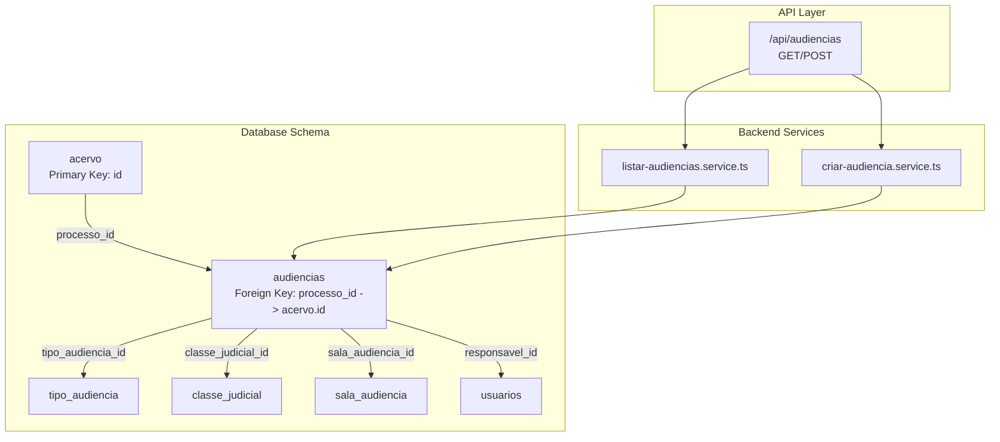
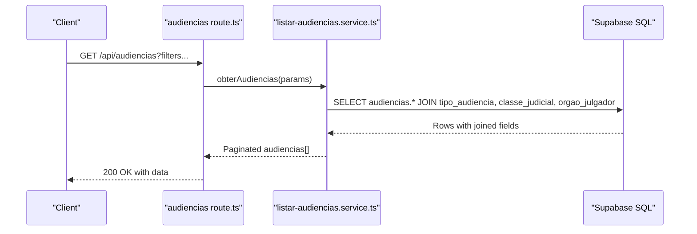
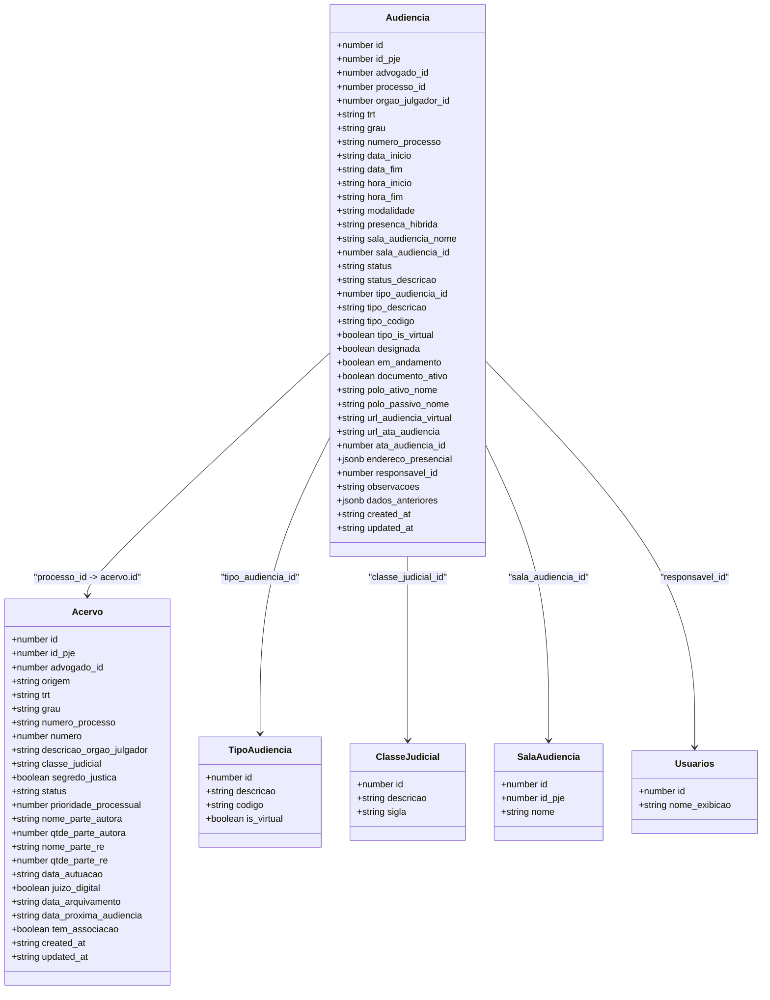
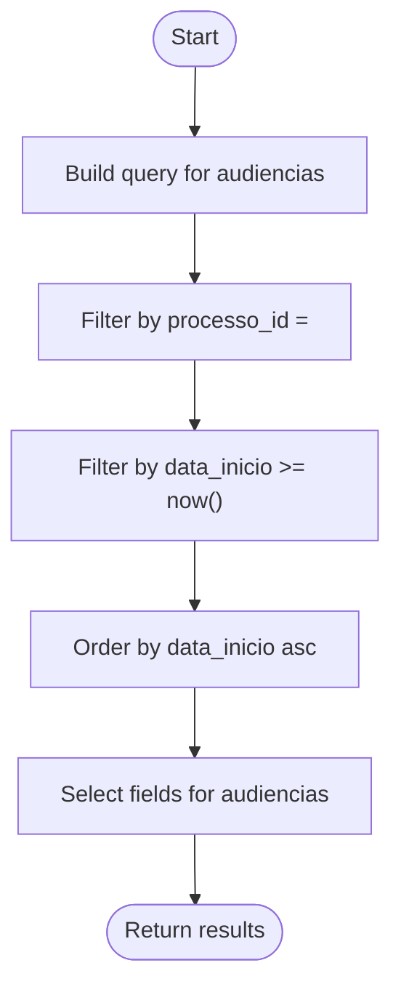
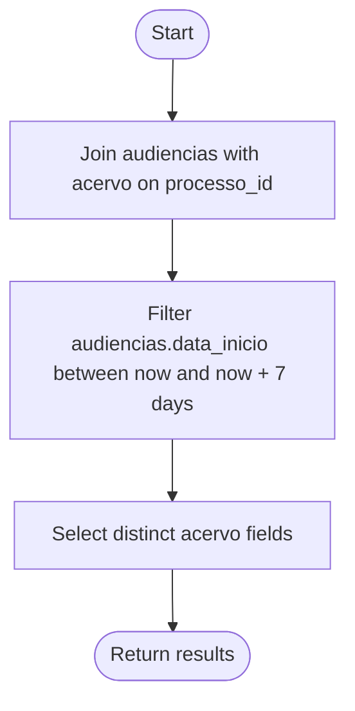
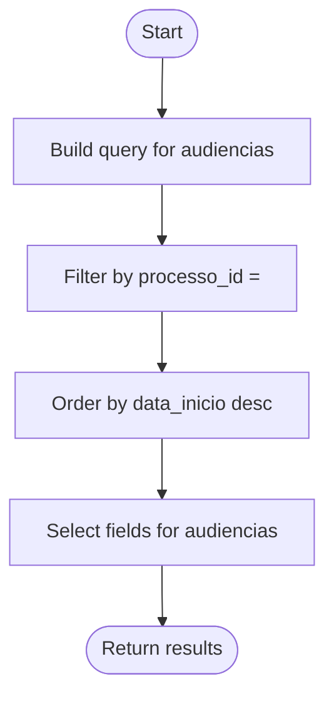
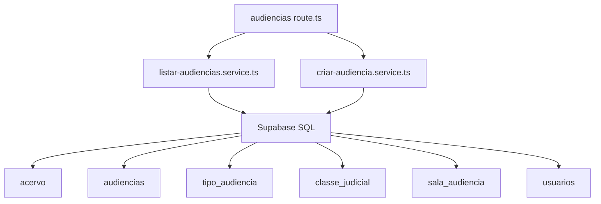

# Process-Hearing Relationships

<cite>
**Referenced Files in This Document**
- [04_acervo.sql](file://supabase/schemas/04_acervo.sql)
- [07_audiencias.sql](file://supabase/schemas/07_audiencias.sql)
- [05_acervo_unificado_view.sql](file://supabase/schemas/05_acervo_unificado_view.sql)
- [07_tipos_expedientes.sql](file://supabase/schemas/07_tipos_expedientes.sql)
- [audiencias route.ts](file://app/api/audiencias/route.ts)
- [listar-audiencias.service.ts](file://backend/audiencias/services/persistence/listar-audiencias.service.ts)
- [criar-audiencia.service.ts](file://backend/audiencias/services/criar-audiencia.service.ts)
- [distribuicao-inicial-audiencias.sql](file://scripts/api-audiencias/distribuicao-inicial-audiencias.sql)
- [20251119000001_create_classe_judicial_tipo_sala_audiencia.sql](file://supabase/migrations/aplicadas/20251119000001_create_classe_judicial_tipo_sala_audiencia.sql)
- [acervo.ts](file://types/domain/acervo.ts)
- [audiencias.ts](file://types/domain/audiencias.ts)
</cite>

## Table of Contents
1. [Introduction](#introduction)
2. [Project Structure](#project-structure)
3. [Core Components](#core-components)
4. [Architecture Overview](#architecture-overview)
5. [Detailed Component Analysis](#detailed-component-analysis)
6. [Dependency Analysis](#dependency-analysis)
7. [Performance Considerations](#performance-considerations)
8. [Troubleshooting Guide](#troubleshooting-guide)
9. [Conclusion](#conclusion)
10. [Appendices](#appendices)

## Introduction
This document explains the process-hearing relationship in the Sinesys system. It focuses on how the audiencias table connects to the acervo (legal processes) table via the processo_id foreign key, establishing a one-to-many relationship: a single legal process can have multiple hearings. It details referential integrity constraints, cascading behaviors, and the key fields that link hearings to processes, including scheduling information, hearing type, and the responsible party. It also demonstrates how this relationship enables comprehensive tracking across different courts and time periods, and provides practical examples of queries that traverse this relationship.

## Project Structure
The relationship is defined at the database schema level and surfaced through API routes and backend services:
- Database schema defines the acervo and audiencias tables, their constraints, and indexes.
- API routes expose endpoints to list and create hearings.
- Backend services encapsulate persistence logic and business rules for listing and creating hearings.
- Views unify process instances to support efficient reporting and timeline views.

**Diagram sources**
- [04_acervo.sql](file://supabase/schemas/04_acervo.sql#L1-L77)
- [07_audiencias.sql](file://supabase/schemas/07_audiencias.sql#L1-L159)
- [audiencias route.ts](file://app/api/audiencias/route.ts#L1-L499)
- [listar-audiencias.service.ts](file://backend/audiencias/services/persistence/listar-audiencias.service.ts#L73-L272)
- [criar-audiencia.service.ts](file://backend/audiencias/services/criar-audiencia.service.ts#L1-L110)

**Section sources**
- [04_acervo.sql](file://supabase/schemas/04_acervo.sql#L1-L77)
- [07_audiencias.sql](file://supabase/schemas/07_audiencias.sql#L1-L159)
- [audiencias route.ts](file://app/api/audiencias/route.ts#L1-L499)
- [listar-audiencias.service.ts](file://backend/audiencias/services/persistence/listar-audiencias.service.ts#L73-L272)
- [criar-audiencia.service.ts](file://backend/audiencias/services/criar-audiencia.service.ts#L1-L110)

## Core Components
- acervo: Stores legal process records, including metadata and scheduling hints.
- audiencias: Stores scheduled hearings for processes, linking via processo_id to acervo.
- API route: Exposes GET (list) and POST (create) endpoints for audiências.
- Persistence service: Implements filtering, pagination, ordering, and joins for audiências.
- Creation service: Validates and inserts new hearings, deriving process-related fields from acervo.

Key fields connecting audiencias to acervo:
- processo_id: Foreign key to acervo.id.
- numero_processo, trt, grau: Used to normalize and uniquely identify processes and hearings.
- data_inicio, data_fim: Scheduling information.
- tipo_audiencia_id: Links to tipo_audiencia for classification and virtual flag.
- responsavel_id: Links to usuarios for assignment tracking.

**Section sources**
- [04_acervo.sql](file://supabase/schemas/04_acervo.sql#L1-L77)
- [07_audiencias.sql](file://supabase/schemas/07_audiencias.sql#L1-L159)
- [audiencias route.ts](file://app/api/audiencias/route.ts#L1-L499)
- [listar-audiencias.service.ts](file://backend/audiencias/services/persistence/listar-audiencias.service.ts#L73-L272)
- [criar-audiencia.service.ts](file://backend/audiencias/services/criar-audiencia.service.ts#L1-L110)

## Architecture Overview
The system enforces a one-to-many relationship between acervo and audiencias through a foreign key constraint. The API layer translates user requests into database queries, applying filters and joins to present unified hearing data.

**Diagram sources**
- [audiencias route.ts](file://app/api/audiencias/route.ts#L225-L308)
- [listar-audiencias.service.ts](file://backend/audiencias/services/persistence/listar-audiencias.service.ts#L73-L272)

**Section sources**
- [audiencias route.ts](file://app/api/audiencias/route.ts#L225-L308)
- [listar-audiencias.service.ts](file://backend/audiencias/services/persistence/listar-audiencias.service.ts#L73-L272)

## Detailed Component Analysis

### Database Schema: acervo and audiencias
- acervo
  - Primary key: id
  - Unique constraint: (id_pje, trt, grau, numero_processo) ensures process identity across degrees and TRTs.
  - Indexes: optimize lookups by advogado_id, trt, grau, numero_processo, id_pje, and timestamps.
  - Contains scheduling hint: data_proxima_audiencia.
- audiencias
  - Primary key: id
  - Foreign keys:
    - processo_id -> acervo(id) with cascade delete behavior.
    - tipo_audiencia_id -> tipo_audiencia(id) with set null on delete.
    - classe_judicial_id -> classe_judicial(id) with set null on delete.
    - sala_audiencia_id -> sala_audiencia(id) with set null on delete.
    - responsavel_id -> usuarios(id) with set null on delete.
  - Unique constraint: (id_pje, trt, grau, numero_processo) ensures normalized uniqueness for captured hearings.
  - Indexes: optimize lookups by advogado_id, processo_id, trt, grau, status, data_inicio/data_fim, responsavel_id, modalidade.
  - Trigger: populate_modalidade_audiencia automatically sets modalidade based on url_audiencia_virtual, endereco_presencial, or tipo_audiencia.

Referential integrity and cascading:
- Deleting a process (acervo) deletes its associated hearings (audiencias) due to cascade delete on processo_id.
- Deleting a tipo_audiencia, classe_judicial, sala_audiencia, or usuario sets the respective foreign keys to null in audiencias.

**Section sources**
- [04_acervo.sql](file://supabase/schemas/04_acervo.sql#L1-L77)
- [07_audiencias.sql](file://supabase/schemas/07_audiencias.sql#L1-L159)
- [20251119000001_create_classe_judicial_tipo_sala_audiencia.sql](file://supabase/migrations/aplicadas/20251119000001_create_classe_judicial_tipo_sala_audiencia.sql#L164-L222)

### API Layer: audiencias route
- GET /api/audiencias
  - Supports pagination, filters (TRT, grau, status, modalidade, responsible, dates), and sorting.
  - Returns paginated audiencias with counts and metadata.
- POST /api/audiencias
  - Creates a new hearing manually; id_pje is set to 0 for non-PJE entries.
  - Validates tipo_audiencia_id and sala_audiencia_id when provided.
  - Derives process-related fields (trt, grau, numero_processo, polo_ativo_nome, polo_passivo_nome, orgao_julgador_id) from acervo.

**Section sources**
- [audiencias route.ts](file://app/api/audiencias/route.ts#L1-L499)
- [criar-audiencia.service.ts](file://backend/audiencias/services/criar-audiencia.service.ts#L1-L110)

### Persistence Layer: listar-audiencias.service
- Converts database rows to typed Audiencia objects.
- Applies filters: trt, grau, responsavel_id (including null), textual search across numero_processo, polo_ativo_nome, polo_passivo_nome, status, tipo_audiencia fields, modalidade, and date ranges.
- Joins: orgao_julgador, classe_judicial, tipo_audiencia to enrich results.
- Pagination and ordering are applied before returning data.
- Retrieves fixed parties (autor/ré) from acervo for first-degree instances to display consistent names.

**Section sources**
- [listar-audiencias.service.ts](file://backend/audiencias/services/persistence/listar-audiencias.service.ts#L73-L272)

### Relationship Behavior and Assignment
- Initial assignment script distributes audiências to the same responsible as their parent process using UPDATE with JOIN on processo_id.
- Future audiências should leverage triggers to keep responsavel_id synchronized with the process owner.

**Section sources**
- [distribuicao-inicial-audiencias.sql](file://scripts/api-audiencias/distribuicao-inicial-audiencias.sql#L1-L114)

### Data Models
- Domain types define the shape of audiências and acervo records used across the application.

**Section sources**
- [acervo.ts](file://types/domain/acervo.ts#L1-L81)
- [audiencias.ts](file://types/domain/audiencias.ts#L1-L77)

## Architecture Overview

**Diagram sources**
- [04_acervo.sql](file://supabase/schemas/04_acervo.sql#L1-L77)
- [07_audiencias.sql](file://supabase/schemas/07_audiencias.sql#L1-L159)
- [07_tipos_expedientes.sql](file://supabase/schemas/07_tipos_expedientes.sql#L1-L200)
- [audiencias.ts](file://types/domain/audiencias.ts#L1-L77)
- [acervo.ts](file://types/domain/acervo.ts#L1-L81)

## Detailed Component Analysis

### Referential Integrity and Cascading
- acervo.id -> audiencias.processo_id (ON DELETE CASCADE)
  - Deleting a process removes all its hearings.
- audiencias.tipo_audiencia_id -> tipo_audiencia.id (ON DELETE SET NULL)
  - Deleting a type leaves audiências with null type reference.
- audiencias.classe_judicial_id -> classe_judicial.id (ON DELETE SET NULL)
  - Deleting a class leaves audiências with null class reference.
- audiencias.sala_audiencia_id -> sala_audiencia.id (ON DELETE SET NULL)
  - Deleting a room leaves audiências with null room reference.
- audiencias.responsavel_id -> usuarios.id (ON DELETE SET NULL)
  - Deleting a user leaves audiências with null responsible.

These constraints ensure data consistency and allow safe deletion of referenced entities while preserving auditability via jsonb fields and logs.

**Section sources**
- [07_audiencias.sql](file://supabase/schemas/07_audiencias.sql#L1-L159)
- [20251119000001_create_classe_judicial_tipo_sala_audiencia.sql](file://supabase/migrations/aplicadas/20251119000001_create_classe_judicial_tipo_sala_audiencia.sql#L164-L222)

### Scheduling Information and Hearing Type
- Scheduling:
  - data_inicio, data_fim: Timestamps for start and end of the hearing.
  - hora_inicio, hora_fim: Optional time fields extracted from PJE schedules.
- Modalidade:
  - Automatically populated by a trigger based on url_audiencia_virtual, tipo_audiencia_id, and endereco_presencial.
  - Values: virtual, presencial, híbrida.
- Tipo de audiência:
  - tipo_audiencia_id links to tipo_audiencia, carrying is_virtual and codigo for classification.
- Classe judicial:
  - classe_judicial_id links to classe_judicial for judicial classification.

**Section sources**
- [07_audiencias.sql](file://supabase/schemas/07_audiencias.sql#L1-L159)
- [listar-audiencias.service.ts](file://backend/audiencias/services/persistence/listar-audiencias.service.ts#L73-L272)

### Responsible Party and Assignment
- responsavel_id links audiências to usuarios.
- An initial assignment script updates responsavel_id for existing audiências based on the parent process’s responsavel_id.
- Future synchronization should rely on triggers to maintain consistency.

**Section sources**
- [distribuicao-inicial-audiencias.sql](file://scripts/api-audiencias/distribuicao-inicial-audiencias.sql#L1-L114)

### Practical Query Traversals

#### Retrieve all upcoming hearings for a specific process
- Filter by processo_id and data_inicio >= now().
- Sort by data_inicio ascending.

**Diagram sources**
- [listar-audiencias.service.ts](file://backend/audiencias/services/persistence/listar-audiencias.service.ts#L171-L191)

#### Find all processes with hearings scheduled in the next week
- Join audiencias with acervo on processo_id.
- Filter audiencias.data_inicio between now and now + 7 days.
- Select distinct acervo fields for the processes.

**Diagram sources**
- [listar-audiencias.service.ts](file://backend/audiencias/services/persistence/listar-audiencias.service.ts#L96-L110)
- [04_acervo.sql](file://supabase/schemas/04_acervo.sql#L1-L77)

#### Generate a complete hearing history for a particular case
- Filter audiencias by processo_id.
- Order by data_inicio descending to show chronological history.
- Optionally filter by status to include only realized or canceled hearings.

**Diagram sources**
- [listar-audiencias.service.ts](file://backend/audiencias/services/persistence/listar-audiencias.service.ts#L188-L191)

## Dependency Analysis

**Diagram sources**
- [audiencias route.ts](file://app/api/audiencias/route.ts#L1-L499)
- [listar-audiencias.service.ts](file://backend/audiencias/services/persistence/listar-audiencias.service.ts#L73-L272)
- [criar-audiencia.service.ts](file://backend/audiencias/services/criar-audiencia.service.ts#L1-L110)
- [04_acervo.sql](file://supabase/schemas/04_acervo.sql#L1-L77)
- [07_audiencias.sql](file://supabase/schemas/07_audiencias.sql#L1-L159)

**Section sources**
- [audiencias route.ts](file://app/api/audiencias/route.ts#L1-L499)
- [listar-audiencias.service.ts](file://backend/audiencias/services/persistence/listar-audiencias.service.ts#L73-L272)
- [criar-audiencia.service.ts](file://backend/audiencias/services/criar-audiencia.service.ts#L1-L110)

## Performance Considerations
- Indexes on audiencias:
  - processo_id, data_inicio, data_fim, status, responsavel_id, modalidade, trt, grau.
- Materialized view acervo_unificado:
  - Unifies process instances and supports efficient pagination and filtering across degrees.
- Caching:
  - Persistence service caches list results keyed by query parameters to reduce repeated database load.

**Section sources**
- [07_audiencias.sql](file://supabase/schemas/07_audiencias.sql#L84-L100)
- [05_acervo_unificado_view.sql](file://supabase/schemas/05_acervo_unificado_view.sql#L146-L161)
- [listar-audiencias.service.ts](file://backend/audiencias/services/persistence/listar-audiencias.service.ts#L1-L272)

## Troubleshooting Guide
- Foreign key violations when deleting referenced entities:
  - tipo_audiencia, classe_judicial, sala_audiencia, or usuarios are deleted; audiencias foreign keys become null due to ON DELETE SET NULL.
- Cascade deletion when removing a process:
  - All hearings under that process are removed automatically.
- Missing responsible assignments:
  - Use the initial assignment script to synchronize audiências with their parent process’s responsavel_id.
- Modalidade not set:
  - Ensure either url_audiencia_virtual, endereco_presencial, or tipo_audiencia_id is set so the trigger can populate modalidade.

**Section sources**
- [07_audiencias.sql](file://supabase/schemas/07_audiencias.sql#L1-L159)
- [distribuicao-inicial-audiencias.sql](file://scripts/api-audiencias/distribuicao-inicial-audiencias.sql#L1-L114)

## Conclusion
The audiencias table establishes a robust one-to-many relationship with acervo via processo_id, enabling comprehensive tracking of hearings across multiple courts and timeframes. Referential integrity constraints and cascading behaviors ensure data consistency, while API routes and backend services provide flexible querying and creation capabilities. The combination of indexes, materialized views, and caching delivers strong performance for large datasets.

## Appendices

### Appendix A: Key Fields and Their Roles
- processo_id: Links audiências to acervo.
- numero_processo, trt, grau: Normalize and uniquely identify processes/hearings.
- data_inicio, data_fim: Schedule boundaries.
- tipo_audiencia_id: Classifies hearings and determines virtual flag.
- responsavel_id: Assigns ownership for tracking and reporting.

**Section sources**
- [07_audiencias.sql](file://supabase/schemas/07_audiencias.sql#L1-L159)
- [04_acervo.sql](file://supabase/schemas/04_acervo.sql#L1-L77)