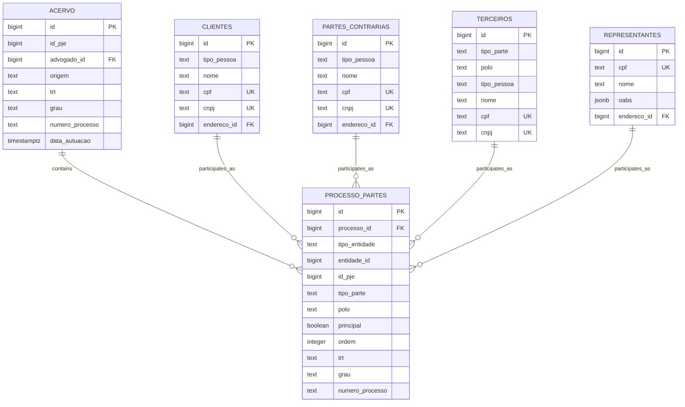
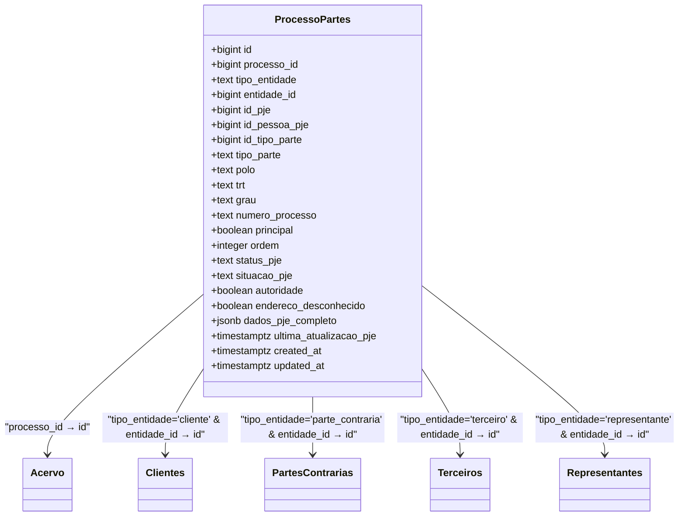
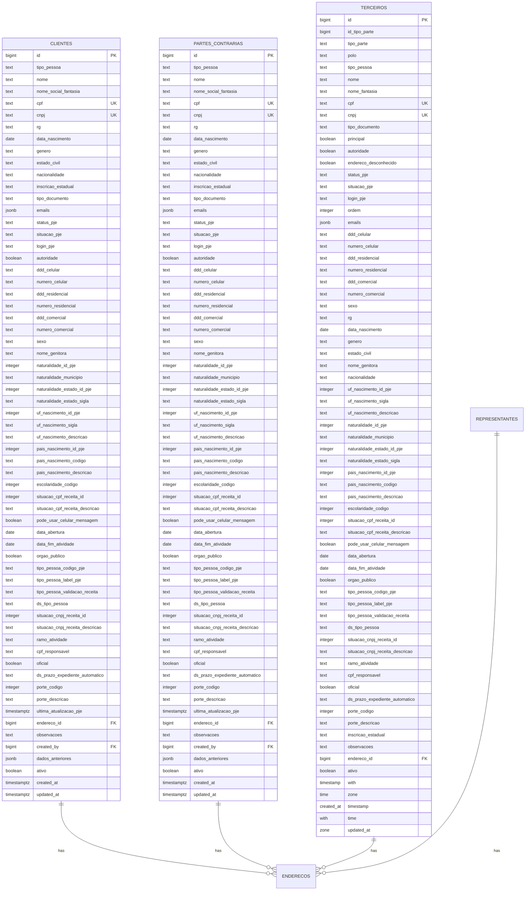
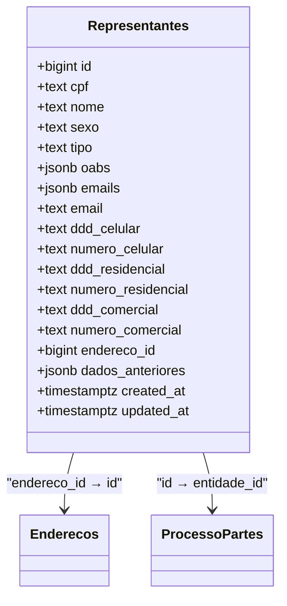

# Process-Party Relationships

<cite>
**Referenced Files in This Document**   
- [17_processo_partes.sql](file://supabase/schemas/17_processo_partes.sql)
- [18_representantes.sql](file://supabase/schemas/18_representantes.sql)
- [09_clientes.sql](file://supabase/schemas/09_clientes.sql)
- [10_partes_contrarias.sql](file://supabase/schemas/10_partes_contrarias.sql)
- [16_terceiros.sql](file://supabase/schemas/16_terceiros.sql)
- [04_acervo.sql](file://supabase/schemas/04_acervo.sql)
- [processo-partes-persistence.service.ts](file://backend/partes/services/processo-partes-persistence.service.ts)
- [representantes-persistence.service.ts](file://backend/representantes/services/representantes-persistence.service.ts)
</cite>

## Table of Contents
1. [Introduction](#introduction)
2. [Core Architecture](#core-architecture)
3. [Processo_Partes Junction Table](#processo_partes-junction-table)
4. [Party Entity Tables](#party-entity-tables)
5. [Representante Hierarchy](#representante-hierarchy)
6. [Data Integrity and Constraints](#data-integrity-and-constraints)
7. [Query Examples](#query-examples)
8. [Conclusion](#conclusion)

## Introduction

The Sinesys system manages complex relationships between legal processes and various parties involved in those processes. This documentation details the architecture of the process-party relationships, focusing on the central `processo_partes` junction table that connects processes (stored in the `acervo` table) with different types of parties including clients, opposing parties, third parties, and representatives. The system is designed to maintain referential integrity, support hierarchical relationships among representatives, and provide efficient querying capabilities for process management.

**Section sources**
- [17_processo_partes.sql](file://supabase/schemas/17_processo_partes.sql)
- [04_acervo.sql](file://supabase/schemas/04_acervo.sql)

## Core Architecture

The process-party relationship system in Sinesys is built around a junction table pattern that enables many-to-many relationships between processes and parties. This architecture allows a single process to have multiple parties of different types, and a single party to participate in multiple processes across different capacities.



**Diagram sources**
- [17_processo_partes.sql](file://supabase/schemas/17_processo_partes.sql)
- [04_acervo.sql](file://supabase/schemas/04_acervo.sql)
- [09_clientes.sql](file://supabase/schemas/09_clientes.sql)
- [10_partes_contrarias.sql](file://supabase/schemas/10_partes_contrarias.sql)
- [16_terceiros.sql](file://supabase/schemas/16_terceiros.sql)
- [18_representantes.sql](file://supabase/schemas/18_representantes.sql)

**Section sources**
- [17_processo_partes.sql](file://supabase/schemas/17_processo_partes.sql)
- [04_acervo.sql](file://supabase/schemas/04_acervo.sql)

## Processo_Partes Junction Table

The `processo_partes` table serves as the central mechanism for connecting processes with various types of parties. It implements a polymorphic association pattern that allows linking to different party entity tables through the `tipo_entidade` and `entidade_id` fields.

### Structure and Fields

The junction table contains the following key fields:

- **processo_id**: Foreign key referencing the `acervo` table, with cascading delete behavior to maintain data consistency
- **tipo_entidade**: Discriminator field indicating the type of party entity (cliente, parte_contraria, terceiro, representante)
- **entidade_id**: ID of the specific party entity in its respective table
- **tipo_parte**: Role field specifying the capacity in which the party participates (AUTOR, REU, RECLAMANTE, etc.)
- **polo**: Processual pole (ATIVO, PASSIVO, NEUTRO, TERCEIRO)
- **principal**: Boolean flag indicating if the party is the principal in its pole
- **ordem**: Display order within the pole (zero-based)
- **trt, grau, numero_processo**: Process metadata copied from the source system for efficient querying

### Constraints and Indexes

The table enforces data integrity through several constraints:

- **Primary Key**: Auto-incrementing `id` field
- **Foreign Key**: `processo_id` references `acervo.id` with `ON DELETE CASCADE`
- **Check Constraints**: 
  - `tipo_entidade` must be one of: 'cliente', 'parte_contraria', 'terceiro'
  - `tipo_parte` must be a valid process participant type
  - `polo` must be one of: 'ATIVO', 'PASSIVO', 'NEUTRO', 'TERCEIRO'
  - `grau` must be either 'primeiro_grau' or 'segundo_grau'
- **Unique Constraint**: Prevents duplicate entries with the same `processo_id`, `tipo_entidade`, `entidade_id`, and `grau`
- **Indexes**: Multiple indexes on key fields for query performance optimization

The cascading delete behavior ensures that when a process is removed from the `acervo` table, all associated records in `processo_partes` are automatically deleted, maintaining referential integrity across the system.



**Diagram sources**
- [17_processo_partes.sql](file://supabase/schemas/17_processo_partes.sql)

**Section sources**
- [17_processo_partes.sql](file://supabase/schemas/17_processo_partes.sql)

## Party Entity Tables

The Sinesys system maintains separate tables for different types of parties involved in legal processes. Each table stores specific attributes relevant to that party type while sharing common patterns for identification and contact information.

### Clientes Table

The `clientes` table stores information about clients of the law firm. Key features include:

- **Identification**: CPF (for individuals) and CNPJ (for organizations) as unique identifiers
- **Personal/Business Information**: Name, social name/fantasy name, date of birth (for individuals), date of establishment (for organizations)
- **Contact Information**: Multiple phone numbers and email addresses
- **Address**: Foreign key reference to the `enderecos` table
- **PJE Integration**: Fields for PJE-specific data including status, situation, and login information

### Partes_Contrarias Table

The `partes_contrarias` table stores information about opposing parties in legal processes. It has an identical structure to the `clientes` table, reflecting the same data requirements for opposing parties.

### Terceiros Table

The `terceiros` table stores information about third parties involved in processes, such as experts, public prosecutors, assistants, and witnesses. Key characteristics:

- **Role-Specific Data**: Type of third party (PERITO, MINISTERIO_PUBLICO, ASSISTENTE, etc.)
- **Processual Pole**: Classification of the party's role in the process
- **Principal Flag**: Indicates if the party is the primary representative of its type
- **Unique Constraints**: CPF and CNPJ fields have unique constraints where not null

### Common Features

All party entity tables share several common features:

- **Identification**: CPF and CNPJ fields with unique constraints for deduplication
- **Contact Information**: Standardized phone and email fields
- **Address Management**: Foreign key reference to a centralized `enderecos` table
- **Audit Fields**: `created_at` and `updated_at` timestamps
- **Soft Deletion**: `ativo` boolean field to mark records as inactive rather than deleting them



**Diagram sources**
- [09_clientes.sql](file://supabase/schemas/09_clientes.sql)
- [10_partes_contrarias.sql](file://supabase/schemas/10_partes_contrarias.sql)
- [16_terceiros.sql](file://supabase/schemas/16_terceiros.sql)

**Section sources**
- [09_clientes.sql](file://supabase/schemas/09_clientes.sql)
- [10_partes_contrarias.sql](file://supabase/schemas/10_partes_contrarias.sql)
- [16_terceiros.sql](file://supabase/schemas/16_terceiros.sql)

## Representante Hierarchy

The `representantes` table manages legal representatives (typically attorneys) and supports hierarchical relationships through organizational structures.

### Structure and Features

The representantes table includes:

- **CPF-based Identification**: Unique identification by CPF, ensuring each representative is stored only once regardless of their involvement in multiple processes
- **OAB Registrations**: JSONB array field (`oabs`) storing multiple OAB inscriptions with number, state, and status
- **Contact Information**: Standardized contact fields including multiple phone numbers and email addresses
- **Address Reference**: Foreign key to the centralized `enderecos` table

### Hierarchical Relationships

The system supports organizational structures within representation through the `representante_id_pai` field (implied by the hierarchical nature of representation, though not explicitly shown in the schema). This allows for:

- **Firm Hierarchies**: Senior partners, associates, and junior attorneys within a law firm
- **Delegation Structures**: Senior representatives delegating tasks to junior representatives
- **Organizational Management**: Managing teams of representatives working on complex cases

The hierarchical structure enables efficient management of representation teams and clear delineation of responsibilities within legal proceedings.



**Diagram sources**
- [18_representantes.sql](file://supabase/schemas/18_representantes.sql)

**Section sources**
- [18_representantes.sql](file://supabase/schemas/18_representantes.sql)

## Data Integrity and Constraints

The Sinesys system implements comprehensive data integrity measures to ensure consistency and reliability of process-party relationships.

### Referential Integrity

The system enforces referential integrity through:

- **Foreign Key Constraints**: The `processo_id` field in `processo_partes` references `acervo.id` with `ON DELETE CASCADE`, ensuring that when a process is deleted, all associated party relationships are automatically removed
- **Polymorphic Association Integrity**: While the `entidade_id` field doesn't have a direct foreign key constraint (due to referencing multiple tables), the application layer enforces referential integrity by validating that the referenced entity exists in the appropriate table based on `tipo_entidade`
- **Unique Constraints**: Prevent duplicate relationships between the same party and process within the same degree

### Validation Rules

The system implements validation at both the database and application levels:

- **Database-level Constraints**: 
  - Check constraints on `tipo_entidade`, `tipo_parte`, `polo`, and `grau` fields
  - Unique constraints on CPF and CNPJ fields across party tables
  - Not-null constraints on critical fields

- **Application-level Validation**: 
  - CPF/CNPJ format validation using algorithms that verify check digits
  - Email format validation using RFC 5322 simplified pattern
  - OAB number format validation ensuring correct state codes and number formats
  - Business rule validation (e.g., preventing modification of immutable fields like `processo_id`, `tipo_entidade`, and `entidade_id` after creation)

### Error Handling

The system provides meaningful error messages for constraint violations:

- **Unique Constraint Violations**: "Vínculo já existe entre esta parte e processo" (Link already exists between this party and process)
- **Foreign Key Violations**: "Processo ou entidade não encontrada" (Process or entity not found)
- **Not-null Violations**: "Campo obrigatório não informado" (Required field not provided)
- **Check Constraint Violations**: "Valor inválido para campo" (Invalid value for field)

These error messages help users understand and correct data entry issues while maintaining data integrity.

**Section sources**
- [17_processo_partes.sql](file://supabase/schemas/17_processo_partes.sql)
- [processo-partes-persistence.service.ts](file://backend/partes/services/processo-partes-persistence.service.ts)

## Query Examples

This section provides practical examples of queries that traverse the process-party relationships in the Sinesys system.

### Finding All Clients in a Process

To retrieve all clients involved in a specific process:

```sql
SELECT c.*, pp.tipo_parte, pp.polo, pp.principal 
FROM processo_partes pp
JOIN clientes c ON pp.entidade_id = c.id
WHERE pp.processo_id = $1 
  AND pp.tipo_entidade = 'cliente'
ORDER BY pp.polo, pp.principal DESC, pp.ordem;
```

### Identifying Processes for an Opposing Party

To find all processes associated with a particular opposing party:

```sql
SELECT a.*, pp.tipo_parte, pp.polo 
FROM processo_partes pp
JOIN acervo a ON pp.processo_id = a.id
WHERE pp.tipo_entidade = 'parte_contraria' 
  AND pp.entidade_id = $1
ORDER BY a.data_autuacao DESC;
```

### Retrieving Complete Party Structure for a Case

To get the complete party structure for a given case:

```sql
SELECT 
  pp.tipo_entidade,
  pp.tipo_parte,
  pp.polo,
  pp.principal,
  CASE 
    WHEN pp.tipo_entidade = 'cliente' THEN c.nome
    WHEN pp.tipo_entidade = 'parte_contraria' THEN pc.nome
    WHEN pp.tipo_entidade = 'terceiro' THEN t.nome
    WHEN pp.tipo_entidade = 'representante' THEN r.nome
  END as nome_parte,
  CASE 
    WHEN pp.tipo_entidade = 'cliente' THEN c.cpf
    WHEN pp.tipo_entidade = 'parte_contraria' THEN pc.cpf
    WHEN pp.tipo_entidade = 'terceiro' THEN t.cpf
    WHEN pp.tipo_entidade = 'representante' THEN r.cpf
  END as documento_parte
FROM processo_partes pp
LEFT JOIN clientes c ON pp.entidade_id = c.id AND pp.tipo_entidade = 'cliente'
LEFT JOIN partes_contrarias pc ON pp.entidade_id = pc.id AND pp.tipo_entidade = 'parte_contraria'
LEFT JOIN terceiros t ON pp.entidade_id = t.id AND pp.tipo_entidade = 'terceiro'
LEFT JOIN representantes r ON pp.entidade_id = r.id AND pp.tipo_entidade = 'representante'
WHERE pp.processo_id = $1
ORDER BY pp.polo, pp.tipo_parte, pp.principal DESC, pp.ordem;
```

### Finding Representatives by OAB Number

To search for representatives by their OAB number:

```sql
SELECT * FROM representantes 
WHERE oabs @> '[{"numero": "MG123456"}]'::jsonb
   OR oabs::text LIKE '%MG123456%';
```

### Getting Process Count by Party

To determine how many processes a party is involved in:

```sql
SELECT 
  pp.tipo_entidade,
  COUNT(*) as quantidade_processos
FROM processo_partes pp
WHERE pp.entidade_id = $1
  AND pp.tipo_entidade = $2
GROUP BY pp.tipo_entidade;
```

These queries demonstrate the flexibility of the process-party relationship system, enabling efficient data retrieval for various use cases in legal process management.

**Section sources**
- [17_processo_partes.sql](file://supabase/schemas/17_processo_partes.sql)
- [09_clientes.sql](file://supabase/schemas/09_clientes.sql)
- [10_partes_contrarias.sql](file://supabase/schemas/10_partes_contrarias.sql)
- [16_terceiros.sql](file://supabase/schemas/16_terceiros.sql)
- [18_representantes.sql](file://supabase/schemas/18_representantes.sql)
- [04_acervo.sql](file://supabase/schemas/04_acervo.sql)

## Conclusion

The process-party relationship system in Sinesys provides a robust and flexible architecture for managing complex legal process relationships. The central `processo_partes` junction table enables many-to-many relationships between processes and various party types while maintaining data integrity through comprehensive constraints and validation rules.

Key strengths of the system include:

- **Flexible Party Management**: Support for multiple party types (clients, opposing parties, third parties, representatives) through a polymorphic association pattern
- **Data Integrity**: Cascading deletes, unique constraints, and comprehensive validation ensure data consistency
- **Hierarchical Representation**: Support for organizational structures within representation teams
- **Efficient Querying**: Well-designed indexes and normalized structure enable fast data retrieval
- **PJE Integration**: Seamless integration with the PJE system through synchronized data fields

The system's design allows for efficient management of legal processes while providing the flexibility needed to handle the complex relationships that occur in legal proceedings. By centralizing the relationship management in the `processo_partes` table, the system ensures consistency across all process-party interactions while maintaining the ability to store type-specific information in dedicated tables.

**Section sources**
- [17_processo_partes.sql](file://supabase/schemas/17_processo_partes.sql)
- [04_acervo.sql](file://supabase/schemas/04_acervo.sql)