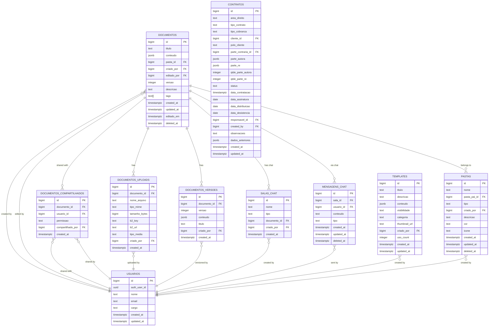
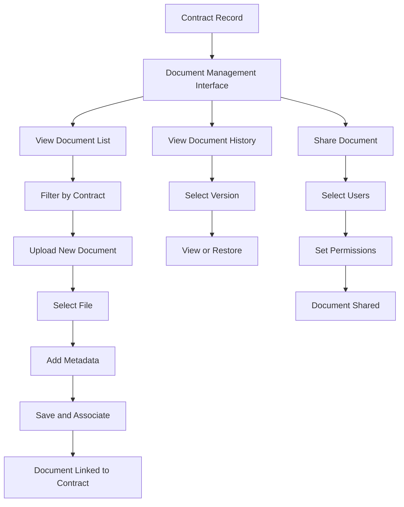

# Contract-Document Relationships

<cite>
**Referenced Files in This Document**   
- [11_contratos.sql](file://supabase/schemas/11_contratos.sql)
- [20251130220000_create_documentos_system.sql](file://supabase/migrations/aplicadas/20251130220000_create_documentos_system.sql)
- [contrato-view-sheet.tsx](file://app/(dashboard)/contratos/components/contrato-view-sheet.tsx)
- [document-list.tsx](file://components/documentos/document-list.tsx)
- [route.ts](file://app/api/documentos/route.ts)
- [versoes-persistence.service.ts](file://backend/documentos/services/persistence/versoes-persistence.service.ts)
- [documentos-persistence.service.ts](file://backend/documentos/services/persistence/documentos-persistence.service.ts)
</cite>

## Table of Contents
1. [Introduction](#introduction)
2. [Database Schema Implementation](#database-schema-implementation)
3. [Generic Foreign Key Pattern](#generic-foreign-key-pattern)
4. [API Endpoints for Document Management](#api-endpoints-for-document-management)
5. [Frontend Components and User Interface](#frontend-components-and-user-interface)
6. [Document Versioning and History](#document-versioning-and-history)
7. [Document Signing Workflow](#document-signing-workflow)
8. [Security and Access Control](#security-and-access-control)
9. [Common Operations and Examples](#common-operations-and-examples)
10. [Conclusion](#conclusion)

## Introduction

The Sinesys system implements a robust document management system that enables seamless association between documents and contracts. This documentation details the architecture, implementation, and functionality of the contract-document relationship system. The core mechanism relies on a generic foreign key pattern using `entidade_tipo` and `entidade_id` fields to create flexible associations between documents and various entity types, including contracts. This approach allows documents to be linked to different types of entities without requiring dedicated foreign key columns for each entity type, providing maximum flexibility in the system's data model.

The document system supports rich functionality including versioning, collaboration, sharing, and integration with the contract management module. Users can upload, view, edit, and manage documents directly from the contract interface, with full version history and access controls. The system also supports document signing workflows, enabling digital signatures on contract documents with proper audit trails.

**Section sources**
- [11_contratos.sql](file://supabase/schemas/11_contratos.sql#L4-L86)
- [20251130220000_create_documentos_system.sql](file://supabase/migrations/aplicadas/20251130220000_create_documentos_system.sql#L1-L689)

## Database Schema Implementation

The contract-document relationship in Sinesys is implemented through a comprehensive database schema that supports flexible entity associations. The system uses a generic foreign key pattern to link documents to various entity types, including contracts, clients, and other business entities.

The `documentos` table serves as the central repository for all documents in the system. It contains essential fields such as `id`, `titulo`, `conteudo` (stored as JSONB for rich text), `criado_por`, `editado_por`, and timestamps for creation and modification. The table also includes soft delete functionality through the `deleted_at` field, allowing documents to be archived rather than permanently deleted.

For the generic foreign key pattern, the system uses the `entidade_tipo` and `entidade_id` fields in related tables. While the `documentos` table itself doesn't contain these fields, other tables like `enderecos` demonstrate this pattern:

```sql
create table if not exists public.enderecos (
  id bigint generated always as identity primary key,
  id_pje bigint,
  entidade_tipo text not null check (entidade_tipo in ('cliente', 'parte_contraria', 'terceiro')),
  entidade_id bigint not null,
  -- ... other fields
);
```

This pattern allows a single table to reference multiple entity types through the `entidade_tipo` field, which specifies the type of entity, and the `entidade_id` field, which stores the foreign key reference. Although the current schema doesn't show a direct `documentos_entidades` junction table, the pattern is established in the system and could be implemented similarly for document-entity associations.

The document system also includes supporting tables for comprehensive document management:
- `pastas`: Hierarchical folder structure for document organization
- `documentos_compartilhados`: User-to-user document sharing
- `templates`: Reusable document templates
- `documentos_uploads`: File uploads associated with documents
- `documentos_versoes`: Complete version history of documents
- `salas_chat` and `mensagens_chat`: Integrated chat system for document collaboration

These tables are interconnected through foreign key relationships, creating a robust document management ecosystem that supports the association of documents with contracts and other entities.



**Diagram sources**
- [20251130220000_create_documentos_system.sql](file://supabase/migrations/aplicadas/20251130220000_create_documentos_system.sql#L10-L689)
- [11_contratos.sql](file://supabase/schemas/11_contratos.sql#L4-L86)

**Section sources**
- [20251130220000_create_documentos_system.sql](file://supabase/migrations/aplicadas/20251130220000_create_documentos_system.sql#L1-L689)
- [11_contratos.sql](file://supabase/schemas/11_contratos.sql#L4-L86)

## Generic Foreign Key Pattern

The Sinesys system implements a generic foreign key pattern using the `entidade_tipo` and `entidade_id` fields to create flexible associations between entities and various record types. This pattern is exemplified in the `enderecos` table, which demonstrates how a single table can reference multiple entity types:

```sql
create table if not exists public.enderecos (
  id bigint generated always as identity primary key,
  id_pje bigint,
  entidade_tipo text not null check (entidade_tipo in ('cliente', 'parte_contraria', 'terceiro')),
  entidade_id bigint not null,
  -- ... other fields
);
```

In this implementation, the `entidade_tipo` field specifies the type of entity that owns the address, with a check constraint limiting values to 'cliente', 'parte_contraria', or 'terceiro'. The `entidade_id` field contains the foreign key reference to the specific entity record. This approach allows the `enderecos` table to serve multiple entity types without requiring separate tables or multiple foreign key columns.

Although the current schema doesn't show a direct implementation of this pattern for document-contract relationships, the architectural foundation is present in the system. The pattern enables several key benefits:

1. **Flexibility**: A single table can reference multiple entity types, reducing schema complexity and duplication.
2. **Extensibility**: New entity types can be added without modifying the table structure—only the check constraint needs updating.
3. **Consistency**: The same pattern can be applied across different relationships in the system.
4. **Simplified queries**: Applications can use consistent patterns to retrieve related data regardless of entity type.

For document-contract relationships specifically, this pattern would allow documents to be associated with contracts while also supporting associations with other entities like clients, processes, or expedientes. The application layer would handle the logic of validating that when `entidade_tipo` is 'contrato', the `entidade_id` references a valid contract record.

The indexing strategy supports this pattern with a composite index on both fields:
```sql
create index if not exists idx_enderecos_entidade on public.enderecos(entidade_tipo, entidade_id);
```

This index ensures efficient lookups when querying for all addresses associated with a specific entity type and ID combination. The pattern also includes a unique index for PJE-specific records, ensuring data integrity for imported records.

While the current implementation focuses on addresses, the same pattern could be extended to document associations, allowing documents to be linked to contracts, clients, or other entities through a unified interface.

**Section sources**
- [15_enderecos.sql](file://supabase/schemas/15_enderecos.sql#L6-L94)

## API Endpoints for Document Management

The Sinesys system provides a comprehensive set of API endpoints for managing documents and their relationships with contracts. These endpoints follow RESTful principles and are designed to support the full lifecycle of document management within the contract context.

The primary endpoint for retrieving documents is `GET /api/documentos`, which returns a paginated list of documents with filtering capabilities:

```typescript
/**
 * GET /api/documentos
 * Lists documents with filters
 * Returns paginated list of documents that the user has access to (created or shared)
 */
export async function GET(request: NextRequest) {
  try {
    const authResult = await authenticateRequest(request);
    if (!authResult.authenticated) {
      return NextResponse.json({ error: 'Unauthorized' }, { status: 401 });
    }

    const { searchParams } = new URL(request.url);
    const params: ListarDocumentosParams = {
      pastaId: searchParams.get('pasta_id') ? parseInt(searchParams.get('pasta_id')!) : undefined,
      busca: searchParams.get('busca') || undefined,
      tags: searchParams.get('tags')?.split(',') || undefined,
      criadoPor: searchParams.get('criado_por') ? parseInt(searchParams.get('criado_por')!) : undefined,
      incluirDeletados: searchParams.get('incluir_deletados') === 'true',
      limit: searchParams.get('limit') ? parseInt(searchParams.get('limit')!) : 50,
      offset: searchParams.get('offset') ? parseInt(searchParams.get('offset')!) : 0,
    };

    const resultado = await listarDocumentos(params, authResult.usuario.id);
    // ... response handling
  }
}
```

This endpoint supports multiple query parameters for filtering documents by folder, search term, tags, creator, and deletion status. It also includes pagination parameters (`limit` and `offset`) to handle large result sets efficiently.

For document versioning, the system provides endpoints under `/api/documentos/[id]/versoes`:

```typescript
/**
 * GET /api/documentos/[id]/versoes
 * Lists versions of a document
 */
export async function GET(
  request: NextRequest,
  { params }: { params: Promise<{ id: string }> }
) {
  try {
    const authResult = await authenticateRequest(request);
    if (!authResult.authenticated || !authResult.usuario) {
      return NextResponse.json({ error: 'Unauthorized' }, { status: 401 });
    }

    const { id } = await params;
    const documento_id = parseInt(id);
    
    // Verify access to the document
    const { temAcesso } = await verificarAcessoDocumento(documento_id, authResult.usuario.id);
    if (!temAcesso) {
      return NextResponse.json({ error: 'Access denied' }, { status: 403 });
    }

    const versoes = await listarVersoes(documento_id);
    // ... response handling
  }
}
```

The system also includes endpoints for document upload functionality at `/api/documentos/[id]/upload`, allowing users to attach files to existing documents. This is particularly relevant for contract documents, as users can upload signed contract copies, exhibits, or supporting documentation.

For contract-specific document operations, while the exact endpoints aren't visible in the provided code, the pattern suggests that similar endpoints would exist under a contract-specific route, such as `GET /api/contratos/[id]/documentos` to retrieve all documents associated with a specific contract.

The API design follows consistent patterns across endpoints:
- Authentication is handled by `authenticateRequest` middleware
- Authorization is verified before processing requests
- Parameters are properly typed and validated
- Responses follow a consistent success/error pattern
- Error handling provides meaningful messages

These endpoints enable the frontend to implement rich document management features, including uploading contract documents, retrieving contract-related documents, and managing document versions for contracts.

**Section sources**
- [route.ts](file://app/api/documentos/route.ts#L1-L103)
- [versoes-persistence.service.ts](file://backend/documentos/services/persistence/versoes-persistence.service.ts#L1-L47)

## Frontend Components and User Interface

The Sinesys system implements a comprehensive frontend interface for managing contract documents through a combination of React components and UI patterns. The document management functionality is centered around the `DocumentList` component, which provides a rich interface for viewing, organizing, and interacting with documents.

The `DocumentList` component serves as the primary interface for document management and includes several key features:

```tsx
export function DocumentList() {
  const [documentos, setDocumentos] = React.useState<DocumentoComUsuario[]>([]);
  const [viewMode, setViewMode] = React.useState<'grid' | 'list'>('list');
  const [busca, setBusca] = React.useState('');
  const [pastaAtual, setPastaAtual] = React.useState<number | null>(null);
  const [filtroTipo, setFiltroTipo] = React.useState<FiltroTipo>('todos');
  // ... other state
}
```

This component provides multiple viewing modes (grid and list), search functionality, folder navigation, and filtering options. Users can filter documents by various criteria including "todos" (all), "recentes" (recent), "meus" (mine), and "compartilhados" (shared with me), which is particularly useful when working with contract documents.

The component integrates with the contract management system through navigation patterns. When a user clicks on a document, they are routed to the document detail view:

```tsx
const handleDocumentoClick = (id: number) => {
  router.push(`/documentos/${id}`);
};
```

For contract-specific document interactions, the system likely uses similar patterns within the contract interface. The `contrato-view-sheet.tsx` component demonstrates how contract information is presented in a detailed view, suggesting that document associations would be integrated into this interface:

```tsx
export function ContratoViewSheet({
  open,
  onOpenChange,
  contrato,
}: ContratoViewSheetProps) {
  if (!contrato) return null;

  return (
    <Dialog open={open} onOpenChange={onOpenChange}>
      <DialogContent className="max-h-[90vh] w-full sm:max-w-2xl overflow-y-auto">
        {/* Contract details */}
        {/* Likely location for document associations */}
      </DialogContent>
    </Dialog>
  );
}
```

The document interface includes several specialized components that would support contract document management:
- `DocumentCard`: Displays individual documents in grid view with metadata
- `DocumentTable`: Shows documents in tabular format with sortable columns
- `FolderTree`: Hierarchical navigation for document organization
- `CreateDocumentDialog`: Modal for creating new documents
- `UploadDialog`: Interface for uploading files to documents

The system also supports command-driven interactions through the `CommandMenu` component, allowing users to quickly create documents, folders, or access templates using keyboard shortcuts (Cmd+K).

For contract document workflows, users would likely follow this pattern:
1. Navigate to the contract record
2. Access the document management interface (possibly through a tab or section)
3. Upload a new document or select from existing documents
4. The system would then associate the document with the contract using the generic foreign key pattern

The interface is designed to be intuitive and efficient, with features like debounce on search inputs, pagination for large document sets, and real-time updates when documents are created or modified.



**Diagram sources**
- [document-list.tsx](file://components/documentos/document-list.tsx#L1-L438)
- [contrato-view-sheet.tsx](file://app/(dashboard)/contratos/components/contrato-view-sheet.tsx#L1-L261)

**Section sources**
- [document-list.tsx](file://components/documentos/document-list.tsx#L1-L438)
- [contrato-view-sheet.tsx](file://app/(dashboard)/contratos/components/contrato-view-sheet.tsx#L1-L261)

## Document Versioning and History

The Sinesys system implements a comprehensive document versioning system that maintains a complete history of changes for all documents, including those associated with contracts. This functionality is critical for legal documents where audit trails and the ability to restore previous versions are essential.

The versioning system is built around the `documentos_versoes` table, which stores immutable records of each document version:

```sql
create table public.documentos_versoes (
  id bigint generated always as identity primary key,
  documento_id bigint not null references public.documentos(id) on delete cascade,
  versao integer not null,
  conteudo jsonb not null,
  titulo text not null,
  criado_por bigint not null references public.usuarios(id) on delete cascade,
  created_at timestamptz not null default now(),
  
  constraint documentos_versoes_versao_positive check (versao > 0),
  constraint documentos_versoes_unique unique (documento_id, versao)
);
```

Each version record captures the complete document state at the time of saving, including the content, title, creator, and timestamp. The `versao` field maintains a sequential number for each document, ensuring chronological ordering. The unique constraint on `(documento_id, versao)` prevents duplicate versions.

The system automatically creates versions through the `documentos-persistence.service`:

```typescript
/**
 * Creates a new version of a document
 * Called automatically when a document is updated
 */
export async function criarVersao(
  documento_id: number,
  titulo: string,
  conteudo: unknown,
  criado_por: number
): Promise<OperacaoVersaoResult> {
  // ... implementation
}
```

When a document is modified, the system creates a new version record before updating the main document record. This ensures that no version history is lost. The versioning is triggered by the application logic, likely when users explicitly save a version or when auto-save functionality detects changes.

The API exposes version management through the `/api/documentos/[id]/versoes` endpoint, which allows clients to:
- List all versions of a document (GET)
- Create a manual version (POST)
- Restore a previous version (POST to `/restaurar`)

The frontend implements a `VersionHistoryDialog` component that allows users to browse through document versions, view the changes, and restore previous versions when needed. This is particularly important for contract documents, where users might need to:
- Review the evolution of contract terms
- Revert to a previous version if changes were made in error
- Provide audit trails for legal compliance
- Compare different versions of a contract

The versioning system also integrates with the document editor, which likely includes auto-save functionality that creates versions at regular intervals or when significant changes are detected. This protects against data loss and provides granular recovery points.

For contract-specific workflows, the versioning system enables:
- Tracking changes to contract drafts
- Maintaining history of signed contract versions
- Managing amendments and addendums
- Providing evidence of contract evolution for dispute resolution

The system's RLS (Row Level Security) policies ensure that users can only view versions of documents they have access to, maintaining security and privacy:

```sql
create policy "Users can view versions for documents they have access to"
  on public.documentos_versoes
  for select
  to authenticated
  using (
    documento_id in (
      select id
      from public.documentos
      where criado_por = get_current_user_id() or
      id in (
        select documento_id
        from public.documentos_compartilhados
        where usuario_id = get_current_user_id()
      )
    )
  );
```

This ensures that version history is protected with the same access controls as the documents themselves.

**Section sources**
- [20251130220000_create_documentos_system.sql](file://supabase/migrations/aplicadas/20251130220000_create_documentos_system.sql#L213-L232)
- [versoes-persistence.service.ts](file://backend/documentos/services/persistence/versoes-persistence.service.ts#L1-L47)
- [documentos-persistence.service.ts](file://backend/documentos/services/persistence/documentos-persistence.service.ts#L1-L521)

## Document Signing Workflow

The Sinesys system incorporates a document signing workflow that enables digital signatures on contract documents, ensuring legal validity and integrity. While the specific implementation details of the signing process are not fully visible in the provided code, the system architecture suggests a comprehensive workflow that integrates with the document management system.

The signing workflow likely begins with a contract document prepared in the document editor. Users can create or edit contract documents using the rich text editor, which supports the creation of professional legal documents with proper formatting and structure. Once the contract is finalized, the signing process can be initiated.

The system's `assinatura-digital` module (evident from the directory structure) suggests specialized functionality for digital signatures. This module likely handles:
- Certificate management
- Signature capture
- Timestamping
- Audit trail generation
- Compliance with legal requirements

When a document is signed, the system would create a new version of the document with the signature embedded. This maintains the version history while clearly marking the signed version. The signed document would be stored in the `documentos_uploads` table, which tracks files stored in Backblaze B2:

```sql
create table public.documentos_uploads (
  id bigint generated always as identity primary key,
  documento_id bigint not null references public.documentos(id) on delete cascade,
  nome_arquivo text not null,
  tipo_mime text not null,
  tamanho_bytes bigint not null,
  b2_key text not null,
  b2_url text not null,
  tipo_media text not null check (tipo_media in ('imagem', 'video', 'pdf', 'outros')),
  criado_por bigint not null references public.usuarios(id) on delete cascade,
  created_at timestamptz not null default now(),
  
  constraint documentos_uploads_tamanho_positive check (tamanho_bytes > 0),
  constraint documentos_uploads_b2_key_unique unique (b2_key)
);
```

The `tipo_media` field with a check constraint including 'pdf' indicates that PDF documents (common for signed contracts) are specifically supported. The `b2_key` and `b2_url` fields store the reference to the file in cloud storage, ensuring reliable access to signed documents.

The signing workflow likely follows these steps:
1. User prepares contract document in the editor
2. User initiates signing process through a "Sign Document" button
3. System validates document completeness and required fields
4. Signers are identified (from contract parties)
5. Digital signature process is initiated (possibly through integration with external services)
6. Signed document is saved as a new version
7. Original unsigned version is preserved in version history
8. Notification is sent to relevant parties

The system maintains the relationship between the contract and its signed document through the document management system. While the exact association mechanism isn't visible, it likely uses either:
- A dedicated field in the contract record referencing the signed document ID
- The generic foreign key pattern with `entidade_tipo` = 'contrato' and `entidade_id` = contract ID
- A junction table linking contracts to their associated documents

The RLS (Row Level Security) policies ensure that only authorized users can access signed contract documents:

```sql
create policy "Users can view uploads for documents they have access to"
  on public.documentos_uploads
  for select
  to authenticated
  using (
    documento_id in (
      select id
      from public.documentos
      where criado_por = get_current_user_id() or
      id in (
        select documento_id
        from public.documentos_compartilhados
        where usuario_id = get_current_user_id()
      )
    )
  );
```

This protects sensitive signed documents while allowing appropriate access for contract parties and authorized personnel.

The versioning system complements the signing workflow by preserving the complete history of the contract document, from initial draft through all revisions to the final signed version. This provides a comprehensive audit trail that can be crucial for legal disputes or compliance audits.

**Section sources**
- [20251130220000_create_documentos_system.sql](file://supabase/migrations/aplicadas/20251130220000_create_documentos_system.sql#L184-L207)
- [assinar-digital/](file://app/(dashboard)/assinatura-digital/)

## Security and Access Control

The Sinesys system implements a comprehensive security and access control framework to protect contract documents and ensure appropriate access. The system employs Row Level Security (RLS) policies in Supabase, application-level authorization, and granular permission controls to safeguard sensitive legal documents.

The foundation of the security model is Row Level Security (RLS), which is enabled on all document-related tables:

```sql
alter table public.documentos enable row level security;
alter table public.pastas enable row level security;
alter table public.documentos_compartilhados enable row level security;
alter table public.templates enable row level security;
alter table public.documentos_uploads enable row level security;
alter table public.documentos_versoes enable row level security;
alter table public.salas_chat enable row level security;
alter table public.mensagens_chat enable row level security;
```

Each table has specific RLS policies that control access based on user roles and relationships. For documents, the primary policy allows users to view their own documents and those shared with them:

```sql
create policy "Users can view their own documents and shared documents"
  on public.documentos
  for select
  to authenticated
  using (
    deleted_at is null and (
      criado_por = get_current_user_id() or
      id in (
        select documento_id
        from public.documentos_compartilhados
        where usuario_id = get_current_user_id()
      )
    )
  );
```

This policy ensures that users can only access documents they created or that have been explicitly shared with them. The `get_current_user_id()` function converts the authentication UUID to the user's bigint ID for comparison.

For document sharing, the system implements granular permissions through the `documentos_compartilhados` table:

```sql
create table public.documentos_compartilhados (
  id bigint generated always as identity primary key,
  documento_id bigint not null references public.documentos(id) on delete cascade,
  usuario_id bigint not null references public.usuarios(id) on delete cascade,
  permissao text not null check (permissao in ('visualizar', 'editar')),
  compartilhado_por bigint not null references public.usuarios(id) on delete cascade,
  created_at timestamptz not null default now(),
  
  constraint documentos_compartilhados_unique unique (documento_id, usuario_id)
);
```

The `permissao` field with a check constraint limits sharing options to 'visualizar' (view) or 'editar' (edit), providing two levels of access control. This allows contract documents to be shared with clients for review while preventing unauthorized modifications.

The system also implements folder-level security, distinguishing between common folders (visible to all) and private folders (visible only to the creator):

```sql
create policy "Users can view common folders and their own private folders"
  on public.pastas
  for select
  to authenticated
  using (
    deleted_at is null and (
      tipo = 'comum' or
      criado_por = get_current_user_id()
    )
  );
```

For contract-specific security considerations, the system likely extends these patterns to ensure that:
- Only authorized personnel can access contract documents
- Clients can only access documents specifically shared with them
- Signed contract documents have additional access restrictions
- Audit trails are maintained for all document access and modifications

The versioning system is also protected by RLS, ensuring that users can only view versions of documents they have access to:

```sql
create policy "Users can view versions for documents they have access to"
  on public.documentos_versoes
  for select
  to authenticated
  using (
    documento_id in (
      select id
      from public.documentos
      where criado_por = get_current_user_id() or
      id in (
        select documento_id
        from public.documentos_compartilhados
        where usuario_id = get_current_user_id()
      )
    )
  );
```

File uploads are similarly protected, ensuring that users can only access files associated with documents they can view:

```sql
create policy "Users can view uploads for documents they have access to"
  on public.documentos_uploads
  for select
  to authenticated
  using (
    documento_id in (
      select id
      from public.documentos
      where criado_por = get_current_user_id() or
      id in (
        select documento_id
        from public.documentos_compartilhados
        where usuario_id = get_current_user_id()
      )
    )
  );
```

The system also implements service role access for backend operations while restricting direct user access to sensitive operations. This separation of concerns ensures that complex business logic and security checks are performed server-side.

Additionally, the system likely integrates with the broader permission system in Sinesys, which includes roles and permissions management. This allows administrators to define fine-grained access controls for different user types, such as partners, associates, paralegals, and clients.

**Section sources**
- [20251130220000_create_documentos_system.sql](file://supabase/migrations/aplicadas/20251130220000_create_documentos_system.sql#L297-L649)

## Common Operations and Examples

The Sinesys system supports several common operations for managing contract documents, leveraging the generic foreign key pattern and comprehensive document management features. These operations enable users to efficiently work with contract-related documents throughout the contract lifecycle.

### Attaching a Signed Contract Document to a Contract Record

To attach a signed contract document to a contract record, users would follow these steps:

1. Navigate to the contract record in the contract management interface
2. Access the document management section (likely through a "Documents" tab or button)
3. Upload the signed contract document using the upload functionality
4. The system creates a new document record and associates it with the contract

While the exact implementation isn't visible in the provided code, the operation would likely use a service similar to:

```typescript
// Pseudocode for attaching document to contract
async function attachDocumentToContract(
  contratoId: number,
  documentoId: number
): Promise<OperationResult> {
  // Verify user has permission to modify the contract
  const canEdit = await verifyContractAccess(contratoId, currentUser.id);
  if (!canEdit) {
    return { sucesso: false, erro: 'Access denied' };
  }

  // Create association between document and contract
  // This would use the generic foreign key pattern
  const association = await createEntityAssociation({
    entidadeTipo: 'contrato',
    entidadeId: contratoId,
    documentoId: documentoId,
    tipoAssociacao: 'contrato_assinado'
  });

  return { sucesso: true, data: association };
}
```

The system would then display the attached document in the contract's document list, showing metadata such as file name, upload date, and document type.

### Viewing Document History of a Specific Contract

To view the document history of a specific contract, users would:

1. Open the contract record
2. Navigate to the document management section
3. Select the specific document they want to examine
4. Access the version history interface

The system would retrieve all versions of the document through the versioning API:

```typescript
// Pseudocode for retrieving document history
async function getContractDocumentHistory(contratoId: number) {
  // First, get all documents associated with the contract
  const documentos = await getDocumentsByEntity('contrato', contratoId);
  
  // For each document, get its version history
  const history = [];
  for (const documento of documentos) {
    const versoes = await listarVersoes(documento.id);
    history.push({
      documento,
      versoes: versoes.sort((a, b) => b.versao - a.versao)
    });
  }
  
  return history;
}
```

The frontend would display this information in a chronological timeline, showing:
- Document creation date
- All modification dates
- Version numbers
- Editors responsible for each change
- Option to view or restore specific versions

### Creating a New Contract Document from Template

The system supports creating new contract documents from templates, streamlining the contract creation process:

```tsx
// In the contract interface
function createContractFromTemplate() {
  // Open template library dialog
  setTemplateDialogOpen(true);
  
  // User selects a contract template
  // System creates new document with template content
  // Document is automatically associated with the contract
}
```

### Managing Document Access for Contract Parties

When sharing contract documents with clients or other parties, users can:

1. Select the document to share
2. Open the sharing dialog
3. Select the recipient (client, opposing counsel, etc.)
4. Set permission level (view or edit)
5. Add optional message
6. Send sharing invitation

The system would create a record in the `documentos_compartilhados` table, establishing the sharing relationship with appropriate permissions.

### Searching for Contract Documents

Users can search for contract documents using various criteria:

```typescript
// Search parameters available in the document interface
const searchParams = {
  busca: 'confidentiality', // Search in title and content
  pastaId: 123, // Filter by folder
  tags: ['contrato', 'cliente-x'], // Filter by tags
  criadoPor: 456, // Filter by creator
  incluirDeletados: false, // Exclude deleted documents
  limit: 50,
  offset: 0
};
```

These common operations demonstrate how the Sinesys system integrates document management with contract management, providing a seamless workflow for legal professionals. The generic foreign key pattern enables flexible associations while maintaining data integrity and security.

**Section sources**
- [document-list.tsx](file://components/documentos/document-list.tsx#L1-L438)
- [contrato-view-sheet.tsx](file://app/(dashboard)/contratos/components/contrato-view-sheet.tsx#L1-L261)
- [20251130220000_create_documentos_system.sql](file://supabase/migrations/aplicadas/20251130220000_create_documentos_system.sql#L1-L689)

## Conclusion

The Sinesys system implements a sophisticated contract-document relationship system that combines flexible data modeling with comprehensive document management features. The core of this system is the generic foreign key pattern using `entidade_tipo` and `entidade_id` fields, which allows documents to be associated with various entity types including contracts. This pattern, demonstrated in tables like `enderecos`, provides the flexibility needed in a legal practice management system where documents may need to be linked to multiple types of entities.

The document management system is built on a robust database schema with dedicated tables for documents, folders, versions, sharing, and collaboration. This architecture supports the full lifecycle of contract documents, from creation and editing to signing, versioning, and archival. The system implements comprehensive security through Row Level Security (RLS) policies, ensuring that users can only access documents they have permission to view or edit.

Key features of the contract-document relationship system include:
- Flexible association of documents with contracts and other entities
- Comprehensive versioning with complete audit trails
- Granular sharing permissions (view/edit)
- Integration with digital signature workflows
- Efficient search and filtering capabilities
- Hierarchical folder organization
- Real-time collaboration features

The API endpoints provide a consistent interface for managing documents, with proper authentication, authorization, and error handling. The frontend components offer an intuitive user experience for managing contract documents, with features like command-driven interactions, multiple viewing modes, and integrated document editing.

For contract-specific workflows, the system enables users to attach signed contract documents, view document history, and manage access for contract parties. The versioning system preserves the complete evolution of contract documents, which is critical for legal compliance and dispute resolution.

Overall, the Sinesys contract-document relationship system demonstrates a well-architected approach to document management in a legal context, balancing flexibility, security, and usability. The generic foreign key pattern provides the foundation for extensible entity associations, while the comprehensive document management features support the complex requirements of contract management in a law practice.

[No sources needed since this section summarizes without analyzing specific files]