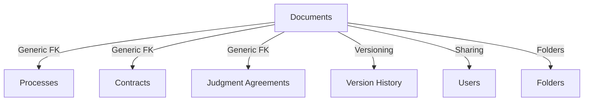
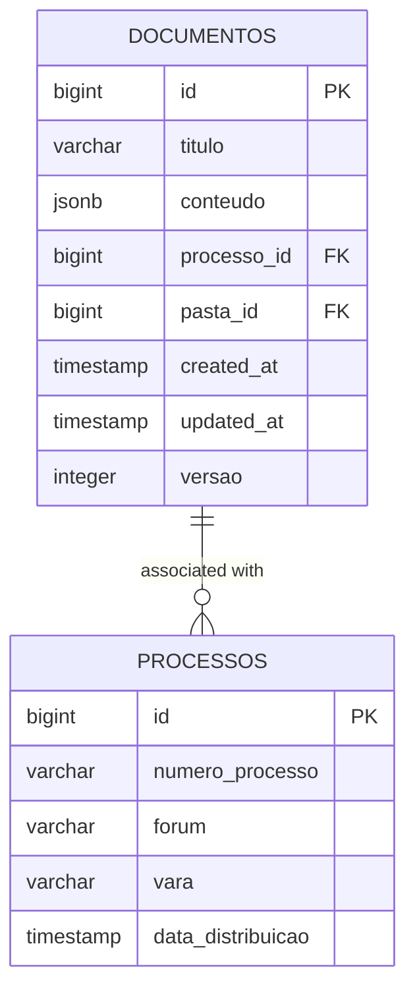
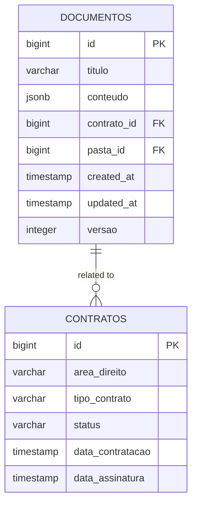
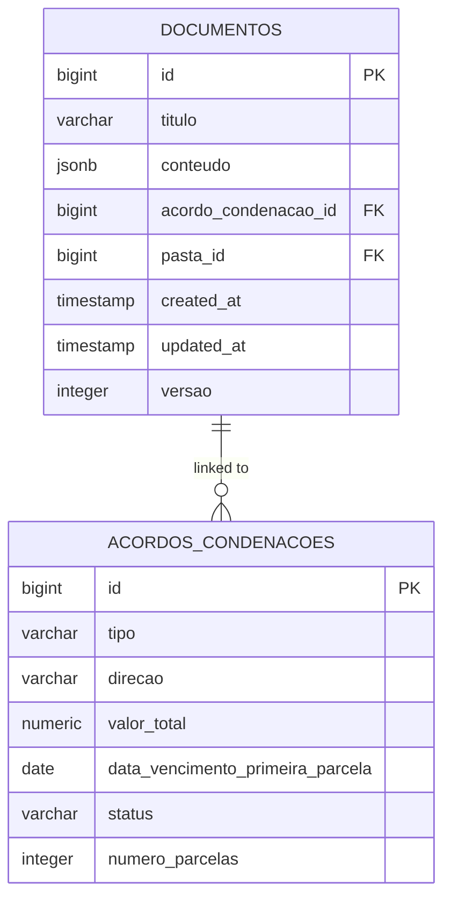
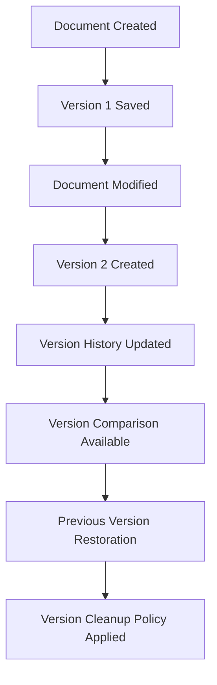
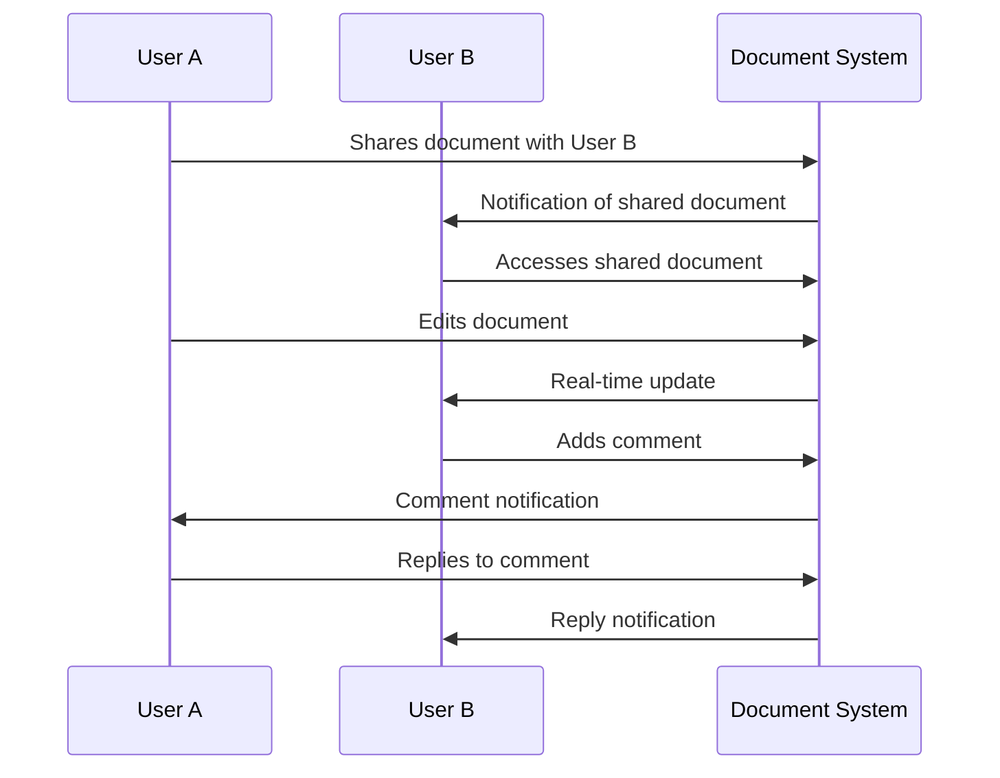

# Document Relationships

<cite>
**Referenced Files in This Document**   
- [documentos-persistence.service.ts](file://backend/documentos/services/persistence/documentos-persistence.service.ts)
- [versoes-persistence.service.ts](file://backend/documentos/services/persistence/versoes-persistence.service.ts)
- [compartilhamento-persistence.service.ts](file://backend/documentos/services/persistence/compartilhamento-persistence.service.ts)
- [11_contratos.sql](file://supabase/schemas/11_contratos.sql)
- [12_contrato_processos.sql](file://supabase/schemas/12_contrato_processos.sql)
- [20_acordos_condenacoes.sql](file://supabase/schemas/20_acordos_condenacoes.sql)
- [create_documentos_system.sql](file://supabase/migrations/aplicadas/20251130220000_create_documentos_system.sql)
</cite>

## Table of Contents
1. [Introduction](#introduction)
2. [Document Relationships Overview](#document-relationships-overview)
3. [Document to Process Relationships](#document-to-process-relationships)
4. [Document to Contract Relationships](#document-to-contract-relationships)
5. [Document to Judgment Agreement Relationships](#document-to-judgment-agreement-relationships)
6. [Document Versioning System](#document-versioning-system)
7. [Document Sharing and Collaboration](#document-sharing-and-collaboration)
8. [Document Query Examples](#document-query-examples)
9. [Conclusion](#conclusion)

## Introduction
The Sinesys system implements a comprehensive document management system that enables legal professionals to organize, track, and collaborate on various types of legal documents. This documentation details the relationships between documents and key entities in the system, including processes, contracts, and judgment agreements. The system uses a generic foreign key pattern to establish flexible relationships between documents and other entities, allowing for efficient document organization and retrieval.

**Section sources**
- [documentos-persistence.service.ts](file://backend/documentos/services/persistence/documentos-persistence.service.ts#L1-L428)

## Document Relationships Overview
The Sinesys document system is designed with a flexible architecture that allows documents to be associated with multiple entity types through a generic relationship pattern. Documents can be linked to processes, contracts, judgment agreements, and other entities, enabling comprehensive document management across different legal contexts. The system supports document versioning, sharing, and collaboration features that facilitate teamwork among legal professionals.



**Diagram sources**
- [create_documentos_system.sql](file://supabase/migrations/aplicadas/20251130220000_create_documentos_system.sql)

## Document to Process Relationships
Documents are linked to legal processes through a direct relationship in the system. Each document can be associated with a specific process, allowing users to organize all case-related documents within the context of the legal proceeding. The relationship is established through the `processo_id` field in the document entity, which references the process identifier in the system's process management module.

When a document is associated with a process, it becomes accessible through the process dashboard, enabling users to quickly find all documents related to a specific case. This relationship supports various document types, including pleadings, evidence, correspondence, and internal memos related to the process.



**Diagram sources**
- [create_documentos_system.sql](file://supabase/migrations/aplicadas/20251130220000_create_documentos_system.sql)
- [documentos-persistence.service.ts](file://backend/documentos/services/persistence/documentos-persistence.service.ts#L19-L238)

## Document to Contract Relationships
The system establishes relationships between documents and contracts through a dedicated linking mechanism. Documents related to contracts, such as contract drafts, amendments, and related correspondence, can be associated with specific contract records in the system. This relationship enables users to maintain a complete document history for each contract throughout its lifecycle.

The contract-document relationship supports various contract types, including client agreements, partnership agreements, and settlement agreements. Users can navigate from a contract record to view all associated documents or search for documents by contract identifier, facilitating efficient document retrieval and management.



**Diagram sources**
- [11_contratos.sql](file://supabase/schemas/11_contratos.sql#L4-L86)
- [documentos-persistence.service.ts](file://backend/documentos/services/persistence/documentos-persistence.service.ts#L19-L238)

## Document to Judgment Agreement Relationships
Documents are connected to judgment agreements (acordos condenações) through a specific relationship that enables comprehensive management of agreement-related documentation. This includes settlement agreements, court-ordered payments, and related financial arrangements. The system allows documents such as agreement drafts, payment schedules, and execution records to be linked to specific judgment agreement records.

The relationship between documents and judgment agreements supports the tracking of agreement execution, including payment documentation and compliance records. This integration ensures that all relevant documents are readily available when managing judgment agreements and their associated financial obligations.



**Diagram sources**
- [20_acordos_condenacoes.sql](file://supabase/schemas/20_acordos_condenacoes.sql#L6-L22)
- [documentos-persistence.service.ts](file://backend/documentos/services/persistence/documentos-persistence.service.ts#L19-L238)

## Document Versioning System
The Sinesys system implements a robust document versioning system that maintains historical versions of all documents. Each time a document is modified, the system automatically creates a new version, preserving the previous state for audit and reference purposes. The versioning system tracks changes with metadata including the version number, modification timestamp, and the user who made the changes.

The version history allows users to compare different versions of a document, restore previous versions when needed, and understand the evolution of document content over time. The system supports version comparison, enabling users to identify specific changes between versions. Version cleanup policies can be configured to maintain only the most recent N versions, optimizing storage while preserving essential history.



**Diagram sources**
- [versoes-persistence.service.ts](file://backend/documentos/services/persistence/versoes-persistence.service.ts#L1-L397)
- [documentos-persistence.service.ts](file://backend/documentos/services/persistence/documentos-persistence.service.ts#L218-L247)

## Document Sharing and Collaboration
The document sharing and collaboration system enables multiple users to work on the same document with controlled access permissions. Users can share documents with colleagues, assigning specific permissions such as view-only, edit, or owner rights. The system tracks document access and modifications, providing an audit trail of collaborative activities.

Real-time collaboration features allow multiple users to edit a document simultaneously, with changes synchronized across all participants. The system supports comment threads, mention notifications, and change tracking, facilitating effective communication and coordination among team members. Document locking prevents conflicting edits and ensures data integrity during collaborative editing sessions.



**Diagram sources**
- [compartilhamento-persistence.service.ts](file://backend/documentos/services/persistence/compartilhamento-persistence.service.ts#L1-L344)
- [documentos-persistence.service.ts](file://backend/documentos/services/persistence/documentos-persistence.service.ts#L346-L427)

## Document Query Examples
The system supports various query patterns for retrieving documents based on their relationships with other entities. These queries enable users to find documents efficiently based on specific criteria, such as association with a particular process, contract, or judgment agreement.

### Finding Documents by Process
To retrieve all documents associated with a specific process, the system uses a query that filters documents by the process identifier:

```sql
SELECT * FROM documentos 
WHERE processo_id = $1 
AND deleted_at IS NULL 
ORDER BY updated_at DESC;
```

### Finding Documents by Contract
To find all documents related to a specific contract, the query filters by the contract identifier:

```sql
SELECT * FROM documentos 
WHERE contrato_id = $1 
AND deleted_at IS NULL 
ORDER BY updated_at DESC;
```

### Finding Document Versions
To retrieve all versions of a specific document, including metadata about the user who created each version:

```sql
SELECT dv.*, u.nome_completo as criador_nome 
FROM documentos_versoes dv 
JOIN usuarios u ON dv.criado_por = u.id 
WHERE dv.documento_id = $1 
ORDER BY dv.versao DESC;
```

### Finding Shared Documents
To identify all documents shared with a specific user, the system queries the document sharing relationship table:

```sql
SELECT d.*, dc.permissao 
FROM documentos d 
JOIN documentos_compartilhados dc ON d.id = dc.documento_id 
WHERE dc.usuario_id = $1 
AND d.deleted_at IS NULL 
ORDER BY d.updated_at DESC;
```

**Section sources**
- [documentos-persistence.service.ts](file://backend/documentos/services/persistence/documentos-persistence.service.ts#L108-L177)
- [versoes-persistence.service.ts](file://backend/documentos/services/persistence/versoes-persistence.service.ts#L94-L129)
- [compartilhamento-persistence.service.ts](file://backend/documentos/services/persistence/compartilhamento-persistence.service.ts#L109-L147)

## Conclusion
The Sinesys document relationship system provides a comprehensive framework for managing legal documents in relation to key entities such as processes, contracts, and judgment agreements. Through the use of generic foreign key patterns, the system enables flexible document associations that support various legal workflows. The integrated versioning system ensures document history is preserved, while sharing and collaboration features facilitate teamwork among legal professionals. These capabilities collectively enhance document organization, retrieval, and management within the legal practice environment.